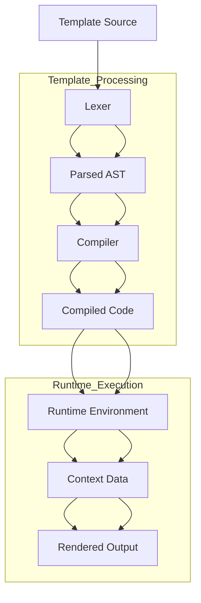

# `Jinja2`

## Repository Overview

### Tree Structure
```
Jinja2/
├── docs/          # Documentation and examples for advanced template extensions
│   └── examples/  # Reusable template extensions for advanced templating
├── scripts/       # Utility scripts for development and maintenance
│   └── generate_identifier_pattern.py  # Generates regex patterns for Python identifiers
└── src/           # Core Jinja2 source code
    ├── async_utils.py     # Asynchronous utilities for template processing
    ├── debug.py           # Debugging tools for template development
    ├── lexer.py           # Lexical analysis for template tokenization
    ├── nativetypes.py     # Native Python type definitions for templates
    ├── optimizer.py       # Template optimization routines
    ├── sandbox.py         # Security and sandboxing mechanisms
    ├── tests.py           # Template testing predicates and utilities
    └── utils.py           # General-purpose utilities for template processing
```

### Purpose
Jinja2 is a fast, expressive, and extensible templating engine for Python. It provides a rich set of features for generating dynamic content from templates, making it ideal for web applications, document generation, and any scenario requiring template-based content creation.

**Target Users:**
- Web developers building Flask, Django, or other Python web applications
- Content creators needing dynamic document generation
- Developers requiring flexible template systems for configuration files or reports
- Anyone needing to separate presentation logic from business logic

**Use Cases:**
- Web page generation in web frameworks
- Email template rendering
- Configuration file generation
- Report and document formatting
- Static site generation

### Architecture
Jinja2 follows a modular architecture with distinct phases of template processing:



Key architectural patterns:
- **Pipeline Architecture**: Templates flow through distinct stages (lexing → parsing → compilation → execution)
- **Plugin System**: Extensions can be registered to add custom functionality
- **Separation of Concerns**: Each module handles a specific aspect of template processing
- **Security Sandboxing**: Built-in protections against malicious template code

### Entry Points
**Importable APIs:**
- `jinja2.Environment` - Main interface for template management and rendering
- `jinja2.Template` - Direct template object for rendering
- `jinja2.render_template()` - Convenience function for quick rendering
- `jinja2.from_string()` - Create template from string content

**CLI Commands:**
- Not explicitly mentioned in the repository structure, but Jinja2 typically provides command-line utilities for template testing and processing

### Core Features
1. **Template Inheritance** - Extend and override template blocks
2. **Filters and Tests** - Built-in and custom transformation functions
3. **Macros** - Reusable template fragments with parameters
4. **Control Structures** - Conditionals, loops, and expressions
5. **Extensions** - Custom functionality through extension system
6. **Security** - Sandboxed execution environment
7. **Asynchronous Support** - Async template rendering capabilities
8. **Debugging Tools** - Detailed error reporting and debugging utilities

### Dependencies
- **markupsafe**: For HTML-safe string handling
- **typing**: For type annotations and static type checking
- **collections.deque**: For efficient caching operations
- **enum**: For defining enumerations
- **functools**: For function composition and decorators
- **json**: For JSON serialization in utilities
- **os**: For file system operations
- **re**: For regular expression operations
- **sys**: For system-specific operations
- **threading**: For thread-safe operations in caches

### Configuration
Configuration primarily occurs through the `Environment` class constructor and template options:
- Template loader configuration
- Filter and test registration
- Extension management
- Security settings
- Cache size and behavior

### Extension Points
Jinja2 supports extensive customization through:
- **Custom Filters**: Add new transformation functions
- **Custom Tests**: Add new conditional predicates
- **Template Extensions**: Add new syntax or functionality
- **Custom Loaders**: Implement alternative template storage
- **Security Policies**: Customize sandbox restrictions
- **Custom Compilers**: Modify template compilation process

---

## Modules

- [`docs`](docs.md)
- [`docs/examples`](docs/examples.md)
- [`scripts`](scripts.md)
- [`src`](src.md)
- [`src/jinja2`](src/jinja2.md)

