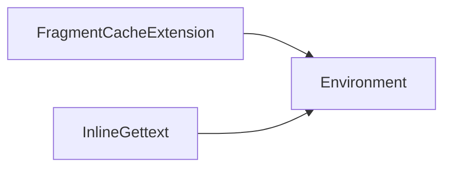

# `docs.examples`

## Tree:
examples/
├── cache_extension.py
└── inline_gettext_extension.py

## Role:
Provides reusable Jinja2 template extensions for advanced templating features including fragment caching and inline gettext conversion.

## Description:
This module contains utility extensions for Jinja2 template engines that add advanced functionality to template rendering. These extensions are designed to be imported and registered with Jinja2 environments to enable features like template fragment caching and inline internationalization support.

The module serves as a collection point for reusable template extensions that enhance the basic Jinja2 functionality without requiring custom template syntax or complex integration logic.

## Components:
*   `FragmentCacheExtension` - Implements a custom "cache" tag for caching template fragments with configurable timeouts
*   `InlineGettext` - Converts inline gettext expressions into proper Jinja2 translation blocks for internationalization

## Public API:
*   `FragmentCacheExtension` - Jinja2 extension class for template fragment caching
*   `InlineGettext` - Jinja2 extension class for inline gettext expression conversion

## Dependencies:
*   `jinja2` - Required for Jinja2 extension base classes and template parsing functionality
*   `re` - Used for regular expression pattern matching in the inline gettext extension

## Constraints:
*   Both extensions require a valid Jinja2 Environment instance for initialization
*   `FragmentCacheExtension` requires the environment to have a `fragment_cache` attribute configured for actual caching to work
*   `InlineGettext` requires templates to contain valid gettext expressions for processing

---

## Files

- [`cache_extension.py`](examples/cache_extension.md)
- [`inline_gettext_extension.py`](examples/inline_gettext_extension.md)

