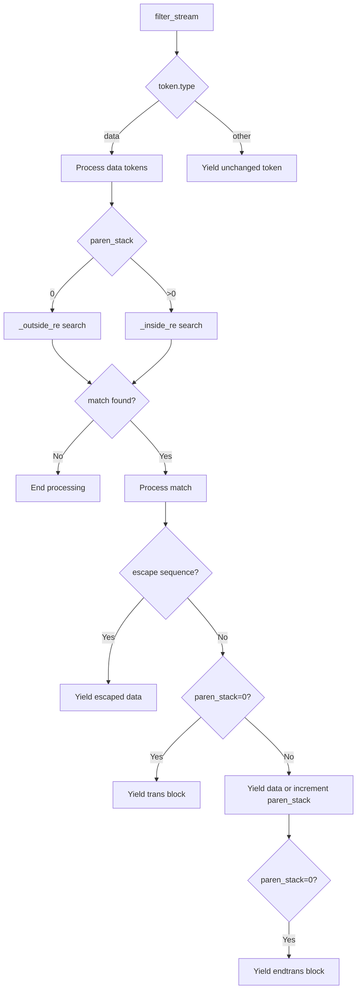

# `inline_gettext_extension.py`

## `docs.examples.inline_gettext_extension.InlineGettext` · *class*

## Summary:
A Jinja2 extension that converts inline gettext expressions into proper Jinja2 translation blocks.

## Description:
This class extends Jinja2's Extension class to process template streams and transform inline gettext expressions (such as _("text")) into proper Jinja2 translation blocks. It enables internationalization support directly within templates by converting expressions like _("Hello World") into Jinja2 trans/endtrans blocks. This extension is designed to be registered with a Jinja2 Environment to preprocess templates containing gettext expressions.

## State:
- paren_stack: int - Tracks nesting level of parentheses in gettext expressions, initialized to 0 at the start of each token processing
- _outside_re: compiled regex pattern - Matches gettext expressions outside of parentheses (likely defined at module level)
- _inside_re: compiled regex pattern - Matches gettext expressions inside parentheses (likely defined at module level)

## Lifecycle:
- Creation: Instantiated as part of Jinja2 template configuration; no special constructor arguments required
- Usage: Called automatically by Jinja2 during template compilation when the extension is registered via Environment.extensions
- Destruction: Managed by Jinja2's lifecycle management; no explicit cleanup required

## Method Map:


## Raises:
- TemplateSyntaxError: When encountering unclosed gettext expressions in templates, indicating malformed gettext syntax

## Example:
```python
# Registering the extension with Jinja2 environment
from jinja2 import Environment
from docs.examples.inline_gettext_extension import InlineGettext

env = Environment(extensions=[InlineGettext])
template = env.from_string(_('Hello {{ name }}'))
```

