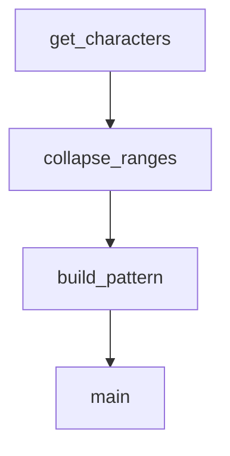

# `scripts`

## Tree:
scripts/
└── generate_identifier_pattern.py

## Role:
This module generates a regex pattern for validating Python identifiers by identifying special Unicode characters that are valid in identifiers but not part of the standard word character class.

## Description:
This module provides functionality to automatically generate a regex pattern that matches valid Python identifiers, including support for Unicode characters beyond the standard ASCII word characters. The module is designed as a standalone script that regenerates identifier validation patterns when underlying character identification logic changes.

The components work together to identify special Unicode identifier characters, group them into contiguous ranges, compress those ranges into compact string representations, and finally write the complete pattern to a source file for use in the Jinja2 template engine.

Primary consumers of this module include the Jinja2 template engine's identifier validation system and development workflows that require regeneration of identifier patterns.

## Components:
- build_pattern(ranges): Converts character ranges into a compact pattern string representation
- collapse_ranges(data): Collapses sequences of consecutive characters into range tuples
- get_characters(): Generates Unicode characters valid in Python identifiers but not word characters
- main(): Entry point that orchestrates pattern generation and file writing

## Public API:
- build_pattern(ranges): Converts character pairs into compact pattern string
- collapse_ranges(data): Generator yielding (start_char, end_char) tuples for contiguous character sequences
- get_characters(): Generator yielding Unicode characters valid in Python identifiers but not word characters
- main(): Generates and writes regex pattern to src/jinja2/_identifier.py

## Dependencies:
- itertools: Used in collapse_ranges for grouping consecutive elements
- os: Used in main for file path manipulation and writing
- re: Used in main for compiling the final regex pattern
- sys: Used in get_characters to access max unicode value

## Constraints:
- The script must be run from its directory location
- Target file path must be writable
- Helper functions must be properly implemented
- All Unicode code points are processed, which may result in significant execution time

---

## Files

- [`generate_identifier_pattern.py`](scripts/generate_identifier_pattern.md)

