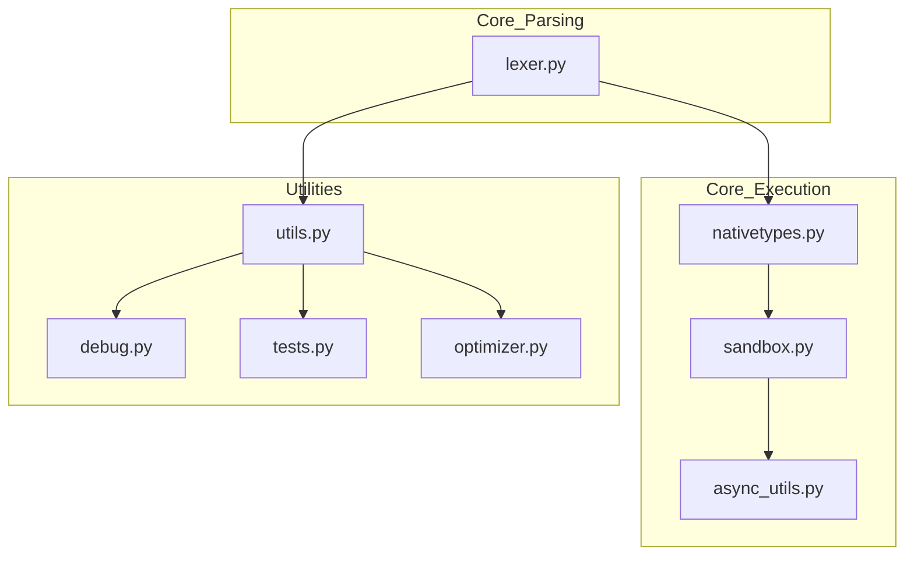

# `src`

## Tree:
jinja2/
├── async_utils.py
├── debug.py
├── lexer.py
├── nativetypes.py
├── optimizer.py
├── sandbox.py
├── tests.py
├── utils.py

## Role:
Provides core templating functionality for Jinja2, including parsing, compiling, and rendering of templates with support for various features like filters, tests, and custom extensions.

## Description:
The jinja2 module serves as the central hub of the Jinja2 templating engine, providing all essential functionality for template processing. It manages the core components responsible for parsing template syntax, compiling templates into executable bytecode, and rendering templates with provided context data. The module is organized around several key subsystems that work together to deliver a robust and extensible templating experience.

This module is used throughout the Jinja2 ecosystem as the foundation for all template-related operations. It's consumed by the main template rendering engine, testing frameworks, and various utility functions that need to work with template syntax and semantics.

## Components:
- async_utils.py: Provides asynchronous utility functions for template processing
- debug.py: Contains debugging tools and utilities for template development
- lexer.py: Implements the lexical analysis phase that converts template text into tokens
- nativetypes.py: Defines native Python types and their behaviors within the templating context
- optimizer.py: Contains optimization routines for improving template performance
- sandbox.py: Implements security measures and sandboxing for template execution
- tests.py: Provides testing utilities and predicates for template conditionals
- utils.py: Offers general-purpose utilities for template processing and manipulation

## Public API:
- async_utils: Asynchronous template processing utilities
- debug: Debugging and profiling tools for template development
- lexer: Tokenization of template text into parseable components
- nativetypes: Native type definitions and behaviors for template context
- optimizer: Performance optimization for compiled templates
- sandbox: Security and execution context controls
- tests: Template testing predicates and utilities
- utils: General utilities for template manipulation and processing

## Dependencies:
- Internal imports: None (this is the root module)
- External imports: 
  - collections.deque: For efficient queue operations in LRUCache
  - enum: For defining PassArg enumeration
  - functools: For partial function application and decorators
  - json: For JSON serialization in htmlsafe_json_dumps
  - markupsafe: For HTML-safe string handling
  - os: For file system operations in open_if_exists
  - re: For regular expression operations in urlize
  - sys: For system-specific operations
  - threading: For thread-safe cache operations
  - typing: For type annotations

## Constraints:
- Thread-safety: Some components (like LRUCache) are thread-safe, others are not
- Initialization: Certain components require proper initialization before use
- Ordering: Template compilation and rendering must follow specific phases
- Memory management: Caching components have finite capacity limits

## Component Interactions:

