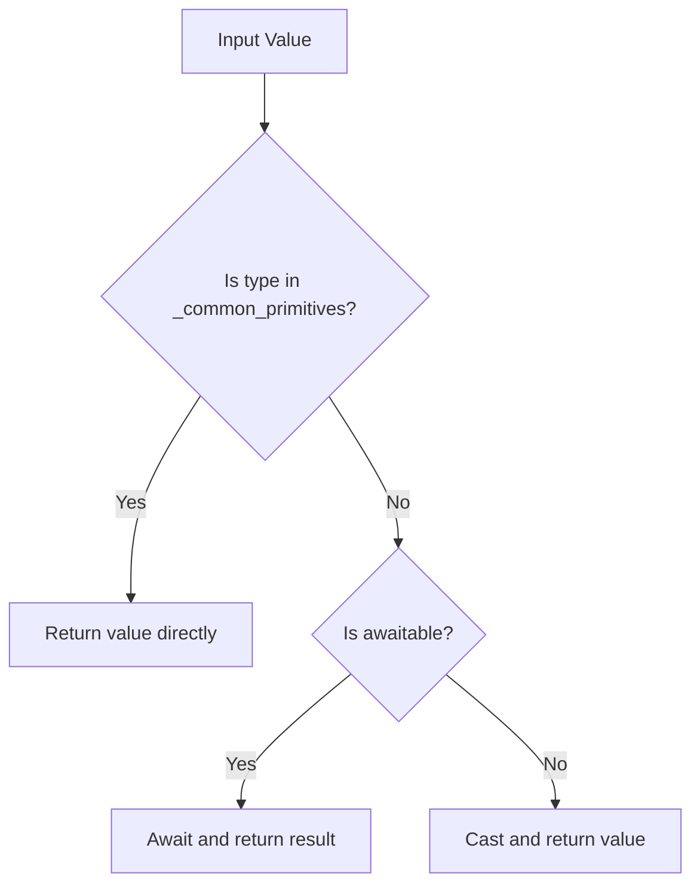

# `async_utils.py`

## `src.jinja2.async_utils.async_variant` · *function*

## Summary:
Creates a hybrid synchronous/asynchronous function wrapper that automatically selects the appropriate implementation based on the execution context.

## Description:
This decorator factory enables defining both synchronous and asynchronous variants of the same function, allowing automatic selection between implementations based on the Jinja2 template execution context. The wrapper function detects whether it's being called in synchronous or asynchronous context and routes execution accordingly.

The function is designed to support Jinja2 template rendering where some operations may need to be performed asynchronously while others remain synchronous, providing a unified interface for both contexts. It handles complex argument passing logic based on how the original function was decorated with `pass_eval_context`.

## Args:
    normal_func (callable): The synchronous version of the function to be wrapped. This function is called when executing in synchronous context.

## Returns:
    callable: A decorator function that accepts an asynchronous version of the function and returns a wrapper that intelligently routes calls to either the sync or async implementation.

## Raises:
    None explicitly raised by this function. Exceptions would propagate from the underlying functions being called.

## Constraints:
    Preconditions:
    - The normal_func parameter must be a callable that can accept the same arguments as the async_func
    - Both functions should have compatible signatures for the same operation
    - The async_func parameter must be a coroutine function
    
    Postconditions:
    - The returned wrapper function maintains the signature and behavior of the original functions
    - The wrapper properly detects execution context and routes to appropriate implementation
    - The wrapper has a `jinja_async_variant` attribute set to True
    - When the normal function was decorated with `pass_eval_context`, the wrapper adjusts argument passing by removing the first argument before calling the underlying functions

## Side Effects:
    None directly caused by this function. However, the wrapper may cause side effects when it executes either the normal or async function, depending on the context.

## Control Flow:
```mermaid
flowchart TD
    A[async_variant called with normal_func] --> B[Returns decorator]
    B --> C[decorator called with async_func]
    C --> D[Create wrapper function]
    D --> E[Determine pass_arg via _PassArg.from_obj(normal_func)]
    E --> F{pass_arg is None?}
    F -->|Yes| G[need_eval_context = True]
    F -->|No| H[need_eval_context = False]
    G --> I[is_async checks args[0].environment.is_async]
    H --> I
    I --> J{pass_arg is environment?}
    J -->|Yes| K[is_async checks args[0].is_async]
    J -->|No| L[is_async checks args[0].environment.is_async]
    K --> M[Check if async context]
    L --> M
    M --> N{Is async context?}
    N -->|Yes| O[Call async_func(*args, **kwargs)]
    N -->|No| P[Call normal_func(*args, **kwargs)]
    O --> Q[Return async result]
    P --> Q
    Q --> R{need_eval_context?}
    R -->|Yes| S[args = args[1:]]
    S --> T[Return result]
    R -->|No| T
```

## Examples:
```python
# Define synchronous version with pass_eval_context decorator
@pass_eval_context
def render_template(name, context):
    # Synchronous implementation
    return f"Sync: {name} with {context}"

# Define asynchronous version  
async def render_template_async(name, context):
    # Asynchronous implementation
    await asyncio.sleep(0.1)
    return f"Async: {name} with {context}"

# Apply the decorator
render_template = async_variant(render_template)(render_template_async)

# In synchronous context, calls sync version
result1 = render_template("test", {"key": "value"})

# In asynchronous context, calls async version
result2 = await render_template("test", {"key": "value"})
```

## `src.jinja2.async_utils.auto_await` · *function*

## Summary:
Automatically resolves asynchronous values by awaiting them when necessary, returning synchronous values unchanged.

## Description:
This utility function serves as a bridge between synchronous and asynchronous code in Jinja2 template processing. It handles values that may be either regular values or awaitable objects, ensuring consistent handling regardless of the underlying type. This is particularly useful in template contexts where variables might be computed synchronously or asynchronously.

## Args:
    value (Union[Awaitable[V], V]): A value that may be either a synchronous value of type V or an awaitable object that will produce a value of type V.

## Returns:
    V: The resolved value, either returned directly if it's a synchronous value or awaited and returned if it's an awaitable.

## Raises:
    None explicitly raised by this function, though underlying await operations may propagate exceptions from the awaited coroutines.

## Constraints:
    Preconditions:
    - The input value must be either a synchronous value or an awaitable object
    - The generic type parameter V should be consistent throughout usage
    
    Postconditions:
    - The returned value will always be of type V (either directly from the input or resolved from an awaitable)

## Side Effects:
    None directly caused by this function, but awaiting an awaitable may cause I/O operations or other side effects depending on what the awaitable represents.

## Control Flow:


## Examples:
```python
# Usage with synchronous value
result = await auto_await(42)  # Returns 42

# Usage with asynchronous value  
async def async_func():
    return "hello"
result = await auto_await(async_func())  # Returns "hello" after awaiting
```

## `src.jinja2.async_utils.auto_aiter` · *function*

## Summary:
Converts a synchronous or asynchronous iterable into an asynchronous iterator.

## Description:
This function provides a unified interface for iterating over both synchronous and asynchronous iterables. It automatically detects whether the input iterable supports asynchronous iteration by checking for the presence of the `__aiter__` method. If present, it uses asynchronous iteration; otherwise, it falls back to synchronous iteration.

The function is designed to be used in contexts where code needs to handle both sync and async iterables transparently, such as in template rendering systems that may encounter different types of data sources.

## Args:
    iterable (Union[AsyncIterable[V], Iterable[V]]): An iterable that can be either synchronous or asynchronous. The iterable must support the standard iteration protocol.

## Returns:
    AsyncIterator[V]: An asynchronous iterator that yields items from the input iterable, regardless of whether it was originally synchronous or asynchronous.

## Raises:
    None explicitly raised - the function delegates to the underlying iteration mechanisms which may raise their own exceptions.

## Constraints:
    Preconditions:
    - The input iterable must be iterable (support __iter__ or __aiter__ methods)
    - The iterable must be valid for the iteration protocol it uses
    
    Postconditions:
    - The returned async iterator will yield all items from the input iterable
    - The iteration order is preserved from the original iterable

## Side Effects:
    None - This function is a pure generator that doesn't modify external state or perform I/O operations.

## Control Flow:
```mermaid
flowchart TD
    A[Start auto_aiter] --> B{hasattr(iterable, "__aiter__")}
    B -- True --> C[async for item in iterable]
    B -- False --> D[for item in iterable]
    C --> E[yield item]
    D --> E
    E --> F[Return async iterator]
```

## Examples:
```python
# Usage with synchronous iterable
sync_list = [1, 2, 3, 4]
async for item in auto_aiter(sync_list):
    print(item)  # Prints: 1, 2, 3, 4

# Usage with asynchronous iterable
async def async_gen():
    for i in range(4):
        yield i

async for item in auto_aiter(async_gen()):
    print(item)  # Prints: 0, 1, 2, 3
```

## `src.jinja2.async_utils.auto_to_list` · *function*

## Summary:
Converts an asynchronous or synchronous iterable into a list by transparently handling both iteration types.

## Description:
This function provides a convenient way to transform any iterable (whether synchronous or asynchronous) into a concrete list. It leverages the `auto_aiter` utility to automatically detect and handle the appropriate iteration protocol, making it suitable for contexts where the input type may vary.

The function is particularly useful in template rendering systems where data sources might be either synchronous collections or asynchronous generators, allowing uniform processing without needing to distinguish between them.

## Args:
    value (Union[AsyncIterable[V], Iterable[V]]): An iterable that can be either synchronous or asynchronous. This parameter accepts any object that implements the iteration protocol, including lists, tuples, generators, async generators, and custom iterable objects.

## Returns:
    List[V]: A list containing all items from the input iterable in the same order. The returned list will contain the same elements as the input iterable, but converted to a concrete list structure.

## Raises:
    None explicitly raised - the function delegates to `auto_aiter` and the underlying iteration mechanisms which may raise their own exceptions (such as TypeError for invalid iterables).

## Constraints:
    Preconditions:
    - The input value must be iterable (support __iter__ or __aiter__ methods)
    - The iterable must be valid for the iteration protocol it uses
    
    Postconditions:
    - The returned list contains all items from the input iterable
    - The iteration order is preserved from the original iterable
    - The result is always a concrete list object

## Side Effects:
    None - This function is a pure transformation that doesn't modify external state or perform I/O operations.

## Control Flow:
```mermaid
flowchart TD
    A[Start auto_to_list] --> B[value is AsyncIterable or Iterable?]
    B --> C{auto_aiter(value) called}
    C --> D[async for x in auto_aiter(value)]
    D --> E[Build list from async iteration]
    E --> F[Return list]
```

## Examples:
```python
# Usage with synchronous iterable
sync_list = [1, 2, 3, 4]
result = await auto_to_list(sync_list)
print(result)  # Output: [1, 2, 3, 4]

# Usage with asynchronous iterable
async def async_gen():
    for i in range(4):
        yield i

result = await auto_to_list(async_gen())
print(result)  # Output: [0, 1, 2, 3]
```

