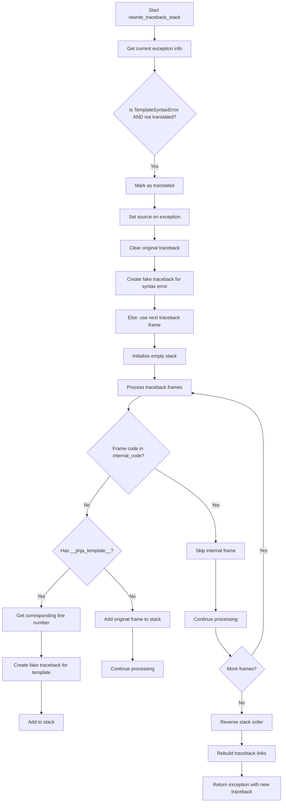

# `debug.py`

## `src.jinja2.debug.rewrite_traceback_stack` · *function*

## Summary:
Rewrites traceback information to provide clearer debugging context for Jinja2 template errors by filtering internal frames and mapping template line numbers to actual source locations.

## Description:
This function processes the current exception's traceback to enhance debugging information for Jinja2 templates. It filters out internal implementation frames, maps template execution line numbers to their corresponding source locations, and creates a cleaner traceback that points to the actual template code rather than internal Jinja2 machinery. This function is particularly important for TemplateSyntaxError handling where it marks errors as translated and associates them with source code.

## Args:
    source (Optional[str]): The source code of the template being processed, used to associate template source with syntax errors. Defaults to None.

## Returns:
    BaseException: The original exception with a rewritten traceback that provides better debugging context for template-related errors.

## Raises:
    None explicitly raised - but may propagate exceptions from underlying operations like fake_traceback creation.

## Constraints:
    Preconditions:
    - Must be called within an exception handler (sys.exc_info() must contain exception information)
    - The current exception must be a valid BaseException instance
    - TemplateSyntaxError instances must have appropriate attributes (translated, filename, lineno) when processed
    
    Postconditions:
    - Returns the same exception instance but with an updated traceback chain
    - The traceback chain excludes internal Jinja2 implementation frames
    - Template line numbers are properly mapped to source locations

## Side Effects:
    None directly observable, but modifies the traceback chain of the exception being processed

## Control Flow:


## Examples:
    # Typical usage in template error handling
    try:
        template.render(context)
    except Exception as e:
        # Rewrite traceback to show template source locations
        raise rewrite_traceback_stack() from e
```

## `src.jinja2.debug.fake_traceback` · *function*

## Summary:
Creates a fake traceback for Jinja2 template errors to provide enhanced debugging information.

## Description:
This function generates a synthetic traceback that maps template execution errors back to their original template location. It's used during template error handling to provide meaningful stack traces that show where in the template code the error occurred, rather than just showing internal Jinja2 implementation details. The function constructs a fake code object that simulates the template execution environment and raises the exception to capture the proper traceback chain.

## Args:
    exc_value (BaseException): The original exception that occurred during template rendering
    tb (Optional[TracebackType]): The original traceback object, or None if not available
    filename (str): The template filename where the error occurred
    lineno (int): The line number in the template where the error occurred

## Returns:
    TracebackType: A traceback object pointing to the template location where the error occurred

## Raises:
    None explicitly raised - but may raise exceptions during code compilation or execution which are caught and handled internally

## Constraints:
    Preconditions:
    - exc_value must be a valid BaseException instance
    - filename must be a valid string representing a template file path
    - lineno must be a positive integer indicating the line number in the template
    
    Postconditions:
    - Returns a valid TracebackType object that can be used for error reporting
    - The returned traceback accurately reflects the template location of the error

## Side Effects:
    None directly observable, but internally uses sys.exc_info() to capture traceback information

## Control Flow:
```mermaid
flowchart TD
    A[Start fake_traceback] --> B{tb is not None?}
    B -- Yes --> C[Extract template locals]
    C --> D[Remove __jinja_exception__ from locals]
    B -- No --> E[Initialize empty locals]
    E --> F[Initialize globals dict]
    F --> G[Compile fake code with raise statement]
    G --> H{tb is not None?}
    H -- Yes --> I[Get function name from tb frame]
    I --> J{Function is "root"?}
    J -- Yes --> K[Set location to "top-level template code"]
    J -- No --> L{Function starts with "block_"?}
    L -- Yes --> M[Set location to "block {name}"]
    L -- No --> N[Keep location as "template"]
    H -- No --> O[Skip function analysis]
    O --> P[Handle Python version compatibility]
    P --> Q[Create code object with proper co_name]
    Q --> R[Execute compiled code with globals and locals]
    R --> S{Exception raised?}
    S -- Yes --> T[Return sys.exc_info()[2].tb_next]
    S -- No --> U[Return None or handle normally]
```

## Examples:
    # Typical usage in template error handling
    try:
        template.render(context)
    except Exception as e:
        # Create fake traceback to show template location
        fake_tb = fake_traceback(e, sys.exc_info()[2], "my_template.html", 15)
        # Use fake_tb for better error reporting
        raise type(e)(str(e)).with_traceback(fake_tb)
```

## `src.jinja2.debug.get_template_locals` · *function*

## Summary:
Extracts and processes template local variables from a mapping, merging context data with local overrides while resolving variable precedence based on depth.

## Description:
This function is used to extract template local variables for debugging purposes, processing variables that follow the naming convention "l_{depth}_{variable_name}" and selecting the highest-depth version of each variable. It merges context data with local variable overrides, properly handling special "missing" values that indicate variable removal.

## Args:
    real_locals (Mapping[str, Any]): A mapping containing template local variables, potentially including a "context" key and variables prefixed with "l_" followed by depth and variable name.

## Returns:
    Dict[str, Any]: A dictionary containing merged template data with resolved variable precedence, where higher-depth variables override lower-depth ones, and "missing" values remove variables from the result.

## Raises:
    None explicitly raised - though ValueError could be raised internally during string parsing which would be silently handled.

## Constraints:
    Preconditions:
    - Input must be a mapping-like object
    - Variables with "l_" prefix should follow format "l_{depth}_{name}" for proper processing
    
    Postconditions:
    - Returned dictionary contains merged context and processed local variables
    - Variables with "missing" values are removed from the result
    - Only the highest-depth version of each variable is retained

## Side Effects:
    None

## Control Flow:
```mermaid
flowchart TD
    A[Start get_template_locals] --> B{ctx exists in real_locals?}
    B -- Yes --> C[Get ctx.get_all().copy()]
    B -- No --> D[data = {}]
    C --> E[data assigned to ctx data]
    D --> E
    E --> F[Initialize local_overrides dict]
    F --> G[Iterate real_locals items]
    G --> H{Variable name starts with "l_" AND value is not missing?}
    H -- No --> I[Continue to next item]
    H -- Yes --> J[Try split "l_{depth}_{name}"]
    J --> K{ValueError during split?}
    K -- Yes --> I
    K -- No --> L[Parse depth and name]
    L --> M[Get current depth for name]
    M --> N{Current depth < parsed depth?}
    N -- Yes --> O[Update local_overrides with new depth/value]
    N -- No --> P[Skip update]
    O --> P
    P --> Q[Process local_overrides entries]
    Q --> R[For each name/value in local_overrides]
    R --> S{value is missing?}
    S -- Yes --> T[Remove name from data]
    S -- No --> U[Set name=value in data]
    T --> V[Continue]
    U --> V
    V --> W[Return data]
```

## Examples:
    # Basic usage with context
    locals_dict = {"context": some_context, "l_0_var1": "value1", "l_1_var1": "value2"}
    result = get_template_locals(locals_dict)
    # Result would contain merged context data with var1 having "value2" (higher depth)
    
    # Usage with missing values
    locals_dict = {"context": some_context, "l_0_var1": "value1", "l_1_var1": missing}
    result = get_template_locals(locals_dict)
    # Result would contain merged context data with var1 removed

