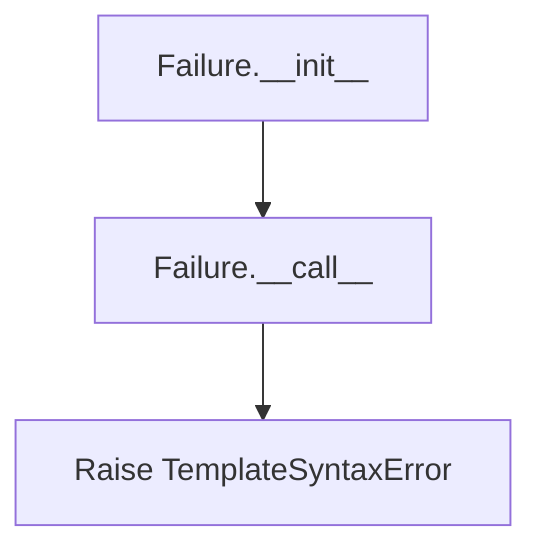
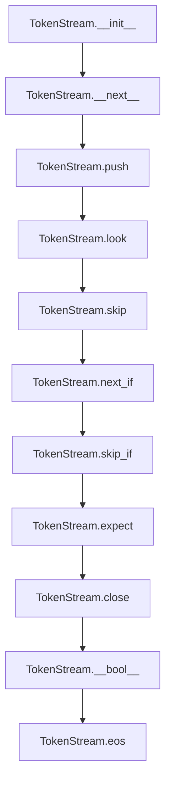
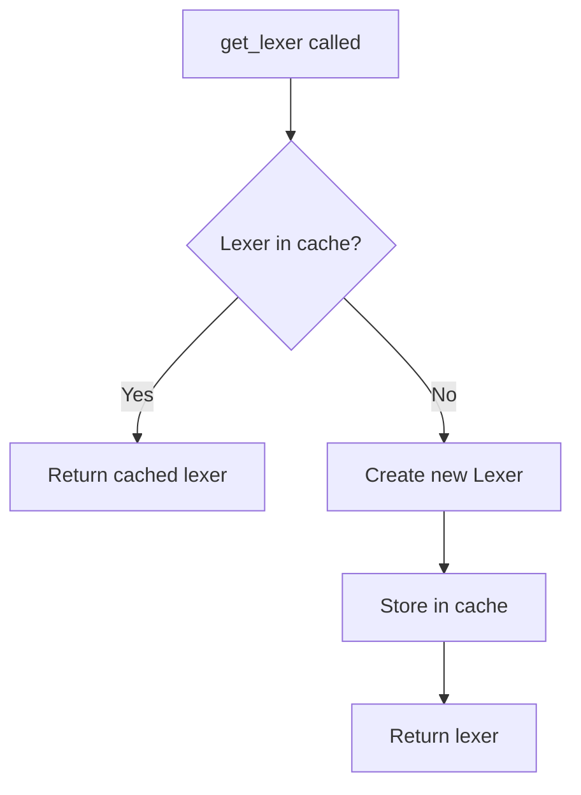
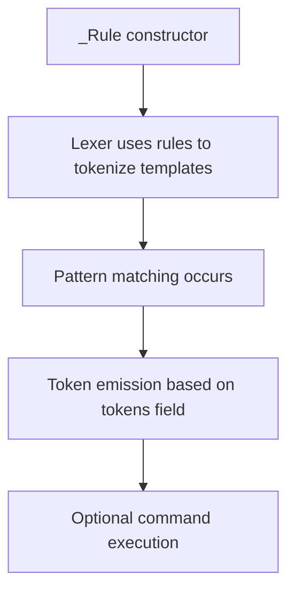
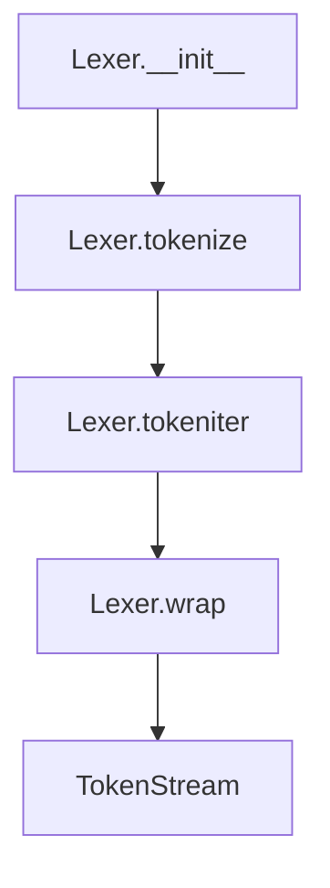

# `lexer.py`

## `src.jinja2.lexer._describe_token_type` · *function*

## Summary:
Maps internal token type identifiers to descriptive human-readable strings.

## Description:
This utility function converts internal token type constants into descriptive strings for debugging and error reporting purposes. It provides meaningful labels for different types of lexical tokens encountered during template parsing.

The function implements a two-tier lookup mechanism:
1. First checks if the token type exists in an internal reverse_operators mapping (used for operator tokens)
2. Then performs a dictionary lookup for standard token types with predefined descriptions
3. Returns the original token type string if no mapping is found

This centralized approach improves code maintainability and makes error messages more informative.

## Args:
    token_type (str): An internal identifier for a token type, such as 'TOKEN_COMMENT_BEGIN' or 'TOKEN_DATA'

## Returns:
    str: A human-readable description of the token type. For standard token types, returns predefined descriptions like "begin of comment" or "template data / text". For operator tokens that exist in reverse_operators, returns the reverse-mapped operator symbol. For unrecognized token types, returns the original token_type unchanged.

## Raises:
    None explicitly raised by this function. The function relies on external mappings (reverse_operators and token type dictionary) that may cause KeyError if improperly configured.

## Constraints:
    Preconditions:
    - The token_type parameter must be a string
    - The reverse_operators dictionary must be accessible and properly initialized
    - All referenced TOKEN_* constants must be defined in the module scope
    
    Postconditions:
    - Always returns a string value
    - For known token types, returns descriptive text
    - For unknown token types, returns the original token_type unchanged

## Side Effects:
    None - This function is pure and has no side effects.

## Control Flow:
```mermaid
flowchart TD
    A[Start _describe_token_type] --> B{token_type in reverse_operators?}
    B -- Yes --> C[Return reverse_operators[token_type]]
    B -- No --> D[Lookup in token_type_dict]
    D --> E{token_type found?}
    E -- Yes --> F[Return description]
    E -- No --> G[Return token_type]
```

## Examples:
    >>> _describe_token_type("TOKEN_COMMENT_BEGIN")
    "begin of comment"
    
    >>> _describe_token_type("TOKEN_DATA")
    "template data / text"
    
    >>> _describe_token_type("UNKNOWN_TOKEN")
    "UNKNOWN_TOKEN"

## `src.jinja2.lexer.describe_token` · *function*

## Summary:
Returns a human-readable description of a token for debugging and error reporting purposes.

## Description:
Provides a descriptive string representation of a token that helps with debugging template parsing issues. When the token is a name token (TOKEN_NAME), it returns the token's raw value. For all other token types, it delegates to _describe_token_type to provide a description when available, or returns the original token type string if no mapping exists.

This function serves as a unified interface for token description throughout the Jinja2 template engine, ensuring consistent formatting of token information in error messages and debug output.

## Args:
    token (Token): A token object containing line number, type, and value information

## Returns:
    str: For TOKEN_NAME tokens, returns the token's value directly. For other token types, returns either a descriptive string from _describe_token_type when a mapping exists, or the original token type string if no mapping is found.

## Raises:
    None explicitly raised by this function

## Constraints:
    Preconditions:
    - The token parameter must be a valid Token instance with lineno, type, and value attributes
    - The token.type attribute must be a string
    - TOKEN_NAME constant must be defined in the module scope
    
    Postconditions:
    - Always returns a string value
    - For TOKEN_NAME tokens, returns the original token.value unchanged
    - For other tokens, returns either a descriptive string or the original token.type

## Side Effects:
    None - This function is pure and has no side effects

## Control Flow:
```mermaid
flowchart TD
    A[Start describe_token] --> B{token.type == TOKEN_NAME?}
    B -- Yes --> C[Return token.value]
    B -- No --> D[Return _describe_token_type(token.type)]
```

## Examples:
    >>> token = Token(1, "TOKEN_NAME", "username")
    >>> describe_token(token)
    "username"
    
    >>> token = Token(1, "TOKEN_DATA", "Hello world")
    >>> describe_token(token)
    "template data / text"

## `src.jinja2.lexer.describe_token_expr` · *function*

## Summary:
Processes token expression strings to extract descriptive information based on format patterns.

## Description:
This function handles token expressions that may be in the format "type:value" or just "type". When the expression contains a colon, it splits the string and checks if the type portion matches a predefined constant TOKEN_NAME. If the type matches TOKEN_NAME, it returns the value portion directly. Otherwise, it delegates processing to an internal function to handle the type portion. This function acts as a dispatcher for token description logic in Jinja2's lexical analysis.

## Args:
    expr (str): A token expression string that may be in the format "type:value" or just "type"

## Returns:
    str: Either the value portion when type matches TOKEN_NAME, or result from internal processing function

## Raises:
    None explicitly documented in the source code

## Constraints:
    Preconditions:
    - Input expr must be a string
    - TOKEN_NAME constant must be defined in the module scope
    - An internal function _describe_token_type must be defined in the module scope
    
    Postconditions:
    - Returns a string representation of the token description
    - Behavior depends on the presence of colon in input and matching of TOKEN_NAME constant

## Side Effects:
    None

## Control Flow:
```mermaid
flowchart TD
    A[Start describe_token_expr] --> B{expr contains ":"}
    B -- Yes --> C[Split expr by ":"]
    C --> D[type == TOKEN_NAME?]
    D -- Yes --> E[Return value portion]
    D -- No --> F[Call _describe_token_type(type)]
    B -- No --> G[Call _describe_token_type(expr)]
    E --> H[End]
    F --> H
    G --> H
```

## `src.jinja2.lexer.count_newlines` · *function*

## Summary:
Counts the number of newline characters in a given string using a predefined regex pattern.

## Description:
This function takes a string input and returns the total count of newline characters found within that string. It utilizes a globally defined regular expression pattern (`newline_re`) to identify newline sequences and returns the count of matches found.

The function serves as a utility to abstract newline counting logic, providing a clean interface for counting newlines without embedding the regex matching directly in other functions.

## Args:
    value (str): The input string to count newlines in. Must be a string type.

## Returns:
    int: The total number of newline character sequences found in the input string.

## Raises:
    AttributeError: If `newline_re` is not defined or does not have a `findall` method.
    TypeError: If `value` is not a string type and `newline_re.findall()` cannot process it.

## Constraints:
    Preconditions:
    - The input `value` must be a string type
    - The global variable `newline_re` must be a compiled regular expression object with a `findall` method
    
    Postconditions:
    - Returns a non-negative integer representing the count of newline sequences
    - Does not modify the input string

## Side Effects:
    None

## Control Flow:
```mermaid
flowchart TD
    A[Input string value] --> B[Call newline_re.findall(value)]
    B --> C[Get length of results]
    C --> D[Return count]
```

## Examples:
    >>> count_newlines("hello\\nworld")
    1
    >>> count_newlines("line1\\nline2\\nline3")
    2
    >>> count_newlines("no newlines here")
    0
    >>> count_newlines("")
    0
```

## `src.jinja2.lexer.compile_rules` · *function*

## Summary:
Compiles regex patterns for token recognition based on environment configuration settings, returning token type and pattern pairs sorted by pattern length.

## Description:
Creates a list of token rules for the Jinja2 template lexer by generating regex patterns from environment configuration values. The function builds patterns for standard template elements (comments, blocks, variables) and optional line-based elements (line statements, line comments), sorting them by pattern length in descending order to ensure proper lexing precedence. This function centralizes the creation of lexer rules and ensures consistent ordering for efficient token matching.

## Args:
    environment (Environment): The Jinja2 environment configuration containing template syntax settings including:
        - comment_start_string: String that starts comments
        - block_start_string: String that starts template blocks  
        - variable_start_string: String that starts variable expressions
        - line_statement_prefix: Optional prefix for line statements
        - line_comment_prefix: Optional prefix for line comments

## Returns:
    list[tuple[str, str]]: A list of tuples where each tuple contains (token_type, regex_pattern) representing the compiled lexer rules. The rules are sorted by pattern length in descending order to ensure proper lexing precedence.

## Raises:
    None explicitly raised by this function.

## Constraints:
    Preconditions:
    - The environment parameter must be a valid Environment instance
    - All string configuration fields in environment should be properly initialized
    
    Postconditions:
    - Returns a list of tuples with consistent structure (token_type, regex_pattern)
    - Rules are sorted by pattern length in descending order
    - Each returned tuple excludes the length parameter used for sorting

## Side Effects:
    None.

## Control Flow:
```mermaid
flowchart TD
    A[Start compile_rules] --> B[Initialize basic rules for comment, block, variable]
    B --> C{environment.line_statement_prefix != None}
    C -- Yes --> D[Add line statement rule with length prefix]
    C -- No --> E[Skip line statement rule]
    E --> F{environment.line_comment_prefix != None}
    F -- Yes --> G[Add line comment rule with length prefix]
    F -- No --> H[Continue]
    H --> I[Sort rules by length (index 0) in descending order]
    I --> J[Apply slice [x[1:] for x in sorted_rules] to remove length component]
    J --> K[Return final list of (token_type, regex_pattern) tuples]
```

## Examples:
    # Basic usage with default environment
    env = Environment()
    rules = compile_rules(env)
    # Returns list of tuples like [(TOKEN_COMMENT_BEGIN, r'\{#'), (TOKEN_BLOCK_BEGIN, r'\{%), ...]
    # Each tuple contains (token_type, regex_pattern) sorted by pattern length descending

## `src.jinja2.lexer.Failure` · *class*

## Summary:
A callable error factory that raises template syntax errors with contextual line number and filename information.

## Description:
The Failure class serves as a factory for creating error handlers that raise TemplateSyntaxError exceptions with proper contextual information. It's designed to be instantiated once with an error message and optionally an error class, then called repeatedly with line number and filename arguments to raise appropriately formatted exceptions.

This abstraction allows lexer components to defer the actual error raising until they have the necessary contextual information (line number and filename) while maintaining clean separation between error construction and error raising logic.

## State:
- message: str - The error message to be included in raised exceptions
- error_class: Type[TemplateSyntaxError] - The exception class to raise (defaults to TemplateSyntaxError)

## Lifecycle:
- Creation: Instantiate with an error message and optional error class
- Usage: Call the instance with line number and filename arguments to raise the exception
- Destruction: No explicit cleanup required as it's a simple stateless factory

## Method Map:


## Raises:
- TemplateSyntaxError (or subclass): Raised when the instance is called with line number and filename arguments

## Example:
```python
# Create error handler
error_handler = Failure("Unexpected end of template")

# Later in lexer when error occurs
error_handler(lineno=15, filename="template.html")
# Raises: TemplateSyntaxError("Unexpected end of template", 15, "template.html")
```

### `src.jinja2.lexer.Failure.__init__` · *method*

## Summary:
Initializes a Failure object with an error message and error class for later use in raising template syntax errors.

## Description:
The Failure class serves as a callable error factory in Jinja2's lexer. This constructor method sets up the basic error information that will be used when the Failure object is invoked to raise an actual error. It stores the error message and the error class type for later use in the `__call__` method.

## Args:
    message (str): The error message to be included in the raised exception.
    cls (Type[TemplateSyntaxError], optional): The exception class to raise. Defaults to TemplateSyntaxError.

## Returns:
    None: This method initializes instance attributes and does not return a value.

## Raises:
    None: This method does not raise exceptions itself.

## State Changes:
    Attributes READ: None
    Attributes WRITTEN: 
        - self.message: Stores the error message string
        - self.error_class: Stores the exception class to be raised

## Constraints:
    Preconditions: 
        - message should be a valid string describing the syntax error
        - cls should be a subclass of TemplateSyntaxError or compatible exception type
    Postconditions: 
        - self.message contains the provided error message
        - self.error_class contains the provided error class (or TemplateSyntaxError by default)

## Side Effects:
    None: This method performs no I/O operations or external service calls. It only sets instance attributes.

### `src.jinja2.lexer.Failure.__call__` · *method*

## Summary:
Raises a template syntax error with the specified line number and filename.

## Description:
This method serves as the invocation point for raising template syntax errors. It creates and throws an exception using the stored error class and message, providing contextual information about where the error occurred in the template.

## Args:
    lineno (int): The line number in the template where the error occurred.
    filename (str): The name of the template file where the error occurred.

## Returns:
    te.NoReturn: This method never returns as it raises an exception.

## Raises:
    self.error_class: An instance of the error class specified during initialization, initialized with the stored message, line number, and filename.

## State Changes:
    Attributes READ: self.message, self.error_class
    Attributes WRITTEN: None

## Constraints:
    Preconditions: The Failure instance must have been properly initialized with a message and error class.
    Postconditions: The method always raises an exception and never returns normally.

## Side Effects:
    None: This method only raises an exception and does not perform any I/O or mutate external state.

## `src.jinja2.lexer.Token` · *class*

## Summary:
Represents a lexical token produced by the Jinja2 template lexer, containing position information, token type, and token value.

## Description:
The Token class serves as an immutable data structure that encapsulates the fundamental units of lexical analysis in Jinja2 templates. Each token represents a meaningful piece of the template such as keywords, identifiers, operators, or literal text. Tokens are created by the lexer during template parsing and are subsequently processed by the parser to construct the abstract syntax tree.

This class is designed to be lightweight and immutable, making it suitable for efficient storage and comparison operations. The token's type field determines how the value should be interpreted, while the line number provides context for error reporting.

## State:
- lineno: int - The line number in the source template where this token begins (1-indexed)
- type: str - The classification of the token (e.g., "name", "operator", "data")
- value: str - The actual text content of the token

The class maintains immutability through its NamedTuple inheritance, ensuring that once created, token values cannot be modified.

## Lifecycle:
- Creation: Tokens are instantiated by the Jinja2 lexer during template parsing, typically through factory methods or direct construction
- Usage: Tokens are consumed by the parser and various template processing components. The test() and test_any() methods provide convenient ways to match tokens against expected types or values
- Destruction: No explicit cleanup is required as tokens are simple data structures managed by Python's garbage collector

## Method Map:
```mermaid
flowchart TD
    A[Token Creation] --> B[Token.__str__()]
    A --> C[Token.test()]
    A --> D[Token.test_any()]
    C --> E[Match token type]
    D --> F[Match any token type]
    B --> G[Human-readable description]
```

## Raises:
- None explicitly raised by Token.__init__ as it inherits from NamedTuple
- The test() and test_any() methods do not raise exceptions but may return boolean values based on matching logic

## Example:
```python
# Creating a token
token = Token(1, "name", "username")

# Using string representation for debugging
print(str(token))  # Shows human-readable description

# Testing token types
is_name = token.test("name")  # Returns True
is_assignment = token.test("assign")  # Returns False

# Testing multiple types
is_operator_or_punctuation = token.test_any("operator", "punctuation")  # Returns False
```

### `src.jinja2.lexer.Token.__str__` · *method*

## Summary:
Returns a human-readable string representation of the token for debugging and error reporting.

## Description:
Provides a string representation of the token that displays meaningful information about its type and value. This method is primarily used for debugging template parsing issues and error reporting. It delegates to the `describe_token` function to generate a descriptive string that helps identify token types and values in template parsing contexts.

The method is part of the standard Python object protocol, making Token instances printable and useful in debugging scenarios.

## Args:
    None - This method takes no arguments beyond the implicit self parameter

## Returns:
    str: A human-readable description of the token, which is either the token's value (for name tokens) or a descriptive string representing the token type (for other token types)

## Raises:
    None - This method does not raise any exceptions

## State Changes:
    Attributes READ: 
    - self.lineno: Line number of the token
    - self.type: Type identifier of the token
    - self.value: Value/content of the token

    Attributes WRITTEN: None - This method is read-only

## Constraints:
    Preconditions:
    - The Token instance must be properly initialized with lineno, type, and value attributes
    - The token's type attribute must be a string
    - The token's value attribute must be a string
    
    Postconditions:
    - Always returns a string value
    - The returned string provides meaningful information about the token's identity and content

## Side Effects:
    None - This method is pure and has no side effects

### `src.jinja2.lexer.Token.test` · *method*

## Summary:
Tests if the token matches a given expression pattern by comparing its type or type-value combination.

## Description:
Determines whether the current token matches a specified expression pattern. This method supports two matching strategies: direct type comparison and colon-separated pattern matching. It is primarily used by the lexer to identify token types during template parsing and is often called through the test_any() method to check against multiple possible patterns.

## Args:
    expr (str): Expression pattern to match against. Can be either:
        - A simple token type string (e.g., "NAME", "NUMBER")
        - A colon-separated pattern in the form "type:value" (e.g., "NAME:username")

## Returns:
    bool: True if the token matches the expression pattern, False otherwise.

## Raises:
    None explicitly raised by this method

## State Changes:
    Attributes READ: self.type, self.value
    Attributes WRITTEN: None

## Constraints:
    Preconditions:
    - The expr parameter must be a string
    - The token must have valid type and value attributes
    
    Postconditions:
    - Always returns a boolean value
    - The method does not modify any object state

## Side Effects:
    None - This method is pure and has no side effects

### `src.jinja2.lexer.Token.test_any` · *method*

## Summary:
Tests if the token matches any of the provided expression patterns.

## Description:
Determines whether the current token matches any of the given expression patterns by delegating to the token's test method. This method enables efficient checking of multiple possible token types or type-value combinations in a single call.

## Args:
    *iterable (str): Variable-length argument list of expression patterns to test against the token. Each pattern can be either:
        - A token type string (e.g., "name", "number")
        - A type:value pair string (e.g., "name:foo", "operator:+")

## Returns:
    bool: True if the token matches any of the provided expressions, False otherwise.

## Raises:
    None explicitly raised.

## State Changes:
    Attributes READ: self.type, self.value
    Attributes WRITTEN: None

## Constraints:
    Preconditions: The token must have been properly initialized with type and value attributes.
    Postconditions: The method returns a boolean indicating match status without modifying the token.

## Side Effects:
    None.

## `src.jinja2.lexer.TokenStreamIterator` · *class*

## Summary:
An iterator that traverses a token stream, yielding tokens one at a time until reaching the end of file.

## Description:
This class provides an iterator interface for consuming tokens from a TokenStream. It is used internally by Jinja2's template parsing system to process tokens sequentially during template compilation. The iterator handles the special case of end-of-file tokens by properly closing the underlying stream.

## State:
- stream: TokenStream instance containing the tokens to iterate over
- The stream attribute holds the reference to the token stream being consumed

## Lifecycle:
- Creation: Instantiate with a TokenStream object
- Usage: Iterate using standard Python iteration protocols (__iter__ and __next__)
- Destruction: Automatically handled by Python's garbage collection; stream is closed when EOF is reached

## Method Map:
```mermaid
graph TD
    A[TokenStreamIterator.__init__] --> B[TokenStreamIterator.__iter__]
    B --> C[TokenStreamIterator.__next__]
    C --> D{token.type is TOKEN_EOF?}
    D -->|Yes| E[stream.close()]
    D -->|No| F[next(stream)]
    F --> G[return token]
    E --> H[Raise StopIteration]
```

## Raises:
- StopIteration: Raised when the end of the token stream is reached (when encountering TOKEN_EOF)

## Example:
```python
# Typical usage in Jinja2 template processing
token_stream = lexer.tokenize(template_source)
iterator = TokenStreamIterator(token_stream)
for token in iterator:
    # Process each token
    print(token.type, token.value)
```

### `src.jinja2.lexer.TokenStreamIterator.__init__` · *method*

## Summary:
Initializes a TokenStreamIterator with a token stream for sequential token consumption.

## Description:
The TokenStreamIterator.__init__ method sets up an iterator that can traverse tokens from a TokenStream. This method creates an iterator that allows sequential access to tokens in a template's lexical analysis phase. It's part of the Jinja2 template lexer's infrastructure, enabling the parser to consume tokens one by one in a controlled manner.

This method is specifically designed to be called during the creation of a TokenStreamIterator instance, typically when a TokenStream needs to be converted into an iterable form for consumption by the parser. The initialization simply stores a reference to the provided token stream, which will be used by the iterator's __next__ method to retrieve tokens sequentially.

## Args:
    stream (TokenStream): A TokenStream object containing the tokens to iterate over. This parameter is required and must be a valid TokenStream instance.

## Returns:
    None: This method does not return any value.

## Raises:
    None: This method does not explicitly raise any exceptions.

## State Changes:
    Attributes READ: None
    Attributes WRITTEN: self.stream - Stores the reference to the provided TokenStream instance

## Constraints:
    Preconditions: 
    - The stream parameter must be a valid TokenStream instance
    - The TokenStream should be properly initialized with tokens
    
    Postconditions:
    - The TokenStreamIterator instance will have its self.stream attribute set to the provided stream
    - The iterator is ready to be consumed by the parser

## Side Effects:
    None: This method performs no I/O operations or external service calls. It only stores a reference to an existing TokenStream object.

### `src.jinja2.lexer.TokenStreamIterator.__iter__` · *method*

## Summary:
Returns the iterator object itself, enabling the TokenStreamIterator to be used in iteration contexts.

## Description:
This method implements Python's iterator protocol by returning `self`, making the TokenStreamIterator object iterable. When used in a for-loop or other iteration contexts, this method is automatically called to obtain an iterator. The method is essential for enabling the consumption of tokens from a TokenStream through standard Python iteration patterns.

The TokenStreamIterator is part of Jinja2's lexical analysis system, where it wraps a TokenStream to provide sequential access to tokens. This implementation follows Python's standard iterator protocol where `__iter__` should return `self` for iterator objects.

## Args:
    None

## Returns:
    TokenStreamIterator: The iterator instance itself, allowing for chaining and iteration.

## Raises:
    None

## State Changes:
    Attributes READ: None
    Attributes WRITTEN: None

## Constraints:
    Preconditions: The TokenStreamIterator must be properly initialized with a valid TokenStream.
    Postconditions: The returned object is identical to `self`, maintaining the iterator's identity.

## Side Effects:
    None

### `src.jinja2.lexer.TokenStreamIterator.__next__` · *method*

## Summary:
Returns the next token from the token stream, advancing the iterator position.

## Description:
Implements the iterator protocol for TokenStreamIterator, providing sequential access to tokens in a token stream. This method is called internally by Python's iteration mechanisms (for loops, iter(), etc.) to retrieve tokens one by one.

## Args:
    None

## Returns:
    Token: The next available token in the stream.

## Raises:
    StopIteration: When the current token type equals TOKEN_EOF, signaling the end of the token stream.

## State Changes:
    Attributes READ: self.stream (accesses current token)
    Attributes WRITTEN: self.stream (advances to next token via next() call)

## Constraints:
    Preconditions: The TokenStreamIterator must be properly initialized with a valid TokenStream.
    Postconditions: After calling __next__, the iterator's internal stream pointer advances to the next token.

## Side Effects:
    Mutates the internal state of the TokenStream by advancing its position.
    Closes the TokenStream when reaching end-of-file (TOKEN_EOF).

## `src.jinja2.lexer.TokenStream` · *class*

## Summary:
A token stream that manages an ordered sequence of lexical tokens, supporting lookahead, push-back, and expectation-based parsing operations.

## Description:
The TokenStream class provides a buffered iterator interface for consuming tokens from a lexical analyzer. It enables template parsing by maintaining a current token position and supporting operations to peek ahead, skip tokens, or assert expected token types. The stream can be iterated over using standard Python iteration protocols, and supports pushing tokens back onto the stream for reprocessing.

This class is primarily used internally by Jinja2's template parsing system to process tokens sequentially during template compilation and rendering. The name and filename attributes are used for error reporting when TemplateSyntaxError exceptions are raised.

## State:
- _iter: Iterator over the underlying token generator
- _pushed: Deque of tokens that have been pushed back onto the stream
- name: Optional string identifier for the template, used in error reporting
- filename: Optional string identifying the source file, used in error reporting
- closed: Boolean flag indicating if the stream has been closed
- current: Current Token object being processed

## Lifecycle:
- Creation: Instantiated with a token generator (iterable of Token objects), optional name, and optional filename
- Usage: Tokens are consumed via iteration or direct method calls. The skip() method is commonly used to discard unwanted tokens during template parsing.
- Destruction: Automatically closed when encountering EOF or when explicitly calling close()

## Method Map:


## Raises:
- TemplateSyntaxError: Raised by expect() method when a token doesn't match the expected expression, with detailed error information including line number, template name, and filename

## Example:
```python
# Create a token stream from a lexer
tokens = lexer.tokenize(template_source)
stream = TokenStream(tokens, "my_template", "/path/to/template.html")

# Iterate through tokens
for token in stream:
    print(f"{token.type}: {token.value}")

# Or consume tokens manually
token = next(stream)  # Get first token
if stream.skip_if("name"):  # Skip if current token is a name
    print("Skipped a name token")
    
# Look ahead at next token
next_token = stream.look()  # Peek at next token without consuming it

# Expect a specific token type
expected_token = stream.expect("operator")  # Raises TemplateSyntaxError if not found
```

### `src.jinja2.lexer.TokenStream.__init__` · *method*

## Summary:
Initializes a TokenStream object with a token generator, name, and filename, setting up internal state and advancing to the first token.

## Description:
The TokenStream.__init__ method constructs a token stream from an iterable of tokens, storing metadata about the source and initializing internal state for token iteration. This method prepares the stream for consumption by setting up the underlying iterator, tracking pushed tokens, and establishing the initial current token state.

## Args:
    generator (t.Iterable[Token]): An iterable producing Token objects to form the token stream
    name (t.Optional[str]): Name identifying the template source, or None if unknown
    filename (t.Optional[str]): File path where the template originated, or None if unknown

## Returns:
    None: This method initializes the object in-place and returns nothing

## Raises:
    None explicitly raised: The method delegates to built-in functions (iter(), next()) which may raise StopIteration or other exceptions, but these are not caught or re-raised

## State Changes:
    Attributes READ: None
    Attributes WRITTEN: 
        - self._iter: Set to iter(generator)
        - self._pushed: Initialized as empty deque
        - self.name: Set to provided name parameter
        - self.filename: Set to provided filename parameter
        - self.closed: Set to False
        - self.current: Set to Token(1, TOKEN_INITIAL, "")

## Constraints:
    Preconditions:
        - generator must be iterable and produce Token objects
        - name and filename must be strings or None
    Postconditions:
        - self._iter contains an iterator over the provided generator
        - self._pushed is initialized as an empty deque
        - self.name and self.filename are set to provided values
        - self.closed is False
        - self.current is initialized to an initial token

## Side Effects:
    None: This method only initializes internal state and does not perform I/O or mutate external objects

### `src.jinja2.lexer.TokenStream.__iter__` · *method*

## Summary:
Returns an iterator that traverses the token stream, enabling sequential consumption of tokens.

## Description:
This method implements Python's iterator protocol by returning a TokenStreamIterator instance that wraps the current token stream. It allows the token stream to be consumed in a for-loop or other iteration contexts. The iterator handles the proper traversal and termination conditions when reaching the end of the token stream.

## Args:
    None

## Returns:
    TokenStreamIterator: An iterator object that yields tokens from this token stream one at a time.

## Raises:
    None

## State Changes:
    Attributes READ: None
    Attributes WRITTEN: None

## Constraints:
    Preconditions: The TokenStream object must be properly initialized with a token generator and valid name/filename.
    Postconditions: The returned TokenStreamIterator maintains a reference to this TokenStream instance and will consume tokens from it.

## Side Effects:
    None

### `src.jinja2.lexer.TokenStream.__bool__` · *method*

## Summary:
Returns whether the token stream has more tokens available for consumption, indicating if iteration can continue.

## Description:
This method implements the truthiness protocol for TokenStream objects, determining whether there are more tokens to process in the stream. It's used in boolean contexts such as `if stream:` or `while stream:` loops to check if token consumption can continue.

The method evaluates to True when either:
1. There are pushed tokens waiting to be consumed (via the push() mechanism)
2. The current token is not an end-of-file marker (TOKEN_EOF)

This design allows the token stream to be used in conditional contexts while properly handling buffered tokens and EOF states. When the stream is exhausted, it returns False, signaling that no more tokens are available for consumption.

## Args:
    None

## Returns:
    bool: True if the stream has more tokens available for consumption, False otherwise.

## Raises:
    None

## State Changes:
    Attributes READ: 
    - self._pushed: deque of previously pushed tokens
    - self.current: current token being examined
    - self.current.type: type of the current token

## Constraints:
    Preconditions:
    - The TokenStream instance must be properly initialized
    - self.current must be a valid Token object with a .type attribute
    
    Postconditions:
    - The method does not modify any state of the TokenStream object
    - The return value accurately reflects the availability of tokens

## Side Effects:
    None

### `src.jinja2.lexer.TokenStream.eos` · *method*

## Summary:
Returns whether the token stream has reached end-of-stream (no more tokens available).

## Description:
The `eos` property provides a convenient way to check if the token stream has been exhausted. It returns `True` when there are no more tokens to process, and `False` when tokens remain available. This property is implemented as a simple boolean negation of the TokenStream instance, leveraging the `__bool__` method which determines stream emptiness based on pushed tokens or current token status.

## Args:
    None

## Returns:
    bool: `True` if the stream is at end-of-stream (no more tokens), `False` otherwise.

## Raises:
    None

## State Changes:
    Attributes READ: 
    - `self._pushed`: deque of pushed-back tokens
    - `self.current`: current token being processed
    - `self.closed`: flag indicating if stream is closed

## Constraints:
    Preconditions:
    - The TokenStream instance must be properly initialized
    - The stream should not be in an inconsistent state
    
    Postconditions:
    - The method does not modify any state of the TokenStream
    - The returned value accurately reflects the stream's current token availability

## Side Effects:
    None

## Usage Context:
This property is commonly used in template parsing logic to control loop conditions and determine when parsing should terminate. It's typically checked in parsing loops to avoid attempting to consume tokens when none remain, preventing potential errors or infinite loops in the parsing process.

### `src.jinja2.lexer.TokenStream.push` · *method*

## Summary:
Adds a token to the internal token queue for future consumption.

## Description:
The `push` method appends a token to the internal `_pushed` deque, which will be consumed in subsequent iterations of the token stream. This mechanism allows parsers to manage token flow by temporarily storing tokens that will be retrieved later during iteration.

The method is used internally by TokenStream methods to support token management operations, particularly when implementing lookahead or conditional parsing behaviors.

## Args:
    token (Token): A lexical token to be added to the internal token queue. Must be a valid Token instance with lineno, type, and value attributes.

## Returns:
    None: This method does not return any value.

## Raises:
    None: This method does not explicitly raise any exceptions.

## State Changes:
    Attributes READ: None
    Attributes WRITTEN: self._pushed (appends token to the deque)

## Constraints:
    Preconditions:
    - The TokenStream instance must be initialized and not closed
    - The token parameter must be a valid Token instance
    - The token must have valid lineno, type, and value attributes
    
    Postconditions:
    - The token is appended to the internal _pushed deque
    - The token will be made available for consumption in the next call to __next__
    - No other state changes occur in the TokenStream instance

## Side Effects:
    None: This method has no side effects beyond modifying the internal _pushed deque.

### `src.jinja2.lexer.TokenStream.look` · *method*

*No documentation generated.*

### `src.jinja2.lexer.TokenStream.skip` · *method*

## Summary:
Advances the token stream iterator by skipping a specified number of tokens.

## Description:
Consumes the specified number of tokens from the token stream by advancing the internal iterator position. This method is used during template parsing to discard unwanted tokens from further processing.

## Args:
    n (int): Number of tokens to skip. Defaults to 1. Must be a non-negative integer.

## Returns:
    None: This method does not return a value.

## Raises:
    StopIteration: When attempting to skip beyond the end of the token stream.

## State Changes:
    Attributes READ: None explicitly mentioned
    Attributes WRITTEN: Advances internal iterator position of the token stream

## Constraints:
    Preconditions: The token stream must be in a valid state and not exhausted
    Postconditions: The internal iterator position is advanced by n tokens, or the stream is exhausted if n exceeds available tokens

## Side Effects:
    None: This method does not cause any external side effects

### `src.jinja2.lexer.TokenStream.next_if` · *method*

## Summary:
Advances the token stream to the next token if the current token matches a specified expression pattern.

## Description:
Checks whether the current token matches the given expression pattern using the token's `test()` method. If there's a match, consumes the current token by advancing to the next one and returns it. Otherwise, returns None without advancing the stream. This method is commonly used in parsers to conditionally consume tokens when they match expected patterns.

The method provides a clean interface for handling optional token consumption in template parsing, allowing parsers to gracefully handle syntax elements that may or may not be present.

## Args:
    expr (str): Expression pattern to match against the current token. Can be either:
        - A simple token type string (e.g., "NAME", "NUMBER")
        - A colon-separated pattern in the form "type:value" (e.g., "NAME:username")

## Returns:
    Token | None: The next token in the stream if the current token matches the expression pattern, otherwise None.

## Raises:
    None explicitly raised by this method, though underlying operations may raise exceptions from the token stream iteration.

## State Changes:
    Attributes READ: self.current
    Attributes WRITTEN: self.current (when advancing to next token)

## Constraints:
    Preconditions:
    - The TokenStream must be initialized and not closed
    - The expr parameter must be a string
    - The current token must have valid type and value attributes
    
    Postconditions:
    - If a match occurs, self.current will reference the next token in the stream
    - If no match occurs, self.current remains unchanged
    - The method does not modify any other object state

## Side Effects:
    None - This method is pure and has no side effects beyond advancing the token stream pointer when a match occurs.

### `src.jinja2.lexer.TokenStream.skip_if` · *method*

## Summary:
Skips the current token if it matches a specified expression pattern, returning whether a token was consumed.

## Description:
Conditionally advances the token stream by consuming the current token if it matches the given expression pattern. This method provides a convenient way to handle optional syntax elements in template parsing where a token may or may not be present.

The method is commonly used in parser implementations where certain syntax elements are optional and should be consumed when present, but the parser should continue processing even if they're absent.

## Args:
    expr (str): Expression pattern to match against the current token. Can be either:
        - A simple token type string (e.g., "NAME", "NUMBER")
        - A colon-separated pattern in the form "type:value" (e.g., "NAME:username")

## Returns:
    bool: True if the current token matched the expression and was consumed, False otherwise.

## Raises:
    None explicitly raised by this method, though underlying operations may raise exceptions from the token stream iteration.

## State Changes:
    Attributes READ: self.current
    Attributes WRITTEN: self.current (when advancing to next token)

## Constraints:
    Preconditions:
    - The TokenStream must be initialized and not closed
    - The expr parameter must be a string
    - The current token must have valid type and value attributes
    
    Postconditions:
    - If a match occurs, self.current will reference the next token in the stream
    - If no match occurs, self.current remains unchanged
    - The method does not modify any other object state

## Side Effects:
    None - This method is pure and has no side effects beyond advancing the token stream pointer when a match occurs.

### `src.jinja2.lexer.TokenStream.__next__` · *method*

## Summary:
Returns the next token in the token stream, advancing the internal token pointer.

## Description:
Implements the iterator protocol for TokenStream. This method returns the current token while updating the internal token pointer to the next token in the stream. When pushed tokens exist, it returns the most recently pushed token first. Otherwise, it advances to the next token from the underlying iterator.

## Args:
    None

## Returns:
    Token: The token that was current before advancing the stream pointer.

## Raises:
    None explicitly raised, but StopIteration may be raised internally when the underlying iterator is exhausted.

## State Changes:
    Attributes READ: self.current, self._pushed, self._iter
    Attributes WRITTEN: self.current

## Constraints:
    Preconditions: The TokenStream must be initialized and not closed.
    Postconditions: After calling __next__, the internal token pointer (self.current) will reference the next token in the stream.

## Side Effects:
    None

### `src.jinja2.lexer.TokenStream.close` · *method*

## Summary:
Closes the token stream by marking it as exhausted and setting the current token to an end-of-file marker.

## Description:
The close method terminates the token stream's iteration by setting the current token to an EOF (end-of-file) marker, stopping further iteration, and marking the stream as closed. This method is typically called internally when the lexer reaches the end of input or when explicit closure is required.

The method is part of the TokenStream class which manages the consumption of tokens during template parsing. It ensures that subsequent calls to iterate over the stream will not produce additional tokens and that the stream can be properly cleaned up. This method is commonly invoked when a StopIteration exception occurs during token iteration, or when the lexer needs to explicitly terminate processing.

## Args:
    None

## Returns:
    None

## Raises:
    None

## State Changes:
    Attributes READ: self.current, self._iter, self.closed
    Attributes WRITTEN: self.current, self._iter, self.closed

## Constraints:
    Preconditions: The TokenStream instance must be in a valid state
    Postconditions: The stream is marked as closed, current token is set to EOF, and iteration is terminated

## Side Effects:
    None

### `src.jinja2.lexer.TokenStream.expect` · *method*

## Summary:
Validates that the current token matches an expected expression and advances to the next token if successful.

## Description:
The `expect` method performs token validation by checking if the current token matches the specified expression pattern. When validation succeeds, it advances the token stream to the next token and returns it. When validation fails, it raises a `TemplateSyntaxError` with a descriptive message indicating what was expected versus what was actually encountered.

This method is used during template parsing to ensure that tokens appear in the correct sequence and format, making it essential for maintaining proper template syntax validation.

## Args:
    expr (str): A token expression string that defines the expected token type or pattern to match against the current token

## Returns:
    Token: A lexical token produced by the Jinja2 template lexer, containing position information, token type, and token value

## Raises:
    TemplateSyntaxError: When the current token does not match the expected expression. Two variants:
        1. When encountering EOF unexpectedly: "unexpected end of template, expected {expr!r}."
        2. When encountering an unexpected token: "expected token {expr!r}, got {describe_token(self.current)!r}"

## State Changes:
    Attributes READ: 
        - self.current: The current token being validated
        - self.name: Template name for error reporting
        - self.filename: Template filename for error reporting
        - self._pushed: Internal queue of pushed-back tokens (accessed indirectly via next())
    
    Attributes WRITTEN:
        - self.current: Updated to the next token in the stream when validation succeeds

## Constraints:
    Preconditions:
        - The TokenStream must be initialized and not closed
        - The `expr` parameter must be a valid token expression string
        - The current token must be a valid Token instance with test() method
        
    Postconditions:
        - If validation succeeds, self.current is advanced to the next token
        - If validation succeeds, the returned Token is the previously current token
        - If validation fails, no state changes occur (token remains unchanged)

## Side Effects:
    None - This method is purely functional and does not cause any external I/O or mutations beyond advancing the token stream

## `src.jinja2.lexer.get_lexer` · *function*

## Summary:
Returns a cached Lexer instance configured for the given environment, creating a new instance only when necessary.

## Description:
The `get_lexer` function serves as a factory method that provides a singleton-like interface for retrieving Lexer instances. It uses a cache keyed by environment configuration parameters to ensure that identical environments reuse the same Lexer instance, improving performance by avoiding redundant lexer creation.

This function is called during template compilation when a template needs to be tokenized. The caching mechanism prevents the overhead of repeatedly constructing Lexers with identical configuration settings, which is particularly important in applications that process many templates with similar or identical syntax configurations.

The function extracts all relevant environment configuration parameters that affect lexer behavior and uses them as a cache key to determine if a matching Lexer already exists in the cache.

## Args:
    environment (Environment): The Jinja2 environment configuration that defines template syntax rules including block delimiters, variable delimiters, comment delimiters, and formatting options.

## Returns:
    Lexer: A Lexer instance configured for the specified environment. The function ensures that identical environment configurations return the same Lexer instance from cache.

## Raises:
    None explicitly raised by this function.

## Constraints:
    Preconditions:
    - The environment parameter must be a valid Environment instance
    - All string properties of the environment (block_start_string, block_end_string, etc.) must be properly initialized
    - The environment must have valid boolean values for trim_blocks, lstrip_blocks, etc.

    Postconditions:
    - Returns a valid Lexer instance
    - For identical environment configurations, returns a Lexer instance configured identically to the cached version

## Side Effects:
    - May cache a new Lexer instance when no matching entry exists
    - No other external state modifications occur

## Control Flow:


## Examples:
```python
from jinja2 import Environment
from jinja2.lexer import get_lexer

# Create environment with standard Jinja2 syntax
env = Environment()

# Get lexer for this environment (creates new instance)
lexer1 = get_lexer(env)

# Get lexer again (returns cached instance)
lexer2 = get_lexer(env)

# Both references point to the same instance
assert lexer1 is lexer2

# Create another environment with different settings
custom_env = Environment(
    block_start_string='[[',
    block_end_string=']]'
)

# This creates a new lexer instance
lexer3 = get_lexer(custom_env)
assert lexer1 is not lexer3
```

## `src.jinja2.lexer.OptionalLStrip` · *class*

## Summary:
A tuple-based marker type for optional lstrip configuration in Jinja2 template parsing.

## Description:
The OptionalLStrip class is a specialized tuple subclass used internally by Jinja2's lexer to represent optional lstrip processing states or configurations. It functions as an immutable marker that can hold zero or more elements, typically used to indicate when lstrip behavior should be applied during template tokenization. This class enables the lexer to distinguish between different lstrip modes or states in template syntax processing.

## State:
- Inherits all state from tuple parent class
- Stores elements as tuple members accessible via standard tuple operations
- No additional instance attributes or properties beyond tuple inheritance

## Lifecycle:
- Creation: Instantiated by calling the class constructor with zero or more arguments
- Usage: Used as an immutable marker in lexer parsing logic to represent optional lstrip states
- Destruction: Managed automatically by Python's garbage collection

## Method Map:
```mermaid
graph TD
    A[OptionalLStrip Constructor] --> B[tuple.__new__()]
    B --> C[Returns tuple instance]
```

## Raises:
- TypeError: If invalid arguments are passed to tuple construction
- Any exceptions raised by tuple construction mechanisms

## Example:
```python
# Create an OptionalLStrip instance to represent lstrip state
lstrip_marker = OptionalLStrip('optional_lstrip')

# Use as tuple in lexer context
for item in lstrip_marker:
    print(item)  # Processes each element

# Check length
count = len(lstrip_marker)  # Returns number of elements
```

### `src.jinja2.lexer.OptionalLStrip.__new__` · *method*

## Summary:
Creates an immutable tuple instance representing optional left-stripping operations in Jinja2 template parsing.

## Description:
This method implements the constructor for the OptionalLStrip class, an immutable tuple subclass used in Jinja2's lexer to represent optional left-stripping operations during template tokenization. The class stores a collection of members that define how whitespace should be handled when parsing template expressions.

## Args:
    cls (type): The class being instantiated (OptionalLStrip)
    *members: Variable length argument list of elements to include in the tuple
    **kwargs: Additional keyword arguments (ignored in this implementation)

## Returns:
    OptionalLStrip: A new immutable tuple instance containing the provided members

## Raises:
    TypeError: If arguments cannot be converted to tuple elements

## State Changes:
    Attributes READ: None
    Attributes WRITTEN: None

## Constraints:
    Preconditions: 
    - The class must be properly initialized as a tuple subclass
    - Arguments passed to *members should be compatible with tuple construction
    
    Postconditions:
    - Returns an immutable tuple instance
    - The returned instance contains exactly the members provided in *members
    - The instance maintains tuple immutability

## Side Effects:
    None: This method performs no I/O operations or external service calls

## `src.jinja2.lexer._Rule` · *class*

## Summary:
Represents a tokenization rule used by Jinja2's template lexer to match patterns and generate tokens.

## Description:
The `_Rule` class defines a single rule for tokenizing Jinja2 template syntax. It encapsulates a regular expression pattern, the tokens to emit when the pattern matches, and an optional command for processing the matched text. This class is used internally by the Jinja2 lexer to convert template source code into tokens that can be parsed into an abstract syntax tree.

## State:
- pattern: t.Pattern[str] - A compiled regular expression pattern used to match text in the template
- tokens: t.Union[str, t.Tuple[str, ...], t.Tuple[Failure]] - The token(s) to emit when the pattern matches; can be a single token name, multiple token names, or a Failure object for error handling
- command: t.Optional[str] - An optional command string that specifies how to process the matched text, or None if no special processing is required

## Lifecycle:
- Creation: Instantiated by lexer components when setting up tokenization rules, typically through factory methods or direct construction
- Usage: Rules are applied sequentially by the lexer to match and tokenize template content
- Destruction: Automatically managed by Python's garbage collection; no explicit cleanup required

## Method Map:


## Raises:
- No explicit exceptions raised by __init__ as it's a NamedTuple
- Exceptions may occur during pattern matching or token emission in the lexer when using these rules

## Example:
```python
# Creating a rule for matching whitespace
rule = _Rule(
    pattern=re.compile(r'\s+'),
    tokens='WHITESPACE',
    command=None
)

# Creating a rule for matching variable expressions
rule = _Rule(
    pattern=re.compile(r'\{\{(.+?)\}\}'),
    tokens=('NAME', 'NUMBER'),  # Multiple tokens
    command='parse_variable'
)
```

## `src.jinja2.lexer.Lexer` · *class*

## Summary:
The Lexer class converts Jinja2 template source code into structured tokens for parsing by implementing a multi-state regex-based tokenizer with support for comments, variables, blocks, and raw sections.

## Description:
The Lexer class serves as the foundational component for Jinja2 template processing by transforming raw template text into a sequence of tokens that can be parsed into an abstract syntax tree. It implements a sophisticated state-machine based tokenizer that handles various template constructs including variables (`{{ }}`), blocks (``), comments (`{# #}`), and raw content sections.

This class is designed to be instantiated once per template environment and reused for tokenizing multiple templates. It leverages environment configuration settings to customize template syntax and provides robust error handling with detailed contextual information for debugging template issues.

## State:
- environment: Environment - The Jinja2 environment configuration that determines template syntax rules
- lstrip_blocks: bool - Flag controlling automatic stripping of whitespace from the beginning of blocks
- newline_sequence: str - The preferred newline sequence for normalizing line endings in tokens
- keep_trailing_newline: bool - Flag controlling whether trailing newlines are preserved in the output
- rules: dict[str, list[_Rule]] - Dictionary mapping parsing states to lists of tokenization rules

The class maintains a complete set of lexer rules for all supported parsing states including root, comment, block, variable, raw, line statement, and line comment contexts. These rules are precompiled and optimized for efficient tokenization.

## Lifecycle:
- Creation: Instantiate with a valid Environment object to configure template syntax rules
- Usage: Call `tokenize()` method with template source text to generate a TokenStream for parsing
- Destruction: No explicit cleanup required; managed by Python's garbage collection

## Method Map:


## Raises:
- TemplateSyntaxError: Raised during tokenization when encountering invalid syntax, unmatched operators, or malformed tokens
- RuntimeError: Raised when regex patterns yield empty strings without stack changes or when dynamic state resolution fails

## Example:
```python
from jinja2 import Environment
from jinja2.lexer import Lexer

# Configure environment
env = Environment(block_start_string='')

# Create lexer
lexer = Lexer(env)

# Tokenize a template
source = "Hello {{ user }}!"
token_stream = lexer.tokenize(source, name="example.html")

# Process tokens
for token in token_stream:
    print(f"{token.type}: {token.value}")
```

### `src.jinja2.lexer.Lexer.__init__` · *method*

## Summary:
Initializes a Jinja2 template lexer with environment-specific tokenization rules and configuration settings.

## Description:
Configures the lexer instance with environment-dependent regex patterns and tokenization rules for parsing Jinja2 template syntax. This method establishes the core tokenization framework by building state-specific regex rules for handling template blocks, variables, comments, and other syntactic elements according to the provided environment configuration.

## Args:
    environment (Environment): The Jinja2 environment configuration containing template syntax settings such as block_start_string, block_end_string, comment_end_string, and variable_end_string.

## Returns:
    None: This method initializes instance attributes and does not return a value.

## Raises:
    None explicitly raised by this method.

## State Changes:
    Attributes READ:
        - environment.block_start_string
        - environment.block_end_string
        - environment.comment_end_string
        - environment.variable_end_string
        - environment.trim_blocks
        - environment.lstrip_blocks
        - environment.newline_sequence
        - environment.keep_trailing_newline
    
    Attributes WRITTEN:
        - self.lstrip_blocks
        - self.newline_sequence
        - self.keep_trailing_newline
        - self.rules

## Constraints:
    Preconditions:
        - The environment parameter must be a valid Environment instance with properly initialized configuration properties
        - All string configuration fields in environment should be properly initialized
    
    Postconditions:
        - Instance attributes self.lstrip_blocks, self.newline_sequence, and self.keep_trailing_newline are set from environment values
        - Instance attribute self.rules is populated with a complete dictionary of tokenization rules for all lexer states
        - The rules dictionary contains all necessary states: 'root', TOKEN_COMMENT_BEGIN, TOKEN_BLOCK_BEGIN, TOKEN_VARIABLE_BEGIN, TOKEN_RAW_BEGIN, TOKEN_LINESTATEMENT_BEGIN, TOKEN_LINECOMMENT_BEGIN

## Side Effects:
    None: This method performs no I/O operations or external service calls. It only configures internal state and creates regex patterns.

### `src.jinja2.lexer.Lexer._normalize_newlines` · *method*

## Summary:
Normalizes line endings in a string to use the environment's preferred newline sequence.

## Description:
This method standardizes all line ending characters (carriage return, line feed, or combination) in the input string to match the environment's configured newline sequence. It's used during template tokenization to ensure consistent line ending representation regardless of the input's original newline format.

The method is called during the wrapping phase of token processing when handling TOKEN_DATA and TOKEN_STRING tokens, ensuring that all text content maintains consistent line ending conventions throughout the template processing pipeline.

## Args:
    value (str): The input string containing potentially mixed newline sequences to normalize.

## Returns:
    str: A copy of the input string with all line endings replaced by the environment's configured newline sequence.

## Raises:
    None explicitly raised by this method.

## State Changes:
    Attributes READ: self.newline_sequence
    Attributes WRITTEN: None

## Constraints:
    Preconditions: The input value must be a string.
    Postconditions: The returned string contains only the newline sequence specified by the environment configuration.

## Side Effects:
    None - this method is pure and doesn't cause any I/O or external service calls.

### `src.jinja2.lexer.Lexer.tokenize` · *method*

## Summary:
Converts Jinja2 template source code into a token stream for parsing.

## Description:
Transforms raw template source text into a structured sequence of tokens that can be consumed by the Jinja2 parser. This method orchestrates the complete tokenization process by first generating raw token tuples through `tokeniter`, then converting them into properly typed `Token` objects via `wrap`, and finally packaging them into a `TokenStream` for parsing operations.

The method serves as the primary entry point for lexing Jinja2 templates, handling all aspects of token generation including state management, operator balancing, and value conversion. It's designed to be called by template compilation systems and parsing components that require tokenized input.

## Args:
    source (str): The Jinja2 template source code to tokenize.
    name (Optional[str]): Name of the template for error reporting. Defaults to None.
    filename (Optional[str]): Filename for error reporting. Defaults to None.
    state (Optional[str]): Initial parsing state, either "variable" or "block". Defaults to None.

## Returns:
    TokenStream: A buffered iterator over the underlying token generator, ready for parsing operations.

## Raises:
    TemplateSyntaxError: When encountering invalid syntax during tokenization, such as unmatched operators or malformed tokens.

## State Changes:
    Attributes READ: 
        - None (method accesses no instance attributes directly)
    Attributes WRITTEN: 
        - None (method is read-only)

## Constraints:
    Preconditions:
        - source must be a string containing valid Jinja2 template syntax
        - state, if provided, must be either None, "root", "variable", or "block"
        
    Postconditions:
        - Returns a fully initialized TokenStream object
        - All tokens in the stream are properly typed and value-converted
        - Error reporting includes line numbers, template names, and filenames when available

## Side Effects:
    None (pure function with respect to external state)

### `src.jinja2.lexer.Lexer.wrap` · *method*

*No documentation generated.*

### `src.jinja2.lexer.Lexer.tokeniter` · *method*

## Summary:
Generates an iterator of tokens from Jinja2 template source code, processing the text through regex patterns according to lexer rules and maintaining parsing state.

## Description:
Processes Jinja2 template source code and yields tokens with line numbers, token types, and associated data. This method implements the core tokenization logic for Jinja2 templates, handling various parsing states including root, variable, block, comment, and raw contexts. It manages nested structures through a stack-based state machine and performs operator balancing for braces, brackets, and parentheses.

## Args:
    source (str): The Jinja2 template source code to tokenize.
    name (Optional[str]): Name of the template for error reporting.
    filename (Optional[str]): Filename for error reporting.
    state (Optional[str]): Initial parsing state, either "variable" or "block".

## Returns:
    Iterator[Tuple[int, str, str]]: An iterator yielding tuples of (line_number, token_type, token_data) where:
        - line_number (int): Line number where the token begins (1-indexed)
        - token_type (str): Type of token (e.g., "name", "operator", "whitespace")
        - token_data (str): Text content of the token

## Raises:
    TemplateSyntaxError: When encountering unexpected characters or unbalanced operators.
    RuntimeError: When regex patterns yield empty strings without stack changes or when dynamic state resolution fails.

## State Changes:
    Attributes READ: 
        - self.rules: Dictionary mapping state names to token rules
        - self.keep_trailing_newline: Flag controlling trailing newline handling
        - self.lstrip_blocks: Flag controlling automatic block stripping
    Attributes WRITTEN: 
        - None (method is read-only)

## Constraints:
    Preconditions:
        - source must be a string
        - state, if provided, must be either None, "root", "variable", or "block"
        - self.rules must be properly initialized with required state mappings
        
    Postconditions:
        - Yields tokens in proper order according to source text
        - Maintains correct line numbering throughout processing
        - Handles all template constructs including comments, variables, blocks, and raw sections

## Side Effects:
    None (pure function with respect to external state)

