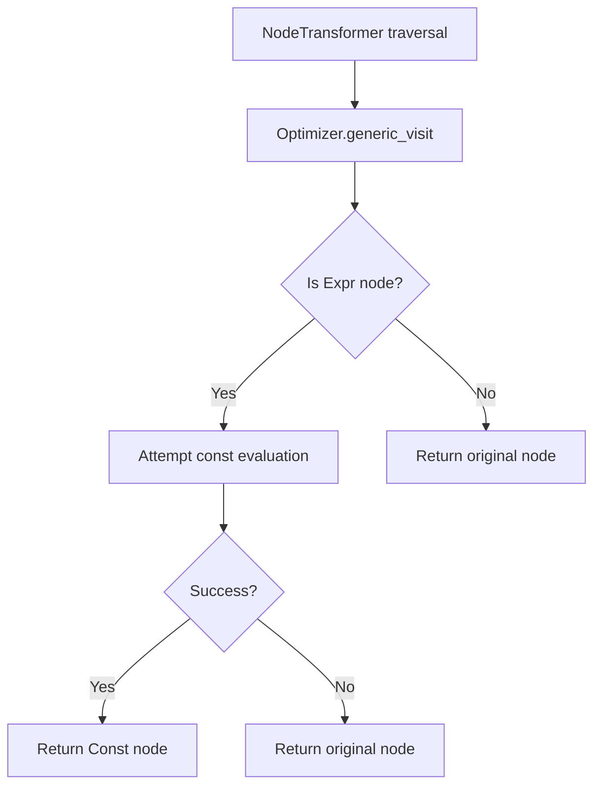

# `optimizer.py`

## `src.jinja2.optimizer.optimize` · *function*

## Summary:
Transforms a Jinja2 AST node by applying compile-time optimizations to convert expression nodes into constant nodes where possible.

## Description:
This function serves as the entry point for applying compile-time optimizations to Jinja2 template abstract syntax trees. It creates an Optimizer instance with the provided environment and applies it to the given node, returning an optimized version of the AST. The optimization process evaluates expression nodes that can be computed at compile time and replaces them with constant nodes, reducing runtime computation.

The function is typically invoked during the template compilation phase when the Jinja2 engine processes template source code into an optimized AST representation.

## Args:
    node (nodes.Node): The root node of the Jinja2 abstract syntax tree to be optimized
    environment (Environment): The Jinja2 environment used for constant evaluation and error reporting during optimization

## Returns:
    nodes.Node: An optimized version of the input AST node where applicable expression nodes have been replaced with constant nodes

## Raises:
    None explicitly raised by this function - any exceptions would be propagated from the underlying Optimizer implementation

## Constraints:
    Preconditions:
    - The node parameter must be a valid Jinja2 AST node
    - The environment parameter must be a valid Jinja2 Environment instance
    
    Postconditions:
    - The returned node is a valid AST node with potentially reduced computational complexity
    - The semantic meaning of the template remains unchanged

## Side Effects:
    None - This function is pure and does not perform any I/O operations or mutate external state

## Control Flow:
```mermaid
flowchart TD
    A[optimize function call] --> B[Create Optimizer instance]
    B --> C[Call optimizer.visit(node)]
    C --> D[Return optimized node]
```

## Examples:
```python
from jinja2 import Environment
from jinja2.optimizer import optimize

# Create environment and template AST node
env = Environment()
template_node = ... # Some parsed template AST node

# Apply optimization
optimized_node = optimize(template_node, env)
```

## `src.jinja2.optimizer.Optimizer` · *class*

## Summary:
An optimizer that transforms expression nodes into constant nodes when possible during Jinja2 template compilation.

## Description:
The Optimizer class is responsible for performing compile-time optimizations on Jinja2 AST nodes. It extends NodeTransformer to traverse and modify the abstract syntax tree, specifically targeting expression nodes that can be evaluated to constants. This optimization reduces runtime computation by replacing expressions with their pre-computed constant values.

This class is typically instantiated by the Jinja2 template compilation system and used internally during the parsing and optimization phase of template processing.

## State:
- environment: Optional[Environment] - The Jinja2 environment used for constant evaluation and error reporting. When None, no environment-specific context is available for constant evaluation.

## Lifecycle:
- Creation: Instantiate with an optional Environment parameter. The environment parameter is stored for use in constant evaluation.
- Usage: The generic_visit method is called as part of the NodeTransformer traversal process to optimize expression nodes.
- Destruction: No explicit cleanup required; relies on Python's garbage collection.

## Method Map:


## Raises:
- The generic_visit method may internally catch nodes.Impossible exceptions during constant evaluation attempts, but does not raise them outwardly

## Example:
```python
from jinja2 import Environment
from jinja2.optimizer import Optimizer

# Create environment and optimizer
env = Environment()
optimizer = Optimizer(env)

# The optimizer would typically be used internally during template compilation
# by calling optimizer.visit(template_ast_node)
```

### `src.jinja2.optimizer.Optimizer.__init__` · *method*

## Summary:
Initializes an optimizer instance with an optional environment for expression evaluation.

## Description:
Configures the optimizer with a Jinja2 environment that will be used for constant expression evaluation during template optimization. This method serves as the constructor for the Optimizer class, setting up the essential environment reference needed for the optimization process.

## Args:
    environment (Optional[Environment]): A Jinja2 environment instance used for evaluating constant expressions during optimization. Can be None if no environment-specific optimizations are required.

## Returns:
    None: This method does not return any value.

## Raises:
    None: This method does not raise any exceptions.

## State Changes:
    Attributes READ: None
    Attributes WRITTEN: self.environment

## Constraints:
    Preconditions: The environment parameter should be either a valid Environment instance or None.
    Postconditions: The optimizer instance will have its environment attribute set to the provided value.

## Side Effects:
    None: This method performs no I/O operations or external service calls.

### `src.jinja2.optimizer.Optimizer.generic_visit` · *method*

## Summary:
Converts expression nodes to constant nodes when possible during template optimization.

## Description:
This method overrides the standard NodeTransformer.generic_visit to perform expression optimization by attempting to evaluate expression nodes at compile time and replace them with constant nodes. It's called during the template compilation process to simplify expressions that can be computed statically.

## Args:
    node (nodes.Node): The AST node to visit and potentially optimize
    *args (t.Any): Additional positional arguments passed to parent visit method
    **kwargs (t.Any): Additional keyword arguments passed to parent visit method

## Returns:
    nodes.Node: The processed node, either optimized to a constant or unchanged

## Raises:
    None explicitly raised - handles nodes.Impossible exception internally

## State Changes:
    Attributes READ: self.environment
    Attributes WRITTEN: None

## Constraints:
    Preconditions: 
    - node must be a valid nodes.Node instance
    - self.environment must be properly initialized
    Postconditions:
    - If node is an expression that can be evaluated, it will be converted to a constant node
    - If evaluation fails, the original node is returned unchanged

## Side Effects:
    None - operates purely on AST nodes and doesn't perform I/O or external operations

