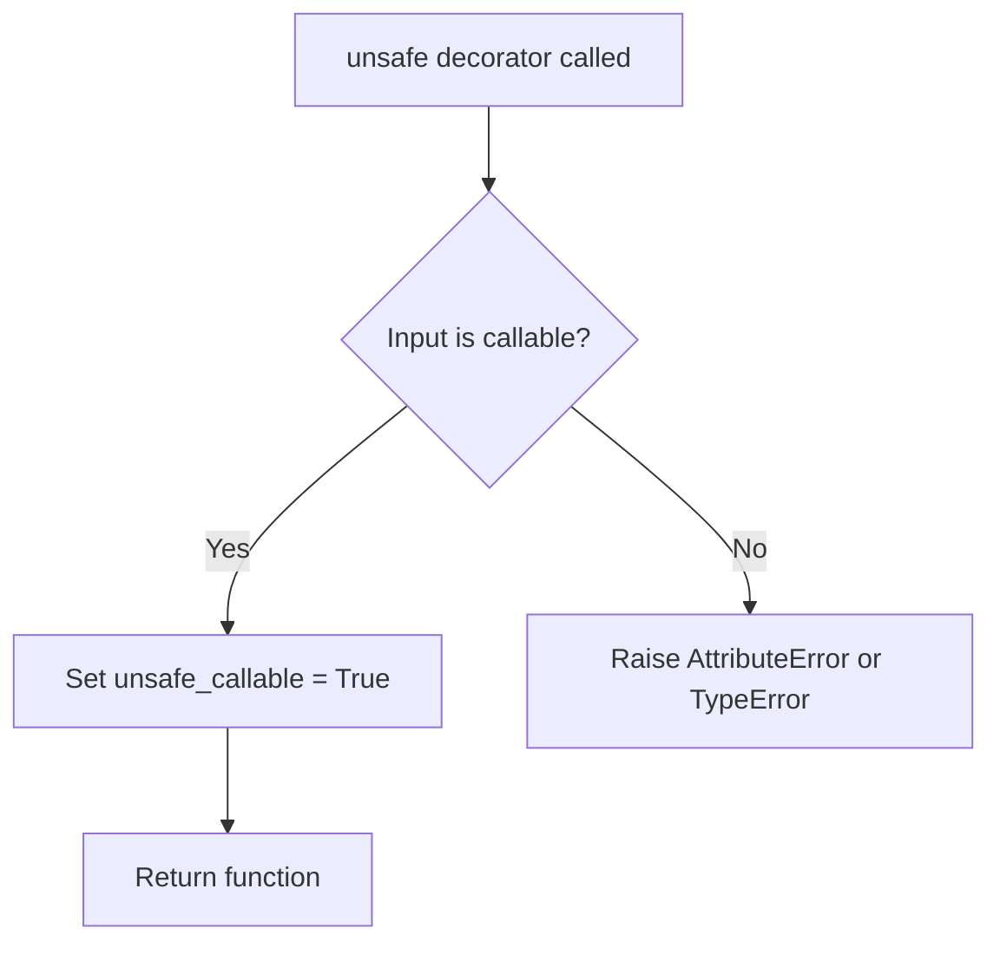
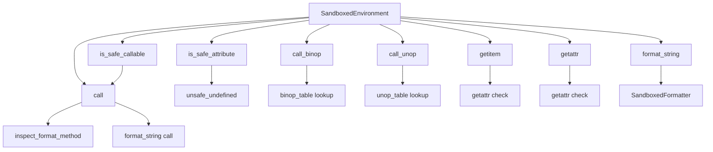
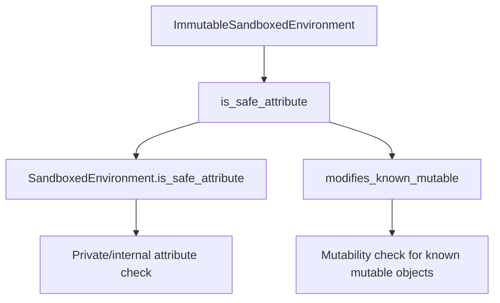
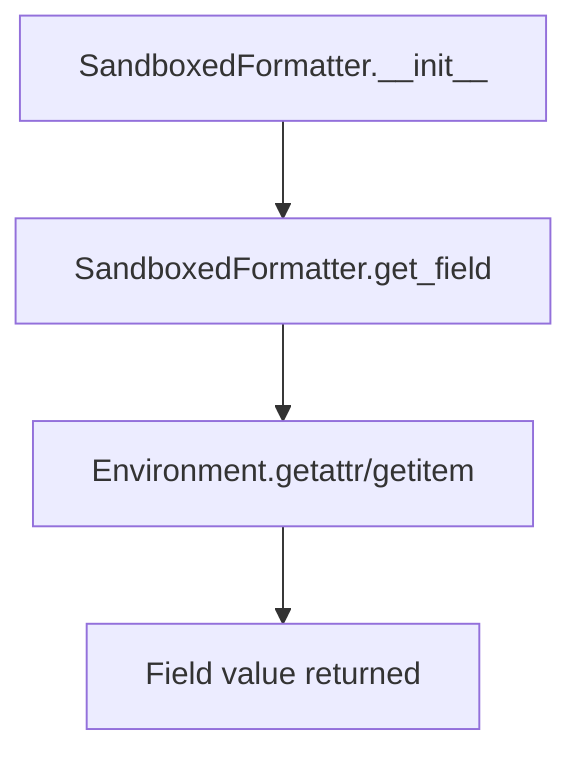
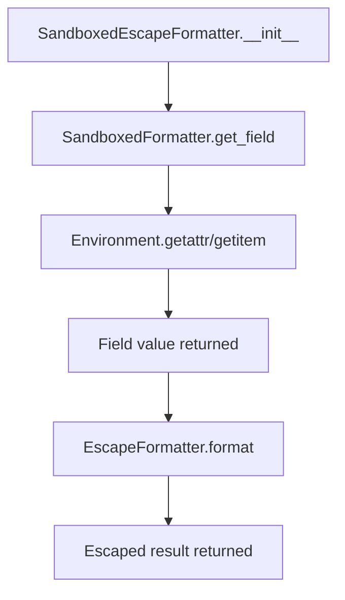

# `sandbox.py`

## `src.jinja2.sandbox.inspect_format_method` · *function*

## Summary:
Inspects a callable to determine if it's a format or format_map method called on a string object.

## Description:
This function examines a callable to identify if it represents a format or format_map method invocation on a string object. It's used in Jinja2's sandbox security mechanisms to track and potentially restrict format method usage for security purposes.

## Args:
    callable (typing.Callable): A callable object to inspect for format method characteristics.

## Returns:
    str or None: The string object that the format method is called on if the callable is a format/format_map method bound to a string; otherwise None.

## Raises:
    None explicitly raised.

## Constraints:
    Preconditions:
    - The callable must be a method type (MethodType or BuiltinMethodType)
    - The callable's name must be either "format" or "format_map"
    
    Postconditions:
    - Returns the string object if conditions are met
    - Returns None if conditions are not met

## Side Effects:
    None.

## Control Flow:
```mermaid
flowchart TD
    A[Start] --> B{Is callable MethodType<br/>or BuiltinMethodType?}
    B -- No --> C[Return None]
    B -- Yes --> D{Is callable name<br/>in ("format", "format_map")?}
    D -- No --> C
    D -- Yes --> E[Get obj = callable.__self__]
    E --> F{Is obj instance of str?}
    F -- Yes --> G[Return obj]
    F -- No --> C
```

## Examples:
    # Example 1: String format method
    s = "Hello {name}"
    result = inspect_format_method(s.format)  # Returns "Hello {name}"
    
    # Example 2: Non-string format method
    l = [1, 2, 3]
    result = inspect_format_method(l.format)  # Returns None
    
    # Example 3: Non-format method
    s = "Hello"
    result = inspect_format_method(s.upper)  # Returns None
``

## `src.jinja2.sandbox.safe_range` · *function*

## Summary:
Creates a range object with size validation to prevent resource exhaustion attacks in sandboxed environments.

## Description:
This function provides a secure wrapper around Python's built-in range() constructor. It validates that the resulting range object doesn't exceed a predefined maximum size (MAX_RANGE) to prevent potential denial-of-service attacks through excessive memory allocation. The function is designed to be used in Jinja2's sandboxed execution environment where untrusted templates might attempt to create extremely large ranges that could consume excessive system resources.

## Args:
    *args (int): Variable-length argument list compatible with Python's built-in range() function. Can accept 1-3 integer arguments following the same semantics as range().

## Returns:
    range: A range object with the specified start, stop, and step values, provided its length doesn't exceed the MAX_RANGE security limit.

## Raises:
    OverflowError: When the length of the created range exceeds the MAX_RANGE limit, indicating a potentially malicious or resource-intensive operation.

## Constraints:
    Preconditions:
    - All arguments must be integers (as enforced by range())
    - The resulting range must not exceed MAX_RANGE in length (a security constant defined in the module)
    
    Postconditions:
    - Returns a valid range object if length constraint is satisfied
    - Raises OverflowError if length constraint is violated

## Side Effects:
    None: This function has no side effects beyond creating and returning a range object.

## Control Flow:
```mermaid
flowchart TD
    A[Call safe_range] --> B{Args validated?}
    B -->|No| C[raise TypeError]
    B -->|Yes| D[Create range object]
    D --> E{len(range) > MAX_RANGE?}
    E -->|Yes| F[raise OverflowError]
    E -->|No| G[return range]
```

## Examples:
```python
# Valid usage - creates a small range
small_range = safe_range(10)  # Returns range(0, 10)

# Valid usage - creates a range with custom start/stop
custom_range = safe_range(5, 15)  # Returns range(5, 15)

# Invalid usage - would raise OverflowError if range length exceeds MAX_RANGE
# large_range = safe_range(1000000)  # Would raise OverflowError if > MAX_RANGE
```

## `src.jinja2.sandbox.unsafe` · *function*

## Summary:
Decorator that marks a callable as unsafe, permitting it to bypass Jinja2 sandbox security restrictions.

## Description:
The `unsafe` decorator is a security mechanism in Jinja2's sandbox system that allows functions to execute without sandbox restrictions. When applied to a callable, it sets the `unsafe_callable` attribute to `True`, signaling to the Jinja2 sandbox runtime that the decorated function should be permitted to execute even in restricted template contexts where normal security checks would prevent its use.

This decorator is typically used for functions that perform operations considered potentially dangerous in template environments (such as file I/O, system calls, or other operations that could compromise security) but are explicitly allowed in trusted contexts. It is part of Jinja2's controlled security model where certain functions can be selectively permitted to operate outside normal sandbox constraints.

## Args:
    f (F): A callable object (function, method, or other callable) to be marked as unsafe. The type `F` represents a generic callable type that supports attribute assignment, commonly `typing.Callable[..., typing.Any]`.

## Returns:
    F: The same callable object with the `unsafe_callable` attribute set to `True`. The return type preserves the original function's signature and behavior.

## Raises:
    AttributeError: If the input `f` does not support attribute assignment (though this is rare for standard callable objects).

## Constraints:
    Preconditions:
    - The input `f` must be a callable object that supports attribute assignment
    - The function should only be applied to functions that are explicitly trusted in the security context
    - Usage should be carefully considered as it bypasses sandbox security mechanisms
    
    Postconditions:
    - The returned object maintains identical interface and behavior to the input
    - The `unsafe_callable` attribute is set to `True` on the returned object
    - The function can now be executed in sandboxed template contexts without security restrictions

## Side Effects:
    None

## Control Flow:


## Examples:
```python
# Marking a custom filter as unsafe for use in templates
@unsafe
def read_file(filename):
    """Reads a file - potentially dangerous operation"""
    with open(filename, 'r') as f:
        return f.read()

# Marking a utility function for use in sandboxed templates
@unsafe
def execute_system_command(cmd):
    """Executes system command - highly dangerous"""
    import subprocess
    return subprocess.run(cmd, shell=True, capture_output=True)

# Usage in a template context where sandboxing applies
# The decorated function will be allowed to execute despite sandbox restrictions
```

## `src.jinja2.sandbox.is_internal_attribute` · *function*

## Summary:
Determines whether an attribute of a given object is considered internal or unsafe for access in a sandboxed environment.

## Description:
This function evaluates if a specific attribute of an object should be restricted due to security concerns or internal implementation details. It's used in Jinja2's sandboxing mechanism to prevent access to potentially dangerous or internal attributes that could compromise security. The function specifically checks various Python object types and their associated unsafe attributes.

## Args:
    obj (typing.Any): The object whose attribute is being checked
    attr (str): The name of the attribute to check

## Returns:
    bool: True if the attribute is considered internal/unsafe and should be restricted, False otherwise

## Raises:
    None explicitly raised

## Constraints:
    Preconditions:
    - The `obj` parameter can be any Python object
    - The `attr` parameter must be a string representing an attribute name
    
    Postconditions:
    - Returns a boolean value indicating whether access should be restricted
    - The function handles various Python types including functions, methods, classes, and special objects

## Side Effects:
    None

## Control Flow:
```mermaid
flowchart TD
    A[Start] --> B{obj is FunctionType?}
    B -- Yes --> C{attr in UNSAFE_FUNCTION_ATTRIBUTES?}
    C -- Yes --> D[Return True]
    C -- No --> E[Continue]
    B -- No --> F{obj is MethodType?}
    F -- Yes --> G{attr in UNSAFE_FUNCTION_ATTRIBUTES OR attr in UNSAFE_METHOD_ATTRIBUTES?}
    G -- Yes --> D
    G -- No --> E
    F -- No --> H{obj is type?}
    H -- Yes --> I{attr == "mro"?}
    I -- Yes --> D
    I -- No --> E
    H -- No --> J{obj is CodeType/TracebackType/FrameType?}
    J -- Yes --> D
    J -- No --> K{obj is GeneratorType?}
    K -- Yes --> L{attr in UNSAFE_GENERATOR_ATTRIBUTES?}
    L -- Yes --> D
    L -- No --> E
    K -- No --> M{hasattr(types, "CoroutineType") AND obj is CoroutineType?}
    M -- Yes --> N{attr in UNSAFE_COROUTINE_ATTRIBUTES?}
    N -- Yes --> D
    N -- No --> E
    M -- No --> O{hasattr(types, "AsyncGeneratorType") AND obj is AsyncGeneratorType?}
    O -- Yes --> P{attr in UNSAFE_ASYNC_GENERATOR_ATTRIBUTES?}
    P -- Yes --> D
    P -- No --> E
    O -- No --> Q{attr starts with "__"?}
    Q -- Yes --> D
    Q -- No --> R[Return False]
    D --> S[End]
    E --> Q
    R --> S
```

## Examples:
    # Checking a function's attribute
    >>> is_internal_attribute(some_function, '__code__')
    True
    
    # Checking a method's attribute  
    >>> is_internal_attribute(some_method, 'func')
    True
    
    # Checking a class attribute
    >>> is_internal_attribute(SomeClass, 'mro')
    True
    
    # Checking a regular attribute
    >>> is_internal_attribute(some_object, 'public_attr')
    False

## `src.jinja2.sandbox.modifies_known_mutable` · *function*

## Summary:
Determines whether accessing or modifying a specific attribute on a given object would potentially modify a mutable object in an unsafe manner.

## Description:
This function serves as a security check within Jinja2's sandbox environment to prevent unauthorized modifications to mutable objects. It evaluates whether a given attribute access on an object could result in unsafe modifications by consulting a predefined specification of mutable types and their unsafe attributes.

## Args:
    obj (Any): The object whose attribute access needs to be checked for safety
    attr (str): The name of the attribute being accessed or modified

## Returns:
    bool: True if the attribute access/modification on the given object would be considered unsafe/unsafe to modify, False otherwise

## Raises:
    None explicitly raised by this function

## Constraints:
    Preconditions:
    - The `_mutable_spec` global variable must be properly initialized with a sequence of (type, unsafe_attributes) tuples
    - Both `obj` and `attr` parameters must be provided
    
    Postconditions:
    - The function returns a boolean value indicating the safety of the attribute operation
    - The function does not modify the input object or attribute

## Side Effects:
    None

## Control Flow:
```mermaid
flowchart TD
    A[Start modifies_known_mutable] --> B{isinstance(obj, typespec)?}
    B -- Yes --> C{attr in unsafe?}
    C -- Yes --> D[Return True]
    C -- No --> E[Continue loop]
    B -- No --> F[Check next typespec]
    F --> G{End of _mutable_spec?}
    G -- No --> B
    G -- Yes --> H[Return False]
    D --> I[End]
    E --> I
    H --> I
```

## Examples:
    # Example usage in a sandbox security context
    # This would be called when evaluating template expressions
    is_unsafe = modifies_known_mutable([1, 2, 3], "append")  # Returns True
    is_safe = modifies_known_mutable("hello", "upper")      # Returns False

## `src.jinja2.sandbox.SandboxedEnvironment` · *class*

## Summary:
A security-enhanced Jinja2 environment that restricts access to potentially dangerous attributes and operations to prevent code injection and resource exhaustion attacks.

## Description:
SandboxedEnvironment is a subclass of Jinja2's standard Environment class designed specifically for secure template rendering in untrusted environments. It implements various safety mechanisms to prevent access to internal attributes, unsafe callable objects, and potentially resource-intensive operations like large range creations. This class is intended for use when rendering templates from untrusted sources where security is paramount.

The class enforces security through several mechanisms:
- Restricts access to private/internal attributes via `is_safe_attribute`
- Prevents execution of unsafe callable objects via `is_safe_callable` 
- Implements safe versions of attribute access (`getattr`) and item access (`getitem`)
- Provides secure string formatting through `format_string`
- Uses a configurable operation table for binary and unary operators

## State:
- `sandboxed`: Class attribute set to True, indicating this is a sandboxed environment
- `default_binop_table`: Dictionary mapping binary operators to safe implementations from the operator module
- `default_unop_table`: Dictionary mapping unary operators to safe implementations from the operator module
- `intercepted_binops`: Frozen set of binary operators that are intercepted (defaults to empty set)
- `intercepted_unops`: Frozen set of unary operators that are intercepted (defaults to empty set)
- `binop_table`: Instance copy of default_binop_table that can be customized
- `unop_table`: Instance copy of default_unop_table that can be customized
- `globals`: Inherited from Environment, contains global variables including the overridden 'range' function

## Lifecycle:
Creation: Instantiate with standard Environment constructor arguments. The constructor replaces the 'range' global function with `safe_range` and copies the default operation tables.

Usage: Typically used by calling template.render() methods with this environment instance. The security checks are automatically applied during template execution.

Destruction: Inherits standard Environment cleanup behavior. No special cleanup required beyond normal Python garbage collection.

## Method Map:


## Raises:
- SecurityError: Raised by the `call` method when attempting to execute unsafe callable objects, and by `unsafe_undefined` when accessing unsafe attributes
- TypeError: Raised by `format_string` when `format_map` is called with incorrect arguments
- OverflowError: Raised by `safe_range` when creating ranges exceeding the MAX_RANGE limit

## Example:
```python
from jinja2.sandbox import SandboxedEnvironment
from jinja2 import Template

# Create a sandboxed environment
env = SandboxedEnvironment()

# Create a template
template = Template("Hello {{ user.name }}!", environment=env)

# Render with safe data
result = template.render(user={"name": "Alice"})
print(result)  # Output: Hello Alice!

# This would raise SecurityError because accessing private attributes is blocked
try:
    template = Template("{{ user._private_attr }}", environment=env)
    template.render(user={"_private_attr": "secret"})
except Exception as e:
    print(f"Security error: {e}")
```

### `src.jinja2.sandbox.SandboxedEnvironment.__init__` · *method*

## Summary:
Initializes a SandboxedEnvironment instance by setting up security configurations and copying operation tables from the parent Environment class.

## Description:
This constructor method initializes a SandboxedEnvironment instance by first calling the parent Environment class constructor, then configuring security-related settings including replacing the global 'range' function with a safe version and copying default operator tables. This method establishes the security boundaries that distinguish SandboxedEnvironment from regular Environment instances.

## Args:
    *args (Any): Variable-length positional arguments passed to the parent Environment constructor
    **kwargs (Any): Variable-length keyword arguments passed to the parent Environment constructor

## Returns:
    None: This method initializes the instance in-place and does not return a value

## Raises:
    None: This method does not explicitly raise exceptions, though the parent constructor may raise exceptions for invalid arguments

## State Changes:
    Attributes READ: 
    - self.default_binop_table
    - self.default_unop_table
    
    Attributes WRITTEN:
    - self.globals["range"]
    - self.binop_table
    - self.unop_table

## Constraints:
    Preconditions:
    - The parent Environment class constructor must accept the provided *args and **kwargs
    - The default_binop_table and default_unop_table attributes must exist on the instance
    
    Postconditions:
    - The instance's globals dictionary will contain a 'range' key pointing to safe_range
    - The instance's binop_table will be a copy of default_binop_table
    - The instance's unop_table will be a copy of default_unop_table

## Side Effects:
    None: This method performs in-place initialization and has no external side effects

### `src.jinja2.sandbox.SandboxedEnvironment.is_safe_attribute` · *method*

## Summary:
Determines whether accessing a given attribute on an object is safe within a sandboxed environment.

## Description:
This method evaluates whether an attribute access should be permitted in a sandboxed Jinja2 environment. It's used by the `getattr` and `getitem` methods to enforce security restrictions on object attribute access. The method returns `True` if the attribute is considered safe for access, and `False` if access should be blocked due to security concerns.

The safety check considers two main factors:
1. Private/protected attributes (those starting with "_")
2. Internal attributes identified by the `is_internal_attribute` helper function

This method is crucial for maintaining the security boundaries of the sandboxed environment by preventing access to potentially dangerous internal implementation details.

## Args:
    obj (typing.Any): The object whose attribute is being checked for safety
    attr (str): The name of the attribute to check for safety
    value (typing.Any): The value of the attribute being accessed (unused in current implementation)

## Returns:
    bool: True if the attribute access is considered safe, False if access should be restricted

## Raises:
    None explicitly raised

## State Changes:
    Attributes READ: None
    Attributes WRITTEN: None

## Constraints:
    Preconditions:
    - The `obj` parameter can be any Python object
    - The `attr` parameter must be a string representing an attribute name
    - The `value` parameter is unused in the current implementation but must be provided for interface compatibility
    
    Postconditions:
    - Returns a boolean value indicating whether access should be permitted
    - The method does not modify any object state

## Side Effects:
    None

### `src.jinja2.sandbox.SandboxedEnvironment.is_safe_callable` · *method*

## Summary:
Determines whether an object is safe to call within a sandboxed environment by checking for unsafe attributes.

## Description:
Checks if an object can be safely invoked in a sandboxed context by examining whether it has the "unsafe_callable" or "alters_data" attributes set to True. This method is used to enforce security restrictions in the sandboxed environment to prevent potentially dangerous operations.

## Args:
    obj (Any): The object to check for safety before calling

## Returns:
    bool: True if the object is safe to call (does not have unsafe_callable=True or alters_data=True), False otherwise

## Raises:
    None

## State Changes:
    Attributes READ: None
    Attributes WRITTEN: None

## Constraints:
    Preconditions:
    - The object can be any Python object
    - The method uses getattr with default values, so it won't raise AttributeError even if attributes don't exist
    
    Postconditions:
    - Returns a boolean value indicating safety status
    - Does not modify the input object or environment state

## Side Effects:
    None

### `src.jinja2.sandbox.SandboxedEnvironment.call_binop` · *method*

## Summary
Executes a binary operation by looking up the operator in the sandboxed environment's binary operation table and applying it to two operands.

## Description
This method serves as a secure interface for executing binary operations within a sandboxed Jinja2 environment. It retrieves the appropriate operation function from the environment's binary operation table and applies it to the provided left and right operands. This approach allows for controlled execution of binary operations while maintaining security restrictions inherent to the sandboxed environment.

The method is typically invoked during template expression evaluation when binary operators (such as +, -, *, /) are encountered in template expressions. It provides a centralized mechanism for handling binary operations that respects the security model of the SandboxedEnvironment.

## Args
- operator (str): The string representation of the binary operator to execute (e.g., "+", "-", "*", "/")
- left (Any): The left operand for the binary operation
- right (Any): The right operand for the binary operation
- context (Context): The Jinja2 rendering context (used for potential future extensions but not currently utilized in the implementation)

## Returns
- Any: The result of applying the binary operation to the left and right operands

## Raises
- KeyError: When the specified operator is not found in the binop_table
- TypeError: When the operands are incompatible with the operation (e.g., attempting to divide by zero)
- Exception: When the operation function itself raises an exception

## State Changes
- Attributes READ: self.binop_table
- Attributes WRITTEN: None

## Constraints
- Preconditions: The operator must exist in self.binop_table; both operands must be compatible with the operation
- Postconditions: The returned value is the result of applying the binary operation to the operands

## Side Effects
- None beyond the normal execution of the binary operation function

### `src.jinja2.sandbox.SandboxedEnvironment.call_unop` · *method*

## Summary
Executes a unary operation by looking up the operator in the sandboxed environment's unary operation table and applying it to a single operand.

## Description
This method serves as a secure interface for executing unary operations within a sandboxed Jinja2 environment. It retrieves the appropriate operation function from the environment's unary operation table and applies it to the provided operand. This approach allows for controlled execution of unary operations while maintaining security restrictions inherent to the SandboxedEnvironment.

The method is typically invoked during template expression evaluation when unary operators (such as +, -) are encountered in template expressions. It provides a centralized mechanism for handling unary operations that respects the security model of the SandboxedEnvironment.

## Args
- context (Context): The Jinja2 rendering context (used for potential future extensions but not currently utilized in the implementation)
- operator (str): The string representation of the unary operator to execute (e.g., "+", "-")
- arg (Any): The operand for the unary operation

## Returns
- Any: The result of applying the unary operation to the operand

## Raises
- KeyError: When the specified operator is not found in the unop_table
- Exception: When the operation function itself raises an exception

## State Changes
- Attributes READ: self.unop_table
- Attributes WRITTEN: None

## Constraints
- Preconditions: The operator must exist in self.unop_table; the operand must be compatible with the operation
- Postconditions: The returned value is the result of applying the unary operation to the operand

## Side Effects
- None beyond the normal execution of the unary operation function

### `src.jinja2.sandbox.SandboxedEnvironment.getitem` · *method*

## Summary:
Retrieves an item or attribute from an object with security validation, attempting item access followed by attribute access when item access fails.

## Description:
This method implements secure item and attribute access for sandboxed environments. When a template attempts to access an object using bracket notation (e.g., `obj[key]`) or dot notation (e.g., `obj.attr`), this method handles the access with appropriate security checks to prevent unauthorized access to sensitive attributes or methods.

The method follows this priority order:
1. First attempts direct item access using `obj[argument]`
2. If that fails with TypeError or LookupError and argument is a string, attempts attribute access using `getattr(obj, argument)`
3. Validates attribute safety using `is_safe_attribute` before returning the value
4. Returns appropriate undefined objects when access is denied or unavailable

This method is called during template rendering when accessing object properties using either bracket notation (`obj[key]`) or dot notation (`obj.attr`).

## Args:
    obj (Any): The object from which to retrieve the item or attribute
    argument (Union[str, Any]): The key/index or attribute name to access

## Returns:
    Union[Any, Undefined]: The retrieved value if successful, or an Undefined instance if access is denied or unavailable

## Raises:
    None explicitly raised - all exceptions are caught and handled internally

## State Changes:
    Attributes READ: 
    - self.is_safe_attribute
    - self.unsafe_undefined  
    - self.undefined
    
    Attributes WRITTEN: 
    - None

## Constraints:
    Preconditions:
    - The `obj` parameter must be provided and not None
    - The `argument` parameter must be provided and not None
    - The method assumes proper sandbox security context is established
    
    Postconditions:
    - Always returns either a valid value or an Undefined instance
    - Never raises exceptions directly to caller

## Side Effects:
    None - This method is read-only and doesn't mutate any state

### `src.jinja2.sandbox.SandboxedEnvironment.getattr` · *method*

## Summary:
Retrieves an attribute from an object with security validation, returning either the attribute value or an undefined object when access is restricted.

## Description:
Provides a secure mechanism for accessing object attributes within a sandboxed environment. This method attempts to retrieve an attribute using standard attribute access, falling back to item access if attribute access fails. All attribute accesses are subject to security checks that prevent access to private attributes and internal implementation details.

The method follows this priority order:
1. Try standard attribute access using `getattr()`
2. If that raises AttributeError, try item access using `obj[attribute]`
3. If successful, validate the attribute's safety using security checks
4. Return appropriate undefined objects when access is denied or not found

This method is called during template rendering when accessing object attributes, ensuring that only safe attributes can be accessed from templates.

## Args:
    obj (Any): The object from which to retrieve the attribute
    attribute (str): The name of the attribute to retrieve

## Returns:
    Union[Any, Undefined]: The attribute value if accessible and safe, otherwise an Undefined instance representing the failed access

## Raises:
    None explicitly raised by this method

## State Changes:
    Attributes READ: 
    - None (reads from parameters and calls other methods)
    
    Attributes WRITTEN: 
    - None (method is read-only)

## Constraints:
    Preconditions:
    - The `obj` parameter must be provided and not None
    - The `attribute` parameter must be a string
    - The `obj` must support either attribute access or item access operations
    
    Postconditions:
    - Returns either the actual attribute value or an Undefined instance
    - Never raises AttributeError directly - wraps it in Undefined objects
    - Maintains security restrictions on attribute access

## Side Effects:
    None

## Known Callers:
    - Template rendering engine when accessing object attributes in templates
    - Other methods in SandboxedEnvironment that require secure attribute access

## Why This Logic Is Its Own Method:
This logic is separated into its own method to encapsulate the complex security checking process for attribute access. Rather than inlining this logic throughout the codebase, having it as a dedicated method ensures consistent security enforcement and makes it easier to extend or modify the security policy in the future. The method provides a clean interface for secure attribute access that integrates with the broader sandbox security model.

### `src.jinja2.sandbox.SandboxedEnvironment.unsafe_undefined` · *method*

## Summary:
Creates and returns an Undefined object representing an unsafe attribute access attempt on an object.

## Description:
This method is invoked when a template attempts to access an attribute on an object that is considered unsafe from a security perspective. It constructs an appropriate error message indicating that the attribute access is prohibited due to security restrictions and returns an Undefined object that will raise a SecurityError when evaluated.

The method is called by the `getitem` and `getattr` methods of the SandboxedEnvironment class when attribute access validation fails.

## Args:
    obj (Any): The object on which the attribute access was attempted
    attribute (str): The name of the attribute being accessed

## Returns:
    Undefined: An Undefined object configured to raise a SecurityError when accessed

## Raises:
    SecurityError: When the Undefined object returned by this method is evaluated and the attribute access is attempted

## State Changes:
    Attributes READ: None
    Attributes WRITTEN: None

## Constraints:
    Preconditions: 
    - The method assumes that the attribute access has already been validated as unsafe
    - The `obj` parameter must be a valid Python object
    - The `attribute` parameter must be a string representing the attribute name
    
    Postconditions:
    - Returns an Undefined object that will raise SecurityError upon evaluation
    - The returned Undefined object contains the original object and attribute information

## Side Effects:
    None

### `src.jinja2.sandbox.SandboxedEnvironment.format_string` · *method*

## Summary:
Formats a string using a sandboxed formatter to prevent arbitrary code execution while maintaining secure field access.

## Description:
The `format_string` method provides a secure way to format strings by using either `SandboxedFormatter` or `SandboxedEscapeFormatter` depending on whether the input string is a Markup object. It ensures that field access during string formatting goes through the environment's safe attribute and item access mechanisms, preventing security vulnerabilities such as arbitrary code execution.

This method is typically called internally by Jinja2's templating engine when processing format strings in templates, particularly when security is a concern. It handles special cases for `format_map` method calls and properly manages the return type to preserve the original string type.

## Args:
    s (str): The format string to be processed, which may be a regular string or Markup object
    args (tuple): Positional arguments to be passed to the formatter
    kwargs (dict): Keyword arguments to be passed to the formatter  
    format_func (callable, optional): The format function being called, used to detect special cases like format_map

## Returns:
    str: The formatted string with the same type as the input string `s`

## Raises:
    TypeError: When `format_map()` is called with incorrect number of arguments (must be exactly one argument)

## State Changes:
    Attributes READ: None
    Attributes WRITTEN: None

## Constraints:
    Preconditions:
    - The environment (`self`) must be properly initialized
    - Input string `s` must be a valid string or Markup object
    - Arguments and keyword arguments must be compatible with the formatter
    
    Postconditions:
    - The returned string preserves the type of the input string `s`
    - All field access occurs through secure environment methods
    - Format map validation is performed when appropriate

## Side Effects:
    None

## Known Callers:
    - `SandboxedEnvironment.call()` method: Called when a format or format_map method is detected on a string object during template execution
    - Template rendering pipeline: Invoked during Jinja2's string formatting operations in secure contexts

## Usage Context:
This method is part of Jinja2's security infrastructure, specifically designed to prevent unsafe string formatting operations that could lead to code injection vulnerabilities. It's used in the context of template rendering where security is paramount.

### `src.jinja2.sandbox.SandboxedEnvironment.call` · *method*

## Summary:
Calls an object with given arguments in a secure sandboxed environment, handling format methods specially and enforcing callable safety restrictions.

## Description:
This method provides a secure way to invoke objects within a sandboxed Jinja2 environment. It first checks if the object being called is a format method on a string, and if so, processes it through the sandboxed formatting system. For regular callable objects, it verifies the object is marked as safe before allowing execution through the context's call mechanism.

## Args:
    __self: The SandboxedEnvironment instance (used for internal method signature compatibility)
    __context: The Jinja2 Context in which the call occurs
    __obj: The callable object to invoke
    *args: Positional arguments to pass to the callable
    **kwargs: Keyword arguments to pass to the callable

## Returns:
    The result of calling the object with the provided arguments, or formatted string if it was a format method

## Raises:
    SecurityError: When attempting to call an object that is not marked as safely callable

## State Changes:
    Attributes READ: None
    Attributes WRITTEN: None

## Constraints:
    Preconditions:
    - The object must be callable
    - If the object is a format method on a string, it must be handled through the sandboxed formatter
    - If the object is not a format method, it must pass the `is_safe_callable` check
    
    Postconditions:
    - If format method: returns formatted string using sandboxed formatter
    - If regular callable: returns result of calling through context with security checks

## Side Effects:
    None directly, but may trigger I/O or external operations through the called object or formatter

## `src.jinja2.sandbox.ImmutableSandboxedEnvironment` · *class*

## Summary:
A Jinja2 environment that prevents modifications to mutable objects in addition to standard sandbox security.

## Description:
The ImmutableSandboxedEnvironment is a specialized Jinja2 environment designed to provide enhanced security by preventing modifications to mutable objects during template rendering. It extends the security model of SandboxedEnvironment by adding an additional check that blocks attribute access or modification operations that could potentially alter mutable objects in unsafe ways.

This environment is particularly useful when rendering templates that might be exposed to untrusted input where you want to ensure that even if a user gains access to mutable objects, they cannot modify them in potentially dangerous ways. The class provides an extra layer of protection beyond the standard sandbox security measures.

## State:
- Inherits all state from SandboxedEnvironment including:
  - `sandboxed`: Boolean flag indicating this is a sandboxed environment
  - `default_binop_table`: Dictionary mapping binary operators to safe implementations
  - `default_unop_table`: Dictionary mapping unary operators to safe implementations
  - `binop_table`: Instance copy of default_binop_table
  - `unop_table`: Instance copy of default_unop_table
  - `globals`: Global variables including the overridden 'range' function

## Lifecycle:
Creation: Instantiate with standard Environment constructor arguments. The constructor inherits all initialization behavior from SandboxedEnvironment, including replacing the 'range' global function with `safe_range` and copying the default operation tables.

Usage: Typically used by calling template.render() methods with this environment instance. The security checks are automatically applied during template execution through the overridden `is_safe_attribute` method.

Destruction: Inherits standard Environment cleanup behavior. No special cleanup required beyond normal Python garbage collection.

## Method Map:


## Raises:
- SecurityError: Raised by inherited methods when attempting to access unsafe attributes or execute unsafe callable objects
- TypeError: Raised by inherited methods when format_map is called with incorrect arguments
- OverflowError: Raised by inherited methods when creating ranges exceeding the MAX_RANGE limit

## Example:
```python
from jinja2.sandbox import ImmutableSandboxedEnvironment
from jinja2 import Template

# Create an immutable sandboxed environment
env = ImmutableSandboxedEnvironment()

# Create a template that accesses a mutable object
template = Template("{{ data.items }}", environment=env)

# This works fine - accessing immutable attributes
result = template.render(data={"items": ["a", "b"]})
print(result)  # Output: ['a', 'b']

# This would raise SecurityError - trying to modify a mutable object
try:
    template = Template("{{ data.append('c') }}", environment=env)
    template.render(data=[1, 2, 3])
except Exception as e:
    print(f"Security error: {e}")

# This would also raise SecurityError - accessing unsafe attributes
try:
    template = Template("{{ data._private }}", environment=env)
    template.render(data={"_private": "secret"})
except Exception as e:
    print(f"Security error: {e}")
```

### `src.jinja2.sandbox.ImmutableSandboxedEnvironment.is_safe_attribute` · *method*

## Summary:
Checks whether accessing or modifying a specific attribute on an object is safe within the immutable sandbox environment.

## Description:
This method determines if an attribute access or modification operation on a given object is permitted within the sandboxed environment. It extends the base security check by additionally verifying that the operation won't result in unsafe modifications to mutable objects. This method is called during attribute access operations in templates to enforce security policies that prevent unauthorized modifications to mutable data structures.

## Args:
    obj (Any): The object whose attribute access needs to be validated
    attr (str): The name of the attribute being accessed or modified
    value (Any): The value associated with the attribute (used for compatibility with parent method)

## Returns:
    bool: True if the attribute access/modification is considered safe, False otherwise

## Raises:
    None explicitly raised by this method

## State Changes:
    Attributes READ: 
    - None (reads from parent class and global function)
    
    Attributes WRITTEN: 
    - None (method is read-only)

## Constraints:
    Preconditions:
    - The `obj` parameter must be provided and not None
    - The `attr` parameter must be a string
    - The `_mutable_spec` global variable must be properly initialized with a sequence of (type, unsafe_attributes) tuples
    
    Postconditions:
    - The method returns a boolean value indicating the safety of the attribute operation
    - The method does not modify the input object or attribute

## Side Effects:
    None

## Known Callers:
    - Called internally by `getattr` method during template rendering when accessing object attributes
    - Called internally by `getitem` method during template rendering when accessing object attributes via bracket notation
    - Called during general attribute access operations in the sandboxed environment to validate security

## Why This Logic Is Its Own Method:
This logic is separated into its own method to provide a clear extension point for security checks in the immutable sandbox environment. By overriding the parent's `is_safe_attribute` method, it maintains compatibility with the existing security framework while adding an additional layer of protection against modifications to mutable objects. This approach allows the sandbox to enforce both basic attribute safety checks (avoiding private attributes and internal attributes) and more sophisticated checks for potentially dangerous mutable object modifications.

## `src.jinja2.sandbox.SandboxedFormatter` · *class*

## Summary:
A secure formatter that provides sandboxed field access through an environment object, preventing arbitrary code execution.

## Description:
The SandboxedFormatter extends Python's built-in Formatter class to provide a secure way of accessing fields in string formatting operations. It ensures that field access goes through the Environment's getattr and getitem methods, which provide safe attribute and item access controls to prevent security vulnerabilities like arbitrary code execution.

This class is typically instantiated by Jinja2's templating engine when processing formatted strings in templates, particularly when security is a concern. It overrides the standard field access mechanism to enforce sandboxed access patterns.

## State:
- `_env`: Environment instance used for secure attribute and item access
  - Type: Environment
  - Valid range: Must be a valid Environment instance
  - Invariant: Must not be None and must support getattr() and getitem() methods

## Lifecycle:
- Creation: Instantiate with an Environment object and optional keyword arguments
- Usage: Used internally by Jinja2 during template rendering when processing format strings
- Destruction: Managed automatically by Python's garbage collection

## Method Map:


## Raises:
- TypeError: If the Environment parameter is not provided or is invalid
- SecurityError: If the Environment's getattr/getitem methods raise SecurityError during field access

## Example:
```python
# Typically used internally by Jinja2
from jinja2 import Environment
from jinja2.sandbox import SandboxedFormatter

env = Environment()
formatter = SandboxedFormatter(env)
result = formatter.format("Hello {name}!", name="World")
```

### `src.jinja2.sandbox.SandboxedFormatter.__init__` · *method*

## Summary:
Initializes a SandboxedFormatter instance with an environment and optional configuration parameters.

## Description:
Configures a SandboxedFormatter instance by storing the provided environment for secure field access and initializing parent class state with optional keyword arguments. This method establishes the security context for subsequent formatting operations by binding the formatter to a specific Jinja2 Environment instance.

## Args:
    env (Environment): The Jinja2 Environment instance to use for secure attribute and item access during formatting operations. Must be a valid Environment object.
    **kwargs (Any): Additional keyword arguments passed to the parent class constructor for configuration.

## Returns:
    None: This method initializes the instance and does not return a value.

## Raises:
    TypeError: If the env parameter is not provided or is not an Environment instance.
    SecurityError: If the Environment's getattr/getitem methods raise SecurityError during initialization.

## State Changes:
    Attributes READ: None
    Attributes WRITTEN: 
        - self._env: Set to the provided Environment instance
        - Other attributes inherited from parent class via super().__init__()

## Constraints:
    Preconditions:
        - The env parameter must be a valid Environment instance
        - The env parameter must not be None
    Postconditions:
        - self._env is set to the provided Environment instance
        - Parent class initialization is completed successfully

## Side Effects:
    None: This method performs no I/O operations or external service calls. It only initializes internal state.

## `src.jinja2.sandbox.SandboxedEscapeFormatter` · *class*

## Summary:
A formatter class that inherits from both SandboxedFormatter and EscapeFormatter.

## Description:
The SandboxedEscapeFormatter is a concrete implementation that inherits from both SandboxedFormatter and EscapeFormatter. This inheritance provides it with the combined capabilities of secure field access (from SandboxedFormatter) and markup escaping (from EscapeFormatter).

This class is typically instantiated by Jinja2's templating engine when processing formatted strings in templates that require both security restrictions and safe markup handling. It serves as a bridge between the secure field access mechanisms and escaping functionality.

## State:
- Inherits all state from SandboxedFormatter including the `_env` Environment instance
- The `_env` attribute maintains the same characteristics as described in SandboxedFormatter documentation

## Lifecycle:
- Creation: Instantiated with an Environment object and optional keyword arguments
- Usage: Used internally by Jinja2 during template rendering when processing format strings that require both sandboxed access and escaping
- Destruction: Managed automatically by Python's garbage collection

## Method Map:


## Raises:
- TypeError: If the Environment parameter is not provided or is invalid
- SecurityError: If the Environment's getattr/getitem methods raise SecurityError during field access

## Example:
```python
# Typically used internally by Jinja2
from jinja2 import Environment
from jinja2.sandbox import SandboxedEscapeFormatter

env = Environment()
formatter = SandboxedEscapeFormatter(env)
result = formatter.format("Hello {name}!", name="World")
```

