# `tests.py`

## `src.jinja2.tests.test_odd` · *function*

## Summary:
Determines whether a given integer is odd by checking if the remainder when divided by 2 equals 1.

## Description:
This utility function evaluates whether an integer value is odd. It's commonly used in template testing and conditional logic where odd-numbered values need to be identified. The function serves as a simple boolean test that can be used in Jinja2 template expressions or test conditions.

## Args:
    value (int): An integer value to test for oddness. Must be a whole number.

## Returns:
    bool: True if the value is odd (remainder of division by 2 equals 1), False if even.

## Raises:
    No exceptions are raised by this function under normal operation.

## Constraints:
    Preconditions:
        - Input must be an integer type (or convertible to integer)
        - Function assumes integer arithmetic
    
    Postconditions:
        - Always returns a boolean value (True or False)
        - Result is mathematically correct for the given integer input

## Side Effects:
    None - this function has no side effects and is purely computational.

## Control Flow:
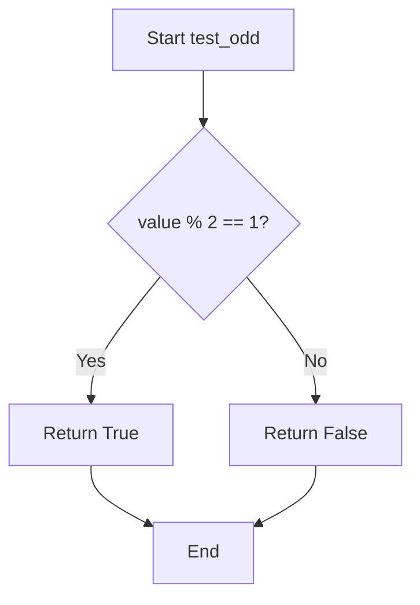

## Examples:
    >>> test_odd(3)
    True
    >>> test_odd(4)
    False
    >>> test_odd(-1)
    True
    >>> test_odd(0)
    False
```

## `src.jinja2.tests.test_even` · *function*

## Summary:
Determines whether a given integer is an even number.

## Description:
This function evaluates if the provided integer is divisible by 2 without remainder. It serves as a utility for testing and validation purposes, particularly in template rendering contexts where even-number checks are needed.

## Args:
    value (int): The integer to test for evenness. Must be a whole number.

## Returns:
    bool: True if the value is evenly divisible by 2 (i.e., the remainder is zero), False otherwise.

## Raises:
    None: This function does not raise any exceptions under normal operation.

## Constraints:
    Preconditions: The input must be an integer type.
    Postconditions: The return value is always a boolean (True or False).

## Side Effects:
    None: This function has no side effects and is pure.

## Control Flow:
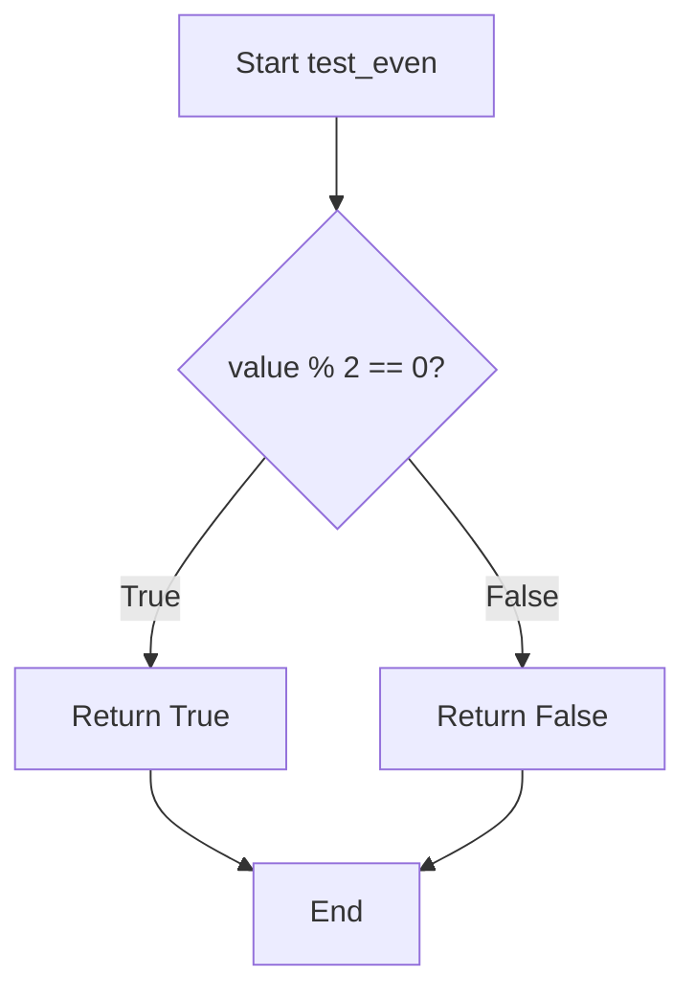

## Examples:
    >>> test_even(4)
    True
    >>> test_even(7)
    False
    >>> test_even(0)
    True
    >>> test_even(-2)
    True
    >>> test_even(-3)
    False

## `src.jinja2.tests.test_divisibleby` · *function*

## Summary:
Checks whether one integer is evenly divisible by another integer.

## Description:
This function determines if the dividend is perfectly divisible by the divisor without remainder. It's commonly used in template testing to validate numeric conditions such as even/odd number checking or grouping elements. The function leverages Python's modulo operator to perform the divisibility check.

## Args:
    value (int): The number to be tested for divisibility (dividend).
    num (int): The number to divide by (divisor).

## Returns:
    bool: True if value is divisible by num (i.e., value % num == 0), False otherwise.

## Raises:
    ZeroDivisionError: When num is zero, as division by zero is undefined in Python's modulo operation.

## Constraints:
    Preconditions:
        - Both value and num must be integers
        - num must not be zero (division by zero is undefined)
    Postconditions:
        - Returns a boolean value indicating divisibility status
        - The result is mathematically correct based on integer modulo operation
        - Behavior follows Python's standard modulo semantics

## Side Effects:
    None

## Control Flow:
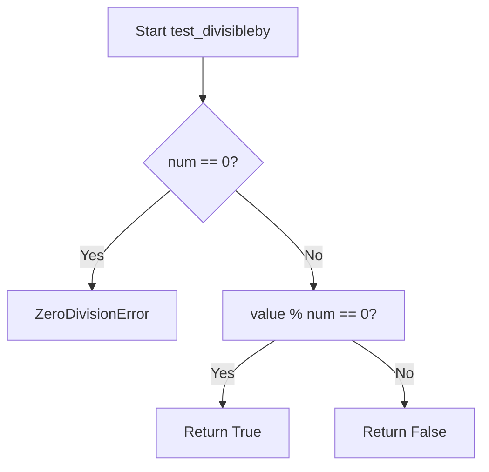

## Examples:
    # Check if 10 is divisible by 2
    result = test_divisibleby(10, 2)  # Returns True
    
    # Check if 10 is divisible by 3
    result = test_divisibleby(10, 3)  # Returns False
    
    # Check if 15 is divisible by 5
    result = test_divisibleby(15, 5)  # Returns True
    
    # Check divisibility with negative numbers
    result = test_divisibleby(-10, 2)  # Returns True
```

## `src.jinja2.tests.test_defined` · *function*

## Summary:
Checks whether a value is defined (not undefined) in a Jinja2 template context.

## Description:
This function determines if a given value represents a defined variable in Jinja2 templating. It returns True when the value is not an instance of the Undefined class, indicating the variable has been assigned a value or is explicitly defined in the template context. This test is commonly used in conditional expressions within templates to safely check variable existence before accessing their properties or values.

## Args:
    value (Any): The value to test for definition status. Can be any Python object including Jinja2's Undefined type.

## Returns:
    bool: True if the value is defined (not an instance of Undefined), False otherwise.

## Raises:
    None: This function does not raise any exceptions.

## Constraints:
    Preconditions:
        - The function accepts any Python object as input
        - No specific validation is performed on the input
    
    Postconditions:
        - Always returns a boolean value
        - The return value accurately reflects whether the input is an Undefined instance

## Side Effects:
    None: This function has no side effects and is purely a predicate check.

## Control Flow:
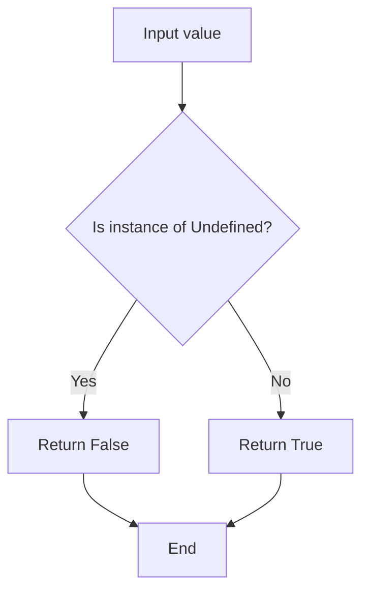

## Examples:
```python
# Basic usage in template context
{{ value is defined }}  # Returns True if value is defined

# In Python code using the test function directly
result = test_defined(some_variable)  # Returns True if defined, False if Undefined
```

## `src.jinja2.tests.test_undefined` · *function*

## Summary:
Tests whether a value is an undefined variable in Jinja2 templates.

## Description:
This utility function determines if a given value represents an undefined variable in the Jinja2 templating system. It's commonly used in template rendering contexts where variables might not be defined, allowing templates to handle such cases gracefully.

## Args:
    value (Any): The value to test for undefined status. Can be any Python object.

## Returns:
    bool: True if the value is an instance of Jinja2's Undefined class, False otherwise.

## Raises:
    None: This function does not raise any exceptions.

## Constraints:
    Preconditions: The function accepts any Python object as input.
    Postconditions: Always returns a boolean value indicating undefined status.

## Side Effects:
    None: This function has no side effects and is purely a type checking operation.

## Control Flow:
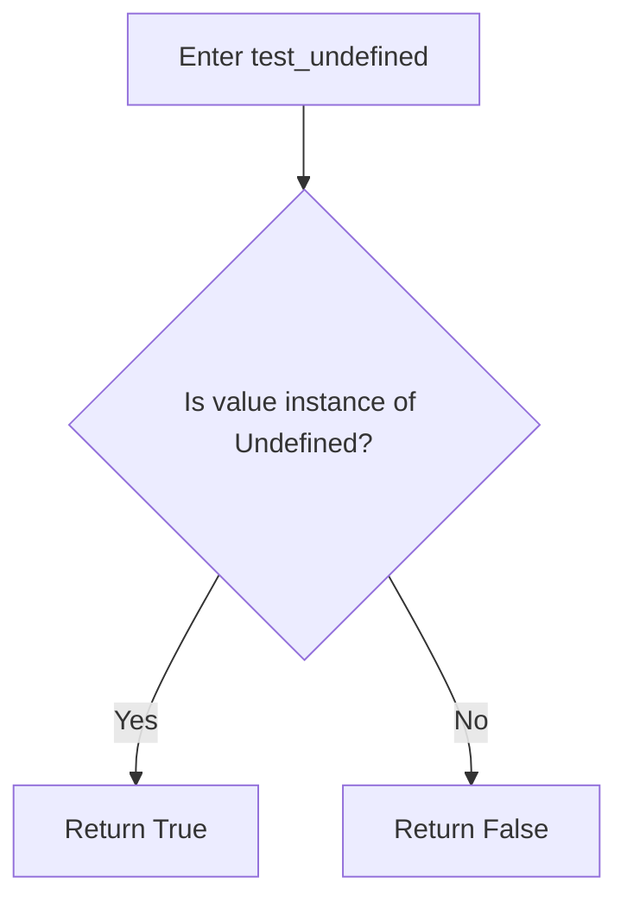

## Examples:
```python
# Test with an undefined variable
from jinja2.runtime import Undefined
undefined_var = Undefined()
result = test_undefined(undefined_var)  # Returns True

# Test with a defined value
result = test_undefined("hello")  # Returns False
result = test_undefined(42)       # Returns False
result = test_undefined(None)     # Returns False
```

## `src.jinja2.tests.test_filter` · *function*

## Summary:
Checks whether a given filter name exists in the Jinja2 environment's filter registry.

## Description:
This function performs a membership test to determine if a specified filter name is registered in the Jinja2 environment's filters collection. It's commonly used during template compilation and rendering to validate filter names before applying them to template variables.

## Args:
    env (Environment): The Jinja2 environment instance containing registered filters
    value (str): The name of the filter to check for existence in the environment

## Returns:
    bool: True if the filter name exists in env.filters, False otherwise

## Raises:
    None explicitly raised

## Constraints:
    Preconditions:
        - The env parameter must be a valid Environment instance
        - The env.filters attribute must be a collection supporting the 'in' operator
        - The value parameter must be a string

    Postconditions:
        - Returns a boolean value indicating membership status
        - Does not modify the environment or any of its attributes

## Side Effects:
    None

## Control Flow:
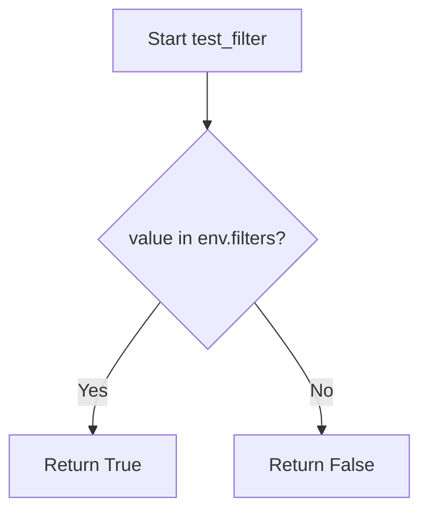

## Examples:
```python
# Check if a built-in filter exists
env = Environment()
result = test_filter(env, "upper")
# Returns True if 'upper' filter is registered

# Check if a custom filter exists
result = test_filter(env, "custom_filter")
# Returns True if 'custom_filter' was added to env.filters
```

## `src.jinja2.tests.test_test` · *function*

## Summary:
Checks whether a given test name exists in the environment's test registry.

## Description:
This function determines if a specified test name is registered within the Jinja2 environment's test collection. It serves as a lookup mechanism to validate test names before attempting to use them in template processing.

## Args:
    env (Environment): The Jinja2 environment instance containing registered tests
    value (str): The name of the test to check for existence

## Returns:
    bool: True if the test name exists in the environment's tests registry, False otherwise

## Raises:
    None explicitly raised

## Constraints:
    Preconditions:
    - The env parameter must be a valid Environment instance
    - The env.tests attribute must be a collection that supports the 'in' operator
    - The value parameter must be a string

    Postconditions:
    - Returns a boolean value indicating membership in the tests registry
    - Does not modify the environment or its tests collection

## Side Effects:
    None

## Control Flow:
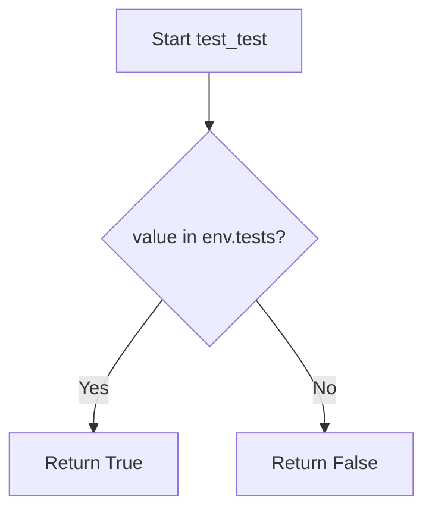

## Examples:
    # Check if 'equalto' test exists
    result = test_test(environment, 'equalto')  # Returns True if 'equalto' is registered
    
    # Check if non-existent test exists
    result = test_test(environment, 'nonexistent')  # Returns False

## `src.jinja2.tests.test_none` · *function*

## Summary:
Checks whether a given value is explicitly None.

## Description:
This function performs an identity check to determine if the provided value is the None singleton. It is commonly used in Jinja2 template expressions to test for null values.

## Args:
    value (Any): The value to test for None equality. Can be any Python object including None itself.

## Returns:
    bool: True if the value is None, False otherwise.

## Raises:
    None: This function does not raise any exceptions.

## Constraints:
    Preconditions: The function accepts any Python object as input.
    Postconditions: The return value is always a boolean (True or False).

## Side Effects:
    None: This function has no side effects.

## Control Flow:
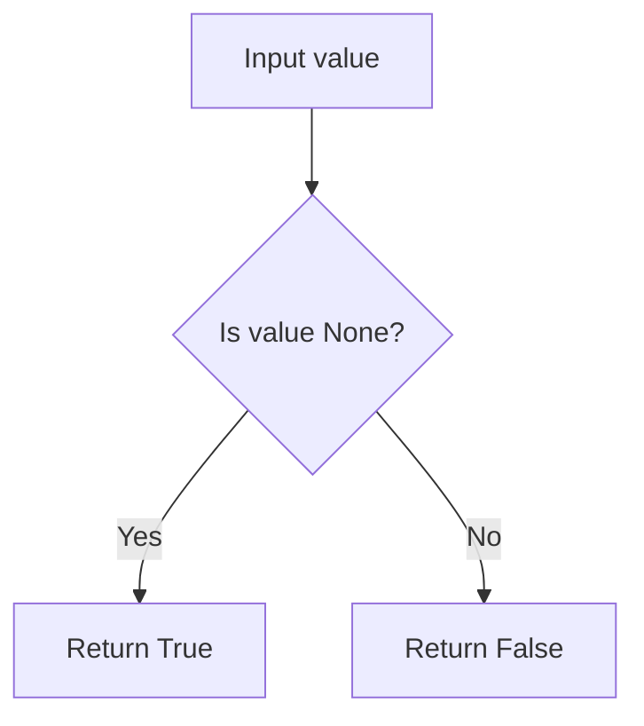

## Examples:
    # Basic usage
    test_none(None)        # Returns True
    test_none("hello")     # Returns False
    test_none(0)           # Returns False
    test_none([])          # Returns False
```

## `src.jinja2.tests.test_boolean` · *function*

## Summary:
Tests whether a value is exactly the boolean True or False.

## Description:
Determines if the provided value is strictly identical to the boolean literals True or False. This function uses identity comparison (is) rather than equality comparison (==), making it suitable for distinguishing boolean values from other truthy or falsy values like integers 1 and 0.

## Args:
    value (Any): The value to test for boolean identity. Can be any Python object.

## Returns:
    bool: True if value is exactly True or exactly False (using identity comparison), False otherwise.

## Raises:
    None: This function does not raise any exceptions.

## Constraints:
    Preconditions: The function accepts any Python object as input.
    Postconditions: The return value is always a boolean (True or False).

## Side Effects:
    None: This function has no side effects.

## Control Flow:
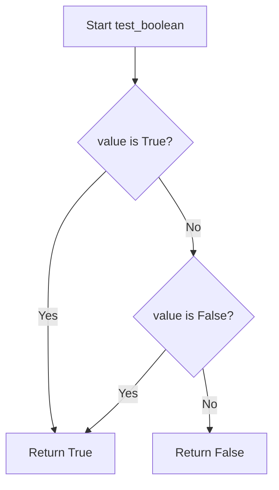

## Examples:
    >>> test_boolean(True)
    True
    >>> test_boolean(False)
    True
    >>> test_boolean(1)
    False
    >>> test_boolean(0)
    False
    >>> test_boolean("True")
    False
```

## `src.jinja2.tests.test_false` · *function*

## Summary:
Tests whether a value is exactly the boolean False constant.

## Description:
This function performs an identity check to determine if the provided value is exactly the Python boolean False object. Unlike truthiness checks, this function strictly evaluates whether the value reference is identical to the False singleton.

## Args:
    value (Any): The value to test for being exactly False

## Returns:
    bool: True if the value is exactly False (using identity comparison), False otherwise

## Raises:
    None

## Constraints:
    Preconditions: None
    Postconditions: Always returns a boolean value

## Side Effects:
    None

## Control Flow:
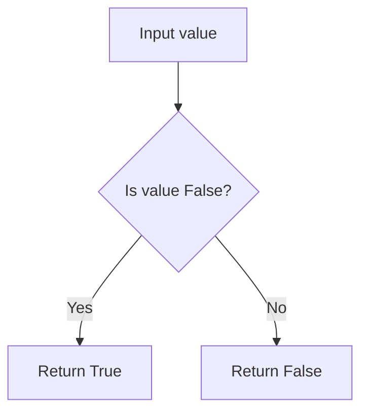

## Examples:
    # Basic usage
    test_false(False)  # Returns True
    test_false(0)      # Returns False
    test_false("")     # Returns False
    test_false(None)   # Returns False
    test_false(True)   # Returns False
```

## `src.jinja2.tests.test_true` · *function*

## Summary:
Returns True if the input value is the boolean True object, False otherwise.

## Description:
This function performs an identity check to determine if the provided value is exactly the boolean True constant. It uses the `is` operator rather than the `==` operator, ensuring that only the literal `True` value returns True, not other truthy values like non-zero numbers or non-empty containers.

## Args:
    value (Any): The value to test for being exactly True. Can be any type.

## Returns:
    bool: True if value is exactly the boolean True object, False otherwise.

## Raises:
    None

## Constraints:
    Preconditions: None
    Postconditions: Always returns a boolean value

## Side Effects:
    None

## Control Flow:
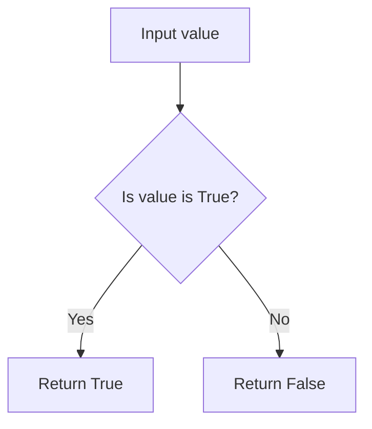

## Examples:
    >>> test_true(True)
    True
    >>> test_true(1)
    False
    >>> test_true("True")
    False
    >>> test_true(False)
    False
```

## `src.jinja2.tests.test_integer` · *function*

## Summary:
Tests whether a value is an integer type while excluding boolean values.

## Description:
Determines if a given value is an integer type but explicitly excludes Python's boolean values (True and False) since they are technically instances of int in Python. This function is commonly used in Jinja2 template conditionals to distinguish between integer and boolean values.

## Args:
    value (Any): The value to test for integer type compatibility

## Returns:
    bool: True if the value is an integer type and not a boolean; False otherwise

## Raises:
    None: This function does not raise any exceptions

## Constraints:
    Preconditions: The input value can be of any type
    Postconditions: Returns a boolean value indicating the result of the type test

## Side Effects:
    None: This function has no side effects

## Control Flow:
```mermaid
flowchart TD
    A[Start test_integer] --> B{isinstance(value, int)?}
    B -- No --> C[Return False]
    B -- Yes --> D{value is True?}
    D -- Yes --> E[Return False]
    D -- No --> F{value is False?}
    F -- Yes --> G[Return False]
    F -- No --> H[Return True]
```

## Examples:
    >>> test_integer(42)
    True
    >>> test_integer(True)
    False
    >>> test_integer(False)
    False
    >>> test_integer(3.14)
    False
    >>> test_integer("123")
    False

## `src.jinja2.tests.test_float` · *function*

## Summary:
Checks whether a given value is of type float.

## Description:
This function serves as a type test predicate that determines if the provided value is specifically an instance of Python's float type. It is part of Jinja2's template testing system, allowing template authors to perform type validation within conditional expressions.

## Args:
    value (Any): The value to test for float type membership. Can be any Python object.

## Returns:
    bool: True if the value is an instance of float, False otherwise.

## Raises:
    None: This function does not raise any exceptions.

## Constraints:
    Preconditions: The function accepts any Python object as input.
    Postconditions: The return value is always a boolean indicating type membership.

## Side Effects:
    None: This function has no side effects and is pure.

## Control Flow:
```mermaid
flowchart TD
    A[Input Value] --> B{isinstance(value, float)?}
    B -->|True| C[Return True]
    B -->|False| C
```

## Examples:
```python
# In a Jinja2 template context:

    {{ my_var }} is a float


# Direct usage:
>>> test_float(3.14)
True
>>> test_float(42)
False
>>> test_float("3.14")
False
```

## `src.jinja2.tests.test_lower` · *function*

## Summary:
Checks if a string value is entirely lowercase.

## Description:
Determines whether the string representation of a given value contains only lowercase characters. This function is typically used in Jinja2 template testing to validate string formatting requirements.

## Args:
    value: The input value to test. Can be any type that can be converted to a string.

## Returns:
    bool: True if the string representation of value contains only lowercase characters, False otherwise. Empty strings return True.

## Raises:
    None

## Constraints:
    Preconditions: The input value must be convertible to a string.
    Postconditions: The return value is always a boolean indicating lowercase status.

## Side Effects:
    None

## Control Flow:
```mermaid
flowchart TD
    A[Input value] --> B{Convert to string}
    B --> C{Check if islower()}
    C --> D[Return boolean result]
```

## Examples:
    >>> test_lower("hello")
    True
    >>> test_lower("Hello")
    False
    >>> test_lower("HELLO")
    False
    >>> test_lower("")
    True
    >>> test_lower(123)
    False
```

## `src.jinja2.tests.test_upper` · *function*

## Summary:
Tests whether a given value, when converted to a string, consists entirely of uppercase characters.

## Description:
This function serves as a test utility to verify that a value contains only uppercase letters after being converted to a string representation. It is typically used in template testing scenarios to validate string formatting or content requirements.

## Args:
    value (Any): The input value to test. This can be any object that can be converted to a string using str(). While the function signature indicates str type, the implementation accepts any type and converts it to string.

## Returns:
    bool: True if the string representation of the value consists entirely of uppercase characters and contains at least one character that is a letter; False otherwise. Returns False for empty strings or strings containing no letters.

## Raises:
    None: This function does not raise any exceptions.

## Constraints:
    Preconditions:
        - The function accepts any input that can be passed to Python's built-in str() function
        - No specific validation is performed on the input type beyond what str() allows
    
    Postconditions:
        - The return value is always a boolean (True or False)
        - The function behaves consistently with Python's str.isupper() method

## Side Effects:
    None: This function has no side effects and is purely functional.

## Control Flow:
```mermaid
flowchart TD
    A[Start test_upper] --> B{Convert value to str}
    B --> C{Check if string is uppercase}
    C --> D{String is empty or no letters?}
    D -->|Yes| E[Return False]
    D -->|No| F[Return isupper() result]
    E --> G[End]
    F --> G
```

## Examples:
    >>> test_upper("HELLO")
    True
    >>> test_upper("Hello")
    False
    >>> test_upper("hello")
    False
    >>> test_upper("123")
    False
    >>> test_upper("")
    False
    >>> test_upper("HELLO123")
    True
```

## `src.jinja2.tests.test_string` · *function*

## Summary:
Checks whether the provided value is a string instance.

## Description:
This function serves as a type test to determine if a given value is an instance of Python's built-in string type. It is typically used within template processing systems to validate data types during rendering or filtering operations.

## Args:
    value (Any): The value to test for string type. Can be any Python object.

## Returns:
    bool: True if the value is an instance of str, False otherwise.

## Raises:
    None: This function does not raise any exceptions.

## Constraints:
    Preconditions: The function accepts any Python object as input.
    Postconditions: The return value is always a boolean indicating the string type test result.

## Side Effects:
    None: This function has no side effects and is pure.

## Control Flow:
```mermaid
flowchart TD
    A[Start test_string] --> B{isinstance(value, str)?}
    B -->|Yes| C[Return True]
    B -->|No| D[Return False]
```

## Examples:
```python
# Basic usage
result = test_string("hello")  # Returns True
result = test_string(123)      # Returns False
result = test_string(None)     # Returns False

# In template context
# {{ value is string }}  # Would evaluate to True if value is a string
```

## `src.jinja2.tests.test_mapping` · *function*

## Summary:
Tests whether a value implements the mapping interface.

## Description:
Determines if the provided value is an instance of a mapping type, such as dict, OrderedDict, or other objects implementing the collections.abc.Mapping protocol.

## Args:
    value (Any): The object to test for mapping interface compliance.

## Returns:
    bool: True if the value implements collections.abc.Mapping, False otherwise.

## Raises:
    None

## Constraints:
    Preconditions: None
    Postconditions: Always returns a boolean value

## Side Effects:
    None

## Control Flow:
```mermaid
flowchart TD
    A[Input value] --> B{isinstance(value, abc.Mapping)?}
    B -->|Yes| C[Return True]
    B -->|No| D[Return False]
```

## Examples:
```python
# Test with dictionary
result = test_mapping({'a': 1, 'b': 2})  # Returns True

# Test with list
result = test_mapping([1, 2, 3])  # Returns False

# Test with string
result = test_mapping("hello")  # Returns False
```

## `src.jinja2.tests.test_number` · *function*

## Summary:
Tests whether a value is an instance of Python's numeric types.

## Description:
Determines if the provided value is an instance of Python's abstract base class `numbers.Number`. This function is commonly used in template engines to identify numeric values for proper formatting and mathematical operations.

## Args:
    value (Any): The value to test for numeric type compatibility.

## Returns:
    bool: True if the value is an instance of `numbers.Number`, False otherwise.

## Raises:
    None: This function does not raise any exceptions.

## Constraints:
    Preconditions: The function accepts any type of input value.
    Postconditions: Always returns a boolean value indicating numeric type membership.

## Side Effects:
    None: This function has no side effects and is pure.

## Control Flow:
```mermaid
flowchart TD
    A[Input value] --> B{isinstance(value, Number)?}
    B -- Yes --> C[Return True]
    B -- No --> D[Return False]
```

## Examples:
    >>> test_number(42)
    True
    >>> test_number(3.14)
    True
    >>> test_number("42")
    False
    >>> test_number(None)
    False

## `src.jinja2.tests.test_sequence` · *function*

## Summary:
Tests whether a value implements the sequence protocol by verifying it has both length and indexing capabilities.

## Description:
Determines if a given value behaves like a sequence by attempting to invoke the built-in `len()` function and the `__getitem__` method on the value. This function serves as a utility for identifying sequence-like objects in Jinja2 template processing.

## Args:
    value (Any): The object to test for sequence compatibility. Can be any Python object.

## Returns:
    bool: True if the value has both `len()` and `__getitem__` methods that don't raise exceptions; False otherwise.

## Raises:
    None: This function catches all exceptions internally and returns False for any failure.

## Constraints:
    Preconditions: The value can be any Python object.
    Postconditions: Always returns a boolean value (True or False).

## Side Effects:
    None: This function performs no I/O operations or external state mutations.

## Control Flow:
```mermaid
flowchart TD
    A[Start test_sequence] --> B{Can call len(value)?}
    B -- No --> C[Return False]
    B -- Yes --> D{Can call value.__getitem__?}
    D -- No --> E[Return False]
    D -- Yes --> F[Return True]
```

## Examples:
```python
# Testing various sequence-like objects
test_sequence([1, 2, 3])        # Returns True
test_sequence("hello")          # Returns True
test_sequence((1, 2, 3))        # Returns True

# Testing non-sequence objects
test_sequence(42)               # Returns False
test_sequence({"a": 1})         # Returns False
test_sequence(set([1, 2, 3]))   # Returns True (sets have __getitem__ in some contexts)
```

## `src.jinja2.tests.test_sameas` · *function*

## Summary:
Tests whether two values refer to the exact same object in memory.

## Description:
This function performs an identity comparison between two values using Python's `is` operator, determining if they are literally the same object rather than just equal values. It is primarily used in Jinja2's template testing framework to verify object identity in test cases.

## Args:
    value (Any): The first value to compare for identity.
    other (Any): The second value to compare for identity.

## Returns:
    bool: True if both parameters reference the exact same object in memory; False otherwise.

## Raises:
    None: This function does not raise any exceptions.

## Constraints:
    Preconditions: Both arguments can be any Python objects.
    Postconditions: The return value is always a boolean indicating object identity.

## Side Effects:
    None: This function has no side effects.

## Control Flow:
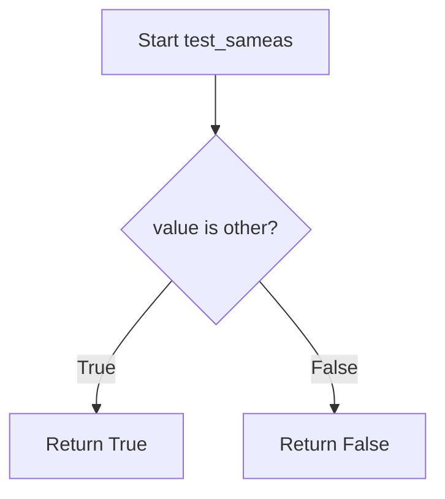

## Examples:
    # Testing with identical objects
    result = test_sameas([1, 2, 3], [1, 2, 3])  # Returns False (different list objects)
    
    # Testing with same object reference
    my_list = [1, 2, 3]
    result = test_sameas(my_list, my_list)  # Returns True (same object reference)
    
    # Testing with None
    result = test_sameas(None, None)  # Returns True (None is singleton)
```

## `src.jinja2.tests.test_iterable` · *function*

## Summary:
Determines whether a given value is iterable by attempting to create an iterator from it.

## Description:
Checks if a value supports iteration by calling the built-in `iter()` function. This utility function is commonly used in Jinja2 templates to test if a variable can be used in a for-loop construct. The function handles the common case where non-iterable objects (like integers, strings, or None) would raise a TypeError when passed to `iter()`.

## Args:
    value (t.Any): The value to test for iterability. Can be any Python object.

## Returns:
    bool: True if the value is iterable (i.e., `iter(value)` succeeds), False otherwise.

## Raises:
    None: This function does not raise exceptions directly; it catches and handles TypeError internally.

## Constraints:
    Preconditions: The function accepts any Python object as input.
    Postconditions: Always returns a boolean value (True or False).

## Side Effects:
    None: This function has no side effects and does not modify any external state.

## Control Flow:
```mermaid
flowchart TD
    A[Start test_iterable] --> B{Can iter() be called?}
    B -- Yes --> C[Return True]
    B -- No --> D[Catch TypeError]
    D --> E[Return False]
```

## Examples:
```python
# Basic usage
test_iterable([1, 2, 3])      # Returns True (list is iterable)
test_iterable("hello")        # Returns True (string is iterable)
test_iterable(42)             # Returns False (int is not iterable)
test_iterable(None)           # Returns False (None is not iterable)
test_iterable({'a': 1})       # Returns True (dict is iterable)
```

## `src.jinja2.tests.test_escaped` · *function*

## Summary:
Determines whether a value contains an HTML-escaped representation by checking for the presence of an `__html__` method.

## Description:
This function tests if a given value has an `__html__` attribute, which is commonly used in templating systems to indicate that the object's string representation already contains safe HTML that should not be escaped when rendered in templates. This is particularly useful for determining whether to apply additional HTML escaping to values in Jinja2 templates.

## Args:
    value (Any): The value to test for HTML escaping status. Can be any Python object.

## Returns:
    bool: True if the value has an `__html__` attribute, False otherwise.

## Raises:
    None: This function does not raise any exceptions.

## Constraints:
    Preconditions: The function accepts any Python object as input.
    Postconditions: The return value is always a boolean indicating the presence of the `__html__` attribute.

## Side Effects:
    None: This function performs no I/O operations or state modifications.

## Control Flow:
```mermaid
flowchart TD
    A[Input value] --> B{Has __html__ attribute?}
    B -- Yes --> C[Return True]
    B -- No --> D[Return False]
```

## Examples:
```python
# Test with a regular string
result = test_escaped("hello")  # Returns False

# Test with an object that has __html__ method
class SafeHTML:
    def __html__(self):
        return "<p>Hello</p>"

safe_obj = SafeHTML()
result = test_escaped(safe_obj)  # Returns True
```

## `src.jinja2.tests.test_in` · *function*

## Summary:
Determines if a value exists within a container or sequence for Jinja2 template testing.

## Description:
This function implements the Jinja2 "in" test operator, which evaluates whether a given value is contained within a sequence or container. It is used in Jinja2 template expressions to perform membership testing during template rendering and testing phases.

## Args:
    value (Any): The value to search for within the sequence or container
    seq (Container): The container or sequence to search in, supporting the "in" operator

## Returns:
    bool: True if value is found in seq, False otherwise

## Raises:
    None

## Constraints:
    Preconditions:
        - The seq parameter must support the "in" operator (implement __contains__ method)
        - The value parameter should be compatible with the container's __contains__ method
    
    Postconditions:
        - Always returns a boolean value
        - Does not modify the input sequence or container

## Side Effects:
    None

## Control Flow:
```mermaid
flowchart TD
    A[Start test_in] --> B{value in seq?}
    B -->|Yes| C[Return True]
    B -->|No| D[Return False]
```

## Examples:
    # In Jinja2 template context:
    # {{ 'a' in ['a', 'b', 'c'] }}  # Returns True
    # {{ 'd' in ['a', 'b', 'c'] }}  # Returns False  
    # {{ 2 in {1: 'one', 2: 'two'} }}  # Returns True (key lookup)
    # {{ 'hello' in 'hello world' }}  # Returns True (substring search)
    
    # In Python code using Jinja2 testing:
    # result = test_in('a', ['a', 'b', 'c'])  # Returns True
    # result = test_in('d', ['a', 'b', 'c'])  # Returns False

