# `utils.py`

## `src.jinja2.utils.pass_context` · *function*

## Summary:
Decorator that marks a function to receive the template context as its first argument during template execution.

## Description:
The `pass_context` decorator is used to indicate that a template function or filter should receive the Jinja2 template context as its first argument when invoked during template rendering. This enables functions to access template variables, global variables, and other contextual information available during template execution.

This decorator works in conjunction with Jinja2's argument passing mechanism, specifically the `_PassArg` enum system. When a function decorated with `pass_context` is called during template processing, the template engine will automatically inject the current template context as the first positional argument.

## Args:
    f (F): The function to be decorated, where F is a generic type representing any callable object

## Returns:
    F: The same function object, with the `jinja_pass_arg` attribute set to `_PassArg.context`

## Raises:
    None explicitly raised

## Constraints:
    Preconditions: The input function must be a valid callable object
    Postconditions: The returned function has the `jinja_pass_arg` attribute set to `_PassArg.context`

## Side Effects:
    None

## Control Flow:
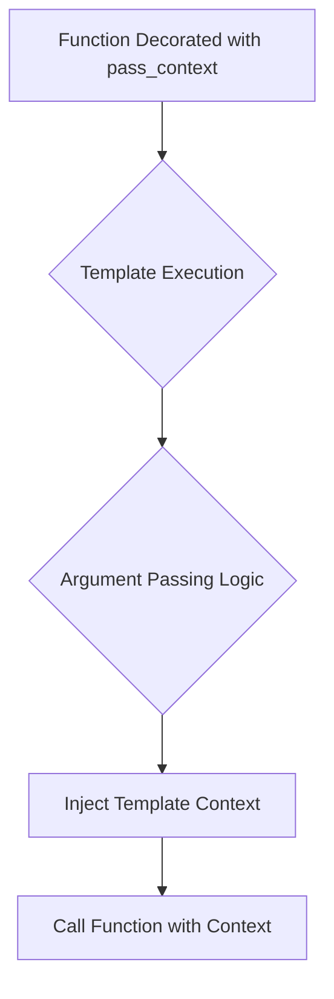

## Examples:
```python
# Define a filter that needs access to template context
@pass_context
def my_filter(context, value):
    # Access template variables through the context
    return f"Value: {value}, Template: {context.name}"

# In template:
# {{ my_value|my_filter }}
# Would call: my_filter(context, my_value)
```

## `src.jinja2.utils.pass_eval_context` · *function*

## Summary:
Decorator that marks a function to receive special arguments during template rendering.

## Description:
This decorator is used internally by Jinja2 to indicate that a function should receive special arguments (such as evaluation context) when called during template processing. It sets an internal attribute on the decorated function to signal to the template engine how arguments should be passed to the function.

## Args:
    f (F): The function to decorate, where F is a generic type representing a callable function.

## Returns:
    F: The same function object, unchanged, but with the jinja_pass_arg attribute set.

## Raises:
    None explicitly raised by this function.

## Constraints:
    Preconditions:
    - The function `f` must be callable
    
    Postconditions:
    - The returned function has the attribute `jinja_pass_arg` set
    - The original function object is returned unchanged

## Side Effects:
    None - This function only modifies the metadata of the input function.

## Control Flow:
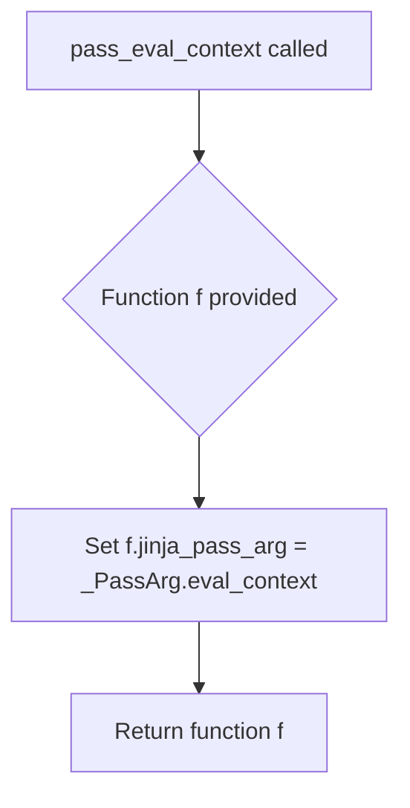

## Examples:
```python
@pass_eval_context
def my_template_function(context, arg1, arg2):
    # This function will receive special arguments during template rendering
    return context + arg1 + arg2

# Usage in Jinja2 template context
# The template engine will recognize this function's argument requirements
```

## `src.jinja2.utils.pass_environment` · *function*

## Summary:
Decorator that marks a function to indicate it should receive the Jinja2 environment argument during template rendering.

## Description:
This decorator is used to signal to the Jinja2 template engine that a function should be invoked with the environment object as its first argument. It adds metadata to the function that the template engine uses to determine argument passing behavior.

## Args:
    f (F): The function to be decorated, where F is a generic function type representing a callable.

## Returns:
    F: The same function object, modified to include an internal attribute indicating argument passing requirements.

## Raises:
    None explicitly raised by this function.

## Constraints:
    Preconditions:
    - The function `f` must be callable
    - The `_PassArg` enumeration must be available in the scope
    
    Postconditions:
    - The returned function has a `jinja_pass_arg` attribute set to indicate it expects the environment argument
    - The original function object is returned unchanged except for the added attribute

## Side Effects:
    None - This function only modifies the metadata of the input function by adding an attribute.

## Control Flow:
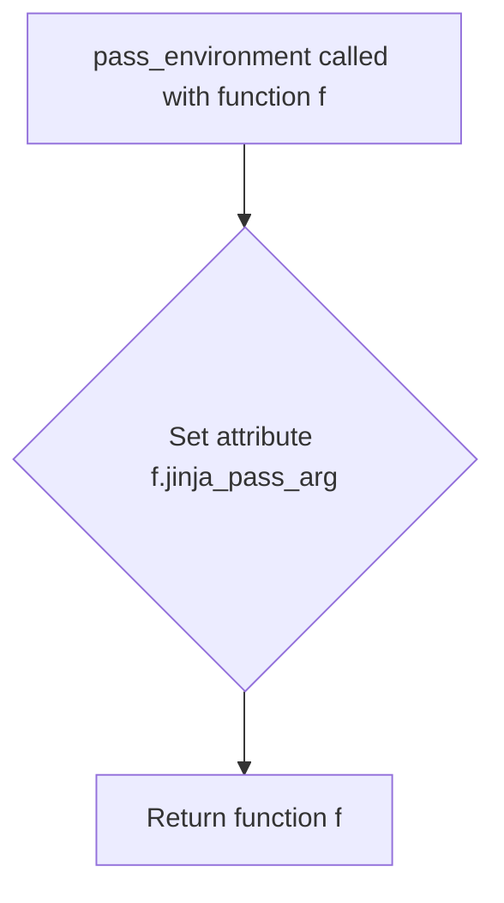

## Examples:
```python
@pass_environment
def my_filter(value, environment):
    # This function will receive the environment object when called in a template
    return value.upper()

# Usage in a Jinja2 template:
# {{ my_filter("hello") }}
```

## `src.jinja2.utils._PassArg` · *class*

## Summary:
An enumeration defining the three possible argument passing modes for Jinja2 template functions.

## Description:
The `_PassArg` enum specifies how arguments should be passed to callable objects in the Jinja2 template system. It defines three distinct modes that control the context available to template functions during execution. This enum is used internally by Jinja2 to determine the appropriate argument injection strategy when calling template functions or filters.

## State:
- `context` (enum member): Represents passing the template context as an argument
- `eval_context` (enum member): Represents passing the evaluation context as an argument  
- `environment` (enum member): Represents passing the Jinja2 environment as an argument

The enum values are automatically assigned using `enum.auto()`.

## Lifecycle:
- Creation: Instances are created automatically as enum members during class definition
- Usage: The `from_obj` classmethod is used to inspect objects and determine their preferred argument passing mode
- Destruction: No explicit cleanup required as this is a standard enum

## Method Map:
```mermaid
graph TD
    A[Object with jinja_pass_arg] --> B{from_obj}
    B --> C[_PassArg.value or None]
    D[Template Function Call] --> E{Argument Injection}
    E --> F[context|eval_context|environment]
```

## Raises:
- No exceptions are raised by the enum itself
- The `from_obj` method may return None if no `jinja_pass_arg` attribute is found

## Example:
```python
# Creating a function with explicit argument passing preference
def my_filter(value):
    return value.upper()

my_filter.jinja_pass_arg = _PassArg.context

# Using the enum
arg_mode = _PassArg.from_obj(my_filter)  # Returns _PassArg.context
```

### `src.jinja2.utils._PassArg.from_obj` · *method*

## Summary:
Retrieves a Jinja2 pass argument enumeration from an object if it has the appropriate attribute.

## Description:
This class method checks if the provided object has a `jinja_pass_arg` attribute and returns its value if present. This mechanism allows objects to declare which Jinja2 context arguments they require during template processing. The method is typically called during template compilation or execution to determine what contextual information needs to be passed to callable objects.

## Args:
    cls: The _PassArg class (unused in implementation)
    obj: Any object that may have a jinja_pass_arg attribute

## Returns:
    _PassArg or None: The jinja_pass_arg attribute value if present, otherwise None

## Raises:
    None explicitly raised

## State Changes:
    Attributes READ: obj.jinja_pass_arg
    Attributes WRITTEN: None

## Constraints:
    Preconditions: The object must be a valid Python object that can be checked with hasattr()
    Postconditions: Returns either a _PassArg enum value or None, with no side effects on the input object

## Side Effects:
    None

## `src.jinja2.utils.internalcode` · *function*

*No documentation generated.*

## `src.jinja2.utils.is_undefined` · *function*

## Summary:
Determines whether an object is an instance of the Undefined class used in Jinja2 template rendering.

## Description:
Checks if the provided object is an instance of the Undefined class, which represents template variables that have not been defined in the template context. This utility function is commonly used throughout the Jinja2 codebase to handle cases where template variables are accessed but not provided in the rendering context.

## Args:
    obj (Any): The object to test for being undefined. Can be any Python object.

## Returns:
    bool: True if the object is an instance of Undefined, False otherwise.

## Raises:
    None: This function does not raise any exceptions.

## Constraints:
    Preconditions: The function accepts any Python object as input.
    Postconditions: The function always returns a boolean value.

## Side Effects:
    None: This function has no side effects and is purely a type checking operation.

## Control Flow:
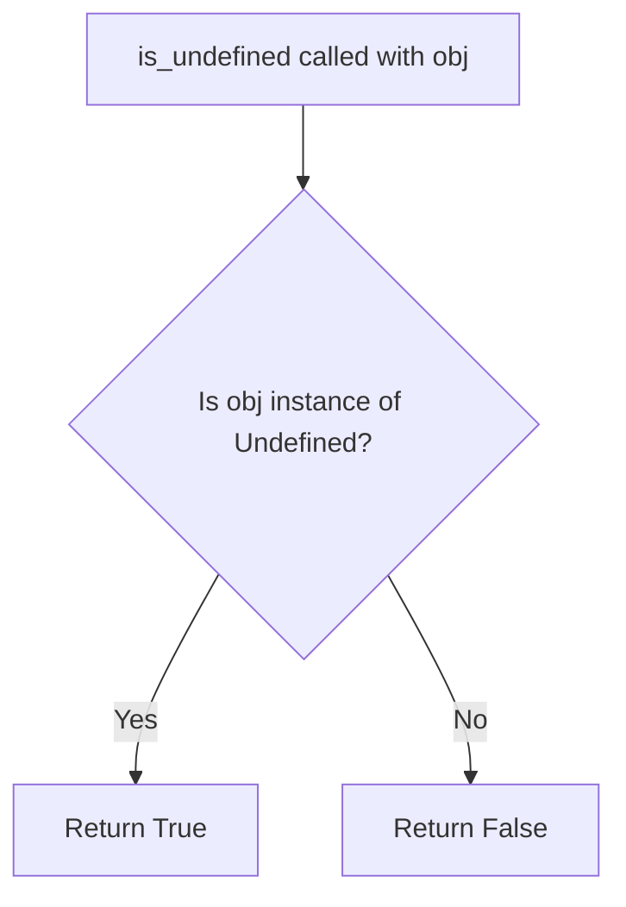

## Examples:
```python
# Check if a variable is undefined
from jinja2.runtime import Undefined
from jinja2.utils import is_undefined

# Create an undefined variable
undefined_var = Undefined()

# Test if it's undefined
result = is_undefined(undefined_var)  # Returns True

# Test with a regular string
regular_string = "hello"
result = is_undefined(regular_string)  # Returns False
```

## `src.jinja2.utils.clear_caches` · *function*

## Summary:
Clears internal caches used by the Jinja2 templating engine to free up memory and ensure fresh state.

## Description:
This function provides a centralized way to clear two key caches within the Jinja2 templating system: the spontaneous environment cache and the lexer cache. It is typically called during testing, development, or when cache invalidation is needed to ensure that subsequent template processing starts with clean state.

The function extracts the clearing logic into a dedicated utility to maintain clean separation of concerns and provide a consistent interface for cache management throughout the application.

## Args:
    None

## Returns:
    None

## Raises:
    None

## Constraints:
    Preconditions:
    - The function assumes that `get_spontaneous_environment` and `_lexer_cache` are properly initialized and available in the module scope.
    
    Postconditions:
    - Both caches are cleared and ready for reuse.
    - No cached data remains in either cache.

## Side Effects:
    - Clears internal memory caches used by Jinja2 templating engine.
    - No external I/O operations or state mutations outside of the caching system.

## Control Flow:
```mermaid
flowchart TD
    A[clear_caches() called] --> B{get_spontaneous_environment.cache_clear()}
    B --> C{_lexer_cache.clear()}
    C --> D[Function returns None]
```

## Examples:
```python
# Clear all Jinja2 caches
clear_caches()

# Typically used in test cleanup or during development
def test_template_rendering():
    # ... setup ...
    result = render_template(template_str, context)
    # ... assertions ...
    clear_caches()  # Ensure clean state for next test
```

## `src.jinja2.utils.import_string` · *function*

## Summary:
Dynamically imports a Python object from a string specification.

## Description:
Imports a Python object from a string representation that can specify either a module, a module.attribute, or a module:attribute format. This utility enables dynamic imports commonly used in configuration systems, plugin architectures, and template engines.

## Args:
    import_name (str): String specifying the object to import, in one of these formats:
        - Module name only (e.g., "os")
        - Module.attribute (e.g., "collections.defaultdict")
        - Module:attribute (e.g., "myapp.views:index_view")
    silent (bool): If True, suppresses ImportErrors and AttributeErrors. Defaults to False.

## Returns:
    Any: The imported Python object. Returns the module itself when only a module name is specified.

## Raises:
    ImportError: When the specified module cannot be imported.
    AttributeError: When the specified attribute cannot be found in the module.

## Constraints:
    Preconditions:
        - import_name must be a valid string
        - The specified module and attribute must exist if not using silent mode
    Postconditions:
        - Returns the requested object or raises appropriate exceptions

## Side Effects:
    None

## Control Flow:
```mermaid
flowchart TD
    A[import_string called] --> B{Contains ':'?}
    B -- Yes --> C[Split on ':']
    B -- No --> D{Contains '.'?}
    D -- Yes --> E[Split on last '.']
    D -- No --> F[Return __import__(import_name)]
    C --> G[Import module]
    G --> H[Get attribute from module]
    E --> I[Import module]
    I --> H
    H --> J[Return imported object]
    K[Exception caught] --> L{silent=False?}
    L -- Yes --> M[Raise exception]
    L -- No --> N[Silently return None]
```

## Examples:
    # Import a module
    math_module = import_string("math")
    
    # Import a module attribute
    defaultdict_class = import_string("collections.defaultdict")
    
    # Import with explicit module:attribute syntax
    view_func = import_string("myapp.views:index_view")
    
    # Silent import (no exception raised)
    obj = import_string("nonexistent.module", silent=True)
```

## `src.jinja2.utils.open_if_exists` · *function*

## Summary:
Attempts to open a file if it exists, returning the file handle or None if the file doesn't exist.

## Description:
This utility function provides a safe way to open files that may or may not exist. Instead of raising FileNotFoundError when a file is missing, it gracefully returns None, allowing callers to handle the absence of files without exception handling.

The function performs a file existence check before attempting to open the file, making it suitable for scenarios where file presence is uncertain or optional.

## Args:
    filename (str): Path to the file to be opened
    mode (str): File opening mode, defaults to "rb" (read binary)

## Returns:
    t.Optional[t.IO]: File handle if the file exists and can be opened, None otherwise

## Raises:
    None explicitly raised by this function

## Constraints:
    Preconditions:
        - filename must be a valid string path
        - mode must be a valid file mode string
    Postconditions:
        - If file exists: returns a valid file handle that should be closed by caller
        - If file doesn't exist: returns None

## Side Effects:
    - File system I/O operations when checking file existence and opening file
    - May raise OSError if file exists but cannot be opened due to permissions or other issues

## Control Flow:
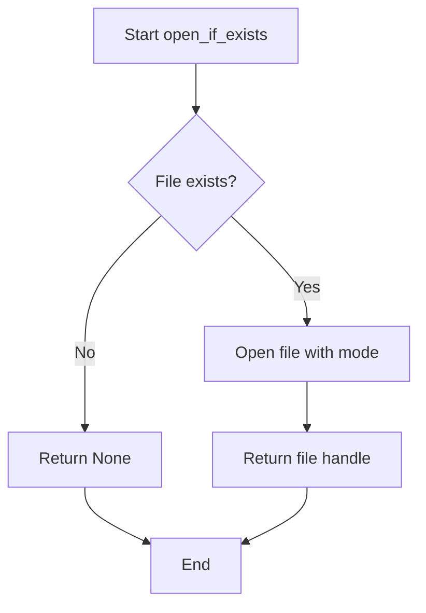

## Examples:
```python
# Basic usage
file_handle = open_if_exists("config.json")
if file_handle:
    # Safe to read from file_handle
    data = json.load(file_handle)
    file_handle.close()
else:
    # Handle missing file case
    print("Config file not found")

# With custom mode
text_file = open_if_exists("README.md", "r")
if text_file:
    content = text_file.read()
    text_file.close()
```

## `src.jinja2.utils.object_type_repr` · *function*

## Summary:
Returns a human-readable string representation of an object's type, distinguishing between built-in types and custom types.

## Description:
This utility function converts an object into a descriptive string that indicates its type. It provides special handling for None and Ellipsis objects, while for regular objects it distinguishes between built-in types (which are displayed simply) and user-defined types (which include their full module path).

## Args:
    obj (Any): The object whose type representation is to be generated

## Returns:
    str: A string describing the object's type. For None returns "None", for Ellipsis returns "Ellipsis". For built-in types returns "{type_name} object", for other types returns "{module}.{type_name} object".

## Raises:
    No exceptions are raised by this function

## Constraints:
    Preconditions:
    - The function accepts any object as input
    - No validation is performed on the input object
    
    Postconditions:
    - Always returns a string value
    - The returned string follows a consistent format pattern

## Side Effects:
    None

## Control Flow:
```mermaid
flowchart TD
    A[Start object_type_repr] --> B{obj is None?}
    B -- Yes --> C[Return "None"]
    B -- No --> D{obj is Ellipsis?}
    D -- Yes --> E[Return "Ellipsis"]
    D -- No --> F[Get type of obj]
    F --> G{type.__module__ == "builtins"?}
    G -- Yes --> H[Return "{type.__name__} object"]
    G -- No --> I[Return "{type.__module__}.{type.__name__} object"]
```

## Examples:
    >>> object_type_repr(None)
    'None'
    
    >>> object_type_repr(...)
    'Ellipsis'
    
    >>> object_type_repr(42)
    'int object'
    
    >>> object_type_repr("hello")
    'str object'
    
    >>> object_type_repr([1, 2, 3])
    'list object'
    
    >>> object_type_repr(object())
    '__main__.object object'
```

## `src.jinja2.utils.pformat` · *function*

## Summary:
Formats any Python object into a readable string representation with pretty-printing.

## Description:
This function provides a pretty-printed string representation of Python objects, making them easier to read and debug. It serves as a thin wrapper around Python's standard library `pprint.pformat` function, ensuring consistent formatting behavior throughout the Jinja2 codebase.

## Args:
    obj (Any): Any Python object that can be serialized or formatted by the pprint module

## Returns:
    str: A formatted string representation of the input object with proper indentation and line breaks

## Raises:
    None: This function does not raise any exceptions directly, though underlying pprint operations may raise exceptions for unsupported object types

## Constraints:
    - Preconditions: The input object must be serializable by the pprint module
    - Postconditions: The returned string will be a valid, pretty-printed representation of the input object

## Side Effects:
    - None: This function has no side effects beyond returning a formatted string

## Control Flow:
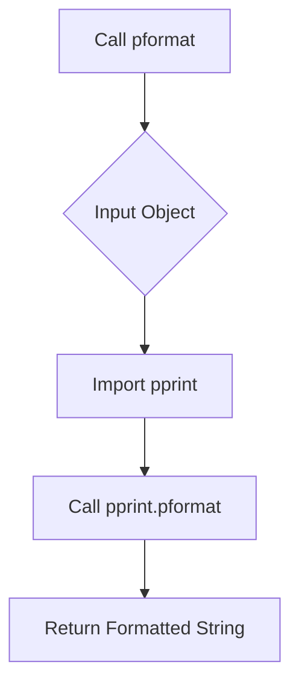

## Examples:
```python
# Basic usage
result = pformat({'key': 'value', 'number': 42})
print(result)
# Output: "{'key': 'value', 'number': 42}"

# With nested structures
data = {'users': [{'name': 'Alice'}, {'name': 'Bob'}]}
formatted = pformat(data)
print(formatted)
# Output: "{\n    'users': [\n        {'name': 'Alice'},\n        {'name': 'Bob'}\n    ]\n}"
```

## `src.jinja2.utils.urlize` · *function*

## Summary:
Converts URLs and email addresses in text to HTML anchor tags with configurable attributes.

## Description:
Processes input text to identify and convert URLs (http, https, mailto) and email addresses into clickable HTML anchor tags. Supports custom attributes like rel and target, URL truncation, and additional URL schemes.

## Args:
    text (str): Input text containing URLs or email addresses to convert.
    trim_url_limit (int, optional): Maximum length of URL to display before truncating with ellipsis. Defaults to None.
    rel (str, optional): Value for the rel attribute in anchor tags. Defaults to None.
    target (str, optional): Value for the target attribute in anchor tags. Defaults to None.
    extra_schemes (Iterable[str], optional): Additional URL schemes to recognize and convert. Defaults to None.

## Returns:
    str: Text with URLs and email addresses converted to HTML anchor tags.

## Raises:
    None explicitly raised in the function.

## Constraints:
    Preconditions:
    - text parameter must be convertible to string
    - trim_url_limit, if provided, must be a positive integer
    - rel and target parameters, if provided, must be strings
    
    Postconditions:
    - Output text contains properly escaped HTML anchor tags
    - All URLs and email addresses in input are converted to links
    - Whitespace in input is preserved in output

## Side Effects:
    None.

## Control Flow:
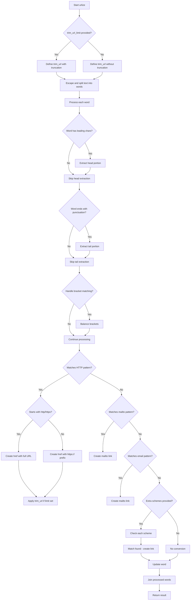

## Examples:
    Basic URL conversion:
    >>> urlize("Visit https://example.com for more info")
    'Visit <a href="https://example.com">https://example.com</a> for more info'
    
    With URL truncation:
    >>> urlize("See https://very-long-url.example.com/path", trim_url_limit=10)
    'See <a href="https://very-long-url.example.com/path">https://very-...</a>'
    
    With rel attribute:
    >>> urlize("Check out https://example.com", rel="nofollow")
    'Check out <a href="https://example.com" rel="nofollow">https://example.com</a>'

## `src.jinja2.utils.generate_lorem_ipsum` · *function*

## Summary:
Generates randomized lorem ipsum text paragraphs with proper punctuation and capitalization.

## Description:
Creates randomized lorem ipsum text consisting of a specified number of paragraphs. Each paragraph contains a random number of words within the specified range, with automatic punctuation and capitalization. This function is extracted to provide reusable text generation capability for templates and testing purposes.

## Args:
    n (int): Number of paragraphs to generate. Defaults to 5.
    html (bool): Whether to return HTML markup with paragraph tags. Defaults to True.
    min (int): Minimum number of words per paragraph. Defaults to 20.
    max (int): Maximum number of words per paragraph. Defaults to 100.

## Returns:
    str: Generated lorem ipsum text. If html=True, returns HTML markup with paragraph tags; otherwise returns plain text separated by double newlines.

## Raises:
    None explicitly raised.

## Constraints:
    Preconditions:
    - n must be non-negative integer
    - min and max must be positive integers with min <= max
    - LOREM_IPSUM_WORDS constant must be available and contain space-separated words
    
    Postconditions:
    - Returns properly formatted text with correct punctuation
    - Paragraphs begin with capitalized words
    - Paragraphs end with periods or are properly terminated

## Side Effects:
    None.

## Control Flow:
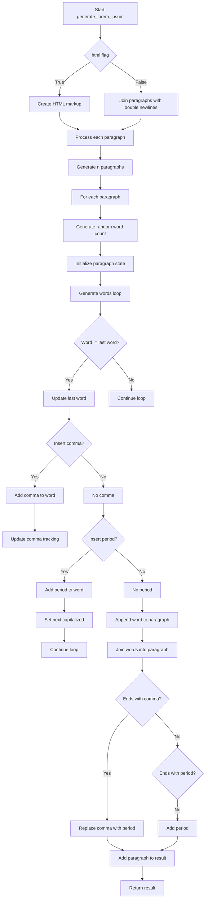

## Examples:
    # Generate 3 paragraphs with default settings
    text = generate_lorem_ipsum(3)
    # Returns HTML formatted text with 3 paragraphs
    
    # Generate 2 plain text paragraphs
    text = generate_lorem_ipsum(2, html=False)
    # Returns plain text with double newlines between paragraphs
    
    # Generate 1 paragraph with 10-30 words
    text = generate_lorem_ipsum(1, min=10, max=30)
    # Returns HTML formatted single paragraph with 10-30 words

## `src.jinja2.utils.url_quote` · *function*

## Summary:
URL-encodes an object for use in URLs or query strings, handling various input types and character encodings.

## Description:
Converts an input object to a URL-encoded string using UTF-8 encoding by default. The function handles different input types (strings, bytes, and other objects) by converting them appropriately before encoding. When used for query string encoding, spaces are converted to '+' characters instead of '%20'.

## Args:
    obj (Any): The object to URL-encode. Can be a string, bytes, or any object that can be converted to string.
    charset (str): Character encoding to use when converting non-byte/string objects to bytes. Defaults to "utf-8".
    for_qs (bool): If True, encode for use in query strings where spaces should become '+'. Defaults to False.

## Returns:
    str: URL-encoded representation of the input object with appropriate safe characters based on the for_qs flag.

## Raises:
    UnicodeEncodeError: If the object cannot be encoded with the specified charset.

## Constraints:
    Preconditions:
        - The charset parameter must be a valid encoding name recognized by Python's encode() method
        - Input object must be convertible to string or bytes
    
    Postconditions:
        - Returns a properly URL-encoded string
        - For non-query-string encoding, '/' characters remain unencoded
        - For query-string encoding, spaces are encoded as '+' instead of '%20'

## Side Effects:
    None

## Control Flow:
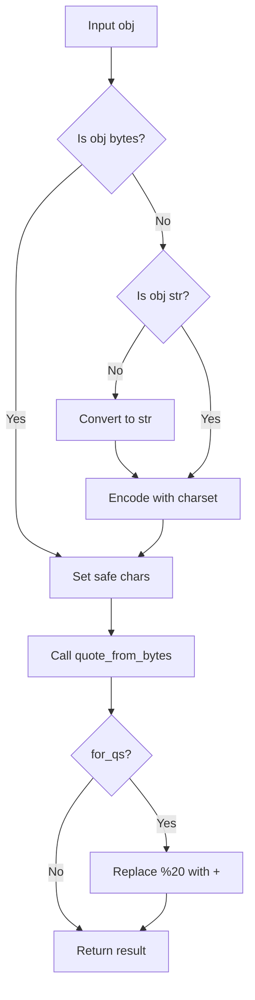

## Examples:
    >>> url_quote("hello world")
    'hello%20world'
    
    >>> url_quote("hello world", for_qs=True)
    'hello+world'
    
    >>> url_quote("/path/to/resource")
    '/path/to/resource'
    
    >>> url_quote("/path/to/resource", for_qs=True)
    '/path/to/resource'
    
    >>> url_quote(123)
    '123'
```

## `src.jinja2.utils.LRUCache` · *class*

## Summary:
LRUCache is a thread-safe, fixed-capacity cache implementation that automatically removes the least recently used items when the capacity is exceeded.

## Description:
This class implements a Least Recently Used (LRU) caching strategy, commonly used to optimize performance by keeping frequently accessed items readily available while automatically evicting older items when the cache reaches its maximum capacity. The cache is thread-safe and uses a combination of a dictionary for O(1) lookups and a deque for maintaining access order.

The LRUCache is typically used in scenarios where memory is limited and you want to maintain a working set of frequently accessed data. It's commonly used in template engines like Jinja2 for caching compiled templates, lexers, or other expensive-to-compute objects.

## State:
- capacity: int - Maximum number of items the cache can hold. Must be positive.
- _mapping: dict - Dictionary mapping cache keys to values for O(1) lookup.
- _queue: deque - Deque maintaining the order of item access, with most recent items at the end.
- _popleft: method - Reference to deque.popleft for efficient removal of oldest items.
- _pop: method - Reference to deque.pop for removing items from the end.
- _remove: method - Reference to deque.remove for removing specific items from the middle.
- _wlock: Lock - Thread lock for synchronizing access to the cache.
- _append: method - Reference to deque.append for adding items to the end.

## Lifecycle:
- Creation: Instantiate with a positive integer capacity parameter
- Usage: Access items via __getitem__, set items via __setitem__, check existence with __contains__
- Destruction: Automatic cleanup when object goes out of scope, or manually via clear() method

## Method Map:
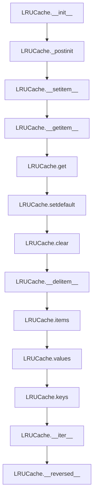

## Raises:
- None explicitly raised by __init__ (assumes capacity is a valid positive integer)

## Example:
```python
# Create a cache with capacity 3
cache = LRUCache(3)

# Add items
cache['a'] = 1
cache['b'] = 2
cache['c'] = 3

# Access items (updates LRU order)
value = cache['a']

# Add item that exceeds capacity (evicts least recently used)
cache['d'] = 4  # This evicts 'b' since it was least recently used

# Check contents
print(len(cache))  # Output: 3
print('a' in cache)  # Output: True
print('b' in cache)  # Output: False
```

### `src.jinja2.utils.LRUCache.__init__` · *method*

## Summary:
Initializes an LRU cache with a specified maximum capacity and sets up internal data structures for tracking cached items.

## Description:
Constructs an LRUCache instance with a fixed maximum capacity, initializing internal data structures including a dictionary for fast lookups and a deque for maintaining access order. This method prepares the cache for use by setting up the underlying storage mechanisms and calling post-initialization setup to configure thread safety and method references.

## Args:
    capacity (int): Maximum number of items the cache can hold. Must be a positive integer.

## Returns:
    None: This method does not return a value.

## Raises:
    None: This method does not explicitly raise exceptions, though invalid capacity values may cause issues in subsequent operations.

## State Changes:
    Attributes READ: None
    Attributes WRITTEN: 
        - self.capacity: Set to the provided capacity value
        - self._mapping: Initialized as an empty dictionary for key-value storage
        - self._queue: Initialized as an empty deque for tracking access order
        - self._popleft, self._pop, self._remove, self._wlock, self._append: Set by _postinit() call

## Constraints:
    Preconditions:
        - Capacity must be a positive integer to ensure meaningful cache behavior
        - The LRUCache class must be properly imported and available
        
    Postconditions:
        - The cache instance is ready for use with the specified capacity
        - Internal data structures are initialized and ready for caching operations
        - Thread safety mechanisms are configured via _postinit()

## Side Effects:
    None: This method only initializes internal state and does not perform I/O or external service calls.

### `src.jinja2.utils.LRUCache._postinit` · *method*

## Summary:
Initializes internal method references and synchronization primitives for the LRU cache operations.

## Description:
This method performs post-initialization setup for the LRUCache instance by caching method references from the internal deque and creating a thread lock. It is called during object initialization and deserialization to ensure proper internal state setup.

## Args:
    self: The LRUCache instance being initialized

## Returns:
    None

## Raises:
    None

## State Changes:
    Attributes READ: self._queue
    Attributes WRITTEN: self._popleft, self._pop, self._remove, self._wlock, self._append

## Constraints:
    Preconditions: 
    - self._queue must be initialized as a deque instance
    - self._queue must support the methods popleft, pop, remove, and append
    
    Postconditions:
    - self._popleft, self._pop, self._remove, self._append are bound method references from self._queue
    - self._wlock is a threading.Lock instance for thread safety

## Side Effects:
    None

### `src.jinja2.utils.LRUCache.__getstate__` · *method*

## Summary:
Returns the internal state of the LRU cache for serialization during pickling operations.

## Description:
Implements Python's pickle protocol by returning a dictionary containing the essential internal state of the LRUCache instance. This method is automatically called during the pickling process to capture the object's state, allowing it to be properly reconstructed later via `__setstate__`. The returned state includes the cache capacity, the internal mapping of keys to values, and the ordering queue that tracks item access patterns.

## Args:
    None

## Returns:
    dict: A dictionary mapping attribute names to their current values containing:
        - "capacity" (int): The maximum number of items the cache can hold
        - "_mapping" (dict): Dictionary storing key-value pairs in the cache
        - "_queue" (collections.deque): Deque tracking the order of item access for LRU eviction

## Raises:
    None

## State Changes:
    Attributes READ: self.capacity, self._mapping, self._queue
    Attributes WRITTEN: None

## Constraints:
    Preconditions: The LRUCache instance must be properly initialized with valid capacity, mapping, and queue attributes
    Postconditions: The returned dictionary contains exactly the three specified attributes with their current values

## Side Effects:
    None

### `src.jinja2.utils.LRUCache.__setstate__` · *method*

## Summary:
Restores the LRUCache object's state from a pickled representation and initializes internal helper attributes.

## Description:
This special method is invoked during unpickling to restore the LRUCache object's state from a serialized dictionary. It updates the instance's attributes using the provided dictionary and then calls `_postinit()` to reinitialize internal helper methods and synchronization primitives that depend on the restored state.

## Args:
    d (Mapping[str, Any]): A dictionary containing the serialized state of the LRUCache object, typically including capacity, _mapping, and _queue.

## Returns:
    None: This method modifies the object in-place and does not return a value.

## Raises:
    None: This method does not explicitly raise exceptions, though underlying operations may raise exceptions.

## State Changes:
    Attributes READ: None (reads from the input dictionary)
    Attributes WRITTEN: All attributes present in the input dictionary `d`, including capacity, _mapping, and _queue.

## Constraints:
    Preconditions: The input dictionary `d` must contain valid state data that matches the expected structure from `__getstate__()`.
    Postconditions: After execution, the LRUCache object will have its attributes restored and internal helper methods properly initialized via `_postinit()`.

## Side Effects:
    None: This method only modifies the internal state of the object and does not perform I/O or external service calls.

### `src.jinja2.utils.LRUCache.__getnewargs__` · *method*

## Summary:
Returns the constructor arguments needed to recreate the LRU cache during unpickling.

## Description:
This method implements Python's pickle protocol by returning the minimum set of arguments required to reconstruct the LRUCache instance. It is called during the unpickling process to determine how to recreate the object using its constructor.

## Args:
    None

## Returns:
    tuple: A single-element tuple containing the cache capacity (self.capacity)

## Raises:
    None

## State Changes:
    Attributes READ: self.capacity
    Attributes WRITTEN: None

## Constraints:
    Preconditions: The LRUCache instance must be properly initialized with a capacity
    Postconditions: The returned tuple contains exactly one element - the capacity value

## Side Effects:
    None

### `src.jinja2.utils.LRUCache.get` · *method*

## Summary:
Retrieves a value from the cache by key, returning a default value if the key is not present.

## Description:
Implements a dictionary-style get operation that retrieves values from the LRU cache. If the key exists, it returns the associated value and updates the key's position in the LRU queue to mark it as recently used. If the key does not exist, it returns the specified default value instead.

This method provides thread-safe access to cached values while maintaining the LRU eviction policy. It's commonly used in template rendering contexts where cached values need to be accessed efficiently.

## Args:
    key (Any): The key to look up in the cache
    default (Any, optional): The value to return if the key is not found. Defaults to None

## Returns:
    Any: The cached value associated with the key, or the default value if the key is not present

## Raises:
    None: This method does not raise exceptions directly, though underlying operations may raise exceptions

## State Changes:
    Attributes READ: self._mapping, self._queue
    Attributes WRITTEN: self._mapping, self._queue (when key exists and needs LRU update)

## Constraints:
    Preconditions: The LRUCache instance must be properly initialized with a positive capacity
    Postconditions: If key exists, it becomes the most recently used item in the cache; if key doesn't exist, no modifications are made to the cache

## Side Effects:
    Thread safety: Acquires a write lock during cache access operations
    LRU management: Updates the internal queue to reflect the most recently used status of accessed keys

### `src.jinja2.utils.LRUCache.setdefault` · *method*

## Summary:
Retrieves a cached value for the given key, or sets and returns a default value if the key is not present.

## Description:
This method attempts to retrieve a value from the LRU cache using the provided key. If the key exists in the cache, it returns the associated value. If the key does not exist, it sets the key to the specified default value, stores it in the cache, and returns that default value. This operation is thread-safe and maintains the LRU ordering of cache entries.

## Args:
    key (Any): The cache key to look up or set
    default (Any, optional): The default value to set and return if key is not present. Defaults to None

## Returns:
    Any: The cached value if key exists, otherwise the default value that was set

## Raises:
    None: This method does not raise exceptions directly, though underlying operations may raise exceptions

## State Changes:
    Attributes READ: 
        - self._mapping: Dictionary storing key-value pairs
        - self._queue: Deque maintaining LRU order
    
    Attributes WRITTEN:
        - self._mapping: May be updated when setting new key-value pair
        - self._queue: May be updated when adding new key or reordering existing key

## Constraints:
    Preconditions:
        - self must be an instance of LRUCache
        - key must be hashable (as required by dict keys)
        - The cache must have sufficient capacity if a new entry is added
        
    Postconditions:
        - If key existed: returns existing value without modification
        - If key did not exist: adds key-value pair to cache and returns default value
        - Cache maintains LRU ordering invariant

## Side Effects:
    - Thread synchronization via self._wlock when accessing/modifying cache internals
    - Potential cache eviction if capacity is exceeded when adding new entries
    - Modifies internal cache state (both _mapping and _queue)

### `src.jinja2.utils.LRUCache.clear` · *method*

## Summary:
Clears all cached entries from the LRU cache, resetting its internal state.

## Description:
Removes all key-value pairs from the cache's mapping and clears the access queue while maintaining thread safety through a write lock. This method effectively resets the cache to an empty state, making it ready for new entries.

## Args:
    None

## Returns:
    None

## Raises:
    None

## State Changes:
    Attributes READ: self._wlock, self._mapping, self._queue
    Attributes WRITTEN: self._mapping, self._queue

## Constraints:
    Preconditions: The LRUCache instance must be properly initialized with _wlock, _mapping, and _queue attributes.
    Postconditions: Both self._mapping and self._queue will be empty after execution.

## Side Effects:
    None

### `src.jinja2.utils.LRUCache.__contains__` · *method*

## Summary:
Checks if a key exists in the LRU cache mapping.

## Description:
Implements the Python `__contains__` magic method to enable the `in` operator for LRUCache instances. This method provides O(1) lookup performance by delegating to the internal dictionary's membership test operation.

## Args:
    key (Any): The key to search for in the cache.

## Returns:
    bool: True if the key exists in the cache, False otherwise.

## Raises:
    None: This method does not raise any exceptions.

## State Changes:
    Attributes READ: self._mapping
    Attributes WRITTEN: None

## Constraints:
    Preconditions: The method assumes `self._mapping` is a valid dictionary-like object.
    Postconditions: The method returns a boolean indicating key existence without modifying the cache state.

## Side Effects:
    None: This method performs no I/O operations or external service calls. It only accesses internal state.

### `src.jinja2.utils.LRUCache.__len__` · *method*

## Summary:
Returns the number of key-value pairs currently stored in the LRU cache.

## Description:
This method implements the Python built-in `__len__` protocol, allowing the LRUCache instance to be used with the `len()` function. It provides a constant-time operation that returns the count of cached items by delegating to the internal `_mapping` dictionary's length.

## Args:
    None

## Returns:
    int: The number of key-value pairs currently stored in the cache.

## Raises:
    None

## State Changes:
    Attributes READ: self._mapping
    Attributes WRITTEN: None

## Constraints:
    Preconditions: The LRUCache instance must be properly initialized with a valid capacity and internal structures.
    Postconditions: The method returns an integer representing the current cache size without modifying the cache state.

## Side Effects:
    None

### `src.jinja2.utils.LRUCache.__repr__` · *method*

## Summary:
Returns a string representation of the LRU cache showing its class name and internal mapping.

## Description:
Provides a standardized string representation for LRUCache instances, primarily intended for debugging and logging purposes. This method follows Python's standard `__repr__` protocol to display the cache's internal state in a readable format.

## Args:
    self: The LRUCache instance being represented

## Returns:
    str: A string in the format "<ClassName mapping_contents>" where mapping_contents shows the internal _mapping dictionary

## Raises:
    None: This method does not raise any exceptions

## State Changes:
    Attributes READ: 
        - self._mapping: The internal dictionary storing key-value pairs
        - type(self).__name__: The class name of the instance
    Attributes WRITTEN: None

## Constraints:
    Preconditions: 
        - The instance must be properly initialized with a _mapping attribute
        - The _mapping attribute must be a dictionary-like object that supports repr()
    Postconditions: 
        - The returned string accurately represents the current state of the cache
        - The method does not modify the cache's internal state

## Side Effects:
    None: This method performs no I/O operations or external service calls

### `src.jinja2.utils.LRUCache.__getitem__` · *method*

## Summary:
Retrieves an item from the cache and updates its access position to mark it as most recently used.

## Description:
This method implements the core retrieval logic for the LRU (Least Recently Used) cache. When an item is accessed, it ensures the item is moved to the end of the access queue to mark it as most recently used. This maintains the LRU eviction policy where least recently accessed items are removed first when capacity is exceeded.

The method is thread-safe and uses a write lock to ensure consistency during concurrent access.

## Args:
    key (Any): The key used to look up the cached item. Can be any hashable type.

## Returns:
    Any: The cached value associated with the provided key.

## Raises:
    KeyError: When the specified key is not present in the cache.

## State Changes:
    Attributes READ: 
    - self._mapping: Dictionary storing key-value pairs
    - self._queue: Deque tracking access order
    - self._wlock: Write lock for thread safety
    
    Attributes WRITTEN:
    - self._queue: Modified when moving accessed items to end (via _append)

## Constraints:
    Preconditions:
    - The key must exist in self._mapping, otherwise a KeyError is raised
    - self._queue must be properly initialized with _postinit()
    - self._wlock must be a valid threading.Lock instance
    
    Postconditions:
    - The accessed item is moved to the end of self._queue (most recently used position)
    - The returned value is identical to self._mapping[key]
    - Thread safety is maintained via self._wlock

## Side Effects:
    None: This method does not perform I/O operations or mutate external state. It only operates on internal cache state.

### `src.jinja2.utils.LRUCache.__setitem__` · *method*

## Summary:
Sets a key-value pair in the LRU cache, updating the usage order and managing cache eviction when necessary.

## Description:
Implements the `__setitem__` magic method for the LRUCache class, allowing assignment operations like `cache[key] = value`. This method maintains the LRU (Least Recently Used) eviction policy by tracking item usage order in an internal deque and automatically removing the least recently used item when the cache reaches its maximum capacity.

## Args:
    key (Any): The key to store in the cache
    value (Any): The value to associate with the key

## Returns:
    None: This method does not return a value

## Raises:
    None: This method does not explicitly raise exceptions

## State Changes:
    Attributes READ: 
        - self._mapping: Dictionary storing key-value pairs
        - self._queue: Deque tracking item usage order
        - self.capacity: Maximum number of items the cache can hold
        - self._wlock: Thread lock for synchronization
    
    Attributes WRITTEN:
        - self._mapping: Updated with new key-value pair
        - self._queue: Modified to reflect new usage order

## Constraints:
    Preconditions:
        - The cache instance must be properly initialized with a positive capacity
        - The key and value arguments must be hashable and serializable respectively
        - The method must be called within a thread-safe context (it acquires its own lock)
    
    Postconditions:
        - The key-value pair is stored in the cache
        - If the cache was at capacity, the least recently used item has been removed
        - The specified key is marked as most recently used in the usage queue

## Side Effects:
    None: This method only modifies internal state and does not perform I/O or external service calls

### `src.jinja2.utils.LRUCache.__delitem__` · *method*

## Summary:
Removes a key-value pair from the LRU cache and updates internal tracking structures.

## Description:
Implements the `del` operator for the LRUCache, removing a key-value pair from the cache. This method ensures thread-safety by acquiring a write lock before modifying internal state. It removes the key from both the mapping dictionary and the ordering queue, maintaining the LRU eviction policy. If the key is not present in the queue during removal, the operation is silently ignored.

## Args:
    key (Any): The key to remove from the cache

## Returns:
    None: This method does not return a value

## Raises:
    KeyError: If the key is not present in the cache's mapping when attempting deletion

## State Changes:
    Attributes READ: self._wlock, self._mapping, self._remove
    Attributes WRITTEN: self._mapping, self._queue (via self._remove)

## Constraints:
    Preconditions: The key must exist in self._mapping for the deletion to succeed
    Postconditions: The key will be removed from both self._mapping and self._queue if present

## Side Effects:
    None: This method does not perform I/O or mutate external objects

### `src.jinja2.utils.LRUCache.items` · *method*

## Summary:
Returns all key-value pairs from the cache in most-recently-used order.

## Description:
Retrieves all key-value pairs stored in the LRU cache and returns them as a list of tuples. The items are ordered with the most recently used items appearing first in the returned list, followed by less recently used items. This ordering reflects the internal usage tracking maintained by the cache's deque-based queue structure.

This method is useful for inspecting the current state of the cache or for serializing its contents while preserving the LRU access pattern.

## Args:
    None: This method takes no arguments beyond the implicit self parameter.

## Returns:
    Iterable[Tuple[Any, Any]]: An iterable of (key, value) tuples representing all items in the cache, ordered from most recently used to least recently used.

## Raises:
    None: This method does not raise any exceptions under normal circumstances.

## State Changes:
    Attributes READ: 
    - self._mapping: Dictionary containing key-value pairs
    - self._queue: Deque maintaining access order
    
    Attributes WRITTEN: 
    - None: This method does not modify any instance attributes.

## Constraints:
    Preconditions:
    - The LRUCache instance must be properly initialized with valid _mapping and _queue attributes
    - Both self._mapping and self._queue must be accessible and properly structured
    
    Postconditions:
    - The returned iterable contains all key-value pairs currently in the cache
    - Items are ordered with most recently used first
    - The cache state remains unchanged

## Side Effects:
    None: This method performs no I/O operations or external state mutations. It only accesses internal data structures.

### `src.jinja2.utils.LRUCache.values` · *method*

## Summary:
Returns an iterable of all cached values in least-recently-used order.

## Description:
This method provides access to all values currently stored in the LRU cache. The values are returned in the order they were most recently accessed, with the most recently accessed value first. This method is useful for iterating over all cached values without needing to access the keys.

## Args:
    None

## Returns:
    t.Iterable[t.Any]: An iterable containing all cached values in LRU order (most recent first).

## Raises:
    None

## State Changes:
    Attributes READ: self._mapping, self._queue
    Attributes WRITTEN: None

## Constraints:
    Preconditions: The LRUCache instance must be properly initialized
    Postconditions: The returned iterable contains all current values in the cache

## Side Effects:
    None

### `src.jinja2.utils.LRUCache.__iter__` · *method*

## Summary:
Implements the Python iteration protocol for LRUCache, returning an iterator over cache keys in reverse chronological order (most recently used first).

## Description:
This method implements Python's `__iter__` magic method, enabling the LRUCache to be iterated over using standard Python constructs like `for` loops and `list()` conversion. The iteration follows the LRU principle by yielding keys in reverse chronological order, where the most recently accessed items appear first. This ordering is useful for processing cache entries by access frequency or for implementing cache eviction strategies.

## Args:
    None

## Returns:
    Iterator[Any]: An iterator over cache keys in reverse chronological order (most recent first)

## Raises:
    None

## State Changes:
    Attributes READ: self._queue
    Attributes WRITTEN: None

## Constraints:
    Preconditions: The LRUCache instance must be properly initialized with a valid capacity
    Postconditions: The returned iterator reflects the current state of the cache's internal queue ordering

## Side Effects:
    None

### `src.jinja2.utils.LRUCache.__reversed__` · *method*

## Summary:
Returns an iterator over cache keys in chronological order (oldest first), enabling the use of Python's reversed() builtin with LRUCache instances.

## Description:
This method implements Python's `__reversed__` magic method, allowing LRUCache instances to be used with Python's built-in `reversed()` function. When called, it returns an iterator that traverses the cache keys in the reverse order of their insertion (chronological order), where the oldest items are yielded first. This complements the `__iter__` method which provides reverse chronological ordering (most recent first).

## Args:
    None

## Returns:
    Iterator[Any]: An iterator over cache keys in chronological order (oldest first)

## Raises:
    None

## State Changes:
    Attributes READ: self._queue
    Attributes WRITTEN: None

## Constraints:
    Preconditions: The LRUCache instance must be properly initialized with a valid capacity
    Postconditions: The returned iterator reflects the current state of the cache's internal queue ordering

## Side Effects:
    None

## `src.jinja2.utils.select_autoescape` · *function*

## Summary:
Creates a function that determines whether autoescaping should be enabled for Jinja2 templates based on file extensions.

## Description:
This function serves as a factory that generates a predicate function for determining autoescape behavior in Jinja2 templates. The returned function evaluates template names against configured extension lists to decide whether autoescaping should be enabled. This logic is extracted into its own function to provide reusable, configurable autoescape policy determination that can be applied consistently across different template processing contexts.

## Args:
    enabled_extensions (Collection[str]): File extensions that should enable autoescaping. Defaults to ("html", "htm", "xml").
    disabled_extensions (Collection[str]): File extensions that should disable autoescaping. Defaults to ().
    default_for_string (bool): Whether to enable autoescaping when template_name is None. Defaults to True.
    default (bool): Default autoescape setting when template name doesn't match any patterns. Defaults to False.

## Returns:
    Callable[[Optional[str]], bool]: A function that takes a template name and returns a boolean indicating whether autoescaping should be enabled.

## Raises:
    No explicit exceptions are raised by this function.

## Constraints:
    Preconditions:
    - enabled_extensions and disabled_extensions should contain valid file extensions (strings)
    - Template names passed to the returned function should be strings or None
    
    Postconditions:
    - The returned function will always return a boolean value
    - When template_name is None, it returns default_for_string
    - When template_name ends with an enabled extension, it returns True
    - When template_name ends with a disabled extension, it returns False
    - Otherwise, it returns the default value

## Side Effects:
    None - This function has no side effects and is pure.

## Control Flow:
```mermaid
flowchart TD
    A[select_autoescape called] --> B{enabled_extensions}
    B --> C{disabled_extensions}
    C --> D[Create autoescape function]
    D --> E[Return autoescape function]
    
    F[autoescape called with name] --> G{name is None?}
    G -- Yes --> H[Return default_for_string]
    G -- No --> I[name to lowercase]
    I --> J[name ends with enabled_patterns?}
    J -- Yes --> K[Return True]
    J -- No --> L[name ends with disabled_patterns?}
    L -- Yes --> M[Return False]
    L -- No --> N[Return default]
```

## Examples:
```python
# Create an autoescape selector with default settings
autoescape_selector = select_autoescape()

# Test with various template names
print(autoescape_selector("index.html"))     # True (html extension enabled)
print(autoescape_selector("data.xml"))       # True (xml extension enabled)
print(autoescape_selector("script.js"))      # False (no matching extension, default=False)
print(autoescape_selector(None))             # True (default_for_string=True)

# Create custom selector with different settings
custom_selector = select_autoescape(
    enabled_extensions=("txt", "md"),
    disabled_extensions=("css", "js"),
    default_for_string=False,
    default=True
)

print(custom_selector("document.txt"))       # True (txt extension enabled)
print(custom_selector("style.css"))          # False (css extension disabled)
print(custom_selector("unknown.ext"))        # True (no match, default=True)
```

## `src.jinja2.utils.htmlsafe_json_dumps` · *function*

## Summary:
Converts a Python object to a JSON string with HTML-safe character escaping for use in web templates.

## Description:
This function serializes a Python object to JSON format and escapes potentially dangerous HTML characters (<, >, &, ') to prevent XSS vulnerabilities when embedding JSON data in HTML documents. The result is wrapped in a markupsafe.Markup object to indicate it's safe for HTML rendering.

## Args:
    obj (Any): The Python object to serialize to JSON format
    dumps (Callable[..., str] | None): Optional custom JSON serialization function. Defaults to json.dumps if None
    **kwargs (Any): Additional keyword arguments passed to the dumps function

## Returns:
    markupsafe.Markup: A markup-safe JSON string with HTML characters escaped

## Raises:
    Any exceptions raised by the underlying dumps function (e.g., TypeError for unserializable objects)

## Constraints:
    Preconditions:
        - The obj parameter must be serializable by the dumps function
        - If a custom dumps function is provided, it must accept the same arguments as json.dumps
    
    Postconditions:
        - The returned value is always a markupsafe.Markup instance
        - All HTML special characters (<, >, &, ') are escaped using Unicode escape sequences

## Side Effects:
    None

## Control Flow:
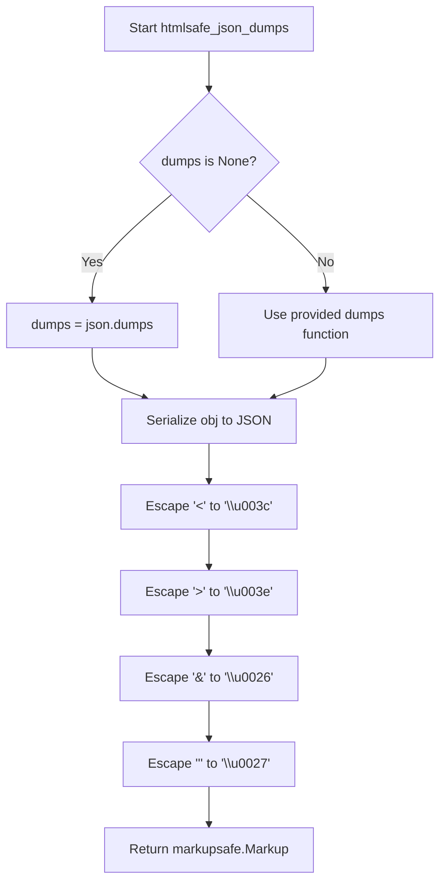

## Examples:
```python
# Basic usage
data = {"name": "John", "age": 30}
json_str = htmlsafe_json_dumps(data)
# Returns: markupsafe.Markup('{"name": "John", "age": 30}')

# With HTML characters in data
data = {"message": "<script>alert('xss')</script>"}
json_str = htmlsafe_json_dumps(data)
# Returns: markupsafe.Markup('{\\"message\\": \\"\\\\u003cscript\\\\u003ealert(\\\\u0027xss\\\\u0027)\\\\u003c/script\\\\u003e\\"}')
```

## `src.jinja2.utils.Cycler` · *class*

## Summary:
A cyclic iterator that cycles through a sequence of items, providing access to the current item and advancement to the next item in the sequence.

## Description:
The Cycler class is designed to maintain a sequence of items and cycle through them in a round-robin fashion. It's commonly used in templating contexts where repeated patterns or sequences need to be rotated through. The class provides methods to access the current item, advance to the next item, and reset the cycling position.

This abstraction encapsulates the logic for maintaining a circular sequence and provides a clean interface for iterating through items repeatedly without manual index management.

## State:
- items: tuple of t.Any, containing the sequence of items to cycle through
- pos: int, representing the current position in the items sequence (0-based index)
- Invariant: pos is always within the range [0, len(items)), maintained by modulo arithmetic in next()

## Lifecycle:
- Creation: Instantiate with one or more items using Cycler(*items)
- Usage: Call next() or __next__() to advance through items, access current property to get current item, call reset() to restart from beginning
- Destruction: No special cleanup required; standard Python garbage collection handles destruction

## Method Map:
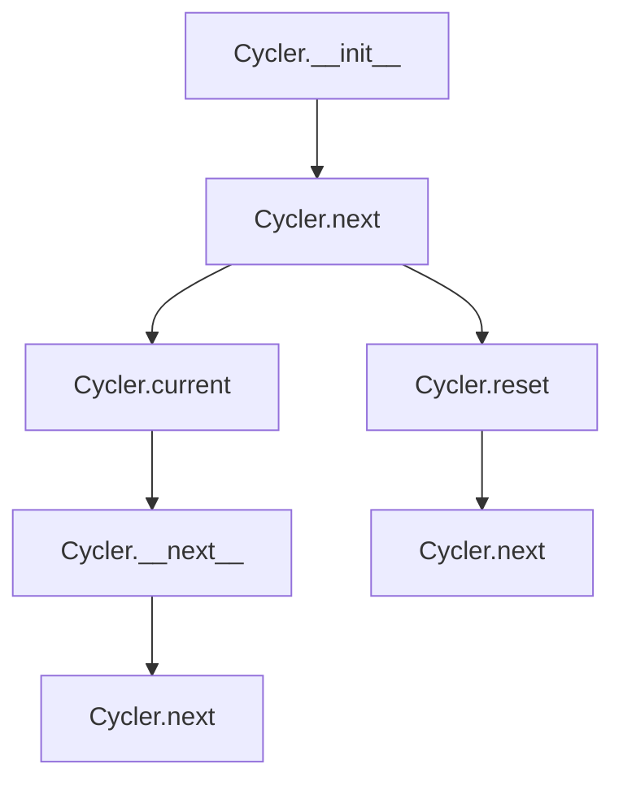

## Raises:
- RuntimeError: Raised during initialization when no items are provided to the constructor

## Example:
```python
# Create a cycler with color names
colors = Cycler('red', 'green', 'blue')
print(colors.current)  # 'red'
print(colors.next())   # 'red'
print(colors.next())   # 'green'
print(colors.next())   # 'blue'
print(colors.next())   # 'red' (cycles back)

# Reset to beginning
colors.reset()
print(colors.current)  # 'red'

# Using as iterator
for i, color in enumerate(colors):
    if i >= 5: break
    print(color)
```

### `src.jinja2.utils.Cycler.__init__` · *method*

## Summary:
Initializes a cyclic iterator with the provided sequence of items, setting the initial position to the first item.

## Description:
Constructs a Cycler instance that maintains a sequence of items and allows cycling through them in a round-robin fashion. This method validates that at least one item is provided and initializes the internal state for tracking the current position in the sequence.

## Args:
    *items (t.Any): Variable-length argument list of items to cycle through. Must contain at least one item.

## Returns:
    None: This method initializes the object's state and does not return a value.

## Raises:
    RuntimeError: Raised when no items are provided to the constructor, as a Cycler requires at least one item to function.

## State Changes:
    Attributes READ: None
    Attributes WRITTEN: 
    - self.items: Set to the tuple of provided items
    - self.pos: Set to 0, initializing the position to the first item in the sequence

## Constraints:
    Preconditions:
    - At least one item must be provided as a positional argument
    - Items can be of any type (t.Any)
    
    Postconditions:
    - self.items contains the provided items as a tuple
    - self.pos is initialized to 0
    - The Cycler is ready for iteration starting from the first item

## Side Effects:
    None: This method performs no I/O operations or external service calls. It only initializes internal object state.

### `src.jinja2.utils.Cycler.reset` · *method*

## Summary:
Resets the cycler's position counter back to the beginning of the item sequence.

## Description:
This method resets the internal position counter of the Cycler instance to 0, effectively restarting the sequence from the first item. This is useful when you want to begin iterating through the cycler's items from the start again, rather than continuing from the current position.

## Args:
    None

## Returns:
    None

## Raises:
    None

## State Changes:
    Attributes READ: None
    Attributes WRITTEN: self.pos

## Constraints:
    Preconditions: The Cycler instance must be properly initialized with items
    Postconditions: The self.pos attribute will be set to 0

## Side Effects:
    None

### `src.jinja2.utils.Cycler.current` · *method*

## Summary:
Returns the current item in the circular iterator without advancing the position.

## Description:
Provides access to the item at the current position in the Cycler's circular sequence. This property allows clients to inspect the current element without modifying the iterator's state.

## Args:
    None

## Returns:
    t.Any: The item at the current position in the circular sequence.

## Raises:
    IndexError: When the Cycler has no items (though this would be prevented by construction).

## State Changes:
    Attributes READ: self.items, self.pos
    Attributes WRITTEN: None

## Constraints:
    Preconditions: The Cycler instance must have been initialized with at least one item.
    Postconditions: The Cycler's position remains unchanged after calling this property.

## Side Effects:
    None

### `src.jinja2.utils.Cycler.next` · *method*

## Summary:
Returns the current item in the cycle and advances the internal position to the next item.

## Description:
This method implements a cyclic iterator pattern. It returns the item currently pointed to by the internal position counter, then advances the position to the next item in the sequence using modular arithmetic to wrap around when reaching the end of the collection.

## Args:
    None

## Returns:
    Any: The item at the current position before the position is advanced.

## Raises:
    None explicitly raised

## State Changes:
    Attributes READ: self.current, self.pos, self.items
    Attributes WRITTEN: self.pos

## Constraints:
    Preconditions: 
    - self.items must be a collection with at least one item (to avoid division by zero)
    - self.pos must be a valid index for self.items
    
    Postconditions:
    - self.pos is updated to (current_pos + 1) % len(self.items)
    - The returned value is the item that was at the previous position

## Side Effects:
    None

## `src.jinja2.utils.Joiner` · *class*

## Summary:
A callable class that generates join separators, returning an empty string on first use and the configured separator on subsequent uses.

## Description:
The Joiner class provides a mechanism for generating join separators that behave differently on first and subsequent invocations. This is particularly useful when building lists or sequences where a leading separator would be undesirable. The class maintains internal state to track whether it has been used, allowing it to return different values based on usage history.

This class is typically instantiated by Jinja2 internals or other templating utilities that need to construct comma-separated or similarly formatted lists without leading separators.

## State:
- sep: str - The separator string to return on subsequent calls. Defaults to ", "
- used: bool - Boolean flag tracking whether the joiner has been invoked. Initially False, becomes True after first call.

## Lifecycle:
- Creation: Instantiate with optional separator string (defaults to ", ")
- Usage: Call the instance repeatedly to get appropriate separator strings
- Destruction: No special cleanup required; standard Python object lifecycle applies

## Method Map:
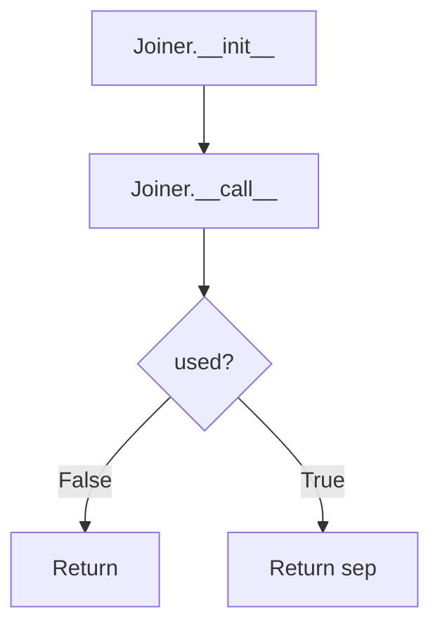

## Raises:
None explicitly raised by __init__ or __call__ methods

## Example:
```python
# Create a joiner with default separator
joiner = Joiner()
result1 = joiner()  # Returns ""
result2 = joiner()  # Returns ", "

# Create a joiner with custom separator
custom_joiner = Joiner(" | ")
result1 = custom_joiner()  # Returns ""
result2 = custom_joiner()  # Returns " | "
```

### `src.jinja2.utils.Joiner.__init__` · *method*

## Summary:
Initializes a Joiner instance with a configurable separator and resets its usage state.

## Description:
Configures the Joiner instance with a separator string and initializes its internal usage tracking. This method sets up the object's state so that subsequent calls to the instance will return an empty string on the first invocation and the configured separator on all following invocations.

## Args:
    sep (str): Separator string to use for subsequent joins. Defaults to ", ".

## Returns:
    None: This method does not return a value.

## Raises:
    None: This method does not raise any exceptions.

## State Changes:
    Attributes READ: None
    Attributes WRITTEN: 
    - self.sep: Set to the provided separator string
    - self.used: Set to False to indicate the joiner has not yet been invoked

## Constraints:
    Preconditions: None
    Postconditions: 
    - self.sep contains the provided separator string
    - self.used is initialized to False

## Side Effects:
    None: This method performs no I/O operations or external service calls.

### `src.jinja2.utils.Joiner.__call__` · *method*

## Summary:
Returns a separator string that acts as a prefix for joined elements, returning an empty string on first invocation and the configured separator on subsequent invocations.

## Description:
This method implements the callable interface of the Joiner class. It is designed to generate separators for joining sequences of elements, ensuring that no leading separator is added to the joined result. The first call returns an empty string, while all subsequent calls return the configured separator.

## Args:
    None

## Returns:
    str: An empty string on the first call, or the configured separator string on subsequent calls.

## Raises:
    None

## State Changes:
    Attributes READ: self.sep, self.used
    Attributes WRITTEN: self.used

## Constraints:
    Preconditions: The Joiner instance must be properly initialized with a sep string and used flag set to False initially.
    Postconditions: After the first call, self.used is set to True. The method will always return either an empty string or the separator string.

## Side Effects:
    None

## `src.jinja2.utils.Namespace` · *class*

## Summary:
A namespace container that allows both attribute-style and dictionary-style access to stored key-value pairs.

## Description:
The Namespace class provides a flexible container for storing key-value pairs that can be accessed using either dot notation (e.g., `obj.key`) or bracket notation (e.g., `obj['key']`). This dual-access pattern is commonly used in templating systems to provide intuitive access to context variables. The class is designed to be lightweight and efficient for storing configuration data, template context, or other key-value mappings.

## State:
- `__attrs`: dict - stores all key-value pairs internally. This is the primary data storage mechanism.
  - Type: dict
  - Valid range/values: Any key-value pairs that can be stored in a Python dict
  - Invariant: Always contains the current set of key-value pairs managed by this namespace instance

## Lifecycle:
- Creation: Instantiate with `Namespace(**kwargs)` or `Namespace(dict_like)` to initialize with data
- Usage: Access values via `namespace.key` or `namespace['key']` syntax; modify via `namespace['key'] = value` or `namespace.key = value`
- Destruction: No special cleanup required; standard Python garbage collection handles destruction

## Method Map:
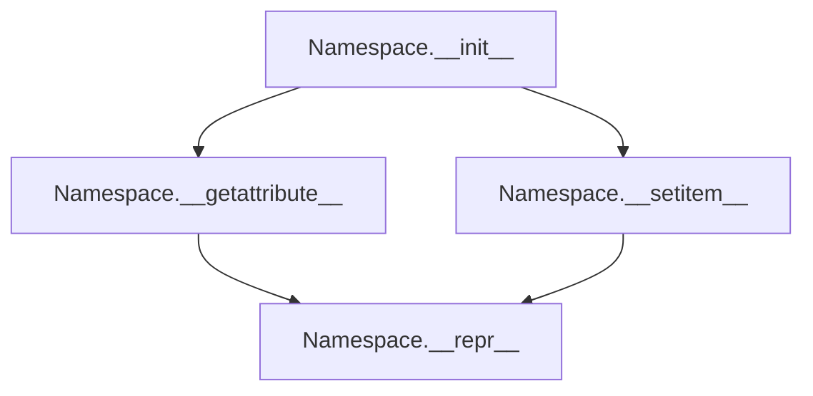

## Raises:
- AttributeError: Raised when accessing a non-existent attribute via dot notation (e.g., `namespace.nonexistent`)

## Example:
```python
# Create namespace with initial data
ns = Namespace(name="test", value=42)

# Access via attribute notation
print(ns.name)  # Output: "test"

# Access via dictionary notation  
print(ns['value'])  # Output: 42

# Modify values
ns['new_key'] = 'new_value'
ns.other = 'another_value'

# View representation
print(repr(ns))  # Output: <Namespace {'name': 'test', 'value': 42, 'new_key': 'new_value', 'other': 'another_value'}>
```

### `src.jinja2.utils.Namespace.__init__` · *method*

## Summary:
Initializes a namespace instance with key-value pairs from arguments, storing them in an internal dictionary for dual-access capability.

## Description:
The `__init__` method sets up the internal `__attrs` dictionary that enables the Namespace class to provide both attribute-style (`obj.key`) and dictionary-style (`obj['key']`) access to stored key-value pairs. This method is called during object instantiation and accepts either keyword arguments or a single dictionary-like object to populate the namespace's internal storage.

## Args:
    *args (t.Any): Variable positional arguments that can be a single dictionary-like object or multiple key-value pairs
    **kwargs (t.Any): Variable keyword arguments representing key-value pairs to store in the namespace

## Returns:
    None: This method initializes the object's internal state and does not return a value

## Raises:
    None: This method does not explicitly raise exceptions

## State Changes:
    Attributes READ: None
    Attributes WRITTEN: self.__attrs - Populated with key-value pairs from args and kwargs

## Constraints:
    Preconditions: 
        - The Namespace instance must be properly allocated before calling this method
        - Arguments must be compatible with the `dict()` constructor (either a single dictionary-like object or key-value pairs)
    Postconditions:
        - The `self.__attrs` dictionary is initialized with all provided key-value pairs
        - The namespace is ready for attribute and dictionary-style access operations

## Side Effects:
    None: This method performs no I/O operations or external service calls. It only initializes internal state.

### `src.jinja2.utils.Namespace.__getattribute__` · *method*

## Summary:
Retrieves attribute values from the namespace's internal dictionary storage, providing attribute-style access to dictionary keys.

## Description:
This method overrides Python's default attribute access mechanism to enable dictionary-like key access using dot notation. When accessing attributes on a Namespace instance, this method intercepts the access and looks up the attribute name in the internal `__attrs` dictionary. Special handling is provided for internal attributes like `__class__` and `__attrs` to ensure proper object introspection.

## Args:
    name (str): The name of the attribute to retrieve from the namespace's internal dictionary.

## Returns:
    Any: The value associated with the given attribute name in the internal dictionary.

## Raises:
    AttributeError: When the specified attribute name is not found in the internal dictionary.

## State Changes:
    Attributes READ: self.__attrs
    Attributes WRITTEN: None

## Constraints:
    Preconditions: The Namespace instance must be properly initialized with an internal `__attrs` dictionary.
    Postconditions: If the attribute exists, it returns the associated value; if not found, raises AttributeError.

## Side Effects:
    None: This method performs no I/O operations or external service calls. It only accesses internal state.

### `src.jinja2.utils.Namespace.__setitem__` · *method*

## Summary:
Sets an attribute value in the namespace's internal dictionary storage using dictionary-style assignment.

## Description:
This method implements the `__setitem__` protocol, enabling dictionary-style assignment syntax for Namespace instances. When called as `namespace[key] = value`, this method stores the value under the specified key in the internal `__attrs` dictionary. This allows Namespace objects to behave like dictionaries while maintaining compatibility with attribute-style access through the `__getattribute__` method.

## Args:
    name (str): The key name to set in the internal attributes dictionary.
    value (Any): The value to associate with the given key name.

## Returns:
    None: This method does not return any value.

## Raises:
    None: This method does not explicitly raise any exceptions.

## State Changes:
    Attributes READ: None
    Attributes WRITTEN: self.__attrs

## Constraints:
    Preconditions: 
        - The Namespace instance must be properly initialized with an internal `__attrs` dictionary.
        - The `name` parameter must be a string.
    Postconditions: 
        - The specified key-value pair is stored in `self.__attrs`
        - The operation does not affect any other attributes of the instance

## Side Effects:
    None: This method performs no I/O operations or external service calls. It only modifies the internal `__attrs` dictionary.

### `src.jinja2.utils.Namespace.__repr__` · *method*

## Summary:
Returns a string representation of the Namespace object showing its internal attributes dictionary.

## Description:
This method provides a human-readable string representation of a Namespace instance, displaying the class name and the internal attributes dictionary stored in `__attrs`. The method is automatically invoked when the built-in `repr()` function is called on a Namespace instance or when the object is displayed in interactive environments.

## Args:
    None

## Returns:
    str: A formatted string in the pattern "<Namespace {self.__attrs!r}>" where __attrs is the internal dictionary of attributes.

## Raises:
    None

## State Changes:
    Attributes READ: self.__attrs
    Attributes WRITTEN: None

## Constraints:
    Preconditions: The object must be an instance of Namespace class with a valid `__attrs` attribute that is a dictionary.
    Postconditions: The returned string will always follow the format "<Namespace {dictionary_repr}>"

## Side Effects:
    None

