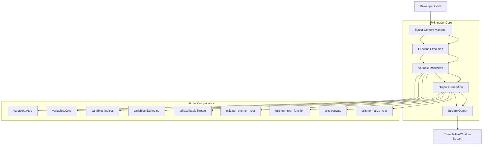

## PySnooper Repository Documentation

### Tree Structure
```
PySnooper/
├── misc/          # Miscellaneous files including examples, tests, and documentation
├── pysnooper/     # Core module containing tracing and debugging functionality
│   ├── pycompat.py     # Cross-Python version compatibility utilities
│   ├── tracer.py       # Main tracing implementation with Tracer class
│   ├── utils.py        # Utility functions for representations and streams
│   └── variables.py    # Variable inspection classes for different data types
└── setup.py       # Package installation and metadata configuration
```

### Purpose
PySnooper is a Python library designed to provide comprehensive code tracing and debugging capabilities. It solves the problem of understanding program execution flow and variable states without modifying source code or adding temporary print statements.

**Target Users:**
- Python developers debugging complex applications
- Software engineers working with legacy codebases
- Testing teams requiring detailed execution insights
- Developers building debugging tools or profilers

**Scenarios of Use:**
- Debugging production issues where source modification isn't feasible
- Understanding how complex functions behave with various inputs
- Profiling code execution to identify performance bottlenecks
- Creating detailed logs of program execution for analysis

### Architecture


**Key Abstractions:**
- **Tracer Class**: Central component that manages tracing context and execution flow
- **Variable Inspectors**: Specialized handlers for different types of variables (attributes, keys, indices)
- **Stream Interface**: Abstract base class for output destination handling
- **Representation Utilities**: Functions for formatting and normalizing object representations

### Entry Points
1. **CLI Interface**: Command-line tool for tracing scripts (via `pysnooper` command)
2. **Decorator Usage**: `@pysnooper.snoop()` decorator for tracing function calls
3. **Context Manager**: `with pysnooper.tracer():` for tracing code blocks
4. **Importable API**: Direct import of `pysnooper` module for programmatic tracing

### Core Features
1. **Function Tracing**: Monitors function entry, exit, and execution steps
2. **Variable Monitoring**: Tracks changes to local variables throughout execution
3. **Customizable Output**: Supports console, file, or custom stream destinations
4. **Cross-Version Compatibility**: Works across Python 2.7+ and 3.x versions
5. **Thread Safety**: Maintains separate tracing contexts per thread
6. **Flexible Formatting**: Customizable representation and truncation options

### Dependencies
- **Standard Library**: `abc`, `collections`, `datetime`, `inspect`, `os`, `sys`, `types`
- **Internal Modules**: 
  - `pysnooper.pycompat`: Cross-version compatibility utilities
  - `pysnooper.utils`: Representation and stream handling utilities  
  - `pysnooper.variables`: Variable inspection classes

### Configuration
PySnooper can be configured through:
- Output destination (console, file path, or custom stream)
- Depth control for nested function tracing
- Variable filtering options
- Custom representation functions
- Overwrite vs append behavior for file output

### Extension Points
1. **Custom Output Streams**: Implement `WritableStream` interface for custom destinations
2. **Variable Types**: Extend `variables` module with new inspection classes
3. **Representation Functions**: Customize `get_repr_function` for special object types
4. **Tracing Hooks**: Subclass `Tracer` to add custom behavior during tracing

---

## Modules

- [`pysnooper`](pysnooper.md)
