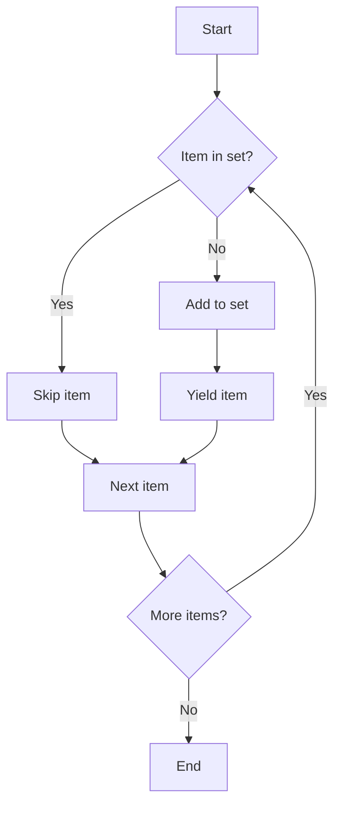

# `generate_authors.py`

## `misc.generate_authors.drop_recurrences` · *function*

## Summary:
Removes duplicate elements from an iterable while preserving their original order.

## Description:
This generator function iterates through an input iterable and yields only the first occurrence of each element, effectively removing duplicates. It maintains the order of elements as they appear in the original iterable.

## Args:
    iterable: An iterable object containing hashable elements (e.g., strings, numbers, tuples).

## Returns:
    A generator that yields unique elements in the same order as they first appear in the input iterable.

## Raises:
    TypeError: If any element in the iterable is not hashable (cannot be added to a set).

## Constraints:
    Preconditions:
    - The input iterable must be iterable
    - All elements in the iterable must be hashable (since they are added to a set)
    
    Postconditions:
    - Each element in the returned sequence appears exactly once
    - The relative order of elements is preserved from the input

## Side Effects:
    None

## Control Flow:


## Examples:
```python
# Remove duplicates from a list
result = list(drop_recurrences([1, 2, 2, 3, 1, 4]))
# Returns: [1, 2, 3, 4]

# Works with strings
result = list(drop_recurrences("abracadabra"))
# Returns: ['a', 'b', 'r', 'c', 'd']

# Will raise TypeError for unhashable types
# drop_recurrences([[1, 2], [1, 2], [3, 4]])  # TypeError: unhashable type: 'list'
```

## `misc.generate_authors.iterate_authors_by_chronological_order` · *function*

## Summary:
Returns a sequence of unique author names from a Git repository's commit history in chronological order.

## Description:
Processes Git commit history for a specified branch to extract author names in chronological order, removing duplicate entries. This function executes a Git command to retrieve commit logs with timestamp, author name, and author email information, then parses and deduplicates the author names.

## Args:
    branch (str): The Git branch name to process. This specifies which branch's commit history to analyze.

## Returns:
    generator: A generator yielding unique author names in chronological order. Each author name appears only once, even if they made multiple commits.

## Raises:
    subprocess.CalledProcessError: When the Git command fails to execute properly (e.g., invalid branch name).

## Constraints:
    Preconditions:
    - The branch parameter must refer to a valid Git branch in the repository
    - The Git repository must be accessible from the execution environment
    - The Git executable must be available in the system PATH
    
    Postconditions:
    - The returned generator will yield author names in chronological order (oldest to newest commits)
    - Each author name appears exactly once in the output sequence
    - The function preserves the original order of first appearance of each author

## Side Effects:
    - Executes a subprocess command (git log)
    - May cause I/O operations when accessing the Git repository
    - No modifications to external state beyond the subprocess execution

## Control Flow:
```mermaid
flowchart TD
    A[Start] --> B[Execute git log command]
    B --> C{Git command successful?}
    C -- No --> D[Raise CalledProcessError]
    C -- Yes --> E[Decode stdout to UTF-8]
    E --> F[Split output into lines]
    F --> G[Process each line]
    G --> H{Line contains data?}
    H -- No --> I[Skip empty line]
    H -- Yes --> J[Split line by semicolon]
    J --> K[Extract author name (index 1)]
    K --> L[Yield author name]
    I --> M[Continue to next line]
    L --> N{More lines?}
    N -- Yes --> G
    N -- No --> O[End]
```

## Examples:
```python
# Get authors from master branch
authors = iterate_authors_by_chronological_order("master")
for author in authors:
    print(author)

# Get authors from a specific feature branch
feature_authors = iterate_authors_by_chronological_order("feature/new-feature")
unique_authors = list(feature_authors)  # Convert to list to see all authors
```

## `misc.generate_authors.print_authors` · *function*

## Summary:
Prints unique author names from a Git repository's commit history in chronological order to standard output.

## Description:
This function retrieves author names from Git commit history for a specified branch and outputs them sequentially to standard output. It leverages the `iterate_authors_by_chronological_order` function to obtain the author data and formats each author with a trailing newline before writing to stdout.

## Args:
    branch (str): The Git branch name to process. This specifies which branch's commit history to analyze for author information.

## Returns:
    None: This function does not return any value. It produces output via stdout.

## Raises:
    subprocess.CalledProcessError: When the underlying `iterate_authors_by_chronological_order` function encounters issues executing Git commands (e.g., invalid branch name).

## Constraints:
    Preconditions:
    - The branch parameter must refer to a valid Git branch in the repository
    - The Git repository must be accessible from the execution environment
    - The Git executable must be available in the system PATH
    
    Postconditions:
    - Author names are printed to stdout in chronological order (oldest to newest commits)
    - Each author name appears exactly once in the output sequence
    - Output is formatted with a trailing newline after each author

## Side Effects:
    - Writes to standard output (stdout) using binary buffer
    - Executes a subprocess command (git log) through the dependency function
    - May cause I/O operations when accessing the Git repository

## Control Flow:
```mermaid
flowchart TD
    A[Start print_authors] --> B[Call iterate_authors_by_chronological_order(branch)]
    B --> C{Authors available?}
    C -- No --> D[End]
    C -- Yes --> E[For each author in result]
    E --> F[Encode author string to bytes]
    F --> G[Write author bytes to stdout.buffer]
    G --> H[Write newline bytes to stdout.buffer]
    H --> I[Next author?]
    I -- Yes --> E
    I -- No --> J[End]
```

## Examples:
```python
# Print authors from master branch
print_authors("master")

# Print authors from a specific feature branch
print_authors("feature/new-feature")
```

