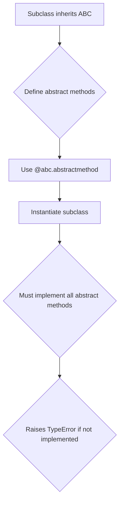
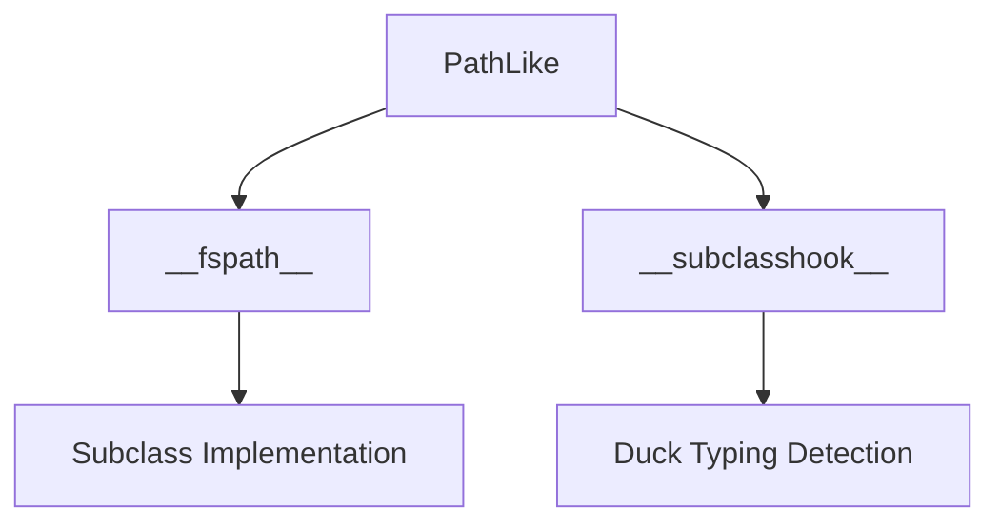
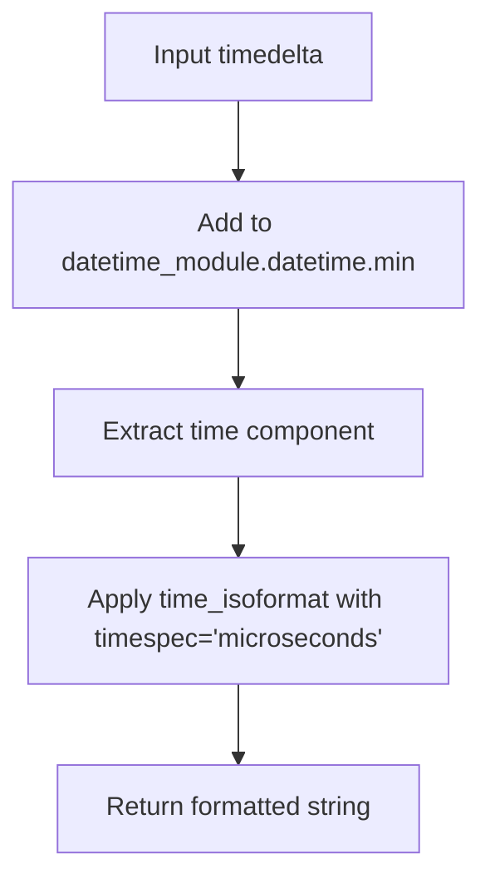
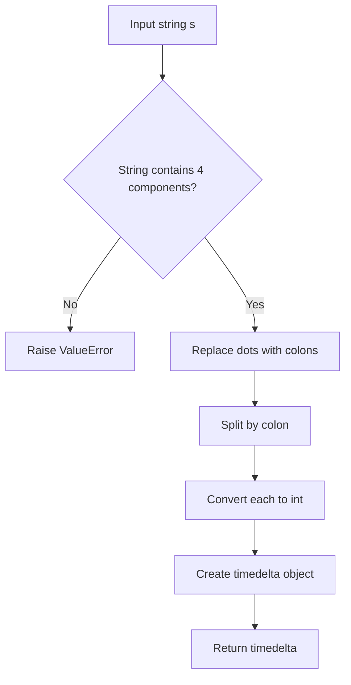

# `pycompat.py`

## `pysnooper.pycompat.ABC` · *class*

## Summary:
Abstract base class compatibility wrapper for cross-Python-version support.

## Description:
A compatibility class that provides abstract base class functionality across Python 2 and Python 3. This class serves as a bridge to ensure consistent abstract base class behavior regardless of the Python version being used. It is intended to be inherited by other classes that need to define abstract methods or enforce interface contracts.

## State:
- No instance attributes: This class defines no instance variables due to `__slots__ = ()`
- Metaclass: `abc.ABCMeta` - enables abstract method functionality
- Inheritance: Inherits from `object` to ensure new-style class behavior

## Lifecycle:
- Creation: Instantiate by inheriting from this class in a subclass
- Usage: Define abstract methods using `@abc.abstractmethod` decorator in subclasses
- Destruction: No special cleanup required; follows normal Python object lifecycle

## Method Map:


## Raises:
- TypeError: When attempting to instantiate a subclass that doesn't implement all abstract methods

## Example:
```python
# Define an abstract base class
class MyInterface(pysnooper.pycompat.ABC):
    @abc.abstractmethod
    def process(self, data):
        pass

# Implement the interface
class ConcreteImplementation(MyInterface):
    def process(self, data):
        return f"Processing {data}"

# Usage
obj = ConcreteImplementation()  # Works fine
# obj2 = MyInterface()  # Raises TypeError
```

## `pysnooper.pycompat.PathLike` · *class*

## Summary:
Abstract base class defining the protocol for path-like objects that support the `__fspath__` interface.

## Description:
The PathLike class serves as an abstract base class that defines the interface for objects that can be converted to filesystem paths. It implements the `__fspath__` protocol introduced in Python 3.6, allowing objects to be used wherever filesystem paths are expected. The class also provides a `__subclasshook__` mechanism that enables duck-typing detection, making any class implementing `__fspath__` or having 'path' in its name with an 'open' method automatically compatible with this interface.

This abstraction is useful for creating flexible APIs that accept various path-like objects without requiring explicit inheritance, enabling compatibility with pathlib.Path, str, bytes, and custom path-like implementations.

## State:
- No instance attributes are defined in this class
- The class itself is an abstract base class with no mutable state
- The `__fspath__` method is an abstract method that must be implemented by subclasses
- The `__subclasshook__` classmethod is part of the ABC protocol and doesn't store state

## Lifecycle:
- Creation: Instances cannot be created directly due to the abstract nature of the class
- Usage: Subclasses must implement the `__fspath__` method to provide path conversion functionality
- Destruction: No special cleanup required as this is an abstract base class

## Method Map:


## Raises:
- TypeError: When attempting to instantiate the abstract base class directly
- NotImplementedError: When the abstract `__fspath__` method is not overridden in a subclass

## Example:
```python
from pysnooper.pycompat import PathLike
import os

# Creating a custom path-like object
class MyPath(PathLike):
    def __init__(self, path):
        self.path = path
    
    def __fspath__(self):
        return self.path

# Using the path-like object
mypath = MyPath("/tmp/example.txt")
print(os.fspath(mypath))  # Works because MyPath implements __fspath__
```

### `pysnooper.pycompat.PathLike.__fspath__` · *method*

## Summary:
Returns a string representation of the path-like object, implementing the os.PathLike protocol.

## Description:
This method is part of the os.PathLike protocol introduced in Python 3.6. It serves as the canonical way to convert a path-like object to its string representation. The method is declared as abstract in the PathLike base class and must be implemented by all subclasses to provide the actual path string.

## Args:
    self: The PathLike instance

## Returns:
    str: A string representation of the path

## Raises:
    NotImplementedError: Always raised in the base PathLike class, indicating that subclasses must implement this method

## State Changes:
    Attributes READ: None
    Attributes WRITTEN: None

## Constraints:
    Preconditions: The method must be overridden by subclasses
    Postconditions: When implemented, returns a string representing the path

## Side Effects:
    None

### `pysnooper.pycompat.PathLike.__subclasshook__` · *method*

## Summary:
Determines if a class qualifies as a path-like object based on duck-typing criteria.

## Description:
This method implements Python's abstract base class protocol for subclass checking. It defines the conditions under which a class is considered a subclass of PathLike without requiring explicit inheritance. This enables duck-typing support for path-like objects in the pysnooper library.

## Args:
    cls (type): The PathLike class itself (passed automatically by Python's ABC mechanism)
    subclass (type): The class being tested for compatibility with PathLike

## Returns:
    bool: True if subclass qualifies as a path-like object according to duck-typing rules, False otherwise

## Raises:
    None: This method does not raise exceptions

## State Changes:
    Attributes READ: None - this method only uses parameters and built-in functions
    Attributes WRITTEN: None - this method is read-only

## Constraints:
    Preconditions: 
    - cls must be the PathLike class (or its subclass)
    - subclass must be a class object being tested
    - Both parameters must be valid Python types
    
    Postconditions:
    - Returns a boolean value indicating subclass compatibility
    - The returned value follows Python's ABC subclass checking semantics

## Side Effects:
    None: This method performs only attribute checks and string operations with no I/O or external service calls

## `pysnooper.pycompat.timedelta_format` · *function*

## Summary:
Formats a timedelta object by performing time extraction and formatting operations.

## Description:
This function processes a timedelta object by adding it to a reference datetime value and extracting a time component, then applying time formatting. It serves as a utility for converting timedelta objects into formatted time representations. The function relies on external dependencies: `datetime_module` (expected to be the datetime module) and `time_isoformat` (expected to be a time formatting function).

## Args:
    timedelta (datetime.timedelta): A timedelta object to be processed and formatted.

## Returns:
    str: The result of formatting a time component derived from the input timedelta.

## Raises:
    TypeError: If timedelta is not a datetime.timedelta object or if operations with datetime_module fail.
    ValueError: If arithmetic operations with datetime.min or time formatting operations fail.

## Constraints:
    Preconditions:
        - Input must be a valid datetime.timedelta object
        - External dependency `datetime_module` must be available and properly configured
        - External dependency `time_isoformat` must be available and properly configured
    
    Postconditions:
        - Returns a string representation of a time value
        - The returned string follows ISO time formatting conventions

## Side Effects:
    None

## Control Flow:


## Examples:
    >>> timedelta_format(datetime.timedelta(hours=1, minutes=30, seconds=45))
    '01:30:45'
    
    >>> timedelta_format(datetime.timedelta(microseconds=123456))
    '00:00:00.123456'

## `pysnooper.pycompat.timedelta_parse` · *function*

## Summary:
Parses a time duration string into a datetime.timedelta object.

## Description:
Converts a string representation of time duration into a datetime.timedelta object. The input string is expected to be in HH:MM:SS.microseconds format, where dots are converted to colons for splitting. This function extracts hours, minutes, seconds, and microseconds from the string and attempts to construct a timedelta object with these values.

Note: The implementation contains a bug where `datetime_module` is referenced instead of `datetime`. This function is intended to work with time duration strings in the format "HH:MM:SS.microseconds".

## Args:
    s (str): Time duration string in HH:MM:SS.microseconds format. The string should contain colon-separated values for hours, minutes, seconds, and microseconds.

## Returns:
    datetime.timedelta: A timedelta object representing the parsed time duration with hours, minutes, seconds, and microseconds components.

## Raises:
    ValueError: When the input string cannot be properly parsed into four numeric components, when the components cannot be converted to integers, or when the string format doesn't match the expected pattern.

## Constraints:
    Precondition: The input string must contain exactly four colon-separated numeric components (hours, minutes, seconds, microseconds).
    Postcondition: Returns a valid datetime.timedelta object with the specified time components.

## Side Effects:
    None

## Control Flow:


## Examples:
    >>> timedelta_parse("01:30:45.123456")
    datetime.timedelta(hours=1, minutes=30, seconds=45, microseconds=123456)
    
    >>> timedelta_parse("00:00:00.000001")
    datetime.timedelta(hours=0, minutes=0, seconds=0, microseconds=1)

