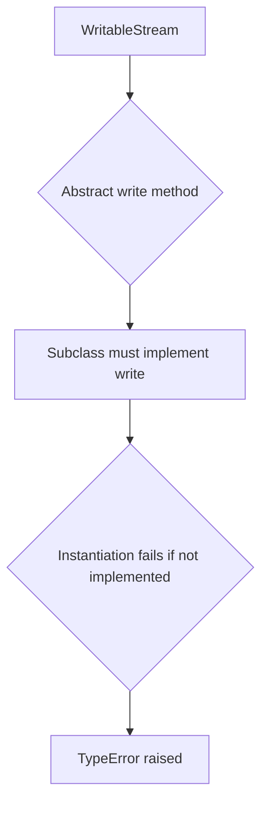

# `utils.py`

## `pysnooper.utils._check_methods` · *function*

## Summary:
Checks if a class implements all specified methods, returning True if all methods are implemented, NotImplemented if any method is missing or explicitly set to None.

## Description:
This utility function verifies that a given class implements all required methods by traversing its Method Resolution Order (MRO) to check for method existence. It's commonly used in abstract base class implementations or interface compliance checking to validate that subclasses properly implement required functionality.

The function is typically called during class definition or registration phases to ensure proper interface implementation before runtime execution.

## Args:
    C (type): The class to check for method implementations
    *methods (str): Variable-length argument list of method names to verify exist in the class hierarchy

## Returns:
    bool or NotImplemented: Returns True if all methods are implemented, NotImplemented if any method is missing or explicitly set to None

## Raises:
    None explicitly raised

## Constraints:
    Preconditions:
    - C must be a valid class/type object
    - All method names in *methods must be strings
    
    Postconditions:
    - Function returns either True or NotImplemented (never raises exceptions)
    - The check is performed against the entire inheritance hierarchy via MRO traversal

## Side Effects:
    None

## Control Flow:
```mermaid
flowchart TD
    A[Start _check_methods] --> B{Get MRO of C}
    B --> C[For each method in methods]
    C --> D{Method in B.__dict__?}
    D -->|Yes| E{B.__dict__[method] is None?}
    E -->|Yes| F[Return NotImplemented]
    E -->|No| G[Break inner loop]
    D -->|No| H[Return NotImplemented]
    G --> I{End of MRO?}
    I -->|Yes| J[Continue to next method]
    I -->|No| D
    J --> K{All methods processed?}
    K -->|Yes| L[Return True]
    K -->|No| C
```

## Examples:
```python
# Basic usage to check if a class implements required methods
class MyInterface:
    def required_method(self): pass

class Implementation(MyInterface):
    def required_method(self): return "implemented"

# Check if Implementation has required_method
result = _check_methods(Implementation, 'required_method')
# Returns True

# Check with a class that doesn't implement the method
class Incomplete:
    pass

result = _check_methods(Incomplete, 'required_method')
# Returns NotImplemented
```

## `pysnooper.utils.WritableStream` · *class*

## Summary:
An abstract base class defining the interface for writable streams that must implement a write method.

## Description:
WritableStream serves as an abstract base class that establishes a contract for writable stream objects. It defines the minimal interface required for writing data to a stream, specifically requiring the implementation of a write method. This class leverages Python's Abstract Base Class (ABC) functionality to enforce interface compliance and prevent instantiation of incomplete implementations.

The class uses a custom `__subclasshook__` method to enable duck typing - any class that implements a `write` method will be considered a subclass of WritableStream, even without explicit inheritance. This allows for flexible integration with various stream-like objects that may not inherit from this base class but still provide the required write functionality.

## State:
- No instance attributes: This is an abstract base class with no instance variables
- Class attributes: Inherits from ABC metaclass, enabling abstract method enforcement
- Invariants: None applicable as this is purely an interface definition

## Lifecycle:
- Creation: Cannot be instantiated directly due to abstract method requirement
- Usage: Subclasses must implement the `write` method to be valid
- Destruction: No special cleanup required; follows normal Python object lifecycle

## Method Map:


## Raises:
- TypeError: When attempting to instantiate a subclass that doesn't implement the abstract write method
- NotImplementedError: When the abstract write method is called on the base class itself

## Example:
```python
# Define a concrete implementation
class FileStream(WritableStream):
    def __init__(self, filename):
        self.file = open(filename, 'w')
    
    def write(self, s):
        self.file.write(s)
    
    def __del__(self):
        if hasattr(self, 'file'):
            self.file.close()

# Usage
stream = FileStream('output.txt')  # Valid implementation
stream.write("Hello, world!")      # Works correctly

# This would raise TypeError:
# class IncompleteStream(WritableStream):
#     pass
# 
# incomplete = IncompleteStream()  # TypeError: Can't instantiate abstract class
```

### `pysnooper.utils.WritableStream.write` · *method*

## Summary:
Writes string data to the underlying stream resource.

## Description:
This abstract method defines the interface for writing string data to a stream. Concrete implementations must provide the actual logic for handling the written data, such as writing to stdout, a file, or another output destination. This method is part of the WritableStream abstract base class that establishes a contract for stream-like objects capable of receiving written data.

## Args:
    s (str): The string data to be written to the stream. Must be a valid string object.

## Returns:
    None: This method does not return any value.

## Raises:
    NotImplementedError: This is an abstract method that must be implemented by subclasses.

## State Changes:
    Attributes READ: None - This method does not read any instance attributes.
    Attributes WRITTEN: None - This method does not modify any instance attributes.

## Constraints:
    Preconditions:
    - The argument `s` must be a string type
    - This method must be overridden by concrete subclasses
    - The underlying stream resource must be available for writing
    
    Postconditions:
    - The string data is written to the appropriate output destination
    - No return value is produced

## Side Effects:
    I/O operations: Writes data to an underlying stream resource (file, stdout, etc.)
    May cause external side effects depending on the concrete implementation (e.g., file system writes, console output)

### `pysnooper.utils.WritableStream.__subclasshook__` · *method*

## Summary:
Determines subclass compatibility for classes implementing the write method, enabling duck-typing support for the WritableStream interface.

## Description:
This special method is invoked during subclass checks (via `issubclass()`) to determine if a class implements the required interface for `WritableStream`. When Python evaluates `issubclass(C, WritableStream)`, this method intercepts the check and validates that class `C` provides a `write` method. It leverages the `_check_methods` utility to perform the interface validation against the entire method resolution order.

The method is part of Python's Abstract Base Class protocol and enables flexible interface compliance without requiring explicit inheritance. This allows classes that implement the `write` method to be treated as instances of `WritableStream` even when they don't inherit from it directly.

## Args:
    cls (type): The ABC class being checked (always `WritableStream` in practice)
    C (type): The candidate class being tested for subclass relationship

## Returns:
    bool or NotImplemented: Returns `True` if class `C` implements the `write` method, `NotImplemented` otherwise (which falls back to standard inheritance checking)

## Raises:
    None explicitly raised

## State Changes:
    Attributes READ: None
    Attributes WRITTEN: None

## Constraints:
    Preconditions:
    - `cls` must be the `WritableStream` class itself
    - `C` must be a valid class/type object
    - The `write` method must be callable or present in the class hierarchy
    
    Postconditions:
    - Returns either `True` or `NotImplemented` (never raises exceptions)
    - Does not modify any object state

## Side Effects:
    None

## `pysnooper.utils.shitcode` · *function*

## Summary:
Filters out non-printable ASCII characters from a string, replacing invalid characters with '?'.

## Description:
Sanitizes input strings by retaining only characters with ordinal values in the range 0 < ord(c) < 256. Characters outside this range are replaced with '?' to ensure safe string representation.

## Args:
    s (str): Input string to sanitize

## Returns:
    str: Sanitized string with characters outside the 0-255 range replaced by '?'

## Raises:
    None

## Constraints:
    Preconditions: Input must be a string
    Postconditions: Output string contains only characters with ordinals in range 0 < ord(c) < 256

## Side Effects:
    None

## Control Flow:
```mermaid
flowchart TD
    A[Input string s] --> B{Character ord(c) in range 0 < ord(c) < 256?}
    B -- Yes --> C[Keep character c]
    B -- No --> D[Replace with '?']
    C --> E[Join characters]
    D --> E
    E --> F[Return sanitized string]
```

## Examples:
    >>> shitcode("Hello, World!")
    'Hello, World!'
    >>> shitcode("café")
    'caf?'
    >>> shitcode("test\x00\x01")
    'test???'
```

## `pysnooper.utils.get_repr_function` · *function*

## Summary:
Selects an appropriate representation function for an item based on custom type conditions.

## Description:
This function evaluates a list of condition-action pairs to determine the most suitable representation function for an item. It's designed to allow custom representations for specific types while falling back to the standard `repr` function when no custom condition matches.

## Args:
    item (Any): The object for which to select a representation function
    custom_repr (list[tuple]): A list of (condition, action) pairs where:
        - condition: Either a callable that accepts the item and returns a boolean, or a type class
        - action: A callable that accepts the item and returns its string representation

## Returns:
    callable: A representation function that can be applied to the item. Either:
        - The matching action function from custom_repr if a condition matches
        - The built-in `repr` function if no conditions match

## Raises:
    None explicitly raised by this function

## Constraints:
    - Preconditions: 
        - `custom_repr` must be iterable containing (condition, action) tuples
        - Each condition must be either a callable or a type class
        - Each action must be callable
    - Postconditions:
        - Always returns a callable function that can be invoked with the item

## Side Effects:
    None

## Control Flow:
```mermaid
flowchart TD
    A[Start get_repr_function] --> B{Iterate custom_repr}
    B --> C{condition is type?}
    C -->|Yes| D[Convert to isinstance lambda]
    D --> E[Apply condition to item]
    E --> F{condition(item) matches?}
    F -->|Yes| G[Return action]
    F -->|No| H[Continue loop]
    H --> B
    B -->|End of list| I[Return repr]
```

## Examples:
    # Basic usage with type-based conditions
    custom_repr = [
        (str, lambda x: f"'{x}'"),  # Custom string representation
        (int, lambda x: f"Integer({x})")  # Custom integer representation
    ]
    repr_func = get_repr_function("hello", custom_repr)
    result = repr_func("hello")  # Returns "'hello'"
    
    # Fallback to default repr
    repr_func = get_repr_function([1,2,3], custom_repr)
    result = repr_func([1,2,3])  # Returns "[1, 2, 3]" (default repr)

## `pysnooper.utils.normalize_repr` · *function*

## Summary:
Strips default formatting patterns from object representations for cleaner debugging output.

## Description:
A utility function used in debugging contexts to normalize object representations by removing default formatting elements such as memory addresses, class prefixes, or other metadata that clutter the output. This function is particularly useful in debugging tools like pysnooper where clean, readable representations are preferred over verbose ones.

## Args:
    item_repr (str): A string representation of an object that may contain default formatting patterns to be stripped.

## Returns:
    str: The normalized representation with default formatting patterns removed.

## Raises:
    None explicitly raised - depends on the behavior of the internal DEFAULT_REPR_RE pattern.

## Constraints:
    Preconditions:
    - item_repr must be a string
    - DEFAULT_REPR_RE must be a valid compiled regular expression pattern
    
    Postconditions:
    - The returned string provides a cleaner version of the input representation
    - All patterns matching DEFAULT_REPR_RE are removed from the output

## Side Effects:
    None

## Control Flow:
```mermaid
flowchart TD
    A[Input item_repr] --> B[Apply DEFAULT_REPR_RE.sub('', item_repr)]
    B --> C[Return normalized string]
```

## Examples:
    # Typical usage in debugging context
    obj_repr = "<MyClass object at 0x7f8b8c0b5d30>"
    clean_repr = normalize_repr(obj_repr)
    # Returns something like "MyClass object" without the memory address

## `pysnooper.utils.get_shortish_repr` · *function*

## Summary:
Generates a shortened representation of an object with optional normalization and truncation.

## Description:
Creates a string representation of an object by selecting an appropriate representation function, cleaning up newlines, normalizing the output, and optionally truncating it to a maximum length. This function serves as a centralized utility for generating clean, readable object representations in debugging contexts.

The function delegates to `get_repr_function` to select the appropriate representation strategy, handles representation failures gracefully by returning 'REPR FAILED', cleans up multi-line representations, applies normalization when requested, and truncates the result when a maximum length is specified.

## Args:
    item (Any): The object to represent as a string
    custom_repr (tuple): Optional tuple of (condition, action) pairs for custom representation logic. Defaults to empty tuple.
    max_length (int or None): Optional maximum length for the resulting string. If None, no truncation occurs. Defaults to None.
    normalize (bool): Whether to apply normalization to remove default formatting patterns. Defaults to False.

## Returns:
    str: A string representation of the item, potentially cleaned, normalized, and truncated according to the specified parameters.

## Raises:
    None explicitly raised - the function catches all exceptions during representation generation and returns 'REPR FAILED'

## Constraints:
    Preconditions:
    - The item parameter can be any Python object
    - custom_repr must be iterable containing (condition, action) tuples
    - If max_length is specified, it must be None or a non-negative integer
    - normalize parameter must be a boolean value
    
    Postconditions:
    - Always returns a string
    - If max_length is specified, returned string length will be <= max_length
    - If normalize is True, returned string will have default formatting patterns removed

## Side Effects:
    None

## Control Flow:
```mermaid
flowchart TD
    A[Start get_shortish_repr] --> B[Get repr function via get_repr_function]
    B --> C[Try repr_function(item)]
    C --> D{Exception raised?}
    D -->|Yes| E[Set r = 'REPR FAILED']
    D -->|No| F[Set r = repr_function(item)]
    F --> G[r = r.replace('\r', '').replace('\n', '')]
    G --> H{normalize=True?}
    H -->|Yes| I[Apply normalize_repr(r)]
    I --> J{max_length specified?}
    J -->|Yes| K[Apply truncate(r, max_length)]
    J -->|No| L[Return r]
    H -->|No| M[Return r]
    K --> L
```

## Examples:
    # Basic usage
    result = get_shortish_repr("hello world")
    # Returns: '"hello world"'
    
    # With truncation
    result = get_shortish_repr("very long string indeed", max_length=10)
    # Returns: '"very ...ing"'
    
    # With normalization
    result = get_shortish_repr(some_object, normalize=True)
    # Returns: normalized representation without memory addresses
    
    # With custom representation
    custom = [(str, lambda x: f"Custom: {x}")]
    result = get_shortish_repr("test", custom_repr=custom)
    # Returns: 'Custom: test'

## `pysnooper.utils.truncate` · *function*

## Summary:
Truncates a string to a specified maximum length, preserving characters from both ends with an ellipsis in the middle.

## Description:
This utility function reduces the length of a string to fit within a specified maximum length by removing characters from the center and inserting an ellipsis (...) to indicate truncation. It's commonly used for displaying long strings in limited-width contexts such as logs or UI elements.

The function is extracted into its own utility to provide consistent string truncation behavior across the codebase, separating formatting concerns from business logic.

## Args:
    string (str): The input string to be truncated
    max_length (int or None): Maximum allowed length for the output string. If None, no truncation occurs and the original string is returned.

## Returns:
    str: The truncated string with ellipsis inserted in the middle if truncation occurred, otherwise the original string unchanged.

## Raises:
    None

## Constraints:
    Preconditions:
    - The string parameter must be a valid string type
    - The max_length parameter must be either None or a non-negative integer
    
    Postconditions:
    - The returned string length will be less than or equal to max_length
    - If truncation occurs, the returned string will end with "..."

## Side Effects:
    None

## Control Flow:
```mermaid
flowchart TD
    A[Start truncate] --> B{max_length is None OR len(string) ≤ max_length?}
    B -- Yes --> C[Return original string]
    B -- No --> D[Calculate left portion length]
    D --> E[Calculate right portion length]
    E --> F[Return string[:left] + "..." + string[-right:]]
```

## Examples:
    >>> truncate("This is a very long string", 10)
    'This ...ring'
    
    >>> truncate("Short", 10)
    'Short'
    
    >>> truncate("Very long string indeed", None)
    'Very long string indeed'
    
    >>> truncate("Hello World", 5)
    'He...d'
```

## `pysnooper.utils.ensure_tuple` · *function*

## Summary:
Converts an input value to a tuple, preserving string values as single-element tuples while converting other iterable objects to tuples.

## Description:
This utility function normalizes input values to tuple format. It specifically excludes strings from being converted to tuples, treating them as atomic values instead of sequences. This prevents unintended splitting of string inputs into individual characters.

## Args:
    x: Any input value that can be converted to a tuple. Can be any type including strings, lists, tuples, iterators, or single values.

## Returns:
    tuple: A tuple containing the input value(s). If x is an iterable (but not a string), returns tuple(x). Otherwise, returns (x,) - a single-element tuple containing x.

## Raises:
    None explicitly raised by this function.

## Constraints:
    Preconditions: Input x can be any Python object.
    Postconditions: The returned value is always a tuple.

## Side Effects:
    None.

## Control Flow:
```mermaid
flowchart TD
    A[Input x] --> B{isinstance(x, Iterable)?}
    B -- Yes --> C{isinstance(x, string_types)?}
    C -- Yes --> D[Return (x,)]
    C -- No --> E[Return tuple(x)]
    B -- No --> D
```

## Examples:
    >>> ensure_tuple([1, 2, 3])
    (1, 2, 3)
    
    >>> ensure_tuple("hello")
    ('hello',)
    
    >>> ensure_tuple(42)
    (42,)
    
    >>> ensure_tuple((1, 2))
    (1, 2)
```

