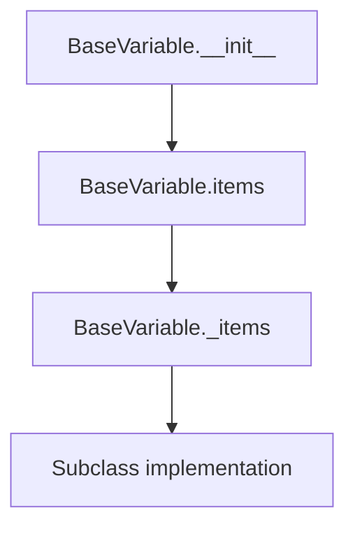
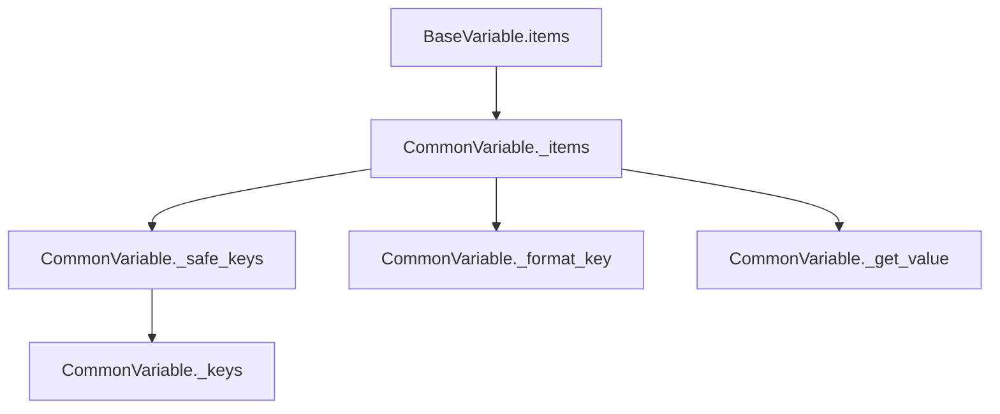
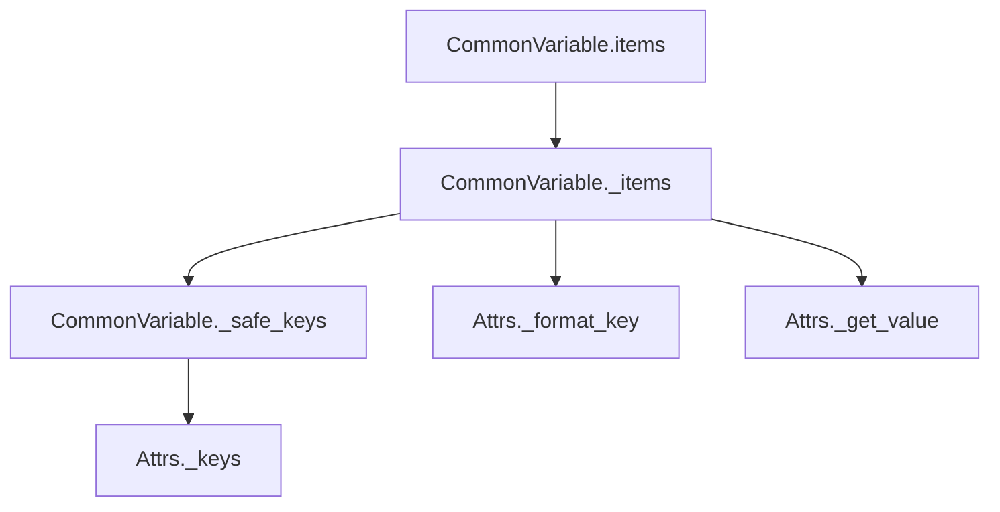
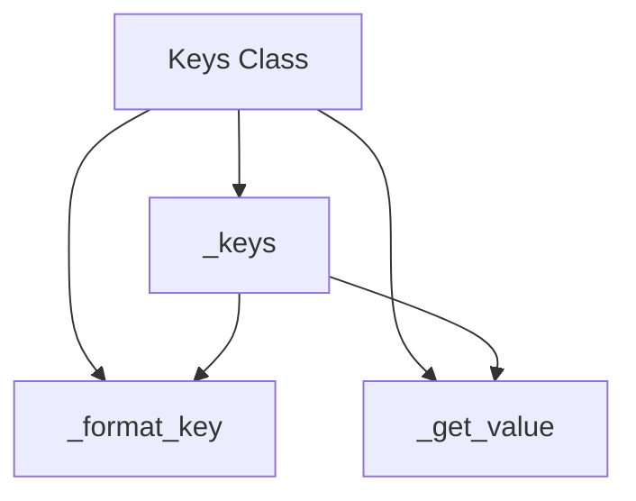

# `variables.py`

## `pysnooper.variables.needs_parentheses` · *function*

*No documentation generated.*

## `pysnooper.variables.BaseVariable` · *class*

## Summary:
Base class for variable representation that encapsulates source code evaluation and exclusion handling for debugging purposes.

## Description:
The BaseVariable class serves as an abstract foundation for representing variables in a debugging context. It handles compilation of source code expressions, evaluation within execution frames, and exclusion filtering. Subclasses must implement the `_items` method to define how variable values should be processed and represented.

This class is designed to be extended by concrete implementations that handle specific variable types or representations in debugging contexts.

## State:
- source (str): The source code expression to be compiled and evaluated
- exclude (tuple): Tuple of patterns to exclude from processing
- code (compiled code object): Compiled version of the source for efficient evaluation
- unambiguous_source (str): Source code wrapped in parentheses when needed to avoid ambiguity

## Lifecycle:
- Creation: Instantiate with source string and optional exclude patterns
- Usage: Call `items(frame, normalize=False)` to evaluate the source expression in a given frame context and process results through subclass implementation
- Destruction: No explicit cleanup required; relies on Python's garbage collection

## Method Map:


## Raises:
- None explicitly raised by __init__
- Evaluation exceptions during `items()` method are caught and result in empty tuple return

## Example:
```python
# Typical usage pattern
var = BaseVariable("my_variable", exclude=("secret",))
# This would be used by subclasses that implement _items
```

### `pysnooper.variables.BaseVariable.__init__` · *method*

## Summary:
Initializes a BaseVariable instance by storing source code, processing exclusion rules, compiling the code, and determining unambiguous representation.

## Description:
The BaseVariable.__init__ method sets up the fundamental properties of a variable tracking object. It accepts a source code string representing the variable expression to monitor, processes optional exclusion rules, compiles the source for runtime evaluation, and prepares a properly formatted representation for display. This method is called during object construction to establish the variable's evaluation context and representation characteristics.

## Args:
    source (str): The source code string representing the variable expression to track
    exclude (tuple, optional): A tuple of names to exclude from tracking. Defaults to empty tuple

## Returns:
    None: This method initializes instance attributes and does not return a value

## Raises:
    None explicitly raised by this method

## State Changes:
    Attributes READ: None
    Attributes WRITTEN: 
    - self.source: Stores the original source code string
    - self.exclude: Stores processed exclusion rules as a tuple
    - self.code: Stores compiled bytecode for runtime evaluation
    - self.unambiguous_source: Stores source with surrounding parentheses if needed

## Constraints:
    Preconditions:
    - source must be a valid Python expression string that can be compiled with 'eval'
    - exclude parameter should be convertible to a tuple (including strings, lists, or other iterables)
    
    Postconditions:
    - self.source contains the original source string unchanged
    - self.exclude contains a normalized tuple of exclusion rules
    - self.code contains valid compiled bytecode for evaluating the source
    - self.unambiguous_source contains properly parenthesized source when needed

## Side Effects:
    None: This method performs no I/O operations or external service calls. It only manipulates internal object state.

### `pysnooper.variables.BaseVariable.items` · *method*

## Summary:
Evaluates a variable expression in the given frame context and extracts its items for inspection.

## Description:
This method serves as the primary interface for variable inspection within the pysnooper tracing system. It evaluates the variable expression stored in `self.code` within the provided frame's local and global scope, then delegates to the abstract `_items` method to extract detailed information about the evaluated value. The method provides graceful error handling by returning an empty tuple when evaluation fails.

## Args:
    frame (FrameType): The execution frame in which to evaluate the variable expression
    normalize (bool): Optional flag to control normalization of item representations (default: False)

## Returns:
    tuple: A tuple containing the extracted items from the evaluated variable. Returns an empty tuple if evaluation fails.

## Raises:
    None: Exceptions during evaluation are caught and handled gracefully

## State Changes:
    Attributes READ: 
        - self.code: The compiled variable expression to evaluate
    Attributes WRITTEN: None

## Constraints:
    Preconditions:
        - The frame parameter must be a valid Python frame object
        - The variable expression in self.code must be valid Python syntax
        - The _items method must be implemented by subclasses
        
    Postconditions:
        - Returns a tuple of items that can be processed by the tracing system
        - If evaluation succeeds, delegates to _items method for actual extraction
        - If evaluation fails, returns empty tuple as fallback

## Side Effects:
    - Evaluates arbitrary Python code in the frame's context using eval()
    - May cause side effects from the evaluation of the variable expression
    - No direct I/O operations or external service calls

### `pysnooper.variables.BaseVariable._items` · *method*

## Summary:
Extracts and returns items from an evaluated variable value for inspection purposes.

## Description:
This abstract method serves as the core interface for extracting elements from evaluated variable values. It is called internally by the `items` method after successfully evaluating a variable expression in a given frame context. The method must be implemented by subclasses to provide specific extraction logic based on the variable type being inspected.

## Args:
    key (Any): The evaluated value from the variable expression that needs to have its items extracted
    normalize (bool): Optional flag to indicate whether the extracted items should be normalized (default: False)

## Returns:
    tuple: A tuple containing the extracted items from the evaluated value. The exact structure depends on the implementing subclass.

## Raises:
    NotImplementedError: Always raised by the base implementation, indicating that subclasses must override this method.

## State Changes:
    Attributes READ: None - this method doesn't read any instance attributes
    Attributes WRITTEN: None - this method doesn't modify any instance attributes

## Constraints:
    Preconditions: 
    - Must be called from within the `items` method after successful evaluation of a variable
    - The `key` parameter must be the result of evaluating the variable expression
    - Subclasses must implement this method to avoid runtime errors
    
    Postconditions:
    - Returns a tuple of items that can be processed by the caller
    - The returned tuple structure depends on the specific implementation in subclasses

## Side Effects:
    None - This method performs no I/O operations or external service calls

### `pysnooper.variables.BaseVariable._fingerprint` · *method*

## Summary:
Returns a tuple identifying the variable by its type, source code, and exclusion configuration for use in equality and hashing operations.

## Description:
This property generates a unique fingerprint for a BaseVariable instance by combining its type, source code string, and exclusion configuration. The fingerprint is used by the `__hash__` and `__eq__` methods to ensure consistent behavior when BaseVariable instances are used in hash-based data structures like sets and dictionaries. This enables proper semantic comparison of variables that have identical characteristics, regardless of whether they are different instances.

## Args:
    None

## Returns:
    tuple: A 3-element tuple containing:
        - type(self): The concrete class type of the variable instance
        - self.source: The source code string representing the variable expression
        - self.exclude: The exclusion configuration tuple for the variable

## Raises:
    None

## State Changes:
    Attributes READ: 
    - self.source
    - self.exclude
    - type(self)

## Constraints:
    Preconditions:
    - The object must be an instance of BaseVariable or its subclass
    - All attributes (source, exclude) must be properly initialized
    - The returned tuple must contain hashable elements
    
    Postconditions:
    - Returns a consistent tuple representation for the same variable configuration
    - The tuple can be used as a key in hash-based collections

## Side Effects:
    None

### `pysnooper.variables.BaseVariable.__hash__` · *method*

## Summary:
Computes and returns a hash value based on the variable's fingerprint for use in hash-based data structures.

## Description:
This method implements the standard `__hash__` protocol for BaseVariable instances, enabling them to be used as dictionary keys or set elements. The hash is computed from the object's fingerprint, which uniquely identifies the variable by combining its type, source code string, and exclusion configuration. This ensures that semantically equivalent variables (same type, source, and exclude settings) produce identical hash values, maintaining consistency with the `__eq__` method implementation.

## Args:
    None

## Returns:
    int: An integer hash value derived from the variable's fingerprint tuple.

## Raises:
    TypeError: If the fingerprint contains unhashable elements (though this would be unusual given the composition of (type, source, exclude)).

## State Changes:
    Attributes READ: 
    - self._fingerprint

## Constraints:
    Preconditions:
    - The object must have a valid `_fingerprint` property that returns a hashable tuple
    - The `_fingerprint` must be consistent with the `__eq__` method implementation
    
    Postconditions:
    - Returns an integer hash value suitable for use in hash-based collections
    - The returned hash value remains constant for the lifetime of the object

## Side Effects:
    None

### `pysnooper.variables.BaseVariable.__eq__` · *method*

## Summary:
Compares two BaseVariable instances for equality based on their type, source code, and exclusion settings.

## Description:
This method implements the equality operator (`==`) for BaseVariable objects. It determines whether two variable representations are equivalent by comparing their fingerprint, which consists of the variable's type, source code string, and exclude configuration. This ensures that variables with identical characteristics are considered equal, regardless of whether they are different instances.

## Args:
    other (object): Another object to compare with this BaseVariable instance.

## Returns:
    bool: True if the other object is a BaseVariable instance with matching type, source, and exclude attributes; False otherwise.

## Raises:
    None

## State Changes:
    Attributes READ: 
    - self._fingerprint
    - self.source
    - self.exclude
    - type(self)

## Constraints:
    Preconditions:
    - The other object must be an instance of BaseVariable or its subclass for the comparison to return True
    - Both instances must have the same type, source, and exclude configuration for equality to be determined
    
    Postconditions:
    - Returns a boolean value indicating equality status
    - Does not modify either object's state

## Side Effects:
    None

## `pysnooper.variables.CommonVariable` · *class*

## Summary:
Abstract base class that extends BaseVariable to provide common functionality for processing variable contents in debugging contexts.

## Description:
The CommonVariable class extends BaseVariable and provides common infrastructure for processing variable contents, particularly for container-like objects that have keys and values. It builds upon BaseVariable's foundation for source code evaluation and exclusion handling to implement standardized methods for safely iterating over keys, extracting values, and formatting representations.

This class serves as a base for concrete implementations that handle specific variable types (such as dictionaries, lists, or objects) in debugging contexts, providing reusable patterns for key iteration, value extraction, and formatted representation generation while maintaining compatibility with BaseVariable's evaluation framework.

## State:
- source (str): The source code expression to be compiled and evaluated (inherited from BaseVariable)
- exclude (tuple): Tuple of patterns to exclude from processing (inherited from BaseVariable)
- code (compiled code object): Compiled version of the source for efficient evaluation (inherited from BaseVariable)
- unambiguous_source (str): Source code wrapped in parentheses when needed to avoid ambiguity (inherited from BaseVariable)

## Lifecycle:
- Creation: Instantiate with source string and optional exclude patterns (inherited from BaseVariable)
- Usage: Call `items(frame, normalize=False)` to evaluate the source expression in a given frame context and process results through the `_items` implementation
- Destruction: No explicit cleanup required; relies on Python's garbage collection

## Method Map:


## Raises:
- None explicitly raised by __init__ (inherited from BaseVariable)
- Evaluation exceptions during `items()` method are caught and result in empty tuple return (inherited from BaseVariable)

## Example:
```python
# Typical usage pattern - creating a subclass
class MyVariable(CommonVariable):
    def _format_key(self, key):
        return f'.{key}'
    
    def _get_value(self, main_value, key):
        return getattr(main_value, key)

# Using the subclass
var = MyVariable("my_object", exclude=("secret",))
# This would be used by the debugging framework to inspect my_object
```

### `pysnooper.variables.CommonVariable._items` · *method*

## Summary:
Collects variable items for debugging inspection by building key-value pairs from main value and its attributes/items.

## Description:
Processes a main value object to extract its representation and associated key-value pairs for debugging output. This method is called by the `BaseVariable.items` method during variable inspection in pysnooper's tracing system. It creates a list of (key, value) pairs where the first pair represents the main value itself, and subsequent pairs represent individual attributes or items from the main value.

The method handles various edge cases including excluded keys, exceptions during value retrieval, and proper key formatting for display. It's designed to work with different variable types through inheritance from `CommonVariable`.

## Args:
    main_value (Any): The object to inspect and extract items from for debugging
    normalize (bool): Flag to control normalization of value representations (default: False)

## Returns:
    list[tuple[str, str]]: A list of (key, value) pairs where key is a formatted string representation and value is a string representation of the corresponding item. The first pair contains the main value's source and representation, followed by pairs for each accessible item/attribute.

## Raises:
    None: Exceptions during value retrieval are caught and skipped silently

## State Changes:
    Attributes READ:
        - self.source: Original source expression for the main value
        - self.unambiguous_source: Source expression wrapped for safe concatenation
        - self.exclude: Tuple of patterns to exclude from processing
    Attributes WRITTEN: None

## Constraints:
    Preconditions:
        - The main_value parameter should be a valid Python object that can be inspected
        - The class must have implemented `_safe_keys`, `_get_value`, and `_format_key` methods
        - The exclude attribute should be a tuple of patterns to filter out
        
    Postconditions:
        - Always returns a list of at least one (key, value) pair (the main value)
        - Excluded keys are skipped from the result
        - Invalid keys or failed value retrievals are silently skipped
        - All returned keys are properly formatted for display

## Side Effects:
    - Calls `utils.get_shortish_repr` which may perform string manipulation and normalization
    - Calls `self._safe_keys`, `self._get_value`, and `self._format_key` methods
    - May invoke `self._keys` method internally through `_safe_keys`

### `pysnooper.variables.CommonVariable._safe_keys` · *method*

## Summary:
Safely yields keys from a main value by wrapping key iteration in exception handling.

## Description:
Provides a safe mechanism for iterating over keys from a main value, catching and suppressing any exceptions that might occur during key retrieval. This method is designed to prevent debugging sessions from failing when encountering objects with problematic key access patterns.

The method delegates to `self._keys(main_value)` to obtain the actual keys, but wraps this operation in a try-except block to ensure that any exceptions (including AttributeError, TypeError, or other exceptions from key iteration) are caught and ignored rather than propagating upward. This makes the debugging process more robust when dealing with edge cases in variable inspection.

This method is primarily used by the `_items` method to safely enumerate keys for debugging output without interrupting the tracing process.

## Args:
    main_value: The variable value from which to retrieve keys for debugging inspection

## Returns:
    Generator yielding keys from main_value, or empty generator if key iteration fails

## Raises:
    None: All exceptions during key iteration are caught and suppressed

## State Changes:
    Attributes READ: None
    Attributes WRITTEN: None

## Constraints:
    Preconditions: 
    - main_value should be a valid Python object that can be processed by the calling context
    - The class must have implemented `_keys` method for key retrieval
    
    Postconditions:
    - Always returns a generator (even if empty)
    - Exceptions during key iteration are silently handled
    - No modification to object state occurs

## Side Effects:
    None: This method performs no I/O operations or external service calls

### `pysnooper.variables.CommonVariable._keys` · *method*

## Summary:
Returns an empty tuple, indicating that scalar values have no iterable keys for debugging inspection.

## Description:
This method serves as a base implementation for retrieving keys from variable values during debugging inspection. It's designed to be overridden by subclasses to provide appropriate key iteration for container-like objects such as dictionaries, lists, or custom objects with attribute access.

The method is called by `_safe_keys()` which provides safe iteration with exception handling. In the base implementation, it simply returns an empty tuple, indicating that scalar values (non-container types) don't have keys to iterate over.

This method follows the pattern where subclasses implement specific key extraction logic for their variable types. For example, dictionary variables would return the dictionary keys, while list variables would return integer indices.

## Args:
    main_value: The variable value being inspected for debugging. This parameter represents the result of evaluating the source expression in the debug context.

## Returns:
    tuple: An empty tuple () indicating no keys exist for scalar values. Subclasses should override this to return appropriate key tuples for container types. The returned tuple should contain elements that can be used to index or access the main_value.

## Raises:
    None: This base implementation does not raise exceptions, though subclasses may raise exceptions during key extraction.

## State Changes:
    Attributes READ: None
    Attributes WRITTEN: None

## Constraints:
    Preconditions: The method should be called with a valid variable value that can be processed by the calling context.
    Postconditions: Always returns a tuple, even if empty. The tuple elements should be compatible with the `_get_value` method for accessing values.

## Side Effects:
    None: This method performs no I/O operations or external service calls.

### `pysnooper.variables.CommonVariable._format_key` · *method*

## Summary:
Formats a key for display in variable inspection output by converting it to a string representation suitable for concatenation with source expressions.

## Description:
This abstract method converts a key (typically from dictionary iteration or attribute access) into a properly formatted string representation that can be used in debugging output. The formatted key is concatenated with `self.unambiguous_source` to create a complete key expression for display purposes.

The method is called from the `_items` method during variable inspection to format keys for inclusion in the debug output. Concrete implementations must provide appropriate formatting logic based on the type of variable being inspected (e.g., dictionary keys, attribute names).

## Args:
    key (any): The key to be formatted, typically a string, integer, or other hashable type that represents a dictionary key or attribute name.

## Returns:
    str: A string representation of the key that can be safely concatenated with `self.unambiguous_source` to form a complete key expression.

## Raises:
    NotImplementedError: This is an abstract method that must be implemented by subclasses.

## State Changes:
    Attributes READ: 
    - self.unambiguous_source (used in the string formatting operation)
    
    Attributes WRITTEN: None

## Constraints:
    Preconditions:
    - The method should handle any hashable key type that might be encountered during variable inspection
    - The returned string should be safe for use in string formatting operations
    
    Postconditions:
    - The returned string must be compatible with the string formatting pattern: '{}{}'.format(self.unambiguous_source, formatted_key)
    - The method should not raise exceptions for valid key types

## Side Effects:
    None: This method performs no I/O operations or external service calls. It only processes the input key and returns a formatted string.

### `pysnooper.variables.CommonVariable._get_value` · *method*

## Summary:
Retrieves the value associated with a specific key from a main value object for debugging inspection.

## Description:
Abstract method that extracts a specific value from a main value object using the provided key. This method is part of the variable inspection system used by pysnooper to display detailed information about variables during debugging sessions. The method is called internally by the `_items` method when processing variable contents to generate debug output.

This method must be implemented by concrete subclasses to handle specific types of variable access patterns (such as attribute access or item access).

## Args:
    main_value (Any): The object from which to extract a value
    key (Any): The key or index used to access a specific part of the main_value object

## Returns:
    Any: The value associated with the specified key in the main_value object

## Raises:
    NotImplementedError: This is an abstract method that must be implemented by subclasses

## State Changes:
    Attributes READ: None
    Attributes WRITTEN: None

## Constraints:
    Preconditions: 
    - This method must be implemented by concrete subclasses
    - The main_value and key parameters should be compatible with the specific implementation
    - The key should be valid for accessing elements in the main_value object
    
    Postconditions:
    - Must return a value that can be represented as a string for debugging output
    - Should not raise exceptions for valid inputs (exceptions should be handled by caller)

## Side Effects:
    None

## `pysnooper.variables.Attrs` · *class*

## Summary:
A variable processor that extracts and formats attributes from Python objects with `__dict__` or `__slots__` for debugging inspection.

## Description:
The Attrs class implements methods for processing object attributes in debugging contexts. It provides specific implementations for key enumeration, key formatting, and value retrieval that enable inspection of object attributes during debugging sessions.

This class is designed to work with objects that have either `__dict__` (regular objects) or `__slots__` (memory-efficient objects) attributes, allowing debugging tools to systematically enumerate and retrieve attribute values for display.

## State:
- Inherits all state from CommonVariable including source, exclude, code, and unambiguous_source
- No additional instance attributes beyond those inherited from the parent class

## Lifecycle:
- Creation: Instantiate with a source expression string and optional exclude patterns
- Usage: Called automatically by the debugging framework when processing object variables
- Destruction: Managed by Python's garbage collection

## Method Map:


## Raises:
- Inherited from CommonVariable.__init__: None explicitly raised
- Evaluation exceptions during items() method execution are handled gracefully by returning empty tuples

## Example:
```python
# Creating an Attrs instance for debugging
obj = SomeClass()
attrs_var = Attrs("obj", exclude=("private_attr",))

# This would be used internally by pysnooper to inspect obj's attributes
# and format them as ".attribute_name" for display
```

### `pysnooper.variables.Attrs._keys` · *method*

## Summary:
Returns an iterator of attribute keys from an object by combining its __dict__ and __slots__ attributes.

## Description:
This method retrieves all available attribute keys from the provided object by chaining together the __dict__ and __slots__ attributes. It's specifically designed for the Attrs class to support inspection of object attributes. The method is called by _safe_keys to iterate over all attributes of an object without raising exceptions.

This logic is implemented as a separate method rather than being inlined because:
1. It provides a clean abstraction for attribute key retrieval
2. It enables polymorphism through the CommonVariable interface
3. It allows safe iteration through attributes via _safe_keys
4. It separates concerns between key retrieval and key processing

## Args:
    main_value (Any): The object whose attribute keys are to be retrieved

## Returns:
    Iterator[str]: An iterator over attribute names found in either __dict__ or __slots__ of main_value

## Raises:
    None: This method does not raise exceptions directly, though underlying getattr calls may raise AttributeError

## State Changes:
    Attributes READ: None
    Attributes WRITTEN: None

## Constraints:
    Preconditions: 
    - main_value should be an object that supports __dict__ and/or __slots__ attributes
    - main_value should be iterable or have appropriate __iter__ methods for the returned iterators
    
    Postconditions:
    - Returns an iterator containing all attribute names from __dict__ and __slots__
    - If __dict__ or __slots__ don't exist, returns empty iterators

## Side Effects:
    None: This method performs no I/O operations or external service calls

### `pysnooper.variables.Attrs._format_key` · *method*

## Summary:
Formats attribute keys by prepending a period character to enable dot-notation access.

## Description:
This method implements the key formatting strategy for object attributes within the Attrs class. It transforms raw attribute names into dot-prefixed strings suitable for attribute access notation. This method is part of a polymorphic interface where different variable types (Attrs, Keys, Indices) implement their own key formatting strategies.

## Args:
    key (str): The attribute name to be formatted

## Returns:
    str: A period-prefixed string representation of the attribute name

## Raises:
    None: This method does not raise any exceptions

## State Changes:
    Attributes READ: None
    Attributes WRITTEN: None

## Constraints:
    Preconditions: The input key must be a string
    Postconditions: The returned string will always begin with a period followed by the original key

## Side Effects:
    None: This method performs no I/O operations or external service calls

### `pysnooper.variables.Attrs._get_value` · *method*

## Summary:
Retrieves an attribute value from an object using the getattr builtin function.

## Description:
This method implements the abstract `_get_value` interface defined in `CommonVariable` to fetch attribute values from objects. It is called during variable inspection operations to extract specific attribute values from main objects. The method serves as a bridge between the variable inspection framework and Python's attribute access mechanism.

## Args:
    main_value (Any): The object from which to retrieve the attribute
    key (str): The name of the attribute to retrieve

## Returns:
    Any: The value of the specified attribute from main_value

## Raises:
    AttributeError: When the specified key does not exist as an attribute on main_value

## State Changes:
    Attributes READ: None
    Attributes WRITTEN: None

## Constraints:
    Preconditions: 
    - main_value must be an object that supports attribute access via getattr
    - key must be a string representing a valid attribute name on main_value
    
    Postconditions:
    - Returns the actual attribute value from main_value
    - Raises AttributeError if the attribute doesn't exist

## Side Effects:
    None

## `pysnooper.variables.Keys` · *class*

## Summary:
A variable handler class that provides key-based access and formatting for dictionary-like objects in pysnooper.

## Description:
The Keys class is a specialized variable handler that extends CommonVariable to support inspection of dictionary-like objects during program debugging. It implements three core methods for working with dictionary keys: extracting keys, formatting them for display, and retrieving corresponding values. This class enables pysnooper to properly examine and display dictionary variable contents during program execution.

## State:
- Inherits from CommonVariable (providing base variable handling functionality)
- Implements three methods for dictionary key operations:
  - `_keys()` method that returns the keys of dictionary-like objects
  - `_format_key()` method that formats keys for readable display representation  
  - `_get_value()` method that retrieves values associated with specific keys

## Lifecycle:
- Creation: Instantiated automatically by the pysnooper debugging framework when encountering dictionary variables
- Usage: Methods are invoked sequentially by the debugging system to analyze dictionary contents
- Destruction: Managed by Python's garbage collection

## Method Map:


## Raises:
- KeyError: Raised by `_get_value()` when attempting to access non-existent keys
- AttributeError: Raised if main_value lacks required methods (.keys() or bracket indexing support)

## Example:
```python
# Used internally by pysnooper when debugging dictionaries
my_dict = {'name': 'John', 'age': 30}
# Keys class methods would process this as:
# 1. _keys(my_dict) -> returns dict_keys(['name', 'age'])
# 2. _format_key('name') -> returns '[name]' 
# 3. _get_value(my_dict, 'name') -> returns 'John'
```

### `pysnooper.variables.Keys._keys` · *method*

## Summary:
Returns the keys of a dictionary-like object by calling the .keys() method on the provided main_value.

## Description:
Extracts and returns the keys from a dictionary-like object. This method is part of the Keys class, which inherits from CommonVariable and provides functionality for processing variables with key-value structures in debugging contexts. The method serves as a hook for subclasses to customize key extraction behavior for different variable types.

This method is called internally by the `_safe_keys` method as part of the debugging inspection process, ensuring that key iteration is performed safely without raising exceptions that could interrupt the tracing session. It is designed to be overridden by subclasses to provide appropriate key extraction for specific variable types.

## Args:
    main_value: A dictionary-like object from which to extract keys. Must support the .keys() method.

## Returns:
    dict_keys: An iterator-like object containing the keys of the main_value, typically a dict_keys object from Python's built-in dict.keys() method.

## Raises:
    AttributeError: If main_value does not have a .keys() method.
    TypeError: If main_value is not a dictionary-like object that supports key iteration.

## State Changes:
    Attributes READ: None
    Attributes WRITTEN: None

## Constraints:
    Preconditions:
    - main_value must be a dictionary-like object that implements the .keys() method
    - The object should be iterable and support key-based access
    
    Postconditions:
    - Returns a dict_keys object or similar iterator-like object
    - Does not modify the main_value object
    - The returned keys can be used for further processing in the debugging framework

## Side Effects:
    None: This method performs no I/O operations or external service calls. It simply delegates to the built-in .keys() method of the provided object.

### `pysnooper.variables.Keys._format_key` · *method*

## Summary:
Formats a dictionary or mapping key for display in debugging output by wrapping it in square brackets and applying a clean string representation.

## Description:
This method is responsible for formatting keys from container-like variables (dictionaries, mappings) for presentation in debugging contexts. It takes a raw key and transforms it into a visually distinct format by enclosing it in square brackets, making it easier to distinguish from values in debug output. The key itself is processed through `utils.get_shortish_repr` to ensure clean, readable representation without excessive verbosity.

The method is part of the `Keys` class hierarchy that extends `CommonVariable` and is used internally by the debugging framework to standardize how keys appear in variable inspection output. It's called during the processing of container variables to format individual keys for display.

## Args:
    self: The instance of the Keys class
    key (Any): The key to format, which can be any hashable Python object (string, number, tuple, etc.)

## Returns:
    str: A formatted string representation of the key enclosed in square brackets, e.g., "[key_value]" where key_value is the clean representation of the input key

## Raises:
    None explicitly raised - the underlying `utils.get_shortish_repr` function handles all representation errors gracefully by returning 'REPR FAILED'

## State Changes:
    Attributes READ: None
    Attributes WRITTEN: None

## Constraints:
    Preconditions:
    - The key parameter can be any hashable Python object
    - The method assumes the key will be compatible with `utils.get_shortish_repr` function
    
    Postconditions:
    - Always returns a string starting with '[' and ending with ']'
    - The inner portion contains a clean representation of the key

## Side Effects:
    None - this is a pure function that only processes input and returns a formatted string

### `pysnooper.variables.Keys._get_value` · *method*

## Summary:
Retrieves a value from a container object using the specified key for debugging inspection.

## Description:
Extracts a value from a container-like object (dictionary, mapping, etc.) using the provided key. This method is part of the Keys class implementation within pysnooper's debugging framework, specifically designed for inspecting dictionary-like variables during code tracing.

The method is called internally by `CommonVariable._items()` during variable inspection to retrieve individual values associated with keys from container objects. It serves as a key-value accessor that enables the debugging system to display both keys and their corresponding values in a structured format.

This logic is implemented as a separate method rather than being inlined because:
1. It provides a clean abstraction for value retrieval from containers
2. It enables polymorphism through the CommonVariable interface
3. It allows safe access to container values during debugging without disrupting the tracing process
4. It separates concerns between key iteration and value extraction

## Args:
    main_value (Any): The container object (dictionary, mapping, etc.) from which to retrieve a value
    key (Any): The key used to access the desired value within the container

## Returns:
    Any: The value associated with the specified key in the main_value container

## Raises:
    KeyError: When the specified key does not exist in the main_value container
    TypeError: When main_value is not a container type that supports key-based access
    Exception: Any other exception that might occur during value retrieval from the container

## State Changes:
    Attributes READ: None
    Attributes WRITTEN: None

## Constraints:
    Preconditions:
        - main_value must be a container object that supports key-based access (e.g., dict, mapping)
        - key must be a valid key type for the main_value container
        - The method should only be called within the debugging framework context where main_value is properly evaluated
        
    Postconditions:
        - Returns the value associated with key in main_value
        - If key is not found, raises KeyError or equivalent exception
        - If main_value is not a container, raises TypeError or equivalent exception

## Side Effects:
    None: This method performs no I/O operations or external service calls. It only accesses container values through standard Python indexing operations.

## `pysnooper.variables.Indices` · *class*

*No documentation generated.*

### `pysnooper.variables.Indices._keys` · *method*

## Summary:
Returns a sliced range of indices for sequence-like objects, enabling indexed access to elements within a specified slice.

## Description:
This method implements key iteration for sequence-type variables (like lists, tuples, strings) by returning a range of indices that correspond to the elements in the sequence. It leverages the `_slice` attribute of the Indices instance to provide flexible indexing capabilities, allowing for slicing operations similar to Python's built-in slicing syntax.

The method is called by `_safe_keys()` during debugging inspection to provide iterable keys for sequence containers. This implementation specifically handles sequences by generating integer indices rather than actual keys, making it suitable for indexed access patterns.

This logic is implemented as a separate method rather than being inlined because:
1. It provides a clean abstraction for index-based key retrieval
2. It enables polymorphism through the CommonVariable interface
3. It allows safe iteration through indices via _safe_keys
4. It separates concerns between key generation and key processing
5. It supports slicing operations through the _slice attribute

## Args:
    main_value: The sequence-like object (list, tuple, string, etc.) whose indices are to be retrieved

## Returns:
    range: A range object containing indices from 0 to len(main_value)-1, sliced according to self._slice

## Raises:
    None: This method does not raise exceptions directly, though underlying operations may raise IndexError or TypeError if main_value is not sequence-like

## State Changes:
    Attributes READ: self._slice
    Attributes WRITTEN: None

## Constraints:
    Preconditions:
    - main_value must be a sequence-like object supporting len() and indexing operations
    - main_value should be iterable and support integer indexing
    
    Postconditions:
    - Returns a range object that can be used to iterate over indices
    - The range will contain indices from 0 to len(main_value)-1, properly sliced by self._slice

## Side Effects:
    None: This method performs no I/O operations or external service calls.

### `pysnooper.variables.Indices.__getitem__` · *method*

## Summary:
Returns a new Indices instance with an updated slice specification, enabling immutable slicing operations on index tracking objects.

## Description:
This special method enables slicing syntax on Indices objects (e.g., `indices[1:5:2]`). It creates a deep copy of the current instance and updates its internal `_slice` attribute with the provided slice object, returning the modified copy. This follows the immutable object pattern where operations return new instances rather than modifying existing ones.

The method is called during indexing operations when a slice is used as an argument, such as in `indices[start:stop:step]` expressions. It's part of the standard Python protocol for implementing container-like objects that support slicing.

## Args:
    item (slice): A slice object representing the indexing operation (start, stop, step parameters)

## Returns:
    Indices: A new Indices instance with the same properties as self but with _slice attribute updated to the provided slice

## Raises:
    AssertionError: When item is not an instance of slice type

## State Changes:
    Attributes READ: self._slice
    Attributes WRITTEN: result._slice (in the returned copy)

## Constraints:
    Preconditions: 
    - The item parameter must be an instance of slice type
    - The Indices object must be properly initialized with a _slice attribute
    
    Postconditions:
    - Returns a new Indices instance (immutable pattern)
    - The returned instance has identical properties except for the _slice attribute
    - The original instance remains unchanged

## Side Effects:
    None: This method performs no I/O operations or external service calls. It only creates a deep copy of the object and modifies the copy's internal state.

## `pysnooper.variables.Exploding` · *class*

*No documentation generated.*

### `pysnooper.variables.Exploding._items` · *method*

## Summary:
Selects and delegates to the appropriate variable processor based on the type of the main_value for comprehensive variable inspection.

## Description:
The `_items` method in the `Exploding` class acts as a dynamic dispatcher that determines the most suitable variable processing class based on the type of the provided `main_value`. It routes the processing to either `Keys` for dictionary-like objects, `Indices` for sequence objects, or `Attrs` for regular objects with attributes. This approach allows the debugging framework to handle different variable types appropriately while maintaining a consistent interface.

This method is called during the debugging process when examining variable contents, ensuring that each variable type is processed according to its structural characteristics. It's part of the pysnooper debugging framework's variable inspection pipeline, where it's invoked by the parent class's `items()` method to process variable values for display.

## Args:
    main_value (Any): The variable value to be processed and inspected
    normalize (bool): Flag indicating whether to normalize the output format (defaults to False)

## Returns:
    tuple: A tuple containing processed items from the appropriate variable handler class

## Raises:
    None explicitly raised by this method - exceptions are propagated from the delegated classes

## State Changes:
    Attributes READ: self.source, self.exclude
    Attributes WRITTEN: None

## Constraints:
    Preconditions: 
    - `main_value` must be a valid Python object that can be processed by the respective handlers
    - `self.source` and `self.exclude` must be properly initialized from the parent class
    
    Postconditions:
    - Returns a tuple of processed items matching the expected format for debugging inspection
    - The returned items are consistent with the type-specific processing rules of the selected handler class

## Side Effects:
    None - This method performs no I/O operations or external service calls

