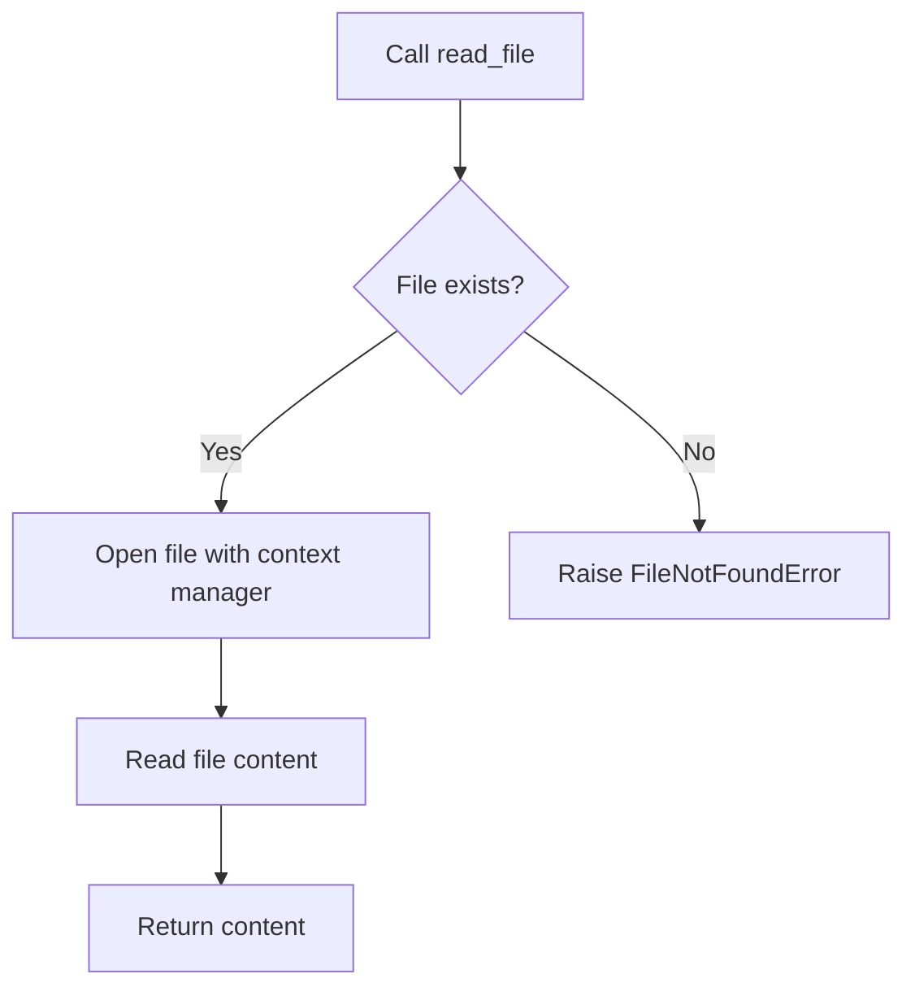

# `setup.py`

## `read_file` · *function*

## Summary:
Reads and returns the complete content of a text file as a string.

## Description:
Opens the specified file in read mode and returns its entire content as a string. This function is commonly used in Python package setup scripts to read README files, license files, or other documentation for inclusion in package metadata.

## Args:
    filename (str): Path to the file to be read. Can be absolute or relative to the current working directory.

## Returns:
    str: The complete content of the file as a string, including all newlines and formatting.

## Raises:
    FileNotFoundError: If the specified file does not exist at the given path.
    PermissionError: If the process does not have permission to read the specified file.

## Constraints:
    Preconditions:
        - The filename parameter must be a valid string representing a file path
        - The file must exist and be readable
    Postconditions:
        - The file is properly closed after reading (due to context manager usage)
        - Returns the complete file content as a string

## Side Effects:
    - Reads from the filesystem
    - May raise file system related exceptions if the file cannot be accessed

## Control Flow:


## Examples:
```python
# Reading a README file for package description
long_description = read_file('README.md')

# Reading a license file
license_text = read_file('LICENSE.txt')
```

