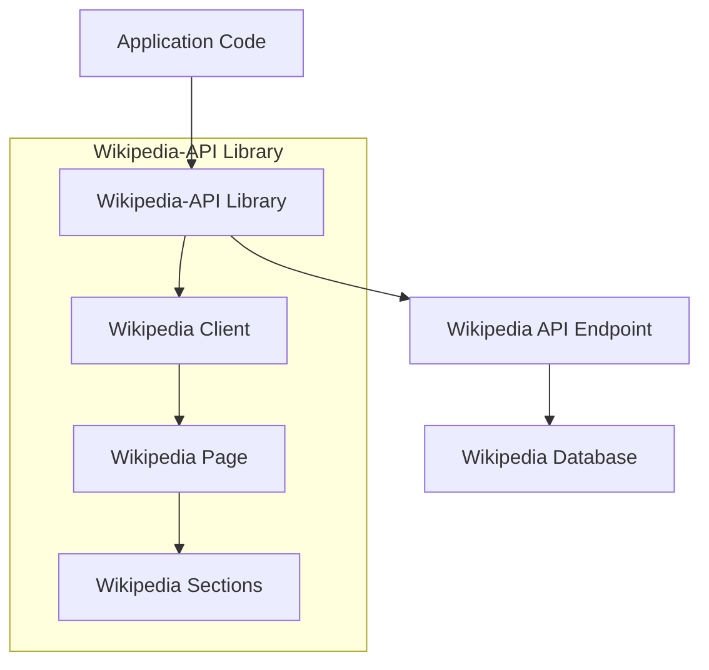

# `Wikipedia-API`

## Wikipedia-API Repository

### Tree Structure
```
Wikipedia-API/
├── wikipediaapi/          # Main Python package for Wikipedia API access
│   └── __init__.py        # Package initialization and main API entry points
├── example.py             # Usage examples demonstrating various API features
└── setup.py               # Package installation and metadata configuration
```

### Purpose
The Wikipedia-API repository provides a Python interface for accessing Wikipedia content through its API. It solves the problem of making Wikipedia data easily accessible to developers by offering a clean, Pythonic abstraction over Wikipedia's API endpoints.

**Target Users:**
- Data scientists and researchers needing Wikipedia content for analysis
- Developers building applications that require Wikipedia data integration
- Content curators and information architects working with encyclopedic data
- Educational technology platforms requiring structured encyclopedia content

**Scenarios:**
- Building knowledge graphs from Wikipedia articles
- Creating automated content summarization tools
- Developing research assistants that reference encyclopedic knowledge
- Implementing multilingual content discovery systems

**Position in Ecosystem:**
This is a standalone Python library that serves as a bridge between Python applications and Wikipedia's vast knowledge base. It can be integrated into larger data processing pipelines, research tools, or web applications that need reliable access to Wikipedia content.

### Architecture


The system follows a client-object model architecture where:
1. The main `Wikipedia` client handles API communication and page retrieval
2. `WikipediaPage` objects represent individual articles with metadata and content
3. `WikipediaPageSection` objects represent hierarchical content sections
4. All communication flows through standardized API endpoints with proper error handling

### Entry Points
1. **Importable API**: `from wikipediaapi import Wikipedia`
   - Exposes the main Wikipedia client class for creating API instances
   - Target audience: Python developers integrating Wikipedia data
   - Required arguments: language parameter (defaults to 'en')
   - Usage example: `wiki = Wikipedia('en')`

2. **CLI Example**: `python example.py`
   - Demonstrates various usage patterns including sections, categories, links, and language links
   - Target audience: Quick start guides and learning
   - No special arguments required

3. **Package Installation**: `pip install wikipedia-api`
   - Standard Python package installation
   - Target audience: All developers using the library

### Core Features
1. **Article Retrieval**: Fetch complete Wikipedia articles by title
   - Implemented in `wikipediaapi.Wikipedia.page()` method

2. **Content Extraction**: Access article text, summaries, and sections
   - Implemented in `wikipediaapi.WikipediaPage` class properties

3. **Metadata Access**: Retrieve categories, links, and language translations
   - Implemented in `wikipediaapi.WikipediaPage` class attributes

4. **Hierarchical Navigation**: Traverse article sections with nested structure
   - Implemented in `wikipediaapi.WikipediaPageSection` class

5. **Multilingual Support**: Access content in different languages
   - Implemented in `wikipediaapi.Wikipedia` constructor with language parameter

### Dependencies
- **requests**: HTTP library for API communication
- **json**: JSON parsing for API responses  
- **urllib.parse**: URL encoding utilities

### Configuration
The system uses default configuration settings:
- Default language: English ('en')
- API endpoint: Wikipedia's official API
- Rate limiting: Follows Wikipedia's recommended practices
- Error handling: Graceful failure with appropriate exceptions

### Extension Points
The library supports extension through:
- Custom language selection via constructor parameters (`Wikipedia(language='fr')`)
- Direct access to raw API responses for advanced use cases
- Subclassing of core classes for specialized behavior
- Plugin-style usage of example functions for common patterns like printing sections, categories, links, etc.

---

## Modules

- [`wikipediaapi`](wikipediaapi.md)

