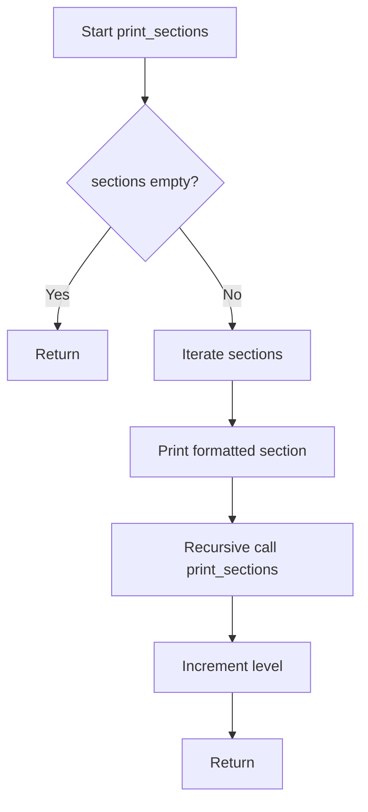
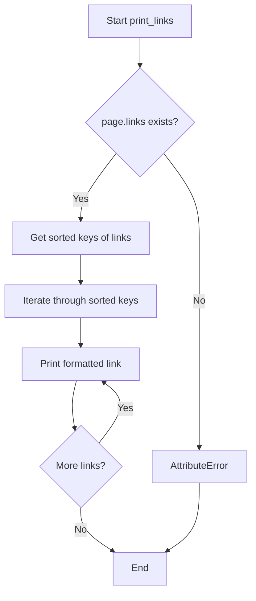

# `example.py`

## `print_sections` · *function*

## Summary:
Recursively prints section data with hierarchical indentation formatting.

## Description:
Prints section titles and truncated text content with increasing indentation levels using asterisk markers. This function traverses a hierarchical section structure and displays it in a readable tree-like format.

## Args:
    sections: Iterable collection of section objects with title, text, and sections attributes
    level (int): Current nesting level for indentation calculation, defaults to 0

## Returns:
    None: This function performs I/O operations and does not return a value

## Raises:
    AttributeError: If section objects lack required attributes (title, text, sections)
    TypeError: If sections parameter is not iterable or contains non-section objects

## Constraints:
    Preconditions:
        - sections parameter must be iterable
        - Each section object must support accessing .title, .text, and .sections attributes
        - Section objects must support text slicing with [0:40] notation
    Postconditions:
        - All sections and subsections are printed to standard output
        - Output format follows hierarchical asterisk indentation pattern

## Side Effects:
    - Prints formatted text to standard output (stdout)
    - No external state mutations or I/O beyond console output

## Control Flow:


## Examples:
```python
# Basic usage with Wikipedia sections
sections = wiki_page.sections  # From wikipediaapi
print_sections(sections)

# With custom starting level
print_sections(sections, level=1)
```

## `print_langlinks` · *function*

## Summary:
Prints language links from a Wikipedia page in a formatted manner.

## Description:
Displays multilingual links associated with a Wikipedia page by iterating through the page's language links and printing them in a standardized format showing the language code, target language, title, and full URL.

This function extracts the language link display logic into a separate utility, allowing other parts of the application to easily display multilingual references without duplicating the formatting and iteration logic.

## Args:
    page (wikipediaapi.Page): A Wikipedia page object containing language links to display

## Returns:
    None: This function does not return any value

## Raises:
    AttributeError: If the page parameter does not have a langlinks attribute or if the langlinks structure doesn't support the expected operations

## Constraints:
    Preconditions:
    - The page parameter must be a valid wikipediaapi.Page object
    - The page.langlinks attribute must be iterable and contain key-value pairs where values have language, title, and fullurl attributes
    
    Postconditions:
    - All language links from the page are printed to standard output in sorted order by language code

## Side Effects:
    - Prints formatted text to standard output (stdout)
    - No external state mutations or I/O operations beyond console output

## Control Flow:
```mermaid
flowchart TD
    A[Start print_langlinks] --> B{page.langlinks exists?}
    B -- Yes --> C[Get sorted langlinks keys]
    C --> D[Iterate through keys]
    D --> E{Key exists in langlinks?}
    E -- Yes --> F[Get langlinks[key] value]
    F --> G[Print formatted string]
    G --> H[Next key]
    H --> D
    E -- No --> I[End iteration]
    I --> J[End function]
    B -- No --> K[AttributeError raised]
```

## Examples:
    # Assuming a wikipediaapi page object exists
    page = wiki_wiki.page("Python (programming language)")
    print_langlinks(page)
    # Output would be something like:
    # de: Deutsch - Python (Programmiersprache): https://de.wikipedia.org/wiki/Python_(Programmiersprache)
    # es: español - Python: https://es.wikipedia.org/wiki/Python
    # fr: français - Python: https://fr.wikipedia.org/wiki/Python
```

## `print_links` · *function*

## Summary:
Prints all links from a Wikipedia page in alphabetical order with their associated titles.

## Description:
This function extracts and displays all hyperlinks found on a given Wikipedia page in a sorted, formatted manner. It's designed to provide a clean view of all internal links within a Wikipedia article.

## Args:
    page: A Wikipedia page object containing a links attribute. Expected to have a .links property that behaves like a dictionary with string keys and values.

## Returns:
    None: This function does not return any value.

## Raises:
    AttributeError: If the page parameter does not have a .links attribute or if .links is not accessible.

## Constraints:
    Preconditions:
    - The page parameter must have a .links attribute that is iterable
    - The keys of page.links must be sortable (strings)
    - The values of page.links must be printable
    
    Postconditions:
    - All links from the page are printed to standard output in alphabetical order
    - No return value is produced

## Side Effects:
    - Prints formatted output to standard output (stdout)
    - No external state mutations or I/O operations beyond printing

## Control Flow:


## Examples:
```python
# Assuming we have a Wikipedia page object
page = wiki_page("Python (programming language)")
print_links(page)
# Output would be something like:
# Algorithms: <url>
# Arrays: <url>
# Assembly language: <url>
# ...
```

## `print_categories` · *function*

## Summary:
Displays all categories from a Wikipedia page in alphabetical order with formatted output.

## Description:
Extracts category information from a Wikipedia page object and prints each category with its associated metadata in a formatted manner. Categories are displayed in alphabetical order based on their titles.

## Args:
    page: A Wikipedia page object from the wikipediaapi library. The page object must have a categories attribute that is a dictionary-like object where keys are category names (strings) and values are category metadata (typically strings).

## Returns:
    None: This function does not return any value.

## Raises:
    AttributeError: Raised when the provided page object does not have a categories attribute.

## Constraints:
    Preconditions:
    - The page parameter must be a valid Wikipedia page object from wikipediaapi
    - The page.categories attribute must be accessible and behave like a dictionary with string keys
    
    Postconditions:
    - All categories from the page are printed to standard output in alphabetical order
    - No return value is produced

## Side Effects:
    - Prints formatted category information to standard output (stdout)
    - No external state mutations or I/O operations beyond printing

## Control Flow:
```mermaid
flowchart TD
    A[Start print_categories] --> B[Access page.categories]
    B --> C{categories exists?}
    C -- Yes --> D[Get categories dictionary]
    D --> E[Sort category keys alphabetically]
    E --> F[Iterate through sorted keys]
    F --> G{Has next key?}
    G -- Yes --> H[Print "%s: %s" format]
    H --> I[Next key]
    I --> G
    G -- No --> J[End]
    C -- No --> K[AttributeError]
    K --> J
```

## Examples:
```python
# Basic usage with a Wikipedia page
page = wiki_page.page('Example_Page')
print_categories(page)
# Output format:
# Category:Example_Category_1: Category metadata 1
# Category:Example_Category_2: Category metadata 2
```

## `print_categorymembers` · *function*

## Summary:
Recursively prints Wikipedia category members with hierarchical indentation based on nesting level.

## Description:
This function traverses a hierarchy of Wikipedia category members and prints them with increasing indentation to visualize the tree structure. It recursively processes nested categories up to a specified maximum depth level.

## Args:
    categorymembers (dict-like): Dictionary of Wikipedia category members where keys are identifiers and values are category objects with title and ns attributes
    level (int): Current nesting level for indentation (default: 0)
    max_level (int): Maximum recursion depth allowed (default: 2)

## Returns:
    None: This function only produces output via print statements

## Raises:
    AttributeError: If categorymembers values don't have title or ns attributes
    RecursionError: If max_level is set too high and causes stack overflow

## Constraints:
    Preconditions:
        - categorymembers must be iterable with .values() method
        - Each member in categorymembers must have title and ns attributes
        - level must be a non-negative integer
        - max_level must be a non-negative integer
    
    Postconditions:
        - All category members up to max_level depth will be printed with proper indentation
        - Function terminates when max_level is reached or no more categories exist

## Side Effects:
    - Prints formatted output to standard output (stdout)
    - May cause stack overflow if max_level is very large due to recursion

## Control Flow:
```mermaid
flowchart TD
    A[Start print_categorymembers] --> B{categorymembers.values()}
    B --> C[For each category member]
    C --> D[Print with indentation]
    D --> E{Is category member?}
    E -->|Yes| F{level < max_level?}
    F -->|Yes| G[Recursive call]
    F -->|No| H[Continue loop]
    E -->|No| H
    G --> A
    H --> I[End loop]
    I --> J[Return]
```

## Examples:
    # Basic usage
    print_categorymembers(category_dict)
    
    # With custom depth limit
    print_categorymembers(category_dict, max_level=3)
    
    # With custom starting level
    print_categorymembers(category_dict, level=1, max_level=4)
```

