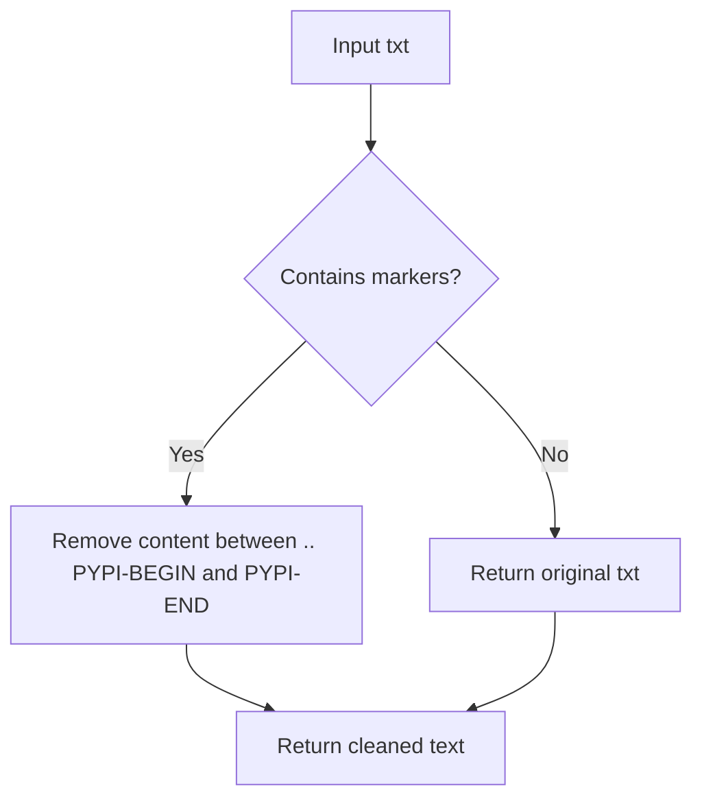

# `setup.py`

## `fix_doc` · *function*

## Summary:
Removes content between PYPI-BEGIN and PYPI-END markers from documentation text.

## Description:
Strips out sections of text that are marked for exclusion from PyPI package descriptions. This function processes documentation strings to remove content that should not appear in package metadata published to PyPI.

## Args:
    txt (str): Input text containing PYPI-BEGIN and PYPI-END markers to be removed.

## Returns:
    str: Text with all content between PYPI-BEGIN and PYPI-END markers removed.

## Raises:
    None: This function does not raise any exceptions.

## Constraints:
    Preconditions:
        - Input must be a string
    Postconditions:
        - Output string contains no content between PYPI-BEGIN and PYPI-END markers
        - All other text remains unchanged

## Side Effects:
    None: This function has no side effects.

## Control Flow:


## Examples:
    >>> fix_doc("Hello .. PYPI-BEGIN world PYPI-END goodbye")
    'Hello  goodbye'
    
    >>> fix_doc("No markers here")
    'No markers here'
    
    >>> fix_doc(".. PYPI-BEGIN start end PYPI-END")
    ''
```

