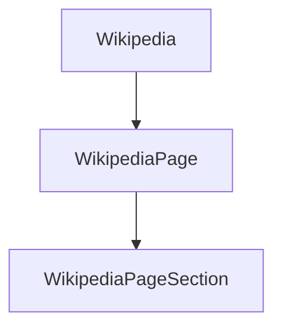

# `wikipediaapi`

## Tree:
```
wikipediaapi/
└── __init__.py
```

## Role:
Provides a Python interface for accessing Wikipedia content through its API

## Description:
This module offers a Pythonic interface to Wikipedia's API, enabling easy access to Wikipedia articles and their content. It provides a clean abstraction over Wikipedia's API endpoints, allowing developers to fetch page content, metadata, and related information without dealing with low-level HTTP requests.

The module is used by various data processing and analysis components that need to incorporate Wikipedia content into their workflows.

## Components:
*   **Wikipedia**: Main class for interacting with Wikipedia API
*   **WikipediaPage**: Class representing a Wikipedia page
*   **WikipediaPageSection**: Class representing a section within a Wikipedia page



## Public API:
*   `Wikipedia(language='en')` - Constructor for creating a Wikipedia client instance
*   `Wikipedia.page(title)` - Returns a WikipediaPage object for the specified title
*   `WikipediaPage.title` - Property returning the page title
*   `WikipediaPage.text` - Property returning the page's plain text content
*   `WikipediaPage.summary` - Property returning a summary of the page content
*   `WikipediaPageSection.title` - Property returning the section title
*   `WikipediaPageSection.text` - Property returning the section's plain text content

## Dependencies:
*   **Internal**: None
*   **External**: 
    *   `requests` - For making HTTP requests to Wikipedia's API
    *   `json` - For parsing JSON responses from the API
    *   `urllib.parse` - For URL encoding parameters

## Constraints:
*   Network connectivity is required for all operations
*   API requests should follow Wikipedia's rate limiting guidelines
*   Thread safety is not guaranteed for concurrent usage

---

## Files

- [`__init__.py`](wikipediaapi/__init__.md)

