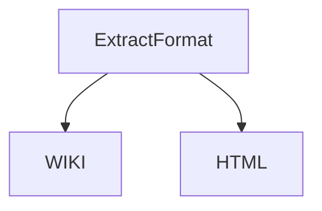
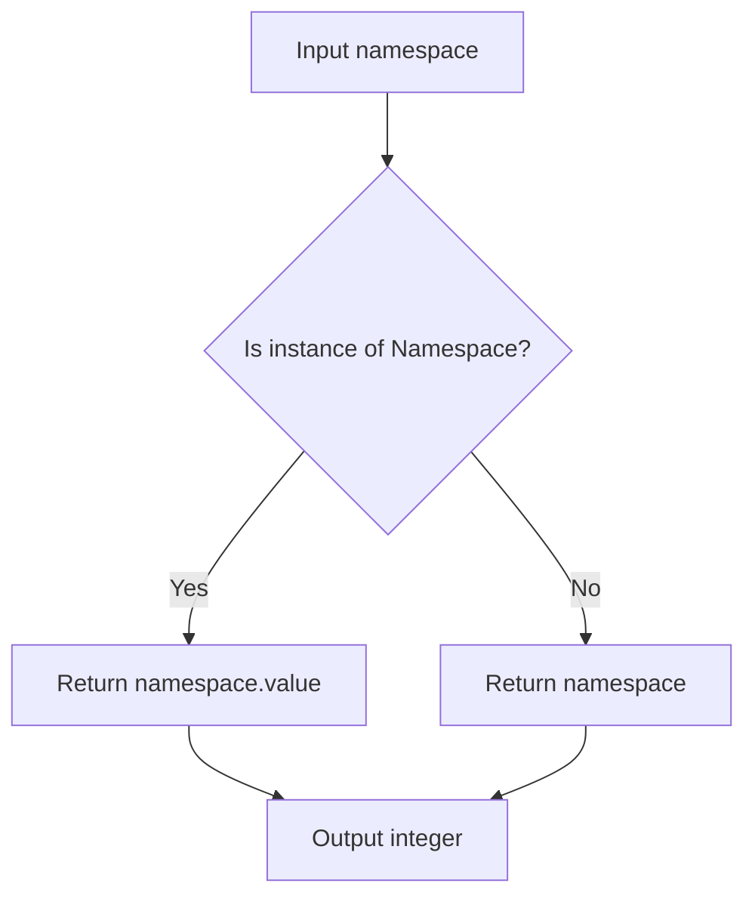
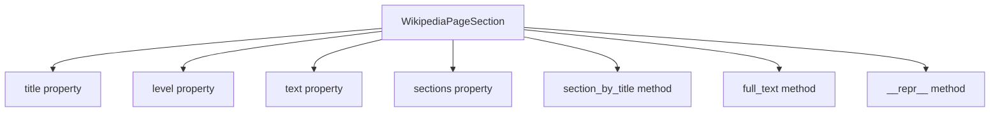

```mermaid
graph TD
    A[Namespace] --> B[MAIN=0]
    A --> C[TALK=1]
    A --> D[USER=2]
    A --> E[USER_TALK=3]
    A --> F[WIKIPEDIA=4]
    A --> G[WIKIPEDIA_TALK=5]
    A --> H[FILE=6]
    A --> I[FILE_TALK=7]
    A --> J[MEDIAWIKI=8]
    A --> K[MEDIAWIKI_TALK=9]
    A --> L[TEMPLATE=10]
    A --> M[TEMPLATE_TALK=11]
    A --> N[HELP=12]
    A --> O[HELP_TALK=13]
    A --> P[CATEGORY=14]
    A --> Q[CATEGORY_TALK=15]
    A --> R[PORTAL=100]
    A --> S[PORTAL_TALK=101]
    A --> T[PROJECT=102]
    A --> U[PROJECT_TALK=103]
    A --> V[REFERENCE=104]
    A --> W[REFERENCE_TALK=105]
    A --> X[BOOK=108]
    A --> Y[BOOK_TALK=109]
    A --> Z[DRAFT=118]
    A --> AA[DRAFT_TALK=119]
    A --> AB[EDUCATION_PROGRAM=446]
    A --> AC[EDUCATION_PROGRAM_TALK=447]
    A --> AD[TIMED_TEXT=710]
    A --> AE[TIMED_TEXT_TALK=711]
    A --> AF[MODULE=828]
    A --> AG[MODULE_TALK=829]
    A --> AH[GADGET=2300]
    A --> AI[GADGET_TALK=2301]
    A --> AJ[GADGET_DEFINITION=2302]
    A --> AK[GADGET_DEFINITION_TALK=2303]
```

```mermaid
graph TD
    A[Wikipedia] --> B[page]
    A --> C[article]
    A --> D[extracts]
    A --> E[info]
    A --> F[langlinks]
    A --> G[links]
    A --> H[backlinks]
    A --> I[categories]
    A --> J[categorymembers]
    A --> K[_query]
    A --> L[_build_extracts]
    A --> M[_build_info]
    A --> N[_build_langlinks]
    A --> O[_build_links]
    A --> P[_build_backlinks]
    A --> Q[_build_categories]
    A --> R[_build_categorymembers]
    A --> S[_common_attributes]
    A --> T[_create_section]
```

```mermaid
graph TD
    A[WikipediaPage] --> B[summary property]
    A --> C[sections property]
    A --> D[section_by_title method]
    A --> E[sections_by_title method]
    A --> F[text property]
    A --> G[langlinks property]
    A --> H[links property]
    A --> I[backlinks property]
    A --> J[categories property]
    A --> K[categorymembers property]
    A --> L[exists method]
    A --> M[language property]
    A --> N[title property]
    A --> O[namespace property]
    A --> P[__getattr__ method]
    A --> Q[_fetch method]
    A --> R[__repr__ method]
```

# `__init__.py`

## `wikipediaapi.__init__.ExtractFormat` · *class*

## Summary:
Represents available extraction formats for Wikipedia content processing.

## Description:
An enumeration that defines the supported formats for extracting content from Wikipedia articles. This class allows clients to specify whether they want to extract content in wiki markup format or HTML format, enabling different processing pipelines for each format type.

## State:
- WIKI: Integer value 1, enables recognition of subsections in wiki markup format
- HTML: Integer value 2, enables retrieval of HTML tags in HTML format

## Lifecycle:
- Creation: Instantiated automatically as part of the enum definition
- Usage: Used as a parameter in functions that require format specification
- Destruction: Managed by Python's garbage collection

## Method Map:


## Raises:
No exceptions are raised during initialization as this is a simple enum class.

## Example:
```python
from wikipediaapi import ExtractFormat

# Specify extraction format when making API calls
format_type = ExtractFormat.WIKI
print(format_type)  # Output: ExtractFormat.WIKI
print(int(format_type))  # Output: 1

# Compare with HTML format
html_format = ExtractFormat.HTML
print(html_format == ExtractFormat.HTML)  # Output: True
```

## `wikipediaapi.__init__.Namespace` · *class*

## Summary:
Represents Wikipedia namespace identifiers as integer-enumerated constants.

## Description:
The Namespace class provides a standardized way to reference Wikipedia namespaces throughout the wikipediaapi library. It defines constants for all major Wikipedia namespaces and their talk pages, enabling type-safe and readable code when working with page namespaces. This class serves as a centralized enumeration of valid namespace IDs that correspond to Wikipedia's namespace system.

## State:
- Inherits from IntEnum, providing integer values for each namespace constant
- Each namespace constant maps to a specific integer ID according to Wikipedia's namespace system
- Constants are defined in pairs (namespace and talk namespace) for consistency
- All values are positive integers representing valid Wikipedia namespace IDs

## Lifecycle:
- Creation: Instantiated automatically when importing the wikipediaapi module
- Usage: Used as a static enumeration; no instance methods or state changes occur
- Destruction: Managed by Python's garbage collection

## Method Map:


## Raises:
- No exceptions are raised during initialization as this is a simple enumeration class
- All namespace constants are predefined and immutable

## Example:
```python
from wikipediaapi import Namespace

# Access namespace constants
print(Namespace.MAIN)        # Returns 0
print(Namespace.USER)        # Returns 2
print(Namespace.TEMPLATE_TALK)  # Returns 11

# Use in comparisons
if page.namespace == Namespace.MAIN:
    print("This is a main article")

# Iterate over all namespaces
for ns in Namespace:
    print(f"{ns.name}: {ns.value}")
```

## `wikipediaapi.__init__.namespace2int` · *function*

## Summary:
Converts a namespace object or integer into its corresponding integer representation.

## Description:
This function normalizes namespace inputs by converting Namespace enum instances to their integer values, while passing through integer inputs unchanged. It provides a consistent interface for handling namespace identifiers regardless of their input type.

## Args:
    namespace (WikiNamespace): A namespace value that can be either a Namespace enum instance or an integer representing a namespace ID.

## Returns:
    int: The integer representation of the namespace. If the input is already an integer, it is returned as-is. If the input is a Namespace enum instance, its .value attribute is returned.

## Raises:
    None explicitly raised by this function.

## Constraints:
    Preconditions:
    - Input must be either a Namespace enum instance or an integer
    - When input is a Namespace enum instance, it must have a .value attribute that is an integer
    
    Postconditions:
    - The returned value is always an integer
    - The returned integer corresponds to the namespace identifier

## Side Effects:
    None

## Control Flow:


## Examples:
    # Converting a Namespace enum instance
    ns = Namespace.MAIN
    result = namespace2int(ns)  # Returns 0
    
    # Converting an integer namespace
    result = namespace2int(1)   # Returns 1

## `wikipediaapi.__init__.Wikipedia` · *class*

## Summary:
Wikipedia is a wrapper class for interacting with the Wikipedia API, providing methods to fetch and parse various types of Wikipedia page information.

## Description:
The Wikipedia class serves as the primary interface for accessing Wikipedia content through the MediaWiki API. It manages HTTP sessions, handles API requests, and provides methods to retrieve different aspects of Wikipedia pages such as extracts, page information, language links, links, backlinks, categories, and category members. The class is designed to work with WikipediaPage objects, which provide lazy-loaded access to specific page data.

This class enforces a clean separation between API interaction and data representation by encapsulating HTTP session management, API parameter handling, and response parsing within a single cohesive interface. It follows the principle of lazy loading where data is only fetched from the API when explicitly requested by the user.

## State:
- language: str, the language code for Wikipedia (e.g., "en", "fr") that determines which Wikipedia instance to query
- extract_format: ExtractFormat enum value indicating whether to extract content in wiki markup or HTML format
- _session: requests.Session object used for making HTTP requests to the Wikipedia API
- _request_kwargs: dict of additional keyword arguments passed to HTTP requests (e.g., timeout, proxies)

## Lifecycle:
- Creation: Instantiate with user_agent string and optional language, extract_format, and header parameters
- Usage: Call methods like page(), extracts(), info(), links(), etc. to retrieve page data
- Destruction: Automatically closes HTTP session via __del__ method when object is garbage collected

## Method Map:


## Raises:
- AssertionError: Raised during initialization if user_agent is missing or too short, or if language is unspecified
- requests.exceptions.RequestException: Propagated from HTTP requests when API calls fail

## Example:
```python
import wikipediaapi

# Create a Wikipedia instance
wiki = wikipediaapi.Wikipedia('MyApp/1.0', language='en')

# Create a page object
page = wiki.page('Python_(programming_language)')

# Retrieve page information
print(page.title)  # "Python (programming language)"

# Get page summary
summary = wiki.extracts(page, exsentences=2)
print(summary)

# Get links from the page
links = page.links
for title, link_page in links.items():
    print(f"Link: {title}")
```

### `wikipediaapi.__init__.Wikipedia.__init__` · *method*

## Summary:
Initializes a Wikipedia client object with configuration for API requests and validates required parameters.

## Description:
Constructs a Wikipedia object that manages session configuration and request parameters for accessing Wikipedia content. This method validates required parameters according to Wikipedia's User-Agent policy and sets up the HTTP session with appropriate headers for making requests to Wikipedia's API endpoints.

## Args:
    user_agent (str): HTTP User-Agent string required by Wikipedia's terms of service. Must be longer than 5 characters and non-empty.
    language (str, optional): Language code for the Wikipedia instance. Defaults to "en". Must be non-empty after stripping whitespace.
    extract_format (ExtractFormat, optional): Format specification for content extraction. Defaults to ExtractFormat.WIKI.
    headers (Dict[str, Any], optional): Additional HTTP headers to include in requests. Defaults to None.
    **kwargs: Additional keyword arguments passed to the underlying requests library, such as proxy configurations.

## Returns:
    None: This method initializes instance attributes and does not return a value.

## Raises:
    AssertionError: When user_agent is not provided or shorter than 6 characters, or when language is empty/invalid after stripping.

## State Changes:
    Attributes READ: None
    Attributes WRITTEN: 
        - self.language: Set to stripped and lowercased language parameter
        - self.extract_format: Set to the provided extract_format parameter
        - self._session: Initialized as requests.Session() with configured headers
        - self._request_kwargs: Set to the processed kwargs including default timeout

## Constraints:
    Preconditions:
        - user_agent must be a non-empty string with length > 5 characters
        - language must be a non-empty string after stripping whitespace
    Postconditions:
        - self.language is set to lowercase, stripped version of the input
        - self._session is initialized with proper headers including the User-Agent
        - self._request_kwargs contains timeout (default 10.0) and any additional kwargs
        - User-Agent header is properly formatted with the library's USER_AGENT constant

## Side Effects:
    - Creates a new requests.Session() object for making HTTP requests
    - Logs initialization information at INFO level with language, user_agent, and extract_format
    - Modifies default_headers dictionary by appending the library's USER_AGENT constant to the User-Agent header

### `wikipediaapi.__init__.Wikipedia.__del__` · *method*

## Summary:
Closes the HTTP session when the Wikipedia object is being destroyed.

## Description:
This destructor method ensures proper cleanup of the underlying HTTP session by closing it when the Wikipedia object is garbage collected. It's automatically called by Python's garbage collector when the object goes out of scope or is explicitly deleted.

## Args:
    None: This method takes no parameters beyond the implicit self reference.

## Returns:
    None: This method performs cleanup operations and returns nothing.

## Raises:
    None: This method does not raise any exceptions under normal circumstances.

## State Changes:
    Attributes READ: 
        - self._session: Checked for existence and truthiness before closing
    Attributes WRITTEN: 
        - None: This method only reads and closes the session, doesn't modify any attributes

## Constraints:
    Preconditions:
        - The Wikipedia object must have been initialized (i.e., have a _session attribute)
    Postconditions:
        - The HTTP session is closed and resources are released
        - The _session attribute remains accessible but is no longer usable for requests

## Side Effects:
    - Closes the underlying requests.Session object, releasing associated network resources
    - May trigger network I/O if the session had pending connections

### `wikipediaapi.__init__.Wikipedia.page` · *method*

## Summary:
Creates and returns a WikipediaPage object for the specified title with optional namespace and URL decoding.

## Description:
The `page` method is the primary entry point for accessing Wikipedia content through the wikipediaapi library. It constructs a WikipediaPage object that serves as the foundation for retrieving page metadata, content sections, links, and other information. This method enables developers to begin working with a specific Wikipedia article by creating a page object bound to the current Wikipedia instance.

The method supports URL decoding of titles when the `unquote` parameter is set to True, making it easier to work with encoded URLs from web applications. It also allows specifying the namespace for the page, which is useful for accessing talk pages, user pages, and other special namespaces.

## Args:
- title (str): The page title as used in Wikipedia URLs, which can be either plain text or URL-encoded
- ns (WikiNamespace, optional): The namespace identifier for the page. Defaults to Namespace.MAIN (0)
- unquote (bool, optional): If True, applies URL decoding to the title parameter. Defaults to False

## Returns:
- WikipediaPage: An object representing the requested Wikipedia page, bound to the current Wikipedia instance

## Raises:
- No explicit exceptions are raised by this method itself, though underlying operations may raise exceptions from the Wikipedia API or network layer

## State Changes:
- Attributes READ: self.language (accessed to pass to WikipediaPage constructor)
- Attributes WRITTEN: None (this method doesn't modify Wikipedia instance state)

## Constraints:
- Preconditions: The Wikipedia instance must be properly initialized with a valid language and user agent
- Postconditions: Returns a valid WikipediaPage object with the specified title, namespace, and language settings

## Side Effects:
- None directly caused by this method
- The returned WikipediaPage object may trigger network requests when its properties are accessed (lazy loading behavior)
- May perform URL decoding operation if unquote=True (using urllib.parse.unquote)

### `wikipediaapi.__init__.Wikipedia.article` · *method*

## Summary:
Constructs a Wikipedia page object with the specified title, namespace, and unquoting behavior.

## Description:
Creates and returns a WikipediaPage object representing a Wikipedia article. This method serves as an alias for the `page` method, providing an alternative way to instantiate WikipediaPage objects. The returned object can be used to access various page properties and content through lazy-loaded API calls.

This method is particularly useful when users prefer a more descriptive naming convention for creating page objects, as "article" better reflects the conceptual nature of Wikipedia content compared to the more generic "page" terminology.

## Args:
    title (str): The title of the Wikipedia page as used in Wikipedia URLs
    ns (WikiNamespace, optional): The Wikipedia namespace identifier. Defaults to Namespace.MAIN (0)
    unquote (bool, optional): If True, applies URL unquoting to the title before processing. Defaults to False

## Returns:
    WikipediaPage: An object representing the requested Wikipedia page with lazy-loaded content access

## Raises:
    None explicitly raised by this method - any exceptions are propagated from the underlying `page` method implementation

## State Changes:
    Attributes READ: None
    Attributes WRITTEN: None

## Constraints:
    Preconditions:
    - The title parameter must be a valid string representing a Wikipedia page title
    - The ns parameter must be a valid WikiNamespace enum value
    - The unquote parameter must be a boolean value
    
    Postconditions:
    - Returns a properly initialized WikipediaPage object bound to the current Wikipedia instance
    - The returned object maintains a reference to the parent Wikipedia instance for API interactions

## Side Effects:
    None - This method performs no I/O operations or external service calls itself
    The actual Wikipedia API calls occur lazily when accessing properties of the returned WikipediaPage object

### `wikipediaapi.__init__.Wikipedia.extracts` · *method*

## Summary:
Returns a formatted summary of a Wikipedia page based on extraction parameters, handling different content formats and building section hierarchy.

## Description:
The extracts method retrieves and processes Wikipedia page content using the MediaWiki API's extracts module. It constructs API parameters based on the Wikipedia instance's extraction format setting and combines them with user-provided parameters. The method handles both HTML and wiki markup formats differently, then processes the raw API response to build a structured representation of the page content including summary text and hierarchical sections.

This method is designed to be called by users who want to retrieve a summary of a Wikipedia page with customizable extraction parameters such as sentence count or section limits. It's typically invoked through the Wikipedia class instance rather than directly.

## Args:
    page (WikipediaPage): The Wikipedia page object to extract content from
    **kwargs: Additional API parameters to pass to the MediaWiki API (e.g., exsentences, exintro, etc.)

## Returns:
    str: The extracted summary text of the page. Returns empty string if the page doesn't exist (when pageid is -1) or if no content is available.

## Raises:
    None: This method does not explicitly raise exceptions, though underlying API calls may raise requests exceptions

## State Changes:
    Attributes READ: 
        - self.extract_format: Determines how content is formatted for extraction
        - page.title: Used to identify the page in API requests
    Attributes WRITTEN: 
        - page._attributes: Populated with common page metadata from API response
        - page._summary: Set to the extracted summary text
        - page._section_mapping: Built with section information from the extract

## Constraints:
    Preconditions:
        - The Wikipedia instance must be properly initialized with a valid user agent
        - The page parameter must be a valid WikipediaPage object
        - The page must have a valid title attribute
    Postconditions:
        - The page object will have its _summary and _section_mapping attributes populated
        - The page's _attributes dictionary will contain metadata from the API response
        - If the page doesn't exist (indicated by pageid = -1), an empty string is returned and pageid is set to -1

## Side Effects:
    - Makes HTTP GET requests to Wikimedia API endpoints
    - Logs API request URLs for debugging purposes
    - Modifies the page object's internal state through attribute assignments
    - May trigger network I/O operations and external service calls

### `wikipediaapi.__init__.Wikipedia.info` · *method*

## Summary:
Retrieves comprehensive metadata and information about a Wikipedia page from the MediaWiki API.

## Description:
Fetches detailed information about a Wikipedia page including metadata such as protection status, talk page ID, watch status, URL, readability, and display title. This method populates the WikipediaPage object with rich metadata that provides insights into the page's properties and status within Wikipedia.

Known callers:
- Direct API usage: Called by the Wikipedia class when retrieving page information via the 'info' API property
- Lifecycle stage: Part of the page information retrieval pipeline, typically called during initialization or when explicit page metadata is needed

This method exists separately from inline processing to provide a standardized way to fetch and populate page metadata from the MediaWiki API, following the same pattern as other API call handlers like `extracts`, `langlinks`, `links`, etc. It leverages the existing `_query` method for API communication and `_build_info` for processing the response.

## Args:
    page (WikipediaPage): The Wikipedia page object for which to retrieve information. Must be a valid WikipediaPage instance with a title attribute.

## Returns:
    WikipediaPage: The same page object with updated metadata attributes, enabling method chaining. The page's `_attributes` dictionary will be populated with API response data including page ID, protection status, talk page ID, watch status, watchers count, notification timestamp, subject ID, URL, readability status, preload information, and display title.

## Raises:
    requests.exceptions.RequestException: If the HTTP request to the Wikimedia API fails due to network issues, timeouts, or invalid responses.
    KeyError: If the API response doesn't contain expected keys (though this would be rare with valid API responses).

## State Changes:
    Attributes READ: 
        - page.title: Used to construct the API query
    Attributes WRITTEN: 
        - page._attributes: Populated with metadata from the API response including pageid, protection, talkid, watched, watchers, visitingwatchers, notificationtimestamp, subjectid, url, readable, preload, displaytitle, and other common attributes

## Constraints:
    Preconditions:
        - The `page` parameter must be a valid WikipediaPage object with a valid title attribute
        - The Wikipedia instance must have a valid session established (which happens in __init__)
        - The Wikipedia instance must have a valid language attribute set
    Postconditions:
        - The page object's `_attributes` dictionary will contain metadata from the API response
        - If the page doesn't exist (API returns -1 as key), pageid will be set to -1
        - The returned page object is identical to the input page object (same reference)

## Side Effects:
    - Makes an HTTP GET request to Wikimedia API endpoints
    - Logs the constructed request URL at INFO level for debugging purposes
    - May trigger network I/O operations and external service calls
    - Modifies the internal state of the WikipediaPage object by updating its `_attributes` dictionary

### `wikipediaapi.__init__.Wikipedia.langlinks` · *method*

## Summary:
Retrieves language links for a Wikipedia page, returning links to the same page in different languages.

## Description:
Fetches translations and alternative language versions of a Wikipedia page from the Wikimedia API. This method constructs the appropriate API parameters for querying language links, makes the API request, processes the response, and builds a dictionary mapping language codes to corresponding WikipediaPage objects for each translated version.

The method follows a consistent pattern with other Wikipedia API methods in the class, making it easy to integrate with the lazy-loading architecture of WikipediaPage objects.

## Args:
    page (WikipediaPage): The Wikipedia page object for which to retrieve language links
    **kwargs: Additional API parameters to customize the language links query (e.g., lllimit for result limit)

## Returns:
    PagesDict: Dictionary mapping language codes to WikipediaPage instances representing the page in different languages. Returns empty dict if page doesn't exist or has no language links.

## Raises:
    requests.exceptions.RequestException: If the HTTP request to Wikimedia API fails due to network issues, timeouts, or invalid responses
    KeyError: If the API response structure is unexpected or missing required keys
    AttributeError: If the page object lacks expected attributes

## State Changes:
    Attributes READ: 
        - page.title: Used to construct the API query
        - page.language: Used to construct the API endpoint URL
    Attributes WRITTEN: 
        - page._langlinks: Populated with language link pages
        - page._attributes: Updated with common page metadata from API response

## Constraints:
    Preconditions:
        - The `page` parameter must be a valid WikipediaPage object with a valid title and language attribute
        - The Wikipedia instance must have a valid session established
        - The Wikipedia instance must have a valid language setting
    Postconditions:
        - The page's `_langlinks` attribute will be populated with language link pages
        - The page's `_attributes` dictionary will contain common page metadata from the API response
        - If the page doesn't exist (API returns -1), the page's `pageid` attribute will be set to -1

## Side Effects:
    - Makes an HTTP GET request to Wikimedia API endpoints
    - Logs the constructed request URL at INFO level for debugging purposes
    - May trigger network I/O operations and external service calls
    - Modifies the internal state of the WikipediaPage object by populating `_langlinks` and `_attributes`

### `wikipediaapi.__init__.Wikipedia.links` · *method*

## Summary:
Retrieves links to other Wikipedia pages from a specified page using the MediaWiki API, handling pagination for large result sets.

## Description:
Fetches all links from a given Wikipedia page by making API calls to the MediaWiki endpoint. This method implements pagination handling for cases where the number of links exceeds the API limit of 500 links per request. It processes the raw API response to build a dictionary of linked Wikipedia pages.

The method is part of the Wikipedia class and is typically called through the WikipediaPage.links property, which internally invokes this method to fetch link data from the Wikipedia API. It handles special cases such as non-existent pages (returning empty dict) and implements continuation for large result sets.

## Args:
    page (WikipediaPage): The Wikipedia page object from which to retrieve links
    **kwargs: Additional parameters to pass to the MediaWiki API query (e.g., plfilterredir, plnamespace)

## Returns:
    PagesDict: Dictionary mapping link titles to WikipediaPage objects, or empty dict if:
        - Page doesn't exist (indicated by pageid = -1)
        - No links found
        - API error occurred

## Raises:
    None explicitly documented - may raise exceptions from underlying API calls (network errors, invalid responses, etc.)

## State Changes:
    Attributes READ: 
        - page.title (to construct API query)
    Attributes WRITTEN:
        - page._links (populated with retrieved links)
        - page._attributes (updated with common page attributes including pageid)

## Constraints:
    Preconditions:
        - The Wikipedia instance must be properly initialized with valid credentials
        - The page parameter must be a valid WikipediaPage object
        - The page.title must be a valid Wikipedia page title
    Postconditions:
        - The page._links attribute will be populated with linked Wikipedia pages
        - The page._attributes will contain common page metadata from the API response
        - If page doesn't exist, page._attributes["pageid"] will be set to -1

## Side Effects:
    - Makes HTTP requests to the Wikipedia API
    - Modifies the page object's internal state by populating _links and _attributes
    - Logs API request URLs for debugging purposes

### `wikipediaapi.__init__.Wikipedia.backlinks` · *method*

## Summary:
Retrieves backlinks from other Wikipedia pages that link to the specified page.

## Description:
This method fetches all backlinks (pages that link to the given page) from Wikipedia using the MediaWiki API. It automatically handles pagination when there are more than 500 backlinks by making multiple API calls. The method uses the MediaWiki API endpoints:
- https://www.mediawiki.org/w/api.php?action=help&modules=query%2Bbacklinks
- https://www.mediawiki.org/wiki/API:Backlinks

## Args:
    page (WikipediaPage): The Wikipedia page for which to retrieve backlinks
    **kwargs: Additional parameters to pass to the MediaWiki API query (e.g., blfilterredir, blnamespace)

## Returns:
    PagesDict: A dictionary-like object containing the backlinked pages, with each entry representing a page that links to the specified page

## Raises:
    None explicitly documented in source code

## State Changes:
    Attributes READ: None
    Attributes WRITTEN: None

## Constraints:
    Preconditions: The page parameter must be a valid WikipediaPage object with a title attribute
    Postconditions: Returns a PagesDict containing all backlinks to the specified page, with pagination handled automatically

## Side Effects:
    I/O: Makes HTTP requests to the Wikipedia API
    External service calls: Communicates with MediaWiki API endpoints

### `wikipediaapi.__init__.Wikipedia.categories` · *method*

*No documentation generated.*

### `wikipediaapi.__init__.Wikipedia.categorymembers` · *method*

## Summary:
Retrieves all pages belonging to a given Wikipedia category, handling pagination automatically.

## Description:
This method queries the MediaWiki API to fetch all pages that belong to a specified category. It handles large categories by automatically following continuation tokens to retrieve all results. The method is designed to work with a WikipediaPage object representing a category page.

## Args:
    page (WikipediaPage): The WikipediaPage object representing the category whose members are to be retrieved
    **kwargs: Additional API parameters that can be passed to customize the query (e.g., sorting, filtering options)

## Returns:
    PagesDict: A dictionary mapping page titles to WikipediaPage objects representing the category members

## Raises:
    None explicitly documented - relies on underlying API calls and internal helper methods

## State Changes:
    Attributes READ: None directly read from self
    Attributes WRITTEN: Modifies page._categorymembers attribute through _build_categorymembers helper

## Constraints:
    Preconditions: 
    - The page parameter must represent a valid Wikipedia category page
    - The Wikipedia instance must be properly initialized with valid credentials
    
    Postconditions:
    - The returned PagesDict contains all category members
    - The page object's _categorymembers attribute is populated with the results

## Side Effects:
    - Makes HTTP requests to Wikimedia API endpoints
    - May perform multiple API calls for large categories due to pagination
    - Logs API request URLs for debugging purposes

### `wikipediaapi.__init__.Wikipedia._query` · *method*

## Summary:
Queries the Wikimedia API to fetch content for a specific Wikipedia page.

## Description:
This private method handles the core HTTP communication with the Wikimedia API. It constructs the appropriate API endpoint URL using the page's language, logs the request URL for debugging purposes, sets standard API parameters (format=json and redirects=1), and executes the HTTP GET request using the session object. The method is called internally by various public methods like `extracts`, `info`, `langlinks`, `links`, `backlinks`, `categories`, and `categorymembers` to fetch data from Wikipedia.

## Args:
    page (WikipediaPage): The Wikipedia page object containing language and title information used to construct the API endpoint URL.
    params (Dict[str, Any]): Dictionary of API parameters to be sent with the request.

## Returns:
    dict: JSON response from the Wikimedia API parsed as a Python dictionary.

## Raises:
    requests.exceptions.RequestException: If the HTTP request fails due to network issues, timeouts, or invalid responses.
    KeyError: If the API response doesn't contain expected keys (though this would be rare with valid API responses).

## State Changes:
    Attributes READ: 
        - self._session: Used to execute the HTTP GET request
        - self._request_kwargs: Additional keyword arguments passed to the HTTP request
        - page.language: Used to construct the base URL
    Attributes WRITTEN: None

## Constraints:
    Preconditions:
        - The `page` parameter must be a valid WikipediaPage object with a valid language attribute
        - The `params` dictionary should contain valid Wikimedia API parameters
        - The Wikipedia instance must have a valid session established (which happens in __init__)
    Postconditions:
        - The returned dictionary contains the parsed JSON response from the Wikimedia API
        - The HTTP request is executed with proper formatting and redirect handling

## Side Effects:
    - Makes an HTTP GET request to Wikimedia API endpoints
    - Logs the constructed request URL at INFO level for debugging purposes
    - May trigger network I/O operations and external service calls

### `wikipediaapi.__init__.Wikipedia._build_extracts` · *method*

*No documentation generated.*

### `wikipediaapi.__init__.Wikipedia._create_section` · *method*

*No documentation generated.*

### `wikipediaapi.__init__.Wikipedia._build_info` · *method*

## Summary:
Populates a WikipediaPage object with metadata from API query results.

## Description:
Processes API response data to populate page attributes. This method serves as a standardized way to build page objects from Wikipedia API responses, ensuring consistent attribute assignment regardless of the specific API call type.

The method first applies common attribute handling via `_common_attributes`, then copies all remaining key-value pairs from the API extract data into the page's internal attributes dictionary. This approach allows for flexible handling of different API response formats while maintaining consistency in page object construction.

Known callers:
- `Wikipedia.info()` - Called during page information retrieval operations to populate page metadata from the 'info' API property

This method exists separately from inline processing to provide a reusable pattern for building page objects from API responses, reducing code duplication across different API call handlers like `_build_extracts`, `_build_langlinks`, etc.

## Args:
    extract (dict): Dictionary containing API response data for a single page
    page (WikipediaPage): Page object to populate with API data

## Returns:
    WikipediaPage: The same page object with updated attributes, enabling method chaining

## Raises:
    None explicitly raised - delegates to underlying API handling mechanisms

## State Changes:
    Attributes READ: None
    Attributes WRITTEN: 
    - page._attributes: All key-value pairs from extract dictionary are copied to this dictionary

## Constraints:
    Preconditions:
    - extract must be a dictionary containing API response data
    - page must be a valid WikipediaPage instance
    - page._attributes must be a dictionary-like object supporting item assignment
    
    Postconditions:
    - All keys from extract are present in page._attributes
    - Common attributes are handled by _common_attributes method
    - The returned page object is identical to the input page object (same reference)

## Side Effects:
    None - Pure transformation of page attributes

### `wikipediaapi.__init__.Wikipedia._build_langlinks` · *method*

## Summary:
Builds language link references for a Wikipedia page from API extract data and populates common attributes.

## Description:
Constructs a dictionary of language links for a Wikipedia page by processing the language links section from the API response. This method populates the page's `_langlinks` attribute with translated versions of the page in different languages, and also applies common page attributes from the API extract.

## Args:
    self: The Wikipedia instance containing configuration and methods
    extract (dict): Raw API response data containing language link information
    page: WikipediaPage instance being populated with language links

## Returns:
    PagesDict: Dictionary mapping language codes to WikipediaPage instances for each language link

## Raises:
    KeyError: When language link data is malformed and lacks required keys like "lang" or "*"
    AttributeError: When page object doesn't have expected attributes

## State Changes:
    Attributes READ: None
    Attributes WRITTEN: page._langlinks

## Constraints:
    Preconditions: 
    - extract must be a dictionary containing language link data
    - page must be a valid WikipediaPage instance
    - extract.get("langlinks", []) must return a list of language link dictionaries
    
    Postconditions:
    - page._langlinks will be populated with language link pages
    - Each language link will be a WikipediaPage instance with proper language metadata
    - Common page attributes will be set via self._common_attributes call

## Side Effects:
    None

### `wikipediaapi.__init__.Wikipedia._build_links` · *method*

## Summary:
Builds and populates the links cache for a Wikipedia page from API extract data.

## Description:
Processes API response extract data to construct WikipediaPage objects for each linked page and stores them in the page's internal links cache. This method is called internally by the Wikipedia class when fetching links from the Wikipedia API.

## Args:
    self: Wikipedia instance, the parent Wikipedia client object
    extract: dict, API response extract containing link data from the Wikipedia API
    page: WikipediaPage, the page object whose links are being built

## Returns:
    PagesDict: Dictionary mapping linked page titles to WikipediaPage objects

## Raises:
    None explicitly raised, but may propagate exceptions from underlying API calls or WikipediaPage construction

## State Changes:
    Attributes READ: 
        - self._common_attributes: Called to set common page attributes
        
    Attributes WRITTEN:
        - page._links: Populated with linked WikipediaPage objects
        - page._attributes: Updated with common attributes from extract

## Constraints:
    Preconditions:
        - The extract parameter must contain valid API response data with a "links" key
        - The page parameter must be a valid WikipediaPage instance
        - The page.language attribute must be properly set
        
    Postconditions:
        - The page._links attribute is populated with WikipediaPage objects for each link
        - Common page attributes are set on the page using _common_attributes
        - The returned PagesDict contains all linked pages mapped by title

## Side Effects:
    - Creates new WikipediaPage instances for each linked page
    - Modifies the page's internal _links cache
    - Sets common page attributes on the page object

### `wikipediaapi.__init__.Wikipedia._build_backlinks` · *method*

## Summary:
Initializes and populates the backlinks attribute of a Wikipedia page with data from an API extract response.

## Description:
This method processes the backlinks data returned by the Wikipedia API and constructs WikipediaPage objects for each backlink. It populates the page's `_backlinks` attribute with a dictionary mapping backlink titles to their corresponding WikipediaPage instances. The method leverages the `_common_attributes` helper to ensure consistent attribute population across different page data types.

This method is part of the lazy-loading infrastructure for Wikipedia page data, specifically handling the backlinks property. It's called internally when accessing the `backlinks` property of a WikipediaPage object.

## Args:
    self: Wikipedia instance, the parent Wikipedia object that owns this method
    extract: dict, API response extract containing backlink data under the "backlinks" key
    page: WikipediaPage, the page object whose backlinks are being built

## Returns:
    PagesDict, a dictionary mapping backlink titles to WikipediaPage instances

## Raises:
    None explicitly raised, though underlying operations may raise exceptions from:
    - WikipediaPage constructor
    - _common_attributes method
    - Dictionary operations

## State Changes:
    Attributes READ: 
    - self._common_attributes (method call)
    - extract.get("backlinks", []) (accessing extract data)
    - page.language (accessing page attribute)
    
    Attributes WRITTEN:
    - page._backlinks (populated with backlink data)

## Constraints:
    Preconditions:
    - extract must be a dictionary that may contain a "backlinks" key
    - page must be a valid WikipediaPage instance
    - page.language must be accessible
    
    Postconditions:
    - page._backlinks is initialized as an empty dictionary
    - page._backlinks contains entries for each backlink in the extract
    - Each backlink entry maps to a valid WikipediaPage instance
    - Common attributes from the extract are populated on the page object

## Side Effects:
    None directly, but indirectly causes:
    - WikipediaPage object construction for each backlink
    - Potential caching of backlink data in the page object

### `wikipediaapi.__init__.Wikipedia._build_categories` · *method*

## Summary:
Populates a Wikipedia page's category information by processing API response data and creating category page objects.

## Description:
This private method processes the categories section from a Wikipedia API extract and constructs corresponding WikipediaPage objects for each category. It initializes the page's category collection, applies common page attributes from the API response, and builds a dictionary mapping category titles to their respective WikipediaPage instances.

The method is typically called during the page initialization process when API data is being parsed and converted into structured page objects. It serves as part of the data parsing pipeline that transforms raw API responses into usable WikipediaPage objects with proper category associations.

## Args:
    self: The Wikipedia instance
    extract (dict): Raw API response data containing page information including categories
    page (WikipediaPage): The WikipediaPage object being constructed with category information

## Returns:
    PagesDict: Dictionary mapping category titles to WikipediaPage objects representing the categories. This is equivalent to `page._categories` after processing.

## Raises:
    None explicitly documented

## State Changes:
    Attributes READ: None
    Attributes WRITTEN: 
        - page._categories: Populated with category WikipediaPage objects
        - page._attributes: Updated with common attributes via _common_attributes call

## Constraints:
    Preconditions:
        - extract parameter must be a dictionary that may contain a "categories" key
        - page parameter must be a valid WikipediaPage instance
        - page.language must be properly initialized
    
    Postconditions:
        - page._categories will contain a dictionary of category WikipediaPage objects
        - page._attributes will contain common page metadata from the extract

## Side Effects:
    None directly observable

### `wikipediaapi.__init__.Wikipedia._build_categorymembers` · *method*

## Summary:
Builds and populates the category members dictionary for a Wikipedia page by processing API response data.

## Description:
This method processes the API response from a categorymembers query and constructs WikipediaPage objects for each member in the category. It populates the page's `_categorymembers` attribute with a dictionary mapping member titles to their respective WikipediaPage instances.

The method is called internally by the `categorymembers` method when retrieving category membership information from Wikipedia's API. It handles the parsing of API response data and creates appropriate WikipediaPage objects for each category member.

## Args:
    extract (dict): API response data containing category members information
    page (WikipediaPage): The WikipediaPage object whose category members are being built

## Returns:
    PagesDict: Dictionary mapping member titles to WikipediaPage objects representing category members

## Raises:
    KeyError: When API response data is missing required keys like "title", "ns", or "pageid" in category members
    TypeError: When API response data has unexpected types for required fields

## State Changes:
    Attributes READ: 
        - None
    Attributes WRITTEN:
        - page._categorymembers: Populated with category member data
        - page._attributes: Updated with common attributes via _common_attributes call

## Constraints:
    Preconditions:
        - extract parameter must contain categorymembers data structure
        - page parameter must be a valid WikipediaPage instance
        - extract must contain required keys in each member (title, ns, pageid)
    Postconditions:
        - page._categorymembers is populated with all category members
        - Common attributes from API response are stored in page._attributes
        - Each member in categorymembers is represented as a WikipediaPage instance

## Side Effects:
    - Creates multiple WikipediaPage instances for category members
    - Makes internal calls to _common_attributes method
    - May trigger additional API calls if any of the created WikipediaPage objects are accessed

### `wikipediaapi.__init__.Wikipedia._common_attributes` · *method*

## Summary:
Populates common page attributes from extraction data into the page's attribute dictionary.

## Description:
This helper method transfers commonly used Wikipedia page attributes from the raw extraction data to the page object's internal attribute storage. It selectively copies attributes only when they exist in the extraction data, preventing key errors during attribute assignment.

## Args:
    extract (dict): Dictionary containing raw Wikipedia page extraction data
    page (WikipediaPage): Page object whose _attributes dictionary will be populated

## Returns:
    None: This method modifies the page object in-place and returns nothing

## Raises:
    None: This method does not explicitly raise exceptions

## State Changes:
    Attributes READ: extract (reads attribute names from the extract dictionary)
    Attributes WRITTEN: page._attributes (modifies the page's internal attribute storage)

## Constraints:
    Preconditions: 
    - extract must be a dictionary-like object that supports the 'in' operator
    - page must be a WikipediaPage instance with a _attributes dictionary attribute
    Postconditions:
    - Common attributes (title, pageid, ns, redirects) present in extract will be copied to page._attributes
    - Non-existent attributes in extract will be ignored

## Side Effects:
    None: This method only modifies the internal state of the page object and performs no I/O operations

## `wikipediaapi.__init__.WikipediaPageSection` · *class*

## Summary:
WikipediaPageSection represents a section in a Wikipedia page.

## Description:
This class models a section of a Wikipedia page, storing its title, textual content, indentation level, and nested subsections. It is used internally by the Wikipedia API wrapper to represent sections parsed from Wikipedia content. Instances are typically created during content extraction processes by the Wikipedia class.

## State:
- wiki: Wikipedia instance, reference to the parent Wikipedia object that created this section
- _title: str, the title/header of this section
- _level: int, indentation level of this section (0-based, higher numbers indicate deeper nesting)
- _text: str, the textual content of the current section
- _section: List[WikipediaPageSection], collection of subsections contained within this section

## Lifecycle:
- Creation: Constructed via `WikipediaPageSection(wiki, title, level=0, text="")` with required Wikipedia instance and title parameters
- Usage: Sections are typically accessed through the `sections` property or `section_by_title()` method to navigate the hierarchy
- Destruction: Managed automatically by Python's garbage collector; no explicit cleanup required

## Method Map:


## Raises:
- NotImplementedError: When `full_text()` is called with an unknown ExtractFormat value

## Example:
```python
# Create a section
wiki = Wikipedia('test-user-agent')
section = WikipediaPageSection(wiki, "Introduction", level=0, text="This is the intro.")

# Add subsection
subsection = WikipediaPageSection(wiki, "History", level=1, text="Historical background...")
section.sections.append(subsection)

# Access properties
print(section.title)  # "Introduction"
print(section.level)  # 0
print(section.text)   # "This is the intro."

# Get full text with subsections
full_content = section.full_text()
```

### `wikipediaapi.__init__.WikipediaPageSection.__init__` · *method*

## Summary:
Initializes a WikipediaPageSection object with the specified Wikipedia instance, title, level, and text content.

## Description:
Constructs a WikipediaPageSection instance that represents a section within a Wikipedia page. This constructor is typically called internally by the Wikipedia class when parsing page content to create hierarchical section structures. The method sets up the basic properties of a section including its title, indentation level, content text, and establishes an empty list for containing subsections.

## Args:
    wiki (Wikipedia): Reference to the parent Wikipedia instance that owns this section
    title (str): The title/header text of this section
    level (int): Indentation level of this section (0-based, where 0 indicates top-level section). Defaults to 0
    text (str): The textual content of this section. Defaults to empty string ""

## Returns:
    None: This method initializes the object's state and does not return a value

## Raises:
    None: This method does not explicitly raise exceptions

## State Changes:
    Attributes READ: None
    Attributes WRITTEN: 
    - self.wiki: Set to the provided Wikipedia instance
    - self._title: Set to the provided title string
    - self._level: Set to the provided level integer
    - self._text: Set to the provided text string
    - self._section: Initialized as an empty list to store subsections

## Constraints:
    Preconditions:
    - The wiki parameter must be a valid Wikipedia instance
    - The title parameter must be a string
    - The level parameter must be a non-negative integer
    - The text parameter must be a string
    
    Postconditions:
    - The section object is properly initialized with all attributes set
    - The _section attribute is initialized as an empty list
    - All provided parameters are stored as instance attributes

## Side Effects:
    None: This method performs only local object initialization and has no external side effects

### `wikipediaapi.__init__.WikipediaPageSection.title` · *method*

## Summary:
Returns the title of the current Wikipedia page section.

## Description:
Provides access to the title of the Wikipedia page section, which represents the heading text of that section. This property serves as a clean interface for retrieving section metadata while maintaining encapsulation of the internal `_title` attribute.

The title property is commonly accessed when displaying section information, searching for specific sections by name (via `section_by_title` method), or building formatted representations of page structures (through `__repr__` and `full_text` methods). It's designed as a dedicated accessor to maintain consistency with the object-oriented design pattern of encapsulating internal state.

## Args:
    None

## Returns:
    str: The title text of the current section

## Raises:
    None

## State Changes:
    Attributes READ: self._title
    Attributes WRITTEN: None

## Constraints:
    Preconditions:
    - The WikipediaPageSection instance must be properly initialized
    - The internal `_title` attribute must be set during object construction
    
    Postconditions:
    - Returns the exact string stored in the internal `_title` attribute
    - Does not modify any object state

## Side Effects:
    None

### `wikipediaapi.__init__.WikipediaPageSection.level` · *method*

## Summary:
Returns the hierarchical indentation level of the current Wikipedia page section.

## Description:
This property provides access to the section's nesting level within the article's hierarchical structure. Section levels follow standard Wikipedia heading conventions where level 0 represents the main article title, level 1 represents first-level headings (== Heading ==), level 2 represents second-level headings (=== Heading ===), and so forth.

## Args:
    None

## Returns:
    int: The indentation level of the current section, where 0 indicates the main article title and higher values indicate nested subsections.

## Raises:
    None

## State Changes:
    Attributes READ: self._level
    Attributes WRITTEN: None

## Constraints:
    Preconditions: The WikipediaPageSection object must be properly initialized with a valid level value.
    Postconditions: The returned value is always an integer representing the section's hierarchical position.

## Side Effects:
    None

### `wikipediaapi.__init__.WikipediaPageSection.text` · *method*

## Summary:
Returns the textual content of the current Wikipedia page section.

## Description:
Provides access to the raw text content of a Wikipedia page section. This property serves as a clean interface for retrieving the main textual content of a section while maintaining encapsulation of the underlying data structure.

The `text` property is implemented as a simple getter that returns the private `_text` attribute. This design follows standard Python conventions for property access and ensures that section text can be read without direct attribute access, allowing for future enhancements or validation if needed.

This method is commonly called by higher-level methods such as `full_text()` which aggregates text content from sections and subsections, and by user code that needs to access individual section content for processing or display.

## Args:
    None

## Returns:
    str: The textual content of the current section as a string. Returns an empty string if no text was set during section initialization.

## Raises:
    None

## State Changes:
    Attributes READ: self._text
    Attributes WRITTEN: None

## Constraints:
    Preconditions:
    - The WikipediaPageSection instance must be properly initialized
    - The `_text` attribute should be a string or compatible type
    
    Postconditions:
    - The returned string is immutable and does not affect the internal state of the section
    - The section object remains unchanged after accessing this property

## Side Effects:
    None

### `wikipediaapi.__init__.WikipediaPageSection.sections` · *method*

## Summary:
Returns the list of subsections contained within the current Wikipedia page section.

## Description:
Provides access to all subsections of the current section. This property serves as a read-only interface to the internal _section list that stores child sections. The method is implemented as a property to provide clean, direct access to subsection data without exposing the internal implementation details.

This method is part of the WikipediaPageSection class hierarchy and enables traversal of the hierarchical structure of Wikipedia pages. It allows developers to iterate over or access subsections programmatically, which is essential for processing nested article structures.

## Args:
    None

## Returns:
    List[WikipediaPageSection]: A list of WikipediaPageSection objects representing the immediate subsections of the current section. Returns an empty list if no subsections exist.

## Raises:
    None

## State Changes:
    Attributes READ: self._section
    Attributes WRITTEN: None

## Constraints:
    Preconditions:
    - The WikipediaPageSection instance must be properly initialized
    - The _section attribute must be a list-like object (though it's initialized as a list in __init__)
    
    Postconditions:
    - The returned list is a reference to the internal _section list
    - Modifications to the returned list affect the internal state of the section
    - The method always returns a list, even if empty

## Side Effects:
    None

### `wikipediaapi.__init__.WikipediaPageSection.section_by_title` · *method*

## Summary:
Returns the last subsection with the specified title from the current section.

## Description:
This method searches through all subsections of the current Wikipedia page section to find those matching the given title. It returns the last occurrence of a matching subsection, which is useful when multiple sections might share the same title (common in Wikipedia articles). This method provides a convenient way to access specific subsections without manually iterating through all sections.

The method is designed as a dedicated utility to encapsulate the logic for finding subsections by title, making the code more readable and reusable compared to inline filtering operations.

## Args:
    title (str): The title of the subsection to search for

## Returns:
    Optional[WikipediaPageSection]: The last subsection with the matching title, or None if no subsections match the title

## Raises:
    None explicitly raised

## State Changes:
    Attributes READ: self._section, s.title (where s is each section in self._section)
    Attributes WRITTEN: None

## Constraints:
    Preconditions: 
    - The method assumes self._section contains valid WikipediaPageSection objects
    - Each subsection in self._section must have a title property that can be compared to the input title
    
    Postconditions:
    - The returned subsection (if any) maintains all its original properties
    - The current section object remains unchanged

## Side Effects:
    None

### `wikipediaapi.__init__.WikipediaPageSection.full_text` · *method*

## Summary:
Returns the complete text content of a section including all nested subsections formatted according to the extraction format.

## Description:
This method recursively collects and formats the text content of the current section and all its subsections. It generates appropriate heading markup based on the configured extraction format (WIKI or HTML) and maintains proper hierarchical structure through indentation levels. The method is designed to provide a complete textual representation of a section tree.

## Args:
    level (int): The indentation level to use for formatting headings when in HTML mode. Defaults to 1.

## Returns:
    str: A formatted string containing the section title, text content, and recursively formatted subsections.

## Raises:
    NotImplementedError: When the extract_format attribute of the associated Wikipedia object is not one of the supported ExtractFormat values (WIKI or HTML).

## State Changes:
    Attributes READ: 
    - self.wiki.extract_format
    - self.title
    - self._text
    - self.sections
    
    Attributes WRITTEN: None

## Constraints:
    Preconditions:
    - The WikipediaPageSection instance must have a valid wiki object with a defined extract_format
    - The extract_format should be either ExtractFormat.WIKI or ExtractFormat.HTML
    
    Postconditions:
    - Returns a properly formatted string with section title, text, and subsections
    - Maintains recursive structure of subsections with increasing indentation levels

## Side Effects:
    None

### `wikipediaapi.__init__.WikipediaPageSection.__repr__` · *method*

## Summary:
Returns a string representation of the Wikipedia page section showing its title, level, text content, and nested subsections.

## Description:
This special method provides a human-readable string representation of a WikipediaPageSection object. It displays the section's title, indentation level, text content, and recursively formats all subsections to show the hierarchical structure of the page section.

## Args:
    self: The WikipediaPageSection instance being represented

## Returns:
    str: A formatted string containing the section's metadata and nested subsections in a hierarchical format

## Raises:
    None: This method does not raise any exceptions

## State Changes:
    Attributes READ: 
    - self._title: Section title
    - self._level: Indentation level
    - self._text: Section text content  
    - self._section: List of subsections

    Attributes WRITTEN: None

## Constraints:
    Preconditions:
    - All attributes (_title, _level, _text, _section) must be initialized and accessible
    - The _section attribute should be a list-like object that supports len() and iteration
    
    Postconditions:
    - Returns a properly formatted string representation
    - The returned string maintains the hierarchical relationship between sections and subsections

## Side Effects:
    None: This method performs no I/O operations or external service calls. It only uses internal object attributes and recursive method calls.

## `wikipediaapi.__init__.WikipediaPage` · *class*

## Summary:
Represents a Wikipedia page and provides lazy-loaded access to various page properties and content.

## Description:
The WikipediaPage class serves as a model for Wikipedia articles, offering convenient access to page metadata, content sections, and related information through a lazy-loading mechanism. It abstracts the complexity of Wikipedia API interactions by fetching data only when explicitly requested, optimizing performance by minimizing unnecessary network calls.

This class is typically instantiated through the Wikipedia class's `page()` or `article()` methods, which create WikipediaPage objects bound to a specific Wikipedia instance. The class implements a lazy-loading pattern where page data is fetched from the Wikipedia API only when specific properties are accessed for the first time.

## State:
- wiki: Wikipedia instance, reference to the parent Wikipedia object that created this page
- _summary: str, cached summary text of the page
- _section: List[WikipediaPageSection], cached list of page sections
- _section_mapping: Dict[str, List[WikipediaPageSection]], mapping of section titles to lists of sections
- _langlinks: PagesDict, cached language links to other language versions
- _links: PagesDict, cached links to other Wikipedia pages
- _backlinks: PagesDict, cached backlinks from other pages
- _categories: PagesDict, cached categories associated with the page
- _categorymembers: PagesDict, cached members of the category
- _called: Dict[str, bool], tracks which API calls have been made
- _attributes: Dict[str, Any], stores basic page metadata (title, namespace, language, etc.)

## Lifecycle:
- Creation: Instantiate via `Wikipedia.page()` or `Wikipedia.article()` methods, or directly with constructor arguments
- Usage: Access properties like `summary`, `sections`, `links`, etc. which trigger lazy loading of data
- Destruction: Managed automatically by Python's garbage collector; no explicit cleanup required

## Method Map:


## Raises:
- AttributeError: When accessing attributes not in ATTRIBUTES_MAPPING (delegates to standard attribute lookup)
- Various exceptions may be propagated from underlying API calls made by `_fetch` method

## Example:
```python
import wikipediaapi

# Create a Wikipedia instance
wiki = wikipediaapi.Wikipedia('MyApp/1.0')

# Create a page object
page = wiki.page('Python_(programming_language)')

# Access page properties (lazy loading occurs on first access)
print(page.title)           # "Python (programming language)"
print(page.language)        # "en"
print(page.namespace)       # 0 (MAIN namespace)

# Access content (triggers API fetch for extracts)
summary = page.summary      # Fetches and returns summary text
sections = page.sections    # Fetches and returns sections list

# Access links (triggers API fetch for links)
links = page.links          # Fetches and returns linked pages

# Check if page exists
if page.exists():
    print("Page exists!")
    
# Get complete page text
full_text = page.text       # Combines summary and sections
```

### `wikipediaapi.__init__.WikipediaPage.__init__` · *method*

## Summary:
Initializes a WikipediaPage instance with basic metadata and prepares internal state for lazy-loaded content.

## Description:
Constructs a WikipediaPage object with the specified Wikipedia instance, title, namespace, and language. Sets up internal data structures for storing page content, metadata, and API call tracking. This method establishes the foundational state required for lazy-loading Wikipedia content through subsequent API calls.

The method is designed to be called during page creation by the Wikipedia class's page() method, establishing the object's identity and preparing it for content retrieval operations. It initializes empty containers for various page components and sets up tracking mechanisms for API call status.

## Args:
    wiki (Wikipedia): The parent Wikipedia instance that owns this page object
    title (str): The title of the Wikipedia page
    ns (WikiNamespace, optional): The namespace identifier for the page. Defaults to Namespace.MAIN
    language (str, optional): The language code for the Wikipedia instance. Defaults to "en"
    url (str, optional): The full URL to the page, if available. Defaults to None

## Returns:
    None: This method initializes the object's state and does not return a value

## Raises:
    None explicitly raised by this method

## State Changes:
    Attributes READ: None
    Attributes WRITTEN: 
    - self.wiki: Assigned the Wikipedia instance
    - self._summary: Initialized as empty string
    - self._section: Initialized as empty list
    - self._section_mapping: Initialized as empty dictionary
    - self._langlinks: Initialized as empty PagesDict
    - self._links: Initialized as empty PagesDict
    - self._backlinks: Initialized as empty PagesDict
    - self._categories: Initialized as empty PagesDict
    - self._categorymembers: Initialized as empty PagesDict
    - self._called: Initialized with boolean flags for API call tracking
    - self._attributes: Initialized with title, namespace, and language metadata

## Constraints:
    Preconditions:
    - wiki parameter must be a valid Wikipedia instance
    - title parameter must be a non-empty string
    - ns parameter must be a valid WikiNamespace or integer
    - language parameter must be a valid language code string
    
    Postconditions:
    - All internal data structures are initialized with appropriate default values
    - _called dictionary is properly initialized with all API call tracking flags set to False
    - _attributes dictionary contains title, namespace, and language keys with appropriate values

## Side Effects:
    None: This method performs only local object initialization and does not make external calls or modify external state

### `wikipediaapi.__init__.WikipediaPage.__getattr__` · *method*

## Summary:
Implements lazy loading for Wikipedia page attributes by fetching data from the Wikipedia API only when needed.

## Description:
This special method is automatically called when an attribute is accessed that doesn't exist in the normal attribute lookup. It implements a lazy loading mechanism that fetches Wikipedia page data from the API only when specific attributes are accessed for the first time. The method consults ATTRIBUTES_MAPPING to determine which API calls are required to retrieve the requested attribute, and executes the appropriate fetch operations.

## Args:
    name (str): The name of the attribute being accessed

## Returns:
    Any: The value of the requested attribute, after fetching it from the API if necessary

## Raises:
    AttributeError: When the requested attribute is not in ATTRIBUTES_MAPPING, causing delegation to the standard attribute lookup mechanism

## State Changes:
    Attributes READ: 
    - self.ATTRIBUTES_MAPPING
    - self._attributes
    - self._called
    
    Attributes WRITTEN:
    - self._attributes (when new attribute values are fetched and cached)
    - self._called (when API calls are marked as completed)

## Constraints:
    Preconditions:
    - self.ATTRIBUTES_MAPPING must be properly initialized with attribute-to-API-call mappings
    - self._attributes must be initialized with basic page information
    - self._called must be initialized with all possible API calls set to False
    
    Postconditions:
    - If the attribute exists in ATTRIBUTES_MAPPING, it will be available in self._attributes after the call
    - If an API call was made, it will be marked as completed in self._called

## Side Effects:
    - Makes HTTP requests to the Wikipedia API via the _fetch method
    - Modifies internal state by caching fetched attribute values in self._attributes
    - Updates the _called tracking dictionary to mark API calls as completed

### `wikipediaapi.__init__.WikipediaPage.language` · *method*

## Summary:
Returns the language code of the current Wikipedia page as a string.

## Description:
This property provides access to the language identifier associated with the Wikipedia page. The language is stored internally in the page's attributes dictionary and represents the language code (e.g., "en" for English, "fr" for French) of the Wikipedia article.

## Args:
    None

## Returns:
    str: The language code of the current page, typically in ISO 639-1 format (e.g., "en", "fr", "de").

## Raises:
    KeyError: If the "language" key is not present in the internal _attributes dictionary (though this should not occur as it's initialized in __init__).

## State Changes:
    Attributes READ: self._attributes
    Attributes WRITTEN: None

## Constraints:
    Preconditions: The WikipediaPage object must have been properly initialized with a language attribute.
    Postconditions: The returned value is always a string representation of the language code.

## Side Effects:
    None: This method performs no I/O operations, external service calls, or mutations to objects outside self.

### `wikipediaapi.__init__.WikipediaPage.title` · *method*

## Summary:
Returns the title of the current Wikipedia page as a string.

## Description:
This property provides read-only access to the title of the Wikipedia page represented by this object. It retrieves the title from the internal `_attributes` dictionary, which is populated during object initialization with the page title passed to the constructor. The property ensures that the returned value is always a string representation of the title.

## Args:
    None

## Returns:
    str: The title of the current Wikipedia page. The return value is guaranteed to be a string, even if the underlying stored value is of a different type.

## Raises:
    KeyError: If the "title" key is missing from the internal `_attributes` dictionary (though this should not occur under normal circumstances as title is set during initialization).

## State Changes:
    Attributes READ: self._attributes
    Attributes WRITTEN: None

## Constraints:
    Preconditions: The WikipediaPage object must have been initialized with a title value, and the `_attributes` dictionary must contain a "title" key.
    Postconditions: The returned value is always a string, regardless of the original data type stored in `_attributes["title"]`.

## Side Effects:
    None

### `wikipediaapi.__init__.WikipediaPage.namespace` · *method*

## Summary:
Returns the namespace identifier of the current Wikipedia page as an integer.

## Description:
Provides access to the namespace of the Wikipedia page, which indicates the type of page (e.g., main article, user page, talk page, etc.). This method retrieves the namespace value from the internal attributes dictionary and returns it as an integer. The namespace integer corresponds to Wikipedia's standard namespace system where each namespace has a unique numeric identifier.

This method is part of the lazy loading architecture of the WikipediaPage class, where page metadata is only fetched from the Wikipedia API when explicitly accessed. The namespace value is typically set during object initialization and can be accessed without triggering additional API calls.

Known callers:
- WikipediaPage.__repr__: Called to display the namespace in the string representation of a page
- Various internal comparison operations: Used when checking page types or filtering by namespace

This logic is implemented as a dedicated method rather than being inlined because:
1. It provides a clean abstraction layer for accessing namespace information
2. It allows for potential future enhancements (like caching or validation) without changing client code
3. It maintains consistency with other similar properties like title, language, and pageid
4. It enables proper encapsulation of the internal _attributes structure

## Args:
    None

## Returns:
    int: The namespace identifier of the current page, corresponding to Wikipedia's namespace system (e.g., 0 for main articles, 2 for user pages, etc.)

## Raises:
    KeyError: If the "ns" key is not present in the internal _attributes dictionary
    ValueError: If the value stored under "ns" cannot be converted to an integer

## State Changes:
    Attributes READ: 
    - self._attributes: Reads the "ns" key to retrieve the namespace value
    
    Attributes WRITTEN: 
    None

## Constraints:
    Preconditions:
    - The WikipediaPage object must have been properly initialized
    - The _attributes dictionary must contain the "ns" key with a valid integer-like value
    - The namespace value should be a valid Wikipedia namespace identifier
    
    Postconditions:
    - The returned value is always an integer representing a valid Wikipedia namespace
    - The method does not modify any state of the WikipediaPage object

## Side Effects:
    None: This method performs no I/O operations, external service calls, or mutations to objects outside self.

### `wikipediaapi.__init__.WikipediaPage.exists` · *method*

## Summary:
Returns True if the current Wikipedia page exists, False otherwise by checking if the page ID is not equal to -1.

## Description:
This method provides a simple existence check for Wikipedia pages by examining the page ID attribute. When a Wikipedia page is successfully retrieved from the API, it has a positive integer page ID. When a page doesn't exist, the API response sets the page ID to -1, which this method uses as the indicator of non-existence.

The method is typically called after some API interaction that populates the page ID, such as accessing properties like `summary`, `sections`, or other page attributes that trigger lazy loading through the `_fetch` mechanism.

## Args:
    None

## Returns:
    bool: True if the page exists (pageid != -1), False otherwise

## Raises:
    None

## State Changes:
    Attributes READ: 
    - self.pageid: The page identifier returned by the Wikipedia API
    
    Attributes WRITTEN: 
    - None

## Constraints:
    Preconditions:
    - The page ID must have been populated by a previous API call (either directly or through lazy loading)
    - The page ID should be either a positive integer (for existing pages) or -1 (for non-existing pages)
    
    Postconditions:
    - The method returns a boolean indicating page existence without modifying any state

## Side Effects:
    None

### `wikipediaapi.__init__.WikipediaPage.summary` · *method*

## Summary:
Returns the summary text of the current Wikipedia page, fetching it from the API if not already loaded.

## Description:
This property provides access to the summary text of a Wikipedia page. It implements lazy loading behavior, meaning the Wikipedia API is only queried when the summary is first accessed. This optimization prevents unnecessary network requests when page data isn't needed immediately.

The method is commonly called by other properties like `text` which combines the summary with section content, and by user code that needs quick access to page summaries without loading the entire page content.

## Args:
    None

## Returns:
    str: The summary text of the current Wikipedia page. Returns an empty string if no summary is available or if the page doesn't exist.

## Raises:
    None

## State Changes:
    Attributes READ: 
        - self._called["extracts"]: Used to determine if the extracts API call has been made
        - self._summary: Used to return the stored summary text
    
    Attributes WRITTEN:
        - self._called["extracts"]: Set to True after fetching data (when initially called)

## Constraints:
    Preconditions:
        - The WikipediaPage instance must be properly initialized
        - The associated `wiki` attribute must be a valid Wikipedia instance with API access
        
    Postconditions:
        - If called for the first time, the extracts API is invoked to fetch summary data
        - The summary data is stored in `self._summary` for subsequent accesses
        - The method always returns a string representation of the summary

## Side Effects:
    - Makes HTTP requests to the Wikipedia API when first accessed (via `_fetch` method)
    - Updates internal state tracking in `self._called` dictionary

### `wikipediaapi.__init__.WikipediaPage.sections` · *method*

## Summary:
Returns all sections of the current Wikipedia page, fetching section data from the API if not already loaded.

## Description:
This property provides access to all sections of the current Wikipedia page. It implements a lazy-loading pattern where the section data is only fetched from the Wikipedia API when first accessed. This approach minimizes unnecessary API calls by only retrieving data when explicitly needed.

The method checks if the "extracts" API call has already been made to fetch section data. If not, it triggers the fetch operation before returning the sections. This ensures that the returned list contains all available sections for the page.

## Args:
    None

## Returns:
    List[WikipediaPageSection]: A list of WikipediaPageSection objects representing all sections of the current page. Returns an empty list if no sections exist or if the page content could not be retrieved.

## Raises:
    None explicitly raised

## State Changes:
    Attributes READ: 
        - self._called["extracts"]: Used to determine if section data needs to be fetched
        - self._section: Contains the sections data to be returned
    
    Attributes WRITTEN:
        - self._called["extracts"]: Set to True after successful data fetch

## Constraints:
    Preconditions:
        - The WikipediaPage instance must be properly initialized with valid wiki connection
        - The page must exist (though this isn't strictly checked in this method)
        
    Postconditions:
        - If data was fetched, `self._called["extracts"]` is set to True
        - The returned list contains all sections of the current page

## Side Effects:
    - Makes HTTP requests to the Wikipedia API if section data hasn't been previously fetched
    - Updates internal state tracking via the `_fetch` method

### `wikipediaapi.__init__.WikipediaPage.section_by_title` · *method*

## Summary:
Returns the last section of the current page with the specified title, fetching page data if necessary.

## Description:
Retrieves the most recent section (by order of appearance) with the given title from the Wikipedia page. This method implements lazy loading by automatically fetching page extracts if they haven't been retrieved yet. It leverages the internal `_section_mapping` structure that maps section titles to lists of sections, returning the final section in the list for the specified title.

## Args:
    title (str): The exact title of the section to search for

## Returns:
    Optional[WikipediaPageSection]: The last section with the specified title, or None if no such section exists

## Raises:
    None explicitly raised by this method

## State Changes:
    Attributes READ: 
        - self._called: Checks if "extracts" data has been fetched
        - self._section_mapping: Retrieves sections by title
    
    Attributes WRITTEN:
        - self._called: May update "extracts" to True if fetch occurs

## Constraints:
    Preconditions:
        - The Wikipedia page must be properly initialized with a valid Wikipedia instance
        - The title parameter must be a string
        
    Postconditions:
        - If the section exists, the last occurrence is returned
        - If the section doesn't exist, None is returned
        - Page extracts are fetched if not already present

## Side Effects:
    - Makes HTTP requests to the Wikipedia API if page extracts haven't been fetched yet
    - Modifies internal state by updating the `_called` tracking dictionary when fetching data

### `wikipediaapi.__init__.WikipediaPage.sections_by_title` · *method*

## Summary:
Returns all sections of the current page that match the specified title.

## Description:
Retrieves all sections from the Wikipedia page whose title matches the provided argument. This method implements lazy loading by fetching page extracts if they haven't been retrieved yet. It performs a lookup in an internal section mapping structure to find matching sections.

## Args:
    title (str): The title of the section(s) to retrieve

## Returns:
    List[WikipediaPageSection]: A list of WikipediaPageSection objects matching the given title, or an empty list if no matching sections exist

## Raises:
    None explicitly raised

## State Changes:
    Attributes READ: 
        - self._called: Used to check if "extracts" data has been fetched
        - self._section_mapping: Used to lookup sections by title
    
    Attributes WRITTEN:
        - None

## Constraints:
    Preconditions:
        - The Wikipedia page must have been initialized with valid data
        - The title parameter must be a string
        
    Postconditions:
        - If extracts haven't been fetched yet, they will be fetched before lookup
        - Returns either a list of matching sections or an empty list

## Side Effects:
    - May make HTTP requests to the Wikipedia API if extracts need to be fetched
    - Accesses internal state to check and update fetch status

### `wikipediaapi.__init__.WikipediaPage.text` · *method*

## Summary:
Returns the complete text content of a Wikipedia page by combining the summary with all section content.

## Description:
This property aggregates the main summary and all hierarchical sections of a Wikipedia page into a single formatted text string. It provides a convenient way to access the complete textual content of a page in a structured format, with proper spacing between the summary and sections.

## Args:
    None

## Returns:
    str: A complete text representation of the Wikipedia page, including the summary followed by all sections formatted with appropriate spacing.

## Raises:
    None

## State Changes:
    Attributes READ: 
    - self.summary
    - self.sections
    
    Attributes WRITTEN: None

## Constraints:
    Preconditions:
    - The Wikipedia page must have been fetched from the API (summary and sections must be populated)
    - Both summary and sections properties must be accessible
    
    Postconditions:
    - Returns a properly formatted string with summary and sections concatenated
    - The returned string is stripped of leading/trailing whitespace

## Side Effects:
    None

## Known Callers:
    This property is typically accessed by client code that needs to retrieve complete page content for processing, analysis, or display purposes. It's commonly used in applications that process Wikipedia content for natural language processing, content analysis, or display in custom interfaces.

## Why This Logic Is Its Own Method:
This logic is encapsulated in its own property because it represents a distinct conceptual operation - retrieving the complete textual content of a page. Separating this aggregation logic from the individual property accessors (summary, sections) allows clients to easily obtain the full content without having to manually combine these elements, while maintaining clean separation of concerns in the API design.

### `wikipediaapi.__init__.WikipediaPage.langlinks` · *method*

## Summary:
Returns all language links to pages in other languages, fetching them from the Wikipedia API if not already retrieved.

## Description:
This method provides access to language links for the current Wikipedia page, which are links to the same page in different languages. It implements a lazy-loading pattern where the actual API call is made only when the language links are first accessed.

The method is part of the WikipediaPage class and follows the same pattern as other property getters like `summary`, `sections`, `links`, etc. When accessed for the first time, it checks if the language links have already been fetched (`self._called["langlinks"]`). If not, it calls `_fetch("langlinks")` to retrieve them from the Wikipedia API via the associated Wikipedia instance. The retrieved links are stored in `self._langlinks` and returned.

Language links represent translations of the current page in other languages. For example, if accessing the English page "Python (programming language)", the language links would include pages in Spanish, French, German, etc., each represented as a WikipediaPage object.

## Returns:
    PagesDict: A dictionary mapping language codes (str) to WikipediaPage objects representing the translated versions of this page in other languages. Returns an empty dictionary if the page doesn't exist or has no language links.

## State Changes:
    Attributes READ: 
        - self._called["langlinks"]: Used to determine if language links have already been fetched
        - self._langlinks: Contains the cached language links after retrieval
    
    Attributes WRITTEN:
        - self._called["langlinks"]: Set to True after successful retrieval to prevent redundant API calls

## Constraints:
    Preconditions:
        - The WikipediaPage object must have been properly initialized with a valid Wikipedia instance
        - The page title must be valid for the Wikipedia API
        
    Postconditions:
        - If the language links haven't been fetched yet, they are fetched from the Wikipedia API
        - The language links are stored in `self._langlinks` for future access
        - The `_called["langlinks"]` flag is set to True to indicate completion

## Side Effects:
    - Makes HTTP requests to the Wikipedia API via the associated `Wikipedia` instance
    - May modify internal state by populating `self._langlinks` and setting `self._called["langlinks"]` to True

### `wikipediaapi.__init__.WikipediaPage.links` · *method*

## Summary:
Returns all pages linked from the current Wikipedia page by fetching and caching link data from the Wikipedia API.

## Description:
This property provides access to all pages that are linked from the current Wikipedia page. It implements lazy loading - the actual Wikipedia API call is made only when the property is first accessed. The method wraps the MediaWiki API's query+links module to retrieve linked pages.

## Args:
    None

## Returns:
    PagesDict: A dictionary mapping linked page titles (str) to WikipediaPage objects representing those linked pages. Returns an empty dictionary if no links exist or if the page doesn't exist.

## Raises:
    None explicitly raised, but underlying API calls may raise exceptions from the requests library or Wikipedia API.

## State Changes:
    Attributes READ: 
        - self._called["links"]: Checks if links data has already been fetched
        - self._links: Accesses cached links data
    
    Attributes WRITTEN:
        - self._called["links"]: Set to True after fetching links data
        - self._links: Populated with linked WikipediaPage objects after API call

## Constraints:
    Preconditions:
        - The WikipediaPage instance must be properly initialized with a valid Wikipedia client
        - The page title must be valid and resolvable in the Wikipedia database
    
    Postconditions:
        - If called for the first time, the Wikipedia API is queried for links
        - The links data is cached in `self._links` for subsequent accesses
        - The `self._called["links"]` flag is set to True to prevent redundant API calls

## Side Effects:
    - Makes HTTP requests to the Wikipedia API via the associated Wikipedia client
    - Populates internal caches (`self._links` and `self._called`) with fetched data
    - May trigger additional API calls if the page has many links requiring pagination

### `wikipediaapi.__init__.WikipediaPage.backlinks` · *method*

## Summary:
Returns all pages that link to the current Wikipedia page by fetching backlink data from the Wikipedia API.

## Description:
This property implements lazy loading for backlink data. When accessed for the first time, it fetches all pages that link to the current page from the Wikipedia API and caches the result. Subsequent accesses return the cached data without making additional API calls. This follows the same pattern as other page property getters like `langlinks`, `links`, `categories`, etc.

## Args:
    None

## Returns:
    PagesDict: A dictionary-like collection containing all Wikipedia pages that link to the current page. The keys are page titles and the values are WikipediaPage objects.

## Raises:
    None explicitly raised, but may propagate exceptions from underlying API calls or `_fetch` method.

## State Changes:
    Attributes READ: 
        - self._called["backlinks"]: Checked to determine if data needs to be fetched
        - self._backlinks: Returned as the result
    
    Attributes WRITTEN:
        - self._called["backlinks"]: Set to True after successful data fetch

## Constraints:
    Preconditions:
        - The current WikipediaPage instance must be properly initialized with a valid Wikipedia instance
        - The page must have a valid title and namespace for API queries
        
    Postconditions:
        - If data was fetched, `self._backlinks` contains all backlink pages
        - `self._called["backlinks"]` is set to True to prevent redundant API calls

## Side Effects:
    - Makes HTTP requests to the Wikipedia API when first accessed
    - Updates internal state tracking via `_fetch` method

### `wikipediaapi.__init__.WikipediaPage.categories` · *method*

## Summary:
Returns the categories associated with the current Wikipedia page, fetching them from the API if not already loaded.

## Description:
This method provides access to the categories that the current Wikipedia page belongs to. It implements a lazy-loading pattern where the category data is only fetched from the Wikipedia API when first accessed. This approach minimizes unnecessary API calls and improves performance by only retrieving data when needed.

The method follows the same pattern as other property methods in the WikipediaPage class such as `langlinks`, `links`, and `backlinks`. It checks if the category data has already been fetched (using the `_called` tracking mechanism) and fetches it if necessary before returning the cached results.

## Args:
    None

## Returns:
    PagesDict: A dictionary mapping category titles to WikipediaPage objects representing those categories. Returns an empty dictionary if the page has no categories or if the page doesn't exist.

## Raises:
    None explicitly raised, but may propagate exceptions from underlying API calls via the `_fetch` method.

## State Changes:
    Attributes READ: 
    - `self._called["categories"]` - checks if categories have been fetched
    - `self._categories` - returns the cached categories data
    
    Attributes WRITTEN:
    - `self._called["categories"]` - set to True after successful fetch

## Constraints:
    Preconditions:
    - The WikipediaPage instance must be properly initialized with a valid Wikipedia client
    - The page title must be valid (though existence is not required for this method)
    
    Postconditions:
    - If categories were fetched, `self._called["categories"]` will be set to True
    - The returned PagesDict contains WikipediaPage objects for each category
    - The method will not return None, but an empty dictionary if no categories exist

## Side Effects:
    - Makes an HTTP request to the Wikipedia API when categories are first accessed
    - May modify internal state by setting `self._called["categories"]` to True
    - Uses the Wikipedia client's session for making API requests

### `wikipediaapi.__init__.WikipediaPage.categorymembers` · *method*

## Summary:
Returns all pages belonging to the current category by lazily fetching them from the Wikipedia API if not already retrieved.

## Description:
This property provides access to all pages that belong to the current category page. It implements a lazy loading pattern where the actual Wikipedia API call is made only when the property is first accessed. The method leverages the existing `_fetch` mechanism to retrieve category members and stores them in `self._categorymembers` for subsequent accesses.

This method is part of the WikipediaPage class's collection of lazy-loaded properties that allow efficient access to various Wikipedia page data without making unnecessary API calls.

## Args:
    None

## Returns:
    PagesDict: A dictionary mapping page titles (str) to WikipediaPage objects containing the members of the current category

## Raises:
    None explicitly raised - however, underlying API calls may raise exceptions from the requests library or Wikipedia API

## State Changes:
    Attributes READ: 
        - self._called["categorymembers"]: Used to determine if data needs to be fetched
        - self._categorymembers: Used to return cached data if already fetched
    
    Attributes WRITTEN:
        - self._called["categorymembers"]: Set to True after successful data fetch
        - self._categorymembers: Populated with fetched category member data

## Constraints:
    Preconditions:
        - The current WikipediaPage instance must represent a valid category page (i.e., have a valid title)
        - The associated Wikipedia instance (`self.wiki`) must be properly initialized
        
    Postconditions:
        - If called for the first time, the Wikipedia API is queried for category members
        - The returned PagesDict contains all pages in the category
        - Subsequent calls return the cached data without additional API calls

## Side Effects:
    - Makes HTTP requests to the Wikipedia API when first accessed
    - Updates internal state tracking via `_fetch` method
    - May trigger additional API calls if pagination is required (handled internally by `_fetch`)

### `wikipediaapi.__init__.WikipediaPage._fetch` · *method*

## Summary:
Fetches data from Wikipedia API by calling a specific method on the associated Wikipedia instance and marks it as completed.

## Description:
This method serves as a lazy-loading mechanism for Wikipedia page data. When a property getter (like `summary`, `sections`, `langlinks`) detects that requested data hasn't been fetched yet, it calls `_fetch` with the appropriate API call name. The method dynamically invokes the corresponding method on the associated `Wikipedia` instance, updates the internal tracking of completed operations, and returns the page object for method chaining.

## Args:
    call (str): Name of the Wikipedia API method to invoke (one of "extracts", "info", "langlinks", "links", "backlinks", "categories", "categorymembers")

## Returns:
    WikipediaPage: The current WikipediaPage instance, enabling method chaining

## Raises:
    AttributeError: If the specified `call` method doesn't exist on the associated `Wikipedia` instance

## State Changes:
    Attributes READ: 
        - self.wiki: Used to dynamically call the method specified by `call`
        - self._called: Used to check if the operation was already performed
    
    Attributes WRITTEN:
        - self._called[call]: Set to True to mark the operation as completed

## Constraints:
    Preconditions:
        - `self.wiki` must be a valid Wikipedia instance with methods matching the `call` parameter
        - The `call` parameter must be one of the recognized API call names
        
    Postconditions:
        - The specified Wikipedia API call is executed and its results are stored in the appropriate page attributes
        - `self._called[call]` is set to True to prevent redundant API calls

## Side Effects:
    - Makes HTTP requests to the Wikipedia API via the associated `Wikipedia` instance
    - Modifies internal state by updating the `_called` tracking dictionary

### `wikipediaapi.__init__.WikipediaPage.__repr__` · *method*

## Summary:
Returns a string representation of the Wikipedia page showing its title, page ID, and namespace.

## Description:
Provides a human-readable representation of a WikipediaPage object that displays the page title along with its identifier and namespace. This representation changes dynamically based on whether page metadata has been fetched from the Wikipedia API. The method is part of the lazy loading architecture where page information is only retrieved when explicitly accessed.

## Args:
    None

## Returns:
    str: Formatted string representation in one of two forms:
         - When page metadata has been fetched: "{title} (id: {pageid}, ns: {ns})"
         - When page metadata has not been fetched: "{title} (id: ??, ns: {ns})"

## Raises:
    None

## State Changes:
    Attributes READ: 
    - self.title: Page title for display
    - self.pageid: Page identifier (accessed via __getattr__ mechanism)
    - self.ns: Page namespace (accessed via __getattr__ mechanism)
    - self._called: Dictionary tracking which API calls have been made

    Attributes WRITTEN: 
    None

## Constraints:
    Preconditions:
    - self.title must be accessible (should always be available)
    - self._called must be properly initialized as a dictionary with boolean values
    - self.ns must be accessible (should always be available)
    
    Postconditions:
    - The returned string follows a consistent format
    - When pageid is available, it reflects the actual page identifier from Wikipedia

## Side Effects:
    None

