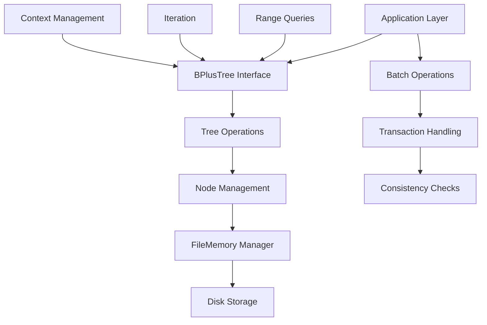

# `bplustree`

## Repository Overview

### Tree Structure
```
bplustree/
├── bplustree/
│   ├── __init__.py
│   ├── tree.py
│   └── utils.py
```

### Responsibilities
- **bplustree/**: Main package directory containing the core B+ tree implementation and supporting utilities
  - `tree.py`: Core B+ tree data structure implementation with node management and persistence
  - `utils.py`: Utility functions for data processing and iteration helpers

## Purpose

The bplustree repository provides a robust, persistent implementation of the B+ tree data structure designed for efficient key-value storage and retrieval. It addresses the need for high-performance indexed data access in applications requiring ordered traversal, range queries, and large dataset management.

### Target Users
- Database engine developers requiring efficient indexing solutions
- Systems engineers building storage systems with ordered data access patterns
- Application developers needing persistent key-value stores with range query capabilities
- Data processing pipelines requiring fast, ordered iteration over large datasets

### Use Cases
- Implementing secondary indexes in database systems
- Creating persistent key-value stores with range query support
- Building file-based databases with efficient ordered access
- Indexing large datasets for fast retrieval and range operations

## Architecture



### Key Abstractions
- **Persistent B+ Tree**: Abstracts disk-based storage with efficient node management
- **FileMemory Manager**: Handles file I/O, caching, and page management
- **Node Types**: Specialized implementations for leaf nodes, internal nodes, and root nodes
- **Transaction System**: Ensures data consistency during concurrent operations
- **Serialization Layer**: Handles key-value serialization for storage

### Architectural Patterns
- **Layered Architecture**: Clear separation between application interface, business logic, and storage layers
- **Factory Pattern**: Node creation through partial functions with pre-configured parameters
- **Resource Management**: Context manager pattern for automatic cleanup and resource release
- **Iterator Pattern**: Support for range queries and ordered iteration through slicing syntax

## Entry Points

### Importable API
```python
from bplustree import BPlusTree
```

**Primary Interface**: `BPlusTree` class provides complete functionality for key-value operations

**Required Arguments**:
- `filename` (str): Path to the file where tree data will be stored
- Optional configuration parameters:
  - `page_size=4096`: Size of disk pages in bytes
  - `order=100`: Maximum number of children per node
  - `key_size=8`: Size of keys in bytes
  - `value_size=32`: Size of values in bytes
  - `cache_size=64`: Number of cached pages
  - `serializer=None`: Custom serialization function

**Target Audience**: Developers building database systems, indexing solutions, or persistent key-value stores

### CLI Commands
None - This is a pure Python library without command-line interface

## Core Features

1. **Persistent Key-Value Storage**: Store key-value pairs in a file-backed B+ tree structure
2. **Ordered Iteration**: Iterate over keys in ascending order with full range query support
3. **Range Queries**: Efficient range-based lookups using Python slice syntax
4. **Batch Operations**: High-performance bulk insertion with optimized node management
5. **Overflow Handling**: Automatic management of large values that exceed page capacity
6. **Transaction Support**: Consistent operations with rollback capability
7. **Memory Management**: Configurable caching for optimal performance
8. **Context Management**: Automatic resource cleanup through context managers

## Dependencies

### External Dependencies
- **typing**: For type hints and annotations (Python 3.5+)
- **logging**: For debugging and operational logging
- **os**: For file system operations
- **contextlib**: For context manager utilities

### Internal Dependencies
- **bplustree.tree**: Core B+ tree implementation and node types
- **bplustree.utils**: Utility functions for data processing and iteration

### Compatibility Requirements
- Python 3.5+
- POSIX-compliant file system for disk operations
- Sufficient disk space for tree data storage
- Appropriate permissions for file creation and modification

## Configuration

### Runtime Parameters
- `page_size`: Controls disk page allocation (default: 4096 bytes)
- `order`: Determines branching factor of the tree (default: 100)
- `key_size`: Fixed size for all keys (default: 8 bytes)
- `value_size`: Fixed size for all values (default: 32 bytes)
- `cache_size`: Number of pages to cache in memory (default: 64)

### Environment Considerations
Configuration parameters significantly impact performance characteristics:
- Larger page sizes reduce I/O overhead but increase memory usage
- Higher order values reduce tree height but increase node splitting costs
- Cache size affects performance for frequently accessed nodes

## Extension Points

### Custom Serialization
Developers can provide custom serializer functions to handle complex key-value types:
```python
def custom_serializer(obj):
    return json.dumps(obj).encode('utf-8')

tree = BPlusTree('data.db', serializer=custom_serializer)
```

### Node Customization
Subclassing allows extension of node behavior for specialized use cases:
```python
class CustomLeafNode(LeafNode):
    def custom_method(self):
        # Custom node behavior
        pass
```

### Storage Backends
The FileMemory abstraction allows for alternative storage implementations:
```python
class CustomMemoryManager(FileMemory):
    def __init__(self, filename, page_size=4096):
        super().__init__(filename, page_size)
        # Custom implementation
```

### Plugin Architecture
The modular design supports adding new operation types or query methods through composition rather than inheritance.

---

## Modules

- [`bplustree`](bplustree.md)

