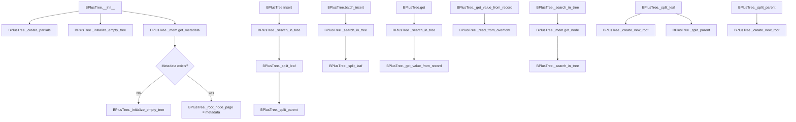

# `tree.py`

## `bplustree.tree.BPlusTree` · *class*

## Summary:
A B+ tree implementation that provides persistent key-value storage with efficient range queries and ordered iteration.

## Description:
The BPlusTree class implements a persistent B+ tree data structure optimized for disk-based storage. It provides efficient insertion, retrieval, and iteration operations while maintaining sorted order of keys. The tree automatically handles node splitting, overflow page management for large values, and maintains structural integrity through transactional operations.

This class serves as the primary interface for interacting with a B+ tree stored in a file. It abstracts away the complexities of node management, memory caching, and disk I/O, providing a simple dictionary-like interface for key-value operations.

The tree supports:
- Standard key-value operations (insert, get, delete)
- Range queries using slicing syntax
- Batch insertion for improved performance
- Overflow page handling for large values
- Transactional operations for consistency
- Context manager support for automatic resource cleanup

## State:
- `_filename` (str): Path to the file storing the tree data
- `_tree_conf` (TreeConf): Configuration object containing page size, order, key/value sizes, and serializer
- `_mem` (FileMemory): Memory manager for handling file I/O and caching
- `_root_node_page` (int): Page number of the root node in the tree
- `_is_open` (bool): Flag indicating whether the tree is currently open for operations
- `LonelyRootNode`, `RootNode`, `InternalNode`, `LeafNode`, `Record`, `Reference` (partial functions): Factory functions for creating node and entry objects with tree configuration pre-applied

## Lifecycle:
- Creation: Instantiate with filename and optional configuration parameters. The constructor initializes the tree structure, loading existing data or creating a new empty tree.
- Usage: Call methods like insert(), get(), or iteration methods. The tree automatically manages transactions and node operations.
- Destruction: Call close() or use as context manager (__enter__/__exit__). This flushes pending changes and closes file handles.

## Method Map:


## Raises:
- `ValueError`: Raised during initialization when metadata cannot be loaded, during insert when replacing existing keys without replacement flag, during batch insert when keys aren't properly sorted, and during iteration when invalid slice parameters are provided
- `KeyError`: Raised by __getitem__ when a key is not found in the tree
- `TypeError`: Implicitly raised by Python's type system when incompatible types are used

## Example:
```python
# Create a new B+ tree
tree = BPlusTree('my_tree.db', page_size=4096, order=100)

# Insert key-value pairs
tree.insert(1, b'value1')
tree.insert(2, b'value2')

# Retrieve values
value = tree.get(1)  # Returns b'value1'
value = tree[2]      # Returns b'value2' using __getitem__

# Iterate over keys
for key in tree:
    print(key)

# Range query
subset = tree[1:3]   # Get all keys from 1 to 3

# Batch insert
tree.batch_insert([(10, b'val1'), (11, b'val2')])

# Close the tree
tree.close()
```

### `bplustree.tree.BPlusTree.__init__` · *method*

## Summary:
Initializes a B+ tree instance by setting up configuration, memory management, and loading or creating the tree structure.

## Description:
The constructor initializes a B+ tree data structure by configuring its parameters, setting up memory management for disk-based storage, and either loading an existing tree structure from persistent storage or creating a new empty tree. This method orchestrates the setup of the entire B+ tree infrastructure during object creation.

The initialization process follows these steps:
1. Configures tree parameters using TreeConf
2. Sets up memory management with FileMemory
3. Attempts to load existing tree metadata from persistent storage
4. If metadata exists, restores the tree structure; otherwise, initializes a new empty tree
5. Marks the tree as ready for use

## Args:
    filename (str): Path to the file where the tree data will be stored persistently.
    page_size (int): Size of each page in bytes. Defaults to 4096.
    order (int): Maximum number of children for internal nodes. Defaults to 100.
    key_size (int): Size of keys in bytes. Defaults to 8.
    value_size (int): Size of values in bytes. Defaults to 32.
    cache_size (int): Number of pages to cache in memory. Defaults to 64.
    serializer (Optional[Serializer]): Serializer for key/value data. Defaults to IntSerializer().

## Returns:
    None

## Raises:
    ValueError: When metadata cannot be loaded from persistent storage, indicating the tree needs initialization.

## State Changes:
    Attributes READ: 
        - None
    
    Attributes WRITTEN:
        - self._filename
        - self._tree_conf
        - self._mem
        - self._root_node_page
        - self._is_open

## Constraints:
    Preconditions:
        - filename must be a valid path string
        - page_size, order, key_size, value_size must be positive integers
        - cache_size must be a non-negative integer
        - serializer must be a valid Serializer instance or None
        
    Postconditions:
        - self._filename is set to the provided filename
        - self._tree_conf contains the configured tree parameters
        - self._mem is initialized with the filename and tree configuration
        - self._is_open is set to True
        - Either self._root_node_page is set from existing metadata or initialized as a new tree

## Side Effects:
    - Opens file for persistent storage
    - May perform I/O operations to read/write metadata
    - Creates or loads tree structure from disk
    - Initializes memory caching system

### `bplustree.tree.BPlusTree.close` · *method*

## Summary:
Closes the B+ tree by releasing its memory resources and marking it as closed.

## Description:
This method safely closes the B+ tree by ending any active write transactions, closing the underlying memory interface, and updating the internal state to reflect that the tree is no longer open. It is designed to be idempotent, meaning it can be safely called multiple times without adverse effects.

## Args:
    None

## Returns:
    None

## Raises:
    None explicitly raised

## State Changes:
    Attributes READ: self._mem, self._is_open
    Attributes WRITTEN: self._is_open

## Constraints:
    Preconditions: The method can be called regardless of the current state of the tree
    Postconditions: The tree's memory is closed and the _is_open flag is set to False

## Side Effects:
    I/O operations: Calls self._mem.close() which likely performs file I/O operations
    Logging: Writes an info message to the logger if the tree is already closed

### `bplustree.tree.BPlusTree.__enter__` · *method*

## Summary:
Makes the BPlusTree instance available for use within a context manager block.

## Description:
Implements the context manager protocol's `__enter__` method, allowing BPlusTree instances to be used with Python's `with` statement. When entered, this method returns the tree instance itself, making it available for operations within the context block. This enables automatic resource management where the tree is properly closed when exiting the context.

## Args:
    self: The BPlusTree instance being entered into the context.

## Returns:
    BPlusTree: The same instance, making it available for use within the `with` block.

## Raises:
    None: This method does not raise any exceptions under normal circumstances.

## State Changes:
    Attributes READ: None
    Attributes WRITTEN: None

## Constraints:
    Preconditions: The BPlusTree instance must be properly initialized and not already closed.
    Postconditions: The returned instance is ready for use within the context manager block.

## Side Effects:
    None: This method performs no I/O operations or external service calls. It only returns the instance itself.

### `bplustree.tree.BPlusTree.__exit__` · *method*

## Summary:
Closes the B+ tree resource when exiting a context manager block.

## Description:
Implements the context manager protocol's `__exit__` method for the B+ tree. This method is automatically called when exiting a `with` statement block and ensures proper cleanup of tree resources by delegating to the `close()` method.

## Args:
    exc_type (type): Exception type, if an exception occurred in the with block (ignored).
    exc_val (Exception): Exception value, if an exception occurred in the with block (ignored).
    exc_tb (traceback): Exception traceback, if an exception occurred in the with block (ignored).

## Returns:
    None: This method does not return a value.

## Raises:
    None: This method does not explicitly raise exceptions, though underlying I/O operations may raise exceptions.

## State Changes:
    Attributes READ: None
    Attributes WRITTEN: `_is_open` (set to False)

## Constraints:
    Preconditions: The B+ tree instance must be initialized and accessible.
    Postconditions: The tree's memory resources are closed and the `_is_open` flag is set to False.

## Side Effects:
    I/O operations: Calls `self._mem.close()` to close underlying file memory resources.
    Resource cleanup: Releases any held file handles or memory buffers.

### `bplustree.tree.BPlusTree.checkpoint` · *method*

## Summary:
Flushes pending writes to disk and reopens the Write-Ahead Log for database consistency and performance optimization.

## Description:
This method performs a database checkpoint operation within a write transaction context. It synchronizes all pending writes from memory to persistent storage and reopens the Write-Ahead Log to reduce log file size and improve recovery efficiency. This is typically used as a maintenance operation to ensure data durability and optimize database performance.

The checkpoint operation is performed within a write transaction to ensure atomicity and consistency of the operation.

## Args:
    None

## Returns:
    None

## Raises:
    Exception: May raise exceptions propagated from the underlying FileMemory's perform_checkpoint method or write_transaction context manager when performing I/O operations.

## State Changes:
    Attributes READ: self._mem
    Attributes WRITTEN: None (the method operates through FileMemory's internal state changes)

## Constraints:
    Preconditions: The BPlusTree must be open (self._is_open = True) and the underlying FileMemory must be properly initialized and accessible.
    Postconditions: All pending writes are committed to persistent storage, the Write-Ahead Log is reopened, and the database state is synchronized between memory and disk.

## Side Effects:
    I/O operations: Performs synchronous writes to the underlying storage device through the FileMemory interface.
    Database state synchronization: Ensures data consistency between in-memory structures and persistent storage.
    WAL management: Reopens the Write-Ahead Log for improved performance and recovery characteristics.

### `bplustree.tree.BPlusTree.insert` · *method*

## Summary:
Inserts a key-value pair into the B+ tree, creating a new record or updating an existing one based on the replace flag.

## Description:
The insert method adds key-value pairs to the B+ tree structure, handling both new key insertions and updates to existing keys. It manages the complexity of storing values that exceed the page size limit by creating overflow page chains. The method operates within a write transaction to ensure atomicity of the insertion operation.

This method is called during key-value insertion operations and implements the core logic for maintaining tree balance through node splitting when necessary. It's designed to be part of the public interface for B+ tree manipulation, allowing users to add or update data while preserving the tree's structural integrity.

## Args:
    key (any): The key to insert or update in the tree. Must be comparable with existing keys.
    value (bytes): The value to associate with the key. Must be a bytes object.
    replace (bool): If True, allows replacing an existing key's value. If False (default), raises ValueError when attempting to insert a duplicate key.

## Returns:
    None: This method does not return a value.

## Raises:
    ValueError: When attempting to insert a duplicate key without setting replace=True, or when the value is not a bytes object.

## State Changes:
    Attributes READ: 
        - self._mem (FileMemory instance for memory management)
        - self._tree_conf (Tree configuration settings)
        - self._root_node (current root node of the tree)
        - node.smallest_key, node.biggest_key, node.entries (node properties during search)
        - node.can_add_entry (leaf node capacity check)
        
    Attributes WRITTEN:
        - self._mem.set_node() (persists modified nodes to memory)
        - self._mem.set_metadata() (updates tree metadata)
        - node.entries (modifies node entries during insertion)
        - node.next_page (updates next page links during splitting)
        - existing_record.value, existing_record.overflow_page (updates existing record values)

## Constraints:
    Preconditions:
        - The tree must be open and accessible
        - The value parameter must be a bytes object
        - Keys must be comparable with existing keys in the tree
        - The tree structure must be valid (no corrupted pointers)
        
    Postconditions:
        - The key-value pair is stored in the tree structure
        - If replace=True, existing keys are updated with new values
        - If the node becomes full during insertion, it is split appropriately
        - Tree maintains its B+ tree properties (sorted keys, balanced structure)

## Side Effects:
    - Memory page allocation and modification through FileMemory operations
    - Potential disk I/O operations during page writes
    - Node persistence via set_node calls
    - Overflow page creation when values exceed configured limits

### `bplustree.tree.BPlusTree.batch_insert` · *method*

## Summary:
Inserts multiple key-value pairs into the B+ tree in a single batch operation, maintaining sorted key ordering and handling overflow pages for large values.

## Description:
This method performs efficient batch insertion of key-value pairs into the B+ tree structure. It processes the input iterable sequentially, reusing previously found nodes to minimize tree traversal overhead. The method enforces that keys are provided in ascending order and raises an error if this constraint is violated. Large values exceeding the configured value size limit are automatically stored across overflow pages.

The method operates within a write transaction to ensure atomicity of all modifications. It handles node splitting when leaf nodes reach capacity, maintaining the B+ tree's structural properties throughout the insertion process.

## Args:
    iterable (Iterable): An iterable of (key, value) pairs to insert into the tree. Keys must be provided in ascending order and must be greater than any existing keys in the tree.

## Returns:
    None: This method does not return a value.

## Raises:
    ValueError: Raised when keys in the iterable are not in ascending order or when a key is less than or equal to the largest key currently in the tree.

## State Changes:
    Attributes READ: 
        - self._root_node (current root node of the tree)
        - self._tree_conf (configuration settings for the tree)
        - self._mem (memory manager for node storage)
        
    Attributes WRITTEN:
        - self._mem.set_node() (persisted node modifications)
        - self._root_node_page (updated when new root is created)

## Constraints:
    Preconditions:
        - The tree must be open and accessible
        - Keys in the iterable must be provided in strictly ascending order
        - Each key must be greater than all existing keys in the tree
        - Values must be bytes objects
        - The iterable must contain valid (key, value) pairs
        
    Postconditions:
        - All key-value pairs are successfully inserted into the tree
        - The tree maintains its B+ tree properties
        - Overflow pages are created for large values as needed
        - Node splitting occurs appropriately when leaf nodes become full

## Side Effects:
    - Memory writes via self._mem.set_node() for persisted node modifications
    - Potential creation of overflow pages for large values
    - Transaction management through self._mem.write_transaction
    - Node splitting operations that may create new nodes and update parent references

### `bplustree.tree.BPlusTree.get` · *method*

## Summary:
Retrieves the value associated with a given key from the B+ tree, returning a default value if the key is not found.

## Description:
This method performs a key-based lookup in the B+ tree structure to retrieve the value stored for a specific key. It traverses the tree structure using the internal search mechanism and returns the corresponding value bytes. If the key does not exist in the tree, it returns the specified default value instead.

The method is designed as a separate utility to encapsulate the complete lookup logic, including error handling for missing keys and value reconstruction from overflow pages when necessary. It's called during key-based retrieval operations throughout the tree interface.

Known callers:
- BPlusTree.__getitem__(): Used when accessing values with bracket notation (tree[key])
- BPlusTree.__contains__(): Used to check key existence (key in tree)
- BPlusTree.items(): Used during iteration with key-value pairs
- BPlusTree.values(): Used during iteration over values only

This logic is separated into its own method to avoid code duplication and maintain clean separation of concerns between tree traversal, key lookup, and value retrieval operations.

## Args:
    key (any): The key to search for in the tree. Must be comparable with existing keys.
    default (bytes, optional): The default value to return if the key is not found. Defaults to None.

## Returns:
    bytes: The value associated with the key if found, or the default value if not found.

## Raises:
    None explicitly raised, but may propagate exceptions from internal methods like _search_in_tree or _get_value_from_record.

## State Changes:
    Attributes READ: 
        - self._mem (memory manager for tree operations)
        - self._root_node (current root node of the tree)
    Attributes WRITTEN: 
        - None (read-only operation)

## Constraints:
    Preconditions:
        - The tree must be open and valid
        - The key must be comparable with existing keys in the tree
        - The default parameter must be compatible with the expected return type
    
    Postconditions:
        - Returns bytes representing the value if key exists, or the default value if not found
        - The tree structure remains unchanged

## Side Effects:
    - Memory access via self._mem.read_transaction for read-only operations
    - Calls to self._search_in_tree() which accesses memory pages
    - Calls to self._get_value_from_record() which may perform overflow page reads

### `bplustree.tree.BPlusTree.__contains__` · *method*

## Summary:
Checks whether a key exists in the B+ tree without retrieving its value.

## Description:
Implements the Python magic method `__contains__` to enable the `in` operator for checking key existence. This method performs a read-only lookup to determine if a key is present in the tree, returning True if found and False otherwise.

## Args:
    item (Any): The key to search for in the tree.

## Returns:
    bool: True if the key exists in the tree, False otherwise.

## Raises:
    None explicitly raised, but may propagate exceptions from underlying operations like memory access or tree traversal.

## State Changes:
    Attributes READ: 
    - self._mem (for read_transaction)
    - self._root_node (accessed via _search_in_tree in get method)
    
    Attributes WRITTEN: None

## Constraints:
    Preconditions:
    - The tree must be open (self._is_open must be True)
    - The key type must be compatible with the tree's key comparison logic
    
    Postconditions:
    - The tree remains unchanged
    - No modifications are made to the tree structure or data

## Side Effects:
    - Acquires a read transaction from self._mem
    - Performs read operations on the underlying file/memory storage
    - May trigger page loading from disk if pages are not cached

### `bplustree.tree.BPlusTree.__setitem__` · *method*

## Summary:
Sets a key-value pair in the B+ tree, replacing any existing value for the same key.

## Description:
This method implements Python's `__setitem__` magic method, enabling dictionary-style assignment syntax (`tree[key] = value`) on B+ tree instances. It delegates to the internal `insert` method with the `replace=True` parameter, ensuring that if a key already exists in the tree, its associated value will be overwritten with the new value.

## Args:
    key: The key to set in the tree
    value: The value to associate with the key (must be bytes)

## Returns:
    None

## Raises:
    ValueError: If the value is not a bytes object, or if the key already exists and replace=False (though this case is prevented by the replace=True parameter)

## State Changes:
    Attributes READ: None
    Attributes WRITTEN: Modifies tree structure through internal node operations

## Constraints:
    Preconditions: The tree must be open and accessible
    Postconditions: The key-value pair is stored in the tree, replacing any previous value for the same key

## Side Effects:
    Mutates the tree structure by potentially modifying nodes and creating new nodes during splits
    May create overflow pages for large values
    Uses write transactions for database consistency

### `bplustree.tree.BPlusTree.__getitem__` · *method*

## Summary:
Retrieves values from the B+ tree by key or slice, raising KeyError for missing keys.

## Description:
Provides bracket notation access to tree entries, supporting both single key lookup and slice-based range queries. When a key is not found, raises KeyError; when a slice is provided, returns a dictionary mapping keys to their values.

## Args:
    item (Union[int, slice]): Either a single key (int) or a slice object defining a range of keys.

## Returns:
    Union[bytes, dict]: For integer keys, returns the associated byte value. For slices, returns a dictionary mapping keys to their byte values.

## Raises:
    KeyError: When attempting to access a non-existent key using bracket notation.
    ValueError: When a slice contains a step parameter or invalid range.

## State Changes:
    Attributes READ: 
        - self._mem
        - self._root_node
        - self._left_record_node

## Constraints:
    Preconditions:
        - Tree must be open (self._is_open must be True)
        - Item must be either an integer key or a valid slice object
        - Slice start and stop must be comparable integers
    Postconditions:
        - For key access: returns bytes value or raises KeyError
        - For slice access: returns dict with all matching keys and values

## Side Effects:
    - Acquires a read transaction from self._mem
    - Reads from disk via self._mem.get_node() and self._mem.get_page()
    - May read overflow pages when retrieving large values

### `bplustree.tree.BPlusTree.__len__` · *method*

## Summary:
Returns the total number of records stored in the B+ tree by traversing all leaf nodes from left to right.

## Description:
This method calculates the total count of records in the B+ tree by starting from the leftmost leaf node and traversing through all subsequent leaf nodes using their `next_page` pointers. It accumulates the count of entries in each node to compute the total size of the tree.

The method is designed to be efficient and consistent, using a read transaction to ensure that the tree state remains stable during the counting operation. This approach avoids having to traverse the entire tree structure recursively, instead leveraging the linked list-like structure of leaf nodes.

## Args:
    None

## Returns:
    int: The total number of records stored in the B+ tree.

## Raises:
    None explicitly raised

## State Changes:
    Attributes READ: 
    - self._mem (FileMemory instance for accessing nodes)
    - self._left_record_node (property returning the leftmost leaf node)
    - node.entries (list of records in each node)
    - node.next_page (pointer to next leaf node in the chain)

    Attributes WRITTEN: None

## Constraints:
    Preconditions:
    - The B+ tree must be open (self._is_open = True)
    - All nodes referenced must exist in memory
    - The tree structure must be valid (leaf nodes properly linked via next_page pointers)

    Postconditions:
    - The method returns an integer representing the total count of records
    - The tree structure remains unchanged
    - The method executes within a read transaction ensuring consistency

## Side Effects:
    - Accesses disk/memory to read node data through FileMemory interface
    - Uses read transaction to ensure consistency during traversal
    - May trigger disk I/O operations when retrieving nodes from storage

### `bplustree.tree.BPlusTree.__length_hint__` · *method*

## Summary:
Returns an estimated length hint for the BPlusTree, providing a conservative upper bound on the number of records in the tree.

## Description:
This method implements Python's __length_hint__ protocol to provide an estimated count of records in the BPlusTree. It's designed to give a reasonable approximation without performing expensive operations like counting all records. The estimation is based on memory layout and tree structure characteristics.

The method is called by Python's iterator protocol when working with tree iterators, helping optimize memory allocation and iteration performance.

When the root node is a LonelyRootNode, it returns a simple estimate of node.max_children // 2. For normal trees, it estimates based on the total number of pages, assuming 70% of pages are leaf nodes, and averages the maximum and minimum children per node to estimate records per leaf node.

## Args:
    None

## Returns:
    int: An estimated upper bound on the number of records in the tree. This is a conservative estimate and may be higher than the actual count.

## Raises:
    ValueError: May be raised indirectly if memory operations fail during node access or page reading.

## State Changes:
    Attributes READ: 
    - self._mem (for read_transaction, last_page, and get_node operations)
    - self._root_node (for type checking and accessing max_children/min_children)
    - node (temporary variable referencing self._root_node)

## Constraints:
    Preconditions:
    - The tree must be open (self._is_open should be True)
    - The tree must have valid metadata in memory
    - Memory operations must succeed during node access
    
    Postconditions:
    - The method returns a non-negative integer representing an estimated count
    - The returned value is an upper bound estimate, not an exact count

## Side Effects:
    - Acquires a read transaction from self._mem
    - Reads from memory pages via self._mem.get_node() and accesses self._mem.last_page
    - No modifications to the tree state

### `bplustree.tree.BPlusTree.__iter__` · *method*

## Summary:
Returns an iterator over all keys in the B+ tree in ascending order, implementing the iterator protocol.

## Description:
Provides sequential access to all keys stored in the B+ tree in ascending order. This method implements Python's iterator protocol (`__iter__`) and can be called directly or through the `keys` property. When called without arguments, it iterates through all keys in ascending order. When provided with a slice argument, it iterates through keys within the specified range. This method is implemented as a generator that yields keys one at a time, making it memory-efficient for large datasets.

## Args:
    slice_ (Optional[slice]): Slice object defining the range of keys to iterate over. If None, iterates through all keys. Default is None.

## Returns:
    Iterator[int]: An iterator yielding integer keys from the tree in ascending order.

## Raises:
    ValueError: If the slice has a non-None step value or if start >= stop in a range.

## State Changes:
    Attributes READ: 
        - self._mem (FileMemory instance)
        - self._root_node_page
    Attributes WRITTEN: None

## Constraints:
    Preconditions:
        - The B+ tree must be open (self._is_open must be True)
        - The tree must have valid metadata and root node
    Postconditions:
        - The method returns an iterator that yields keys in ascending order
        - No modifications are made to the tree structure or data

## Side Effects:
    - Acquires a read transaction from self._mem
    - Reads from disk/memory pages through self._mem.get_node() and self._mem.get_page()
    - May perform multiple memory/page reads during iteration

### `bplustree.tree.BPlusTree.items` · *method*

## Summary:
Returns an iterator of key-value pairs from the B+ tree, optionally filtered by a key range slice.

## Description:
This method provides iteration over all key-value pairs stored in the B+ tree. When a slice is provided, it returns only those pairs whose keys fall within the specified range. The method uses read transactions to ensure thread-safe access to the tree structure. It's designed to work with Python's slice notation for range queries, making it convenient for retrieving subsets of data.

Known callers:
- BPlusTree.__getitem__(): Called when accessing tree with a slice notation to return a dictionary of key-value pairs
- Direct usage: When iterating over key-value pairs in a specific range

This logic is separated into its own method to avoid code duplication with the `keys()` method and `values()` method, providing a clean interface for key-value iteration while maintaining consistency with Python's iteration protocols.

## Args:
    slice_ (Optional[slice], optional): A slice object defining the key range to iterate over. Defaults to None, which means iterate over all key-value pairs.

## Returns:
    Iterator[tuple]: An iterator yielding tuples of (key, value) pairs, where key is the record's key and value is the complete value bytes.

## Raises:
    ValueError: When the slice has a non-None step value (unsupported) or when start >= stop for a forward iteration.
    StopIteration: Raised internally when reaching the end of the iteration range or tree.

## State Changes:
    Attributes READ: 
        - self._mem
        - self._iter_slice
        - self._get_value_from_record
    
    Attributes WRITTEN: None

## Constraints:
    Preconditions:
        - The B+ tree must be open (self._is_open = True)
        - The slice_ argument must be a valid slice object or None
        - Slice start and stop values must be comparable with record keys
        
    Postconditions:
        - Returns an iterator that yields (key, value) tuples in ascending key order
        - Iterator stops when reaching the end of the key range or tree
        - Values returned are complete byte sequences, handling both inline and overflow storage

## Side Effects:
    - Reads from disk/memory through self._mem.get_node() and self._mem.get_page() calls
    - May perform multiple memory/page reads during tree traversal
    - Uses self._mem.read_transaction for thread-safe access
    - Calls self._iter_slice() which may traverse the tree structure
    - Calls self._get_value_from_record() which may read overflow pages

### `bplustree.tree.BPlusTree.values` · *method*

## Summary:
Returns an iterator of value bytes from records in the B+ tree, optionally filtered by a key range slice.

## Description:
Provides iteration over all values stored in the B+ tree structure. When a slice is provided, it returns values for records whose keys fall within the specified range. This method is designed to efficiently retrieve values without requiring key information, making it useful for scenarios where only the stored data is needed.

Known callers:
- BPlusTree.items(): Used internally when retrieving key-value pairs
- BPlusTree.__getitem__(): Used internally when accessing values via bracket notation
- Direct user calls: When iterating over values in the tree

This method exists separately from inline implementation to provide a clean, reusable interface for value-only iteration while leveraging the existing slice-based range query infrastructure.

## Args:
    slice_ (Optional[slice]): A slice object defining the key range to iterate over. If None, all values in the tree are returned. The slice supports start and stop bounds but not custom steps.

## Returns:
    Iterator[bytes]: An iterator yielding value bytes from records in the tree, ordered by key.

## Raises:
    ValueError: When the slice parameter has a non-None step value, or when start >= stop for a forward iteration.

## State Changes:
    Attributes READ: 
        - self._mem
        - self._iter_slice
        - self._get_value_from_record
    
    Attributes WRITTEN: None

## Constraints:
    Preconditions:
        - The B+ tree must be open (self._is_open = True)
        - The slice_ argument must be a valid slice object or None
        - Slice start and stop values must be comparable with record keys
        
    Postconditions:
        - Returns an iterator that yields bytes representing values in ascending key order
        - Iterator stops when reaching the end of the key range or tree

## Side Effects:
    - Reads from disk/memory through self._mem.read_transaction context
    - Performs multiple memory/page reads during tree traversal via _iter_slice
    - Calls self._get_value_from_record() for each record, which may involve overflow page reads

### `bplustree.tree.BPlusTree.__bool__` · *method*

## Summary:
Returns whether the BPlusTree contains any records.

## Description:
Implements the Python special method `__bool__` to determine the truthiness of the tree. Returns True if the tree contains at least one record, and False if the tree is empty. This method uses a read transaction to iterate through the tree's records and returns early upon finding the first record.

## Args:
    None

## Returns:
    bool: True if the tree contains at least one record, False if the tree is empty.

## Raises:
    None

## State Changes:
    Attributes READ: 
    - self._mem (FileMemory instance)
    - self._root_node_page
    - self._root_node (via property)
    - self._left_record_node (via property)

    Attributes WRITTEN: 
    - None

## Constraints:
    Preconditions:
    - The tree must be open (self._is_open must be True)
    - The tree's memory manager (_mem) must be properly initialized
    
    Postconditions:
    - The method does not modify any tree state
    - The method returns immediately upon finding the first record

## Side Effects:
    - Acquires a read transaction from self._mem
    - Reads from the underlying storage via self._mem.get_node() and self._mem.get_page()
    - May read multiple nodes from disk during iteration

### `bplustree.tree.BPlusTree.__repr__` · *method*

## Summary:
Returns a string representation of the BPlusTree instance showing its filename and configuration.

## Description:
This method provides a human-readable representation of the BPlusTree object for debugging and logging purposes. It formats the tree's filename and configuration into a standardized string format.

## Args:
    None

## Returns:
    str: A formatted string in the pattern '<BPlusTree: {filename} {tree_conf}>'

## Raises:
    None

## State Changes:
    Attributes READ: self._filename, self._tree_conf
    Attributes WRITTEN: None

## Constraints:
    Preconditions: The BPlusTree instance must be initialized with valid _filename and _tree_conf attributes
    Postconditions: The returned string format is consistent and includes both filename and configuration information

## Side Effects:
    None

### `bplustree.tree.BPlusTree._initialize_empty_tree` · *method*

## Summary:
Initializes an empty B+ tree by creating a lonely root node and setting up initial metadata.

## Description:
This private method is responsible for setting up the foundational structure of a new, empty B+ tree. It is called during tree initialization when no existing metadata is found. The method creates a lonely root node (which represents the initial state of a tree with no entries) and stores the necessary metadata to track the tree's root page and configuration.

## Args:
    None

## Returns:
    None

## Raises:
    None explicitly raised

## State Changes:
    Attributes READ: self._mem, self._tree_conf
    Attributes WRITTEN: self._root_node_page

## Constraints:
    Preconditions: 
    - The tree must be in an uninitialized state (no existing metadata)
    - self._mem must be properly initialized
    - self._tree_conf must be properly initialized
    
    Postconditions:
    - self._root_node_page is set to the next available page in memory
    - A lonely root node is created and stored in memory
    - Metadata is written to track the root page and tree configuration

## Side Effects:
    - Writes to persistent storage via self._mem (memory manager)
    - Modifies the tree's metadata in persistent storage
    - Creates a new node in memory management system

### `bplustree.tree.BPlusTree._create_partials` · *method*

## Summary:
Creates partial function factories for node and entry classes pre-configured with the tree's configuration.

## Description:
This method initializes partial functions for various node and entry classes, binding the tree configuration (`self._tree_conf`) to each class constructor. This allows for cleaner instantiation of these objects throughout the tree's lifecycle without repeatedly passing the configuration parameter.

The method is called during BPlusTree initialization to set up convenient factory methods for creating nodes and entries with the appropriate tree configuration already applied.

## Args:
    None

## Returns:
    None

## Raises:
    None

## State Changes:
    Attributes READ: 
        - self._tree_conf
    
    Attributes WRITTEN:
        - self.LonelyRootNode
        - self.RootNode
        - self.InternalNode
        - self.LeafNode
        - self.Record
        - self.Reference

## Constraints:
    Preconditions:
        - self._tree_conf must be initialized before calling this method
        - This method should only be called once during object initialization
    
    Postconditions:
        - All partial functions are properly bound with self._tree_conf
        - The partial functions can be used to instantiate their respective classes with the tree configuration

## Side Effects:
    None

### `bplustree.tree.BPlusTree._root_node` · *method*

## Summary:
Returns the current root node of the B+ tree, ensuring it is either a LonelyRootNode or RootNode instance.

## Description:
This property provides access to the root node of the B+ tree by retrieving it from memory using the stored root node page number. It serves as a central point for accessing the tree's root node throughout the implementation, ensuring type safety by asserting that the returned node is one of the two valid root node types.

The method is called during various tree operations such as searching, insertion, iteration, and length calculation to access the current root node. It's implemented as a property to provide clean, consistent access to the root node without requiring explicit method calls.

## Args:
    None

## Returns:
    Union['LonelyRootNode', 'RootNode']: The current root node of the B+ tree, which is either a LonelyRootNode (when the tree has only one node) or a RootNode (when the tree has grown beyond a single node).

## Raises:
    AssertionError: When the retrieved node from memory is not an instance of either LonelyRootNode or RootNode, indicating a potential corruption or inconsistency in the tree structure.

## State Changes:
    Attributes READ: 
    - self._mem: FileMemory instance used to retrieve nodes from disk
    - self._root_node_page: Integer page number identifying the root node's location in memory
    
    Attributes WRITTEN: None

## Constraints:
    Preconditions:
    - The B+ tree must be initialized and opened (self._is_open must be True)
    - The root node page number must be valid and correspond to an existing node in memory
    - The underlying FileMemory must be properly initialized
    
    Postconditions:
    - The returned node is guaranteed to be either a LonelyRootNode or RootNode instance
    - The returned node is a live reference to the node in memory (not a copy)
    - The method does not modify any state of the BPlusTree object

## Side Effects:
    None

### `bplustree.tree.BPlusTree._left_record_node` · *method*

## Summary:
Returns the leftmost leaf node or lonely root node in the B+ tree by traversing down the leftmost path from the root.

## Description:
This method performs a traversal from the root node down the leftmost path of the B+ tree structure. It follows the smallest entry's 'before' reference at each internal node until it reaches either a LeafNode or a LonelyRootNode. This is commonly used to find the first record in the tree for iteration purposes.

The method is implemented as a property and is called by methods like `__len__` and `_iter_slice` to get the starting point for tree traversal operations.

## Args:
    None

## Returns:
    Union['LonelyRootNode', 'LeafNode']: The leftmost node in the tree structure, which will be either a LeafNode containing records or a LonelyRootNode which serves as a special root case.

## Raises:
    None explicitly raised

## State Changes:
    Attributes READ: 
    - self._root_node (via property)
    - self._mem (FileMemory instance)
    
    Attributes WRITTEN: 
    - None

## Constraints:
    Preconditions:
    - The tree must be initialized and opened
    - The root node must exist and be accessible via self._root_node
    
    Postconditions:
    - Returns either a LeafNode or LonelyRootNode instance
    - The returned node is guaranteed to be the leftmost node in the tree structure

## Side Effects:
    - Makes calls to self._mem.get_node() which may involve disk I/O operations
    - Accesses memory manager to retrieve nodes from storage

### `bplustree.tree.BPlusTree._iter_slice` · *method*

## Summary:
Iterates over records in a B+ tree within a specified key range slice.

## Description:
This private method implements range-based iteration over records stored in a B+ tree structure. It supports slicing operations with start and stop bounds, allowing users to retrieve records within a specific key range. The method handles traversal through leaf nodes and manages pagination across the tree structure. It is used internally by public methods like `__getitem__`, `items`, and `values` when a slice is provided.

## Args:
    slice_ (slice): A slice object specifying the key range to iterate over. The slice can have start and stop values but must not have a step.

## Returns:
    Iterator[Record]: An iterator yielding Record objects whose keys fall within the specified slice range.

## Raises:
    ValueError: When attempting to use a slice with a custom step (step != None) or when start >= stop for a forward iteration.
    StopIteration: Raised internally when reaching the end of the iteration range or tree.

## State Changes:
    Attributes READ: 
        - self._left_record_node
        - self._root_node
        - self._mem
    
    Attributes WRITTEN: None

## Constraints:
    Preconditions:
        - The B+ tree must be open (self._is_open = True)
        - The slice_ argument must be a valid slice object
        - Slice start and stop values must be comparable with record keys
        
    Postconditions:
        - Returns an iterator that yields records in ascending key order
        - Iterator stops when reaching the end of the key range or tree

## Side Effects:
    - Reads from disk/memory through self._mem.get_node() calls
    - May perform multiple memory/page reads during tree traversal
    - Calls self._search_in_tree() to find starting position

### `bplustree.tree.BPlusTree._search_in_tree` · *method*

## Summary:
Traverses the B+ tree structure to locate the leaf node containing the specified key.

## Description:
Recursively searches through internal nodes of a B+ tree to find the appropriate leaf node that would contain the given key. This method implements the core tree traversal logic for key lookup operations in the B+ tree data structure.

The method handles three cases for internal nodes:
1. When the key is smaller than the smallest key in the node, it follows the leftmost pointer
2. When the key is greater than or equal to the largest key in the node, it follows the rightmost pointer
3. When the key falls within the range of keys in the node, it finds the appropriate child pointer using pairwise key comparisons

This method is called during key lookup operations and ensures proper parent-child relationship maintenance during traversal.

## Args:
    key (any): The key value to search for in the tree
    node (Node): The current node being examined during traversal

## Returns:
    Node: The leaf node containing the key, or the leaf node that would contain the key if it doesn't exist

## Raises:
    AssertionError: When no valid page reference is determined during traversal (should never occur with valid tree structure)

## State Changes:
    Attributes READ: 
        - self._mem (memory manager for retrieving nodes)
        - node.smallest_key, node.biggest_key, node.smallest_entry, node.biggest_entry, node.entries
    Attributes WRITTEN:
        - child_node.parent (set to current node during traversal)

## Constraints:
    Preconditions:
        - The tree structure must be valid (no corrupted pointers)
        - The key parameter must be comparable with node key values
        - The node parameter must be a valid node in the tree structure
    
    Postconditions:
        - Returns a leaf node or lonely root node (no internal nodes)
        - The returned node contains the key or would contain it if inserted

## Side Effects:
    - Memory access via self._mem.get_node() to retrieve child nodes
    - Modifies child node's parent attribute during traversal

### `bplustree.tree.BPlusTree._split_leaf` · *method*

## Summary:
Splits a leaf node when it exceeds capacity, creating a new sibling leaf node and updating parent references accordingly.

## Description:
This method handles the splitting of a leaf node when it reaches maximum capacity, which is a fundamental operation in maintaining the B+ tree structure. When a leaf node becomes full, this method creates a new sibling leaf node containing half of the original node's entries, updates the parent node with appropriate reference entries, and ensures proper linking between the two nodes.

The method is called during insertion operations when a leaf node needs to be split to accommodate new entries. It handles special cases for lonely root nodes and manages the parent node's capacity, potentially triggering further splitting if the parent becomes full.

## Args:
    old_node (Node): The leaf node that needs to be split. Must be a LeafNode or LonelyRootNode instance.

## Returns:
    None: This method does not return a value.

## Raises:
    None explicitly raised: The method doesn't contain explicit exception handling, but may propagate exceptions from underlying operations such as memory management or node operations.

## State Changes:
    Attributes READ: 
    - self._mem (FileMemory instance)
    - self.LeafNode (partial function for creating LeafNode instances)
    - self.Reference (partial function for creating Reference instances)
    - old_node.parent (parent node reference)
    - old_node.next_page (next page reference)
    - old_node.page (current page reference)
    - old_node.smallest_key (smallest key in the node)
    - old_node.entries (entries in the node)
    
    Attributes WRITTEN:
    - old_node.next_page (updated to point to new node)
    - self._mem (through set_node calls)

## Constraints:
    Preconditions:
    - The old_node parameter must be a valid Node instance (LeafNode or LonelyRootNode)
    - The node must be full and require splitting
    - Memory management should be properly initialized
    - Parent node must exist or be handled appropriately
    
    Postconditions:
    - A new sibling leaf node is created with half of the original entries
    - The parent node is updated with a reference to the new node
    - The old node's next_page pointer is updated to point to the new node
    - Both nodes are persisted to memory

## Side Effects:
    - Writes to disk via FileMemory operations (set_node calls)
    - Updates internal node linkage through next_page pointers
    - May trigger additional splitting operations if parent node is full

### `bplustree.tree.BPlusTree._split_parent` · *method*

## Summary:
Redistributes entries between a node and a newly created sibling node during B+ tree balancing operations.

## Description:
This method handles the redistribution of entries when a node in the B+ tree exceeds its capacity. It creates a new sibling node containing a portion of entries from the original node, establishes proper parent-child relationships through reference entries, and manages tree structure updates including potential root node creation.

The method is invoked during tree balancing operations when node splitting occurs. It follows a recursive pattern where if the parent node also becomes full after insertion, it continues splitting upward through the tree hierarchy.

## Args:
    old_node (Node): The node that has exceeded capacity and requires splitting. Must be a Node instance with parent attribute.

## Returns:
    None: This method does not return a value.

## Raises:
    None explicitly raised: The method doesn't contain explicit exception handling, but may propagate exceptions from underlying operations.

## State Changes:
    Attributes READ:
    - self._mem (FileMemory instance)
    - old_node.parent (parent node reference)
    - old_node.page (page number of the old node)
    
    Attributes WRITTEN:
    - self._mem (through set_node calls)
    - old_node.entries (modified during split_entries operation)
    - new_node.entries (populated with split entries)
    - ref.before (set to old_node.page)
    - ref.after (set to new_node.page)

## Constraints:
    Preconditions:
    - The old_node parameter must be a valid Node instance with a parent
    - The tree must be properly initialized and accessible
    - Memory management must be functional
    
    Postconditions:
    - The old_node and new_node are properly split and stored in memory
    - Parent node contains a reference to the new node
    - If the old_node was a RootNode, a new root is created via _create_new_root
    - The tree maintains proper structural integrity

## Side Effects:
    - Writes to disk via FileMemory operations (set_node calls)
    - Potential recursive calls to _split_parent
    - Modifies node entries and references in memory
    - May update root node reference if a new root is created

### `bplustree.tree.BPlusTree._create_new_root` · *method*

## Summary:
Creates a new root node for the B+ tree by initializing a root node with a reference entry and updating the tree's metadata.

## Description:
This method is responsible for creating a new root node when the tree needs to grow in height, typically triggered during leaf splitting operations. It constructs a new root node using the tree's configuration and available memory page, inserts the provided reference entry, and updates the tree's metadata to reflect the new root node.

The method is called specifically when a leaf node splits and creates a new root node, particularly in the context of `_split_leaf` and `_split_parent` methods. It's separated from inline logic to maintain clean code organization and encapsulate the root creation responsibility.

## Args:
    reference (Reference): The reference entry to be inserted into the newly created root node.

## Returns:
    None: This method does not return a value.

## Raises:
    None explicitly raised: The method doesn't contain explicit exception handling, but may propagate exceptions from underlying operations such as memory management or node creation.

## State Changes:
    Attributes READ: 
    - self._mem (FileMemory instance)
    - self._tree_conf (TreeConf instance)
    - self.RootNode (partial function for creating RootNode instances)
    - self._mem.next_available_page (gets next available page number from memory)
    
    Attributes WRITTEN:
    - self._root_node_page (updated to the new root node's page number)
    - self._mem (through set_metadata and set_node calls)

## Constraints:
    Preconditions:
    - The tree must be initialized and open (self._is_open should be True)
    - The reference parameter must be a valid Reference object
    - Memory management should be properly initialized
    - The tree should be in a state where a new root needs to be created
    
    Postconditions:
    - A new root node is created with the provided reference
    - The tree's metadata is updated with the new root node page
    - The new root node is stored in memory
    - The root node page reference is updated to point to the new root

## Side Effects:
    - Writes to disk via FileMemory operations (set_metadata, set_node)
    - Updates internal state variable self._root_node_page
    - May cause memory allocation for new pages

### `bplustree.tree.BPlusTree._create_overflow` · *method*

## Summary:
Creates a chain of overflow pages to store large byte values that exceed the page size limit.

## Description:
This method handles the creation of overflow page chains for values that are too large to fit within a single page. When inserting records with large values, if the value size exceeds the configured `value_size` limit, this method is invoked to split the value across multiple pages. The method creates a linked chain of pages where each page contains a portion of the original value, with the last page having a zero reference to indicate termination.

The method is called during the `insert` and `batch_insert` operations when a value exceeds the page capacity. It ensures that large values can be stored efficiently within the B+Tree structure by breaking them into manageable chunks.

## Args:
    value (bytes): The large byte value to be stored across multiple overflow pages

## Returns:
    int: The page number of the first overflow page created, which serves as the entry point for accessing the entire value

## Raises:
    None explicitly raised - relies on underlying memory operations and page management

## State Changes:
    Attributes READ: 
        - self._tree_conf.page_size
        - self._tree_conf.value_size  
        - self._mem.next_available_page
    Attributes WRITTEN:
        - self._mem.set_page() is called multiple times to store overflow page data

## Constraints:
    Preconditions:
        - The input `value` must be a bytes object
        - The value must exceed the configured `value_size` limit (otherwise it shouldn't be called)
        - The tree must be in an open state with available memory pages
    Postconditions:
        - All overflow pages are properly initialized with correct page references
        - The returned page number points to the first page in the overflow chain
        - The overflow chain is fully constructed and accessible via the page reference mechanism

## Side Effects:
    - Memory page allocation and modification through `self._mem.set_page()`
    - Page reference updates in the overflow chain
    - No external service calls or I/O beyond memory management

### `bplustree.tree.BPlusTree._read_from_overflow` · *method*

## Summary:
Reads and aggregates data stored across multiple overflow pages in a B+ tree structure.

## Description:
This private method reads data that has been split across multiple overflow pages in the B+ tree storage system. It follows a linked list of overflow pages starting from the given first page, collecting all payload data until reaching the end of the overflow chain (indicated by a zero page reference).

## Args:
    first_overflow_page (int): The page number of the first overflow page containing data to read.

## Returns:
    bytes: The complete data payload accumulated from all pages in the overflow chain.

## Raises:
    None explicitly documented - depends on underlying memory operations.

## State Changes:
    Attributes READ: self._mem
    Attributes WRITTEN: None

## Constraints:
    Preconditions: 
    - The first_overflow_page must be a valid page number in the storage system
    - All pages in the overflow chain must exist and be readable
    - The page data must conform to the expected format with proper header fields
    
    Postconditions:
    - Returns all data from the overflow chain as a single bytes object
    - Does not modify any internal state of the BPlusTree object

## Side Effects:
    - Performs I/O operations through self._mem.get_page() to read multiple pages from storage
    - May cause disk or memory access depending on the FileMemory implementation

### `bplustree.tree.BPlusTree._get_value_from_record` · *method*

## Summary:
Retrieves the complete value bytes from a record, handling both inline values and overflow page storage.

## Description:
This method extracts the full value from a Record object, checking if the value is stored inline or in overflow pages. When a record's value is None, it indicates the actual value is stored in overflow pages, which are read and reconstructed using the overflow page reference. This method is called internally by various tree operations to retrieve complete values from records.

Known callers:
- BPlusTree.get(): Retrieves values during key-based lookups
- BPlusTree.__getitem__(): Retrieves values during bracket notation access
- BPlusTree.items(): Retrieves values during iteration with key-value pairs
- BPlusTree.values(): Retrieves values during iteration over values only

This logic is separated into its own method to handle the complexity of overflow page management cleanly, avoiding duplication in multiple retrieval paths.

## Args:
    record (Record): A record object containing either an inline value or a reference to overflow pages.

## Returns:
    bytes: The complete value bytes associated with the record.

## Raises:
    None explicitly raised, but may propagate exceptions from _read_from_overflow.

## State Changes:
    Attributes READ: record.value, record.overflow_page
    Attributes WRITTEN: None

## Constraints:
    Preconditions: 
    - The record parameter must be a valid Record instance
    - If record.value is None, record.overflow_page must be a valid page reference or None
    Postconditions:
    - Returns bytes representing the complete value
    - If record.value is not None, returns record.value directly
    - If record.value is None, returns the reconstructed value from overflow pages

## Side Effects:
    I/O operations: Calls self._read_from_overflow() which performs memory page reads via self._mem.get_page()

