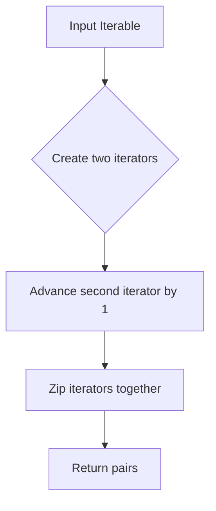

# `utils.py`

## `bplustree.utils.pairwise` · *function*

## Summary:
Returns consecutive pairs of elements from an iterable.

## Description:
Creates pairs of adjacent elements from the input iterable. For an input sequence of length n, this produces n-1 pairs, where each pair consists of consecutive elements. This utility function is commonly used for comparing adjacent items, creating sliding windows, or processing sequential data.

## Args:
    iterable (Iterable): An iterable object containing elements to be paired consecutively.

## Returns:
    zip: An iterator of tuples, where each tuple contains two consecutive elements from the input iterable. Returns an empty iterator if the input has fewer than 2 elements.

## Raises:
    None

## Constraints:
    Preconditions:
        - Input must be an iterable object
        - Empty iterables or single-element iterables will produce empty results
    Postconditions:
        - Output iterator yields tuples of exactly 2 elements each
        - Order of elements in pairs matches the order in the input iterable

## Side Effects:
    None

## Control Flow:


## Examples:
    >>> list(pairwise([1, 2, 3, 4]))
    [(1, 2), (2, 3), (3, 4)]
    
    >>> list(pairwise('abc'))
    [('a', 'b'), ('b', 'c')]
    
    >>> list(pairwise([]))
    []
    
    >>> list(pairwise([1]))
    []
```

## `bplustree.utils.iter_slice` · *function*

## Summary:
Splits a bytes iterable into fixed-size chunks and indicates whether each chunk is the final one.

## Description:
This function divides a bytes object into sequential chunks of a specified size, yielding each chunk along with a boolean flag indicating if it's the last chunk in the sequence. It's designed for efficient processing of large binary data streams where chunked processing is preferred over loading everything into memory at once.

## Args:
    iterable (bytes): The bytes object to be split into chunks
    n (int): The size of each chunk in bytes. Should be positive, otherwise behavior is undefined.

## Returns:
    Generator[tuple[bytes, bool], None, None]: A generator yielding tuples of (chunk, is_last_chunk) where:
        - chunk (bytes): A slice of the original iterable with length <= n
        - is_last_chunk (bool): True if this is the final chunk, False otherwise

## Raises:
    None explicitly raised

## Constraints:
    Preconditions:
        - iterable must be a bytes object
        - n should be a positive integer for meaningful results
    Postconditions:
        - All elements of iterable are yielded exactly once
        - Each yielded chunk has length <= n
        - The last yielded chunk has length <= n (may be 0 if iterable length is divisible by n)

## Side Effects:
    None

## Control Flow:
```mermaid
flowchart TD
    A[Start] --> B{start >= final_offset?}
    B -- Yes --> C[Break]
    B -- No --> D[rv = iterable[start:stop]]
    D --> E[start = stop]
    E --> F[stop = start + n]
    F --> G[Yield (rv, start >= final_offset)]
    G --> H[Loop back to B]
```

## Examples:
    >>> list(iter_slice(b'hello world', 3))
    [(b'hel', False), (b'lo ', False), (b'wor', False), (b'ld', True)]
    
    >>> list(iter_slice(b'abc', 2))
    [(b'ab', False), (b'c', True)]
    
    >>> list(iter_slice(b'', 5))
    []
    
    >>> list(iter_slice(b'test', 0))
    [(b'', True)]  # Empty chunk with is_last_chunk=True

