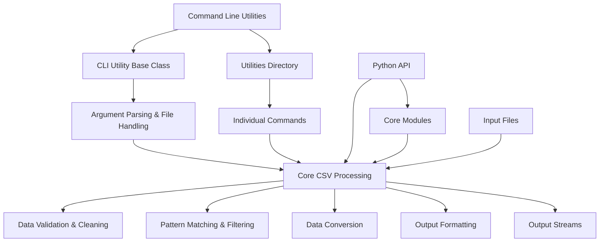

# `csvkit`

## Repository Overview

### Tree Structure
```
csvkit/
├── convert/
│   ├── __init__.py
│   └── [conversion utilities]
├── utilities/
│   ├── __init__.py
│   ├── csvclean.py
│   ├── csvcut.py
│   ├── csvformat.py
│   ├── csvgrep.py
│   ├── csvjoin.py
│   ├── csvlook.py
│   ├── csvpy.py
│   ├── csvsort.py
│   ├── csvstat.py
│   └── [other utility modules]
├── cleanup.py
├── cli.py
├── exceptions.py
└── grep.py
```

### Purpose
csvkit is a comprehensive command-line toolkit for processing and analyzing CSV data. It addresses the common need for efficient, flexible CSV manipulation without requiring programming knowledge. The repository provides both powerful command-line utilities and a robust Python API for developers who want to integrate CSV processing into larger applications.

Target users include data analysts, scientists, and developers who regularly work with CSV files and need tools for cleaning, filtering, transforming, and querying tabular data. The toolkit is particularly valuable for handling messy real-world data, performing batch operations, and integrating CSV workflows into automated pipelines.

In the broader ecosystem, csvkit serves as a standalone command-line tool suite that complements other data processing tools and libraries. It's designed to be lightweight, fast, and focused specifically on CSV operations, making it ideal for Unix-style data processing workflows.

### Architecture


The architecture follows a layered approach:
1. **Interface Layer**: Command-line utilities and Python API that provide user-facing entry points
2. **Core Infrastructure Layer**: Shared functionality for argument parsing, file handling, and CSV processing
3. **Processing Layer**: Fundamental CSV operations including validation, cleaning, filtering, and conversion
4. **Application Layer**: Specific utility implementations that leverage core functionality

Key architectural patterns include:
- Inheritance-based utility framework (CSVKitUtility base class)
- Plugin-like extension through utilities directory
- Separation of concerns between interface and implementation
- Support for compressed file formats through standard library integration

### Entry Points

#### Command-Line Interface
- **Individual utilities**: `csvclean`, `csvcut`, `csvgrep`, `csvjoin`, `csvlook`, etc.
- **Usage**: `csvcut -c 1,3 input.csv` or `cat input.csv | csvcut -c 1,3`
- **Audience**: Data analysts, system administrators, and power users who prefer command-line workflows

#### Python API
- **Module import**: `from csvkit import CSVKitUtility, RowChecker`
- **Core classes**: CSVKitUtility, RowChecker, FilteringCSVReader
- **Functions**: join_rows, various utility functions
- **Audience**: Developers integrating CSV processing into applications

### Core Features

1. **CSV Cleaning & Validation** - `cleanup.py` 
   - Detect and fix row length mismatches
   - Validate CSV structure and content

2. **Pattern-Based Filtering** - `grep.py`
   - Search CSV data using exact matches or regular expressions
   - Flexible matching criteria and output options

3. **Data Transformation** - Various utilities
   - Column selection (`csvcut`)
   - Data formatting (`csvformat`) 
   - Data joining (`csvjoin`)
   - Data sorting (`csvsort`)

4. **Data Analysis** - Statistical utilities
   - Column statistics (`csvstat`)
   - Data inspection (`csvlook`)

5. **Format Conversion** - `convert/` directory
   - Convert between CSV and other data formats
   - Handle various compression formats (gzip, bz2, xz)

### Dependencies

#### External Dependencies
- **argparse**: Command-line argument parsing
- **csv**: Standard library CSV processing
- **json**: JSON serialization/deserialization
- **sys**: System-specific parameters and functions
- **re**: Regular expression operations
- **gzip, bz2, lzma**: Compression library support for file formats
- **agate**: Data processing and type inference library

#### Internal Dependencies
- **csvkit.convert**: Data conversion utilities
- **csvkit.utilities**: Command-line utility implementations

### Configuration
Configuration is primarily handled through command-line arguments for utilities. Environment variables are not extensively used, but the system respects standard input/output streams and file encoding settings.

### Extension Points
- **Plugin Architecture**: New utilities can be added to the utilities/ directory
- **Custom Filters**: Pattern matching can be extended through custom implementations
- **New Converters**: Additional format converters can be added to the convert/ directory
- **Subclassing**: CSVKitUtility base class allows for custom utility creation

---

## Modules

- [`csvkit`](csvkit.md)
- [`csvkit/utilities`](csvkit/utilities.md)

