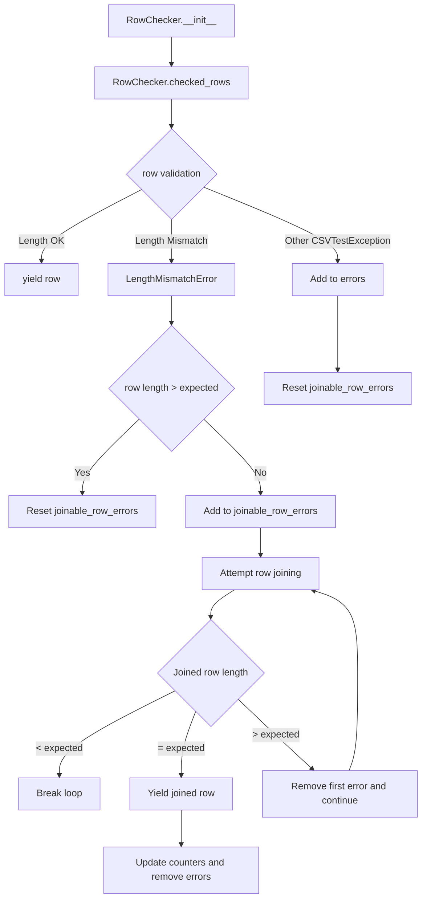

# `cleanup.py`

## `csvkit.cleanup.join_rows` · *function*

## Summary:
Joins multiple CSV rows into a single row by concatenating fields from successive rows.

## Description:
Combines multiple rows of CSV data into a single row by appending fields from subsequent rows to the last field of the previous row. This utility is particularly useful for handling CSV data where records are split across multiple lines or require field concatenation to reconstruct complete records.

## Args:
    rows (iterable): An iterable of CSV rows, where each row is a list of field values.
    joiner (str): String used to join fields from consecutive rows. Defaults to a single space ' '.

## Returns:
    list: A single joined row containing all fields from the input rows, with fields from subsequent rows appended to the last field of the previous row.

## Raises:
    None explicitly raised in the function body.

## Constraints:
    Preconditions:
    - The input `rows` must be iterable
    - The first row in `rows` must not be empty
    
    Postconditions:
    - The returned list contains all fields from all input rows
    - Fields from subsequent rows are concatenated to the last field of the previous row
    - Empty rows are handled by treating them as containing a single empty string

## Side Effects:
    None

## Control Flow:
```mermaid
flowchart TD
    A[Start join_rows] --> B[Convert rows to list]
    B --> C[Copy first row to fixed_row]
    C --> D{Has more rows?}
    D -->|Yes| E[Process each remaining row]
    E --> F{Current row empty?}
    F -->|Yes| G[Treat as ['']]
    F -->|No| H[Append row[0] to fixed_row[-1]]
    H --> I[Extend fixed_row with row[1:]]
    I --> J[Continue to next row]
    J --> D
    D -->|No| K[Return fixed_row]
```

## Examples:
    >>> join_rows([['A', 'B'], ['C', 'D']])
    ['A', 'B C', 'D']
    
    >>> join_rows([['Hello'], ['World', 'Test']])
    ['Hello World', 'Test']
    
    >>> join_rows([['A', 'B'], [], ['C']])
    ['A', 'B ', 'C']

## `csvkit.cleanup.RowChecker` · *class*

## Summary:
A CSV row validator and cleaner that checks row lengths against column headers and attempts to join mismatched rows.

## Description:
The RowChecker class is responsible for validating CSV rows against expected column counts and handling length mismatches by attempting to join rows that appear to be split across multiple lines. It's typically instantiated by CSV processing utilities that need to validate and clean CSV data before further processing.

This class serves as a distinct abstraction for CSV validation and row cleaning operations, enforcing the responsibility boundary of ensuring data consistency in CSV files. It handles both immediate validation errors and attempts to recover from certain types of row formatting issues through row joining logic.

## State:
- reader: A CSV reader object that provides access to the CSV data stream
- column_names: A list of column names extracted from the first row of the CSV, or an empty list if the CSV is empty
- errors: A list of CSVTestException objects collected during validation
- rows_joined: An integer counting the total number of rows that were successfully joined
- joins: An integer counting the total number of join operations performed

## Lifecycle:
- Creation: Instantiate with a CSV reader object that has already been initialized with CSV data
- Usage: Call the checked_rows() method to iterate over validated and cleaned rows
- Destruction: No explicit cleanup required; relies on Python's garbage collection

## Method Map:


## Raises:
- StopIteration: Raised internally during __init__ when the CSV reader is empty, caught and handled gracefully

## Example:
```python
import csv
from csvkit.cleanup import RowChecker

# Create a CSV reader
csv_data = [['name', 'age'], ['Alice', '25'], ['Bob', '30', 'extra_field']]
reader = csv.reader(csv_data)

# Create RowChecker instance
checker = RowChecker(reader)

# Process validated rows
for row in checker.checked_rows():
    print(row)

# Access collected errors and statistics
print(f"Errors: {len(checker.errors)}")
print(f"Rows joined: {checker.rows_joined}")
print(f"Total joins: {checker.joins}")
```

### `csvkit.cleanup.RowChecker.__init__` · *method*

## Summary:
Initializes a RowChecker instance with a CSV reader and sets up tracking attributes for CSV validation and cleanup operations.

## Description:
The RowChecker.__init__ method prepares the object for processing CSV data by storing the input reader and attempting to extract column names from the first row. It initializes tracking variables used for monitoring validation errors, row joining operations, and join statistics during CSV processing.

## Args:
    reader: A CSV reader iterator that yields rows of data (typically from csv.reader)

## Returns:
    None

## Raises:
    None explicitly raised

## State Changes:
    Attributes READ: None
    Attributes WRITTEN: 
        - self.reader: Assigned the input reader parameter for subsequent row iteration
        - self.column_names: Set to the first row from reader (containing column headers) or empty list if reader is empty
        - self.errors: Initialized as empty list for collecting validation errors during processing
        - self.rows_joined: Initialized to 0 for tracking total number of rows joined during processing
        - self.joins: Initialized to 0 for tracking number of join operations performed

## Constraints:
    Preconditions:
        - The reader parameter should be a valid iterator that yields sequences (rows) of CSV data
    Postconditions:
        - self.reader is assigned the input reader
        - self.column_names contains either the first row of data (column headers) or an empty list if no data exists
        - All tracking attributes are initialized to their default values (empty list for errors, zero for counters)

## Side Effects:
    None

### `csvkit.cleanup.RowChecker.checked_rows` · *method*

## Summary:
Generates validated CSV rows while attempting to fix length-mismatched rows by joining consecutive rows.

## Description:
Processes rows from a CSV reader, validating each row's column count against expected column names. When a row has a different column count, it raises a LengthMismatchError or attempts to join consecutive rows to reconstruct valid rows. This method is designed to handle CSV files where records may be split across multiple lines.

The method maintains state about validation errors and joins performed, making it suitable for batch CSV validation and repair operations. It's typically called during CSV processing pipelines where data integrity checking is required.

## Args:
    None

## Returns:
    Generator yielding list: Validated CSV rows, potentially including joined rows that were fixed by combining multiple short rows.

## Raises:
    LengthMismatchError: When a row has a different number of columns than expected during validation.
    CSVTestException: When other CSV validation errors occur during row processing.

## State Changes:
    Attributes READ: 
    - self.column_names: Used to validate row lengths
    - self.reader: Used to iterate through CSV rows and access line numbers
    - self.errors: Accumulates validation errors encountered
    - self.rows_joined: Tracks total rows joined during processing
    - self.joins: Tracks number of successful row join operations

    Attributes WRITTEN:
    - self.errors: Appends new validation errors
    - self.rows_joined: Increments when rows are successfully joined
    - self.joins: Increments when a join operation completes successfully

## Constraints:
    Preconditions:
    - self.column_names must be initialized with column header names
    - self.reader must be a valid CSV reader object with line_num attribute
    - self.errors, self.rows_joined, and self.joins must be initialized as instance variables

    Postconditions:
    - All yielded rows will have the same length as self.column_names
    - Errors are accumulated in self.errors for later analysis
    - Join statistics (self.rows_joined, self.joins) are updated appropriately

## Side Effects:
    - Reads from the underlying CSV reader
    - Modifies self.errors, self.rows_joined, and self.joins attributes
    - May yield modified rows that combine data from multiple input rows

