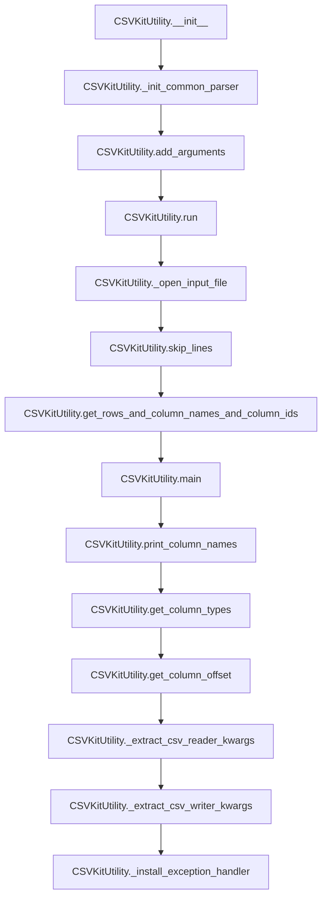

# `cli.py`

## `csvkit.cli.LazyFile` · *class*

## Summary:
A lazy file wrapper that delays file opening until the first access to the file's contents.

## Description:
The LazyFile class serves as a proxy for file-like objects, implementing lazy initialization to defer actual file opening until the file is first accessed. This pattern is useful for avoiding unnecessary file operations when a file handle might not be used, or when dealing with potentially large files where opening should be postponed until needed. The class implements Python's iterator protocol and provides transparent access to the underlying file's methods and attributes.

## State:
- init: callable, stores the constructor function for creating the underlying file object
- f: file-like object or None, holds the actual file handle once opened
- _is_lazy_opened: bool, tracks whether the file has been opened yet
- _lazy_args: tuple, stores positional arguments for the file constructor
- _lazy_kwargs: dict, stores keyword arguments for the file constructor

## Lifecycle:
- Creation: Instantiate with a callable `init` and any arguments needed to create the file object
- Usage: Access methods or iterate over the object; file opens automatically on first access
- Destruction: Call close() method or rely on context manager protocol if implemented elsewhere

## Method Map:
```mermaid
graph TD
    A[LazyFile.__init__] --> B{__getattr__ or __next__}
    B --> C[_open]
    C --> D[init(*_lazy_args, *_lazy_kwargs)]
    D --> E[f = file_object]
    E --> F[__getattr__ delegates to f]
    F --> G[__next__ delegates to f]
```

## Raises:
- None explicitly raised by __init__
- Exceptions from the underlying file constructor or methods are propagated through normal Python exception handling

## Example:
```python
# Create a lazy file for a gzipped CSV file
import gzip
lazy_file = LazyFile(gzip.open, 'data.csv.gz', 'rt')

# File is not opened yet
# Iterate over lines (file opens automatically)
for line in lazy_file:
    print(line.strip())

# Explicit close when done
lazy_file.close()
```

### `csvkit.cli.LazyFile.__init__` · *method*

## Summary:
Initializes a LazyFile object that defers actual file opening until first access.

## Description:
The LazyFile constructor sets up the object for lazy initialization, storing the initialization function and its arguments without immediately opening the file. This pattern allows for efficient resource management by only opening files when they are actually needed.

## Args:
    init (callable): A callable that creates a file-like object when invoked with the provided arguments
    *args: Positional arguments to pass to the init callable when opening the file
    **kwargs: Keyword arguments to pass to the init callable when opening the file

## Returns:
    None

## Raises:
    None

## State Changes:
    Attributes READ: None
    Attributes WRITTEN: 
    - self.init: Stores the initialization function
    - self.f: Initializes to None (file handle)
    - self._is_lazy_opened: Initializes to False (tracking if file is opened)
    - self._lazy_args: Stores positional arguments for lazy initialization
    - self._lazy_kwargs: Stores keyword arguments for lazy initialization

## Constraints:
    Preconditions:
    - The init parameter must be a callable that returns a file-like object when invoked
    - The *args and **kwargs must be compatible with the init callable's signature
    
    Postconditions:
    - self.init contains the provided initialization function
    - self.f is initialized to None
    - self._is_lazy_opened is initialized to False
    - self._lazy_args and self._lazy_kwargs store the provided arguments for later use

## Side Effects:
    None

### `csvkit.cli.LazyFile.__getattr__` · *method*

*No documentation generated.*

### `csvkit.cli.LazyFile.__iter__` · *method*

*No documentation generated.*

### `csvkit.cli.LazyFile.close` · *method*

## Summary:
Closes a lazily opened file handle and resets internal state tracking.

## Description:
Closes the underlying file handle associated with this LazyFile instance if it was previously opened. This method ensures proper resource cleanup by closing the file and resetting internal state flags. It is typically called during object destruction or explicit cleanup operations to prevent resource leaks.

## Args:
    None: This method takes no parameters beyond the implicit self reference.

## Returns:
    None: This method does not return a value.

## Raises:
    AttributeError: If the underlying file handle does not have a close method (though this would be unusual for a proper file-like object).

## State Changes:
    Attributes READ: self._is_lazy_opened, self.f
    Attributes WRITTEN: self.f, self._is_lazy_opened

## Constraints:
    Preconditions: The LazyFile instance must have been properly initialized.
    Postconditions: If the file was open, self.f will be None and self._is_lazy_opened will be False.

## Side Effects:
    I/O operations: Closes the underlying file handle if it was open.
    Mutates internal state: Clears the file handle reference and resets the lazy open flag.

### `csvkit.cli.LazyFile.__next__` · *method*

## Summary:
Returns the next line from a lazily-opened file object, with null characters removed.

## Description:
This method implements the iterator protocol's `__next__` magic method for the LazyFile class. It ensures the underlying file is opened (if not already open), retrieves the next line from the file object, and removes any null characters ('\0') from the line before returning it. This allows for lazy loading of files while providing a clean interface for iteration over file contents.

## Args:
    None

## Returns:
    str: The next line from the file with null characters replaced by empty strings.

## Raises:
    StopIteration: When the file has been completely read and there are no more lines to return.

## State Changes:
    Attributes READ: self.f, self._is_lazy_opened
    Attributes WRITTEN: self.f, self._is_lazy_opened (via self._open())

## Constraints:
    Preconditions: The LazyFile instance must have been initialized with a callable that can create a file-like object.
    Postconditions: The file will be opened if it wasn't already, and the next line will be returned with null characters stripped.

## Side Effects:
    I/O operations: Opens the file if it hasn't been opened yet, and reads from the file.
    Mutates internal state: Sets self.f and self._is_lazy_opened when opening the file for the first time.

### `csvkit.cli.LazyFile._open` · *method*

## Summary:
Opens a lazily-initialized file handle by invoking the initialization function with stored arguments.

## Description:
This method implements lazy file opening behavior, deferring actual file creation until the file is first accessed. It is automatically called by other methods in the LazyFile class when file access is required but the file hasn't been opened yet. The method ensures that the file is opened exactly once, even if multiple accesses occur.

## Args:
    None: This method takes no parameters beyond the implicit self reference.

## Returns:
    None: This method does not return a value.

## Raises:
    None explicitly raised by this method, though the underlying init function may raise exceptions during file creation.

## State Changes:
    Attributes READ: 
        - self._is_lazy_opened: Checks if the file has already been opened
        - self.init: Callable used to create the file handle
        - self._lazy_args: Positional arguments for the init callable
        - self._lazy_kwargs: Keyword arguments for the init callable
    
    Attributes WRITTEN:
        - self.f: Assigned the result of calling self.init() with stored arguments
        - self._is_lazy_opened: Set to True to indicate the file is now opened

## Constraints:
    Preconditions:
        - The LazyFile instance must have been properly initialized with an init callable and arguments
        - self.init must be a callable that returns a file-like object when invoked with the stored arguments
    
    Postconditions:
        - If not previously opened, self.f will contain a file-like object returned by self.init()
        - self._is_lazy_opened will be True after execution

## Side Effects:
    - May perform I/O operations when self.init() is called (e.g., opening a file)
    - May raise exceptions from the underlying file initialization process

## `csvkit.cli.CSVKitUtility` · *class*

## Summary:
Base class for CSVKit command-line utilities that provides common argument parsing, file handling, and CSV processing functionality.

## Description:
CSVKitUtility serves as the foundation for all command-line utilities in the csvkit library. It standardizes argument parsing, file I/O operations, and CSV processing behaviors across different tools. Subclasses must implement the `add_arguments()` and `main()` methods to define their specific functionality while inheriting common CSV handling capabilities.

This class manages command-line argument parsing using argparse, handles various CSV file formats (including compressed files with .gz, .bz2, and .xz extensions), and provides utility methods for column processing, type inference, and error handling. It ensures consistent behavior across all csvkit command-line tools.

## State:
- description (str): Class-level description used in argument parser (default: empty string)
- epilog (str): Class-level epilog text used in argument parser (default: empty string)
- override_flags (str): String of flag characters to exclude from argument parsing (default: empty string)
- argparser (argparse.ArgumentParser): Argument parser instance configured with common CSV options
- args (argparse.Namespace): Parsed command-line arguments
- output_file (file-like object): Output destination (defaults to sys.stdout)
- reader_kwargs (dict): Keyword arguments for CSV reader construction derived from parsed arguments
- writer_kwargs (dict): Keyword arguments for CSV writer construction derived from parsed arguments
- input_file (file-like object): Input file handle (set during execution by _open_input_file method)

## Lifecycle:
- Creation: Instantiate with optional args list and output_file parameter
  - Initializes common argument parser
  - Calls add_arguments() to allow subclasses to add custom arguments
  - Parses arguments using argparse
  - Sets up output file handle
  - Extracts CSV reader and writer configuration
  - Installs custom exception handler
  - Sets up SIGPIPE signal handling
- Usage: Call run() method to execute the utility
  - Opens input file if not overridden by 'f' flag
  - Executes main() method with warning handling
  - Ensures proper file closure in finally block
- Destruction: Automatic cleanup of file handles via context managers and finally blocks

## Method Map:


## Raises:
- NotImplementedError: Raised by add_arguments() and main() methods when not overridden by subclasses
- ValueError: Raised by skip_lines() when skip_lines argument is not an integer
- RequiredHeaderError: Raised by print_column_names() when --no-header-row is used with -n/--names options
- UnicodeDecodeError: Handled by custom exception handler for encoding issues

## Example:
```python
# Basic usage pattern for a subclass
class MyCSVTool(CSVKitUtility):
    def add_arguments(self):
        self.argparser.add_argument('--custom-option', dest='custom_option', help='Custom option')
    
    def main(self):
        # Process CSV data using inherited methods
        rows, column_names, column_ids = self.get_rows_and_column_names_and_column_ids(**self.reader_kwargs)
        # Custom processing logic here
        
# Usage from command line:
# python my_tool.py input.csv --custom-option value
```

### `csvkit.cli.CSVKitUtility.__init__` · *method*

## Summary:
Initializes a CSVKit utility instance by setting up argument parsing, configuring output handling, and preparing CSV processing parameters.

## Description:
This constructor method initializes the CSVKit utility by performing several key setup operations in sequence. First, it initializes a common argument parser with standard CSV processing options using _init_common_parser(). Then it adds utility-specific arguments by calling the abstract add_arguments() method. Next, it parses command line arguments and configures the output file handle. It extracts CSV reader and writer parameters for subsequent CSV processing operations. Finally, it installs a custom exception handler and configures SIGPIPE signal handling to prevent broken pipe errors.

This initialization method ensures consistent setup across all CSVKit utilities while allowing for specific implementations through the abstract add_arguments() method that subclasses must implement. The method prepares the instance for actual CSV processing operations that occur later in the utility's execution lifecycle.

## Args:
    args (list[str], optional): Command line arguments to parse. If None, uses sys.argv[1:]. Defaults to None.
    output_file: File-like object to write output to. If None, defaults to sys.stdout. Defaults to None.

## Returns:
    None: This method initializes the instance and does not return a value.

## Raises:
    None explicitly raised by this method, though underlying argument parsing may raise argparse.ArgumentError.

## State Changes:
    Attributes READ: 
        - self.override_flags (if defined in subclass)
        - self.description (if defined in subclass)
        - self.epilog (if defined in subclass)
    
    Attributes WRITTEN:
        - self.argparser: Initialized with common argument parser
        - self.args: Parsed command line arguments
        - self.output_file: Set to sys.stdout or provided output_file
        - self.reader_kwargs: Extracted CSV reader configuration from parsed arguments
        - self.writer_kwargs: Extracted CSV writer configuration from parsed arguments

## Constraints:
    Preconditions:
        - The class must define self.override_flags, self.description, and self.epilog (if applicable)
        - Subclasses must implement add_arguments() method
        - The class must have a _init_common_parser() method available
        
    Postconditions:
        - self.argparser is initialized with standard CSV arguments
        - self.args contains parsed command line arguments
        - self.output_file is properly configured
        - self.reader_kwargs and self.writer_kwargs contain CSV processing parameters
        - Exception handler is installed via _install_exception_handler()
        - SIGPIPE signal handling is configured

## Side Effects:
    - Initializes argparse.ArgumentParser instance
    - Sets sys.excepthook to custom exception handler installed via _install_exception_handler()
    - Attempts to configure signal.SIGPIPE handling to prevent broken pipe errors
    - May modify global sys.stdout/stderr behavior through exception handler installation

### `csvkit.cli.CSVKitUtility.add_arguments` · *method*

## Summary:
Adds utility-specific command-line arguments to the argument parser for CSVKit utilities.

## Description:
This abstract method serves as an extension point for subclasses of CSVKitUtility to define their specific command-line interface. It is called during the initialization phase of CSVKit utilities to register additional arguments beyond the common CSV processing options provided by the base class.

The method is invoked in the `__init__` method of CSVKitUtility after initializing the common argument parser but before parsing the command-line arguments. Subclasses must implement this method to add their unique command-line options and flags.

## Args:
    None: This method takes no parameters beyond the implicit self reference.

## Returns:
    None: This method does not return a value.

## Raises:
    NotImplementedError: Always raised by the base class implementation, requiring subclasses to provide their own implementation.

## State Changes:
    Attributes READ: 
        - self.argparser: The argument parser instance that arguments are added to
    
    Attributes WRITTEN:
        - self.argparser: Modified by adding new arguments via argparse.add_argument() calls

## Constraints:
    Preconditions:
        - Must be called on an instance of a subclass of CSVKitUtility
        - The argparser attribute must be initialized (typically by _init_common_parser())
        
    Postconditions:
        - The argparser instance contains both common CSV arguments and subclass-specific arguments
        - No validation is performed on the argument definitions themselves

## Side Effects:
    - Modifies the self.argparser instance by adding new argument definitions
    - No external I/O or service calls are made
    - No modifications to objects outside the instance

### `csvkit.cli.CSVKitUtility.run` · *method*

## Summary:
Executes the CSVKit utility by managing input file lifecycle, handling warnings, and invoking the core processing logic.

## Description:
The run method serves as the primary execution entry point for CSVKit command-line utilities. It coordinates the setup and teardown of input file resources, configures warning handling for the agate library, and delegates to the abstract main() method that contains the specific utility logic. This method ensures proper resource management through try/finally blocks and handles special cases for stdin and compressed file inputs.

## Args:
    None explicitly taken as arguments, but operates on self instance state

## Returns:
    None

## Raises:
    Any exceptions raised by self.main() or underlying file operations

## State Changes:
    Attributes READ: self.override_flags, self.args.input_path, self.args.no_header_row
    Attributes WRITTEN: self.input_file (only when 'f' is not in override_flags)

## Constraints:
    Preconditions:
    - self.override_flags must be initialized (typically set in __init__)
    - self.args must be parsed and available
    - self._open_input_file method must be implemented
    - self.main method must be implemented by subclasses
    
    Postconditions:
    - Input file is properly opened and closed (when applicable)
    - Warning filters are appropriately configured
    - Main processing logic is executed

## Side Effects:
    - Opens and closes file handles when 'f' is not in override_flags
    - Configures warning filters for agate library
    - Calls the abstract main() method which may perform various operations
    - May reconfigure sys.stdin encoding when reading from stdin

### `csvkit.cli.CSVKitUtility.main` · *method*

## Summary:
Abstract method that must be implemented by subclasses to provide specific CSV processing functionality.

## Description:
This method serves as the entry point for implementing specific CSV processing operations in subclasses of CSVKitUtility. It is called by the base class's `run()` method during the execution lifecycle. The method is intentionally left unimplemented in the base class to enforce that each concrete CSV utility must define its own specific behavior.

## Args:
    self: The instance of the subclass that implements this method.

## Returns:
    This method does not return a value directly. Its implementation varies by subclass and typically processes CSV data according to the specific utility's purpose.

## Raises:
    NotImplementedError: Always raised by the base class implementation, indicating that subclasses must override this method.

## State Changes:
    Attributes READ: 
    - self.args: Command-line arguments parsed by the argument parser
    - self.input_file: Input file handle (when not overridden by flags)
    - self.output_file: Output file handle
    
    Attributes WRITTEN:
    - None (this method is abstract and doesn't modify state directly)

## Constraints:
    Preconditions:
    - This method must be overridden by subclasses
    - Subclasses should ensure proper handling of self.args and self.input_file
    - The method should not assume specific argument values without checking
    
    Postconditions:
    - The method should complete its processing without raising NotImplementedError
    - Subclasses should properly handle input/output operations

## Side Effects:
    - I/O operations on input and output files
    - Potential external service calls depending on subclass implementation
    - Modifications to the output stream (self.output_file)

### `csvkit.cli.CSVKitUtility._init_common_parser` · *method*

## Summary:
Initializes a common argument parser with standard CSV processing options for CLI utilities.

## Description:
Configures an argparse.ArgumentParser instance with commonly used CSV file processing flags and options. This method sets up command-line argument parsing for CSV utilities, providing standardized options for handling various CSV formats and encoding settings. The parser is stored in self.argparser for later use in argument parsing.

## Args:
    self: The CSVKitUtility instance containing configuration attributes

## Returns:
    None: This method modifies the instance state by setting self.argparser

## Raises:
    None explicitly raised

## State Changes:
    Attributes READ: self.description, self.epilog, self.override_flags
    Attributes WRITTEN: self.argparser

## Constraints:
    Preconditions: The instance must have description, epilog, and override_flags attributes defined
    Postconditions: self.argparser will be set to an argparse.ArgumentParser instance with configured arguments

## Side Effects:
    None: This method only configures the argument parser and doesn't perform I/O operations or external service calls

### `csvkit.cli.CSVKitUtility._open_input_file` · *method*

## Summary:
Opens and returns a file-like object for CSV input, supporting stdin, compressed files, and regular files with lazy loading.

## Description:
This method provides a unified interface for opening input files for CSV processing. It handles special cases such as standard input (when path is '-' or None) and various compressed file formats (.gz, .bz2, .xz). For regular files, it returns a LazyFile wrapper that defers actual file opening until the first access, improving performance for potentially large files.

## Args:
    path (str, optional): Path to the input file. If None or '-', reads from standard input.
    opened (bool): Flag indicating if the file is already opened. Defaults to False.

## Returns:
    file-like object: A file handle that can be used for reading CSV data. Returns sys.stdin for stdin input, or a LazyFile wrapper for regular files.

## Raises:
    None explicitly raised by this method. Exceptions from underlying file operations are propagated normally.

## State Changes:
    Attributes READ: self.args.encoding
    Attributes WRITTEN: None

## Constraints:
    Preconditions: 
    - self.args.encoding must be set to a valid encoding string
    - path parameter should be a string or None
    
    Postconditions:
    - Returns a valid file-like object that supports iteration and readline operations
    - For stdin, the encoding is properly configured via sys.stdin.reconfigure()
    - For regular files, returns a LazyFile wrapper that will open the file on first access

## Side Effects:
    - Configures sys.stdin encoding when reading from stdin
    - May open files on first access when LazyFile is used (lazy loading)
    - No other external I/O or state changes beyond returning file handles

### `csvkit.cli.CSVKitUtility._extract_csv_reader_kwargs` · *method*

## Summary:
Extracts CSV reader configuration parameters from command-line arguments for use in CSV processing operations.

## Description:
This method processes command-line arguments to construct a dictionary of keyword arguments suitable for configuring CSV readers. It handles delimiter specification, quoting options, and header row settings based on user-provided CLI flags. The extracted parameters are used to configure CSV parsing behavior in downstream operations.

## Args:
    None (reads from self.args)

## Returns:
    dict: A dictionary containing CSV reader configuration parameters including:
        - delimiter: Character used to separate fields (tab or custom delimiter)
        - quotechar: Character used to quote fields
        - quoting: Quoting style to use
        - doublequote: Whether to interpret double quotes as escape characters
        - escapechar: Character used to escape special characters
        - field_size_limit: Maximum field size limit
        - skipinitialspace: Whether to skip leading whitespace in fields
        - header: Boolean indicating whether the first row contains headers

## Raises:
    None explicitly raised

## State Changes:
    Attributes READ: self.args.tabs, self.args.delimiter, self.args.quotechar, self.args.quoting, self.args.doublequote, self.args.escapechar, self.args.field_size_limit, self.args.skipinitialspace, self.args.no_header_row
    Attributes WRITTEN: None

## Constraints:
    Preconditions: 
    - self.args must be an object with the expected attributes (tabs, delimiter, quotechar, quoting, doublequote, escapechar, field_size_limit, skipinitialspace, no_header_row)
    - All referenced attributes should be accessible via getattr
    
    Postconditions:
    - Returns a dictionary with only non-None values for the processed arguments
    - The returned dictionary is suitable for passing as **kwargs to CSV reader constructors

## Side Effects:
    None

### `csvkit.cli.CSVKitUtility._extract_csv_writer_kwargs` · *method*

## Summary:
Extracts CSV writer keyword arguments from command-line arguments for configuring line number output.

## Description:
This method processes the command-line arguments stored in `self.args` to extract configuration options specifically for CSV writer operations. It currently only handles the `line_numbers` option, which when enabled, configures the CSV writer to include line numbers in the output.

## Args:
    None

## Returns:
    dict: A dictionary containing CSV writer keyword arguments. Currently only includes 'line_numbers' key when the line_numbers command-line argument is set to True.

## Raises:
    None explicitly raised

## State Changes:
    Attributes READ: 
    - self.args.line_numbers
    
    Attributes WRITTEN: None

## Constraints:
    Preconditions:
    - self.args must be initialized and contain the 'line_numbers' attribute
    - The method assumes that if 'line_numbers' exists in self.args, it's a boolean-like value
    
    Postconditions:
    - Returns a dictionary with writer configuration options
    - The returned dictionary is suitable for passing to CSV writer constructors

## Side Effects:
    None

### `csvkit.cli.CSVKitUtility._install_exception_handler` · *method*

## Summary:
Installs a custom exception handler that provides user-friendly error messages for common CSV processing issues.

## Description:
Configures the system's exception hook to display more informative error messages to users when exceptions occur during CSV processing. This method is automatically called during initialization of CSVKitUtility subclasses and enhances the user experience by providing context-specific error messages, particularly for encoding issues.

## Args:
    None

## Returns:
    None

## Raises:
    None

## State Changes:
    Attributes READ: self.args.verbose, self.args.encoding
    Attributes WRITTEN: sys.excepthook

## Constraints:
    Preconditions: 
    - self.args must be initialized (available after argparser.parse_args())
    - The method must be called after the argument parser has been set up
    
    Postconditions:
    - sys.excepthook is replaced with a custom handler function
    - The custom handler will be invoked whenever an unhandled exception occurs

## Side Effects:
    - Modifies the global sys.excepthook
    - Writes error messages to stderr
    - May write detailed traceback information to stderr when verbose mode is enabled

### `csvkit.cli.CSVKitUtility.get_column_types` · *method*

## Summary:
Constructs and returns an agate.TypeTester instance configured with appropriate data type inference rules based on command-line arguments.

## Description:
This method builds a collection of agate data type testers that will be used to automatically infer column data types when processing CSV files. The configuration respects various command-line flags such as --blanks, --null-value, --no-inference, --date-format, and --datetime-format to customize how data type inference behaves.

The method is part of the CSVKitUtility base class and provides a standardized way for subclasses to configure type inference behavior. It's designed to be called during CSV processing operations where automatic data type detection is needed.

## Args:
    None - This is a method that operates on self and uses self.args

## Returns:
    agate.TypeTester: An agate TypeTester instance configured with a list of data type testers in priority order. The tester will attempt to infer column types in the following order:
        - Boolean (for boolean-like values)
        - TimeDelta (for time duration values)
        - Date (when --date-format is specified)
        - DateTime (when --datetime-format is specified)
        - Number (when no date formats are specified, inserted at position 1)
        - Number (when date formats are specified, inserted at position -1)
        - Text (fallback type)

## Raises:
    None explicitly raised - though underlying agate operations may raise exceptions

## State Changes:
    Attributes READ: 
        - self.args.blanks
        - self.args.null_values  
        - self.args.no_inference
        - self.args.locale
        - self.args.date_format
        - self.args.datetime_format

    Attributes WRITTEN: None

## Constraints:
    Preconditions:
        - self.args must be initialized (typically by CSVKitUtility.__init__)
        - The args object must have the attributes referenced by getattr() calls
        
    Postconditions:
        - Returns a valid agate.TypeTester instance
        - The returned TypeTester is configured according to command-line argument settings

## Side Effects:
    None - This method is pure and doesn't perform I/O or mutate external state

### `csvkit.cli.CSVKitUtility.get_column_offset` · *method*

## Summary:
Returns the column offset (0 or 1) based on the zero-based command-line flag setting.

## Description:
Determines whether column indices should be treated as zero-based (0) or one-based (1) when processing CSV column identifiers. This method centralizes the logic for handling different column indexing conventions, making it easier to maintain consistency across the CSVKit utilities.

This method is called during column parsing operations to ensure that column identifiers are interpreted correctly according to user preferences. When the `--zero` command-line flag is specified, column indices are treated as zero-based; otherwise, they are treated as one-based.

## Args:
    None

## Returns:
    int: 0 if `self.args.zero_based` is True, 1 otherwise

## Raises:
    None

## State Changes:
    Attributes READ: self.args.zero_based
    Attributes WRITTEN: None

## Constraints:
    Preconditions: 
    - The CSVKitUtility instance must have been initialized with arguments parsed by argparser
    - The `zero_based` attribute must be available in `self.args`
    
    Postconditions:
    - Returns either 0 or 1 as the column offset value
    - Does not modify any instance state

## Side Effects:
    None

### `csvkit.cli.CSVKitUtility.skip_lines` · *method*

## Summary:
Skips a specified number of lines from the beginning of the input file and returns the file object.

## Description:
This method advances the input file pointer by skipping the number of lines specified in the `--skip-lines` command-line argument. It's designed to handle CSV files that contain initial comment lines, copyright notices, or other non-data content that should be ignored during processing. The method modifies the internal `skip_lines` argument counter during execution to track progress through the skip process.

This logic is encapsulated in its own method rather than being inlined because it's reused by multiple CSV processing methods (`get_rows_and_column_names_and_column_ids` and `print_column_names`) and provides a clean abstraction for handling file skipping operations.

## Args:
    None (uses self.args.skip_lines internally)

## Returns:
    file-like object: The input file object positioned after the skipped lines

## Raises:
    ValueError: When the `skip_lines` argument is not an integer type

## State Changes:
    Attributes READ: 
        - self.args.skip_lines
        - self.input_file
    Attributes WRITTEN: 
        - self.args.skip_lines (decremented during execution)

## Constraints:
    Preconditions:
        - The CSVKitUtility instance must be properly initialized with input_file and args
        - The `skip_lines` argument must be an integer if specified
        - The input file must be readable and contain at least the specified number of lines
        
    Postconditions:
        - The input file pointer is advanced by the specified number of lines
        - The `skip_lines` argument counter is decremented to zero
        - The method returns the input file object ready for subsequent reading operations

## Side Effects:
    File I/O: Reads from self.input_file using readline() method
    State Mutation: Modifies self.args.skip_lines during execution

### `csvkit.cli.CSVKitUtility.get_rows_and_column_names_and_column_ids` · *method*

## Summary:
Processes CSV input to extract rows iterator, column names, and column ID mappings for further data processing.

## Description:
This method serves as a foundational data preparation step for CSV processing utilities. It reads CSV data from the input file (skipping specified lines), determines column structure from the header row, and prepares column identifier mappings for subsequent operations. The method handles various CSV configurations including files with and without header rows, and supports flexible column selection through command-line arguments.

The method is designed to be reusable across different CSVKit utilities that need to process CSV data with consistent column handling logic. It encapsulates the complexity of CSV row iteration, header detection, and column identifier resolution into a single, well-defined interface.

## Args:
    **kwargs: Additional keyword arguments passed to the underlying CSV reader for configuration (e.g., delimiter, quotechar).

## Returns:
    tuple: A 3-tuple containing:
        - rows (iterator): An iterator over CSV rows, with proper handling of header rows
        - column_names (list[str]): List of column names extracted from the header row or generated defaults
        - column_ids (list[int]): List of zero-based column indices selected based on command-line column specifications

## Raises:
    None explicitly raised by this method. However, underlying functions may raise:
        - ColumnIdentifierError: When column identifiers cannot be resolved
        - StopIteration: When CSV file is empty

## State Changes:
    Attributes READ: 
        - self.args.no_header_row
        - self.args.columns
        - self.args.not_columns
        - self.args.zero_based
        - self.args.skip_lines
    Attributes WRITTEN: None

## Constraints:
    Preconditions:
        - The CSVKitUtility instance must be properly initialized with input_file and args
        - self.args.skip_lines must be an integer if set
        - Column identifiers in self.args.columns must be resolvable to actual columns
        
    Postconditions:
        - Returns a valid 3-tuple with rows iterator, column names list, and column IDs list
        - If CSV is empty, returns empty iterators/lists
        - Column names are properly formatted regardless of header presence
        - Column IDs are zero-based indices suitable for array access

## Side Effects:
    - Reads from self.input_file (file I/O operation)
    - May modify self.args.skip_lines during execution (through skip_lines method)
    - No external service calls or mutations to objects outside self

### `csvkit.cli.CSVKitUtility.print_column_names` · *method*

## Summary:
Prints column names from a CSV file with numbered indices to the output file.

## Description:
Displays the column headers of a CSV file with sequential numbering, allowing users to see column names and their positions. This method is typically invoked when the `-n` or `--names` command-line option is specified, enabling users to inspect the structure of a CSV file without processing its data.

The method handles special command-line flags such as `--no-header-row` and `--zero` to control formatting and numbering behavior. It reads the first row of the CSV file after skipping any initial lines specified by `--skip-lines`.

## Args:
    None (uses self.args, self.reader_kwargs, self.output_file, and self.input_file)

## Returns:
    None

## Raises:
    RequiredHeaderError: When the `--no-header-row` flag is used in combination with the `-n` or `--names` options, as these are mutually exclusive.

## State Changes:
    Attributes READ: 
    - self.args.no_header_row
    - self.args.zero_based
    - self.reader_kwargs
    - self.output_file
    - self.input_file
    
    Attributes WRITTEN: 
    - None

## Constraints:
    Preconditions:
    - The CSVKitUtility instance must have been properly initialized with parsed arguments
    - The input file must be readable and contain at least one row of data
    - The `--no-header-row` and `-n/--names` flags cannot be used simultaneously
    - The `--skip-lines` argument must be a valid integer
    
    Postconditions:
    - Column names are written to self.output_file in the format "XXX: column_name"
    - The first row of the CSV file is consumed and processed
    - The specified number of initial lines are skipped from the input file

## Side Effects:
    I/O: Writes formatted column name information to self.output_file
    File Operations: Reads from self.input_file after skipping lines specified by --skip-lines
    State Mutation: Modifies self.args.skip_lines during the skip_lines() call

### `csvkit.cli.CSVKitUtility.additional_input_expected` · *method*

## Summary:
Determines whether additional input is expected from standard input when no explicit input file is provided.

## Description:
This method evaluates whether the application should expect input from stdin by checking if stdin is connected to a terminal (TTY) and no input file path was specified. This is used primarily for determining appropriate behavior when processing CSV data from pipes or interactive sessions.

The method is called during the initialization phase of CSVKit utilities to determine if the application should attempt to read from stdin when no explicit input file is provided via command line arguments.

## Args:
    None

## Returns:
    bool: True if stdin is connected to a terminal (indicating interactive use) and no input file path was specified, False otherwise.

## Raises:
    None

## State Changes:
    Attributes READ: 
        - self.args.input_path: The command line argument specifying the input file path
    Attributes WRITTEN: None

## Constraints:
    Preconditions:
        - The CSVKitUtility instance must have been initialized with command line arguments
        - The self.args attribute must be populated with parsed arguments
    Postconditions:
        - Returns a boolean value indicating whether additional input is expected from stdin

## Side Effects:
    None

## Usage Context:
This method is typically called during the initialization or setup phase of CSVKit utilities to determine appropriate input handling behavior. When True is returned, it indicates that the application should prompt for user input or expect piped data, rather than trying to process a file that wasn't specified.

## `csvkit.cli.isatty` · *function*

block.
ACTION: WRITE
<DOCUMENTATION>
## Summary:
Determines whether a file-like object is connected to a terminal device.

## Description:
Safely checks if a file-like object is connected to a terminal (TTY) by calling its isatty() method. This function gracefully handles closed files by catching ValueError exceptions and returning False.

## Args:
    f: A file-like object that supports the isatty() method

## Returns:
    bool: True if the file is connected to a terminal, False otherwise. Returns False when the file is closed or when an I/O error occurs.

## Raises:
    None: This function catches and handles ValueError internally

## Constraints:
    Preconditions: The argument must be a file-like object that implements the isatty() method
    Postconditions: Always returns a boolean value

## Side Effects:
    None: This function performs no I/O operations beyond calling the isatty() method on the input

## Control Flow:
```mermaid
flowchart TD
    A[Call isatty(f)] --> B{f.isatty() succeeds?}
    B -- Yes --> C[Return f.isatty()]
    B -- No --> D{Exception is ValueError?}
    D -- Yes --> E[Return False]
    D -- No --> F[Raise exception]
```

## Examples:
    # Check if stdout is connected to a terminal
    if isatty(sys.stdout):
        print("Output goes to terminal")
    else:
        print("Output redirected to file")
        
    # Check a file handle
    with open('test.txt', 'r') as f:
        if isatty(f):
            print("File is a TTY")
        else:
            print("File is not a TTY")

## `csvkit.cli.default_str_decimal` · *function*

## Summary:
Converts datetime and decimal objects to JSON-serializable string representations.

## Description:
A custom JSON encoder default handler that converts datetime.date, datetime.datetime, and decimal.Decimal objects to their string representations. This function is intended to be used as the `default` parameter in `json.dumps()` calls to handle non-standard JSON-serializable types.

## Args:
    obj (Any): The object to convert to a JSON-serializable format.

## Returns:
    str: The ISO format string representation of datetime objects or string representation of decimal objects.

## Raises:
    TypeError: When the object is not a datetime.date, datetime.datetime, or decimal.Decimal instance.

## Constraints:
    Precondition: The input object must be one of the supported types (datetime.date, datetime.datetime, or decimal.Decimal).
    Postcondition: If successful, returns a string representation of the object.

## Side Effects:
    None

## Control Flow:
```mermaid
flowchart TD
    A[default_str_decimal] --> B{isinstance(obj, datetime.date<br/>or datetime.datetime)}
    B -- Yes --> C[obj.isoformat()]
    B -- No --> D{isinstance(obj, decimal.Decimal)}
    D -- Yes --> E[str(obj)]
    D -- No --> F[raise TypeError]
```

## Examples:
```python
import json
import datetime
import decimal

# Valid usage
dt = datetime.datetime(2023, 1, 1, 12, 0, 0)
result = default_str_decimal(dt)  # Returns "2023-01-01T12:00:00"

dec = decimal.Decimal('123.45')
result = default_str_decimal(dec)  # Returns "123.45"

# Error case
try:
    default_str_decimal([1, 2, 3])
except TypeError as e:
    print(e)  # Prints: '[1, 2, 3] is not JSON serializable'
```

## `csvkit.cli.default_float_decimal` · *function*

## Summary:
Converts decimal.Decimal objects to float while delegating other types to default_str_decimal for JSON serialization.

## Description:
This function serves as a custom JSON encoder default handler that specifically converts decimal.Decimal objects to float values. For all other object types, it delegates to the default_str_decimal function which handles datetime.date, datetime.datetime, and decimal.Decimal objects by converting them to their string representations. This function is designed to be used as the `default` parameter in `json.dumps()` calls to ensure proper serialization of mixed data types containing decimals, with special handling for decimal values to preserve numeric precision in float form.

## Args:
    obj (Any): The object to convert to a JSON-serializable format.

## Returns:
    float or str: Returns a float if the input is a decimal.Decimal, otherwise delegates to default_str_decimal which returns a string representation for datetime and decimal objects.

## Raises:
    TypeError: When the object is not a decimal.Decimal and default_str_decimal raises TypeError for unsupported types.

## Constraints:
    Precondition: The input object can be any type, but the function specifically handles decimal.Decimal objects differently.
    Postcondition: If the input is a decimal.Decimal, the return value is a float; otherwise, the return follows default_str_decimal's behavior.

## Side Effects:
    None

## Control Flow:
```mermaid
flowchart TD
    A[default_float_decimal] --> B{isinstance(obj, decimal.Decimal)}
    B -- Yes --> C[float(obj)]
    B -- No --> D[default_str_decimal(obj)]
```

## Examples:
```python
import json
import decimal

# Convert decimal to float
dec = decimal.Decimal('123.45')
result = default_float_decimal(dec)  # Returns 123.45 (float)

# Delegate to default_str_decimal for other types
import datetime
dt = datetime.datetime(2023, 1, 1, 12, 0, 0)
result = default_float_decimal(dt)  # Delegates to default_str_decimal, returns string
```

## `csvkit.cli.make_default_headers` · *function*

## Summary:
Generates a tuple of default column headers using alphabetical naming convention.

## Description:
Creates a sequence of default column headers where each header is represented by a letter from the alphabet (A, B, C, ...). This function is used to generate placeholder headers when CSV files lack proper column names, providing a standardized way to name columns numerically. It is commonly used in CSV processing tools to assign default names to columns when no header row is present.

## Args:
    n (int): The number of default headers to generate. Must be a non-negative integer.

## Returns:
    tuple[str]: A tuple containing n default headers, where each header is a letter from the alphabet starting with 'A'. For example, if n=3, returns ('A', 'B', 'C'). When n=0, returns an empty tuple.

## Raises:
    None explicitly raised by this function.

## Constraints:
    Preconditions:
        - n must be a non-negative integer
    Postconditions:
        - Returns a tuple of exactly n elements (or empty tuple if n=0)
        - Each element is a string representing a letter name

## Side Effects:
    None.

## Control Flow:
```mermaid
flowchart TD
    A[Start make_default_headers(n)] --> B{Is n >= 0?}
    B -- No --> C[Raise exception from range()]
    B -- Yes --> D[Initialize empty tuple]
    D --> E[For i in range(n)]
    E --> F[Call agate.utils.letter_name(i)]
    F --> G[Add result to tuple]
    G --> H[Return tuple]
```

## Examples:
    >>> make_default_headers(3)
    ('A', 'B', 'C')
    
    >>> make_default_headers(0)
    ()
    
    >>> make_default_headers(5)
    ('A', 'B', 'C', 'D', 'E')

## `csvkit.cli.match_column_identifier` · *function*

## Summary:
Maps a column identifier (name or 1-based index) to a zero-based column index for CSV processing operations.

## Description:
This utility function resolves column identifiers that can be either column names (strings) or 1-based numeric indices into zero-based integer indices suitable for array access. It is used throughout csvkit to handle flexible column specification in command-line tools.

## Args:
    column_names (list[str]): List of column names from the CSV header
    c (str|int): Column identifier which can be either:
        - A string representing a column name (if present in column_names)
        - An integer representing a 1-based column index
    column_offset (int): Offset to apply when converting numeric indices. Defaults to 1 (1-based indexing).

## Returns:
    int: Zero-based index of the column in the column_names list

## Raises:
    ColumnIdentifierError: When c is neither a valid column name nor a valid integer index
        - If c is a string that doesn't match any column name
        - If c cannot be converted to an integer
        - If the resulting index would be negative (invalid column number)
        - If the resulting index exceeds the available columns

## Constraints:
    Preconditions:
        - column_names must be a non-empty list of strings
        - c must be either a string or integer
        - column_offset must be a positive integer
    
    Postconditions:
        - Returns a valid zero-based index (0 <= result < len(column_names))
        - All validation errors are raised as ColumnIdentifierError exceptions

## Side Effects:
    None

## Control Flow:
```mermaid
flowchart TD
    A[Input: column_names, c, column_offset] --> B{Is c a string?}
    B -- Yes --> C{Is c numeric?}
    C -- No --> D{Is c in column_names?}
    D -- Yes --> E[Return column_names.index(c)]
    D -- No --> F[Convert c to int]
    F --> G{Try int conversion}
    G -- Fail --> H[Raise ColumnIdentifierError]
    G -- Success --> I{c < 0?}
    I -- Yes --> J[Raise ColumnIdentifierError]
    I -- No --> K{c >= len(column_names)?}
    K -- Yes --> L[Raise ColumnIdentifierError]
    K -- No --> M[Return c]
    C -- Yes --> N[Convert c to int]
    N --> O{c < 0?}
    O -- Yes --> P[Raise ColumnIdentifierError]
    O -- No --> Q{c >= len(column_names)?}
    Q -- Yes --> R[Raise ColumnIdentifierError]
    Q -- No --> S[Return c]
    B -- No --> T[Convert c to int]
    T --> U{c < 0?}
    U -- Yes --> V[Raise ColumnIdentifierError]
    U -- No --> W{c >= len(column_names)?}
    W -- Yes --> X[Raise ColumnIdentifierError]
    W -- No --> Y[Return c]
```

## Examples:
    >>> match_column_identifier(['name', 'age', 'city'], 'age')
    1
    
    >>> match_column_identifier(['name', 'age', 'city'], 2)
    1
    
    >>> match_column_identifier(['name', 'age', 'city'], 'email')
    ColumnIdentifierError: Column 'email' is invalid. It is neither an integer nor a column name. Column names are: name, age, city
    
    >>> match_column_identifier(['name', 'age', 'city'], 5)
    ColumnIdentifierError: Column 5 is invalid. The last column is 'city' at index 3.
```

## `csvkit.cli.parse_column_identifiers` · *function*

*No documentation generated.*

