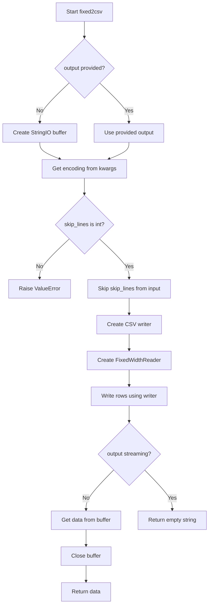
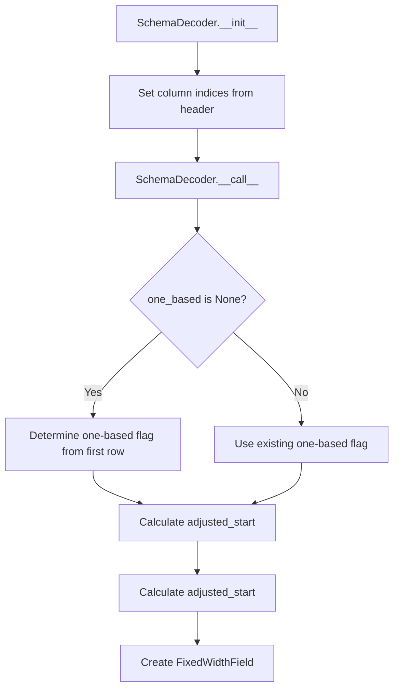

# `fixed.py`

## `csvkit.convert.fixed.fixed2csv` · *function*

## Summary
Converts fixed-width formatted text data into CSV format using a schema-based parsing approach.

## Description
The fixed2csv function transforms fixed-width formatted text files into standard CSV format. It reads input data line-by-line using a FixedWidthReader configured with a schema definition, then writes the parsed data as CSV rows to an output stream. This function serves as a bridge between fixed-width data formats and CSV-compatible formats, enabling easier processing and analysis of structured text data.

The function supports both streaming and buffered output modes, allowing it to handle large files efficiently or return results as a string. It also provides options to skip initial lines in the input file and specify character encoding for proper text decoding.

## Args
- f (file-like object): Input stream containing fixed-width formatted data to convert
- schema (file-like object or schema definition): Schema specification defining column positions and names for parsing fixed-width data
- output (file-like object, optional): Output stream for writing CSV data. If None, function returns CSV data as string
- skip_lines (int): Number of initial lines to skip from input file before processing (default: 0)
- **kwargs: Additional keyword arguments passed to underlying components, particularly 'encoding' for character set handling

## Returns
- str: When output parameter is None, returns the complete CSV-formatted data as a string
- str: When output parameter is provided, returns empty string (indicating successful processing)

## Raises
- ValueError: Raised when skip_lines argument is not an integer type

## Constraints
- Preconditions:
  - Input file-like object `f` must be readable
  - Schema must define valid column specifications for fixed-width parsing
  - skip_lines must be a non-negative integer
- Postconditions:
  - If output is None, the returned string contains properly formatted CSV data
  - If output is provided, the output stream contains the CSV data
  - Input file pointer is advanced by skip_lines + total data lines processed

## Side Effects
- Reads from the input file-like object `f`
- Writes to the output file-like object `output` when provided
- May read additional lines from input file based on skip_lines parameter
- Creates internal StringIO buffer when output is None

## Control Flow


## Examples
```python
from csvkit.convert.fixed import fixed2csv
from io import StringIO

# Basic usage with string input
input_data = StringIO("John Doe   25\nJane Smith 30")
schema_data = StringIO("name,0,10\nage,10,3")
csv_output = fixed2csv(input_data, schema_data)
print(csv_output)
# Output: "name,age\nJohn Doe   ,25\nJane Smith,30"

# Streaming usage with file output
with open('output.csv', 'w') as output_file:
    fixed2csv(input_data, schema_data, output=output_file)
```

## `csvkit.convert.fixed.FixedWidthReader` · *class*

## Summary
A reader class that processes fixed-width formatted text files and converts them into structured data rows using a schema-based approach.

## Description
The FixedWidthReader class is designed to iterate over fixed-width formatted text data, parsing each line according to a predefined schema. It serves as an iterator that yields structured data (lists of field values) for each line in the input file. The class delegates the actual parsing logic to a FixedWidthRowParser instance that interprets the schema and extracts field values from input lines.

This reader is typically used when converting fixed-width formatted files to standard CSV format or other structured data formats. It handles optional character encoding decoding and provides a clean interface for iterating through fixed-width data.

## State
- file: file-like object - The input stream containing fixed-width formatted data
- parser: FixedWidthRowParser - An instance responsible for parsing individual lines according to the schema
- header: bool - Flag indicating whether the header row should be returned on the first iteration

## Lifecycle
- Creation: Instantiate with a file-like object, schema definition, and optional encoding parameter
- Usage: Iterate over the reader object to get parsed rows; the first iteration returns headers, subsequent iterations return data rows
- Destruction: No special cleanup required; uses standard Python garbage collection

## Method Map
```mermaid
graph TD
    A[FixedWidthReader.__init__] --> B[Handle encoding if specified]
    B --> C[Store file reference]
    C --> D[Create FixedWidthRowParser with schema]
    D --> E[Set header flag to True]
    
    F[FixedWidthReader.__iter__] --> G[Return self]
    
    H[FixedWidthReader.__next__] --> I[Check header flag]
    I -->|True| J[Set header flag to False]
    J --> K[Return parser.headers]
    I -->|False| L[Return parser.parse(next(file))]
```

## Raises
- ValueError: May be raised by FixedWidthRowParser during initialization if the schema cannot be properly decoded or parsed

## Example
```python
from csvkit.convert.fixed import FixedWidthReader
from io import StringIO

# Create sample fixed-width data
fixed_width_data = StringIO("John Doe   25john.doe@example.com\nJane Smith 30jane.smith@example.com")

# Create a schema (column name, start position, length)
schema_csv = StringIO("column,start,length\nname,0,10\nage,10,3\nemail,13,25")

# Create the reader
reader = FixedWidthReader(fixed_width_data, schema_csv, encoding='utf-8')

# Iterate through the data
for row in reader:
    print(row)
# Output:
# ['name', 'age', 'email']  # Header row
# ['John Doe', '25', 'john.doe@example.com']  # Data row 1
# ['Jane Smith', '30', 'jane.smith@example.com']  # Data row 2
```

### `csvkit.convert.fixed.FixedWidthReader.__init__` · *method*

## Summary
Initializes a FixedWidthReader instance to parse fixed-width formatted data using the provided schema.

## Description
Configures the reader with input file handle, schema for field parsing, and optional character encoding. This method prepares the reader for subsequent iteration by setting up the file handle, parser, and header tracking state.

## Args
- f: File-like object containing fixed-width formatted data
- schema: Schema definition for parsing fixed-width fields, typically a CSV-formatted input
- encoding: Optional character encoding for the input file (defaults to None)

## Returns
None

## Raises
- ValueError: When the schema cannot be parsed or decoded properly by FixedWidthRowParser

## State Changes
- Attributes READ: None
- Attributes WRITTEN: self.file, self.parser, self.header

## Constraints
- Preconditions: The schema parameter must be readable and contain valid CSV-formatted field definitions
- Postconditions: The reader is initialized with a parser configured according to the schema, ready for iteration

## Side Effects
- May modify the file handle if encoding is specified (wrapping with iterdecode)
- Creates a FixedWidthRowParser instance using the provided schema

### `csvkit.convert.fixed.FixedWidthReader.__iter__` · *method*

## Summary
Implements Python's iterator protocol by returning self, enabling iteration over fixed-width formatted data.

## Description
The `__iter__` method is a fundamental part of Python's iterator protocol, returning `self` to indicate that the `FixedWidthReader` instance is its own iterator. This allows the reader to be used in for-loops and other iteration contexts like `for row in reader:`.

When iterated over, the `FixedWidthReader` processes fixed-width formatted lines from the input file according to a schema definition, yielding parsed rows as lists of field values. The actual iteration logic is implemented in the `__next__` method, while `__iter__` simply establishes the iterator relationship.

This method exists as a separate implementation rather than being inlined because it follows Python's standard iterator protocol specification, ensuring compatibility with built-in iteration constructs and functions that expect iterable objects.

## Args
    None

## Returns
    FixedWidthReader: Returns self, making the instance iterable

## Raises
    None

## State Changes
    Attributes READ: None
    Attributes WRITTEN: None

## Constraints
    Preconditions: The `FixedWidthReader` instance must be properly initialized with a file handle, schema, and optional encoding
    Postconditions: The reader maintains its internal state for tracking header processing and file iteration

## Side Effects
    None

### `csvkit.convert.fixed.FixedWidthReader.__next__` · *method*

## Summary
Returns the next row from a fixed-width formatted file, handling the header row specially and parsing subsequent rows according to the schema.

## Description
This method implements Python's iterator protocol to provide sequential access to rows from a fixed-width formatted file. It serves as the core iteration mechanism for the `FixedWidthReader` class, enabling usage in for-loops and other iteration contexts.

The method distinguishes between the header row (first row) and data rows. When processing the header row, it returns the parsed column headers from the schema. For subsequent rows, it reads the next line from the input file and parses it according to the fixed-width schema definition.

This logic is separated into its own method rather than being inlined because it follows Python's standard iterator protocol requirements and encapsulates the state management needed for proper iteration over potentially large files.

## Args
    None

## Returns
    list[str] or list: For the first call, returns a list of column header names from the schema. For subsequent calls, returns a list of parsed field values from the next line in the input file.

## Raises
    StopIteration: Raised when the input file is exhausted, signaling the end of iteration.

## State Changes
    Attributes READ: self.header, self.parser, self.file
    Attributes WRITTEN: self.header (set to False after first call)

## Constraints
    Preconditions: The `FixedWidthReader` instance must be properly initialized with a file handle, schema, and optional encoding. The file handle must be seekable and readable.
    Postconditions: After the first call, `self.header` is set to False, indicating that header processing is complete.

## Side Effects
    I/O: Reads the next line from the input file handle (`self.file`) via `next(self.file)`
    External service calls: None
    Mutations to objects outside self: None

## `csvkit.convert.fixed.FixedWidthRowParser` · *class*

## Summary
A parser for fixed-width formatted text lines that converts them into structured data using a schema definition.

## Description
The FixedWidthRowParser class is designed to parse fixed-width formatted data by applying field definitions from a schema. It takes a schema definition (typically in CSV format) that specifies column names, starting positions, and field lengths, then uses this information to extract field values from input lines.

This class is part of the csvkit library's fixed-width conversion utilities and is typically used when converting fixed-width formatted files to standard CSV format or other structured data formats.

## State
- fields: list[FixedWidthField] - A list of field definitions that specify how to parse each field from input lines. Each field has a name, start position, and length.
- Each field in the list is expected to be a namedtuple with fields: name (str), start (int), and length (int)

## Lifecycle
- Creation: Instantiate with a schema parameter that should be a readable object (like a file handle or StringIO) containing CSV-formatted schema data
- Usage: Call parse() to extract field values as a list, or parse_dict() to get a dictionary mapping headers to values
- Destruction: No special cleanup required; uses standard Python garbage collection

## Method Map
```mermaid
graph TD
    A[FixedWidthRowParser.__init__] --> B[Parse schema CSV]
    B --> C[SchemaDecoder.__call__]
    C --> D[Create FixedWidthField objects]
    D --> E[Store in self.fields]
    
    F[FixedWidthRowParser.parse] --> G[Iterate through self.fields]
    G --> H[Extract field slice from line]
    H --> I[Strip whitespace]
    I --> J[Return list of values]
    
    K[FixedWidthRowParser.parse_dict] --> L[Call parse()]
    L --> M[Zip with self.headers]
    M --> N[Return dict]
    
    O[FixedWidthRowParser.headers] --> P[Return field names]
```

## Raises
- ValueError: Raised during initialization when there are errors reading or parsing the schema definition, specifically when a schema row cannot be decoded by the SchemaDecoder

## Example
```python
from csvkit.convert.fixed import FixedWidthRowParser
from io import StringIO

# Create a schema (column name, start position, length)
schema_csv = StringIO("column,start,length\nname,0,10\nage,10,3\nemail,13,25")

# Initialize the parser
parser = FixedWidthRowParser(schema_csv)

# Parse a fixed-width line
line = "John Doe   25john.doe@example.com"
values = parser.parse(line)  # Returns ['John Doe', '25', 'john.doe@example.com']

# Parse as dictionary
data_dict = parser.parse_dict(line)  # Returns {'name': 'John Doe', 'age': '25', 'email': 'john.doe@example.com'}
```

### `csvkit.convert.fixed.FixedWidthRowParser.__init__` · *method*

*No documentation generated.*

### `csvkit.convert.fixed.FixedWidthRowParser.parse` · *method*

## Summary:
Parses a fixed-width formatted line into individual field values based on predefined field specifications.

## Description:
Extracts field values from a fixed-width formatted input line by slicing the string according to field start positions and lengths defined in the parser's field configuration. Each extracted field value has leading and trailing whitespace removed.

This method is part of the fixed-width CSV conversion pipeline and is typically called during the data processing phase when raw text lines need to be converted into structured field arrays for further processing or output.

## Args:
    line (str): A single line of text in fixed-width format containing all fields sequentially

## Returns:
    list[str]: A list of field values extracted from the input line, with whitespace stripped from each value

## Raises:
    None explicitly raised

## State Changes:
    Attributes READ: self.fields
    Attributes WRITTEN: None

## Constraints:
    Preconditions:
        - The input line must be long enough to accommodate all field definitions
        - Each field in self.fields must have start and length attributes
        - Field start positions and lengths must be valid integer indices
    
    Postconditions:
        - Returns a list with the same number of elements as self.fields
        - Each returned value is a stripped string representation of the corresponding field

## Side Effects:
    None

### `csvkit.convert.fixed.FixedWidthRowParser.parse_dict` · *method*

## Summary:
Creates a dictionary mapping column headers to parsed values from a fixed-width line.

## Description:
Converts a fixed-width formatted line into a dictionary where keys are column headers and values are the corresponding parsed field values. This method serves as a convenient interface for accessing parsed data as key-value pairs rather than a flat list.

This method is typically called during CSV conversion processes when fixed-width data needs to be transformed into a structured format that can be easily consumed by downstream processing pipelines or converted to standard CSV format.

## Args:
    line (str): A single line of fixed-width formatted data to parse

## Returns:
    dict: A dictionary mapping header names (from self.headers) to parsed field values (as strings)

## Raises:
    None explicitly raised, but may propagate exceptions from underlying operations like string slicing or field parsing

## State Changes:
    Attributes READ: self.headers, self.parse
    Attributes WRITTEN: None

## Constraints:
    Preconditions: 
    - self.headers must be a list of strings representing column names
    - self.parse must be callable and return a list of values matching the number of headers
    - line must be a string that can be processed by the field definitions
    
    Postconditions:
    - Returns a dictionary with exactly len(self.headers) key-value pairs
    - Keys are the header names from self.headers
    - Values are the parsed string values from the line

## Side Effects:
    None - This method is pure and doesn't cause any I/O or external service calls

### `csvkit.convert.fixed.FixedWidthRowParser.headers` · *method*

## Summary:
Returns a list of field names from the fixed-width schema definition.

## Description:
Provides access to the header names that correspond to the columns in a fixed-width formatted file. This property is used internally by the parser to map parsed values back to their respective column names when creating dictionaries via the `parse_dict` method.

## Args:
    None

## Returns:
    list[str]: A list of field name strings, one for each column defined in the schema.

## Raises:
    None

## State Changes:
    Attributes READ: self.fields
    Attributes WRITTEN: None

## Constraints:
    Preconditions: The `self.fields` attribute must be initialized with a list of field objects that have a `name` attribute.
    Postconditions: The returned list contains exactly one string for each field in `self.fields`.

## Side Effects:
    None

## `csvkit.convert.fixed.SchemaDecoder` · *class*

## Summary:
A decoder class that processes schema rows to extract fixed-width field definitions from tabular data.

## Description:
The SchemaDecoder class is responsible for interpreting schema definitions stored in tabular format, where each row represents a fixed-width field with its column name, starting position, and length. It parses the schema header to identify column positions and then processes individual rows to create FixedWidthField objects. This class enables conversion of fixed-width formatted data by providing the structural information needed to parse each field.

## State:
- start: int - Index position of the 'start' column in the schema header
- length: int - Index position of the 'length' column in the schema header  
- column: int - Index position of the 'column' column in the schema header
- one_based: bool or None - Flag indicating if start positions are 1-based (True) or 0-based (False); initially None and determined from data during first call

## Lifecycle:
- Creation: Instantiate with a header row (list-like object) containing column names
- Usage: Call the instance with individual data rows to process them into FixedWidthField objects
- Destruction: No explicit cleanup required; uses standard Python garbage collection

## Method Map:


## Raises:
- ValueError: Raised when a required column (named 'column', 'start', or 'length') is not found in the provided header

## Example:
```python
# Create decoder with schema header
header = ['column', 'start', 'length']
decoder = SchemaDecoder(header)

# Process a data row (assuming 1-based positions)
row = ['field1', '1', '10']  # column name, start position, length
field = decoder(row)  # Returns FixedWidthField('field1', 0, 10) - adjusted to 0-based

# Process another row (assuming 0-based positions)
row2 = ['field2', '5', '15']  # column name, start position, length  
field2 = decoder(row2)  # Returns FixedWidthField('field2', 5, 15)
```

### `csvkit.convert.fixed.SchemaDecoder.__init__` · *method*

## Summary:
Initializes the SchemaDecoder by mapping required column names to their positions in the header row.

## Description:
This method processes the provided header row to locate required schema columns and stores their positional indices as instance attributes. It validates that all required columns exist in the header and raises a ValueError if any are missing. The method expects self.REQUIRED_COLUMNS to be defined as a sequence of (column_name, type_constructor) tuples, where column_name is a string and type_constructor is either None or a callable that converts an integer index to a specific type.

## Args:
    header (list-like): A sequence of column names representing the schema header row

## Returns:
    None: This method does not return a value

## Raises:
    ValueError: Raised when any required column specified in self.REQUIRED_COLUMNS is not found in the header

## State Changes:
    Attributes READ: self.REQUIRED_COLUMNS
    Attributes WRITTEN: Instance attributes named after column names in REQUIRED_COLUMNS, with values being either integer indices or converted indices

## Constraints:
    Preconditions:
    - The header parameter must be a sequence-like object with string elements
    - The class must define a REQUIRED_COLUMNS attribute containing tuples of (column_name, type_constructor)
    - Each column_name in REQUIRED_COLUMNS must exist in the header sequence
    - Each type_constructor in REQUIRED_COLUMNS, when not None, must be callable with an integer argument
    
    Postconditions:
    - For each (column_name, type_constructor) in REQUIRED_COLUMNS:
      * If type_constructor is None: self.column_name = header.index(column_name) 
      * If type_constructor is not None: self.column_name = type_constructor(header.index(column_name))

## Side Effects:
    None

### `csvkit.convert.fixed.SchemaDecoder.__call__` · *method*

## Summary:
Converts a schema row into a fixed-width field definition with automatic 0-based/1-based index adjustment.

## Description:
This method transforms a schema row from a fixed-width file definition into a FixedWidthField object. It automatically determines whether the schema uses 1-based or 0-based indexing by examining the value at the start position in the first row processed. This determination is cached in self.one_based for subsequent rows. The method ensures proper index conversion so that all field positions are consistently represented in 0-based coordinates.

## Args:
    row (list or dict-like): A row containing field schema information with values at indices/keys specified by self.start, self.column, and self.length.

## Returns:
    FixedWidthField: A field definition object containing column name, start position (converted to 0-based indexing), and field length.

## Raises:
    ValueError: When row values at self.start or self.length cannot be converted to integers.

## State Changes:
    Attributes READ: self.start, self.column, self.length, self.one_based
    Attributes WRITTEN: self.one_based (only when initially None)

## Constraints:
    Preconditions: 
    - The row must contain elements at indices/keys specified by self.start, self.column, and self.length
    - Values at row[self.start] and row[self.length] must be convertible to integers
    - self.start, self.column, and self.length must be valid indices or keys for accessing row data
    
    Postconditions:
    - If self.one_based was None, it will be set to True if row[self.start] equals 1, otherwise False
    - The returned FixedWidthField will have a start position adjusted to 0-based coordinates

## Side Effects:
    None

