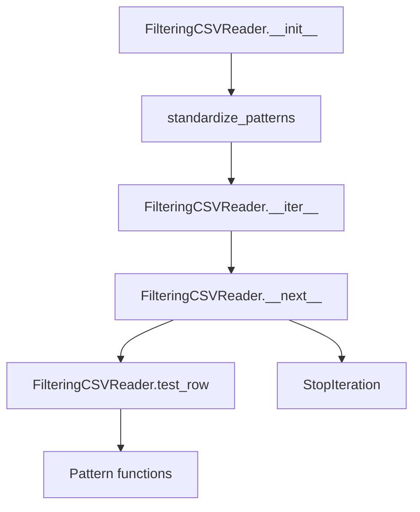
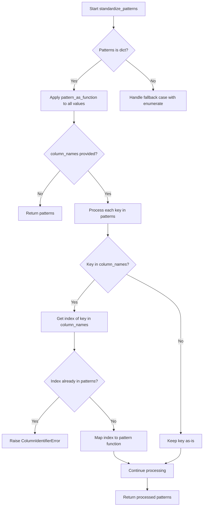

# `grep.py`

## `csvkit.grep.FilteringCSVReader` · *class*

## Summary:
A CSV reader wrapper that filters rows based on configurable patterns, supporting header handling, any/all match modes, and inverse filtering.

## Description:
The FilteringCSVReader class provides a mechanism to filter CSV data streams based on pattern matching criteria. It acts as a wrapper around an existing CSV reader, applying filtering logic to exclude or include rows based on user-defined patterns. This abstraction enables efficient filtering of large CSV datasets without loading all data into memory simultaneously.

The class is designed to work with csvkit's grep functionality and supports various filtering modes including "any match" (row matches if any pattern matches), "all match" (row matches only if all patterns match), and inverse filtering (excluding rows that match patterns).

## State:
- `returned_header` (bool): Tracks whether the header row has been returned during iteration. Initially False.
- `column_names` (list[str] or None): Stores column names from the CSV header if header=True was specified during initialization. Initially None.
- `reader` (CSV reader object): The underlying CSV reader being wrapped.
- `header` (bool): Flag indicating whether the CSV has a header row. Defaults to True.
- `any_match` (bool): Flag controlling match logic - if True, row matches if any pattern matches; if False, row matches only if all patterns match. Defaults to False.
- `inverse` (bool): Flag controlling inclusion/exclusion logic - if True, excludes rows that match patterns; if False, includes matching rows. Defaults to False.
- `patterns` (dict): Dictionary mapping column identifiers to callable pattern matching functions, created by standardize_patterns().

## Lifecycle:
- Creation: Instantiate with a CSV reader, patterns dictionary/list, and optional header/any_match/inverse flags
- Usage: Iterate over the instance using for loops or iter()/next() functions
- Destruction: No explicit cleanup required; relies on Python's garbage collection

## Method Map:


## Raises:
- ColumnIdentifierError: Raised by standardize_patterns when column names conflict with indices
- StopIteration: Raised by __next__ when end of input is reached without finding matching rows

## Example:
```python
import csv
from csvkit.grep import FilteringCSVReader

# Create a basic CSV reader
csv_file = open('data.csv', 'r')
reader = csv.reader(csv_file)

# Define patterns to filter by (e.g., rows where name column contains "John")
patterns = {'name': 'John'}

# Create filtering reader
filtered_reader = FilteringCSVReader(reader, patterns, header=True)

# Iterate through filtered results
for row in filtered_reader:
    print(row)

# Close the file
csv_file.close()
```

### `csvkit.grep.FilteringCSVReader.__init__` · *method*

## Summary:
Initializes a FilteringCSVReader that filters CSV rows based on specified patterns and matching criteria.

## Description:
Configures a CSV reader that filters input rows according to pattern matching rules. This method sets up the internal state for filtering operations by processing the input reader, handling optional header rows, and standardizing pattern specifications for efficient matching.

The FilteringCSVReader is designed to be used as an iterator that yields only rows matching the specified criteria. This initialization method prepares all necessary state for subsequent row filtering operations.

## Args:
    reader: A CSV reader object (typically from csv.reader) that provides sequential access to CSV data rows
    patterns: Pattern specifications for filtering, either as a dictionary mapping column identifiers to patterns or as a list of patterns
    header (bool, optional): Whether the first row contains column headers. Defaults to True
    any_match (bool, optional): If True, a row matches if ANY pattern matches; if False, ALL patterns must match. Defaults to False
    inverse (bool, optional): If True, returns rows that DO NOT match the patterns; if False, returns rows that DO match. Defaults to False

## Returns:
    None: This method initializes the object's state and returns nothing

## Raises:
    ColumnIdentifierError: When a column name resolves to an index that already has a pattern assigned during pattern standardization

## State Changes:
    Attributes READ: None
    Attributes WRITTEN: 
        - self.reader: Stores the input CSV reader object
        - self.header: Stores the header flag
        - self.column_names: Stores column names from the header row (when header=True)
        - self.any_match: Stores the any_match flag
        - self.inverse: Stores the inverse flag
        - self.patterns: Stores standardized pattern functions

## Constraints:
    Preconditions:
        - reader must be a valid iterable that yields CSV rows (lists of strings)
        - patterns must be either a dictionary or list-like structure
        - If header is True, reader must have at least one row to serve as header
        - column_names (if present) must contain valid column names for pattern resolution
    
    Postconditions:
        - self.reader is set to the provided reader object
        - self.header is set to the provided header flag
        - self.column_names is populated from reader if header=True, otherwise remains None
        - self.any_match is set to the provided any_match flag
        - self.inverse is set to the provided inverse flag
        - self.patterns is a dictionary mapping column identifiers to callable pattern matching functions

## Side Effects:
    None: This method performs no I/O operations or external service calls. It only stores references and processes data in-memory.

### `csvkit.grep.FilteringCSVReader.__iter__` · *method*

## Summary:
Makes the FilteringCSVReader instance iterable by returning itself as the iterator.

## Description:
Implements the Python iterator protocol's `__iter__` method, which returns the instance itself to enable iteration over filtered CSV rows. This method is called when the class instance is used in a for loop or with the built-in `iter()` function.

This method is essential for making the FilteringCSVReader behave as an iterator, allowing users to seamlessly iterate through filtered CSV data without needing to manually call `__next__`.

## Args:
    None

## Returns:
    FilteringCSVReader: The instance itself, enabling iteration.

## Raises:
    None

## State Changes:
    Attributes READ: None
    Attributes WRITTEN: None

## Constraints:
    Preconditions:
        - The instance must be properly initialized with a reader and patterns
        - The underlying reader must be iterable and provide CSV rows
    
    Postconditions:
        - The instance becomes usable in iteration contexts
        - The `__next__` method will be called during iteration

## Side Effects:
    None

### `csvkit.grep.FilteringCSVReader.__next__` · *method*

## Summary:
Returns the next filtered CSV row from the input stream, handling header row processing and applying configured filtering criteria.

## Description:
Implements the iterator protocol for `FilteringCSVReader` to provide filtered CSV row iteration. This method manages the special case of returning column headers before processing data rows, then iterates through the underlying CSV reader until finding a row that matches the configured filtering criteria.

The method is called during iteration of the `FilteringCSVReader` instance and is responsible for:
1. Returning column names as the first row if headers are enabled and not yet returned
2. Reading subsequent rows from the underlying CSV reader
3. Applying filtering logic via `test_row()` to determine if a row should be returned
4. Continuing iteration until a matching row is found or EOF is reached

This logic is separated into its own method to encapsulate the complex iteration and filtering behavior, making the class interface clean and following Python's iterator protocol requirements.

## Args:
    None

## Returns:
    list[str]: A list of string values representing a CSV row that matches the filtering criteria, or the column names list if returning the header row.

## Raises:
    StopIteration: When the end of the CSV input is reached without finding any more matching rows.

## State Changes:
    Attributes READ: self.column_names, self.returned_header, self.reader
    Attributes WRITTEN: self.returned_header (set to True after header is returned)

## Constraints:
    Preconditions:
        - The underlying `self.reader` must be initialized and iterable
        - `self.column_names` must be set if headers are enabled
        - `self.test_row` method must be implemented and functional
        - Filtering patterns must be properly configured in `self.patterns`

    Postconditions:
        - If header is enabled and not yet returned, the first call returns column names
        - If header is enabled and already returned, subsequent calls return filtered rows
        - The returned row matches the configured filtering criteria
        - `self.returned_header` is set to True after header row is returned

## Side Effects:
    I/O: Reads from the underlying CSV reader object
    Mutations: Modifies `self.returned_header` state flag

### `csvkit.grep.FilteringCSVReader.test_row` · *method*

## Summary:
Tests whether a CSV row matches the configured filtering patterns based on match criteria and inversion settings.

## Description:
Evaluates a CSV row against pre-configured patterns to determine if the row should be included in the filtered output. This method implements the core logic for row filtering in the FilteringCSVReader class, supporting both "any match" and "all match" modes along with inverted matching.

The method processes each pattern in `self.patterns`, applying the corresponding test function to the appropriate column value from the input row. It handles cases where rows may have fewer columns than expected by treating missing values as empty strings.

## Args:
    row (list): A list representing a CSV row with values in column order

## Returns:
    bool: True if the row should be included in the output, False if it should be excluded

## Raises:
    None explicitly raised

## State Changes:
    Attributes READ: self.patterns, self.any_match, self.inverse
    Attributes WRITTEN: None

## Constraints:
    Preconditions:
        - `self.patterns` must be a dictionary mapping column indices/names to callable pattern functions
        - `self.any_match` and `self.inverse` must be boolean values
        - Row must be iterable with values that can be processed by the pattern functions
        
    Postconditions:
        - Returns a boolean value indicating whether the row matches the filter criteria
        - The returned value is determined by the logical combination of pattern matches and the match/inverse flags

## Side Effects:
    None

## `csvkit.grep.standardize_patterns` · *function*

## Summary:
Converts column patterns into a standardized dictionary mapping column identifiers to callable matching functions.

## Description:
Processes a collection of patterns and normalizes them into a consistent format where column identifiers (either names or indices) map to callable functions that can test string matches. This function handles both named column specifications and indexed column specifications while ensuring no conflicts arise between column names and indices.

The function is used internally by csvkit's grep functionality to prepare pattern specifications for efficient matching operations. It extracts the logic for pattern standardization to avoid duplication and ensure consistent handling of different pattern input formats.

## Args:
    column_names (list[str] or None): List of column names for the CSV file, or None if not available. Used to resolve column name references to numeric indices.
    patterns (dict or list): Pattern specifications that can be either:
        - A dictionary mapping column names/indices to pattern values
        - A list of pattern values (when column_names is None)

## Returns:
    dict: A dictionary mapping column identifiers (integers or strings) to callable matching functions. The keys represent column identifiers and the values are functions that accept a string and return a boolean indicating match success.

## Raises:
    ColumnIdentifierError: When a column name resolves to an index that already has a pattern assigned.

## Constraints:
    Preconditions:
        - Patterns must be either a dictionary or list-like structure
        - If column_names is provided, it should contain valid column names
        - All pattern values must be convertible by pattern_as_function
        
    Postconditions:
        - Returned dictionary contains only callable functions as values
        - Keys in the returned dictionary are either integers (indices) or strings (names)
        - No duplicate column identifier mappings exist

## Side Effects:
    None

## Control Flow:


## Examples:
```python
# Basic usage with column names
column_names = ['name', 'email', 'phone']
patterns = {'name': 'John', 'email': r'.*@gmail\.com'}
result = standardize_patterns(column_names, patterns)
# Returns: {0: <callable>, 1: <callable>} where 0 is 'name' and 1 is 'email'

# Usage with list patterns (no column names)
patterns = ['pattern1', 'pattern2']
result = standardize_patterns(None, patterns)
# Returns: {0: <callable>, 1: <callable>}
```

## `csvkit.grep.pattern_as_function` · *function*

## Summary:
Converts a pattern object into a callable function for string matching operations.

## Description:
This function normalizes various pattern types into a uniform callable interface suitable for string matching. It handles three distinct input types: directly callable objects, regex pattern objects with a match method, and literal values that should be checked for substring inclusion.

## Args:
    obj: The pattern to convert. Can be:
        - A callable object (function, method, or callable class instance)
        - An object with a 'match' method (typically a compiled regex pattern)
        - Any other object that should be tested for substring inclusion in target strings

## Returns:
    A callable function that accepts a string argument and returns a boolean indicating whether the pattern matches the string.

## Raises:
    No explicit exceptions are raised by this function.
    However, exceptions may occur during execution of the returned callable if the input patterns are malformed or incompatible with their intended use.

## Constraints:
    Preconditions:
        - Input obj must be a valid object that can be processed by the function logic
        - If obj is a callable, it must accept a single string argument
        - If obj has a 'match' attribute, it must be compatible with regex matching operations
    
    Postconditions:
        - The returned callable will accept a string argument
        - The returned callable will return a boolean value (True/False)

## Side Effects:
    None

## Control Flow:
```mermaid
flowchart TD
    A[Start pattern_as_function] --> B{Is obj callable?}
    B -- Yes --> C[Return obj]
    B -- No --> D{Does obj have match attr?}
    D -- Yes --> E[Return regex_callable(obj)]
    D -- No --> F[Return lambda x: obj in x]
```

## Examples:
```python
# Using a direct callable
def custom_match(text):
    return len(text) > 5
matcher = pattern_as_function(custom_match)
result = matcher("hello world")  # True

# Using a regex pattern
import re
pattern = re.compile(r'\d+')
matcher = pattern_as_function(pattern)
result = matcher("abc123")  # True

# Using a literal string
matcher = pattern_as_function("hello")
result = matcher("say hello world")  # True
```

## `csvkit.grep.regex_callable` · *class*

## Summary:
A callable class that wraps a regular expression pattern for matching against string arguments.

## Description:
This class serves as a wrapper around a compiled regular expression pattern, enabling it to be used as a callable object for pattern matching operations. It is designed to be used in CSV processing contexts where regex-based filtering is required. The class implements the `__call__` protocol, allowing instances to be invoked directly with string arguments.

## State:
- `pattern`: A compiled regular expression object (typically created with `re.compile()`) that defines the search pattern to be applied
- The pattern parameter must support a `search()` method that accepts a string argument and returns a Match object or None

## Lifecycle:
- Creation: Instantiate with a compiled regular expression pattern using `regex_callable(pattern)`
- Usage: Call the instance with a string argument: `callable_instance(string_arg)`
- Destruction: No special cleanup required; relies on Python's garbage collection

## Method Map:
```mermaid
graph TD
    A[regex_callable.__init__] --> B[Stores pattern]
    C[regex_callable.__call__] --> D[Returns pattern.search(arg)]
```

## Raises:
- No explicit exceptions are raised by the class itself
- The underlying `pattern.search(arg)` call may raise exceptions if the pattern or argument are invalid (though this is handled by the regex engine)

## Example:
```python
import re
from csvkit.grep import regex_callable

# Create a compiled regex pattern
pattern = re.compile(r'\\d+')  # Matches digits

# Create callable instance
matcher = regex_callable(pattern)

# Use as callable
result = matcher("abc123def")  # Returns a Match object
has_match = bool(matcher("abc123def"))  # True if match found
```

### `csvkit.grep.regex_callable.__init__` · *method*

## Summary:
Initializes a regex callable object with a regular expression pattern for CSV filtering operations.

## Description:
This constructor method creates a regex callable instance that stores a regular expression pattern for use in CSV column filtering operations. The pattern is stored as an attribute for later use in matching CSV row data against the specified regular expression.

## Args:
    pattern (str): A regular expression pattern to be stored for subsequent matching operations.

## Returns:
    None: This method initializes the object's state but does not return a value.

## Raises:
    None: This method does not explicitly raise any exceptions.

## State Changes:
    Attributes READ: None
    Attributes WRITTEN: self.pattern

## Constraints:
    Preconditions: The pattern argument should be a valid string representing a regular expression.
    Postconditions: The instance will have a self.pattern attribute containing the provided pattern string.

## Side Effects:
    None: This method performs no I/O operations or external service calls. It only assigns a value to an instance attribute.

### `csvkit.grep.regex_callable.__call__` · *method*

## Summary:
Performs a regular expression search on the provided argument using the stored pattern.

## Description:
This method implements the callable interface for the regex_callable class, enabling instances to be invoked like functions. When called, it executes a regex search operation on the input argument using the pre-compiled pattern stored in self.pattern. This design allows regex_callable instances to be used seamlessly in contexts where a callable function is expected, such as filtering operations or as callback functions.

## Args:
    arg (str): The string to search for matches against the stored regex pattern

## Returns:
    re.Match or None: The result of self.pattern.search(arg), which is either a Match object if a match is found or None if no match is found

## Raises:
    AttributeError: If self.pattern does not have a search method (though this would indicate a programming error in the class design)

## State Changes:
    Attributes READ: 
        - self.pattern: The compiled regex pattern used for searching
    Attributes WRITTEN: None

## Constraints:
    Preconditions:
        - self.pattern must be a compiled regular expression object with a search method
        - arg must be a string or other object compatible with the pattern's search method
    Postconditions:
        - The method returns the result of self.pattern.search(arg) without modifying any instance state

## Side Effects:
    None: This method performs no I/O operations or external service calls. It only executes the regex search operation and returns the result.

