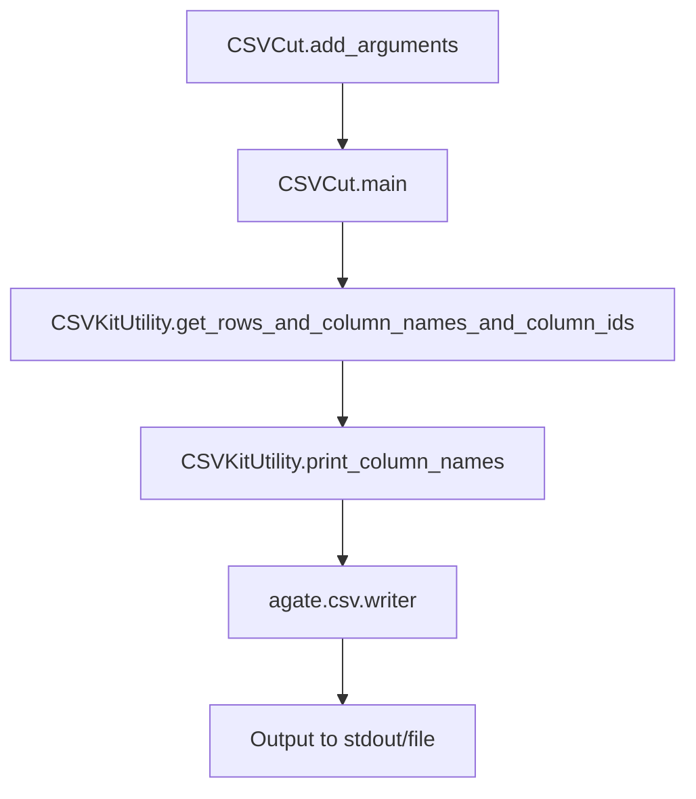

# `csvcut.py`

## `csvkit.utilities.csvcut.CSVCut` · *class*

## Summary:
CSVCut is a command-line utility that filters and truncates CSV files by selecting specific columns, similar to the Unix "cut" command but for tabular data.

## Description:
The CSVCut class provides functionality to extract specific columns from CSV files, effectively filtering and truncating tabular data. It supports various column specification formats including indices, names, and ranges. This utility is particularly useful for data processing workflows where only certain columns are needed from larger datasets.

The class extends CSVKitUtility, inheriting common CSV processing capabilities such as argument parsing, file handling, and CSV reader/writer configuration. It implements the standard command-line interface pattern expected by csvkit utilities.

## State:
- description (str): Class-level description set to 'Filter and truncate CSV files. Like the Unix "cut" command, but for tabular data.'
- override_flags (list[str]): Set to ['L', 'blanks', 'date-format', 'datetime-format'] to exclude these flags from argument parsing
- args (argparse.Namespace): Parsed command-line arguments containing:
  - names_only (bool): True when -n/--names flag is specified to display column names and exit
  - columns (str): Column specification string for inclusion (indices, names, or ranges) or None for all columns
  - not_columns (str): Column specification string for exclusion (indices, names, or ranges) or None for no exclusions  
  - delete_empty (bool): True when -x/--delete-empty-rows flag is specified to remove completely empty rows after cutting
- reader_kwargs (dict): Configuration for CSV reader constructed from parsed arguments
- writer_kwargs (dict): Configuration for CSV writer constructed from parsed arguments

## Lifecycle:
- Creation: Instantiated automatically by the csvkit framework when invoked from command line
- Usage: Called via the CSVKitUtility.run() method which:
  1. Parses command-line arguments through add_arguments()
  2. Opens input file if needed
  3. Calls main() method to process CSV data
- Destruction: Automatic cleanup handled by parent class through context managers and finally blocks

## Method Map:


## Raises:
- NotImplementedError: Inherited from CSVKitUtility base class (not directly raised by CSVCut)
- ValueError: Inherited from CSVKitUtility (raised by skip_lines method when skip_lines argument is not an integer)
- RequiredHeaderError: Inherited from CSVKitUtility (raised by print_column_names when --no-header-row is used with -n/--names options)
- UnicodeDecodeError: Handled by CSVKitUtility's custom exception handler

## Example:
```python
# Display column names and indices from a CSV file
# Command: csvcut -n data.csv
# Output: 1: name, 2: age, 3: city

# Extract specific columns by index
# Command: csvcut -c 1,3,5 data.csv
# Extracts columns at positions 1, 3, and 5

# Extract columns by name
# Command: csvcut -c name,age,city data.csv
# Extracts columns named 'name', 'age', and 'city'

# Extract columns using ranges
# Command: csvcut -c 1-3 data.csv
# Extracts columns from position 1 through 3

# Exclude specific columns
# Command: csvcut -C 2,4 data.csv
# Excludes columns at positions 2 and 4

# Delete empty rows after cutting
# Command: csvcut -x data.csv
# Removes rows where all remaining columns are empty

# Combine options
# Command: csvcut -c name,age -x data.csv
# Extracts name and age columns, then removes empty rows
```

### `csvkit.utilities.csvcut.CSVCut.add_arguments` · *method*

## Summary:
Configures command-line argument parsers for CSV column extraction operations.

## Description:
Sets up command-line arguments for the csvcut utility, enabling users to specify which columns to extract from input CSV files, display column metadata, and control row filtering behavior. This method is part of the CSVCut class's initialization process and integrates with the CSVKit CLI framework.

## Args:
    self: The CSVCut instance whose argparser attribute is modified

## Returns:
    None: This method modifies the instance's argparser in-place

## Raises:
    None: This method does not raise exceptions directly

## State Changes:
    Attributes READ: self.argparser
    Attributes WRITTEN: self.argparser (modified in-place)

## Constraints:
    Preconditions: 
    - self.argparser must be initialized and accessible
    - The method should be called during class initialization or setup phase
    
    Postconditions:
    - Command-line arguments are registered with the instance's argument parser
    - All specified options are available for parsing user input

## Side Effects:
    None: This method only modifies the internal argument parser configuration

### `csvkit.utilities.csvcut.CSVCut.main` · *method*

## Summary:
Processes CSV data by filtering columns according to command-line specifications and writing the result to output.

## Description:
The main method of the CSVCut utility that implements column filtering and truncation functionality for CSV files. When the `--names-only` flag is specified, it displays column names and exits. Otherwise, it reads CSV data, extracts specified columns, and writes the filtered results to the output file. The method supports various column selection patterns including indices, names, and ranges, and can optionally remove empty rows from the output.

This method orchestrates the core CSV processing workflow by coordinating with parent class methods for input handling, column identification, and output formatting. It's designed to behave like the Unix "cut" command but for tabular data.

## Args:
    None (uses self.args, self.reader_kwargs, self.writer_kwargs, self.output_file, and self.input_file)

## Returns:
    None

## Raises:
    None explicitly raised by this method. However, underlying methods may raise:
        - RequiredHeaderError: When --no-header-row is used with -n/--names options
        - ColumnIdentifierError: When column identifiers cannot be resolved
        - StopIteration: When CSV file is empty
        - UnicodeDecodeError: When encoding issues occur during file processing

## State Changes:
    Attributes READ: 
        - self.args.names_only: Flag to display column names only
        - self.args.delete_empty: Flag to delete empty rows from output
        - self.args.columns: Column selection specification
        - self.args.not_columns: Column exclusion specification
        - self.reader_kwargs: CSV reader configuration parameters
        - self.writer_kwargs: CSV writer configuration parameters
        - self.output_file: Output file handle
        - self.input_file: Input file handle
    
    Attributes WRITTEN: 
        - None

## Constraints:
    Preconditions:
        - The CSVCut instance must be properly initialized with parsed command-line arguments
        - Input file must be readable or stdin must be available for piped data
        - Column identifiers in self.args.columns must be resolvable to actual columns
        - The CSV file must be properly formatted with consistent row lengths or handle variable-length rows gracefully
        
    Postconditions:
        - If names_only flag is set, column names are printed to output file and method returns early
        - If input is expected but not provided, appropriate stderr message is written
        - CSV header row is written with selected column names
        - Filtered rows are written to output file with selected columns
        - Empty rows are filtered out when delete_empty flag is set

## Side Effects:
    I/O: Writes processed CSV data to self.output_file
    I/O: Writes informational message to stderr when waiting for stdin input
    File Operations: Reads from self.input_file (or stdin when piped)
    State Mutation: May modify self.args.skip_lines during input processing (via parent class methods)

## `csvkit.utilities.csvcut.launch_new_instance` · *function*

## Summary:
Creates and executes a new instance of the CSVCut command-line utility for filtering and truncating CSV files.

## Description:
The launch_new_instance function serves as a factory method that instantiates the CSVCut utility class and executes its processing pipeline. This function follows the standard csvkit pattern where command-line utilities are implemented as classes that inherit from CSVKitUtility, with launch_new_instance providing the entry point for executing these utilities from the command line.

This function encapsulates the instantiation and execution workflow, making it easy to launch the CSVCut utility without requiring explicit setup of argument parsing or file handling. It is typically called by the csvkit command-line entry points to initiate processing of CSV files with column filtering capabilities.

## Args:
    None

## Returns:
    None

## Raises:
    None explicitly raised by this function, though the underlying CSVCut.run() method may raise exceptions inherited from CSVKitUtility such as:
    - ValueError: When argument parsing fails or invalid parameters are provided
    - RequiredHeaderError: When header row requirements are not met with -n/--names option
    - UnicodeDecodeError: When file encoding issues occur during CSV processing

## Constraints:
    Preconditions:
    - The csvkit command-line environment must be properly initialized
    - Standard input/output streams must be available for file operations
    - Required dependencies (agate, argparse) must be importable
    
    Postconditions:
    - The CSVCut utility will process CSV input according to command-line arguments
    - Output will be written to stdout or specified output file
    - All file handles will be properly closed after execution

## Side Effects:
    - Reads from standard input or specified input files
    - Writes to standard output or specified output files
    - May read configuration files or environment variables for CSV processing settings
    - May modify global state through the CSVKitUtility exception handler installation

## Control Flow:
```mermaid
flowchart TD
    A[launch_new_instance called] --> B[Create CSVCut instance]
    B --> C[Call utility.run()]
    C --> D[CSVCut inherits from CSVKitUtility]
    D --> E[Parses command-line arguments]
    E --> F[Opens input file if needed]
    F --> G[Processes CSV data through main()]
    G --> H[Outputs results to stdout/file]
    H --> I[Cleanup and exit]
```

## Examples:
```python
# Typical usage from command line (via csvkit entry point)
# csvcut -c 1,3 data.csv

# Programmatic usage (internal to csvkit framework)
from csvkit.utilities.csvcut import launch_new_instance
launch_new_instance()

# Equivalent manual approach:
# utility = CSVCut()
# utility.run()
```

