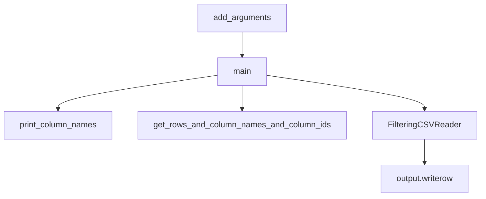

# `csvgrep.py`

## `csvkit.utilities.csvgrep.CSVGrep` · *class*

## Summary:
CSVGrep is a command-line utility that searches CSV files using pattern matching, similar to the Unix grep command but designed for tabular data.

## Description:
CSVGrep provides functionality to filter CSV rows based on text patterns in specified columns. It supports multiple matching strategies including literal string matching, regular expressions, and file-based matching. The utility can display column names, filter rows based on matching criteria, and invert match results. It is part of the csvkit suite of command-line tools for working with CSV files.

## State:
- `description`: str - Class description indicating the utility's purpose: 'Search CSV files. Like the Unix "grep" command, but for tabular data.'
- `override_flags`: list[str] - Command-line flags that are overridden from the parent class: ['L', 'blanks', 'date-format', 'datetime-format']
- `argparser`: ArgumentParser instance - Used to define command-line argument parsing
- `args`: Namespace - Stores parsed command-line arguments
- `output_file`: file-like object - Output destination for filtered results
- `reader_kwargs`: dict - Keyword arguments for CSV reader configuration
- `writer_kwargs`: dict - Keyword arguments for CSV writer configuration

## Lifecycle:
- Creation: Instantiated by the csvkit command-line framework when the csvgrep utility is invoked
- Usage: The main() method is called by the framework to execute the utility with parsed arguments
- Destruction: Managed by Python's garbage collection after execution completes

## Method Map:


## Raises:
- `ArgumentParser.error`: Raised when required arguments are missing or invalid (specifically when no columns are specified or no search pattern is provided)
- `IOError`: May be raised when reading from input files or writing to output files

## Example:
```bash
# Search for "John" in column 1 of data.csv
python csvgrep.py -c 1 -m "John" data.csv

# Search using regex pattern in columns 2-4
python csvgrep.py -c 2-4 -r "^[A-Z][a-z]+$" data.csv

# Display column names only
python csvgrep.py -n data.csv

# Invert match to show non-matching rows
python csvgrep.py -c 1 -m "John" -i data.csv

# Match any column instead of all columns
python csvgrep.py -c 1,2 -m "test" -a data.csv
```

### `csvkit.utilities.csvgrep.CSVGrep.add_arguments` · *method*

## Summary:
Configures command-line argument parser with options for CSV grep functionality including column selection, pattern matching, and filtering behavior.

## Description:
This method sets up the argument parser with various command-line options that control how CSV data is filtered and searched. It defines flags and parameters for selecting specific columns to search, specifying search patterns (both literal strings and regular expressions), enabling file-based matching, inverting match results, and controlling whether matches must occur in all columns or just any column.

The method is part of the CSVGrep utility class and is called during the initialization phase to prepare the command-line interface before parsing user input. It adds arguments that allow users to specify which columns to search (-c/--columns), what pattern to match (-m/--match or -r/--regex), how to match (-f/--file), whether to invert results (-i/--invert-match), and whether to match all columns or any column (-a/--any-match).

## Args:
    self: The CSVGrep instance whose argparser attribute is modified

## Returns:
    None: This method modifies the instance's argparser in-place and returns nothing

## Raises:
    None explicitly raised: This method only configures arguments and doesn't raise exceptions

## State Changes:
    Attributes READ: self.argparser
    Attributes WRITTEN: self.argparser (modified in-place with new arguments)

## Constraints:
    Preconditions: 
    - self.argparser must be initialized and accessible
    - This method should only be called once during object initialization
    
    Postconditions:
    - The argparser instance contains all configured command-line arguments
    - All argument definitions are properly registered with the parser

## Side Effects:
    None: This method only modifies the internal argparser object and doesn't perform I/O operations or external service calls

### `csvkit.utilities.csvgrep.CSVGrep.main` · *method*

## Summary:
Filters CSV rows based on pattern matching criteria across specified columns and writes matching rows to output.

## Description:
The main method implements the core CSV grep functionality by filtering rows from input CSV data based on user-specified pattern matching criteria. It supports multiple pattern types (regex, literal string, or file-based matching) and offers flexible matching modes (any match or all match) along with inverse filtering capabilities.

This method is the primary entry point for the csvgrep utility and orchestrates the entire filtering workflow. It handles command-line argument validation, processes input data through the CSV reader infrastructure, applies pattern-based filtering using FilteringCSVReader, and outputs the filtered results.

## Args:
    None (uses self.args, self.reader_kwargs, self.writer_kwargs, self.output_file, and self.input_file)

## Returns:
    None

## Raises:
    SystemExit: Raised by self.argparser.error() when required arguments are missing or invalid
    RequiredHeaderError: Raised by self.print_column_names() when --no-header-row is used with -n/--names options
    ColumnIdentifierError: Raised by self.get_rows_and_column_names_and_column_ids() when column identifiers cannot be resolved

## State Changes:
    Attributes READ: 
        - self.args.names_only
        - self.args.columns
        - self.args.regex
        - self.args.pattern
        - self.args.matchfile
        - self.args.inverse
        - self.args.any_match
        - self.reader_kwargs
        - self.writer_kwargs
        - self.output_file
        - self.input_file
    Attributes WRITTEN: 
        - None

## Constraints:
    Preconditions:
        - The CSVKitUtility instance must be properly initialized with parsed arguments
        - At least one column must be specified using the -c option
        - One of -r, -m, or -f options must be specified (unless using -n option)
        - Input file must be readable or stdin must be available for piped data
        - Column identifiers in self.args.columns must be resolvable to actual columns
        
    Postconditions:
        - If names_only flag is set, column names are printed and method returns early
        - If no input is provided, user is prompted to provide stdin data
        - Filtered CSV data is written to self.output_file with proper header row
        - Pattern matching is applied according to specified criteria

## Side Effects:
    I/O: Writes filtered CSV data to self.output_file
    I/O: Writes informational message to stderr when waiting for stdin input
    File Operations: Reads from self.input_file or stdin when no explicit input file is provided
    Resource Management: Closes self.args.matchfile when using file-based pattern matching

## `csvkit.utilities.csvgrep.launch_new_instance` · *function*

## Summary:
Instantiates and executes the CSVGrep command-line utility for searching CSV files using pattern matching.

## Description:
This function serves as the entry point for launching the csvgrep command-line utility. It creates a CSVGrep class instance and invokes its run method to process CSV data according to the configured command-line arguments. The function abstracts away the instantiation and execution details, providing a clean interface for the csvkit framework to initialize and run the CSV grep utility.

This function follows the standard csvkit pattern where each command-line utility has a launch_new_instance function that creates and runs the appropriate utility class instance. It is typically called by the csvkit command-line entry points to initiate processing of CSV files with pattern matching capabilities.

## Args:
    None

## Returns:
    None

## Raises:
    None explicitly raised by this function, though the underlying CSVGrep.run() method may raise exceptions inherited from CSVKitUtility such as:
    - argparse.ArgumentError: When argument parsing fails or invalid parameters are provided
    - ValueError: When required arguments are missing or invalid
    - IOError: When file I/O operations fail during CSV processing
    - UnicodeDecodeError: When encoding issues occur during file reading

## Constraints:
    Preconditions:
    - The csvkit command-line environment must be properly initialized
    - Command-line arguments must be available for parsing by CSVGrep
    - Standard input/output streams must be accessible
    
    Postconditions:
    - The CSVGrep utility will have processed input CSV data according to its configuration
    - Output will be written to either stdout/stderr or specified output files
    - The process will exit with appropriate status codes based on processing results

## Side Effects:
    - Reads from standard input or specified input file(s)
    - Writes to standard output or specified output file(s)
    - May write diagnostic messages to standard error
    - Processes command-line arguments through the csvkit argument parser

## Control Flow:
```mermaid
flowchart TD
    A[launch_new_instance called] --> B[Create CSVGrep instance]
    B --> C[Call utility.run()]
    C --> D[CSVGrep inherits from CSVKitUtility]
    D --> E[Parses command-line arguments]
    E --> F[Opens input file if needed]
    F --> G[Processes CSV data through main()]
    G --> H[Applies pattern matching filters to rows]
    H --> I[Outputs matching/non-matching rows to stdout/file]
    I --> J[Cleanup and exit]
```

## Examples:
```bash
# Typical usage from command line:
# csvgrep -c 1 -m "John" data.csv

# Search for "John" in column 1 of data.csv
python csvgrep.py -c 1 -m "John" data.csv

# Search using regex pattern in columns 2-4
python csvgrep.py -c 2-4 -r "^[A-Z][a-z]+$" data.csv

# Display column names only
python csvgrep.py -n data.csv

# Invert match to show non-matching rows
python csvgrep.py -c 1 -m "John" -i data.csv

# Match any column instead of all columns
python csvgrep.py -c 1,2 -m "test" -a data.csv
```

