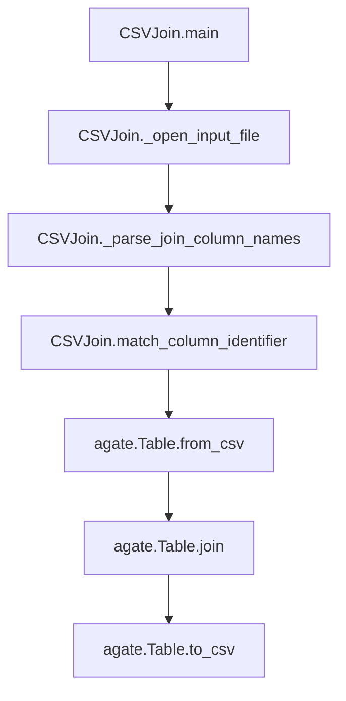

# `csvjoin.py`

## `csvkit.utilities.csvjoin.CSVJoin` · *class*

## Summary:
A command-line utility that executes SQL-like joins to merge multiple CSV files based on specified column(s).

## Description:
CSVJoin enables users to perform database-style join operations on multiple CSV files, similar to SQL JOIN statements. It supports inner joins, left outer joins, right outer joins, and full outer joins. The utility reads all input files into memory and performs the join operation, making it unsuitable for very large files due to memory requirements.

This class extends CSVKitUtility and provides a command-line interface for joining CSV datasets. It's particularly useful for combining related datasets that share common identifiers or keys across multiple files.

## State:
- input_files (list): List of opened file handles for input CSV files
- args (argparse.Namespace): Parsed command-line arguments containing join configuration
- output_file (file-like object): Output destination for the joined results
- reader_kwargs (dict): Configuration for CSV reader construction
- writer_kwargs (dict): Configuration for CSV writer construction

## Lifecycle:
- Creation: Instantiated automatically by the csvkit framework when invoked from command line
- Usage: Called via the CSVKitUtility.run() method which processes arguments and executes main()
- Destruction: Automatic cleanup of file handles occurs after execution completes

## Method Map:


## Raises:
- SystemExit: Raised by argparser.error() when validation fails (invalid arguments, missing required parameters)
- ValueError: May be raised by underlying CSV processing when encountering malformed data
- IOError: Raised when input files cannot be opened or read
- UnicodeDecodeError: Raised when CSV files contain invalid encoding

## Example:
```bash
# Join two CSV files on a common column
csvjoin -c id file1.csv file2.csv > joined_output.csv

# Perform a left outer join
csvjoin --left -c name users.csv orders.csv > left_joined.csv

# Join multiple files with different join columns
csvjoin -c "id,category,region" file1.csv file2.csv file3.csv > multi_joined.csv

# Perform a full outer join
csvjoin --outer -c date sales.csv inventory.csv > full_joined.csv
```

### `csvkit.utilities.csvjoin.CSVJoin.add_arguments` · *method*

## Summary:
Configures command-line arguments for CSV file joining operations.

## Description:
Sets up the argument parser with options for specifying input CSV files, join columns, join types (inner, outer, left, right), and CSV parsing configuration. This method is called during the initialization of the CSVJoin utility to define all available command-line options.

## Args:
    None (method operates on self.argparser)

## Returns:
    None (modifies self.argparser in-place)

## Raises:
    None explicitly raised

## State Changes:
    Attributes READ: None
    Attributes WRITTEN: self.argparser (modified in-place)

## Constraints:
    Preconditions: 
    - self.argparser must be initialized and accessible
    - This method should only be called during object initialization/setup phase
    
    Postconditions:
    - self.argparser contains all configured command-line arguments for CSV joining
    - All argument defaults are properly set

## Side Effects:
    None (only modifies internal argument parser configuration)

### `csvkit.utilities.csvjoin.CSVJoin.main` · *method*

## Summary:
Joins multiple CSV files together based on specified column criteria and outputs the result to CSV format.

## Description:
This method orchestrates the process of joining multiple CSV files using agate's table join functionality. It validates input arguments, opens and processes each input file into agate tables, determines join column identifiers, performs the appropriate join operation (inner, left, right, or outer), and writes the joined result to the output file.

The method supports various join types through command-line flags (--left-join, --right-join, --outer-join) and allows specifying join columns either as a single column name that exists in all files or as a list of column names matching each input file. It handles different join strategies based on the specified flags and ensures proper validation of arguments.

## Args:
    self: The CSVJoin instance containing command-line arguments and configuration

## Returns:
    None: This method performs I/O operations and does not return a value

## Raises:
    SystemExit: Raised by self.argparser.error() when validation fails for:
        - Missing input files when stdin is used with '-' path
        - Mismatch between number of join column names and input files
        - Missing join column names for outer join operations
        - Conflicting join type flags (left and right join simultaneously)

## State Changes:
    Attributes READ:
        - self.args.input_paths
        - self.args.columns
        - self.args.left_join
        - self.args.right_join
        - self.args.outer_join
        - self.args.skip_lines
        - self.args.sniff_limit
        - self.args.encoding
        - self.output_file
        - self.reader_kwargs
        - self.writer_kwargs
        - self.args.no_inference (indirectly through get_column_types)
    Attributes WRITTEN:
        - self.input_files (populated during execution)

## Constraints:
    Preconditions:
        - self.args.input_paths must contain valid file paths or '-' for stdin
        - For outer joins (--left-join, --right-join, --outer-join), self.args.columns must be specified
        - Cannot specify both left and right join flags simultaneously
        - Join column names must either match the number of input files or be a single column name existing in all files
        - When stdin is used, at least one input file must be specified (not just '-')
    
    Postconditions:
        - All input files are properly opened and closed
        - Tables are created from CSV data with appropriate column types
        - Join operation is performed according to specified flags
        - Resulting joined table is written to output_file

## Side Effects:
    - Reads from multiple input files (or stdin when '-' is specified)
    - Writes to output_file (stdout by default)
    - Opens and closes file handles for each input file
    - Uses agate.Table.join for table joining operations
    - May read from stdin when '-' is specified as input path
    - Calls self._open_input_file() for each input path
    - Calls self._parse_join_column_names() when columns are specified
    - Calls self.get_column_types() for type inference
    - Calls match_column_identifier() to resolve column names to indices

### `csvkit.utilities.csvjoin.CSVJoin._parse_join_column_names` · *method*

## Summary:
Parses a comma-separated string of column names into a list of stripped column name strings.

## Description:
Processes a string containing comma-separated column identifiers and returns a list of column names with leading/trailing whitespace removed. This method is used to parse the --columns argument when joining CSV files.

## Args:
    join_string (str): A comma-separated string of column names to be parsed.

## Returns:
    list[str]: A list of column name strings with whitespace stripped from each element.

## Raises:
    None

## State Changes:
    Attributes READ: None
    Attributes WRITTEN: None

## Constraints:
    Preconditions:
        - join_string must be a string
        - join_string may contain comma-separated column identifiers
    Postconditions:
        - Returns a list of strings with no leading or trailing whitespace
        - Returns an empty list if join_string is empty or contains only commas

## Side Effects:
    None

## `csvkit.utilities.csvjoin.launch_new_instance` · *function*

## Summary:
Creates and executes a new instance of the CSVJoin command-line utility for performing SQL-like joins on multiple CSV files.

## Description:
This function serves as the entry point for launching the csvjoin command-line utility. It instantiates the CSVJoin class and invokes its run method to process multiple CSV files according to the configured command-line arguments. The function abstracts away the instantiation and execution details, providing a clean interface for the csvkit framework to initialize and run the CSV joining utility.

This function follows the standard csvkit pattern where each command-line utility has a launch_new_instance function that creates and runs the appropriate utility class instance. It is typically called by the csvkit command-line entry points to initiate processing of CSV files with join capabilities.

## Args:
    None

## Returns:
    None

## Raises:
    None explicitly raised by this function, though the underlying CSVJoin.run() method may raise exceptions inherited from CSVKitUtility such as:
    - SystemExit: Raised by argparser.error() when validation fails (invalid arguments, missing required parameters)
    - ValueError: May be raised by underlying CSV processing when encountering malformed data
    - IOError: Raised when input files cannot be opened or read
    - UnicodeDecodeError: Raised when CSV files contain invalid encoding

## Constraints:
    Preconditions:
    - The csvkit command-line environment must be properly initialized
    - Command-line arguments must be available for parsing by CSVJoin
    - Standard input/output streams must be accessible
    
    Postconditions:
    - The CSVJoin utility will have processed input CSV files according to its configuration
    - Output will be written to either stdout/stderr or specified output files
    - The process will exit with appropriate status codes based on processing results

## Side Effects:
    - Reads from standard input or specified input file(s)
    - Writes to standard output or specified output file(s)
    - May write diagnostic messages to standard error
    - Processes command-line arguments through the csvkit argument parser

## Control Flow:
```mermaid
flowchart TD
    A[launch_new_instance called] --> B[Create CSVJoin instance]
    B --> C[Call utility.run()]
    C --> D[CSVJoin inherits from CSVKitUtility]
    D --> E[Parses command-line arguments]
    E --> F[Opens input files if needed]
    F --> G[Processes CSV data through main()]
    G --> H[Performs SQL-like join operations on CSV tables]
    H --> I[Outputs joined results to stdout/file]
    I --> J[Cleanup and exit]
```

## Examples:
```bash
# Join two CSV files on a common column
csvjoin -c id file1.csv file2.csv > joined_output.csv

# Perform a left outer join
csvjoin --left -c name users.csv orders.csv > left_joined.csv

# Join multiple files with different join columns
csvjoin -c "id,category,region" file1.csv file2.csv file3.csv > multi_joined.csv

# Perform a full outer join
csvjoin --outer -c date sales.csv inventory.csv > full_joined.csv
```

