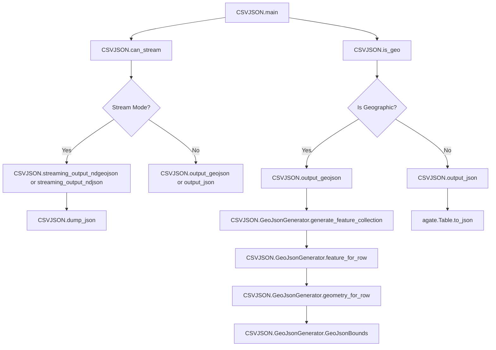
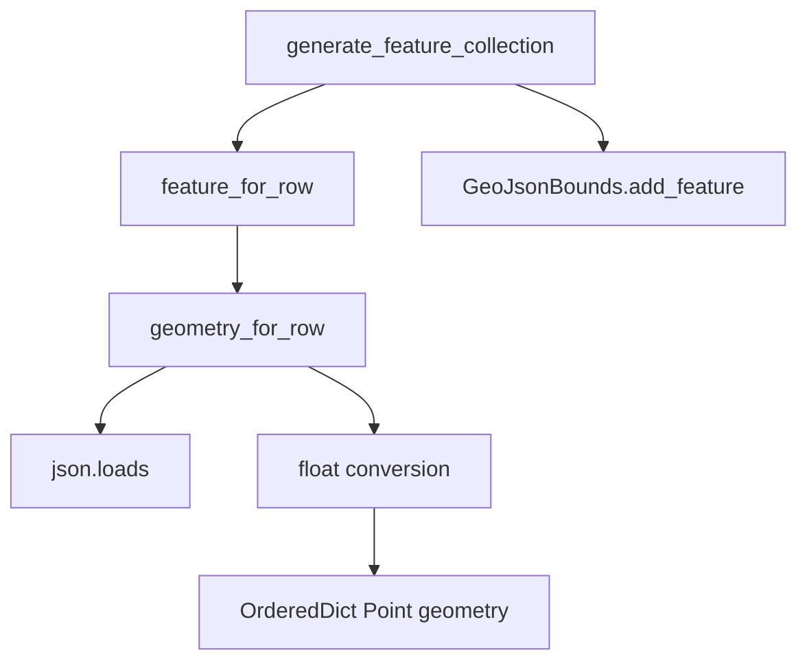
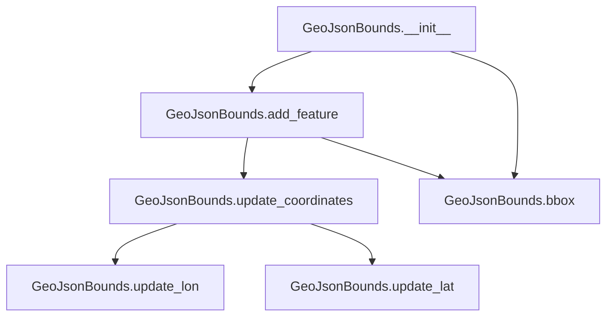

# `csvjson.py`

## `csvkit.utilities.csvjson.CSVJSON` · *class*

## Summary:
Converts CSV files into JSON or GeoJSON format with support for streaming, indentation, and geographic data.

## Description:
The CSVJSON class implements a command-line utility that transforms CSV data into JSON or GeoJSON format. It supports various output modes including standard JSON arrays, keyed objects, newline-delimited JSON, and GeoJSON FeatureCollections. The class handles geographic data conversion when latitude and longitude columns are specified, supporting both point geometries and custom geometry specifications.

This class extends CSVKitUtility to provide standardized CSV processing capabilities while implementing specific logic for JSON/GeoJSON conversion. It supports advanced features like bounding box calculation, coordinate reference systems, and streaming output for large datasets.

## State:
- args (argparse.Namespace): Parsed command-line arguments containing conversion options
- json_kwargs (dict): Configuration dictionary for JSON serialization (indentation settings)
- output_file (file-like object): Output destination for converted data
- input_file (file-like object): Input source for CSV data

## Lifecycle:
- Creation: Instantiated by the csvkit command-line framework with parsed arguments
- Usage: Called via run() method inherited from CSVKitUtility, which executes main() method
- Destruction: Automatic cleanup handled by parent class file management

## Method Map:


## Raises:
- SystemExit: Raised by argparser.error() when validation fails (e.g., missing required arguments)
- ValueError: Raised during CSV parsing when invalid numeric values are encountered
- UnicodeDecodeError: Propagated from file I/O operations when encoding issues occur

## Example:
```python
# Convert CSV to standard JSON
# python csvjson.py data.csv

# Convert CSV to GeoJSON with latitude/longitude columns
# python csvjson.py -l latitude -o longitude data.csv

# Convert CSV to indented JSON with key column
# python csvjson.py -k id -i 2 data.csv

# Stream output as newline-delimited JSON
# python csvjson.py --stream data.csv
```

### `csvkit.utilities.csvjson.CSVJSON.add_arguments` · *method*

## Summary:
Configures command-line arguments for CSV to JSON conversion with support for JSON formatting and GeoJSON output options.

## Description:
Adds command-line arguments to the instance's argument parser to enable flexible CSV to JSON conversion. This method defines all available CLI options including JSON formatting controls (indentation, streaming), GeoJSON generation parameters (latitude/longitude columns, CRS), and CSV parsing configuration (sniff limit, type inference). The separated argument configuration promotes clean CLI interface design and allows for easy extension of command-line options.

## Args:
    None

## Returns:
    None

## Raises:
    None

## State Changes:
    Attributes READ: None
    Attributes WRITTEN: self.argparser (populated with argument definitions)

## Constraints:
    Preconditions: self.argparser must be initialized and accessible
    Postconditions: The argument parser contains all defined command-line options for CSV to JSON conversion

## Side Effects:
    None

### `csvkit.utilities.csvjson.CSVJSON.dump_json` · *method*

## Summary:
Serializes data to JSON format and writes it to the output file with optional newline termination.

## Description:
Writes JSON-serialized data to the configured output file using Python's json module. This method handles non-standard JSON-serializable types (datetime and decimal objects) through the default_str_decimal converter and supports additional JSON serialization options via self.json_kwargs. The method can optionally append a newline character after the JSON output.

## Args:
    data (Any): The data structure to serialize to JSON format. Can be any JSON-serializable object or objects with custom serialization support via default_str_decimal.
    newline (bool): If True, appends a newline character after the JSON output. Defaults to False.

## Returns:
    None: This method does not return a value.

## Raises:
    TypeError: When data contains objects that cannot be serialized to JSON format and are not handled by default_str_decimal.

## State Changes:
    Attributes READ: 
        - self.output_file: The file-like object where JSON data is written
        - self.json_kwargs: Additional keyword arguments for json.dump() serialization
    Attributes WRITTEN: None

## Constraints:
    Precondition: self.output_file must be a writable file-like object opened in text mode.
    Precondition: self.json_kwargs must be a dictionary of valid keyword arguments for json.dump().
    Postcondition: Data is written to self.output_file in JSON format.
    Postcondition: If newline=True, a newline character is appended to the output.

## Side Effects:
    I/O: Writes serialized JSON data to the file represented by self.output_file.
    Text encoding: Uses UTF-8 encoding for output (ensure self.output_file supports this).

### `csvkit.utilities.csvjson.CSVJSON.can_stream` · *method*

## Summary:
Determines whether the CSV processing can be streamed to output based on command-line argument settings.

## Description:
This method evaluates whether all necessary conditions are met to enable streaming output mode for CSV processing. When streaming is enabled, the utility processes and outputs data incrementally rather than loading the entire dataset into memory first. This method is typically called during the setup phase of CSV processing to decide whether to use streaming mode for output processing.

The method is called by the CSVJSON utility's main execution flow to determine if streaming output can be safely enabled based on user-specified command-line arguments.

## Args:
    None: This method takes no parameters beyond the implicit self reference.

## Returns:
    bool: True if all streaming conditions are met, False otherwise. Streaming is enabled when:
        - streamOutput argument is set to True (enabling streaming mode)
        - no_inference argument is set to True (disabling type inference for performance)
        - sniff_limit argument equals 0 (disabling CSV dialect sniffing for faster processing)
        - skip_lines argument is not set (no line skipping required for streaming)

## Raises:
    None: This method does not raise any exceptions.

## State Changes:
    Attributes READ:
        - self.args.streamOutput: Boolean flag indicating if streaming output is requested
        - self.args.no_inference: Boolean flag indicating if type inference should be disabled
        - self.args.sniff_limit: Integer limit on bytes to sniff for CSV dialect detection
        - self.args.skip_lines: Value indicating number of lines to skip at start of file (None or falsy value)

## Constraints:
    Preconditions:
        - The self.args attribute must be populated with parsed command-line arguments
        - All referenced arguments must be defined in the argument parser
        
    Postconditions:
        - Returns a boolean value indicating streaming capability status
        - No changes are made to the object's state

## Side Effects:
    None: This method performs only logical comparisons and returns a value without side effects.

### `csvkit.utilities.csvjson.CSVJSON.is_geo` · *method*

## Summary:
Determines whether geographic coordinate columns (latitude and longitude) are specified in the command-line arguments.

## Description:
This method evaluates whether both latitude (--lat) and longitude (--lon) command-line arguments have been provided to indicate that the CSV data contains geographic coordinate information. When both arguments are present and non-empty, the CSVJSON utility will format its output as geoJSON instead of standard JSON.

The method is called during the CSV to JSON conversion process to determine appropriate output formatting based on the presence of geographic data columns.

## Args:
    None

## Returns:
    bool: True if both self.args.lat and self.args.lon are truthy values (non-empty strings), False otherwise

## Raises:
    AttributeError: If self.args does not have lat or lon attributes

## State Changes:
    Attributes READ: self.args.lat, self.args.lon
    Attributes WRITTEN: None

## Constraints:
    Preconditions: 
    - self.args must be an argparse.Namespace object with lat and lon attributes
    - Both self.args.lat and self.args.lon should be string values or None
    
    Postconditions:
    - Returns a boolean indicating whether geographic coordinate columns are specified
    
## Side Effects:
    None

### `csvkit.utilities.csvjson.CSVJSON.read_csv_to_table` · *method*

## Summary:
Converts CSV input data into an agate Table object with proper column type inference and CSV parsing configuration.

## Description:
This method reads CSV data from the configured input file and transforms it into an agate Table structure, applying appropriate column type inference and CSV parsing parameters. It serves as the core CSV processing entry point for the CSVJSON utility, enabling subsequent JSON or GeoJSON conversion operations.

The method leverages the agate library's robust CSV parsing capabilities while respecting command-line configuration options such as skip lines, sniff limit, and column type inference rules. It's designed to be reusable across different output modes (standard JSON vs GeoJSON) within the CSVJSON utility.

## Args:
    None - This is an instance method that operates on self

## Returns:
    agate.Table: An agate Table object containing the parsed CSV data with inferred column types and proper data structure

## Raises:
    Exception: May raise exceptions from agate.Table.from_csv when encountering invalid CSV data or file I/O errors

## State Changes:
    Attributes READ: 
        - self.args.sniff_limit
        - self.args.skip_lines
        - self.input_file
        - self.reader_kwargs
        - self.get_column_types()
    Attributes WRITTEN: None

## Constraints:
    Preconditions:
        - self.input_file must be a valid file-like object opened for reading
        - self.args must be properly initialized with CSV parsing configuration
        - self.reader_kwargs must contain valid keyword arguments for CSV reader construction
        - self.get_column_types() must return a valid agate.TypeTester instance

    Postconditions:
        - Returns a properly constructed agate.Table instance
        - The returned table contains all CSV rows with appropriate column types inferred
        - The table maintains the original CSV structure and data integrity

## Side Effects:
    I/O: Reads from self.input_file (which may be a file or stdin)
    External service calls: None
    Mutations to objects outside self: None

### `csvkit.utilities.csvjson.CSVJSON.output_json` · *method*

## Summary:
Converts CSV data to JSON format and writes it to the output file using agate's serialization.

## Description:
This method serves as the core JSON output mechanism for the CSVJSON utility. It reads CSV data from the input file using the configured CSV parsing parameters, converts it to an agate Table, and serializes that table to JSON format with configurable formatting options. This method is invoked during the main execution flow when producing standard JSON output (as opposed to streaming or GeoJSON formats).

The method leverages agate's built-in `to_json()` method with parameters derived from command-line arguments:
- `key`: When specified, outputs JSON as an object keyed by the specified column values
- `newline`: When enabled, outputs JSON as newline-separated objects instead of an array
- `indent`: Controls pretty-printing indentation for readable JSON output

## Args:
    None: This method does not accept any explicit arguments beyond the implicit self reference.

## Returns:
    None: This method does not return a value.

## Raises:
    None: This method does not explicitly raise exceptions, though underlying operations may raise exceptions from file I/O, CSV parsing, or JSON serialization.

## State Changes:
    Attributes READ:
        - self.args: Contains command-line arguments including key, streamOutput, and indent
        - self.input_file: The input file handle containing CSV data
        - self.output_file: The output file handle where JSON will be written
    Attributes WRITTEN:
        - None: This method does not modify any instance attributes directly

## Constraints:
    Preconditions:
        - The input file must be readable and contain valid CSV data
        - The output file must be writable
        - The CSV parsing configuration (reader_kwargs) must be properly set up
        - The method should only be called when not in streaming mode or GeoJSON mode (handled by main())

    Postconditions:
        - The output file contains properly formatted JSON representing the CSV data
        - The JSON output follows the formatting options specified by command-line arguments
        - The output format is either a JSON array (default) or JSON objects separated by newlines (when --stream is used)

## Side Effects:
    - Writes JSON data to self.output_file
    - Reads CSV data from self.input_file
    - May raise exceptions from underlying CSV parsing or JSON serialization operations

### `csvkit.utilities.csvjson.CSVJSON.output_geojson` · *method*

## Summary:
Converts CSV data to GeoJSON format by generating either individual GeoJSON features or a complete GeoJSON FeatureCollection.

## Description:
Processes CSV data and transforms it into GeoJSON format using the GeoJsonGenerator class. This method serves as the core output handler for the CSVJSON utility, supporting both streaming output for large datasets and batch processing for smaller datasets. It reads CSV data through the inherited CSVKitUtility.read_csv_to_table() method, applies GeoJSON conversion logic via GeoJsonGenerator, and outputs the result using the inherited CSVKitUtility.dump_json() method.

The method determines output behavior based on the streamOutput command-line argument: when enabled, it outputs each row as a separate GeoJSON feature; otherwise, it generates a complete GeoJSON FeatureCollection containing all features. This approach allows for efficient processing of large datasets by streaming results incrementally, or batch processing for smaller datasets.

## Args:
    None: This is a method that operates on the instance state and does not accept additional parameters.

## Returns:
    None: This method performs I/O operations and does not return a value.

## Raises:
    None explicitly raised by this method, though underlying operations may raise exceptions from:
    - CSV reading operations (IOError, UnicodeDecodeError)
    - JSON serialization (TypeError)
    - GeoJSON generation (ValueError during coordinate conversion)

## State Changes:
    Attributes READ:
        - self.args: Command-line arguments including streamOutput flag and GeoJSON configuration
        - self.output_file: Output destination for JSON data
        - self.json_kwargs: JSON serialization options
        - self.GeoJsonGenerator: The GeoJSON generator class
    Attributes WRITTEN:
        - None: This method does not modify instance state directly

## Constraints:
    Precondition: The CSV input file must be readable and contain valid CSV data.
    Precondition: The GeoJsonGenerator class must be properly initialized with valid column identifiers.
    Precondition: The output file must be writable.
    Postcondition: GeoJSON output is written to the configured output destination.
    Postcondition: When streamOutput is enabled, each row produces a separate JSON object.

## Side Effects:
    I/O: Reads from the input CSV file and writes JSON-formatted GeoJSON data to the output file.
    Text encoding: Uses UTF-8 encoding for output (via inherited dump_json method).
    Memory usage: Processes CSV data in batches (when not streaming) or row-by-row (when streaming).

### `csvkit.utilities.csvjson.CSVJSON.streaming_output_ndjson` · *method*

## Summary:
Converts CSV data to Newline Delimited JSON (NDJSON) format by streaming rows one at a time.

## Description:
Processes CSV input line-by-line, converting each data row into a JSON object with column names as keys. This method is designed for efficient processing of large CSV files by streaming output rather than loading entire datasets into memory. It handles missing values gracefully by setting them to None when a row has fewer columns than the header row.

The method reads from self.input_file using agate.csv.reader with configuration from self.reader_kwargs, extracts column names from the first row, and then processes each subsequent row to create JSON objects that are output via self.dump_json().

## Args:
    None

## Returns:
    None

## Raises:
    None explicitly raised by this method. However, underlying operations may raise:
        - IOError: If self.input_file cannot be read
        - StopIteration: If CSV file is empty or has no data rows
        - IndexError: If row indexing fails during column mapping

## State Changes:
    Attributes READ: 
        - self.input_file: File handle for CSV input
        - self.reader_kwargs: Configuration for CSV reader
    Attributes WRITTEN: 
        - None (modifies no instance attributes directly)

## Constraints:
    Preconditions:
        - self.input_file must be a valid file-like object opened for reading
        - self.reader_kwargs must contain valid keyword arguments for agate.csv.reader
        - CSV file must have at least one row (header row)
        
    Postconditions:
        - All CSV rows (except header) are converted to JSON objects
        - Each JSON object contains keys matching column names from header row
        - Output is written to self.output_file via self.dump_json() method

## Side Effects:
    - Reads from self.input_file (file I/O operation)
    - Writes to self.output_file (file I/O operation via dump_json)
    - May raise exceptions from underlying file operations or CSV parsing

### `csvkit.utilities.csvjson.CSVJSON.streaming_output_ndgeojson` · *method*

## Summary:
Processes CSV rows and outputs them as newline-delimited GeoJSON features.

## Description:
Converts CSV data to NDGeoJSON (newline-delimited GeoJSON) format by reading rows sequentially and transforming each into a GeoJSON Feature object. This method is specifically invoked when streaming output is enabled and geographic coordinates are specified via --lat and --lon command-line arguments.

## Args:
    None

## Returns:
    None

## Raises:
    None explicitly raised

## State Changes:
    Attributes READ: self.input_file, self.reader_kwargs, self.args, self.output_file, self.json_kwargs
    Attributes WRITTEN: None

## Constraints:
    Preconditions:
    - Command-line arguments must specify both --lat and --lon flags
    - Streaming output must be enabled via --stream flag
    - Input file must be available and readable
    - CSV data must contain columns matching the specified --lat and --lon identifiers
    
    Postconditions:
    - Each row is converted to a GeoJSON Feature with proper geometry
    - Output is written as newline-delimited JSON to self.output_file
    - Features include properties from non-coordinate columns

## Side Effects:
    - Reads from self.input_file (CSV input)
    - Writes to self.output_file (JSON output)
    - Calls agate.csv.reader to parse CSV data
    - Calls self.dump_json for each processed row
    - Uses self.GeoJsonGenerator to transform rows into GeoJSON features

## `csvkit.utilities.csvjson.GeoJsonGenerator` · *class*

## Summary:
Generates GeoJSON FeatureCollection objects from CSV data by mapping specified columns to GeoJSON geometry and property fields.

## Description:
This class transforms tabular CSV data into GeoJSON format, specifically creating FeatureCollection objects. It maps CSV columns to GeoJSON elements such as latitude/longitude coordinates, geometry data, feature types, and unique identifiers. The generator supports various GeoJSON features including bounding box calculation and coordinate reference system specification. It is part of the csvkit utilities package for command-line CSV processing.

## State:
- `args`: argparse.Namespace object containing command-line arguments with attributes like lat, lon, type, geometry, key, no_bbox, crs, zero_based
- `column_names`: List[str] of column names from the CSV table
- `lat_column`: int or None - index of the latitude column, determined by match_column_identifier
- `lon_column`: int or None - index of the longitude column, determined by match_column_identifier  
- `type_column`: int or None - index of the type column, determined by match_column_identifier
- `geometry_column`: int or None - index of the geometry column, determined by match_column_identifier
- `id_column`: int or None - index of the ID column, determined by match_column_identifier

## Lifecycle:
Creation: Instantiate with args (argparse.Namespace) and column_names (list of str). The constructor processes column identifiers using match_column_identifier function to map column names to indices.
Usage: Call generate_feature_collection(table) with an agate Table object to produce a GeoJSON FeatureCollection OrderedDict.
Destruction: No explicit cleanup required; uses standard Python garbage collection.

## Method Map:


## Raises:
- None explicitly raised by __init__
- ValueError may be raised internally during float conversion in geometry_for_row when invalid numeric data is encountered

## Example:
```python
# Assuming args contains lat, lon, and other configuration
generator = GeoJsonGenerator(args, ['name', 'latitude', 'longitude'])
feature_collection = generator.generate_feature_collection(table)
```

### `csvkit.utilities.csvjson.GeoJsonGenerator.__init__` · *method*

## Summary:
Initializes a GeoJsonGenerator instance by mapping column identifiers to zero-based indices for GeoJSON generation.

## Description:
Configures column mappings for GeoJSON feature generation by resolving user-specified column names or indices into zero-based column indices. This method processes command-line arguments to determine which CSV columns correspond to geographic coordinates, feature types, geometry data, and unique identifiers.

## Args:
    args (argparse.Namespace): Command-line arguments namespace containing:
        - lat (str|int): Latitude column identifier (name or 1-based index)
        - lon (str|int): Longitude column identifier (name or 1-based index)
        - type (str|int, optional): Feature type column identifier
        - geometry (str|int, optional): Geometry column identifier
        - key (str|int, optional): Unique identifier column identifier
        - zero_based (bool): Flag indicating if column indices are zero-based
    column_names (list[str]): List of column names from the CSV header

## Returns:
    None: This method initializes instance attributes and does not return a value

## Raises:
    ColumnIdentifierError: When any column identifier cannot be resolved to a valid column index
        - If a column name doesn't exist in column_names
        - If a numeric column index is out of bounds
        - If a numeric column index is negative

## State Changes:
    Attributes READ: self.args, self.column_names
    Attributes WRITTEN: 
        - self.lat_column: int or None - zero-based index of latitude column
        - self.lon_column: int or None - zero-based index of longitude column
        - self.type_column: int or None - zero-based index of type column
        - self.geometry_column: int or None - zero-based index of geometry column
        - self.id_column: int or None - zero-based index of ID column

## Constraints:
    Preconditions:
        - args must be an argparse.Namespace with required attributes
        - column_names must be a non-empty list of strings
        - All column identifiers in args must be valid (either existing column names or valid numeric indices)
    
    Postconditions:
        - All column attributes are set to either valid zero-based column indices or None
        - self.lat_column and self.lon_column are always set to valid indices or None
        - Optional column attributes (type, geometry, key) are set to None when not specified

## Side Effects:
    None: This method performs no I/O operations or external service calls

### `csvkit.utilities.csvjson.GeoJsonGenerator.generate_feature_collection` · *method*

## Summary:
Creates a GeoJSON FeatureCollection from a table of CSV data by processing each row into individual features and optionally calculating bounding box and coordinate reference system information.

## Description:
This method generates a complete GeoJSON FeatureCollection structure from tabular CSV data. It iterates through each row in the input table, converts each row into a GeoJSON Feature using the feature_for_row method, and collects these features into a list. Depending on command-line arguments, it also calculates bounding box coordinates and includes coordinate reference system information in the output.

## Args:
    table: An agate Table object containing the CSV data to convert to GeoJSON

## Returns:
    OrderedDict: A GeoJSON FeatureCollection structure with type, features, and optional bbox/crs fields

## Raises:
    None explicitly raised

## State Changes:
    Attributes READ: 
        - self.args.no_bbox
        - self.args.crs
    
    Attributes WRITTEN: None

## Constraints:
    Preconditions:
        - The table parameter must be a valid agate Table object with rows
        - The GeoJsonGenerator instance must be properly initialized with required arguments
        - The feature_for_row method must be available and functional
    
    Postconditions:
        - Returns a properly formatted GeoJSON FeatureCollection structure
        - The features list contains valid GeoJSON Feature objects
        - If no_bbox argument is False, the bbox field contains calculated bounding coordinates
        - If crs argument is provided, the crs field contains the coordinate reference system information

## Side Effects:
    - Calls self.feature_for_row() for each row in the table
    - May call self.GeoJsonBounds().add_feature() for each feature when no_bbox is False
    - Uses OrderedDict for maintaining proper GeoJSON field ordering

### `csvkit.utilities.csvjson.GeoJsonGenerator.feature_for_row` · *method*

## Summary:
Creates a GeoJSON Feature object from a CSV row by extracting properties, setting an ID if specified, and adding geometry information.

## Description:
This method transforms a single CSV row into a GeoJSON Feature structure. It processes each cell in the row, excluding special columns (type, latitude, longitude, geometry), and populates the feature's properties dictionary. If an ID column is specified, it sets the feature's ID. It then adds geometry information by calling the geometry_for_row method. This method is typically called during the generation of GeoJSON FeatureCollections from CSV data.

## Args:
    row: A sequence (list/tuple) representing a single row of CSV data

## Returns:
    OrderedDict: A GeoJSON Feature structure containing type, properties, and geometry fields

## Raises:
    None explicitly raised

## State Changes:
    Attributes READ: 
        - self.type_column
        - self.lat_column  
        - self.lon_column
        - self.geometry_column
        - self.id_column
        - self.column_names
    
    Attributes WRITTEN: None

## Constraints:
    Preconditions:
        - The row parameter must be a sequence-like object with the same length as the column count
        - All column identifier attributes (type_column, lat_column, etc.) must be properly initialized
        - The geometry_for_row method must be implemented and callable
    
    Postconditions:
        - Returns a properly formatted GeoJSON Feature structure
        - The returned feature contains all non-special column data in properties
        - The feature's geometry is populated by calling geometry_for_row

## Side Effects:
    - Calls self.geometry_for_row(row) which may involve JSON parsing or coordinate conversion
    - Uses OrderedDict for maintaining insertion order in the GeoJSON structure

### `csvkit.utilities.csvjson.GeoJsonGenerator.geometry_for_row` · *method*

## Summary:
Generates GeoJSON geometry object from a CSV row by either parsing a geometry column or creating a Point from latitude/longitude columns.

## Description:
This method constructs a GeoJSON geometry object for a given CSV row. It supports two input modes: 1) when a dedicated geometry column contains valid GeoJSON data, or 2) when separate latitude and longitude columns are provided to construct a Point geometry. The method is called during the feature creation process by the `feature_for_row` method to populate the geometry field of each GeoJSON feature.

## Args:
    row (list): A list representing a single row of CSV data, where each element corresponds to a column value.

## Returns:
    OrderedDict or None: A GeoJSON geometry object as an OrderedDict with 'type' and 'coordinates' keys for Point geometries, or the parsed geometry from a geometry column. Returns None when no valid geometry can be constructed due to missing or invalid data.

## Raises:
    None explicitly raised, though ValueError may occur internally during float conversion.

## State Changes:
    Attributes READ: self.geometry_column, self.lat_column, self.lon_column
    Attributes WRITTEN: None

## Constraints:
    Preconditions: 
    - The row parameter must be a list with sufficient indices to access the configured columns
    - Either self.geometry_column must be set OR both self.lat_column and self.lon_column must be set
    - When using lat/lon columns, the corresponding row values must be convertible to float
    
    Postconditions:
    - Returns a properly formatted GeoJSON Point geometry when lat/lon values are valid
    - Returns parsed JSON geometry when geometry_column is set
    - Returns None when no valid geometry can be constructed

## Side Effects:
    None

## `csvkit.utilities.csvjson.GeoJsonBounds` · *class*

## Summary:
Tracks and updates geographic bounding box coordinates from GeoJSON data.

## Description:
The GeoJsonBounds class maintains minimum and maximum longitude and latitude values to represent a geographic bounding box. It processes GeoJSON features to extract coordinates and update the bounding box boundaries accordingly. This class is used in CSV to GeoJSON conversion utilities to compute overall geographic extents.

## State:
- min_lon: float, minimum longitude value, initially None
- min_lat: float, minimum latitude value, initially None  
- max_lon: float, maximum longitude value, initially None
- max_lat: float, maximum latitude value, initially None

## Lifecycle:
- Creation: Instantiate with GeoJsonBounds() constructor
- Usage: Call add_feature() with GeoJSON features to update bounds, then bbox() to retrieve results
- Destruction: No special cleanup required, uses standard Python garbage collection

## Method Map:


## Raises:
- No explicit exceptions raised by any methods

## Example:
```python
bounds = GeoJsonBounds()
feature = {
    "type": "Feature",
    "geometry": {
        "type": "Point",
        "coordinates": [-74.006, 40.7128]
    }
}
bounds.add_feature(feature)
bbox = bounds.bbox()  # Returns [-74.006, 40.7128, -74.006, 40.7128]
```

### `csvkit.utilities.csvjson.GeoJsonBounds.__init__` · *method*

## Summary:
Initializes a GeoJsonBounds instance with all geographic coordinate boundaries set to None.

## Description:
Creates a new GeoJsonBounds object and initializes its internal state with four bounding coordinate attributes (min_lon, min_lat, max_lon, max_lat) all set to None. This represents the initial state before any geographic features have been processed. The object is ready to accept GeoJSON features through the add_feature() method to begin tracking bounding coordinates.

## Args:
    None: This method takes no arguments beyond the implicit self parameter.

## Returns:
    None: This method does not return any value.

## Raises:
    None: This method does not raise any exceptions.

## State Changes:
    Attributes READ: None
    Attributes WRITTEN: 
    - self.min_lon: Set to None
    - self.min_lat: Set to None  
    - self.max_lon: Set to None
    - self.max_lat: Set to None

## Constraints:
    Preconditions: None
    Postconditions: All four bounding coordinate attributes are initialized to None, indicating no geographic bounds have been established yet.

## Side Effects:
    None: This method performs no I/O operations or external mutations. It only initializes instance attributes.

### `csvkit.utilities.csvjson.GeoJsonBounds.bbox` · *method*

## Summary:
Returns the geographic bounding box coordinates in GeoJSON format [min_lon, min_lat, max_lon, max_lat].

## Description:
This method provides access to the geographic bounds tracked by the GeoJsonBounds instance. It returns the minimum and maximum longitude and latitude values as a list in the standard GeoJSON bounding box format. This method is typically called after processing geographic features to retrieve the overall extent of the dataset.

## Args:
    None

## Returns:
    list[float]: A list containing four floating-point numbers representing [min_lon, min_lat, max_lon, max_lat]. Returns [None, None, None, None] if no coordinates have been processed yet.

## Raises:
    None

## State Changes:
    Attributes READ: self.min_lon, self.min_lat, self.max_lon, self.max_lat
    Attributes WRITTEN: None

## Constraints:
    Preconditions: The GeoJsonBounds instance must be properly initialized (which happens automatically via __init__)
    Postconditions: The returned list contains the current bounding box coordinates in the standard order [min_lon, min_lat, max_lon, max_lat]

## Side Effects:
    None

### `csvkit.utilities.csvjson.GeoJsonBounds.add_feature` · *method*

## Summary:
Updates the bounding box coordinates by processing a GeoJSON feature's geometry coordinates.

## Description:
This method examines a GeoJSON feature to determine if it contains geometry with coordinates, and if so, updates the bounding box coordinates using the feature's coordinate data. It serves as part of the GeoJSON bounds calculation pipeline, specifically designed to handle individual feature processing within a larger GeoJSON dataset. When a feature lacks proper geometry or coordinates, the method silently ignores it and makes no changes to the bounding box.

## Args:
    feature (dict): A GeoJSON feature object containing potential geometry and coordinates keys.

## Returns:
    None: This method does not return any value.

## Raises:
    None: This method does not explicitly raise exceptions.

## State Changes:
    Attributes READ: self.min_lon, self.min_lat, self.max_lon, self.max_lat
    Attributes WRITTEN: self.min_lon, self.min_lat, self.max_lon, self.max_lat

## Constraints:
    Preconditions: The feature parameter must be a dictionary-like object that can be checked for 'geometry' and 'coordinates' keys.
    Postconditions: If the feature contains valid geometry coordinates, the bounding box attributes (min_lon, min_lat, max_lon, max_lat) will be updated to encompass the new coordinates. If the feature does not meet the criteria, the bounding box remains unchanged.

## Side Effects:
    None: This method does not perform I/O operations or mutate external objects. It only modifies the instance's internal state.

### `csvkit.utilities.csvjson.GeoJsonBounds.update_lat` · *method*

## Summary:
Updates the minimum and maximum latitude bounds by comparing with a given latitude value.

## Description:
This method maintains the geographical bounding box coordinates by updating the minimum and maximum latitude values when a new latitude is encountered. It is called internally during GeoJSON feature processing to track the extent of latitude values across all features in a dataset. The method ensures that the bounding box accurately represents the full geographic coverage of the GeoJSON data.

## Args:
    lat (float or int): The latitude value to compare against existing bounds. Must be a numeric value representing degrees latitude.

## Returns:
    None: This method does not return any value.

## Raises:
    None: This method does not explicitly raise exceptions.

## State Changes:
    Attributes READ: self.min_lat, self.max_lat
    Attributes WRITTEN: self.min_lat, self.max_lat

## Constraints:
    Preconditions: The method assumes that the instance has been properly initialized with the GeoJsonBounds class constructor, which sets all bounding box attributes to None initially.
    Postconditions: After execution, either self.min_lat or self.max_lat (or both) will be updated to the provided lat value if it represents a new extreme bound.

## Side Effects:
    None: This method does not perform I/O operations or mutate external objects. It only modifies the instance's internal state.

### `csvkit.utilities.csvjson.GeoJsonBounds.update_lon` · *method*

## Summary:
Updates the minimum and maximum longitude bounds by comparing with a given longitude value.

## Description:
This method maintains the geographical bounding box coordinates by updating the minimum and maximum longitude values when a new longitude is encountered. It is called internally during GeoJSON feature processing to track the extent of longitude values across all features in a dataset. The method ensures that the bounding box accurately represents the full geographic coverage of the GeoJSON data along the longitude axis.

## Args:
    lon (float or int): The longitude value to compare against existing bounds. Must be a numeric value representing degrees longitude.

## Returns:
    None: This method does not return any value.

## Raises:
    None: This method does not explicitly raise exceptions.

## State Changes:
    Attributes READ: self.min_lon, self.max_lon
    Attributes WRITTEN: self.min_lon, self.max_lon

## Constraints:
    Preconditions: The method assumes that the instance has been properly initialized with the GeoJsonBounds class constructor, which sets all bounding box attributes to None initially.
    Postconditions: After execution, either self.min_lon or self.max_lon (or both) will be updated to the provided lon value if it represents a new extreme bound.

## Side Effects:
    None: This method does not perform I/O operations or mutate external objects. It only modifies the instance's internal state.

### `csvkit.utilities.csvjson.GeoJsonBounds.update_coordinates` · *method*

## Summary:
Recursively processes coordinate data to update the minimum and maximum longitude and latitude bounds for a GeoJSON bounding box.

## Description:
This method handles the recursive parsing of GeoJSON coordinate data to update the bounding box coordinates. It distinguishes between flat coordinate arrays (containing longitude, latitude, and optionally altitude) and nested coordinate structures (such as polygons or multi-geometries). When processing flat coordinates, it updates the longitude and latitude bounds directly. For nested structures, it recursively processes each coordinate element. This method is called internally by the `add_feature` method when processing GeoJSON features with geometry coordinates.

## Args:
    coordinates (list): A list of coordinate values that can either be:
        - Flat array with up to 3 elements: [longitude, latitude, altitude] (where altitude is optional)
        - Nested array structure containing multiple coordinate sets for complex geometries

## Returns:
    None: This method does not return any value.

## Raises:
    None: This method does not explicitly raise exceptions.

## State Changes:
    Attributes READ: self.min_lon, self.min_lat, self.max_lon, self.max_lat
    Attributes WRITTEN: self.min_lon, self.min_lat, self.max_lon, self.max_lat

## Constraints:
    Preconditions: The coordinates parameter must be a list-like object that can be evaluated with len() and indexed.
    Postconditions: After processing, the instance's bounding box attributes (min_lon, min_lat, max_lon, max_lat) will be updated to encompass all processed coordinates.

## Side Effects:
    None: This method does not perform I/O operations or mutate external objects. It only modifies the instance's internal state through calls to update_lon and update_lat methods.

## `csvkit.utilities.csvjson.launch_new_instance` · *function*

## Summary:
Creates and executes a new CSVJSON utility instance to convert CSV data to JSON or GeoJSON format.

## Description:
This function serves as the entry point for launching a CSVJSON utility instance. It instantiates the CSVJSON class with default parameters and invokes its run method to process CSV input and generate JSON or GeoJSON output according to specified conversion options.

The function is typically called by the csvkit command-line framework when the csvjson utility is invoked. It follows the standard csvkit pattern of creating a utility instance and running it through the base CSVKitUtility execution lifecycle.

## Args:
    None

## Returns:
    None

## Raises:
    SystemExit: Raised by CSVJSON.run() when argument validation fails or when the utility completes execution
    UnicodeDecodeError: Propagated from file I/O operations when encoding issues occur during CSV reading

## Constraints:
    Preconditions:
    - The function assumes that the command-line arguments have been properly parsed and are available in the global environment
    - Standard csvkit input/output file handling mechanisms are expected to be initialized
    
    Postconditions:
    - The CSVJSON utility will have processed the input CSV file and written output to the designated output stream
    - All file handles will be properly closed after execution

## Side Effects:
    - Reads from stdin or specified input file(s) for CSV data
    - Writes to stdout or specified output file(s) with JSON or GeoJSON formatted output
    - May read from compressed input files (.gz, .bz2, .xz extensions)
    - May write to temporary files during processing (when streaming is enabled)

## Control Flow:
```mermaid
flowchart TD
    A[launch_new_instance] --> B[Create CSVJSON instance]
    B --> C[Call CSVJSON.run()]
    C --> D{CSVKitUtility.run()}
    D --> E[Parse arguments]
    E --> F[Open input file]
    F --> G[Execute CSVJSON.main()]
    G --> H{Is geographic conversion?}
    H -->|Yes| I[Output GeoJSON]
    H -->|No| J[Output standard JSON]
    J --> K[Write JSON to output]
    I --> K
    K --> L[Close files and exit]
```

## Examples:
```python
# Typical usage in command-line context
# python csvjson.py input.csv

# With geographic conversion options
# python csvjson.py -l latitude -o longitude input.csv

# With indentation and key column
# python csvjson.py -k id -i 2 input.csv

# Streaming output
# python csvjson.py --stream input.csv
```

