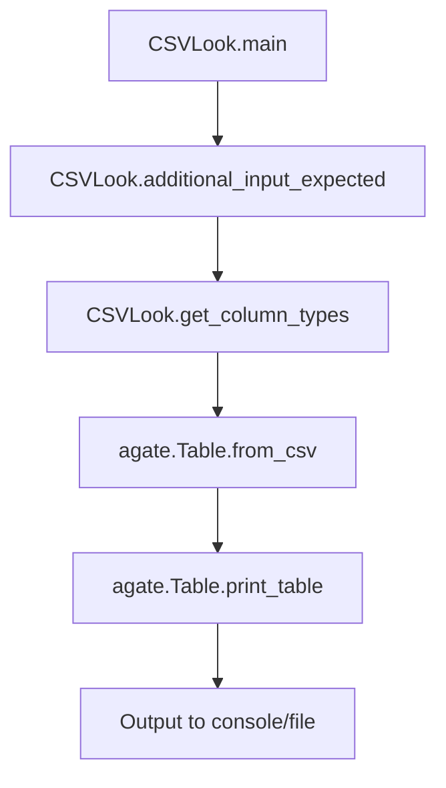

# `csvlook.py`

## `csvkit.utilities.csvlook.CSVLook` · *class*

## Summary:
A command-line utility that renders CSV files as Markdown-compatible, fixed-width tables in the console.

## Description:
The CSVLook class is designed to display CSV data in a formatted table layout suitable for terminal output. It inherits from CSVKitUtility and implements the specific functionality for rendering CSV files as readable tables with configurable formatting options. This utility is particularly useful for quickly inspecting CSV data in a human-readable format directly from the command line.

The class is typically instantiated by the csvkit command-line framework when users invoke the csvlook command, and it processes CSV input according to various formatting parameters such as row/column limits, column width restrictions, and numeric precision controls.

## State:
- description (str): Class-level description set to 'Render a CSV file in the console as a Markdown-compatible, fixed-width table.'
- argparser (argparse.ArgumentParser): Inherited from CSVKitUtility, configured with common CSV options plus CSVLook-specific arguments added in add_arguments()
- args (argparse.Namespace): Parsed command-line arguments containing all user-provided options
- input_file (file-like object): Inherited from CSVKitUtility, opened to the input CSV file or stdin
- output_file (file-like object): Inherited from CSVKitUtility, defaults to stdout for table output

## Lifecycle:
- Creation: Instantiated automatically by the csvkit framework when executing the csvlook command
- Usage: The run() method from CSVKitUtility orchestrates the process by:
  1. Validating that input is provided (via additional_input_expected())
  2. Setting up configuration based on command-line arguments
  3. Reading CSV data using agate.Table.from_csv()
  4. Rendering the data as a formatted table using table.print_table()
- Destruction: Automatic cleanup handled by CSVKitUtility's run() method through context managers

## Method Map:


## Raises:
- SystemExit: Raised by self.argparser.error() when no input file is provided
- Various exceptions potentially raised by agate.Table.from_csv() and agate.Table.print_table() methods (not explicitly caught)

## Example:
```bash
# Display CSV file with default formatting
csvlook data.csv

# Limit displayed rows and columns
csvlook --max-rows 10 --max-columns 5 data.csv

# Truncate long columns and limit numeric precision
csvlook --max-column-width 20 --max-precision 2 data.csv
```

### `csvkit.utilities.csvlook.CSVLook.add_arguments` · *method*

## Summary:
Configures command-line argument parsers with display formatting options for CSV table rendering.

## Description:
Adds command-line arguments to the utility's argument parser that control how CSV data is displayed as a formatted table in the console. This method is called during the initialization phase of CSVKit utilities to extend the argument parser with formatting-specific options.

The method is part of the standard CSVKit utility lifecycle where subclasses implement add_arguments() to customize command-line interface behavior while inheriting common CSV processing capabilities from CSVKitUtility. These arguments control table truncation, column width limits, precision settings, and CSV parsing behavior.

## Args:
    self: The CSVLook instance whose argparser will be modified

## Returns:
    None: This method modifies the instance's argument parser in-place

## Raises:
    None: This method does not raise exceptions directly

## State Changes:
    Attributes READ: None
    Attributes WRITTEN: 
        - self.argparser: Modified by adding multiple argument definitions

## Constraints:
    Preconditions:
        - self.argparser must be initialized (inherited from CSVKitUtility)
        - The method should only be called during object initialization/setup phase
    
    Postconditions:
        - The argument parser contains all defined formatting arguments
        - All arguments are properly configured with appropriate types, defaults, and help text

## Side Effects:
    - Modifies the instance's argparser attribute by adding new argument definitions
    - No external I/O operations or service calls
    - No mutation of objects outside the instance

## Arguments Added:
    - --max-rows: Limits the number of rows displayed before truncating data
    - --max-columns: Limits the number of columns displayed before truncating data  
    - --max-column-width: Truncates columns to specified width with ellipsis
    - --max-precision: Controls decimal places displayed for numeric values
    - --no-number-ellipsis: Disables ellipsis when max-precision is exceeded
    - -y/--snifflimit: Controls CSV dialect sniffing limit in bytes
    - -I/--no-inference: Disables type inference during CSV parsing

### `csvkit.utilities.csvlook.CSVLook.main` · *method*

## Summary:
Processes CSV input and displays it in a formatted table view with configurable formatting options.

## Description:
This method serves as the core execution logic for the csvlook utility, which converts CSV data into a formatted text table display. It validates input requirements, configures CSV processing parameters based on command-line arguments, reads the CSV data using agate's CSV parsing capabilities, and outputs a formatted table representation to the specified output destination.

The method orchestrates the complete workflow of CSV-to-table conversion, handling input validation, configuration of parsing parameters, data loading, and presentation formatting. It's designed to be called by the parent CSVKitUtility class during the execution lifecycle.

## Args:
    None - This is an instance method that operates on self

## Returns:
    None - This method performs I/O operations and does not return a value

## Raises:
    SystemExit: Raised via self.argparser.error() when no input file is provided and stdin is not connected to a terminal

## State Changes:
    Attributes READ: 
        - self.additional_input_expected(): Checks if input is expected from stdin
        - self.args.max_precision: Maximum decimal precision for numeric values
        - self.args.no_number_ellipsis: Flag to disable number truncation ellipsis
        - self.args.sniff_limit: Limit for CSV dialect sniffing
        - self.args.skip_lines: Number of initial lines to skip
        - self.args.line_numbers: Flag to include line numbers in output
        - self.args.max_rows: Maximum number of rows to display
        - self.args.max_columns: Maximum number of columns to display
        - self.args.max_column_width: Maximum width for each column
        - self.input_file: Input file handle for CSV reading
        - self.output_file: Output file handle for table display
        - self.reader_kwargs: CSV reader configuration parameters
    Attributes WRITTEN: 
        - config.set_option(): Modifies global number truncation character setting

## Constraints:
    Preconditions:
        - The CSVKitUtility instance must be properly initialized with command-line arguments
        - self.input_file must be a valid file-like object or stdin handle
        - self.output_file must be a valid file-like object for writing
        - Command-line arguments must be parsed and available in self.args
    Postconditions:
        - A formatted table representation of CSV data is written to self.output_file
        - Global configuration may be modified if --no-number-ellipsis is specified

## Side Effects:
    - Reads from self.input_file (CSV input)
    - Writes to self.output_file (formatted table output)
    - May modify global agate configuration via config.set_option()
    - Calls agate.Table.from_csv() which may perform file I/O and parsing
    - Calls table.print_table() which may perform additional I/O operations

## `csvkit.utilities.csvlook.launch_new_instance` · *function*

## Summary:
Instantiates and executes a CSVLook command-line utility to render CSV data as formatted tables.

## Description:
This function serves as the primary entry point for launching the csvlook command-line utility. It creates an instance of the CSVLook class and invokes its run() method to process CSV input and display it as a Markdown-compatible, fixed-width table in the console. The function follows the standard pattern used throughout csvkit for command-line utility initialization and execution.

The CSVLook utility inherits from CSVKitUtility and provides specialized functionality for rendering CSV files in a human-readable tabular format. This function acts as a simple launcher that delegates the actual work to the CSVLook instance's execution pipeline.

## Args:
    None

## Returns:
    None

## Raises:
    SystemExit: When argument validation fails or when no input file is provided
    Various exceptions: Potentially raised by underlying CSV processing methods during execution

## Constraints:
    Preconditions:
    - Command-line arguments must be available for parsing (typically from sys.argv)
    - The csvkit command-line framework must be properly initialized
    - Input file must be accessible or stdin must be available for reading

    Postconditions:
    - The CSVLook utility's run method completes execution
    - CSV data is rendered to stdout or specified output file
    - Command-line arguments are processed according to CSVLook's specification

## Side Effects:
    - Reads from stdin or specified input file
    - Writes formatted table output to stdout
    - May read command-line arguments from sys.argv
    - May raise SystemExit in error conditions

## Control Flow:
```mermaid
flowchart TD
    A[launch_new_instance called] --> B[Create CSVLook instance]
    B --> C[Call utility.run()]
    C --> D{CSVLook.run() execution}
    D --> E[CSVLook processes CSV input]
    E --> F[CSVLook renders and outputs formatted table]
    F --> G[Function returns]
```

## Examples:
```bash
# Typical usage from command line
csvlook data.csv

# With options
csvlook --max-rows 10 --max-columns 5 data.csv
```

