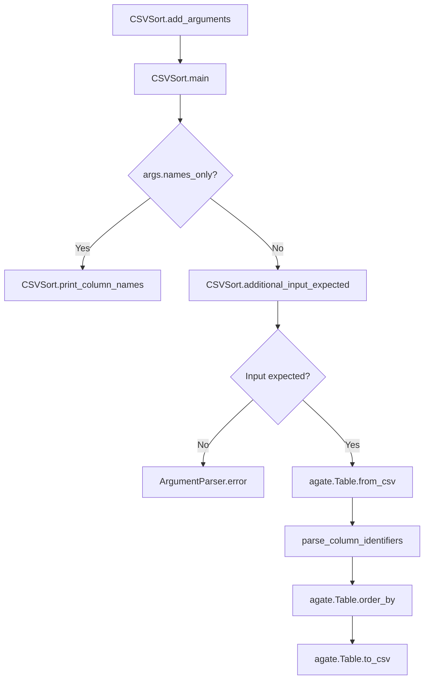

# `csvsort.py`

## `csvkit.utilities.csvsort.CSVSort` · *class*

## Summary:
A command-line utility for sorting CSV files, similar to the Unix "sort" command but designed for tabular data.

## Description:
CSVSort provides functionality to sort CSV files based on one or more columns. It offers flexible sorting options including specifying which columns to sort by, sorting order (ascending/descending), and various CSV parsing controls. The utility integrates with the csvkit framework and leverages agate for efficient CSV processing.

This class is intended to be instantiated and executed as a command-line tool. It inherits from CSVKitUtility, which provides common CSV processing capabilities like argument parsing, file handling, and CSV dialect detection. The utility can be used to sort CSV data in various ways, from simple single-column sorting to complex multi-column sorting with ranges.

## State:
- description (str): Class-level description used in argument parser, set to 'Sort CSV files. Like the Unix "sort" command, but for tabular data.'
- argparser (argparse.ArgumentParser): Configured argument parser with common CSV options inherited from CSVKitUtility
- args (argparse.Namespace): Parsed command-line arguments containing:
  - names_only (bool): Flag to display column names and exit
  - columns (str): Comma-separated list of column indices, names, or ranges to sort by
  - reverse (bool): Flag to sort in descending order
  - sniff_limit (int): Limit CSV dialect sniffing to specified number of bytes
  - no_inference (bool): Flag to disable type inference when parsing input
- output_file (file-like object): Output destination (inherited from CSVKitUtility)
- reader_kwargs (dict): Keyword arguments for CSV reader construction (inherited from CSVKitUtility)
- writer_kwargs (dict): Keyword arguments for CSV writer construction (inherited from CSVKitUtility)
- input_file (file-like object): Input file handle (inherited from CSVKitUtility)

## Lifecycle:
- Creation: Instantiated by the csvkit framework when executing the command-line utility
- Usage: Called via the run() method inherited from CSVKitUtility, which internally calls main()
- Destruction: Automatic cleanup handled by CSVKitUtility's context management

## Method Map:


## Raises:
- argparse.ArgumentError: Raised by argparser when invalid arguments are provided
- ValueError: Raised by agate.Table.from_csv when invalid parameters are passed
- UnicodeDecodeError: Handled by CSVKitUtility's exception handler for encoding issues
- RequiredHeaderError: Raised by print_column_names when --no-header-row is used with -n/--names options
- argparse.ArgumentTypeError: Raised when sniff_limit argument is not a valid integer

## Example:
```python
# Sort by first column in ascending order
# python csvsort.py -c 1 input.csv > sorted_output.csv

# Sort by first column in descending order
# python csvsort.py -c 1 -r input.csv > sorted_desc.csv

# Sort by multiple columns (first and third)
# python csvsort.py -c 1,3 input.csv > multi_sorted.csv

# Sort by column name
# python csvsort.py -c name input.csv > name_sorted.csv

# Display column names only
# python csvsort.py -n input.csv

# Sort by column range (columns 2 through 5)
# python csvsort.py -c 2-5 input.csv > range_sorted.csv

# Disable type inference
# python csvsort.py -I -c 1 input.csv > no_inference_sorted.csv
```

### `csvkit.utilities.csvsort.CSVSort.add_arguments` · *method*

## Summary:
Configures command-line arguments for CSV sorting utility with options for column selection, sorting order, and CSV parsing behavior.

## Description:
Adds command-line argument definitions to the utility's argument parser for controlling CSV sorting operations. This method establishes all available command-line flags and options that users can specify when running the CSV sort utility, including column selection criteria, sort direction, CSV dialect sniffing limits, and type inference settings.

## Args:
    self: The CSVSort instance containing the argparser to configure

## Returns:
    None: This method modifies the instance's argparser in-place and returns nothing

## Raises:
    None: This method does not raise exceptions directly

## State Changes:
    Attributes READ: None
    Attributes WRITTEN: self.argparser (modifies the argument parser configuration)

## Constraints:
    Preconditions: The method assumes self.argparser exists and is a proper ArgumentParser instance
    Postconditions: The argument parser is configured with all supported command-line options

## Side Effects:
    None: This method only configures the argument parser and doesn't perform I/O or external service calls

### `csvkit.utilities.csvsort.CSVSort.main` · *method*

## Summary:
Sorts CSV data by specified columns and outputs the result to a file or stdout.

## Description:
The main method implements the core CSV sorting functionality for the csvsort utility. It processes command-line arguments, reads CSV data from input, sorts the data by specified columns, and writes the sorted results to output. The method handles various command-line options including column selection, reverse sorting, header skipping, and CSV format configuration.

This method serves as the primary execution entry point for the CSV sorting utility, coordinating the entire sorting workflow from input parsing to output generation. It leverages the CSVKitUtility base class for argument handling and file operations, and uses agate for CSV processing and sorting.

## Args:
    None (uses self.args, self.input_file, self.output_file, self.reader_kwargs, self.writer_kwargs)

## Returns:
    None

## Raises:
    SystemExit: Raised by self.argparser.error() when no input file is provided and stdin is not connected to a pipe

## State Changes:
    Attributes READ: 
    - self.args.names_only
    - self.args.columns
    - self.args.reverse
    - self.args.skip_lines
    - self.args.sniff_limit
    - self.args.zero_based
    - self.reader_kwargs
    - self.writer_kwargs
    - self.input_file
    - self.output_file
    
    Attributes WRITTEN: 
    - None (modifies state indirectly through file I/O operations)

## Constraints:
    Preconditions:
    - The CSVKitUtility instance must have been properly initialized with parsed arguments
    - Either an input file path must be provided or data must be piped to stdin
    - The input file must be readable and contain valid CSV data
    - Column identifiers specified in --columns must be valid for the CSV structure
    
    Postconditions:
    - If --names-only flag is set, column names are printed to output and method returns early
    - If input validation passes, CSV data is read, sorted, and written to output
    - The output contains the sorted CSV data with the same structure as input

## Side Effects:
    I/O: Reads from self.input_file and writes to self.output_file
    File Operations: Opens and processes input file for CSV reading
    Command-line Error Handling: Calls self.argparser.error() which terminates program execution

## `csvkit.utilities.csvsort.launch_new_instance` · *function*

## Summary:
Creates and executes a new instance of the CSVSort command-line utility for sorting CSV files.

## Description:
This function serves as the entry point for launching the CSVSort utility. It instantiates a CSVSort object and invokes its run() method to process command-line arguments and execute the sorting operation. The function follows the standard pattern used throughout the csvkit library for command-line utility initialization.

The CSVSort utility enables sorting of CSV files based on one or more columns with support for ascending/descending order, column ranges, and various CSV parsing options. It integrates with the broader csvkit framework through inheritance from CSVKitUtility.

## Args:
    None

## Returns:
    None

## Raises:
    None explicitly raised by this function, though the underlying CSVSort.run() method may raise exceptions from:
    - argparse.ArgumentError: When invalid command-line arguments are provided
    - ValueError: When invalid parameters are passed to agate.Table operations
    - UnicodeDecodeError: When encoding issues occur during file processing
    - RequiredHeaderError: When header row requirements are not met
    - argparse.ArgumentTypeError: When argument parsing fails due to invalid types

## Constraints:
    Preconditions:
    - Command-line arguments must be properly formatted for CSVSort
    - Input file must be readable if not using stdin
    - Output destination must be writable if not using stdout
    
    Postconditions:
    - The CSVSort utility will process input according to specified sorting criteria
    - Command-line arguments will be parsed and validated
    - Sorting results will be written to the specified output destination

## Side Effects:
    - Reads from standard input or specified input file
    - Writes to standard output or specified output file
    - May read from filesystem for input files
    - May write to filesystem for output files
    - Processes command-line arguments from sys.argv

## Control Flow:
```mermaid
flowchart TD
    A[launch_new_instance called] --> B[Create CSVSort instance]
    B --> C[Call CSVSort.run()]
    C --> D{CSVSort.run() executes}
    D --> E[Parse command-line arguments]
    E --> F{Check for special flags}
    F -->|Names only| G[Print column names and exit]
    F -->|Normal operation| H[Process input file]
    H --> I[Parse CSV data with agate]
    I --> J[Apply sorting based on columns]
    J --> K[Write sorted output]
    K --> L[Exit normally]
```

## Examples:
```python
# Typical usage from command line (via csvkit framework):
# python csvsort.py -c 1 input.csv > sorted_output.csv

# Using the launch_new_instance function directly:
from csvkit.utilities.csvsort import launch_new_instance
launch_new_instance()  # Will read from stdin and write to stdout
```

