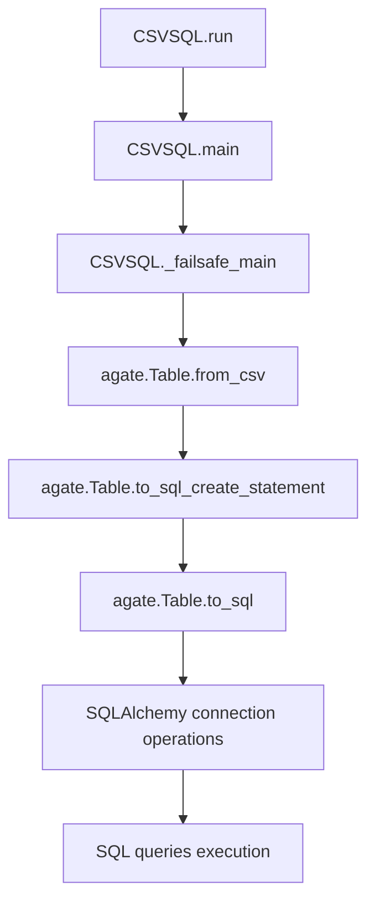

# `csvsql.py`

## `csvkit.utilities.csvsql.CSVSQL` · *class*

## Summary:
Generates SQL statements from CSV files or executes those statements directly on a database, with support for querying and inserting data.

## Description:
The CSVSQL class is a command-line utility that transforms CSV data into SQL operations. It can generate CREATE TABLE statements for CSV files, or directly execute these statements against a database. Additionally, it supports executing arbitrary SQL queries and outputting results as CSV format. This class is designed to work with the csvkit framework and provides extensive control over SQL generation and database operations through various command-line flags.

The class inherits from CSVKitUtility and implements the standard csvkit utility pattern, providing automatic argument parsing, file handling, and CSV processing capabilities while adding specialized functionality for SQL generation and database operations.

## State:
- input_files (list): List of opened file handles for input CSV files, managed automatically by the parent class
- connection (sqlalchemy.engine.base.Connection or None): Database connection object when --db flag is used, initialized in main()
- table_names (list): Names to assign to tables being created, populated from --tables argument
- unique_constraint (list): Column names to include in a UNIQUE constraint, populated from --unique-constraint argument
- args (argparse.Namespace): Parsed command-line arguments from the argument parser
- output_file (file-like object): Output destination for results, inherited from parent class
- reader_kwargs (dict): Configuration for CSV reader construction, inherited from parent class
- writer_kwargs (dict): Configuration for CSV writer construction, inherited from parent class

## Lifecycle:
- Creation: Instantiated by the csvkit command-line framework with parsed arguments, calls parent constructor
- Usage: Called via the run() method inherited from CSVKitUtility, which internally calls main() method
- Destruction: Automatically closes input files and database connections in finally blocks during cleanup

## Method Map:


## Raises:
- SystemExit: Raised by argparser.error() when validation fails due to conflicting arguments
- ImportError: Raised when required database backend is not installed for connection string
- StopIteration: Raised by agate.Table.from_csv when CSV is empty

## Example:
```python
# Generate SQL statements for CSV files
csvsql file1.csv file2.csv --dialect postgresql

# Insert CSV data directly into database
csvsql data.csv --db sqlite:///mydb.sqlite --insert

# Execute SQL queries on database and output results as CSV
csvsql --db sqlite:///mydb.sqlite --query "SELECT * FROM table1 WHERE column1 = 'value'"
```

### `csvkit.utilities.csvsql.CSVSQL.add_arguments` · *method*

*No documentation generated.*

### `csvkit.utilities.csvsql.CSVSQL.main` · *method*

## Summary:
Orchestrates the CSV to SQL conversion process by validating arguments, managing input files and database connections, and executing the core processing logic.

## Description:
This method serves as the entry point for the CSVSQL utility, coordinating the complete workflow from argument validation through file handling, database connection management, and execution of the core processing logic. It handles various command-line argument combinations and ensures proper resource cleanup regardless of success or failure conditions.

The method performs critical validation of mutually exclusive and required arguments, opens input files using the inherited file handling mechanism, establishes database connections when needed, and delegates the actual CSV processing to `_failsafe_main`. It also implements robust resource cleanup in finally blocks to ensure files are closed and database connections are properly disposed of.

## Args:
    None - This is an instance method that operates on self

## Returns:
    None - This method performs side effects rather than returning a value

## Raises:
    SystemExit: Raised by argparser.error() when command-line argument validation fails
    ImportError: Raised when required database backend is not installed for the specified connection string

## State Changes:
    Attributes READ: self.args, self.argparser, self.input_files, self.connection, self.table_names, self.unique_constraint
    Attributes WRITTEN: self.input_files, self.connection, self.table_names, self.unique_constraint

## Constraints:
    Preconditions:
    - Command-line arguments must be properly parsed and validated
    - Input paths must be accessible or stdin must be available for piping
    - Database connection string must be valid if database operations are requested
    - Required arguments must be provided for enabled features
    
    Postconditions:
    - All input files are properly closed
    - Database connections are closed and disposed of
    - Core processing logic has been executed
    - Resource cleanup is performed regardless of success or failure

## Side Effects:
    - Reads from stdin or files specified in input_paths
    - Opens and closes multiple file handles
    - Establishes and closes database connections using SQLAlchemy
    - May execute SQL queries against databases
    - Writes SQL statements to output file
    - May execute additional SQL commands before/after insert operations
    - May read from disk files when processing query files

### `csvkit.utilities.csvsql.CSVSQL._failsafe_main` · *method*

## Summary:
Processes CSV input files and converts them to SQL operations, either inserting data into a database or generating CREATE TABLE statements.

## Description:
This method serves as the core processing engine for the CSVSQL utility. It iterates through input files, reads CSV data using agate, and either executes SQL INSERT operations against a connected database or generates CREATE TABLE statements. The method handles database transactions, manages table naming, and supports additional SQL operations before and after insertions.

## Args:
    None - This is a method of the CSVSQL class and operates on instance attributes

## Returns:
    None - This method performs side effects rather than returning a value

## Raises:
    None explicitly raised - Exceptions from underlying operations are propagated

## State Changes:
    Attributes READ: self.connection, self.input_files, self.table_names, self.args, self.unique_constraint, self.output_file, self.reader_kwargs, self.writer_kwargs
    Attributes WRITTEN: self.connection (when committing transaction)

## Constraints:
    Preconditions:
    - self.input_files must be populated with file objects
    - self.args must be properly configured with valid arguments
    - If using database operations, self.connection must be established
    - Table names must be available in self.table_names or derivable from input files
    
    Postconditions:
    - Input files are closed
    - Database connection is closed if established
    - SQL operations are completed according to configuration
    - Transaction is committed if database operations were performed

## Side Effects:
    - Opens and closes input files
    - Establishes and closes database connections
    - Performs database operations (INSERT, CREATE, EXECUTE)
    - Writes SQL statements to output file
    - Executes additional SQL queries if specified
    - May read from disk files when processing query files

## `csvkit.utilities.csvsql.launch_new_instance` · *function*

## Summary:
Creates and executes a new instance of the CSVSQL command-line utility for generating SQL statements from CSV files or executing SQL operations on databases.

## Description:
This function serves as the primary entry point for launching the csvsql command-line utility. It instantiates the CSVSQL class and invokes its run method to process CSV data according to the configured command-line arguments. The function abstracts away the instantiation and execution details, providing a clean interface for the csvkit framework to initialize and run the SQL generation and database operations utility.

This function follows the standard csvkit pattern where each command-line utility has a launch_new_instance function that creates and runs the appropriate utility class instance. It is typically called by the csvkit command-line entry points to initiate processing of CSV files with SQL generation or database operations capabilities.

## Args:
    None

## Returns:
    None

## Raises:
    SystemExit: Raised by CSVSQL.run() when argument validation fails or when the utility completes execution with exit status
    Various exceptions: Potentially raised by underlying CSV processing or database operations methods during execution

## Constraints:
    Preconditions:
    - The csvkit command-line environment must be properly initialized
    - Command-line arguments must be available for parsing by CSVSQL
    - Standard input/output streams must be accessible
    
    Postconditions:
    - The CSVSQL utility will have processed input CSV data or database operations according to its configuration
    - Output will be written to either stdout/stderr or specified output files
    - The process will exit with appropriate status codes based on processing results

## Side Effects:
    - Reads from standard input or specified input file(s)
    - Writes to standard output or specified output file(s)
    - May establish database connections when --db flag is used
    - May execute SQL queries against databases
    - May create or modify database tables when --insert flag is used
    - Processes command-line arguments through the csvkit argument parser

## Control Flow:
```mermaid
flowchart TD
    A[launch_new_instance called] --> B[Create CSVSQL instance]
    B --> C[Call utility.run()]
    C --> D[CSVSQL.run() inherits from CSVKitUtility.run()]
    D --> E[CSVSQL.main() executes]
    E --> F{Input validation and argument parsing}
    F -->|Valid arguments| G[Process CSV files or database operations]
    G --> H{Database operations requested?}
    H -->|Yes| I[Establish database connection]
    I --> J[Execute SQL operations]
    H -->|No| K[Generate SQL statements from CSV]
    K --> L[Output SQL statements to stdout/file]
    J --> L
    L --> M[Cleanup and exit]
    F -->|Invalid arguments| N[SystemExit raised]
    N --> M
```

## Examples:
```bash
# Generate SQL CREATE TABLE statements for CSV files
csvsql file1.csv file2.csv --dialect postgresql

# Insert CSV data directly into database
csvsql data.csv --db sqlite:///mydb.sqlite --insert

# Execute SQL queries on database and output results as CSV
csvsql --db sqlite:///mydb.sqlite --query "SELECT * FROM table1 WHERE column1 = 'value'"

# Launch programmatically (equivalent to command-line invocation)
from csvkit.utilities.csvsql import launch_new_instance
launch_new_instance()
```

