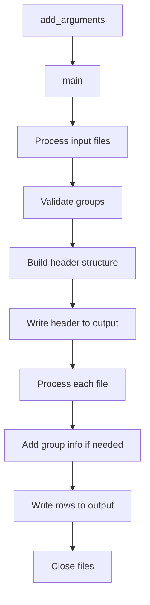

# `csvstack.py`

## `csvkit.utilities.csvstack._skip_lines` · *function*

## Summary:
Skips a specified number of lines from a file handle and validates the skip count parameter.

## Description:
This utility function reads and discards a specified number of lines from a file handle, typically used to skip header rows or initial content in CSV files. The function validates that the skip_lines argument is an integer before performing the line-skipping operation.

## Args:
    f (file-like object): A file handle from which lines will be read and discarded
    args (object): An object containing configuration arguments, specifically the skip_lines attribute

## Returns:
    int: The number of lines that were skipped (equal to args.skip_lines)

## Raises:
    ValueError: When args.skip_lines is not an integer type

## Constraints:
    Preconditions:
        - The file handle `f` must be opened and readable
        - The args object must have a skip_lines attribute
        - The skip_lines attribute must be a positive integer or zero
    
    Postconditions:
        - The file pointer will be advanced by the specified number of lines
        - The function will raise an exception if skip_lines is not an integer

## Side Effects:
    - Reads from the provided file handle, advancing its position
    - May cause I/O operations when reading lines from the file

## Control Flow:
```mermaid
flowchart TD
    A[Start _skip_lines] --> B{isinstance(skip_lines, int)?}
    B -- Yes --> C[Initialize skip_lines]
    C --> D[While skip_lines > 0]
    D --> E[f.readline()]
    E --> F[skip_lines -= 1]
    F --> G{skip_lines > 0?}
    G -- Yes --> D
    G -- No --> H[Return skip_lines]
    B -- No --> I[Raise ValueError]
    I --> J[End]
    H --> J
```

## Examples:
    # Skip 3 lines from a CSV file
    with open('data.csv', 'r') as f:
        skipped = _skip_lines(f, args_with_skip_lines=3)
        # File pointer is now at the 4th line
        
    # This would raise ValueError
    try:
        _skip_lines(f, args_with_skip_lines="invalid")
    except ValueError as e:
        print(e)  # "skip_lines argument must be an int"
```

## `csvkit.utilities.csvstack.CSVStack` · *class*

## Summary:
A command-line utility that stacks rows from multiple CSV files into a single output, optionally adding grouping columns to distinguish source files.

## Description:
CSVStack is designed to combine multiple CSV files by vertically concatenating their rows. It can optionally add grouping information to identify which source file each row originated from. This utility is particularly useful for merging datasets that share the same structure but come from different sources or time periods.

The class extends CSVKitUtility, providing command-line argument parsing and file handling capabilities. It supports both regular file inputs and stdin piping, and can handle CSV files with or without headers.

## State:
- `description` (str): Static description of the utility's purpose
- `override_flags` (list): List of command-line flags that this utility overrides from the base class
- `argparser`: Command-line argument parser instance (inherited from CSVKitUtility)
- `args`: Parsed command-line arguments (inherited from CSVKitUtility)
- `output_file`: Output file handle (inherited from CSVKitUtility)
- `reader_kwargs`: Keyword arguments for CSV reader configuration (inherited from CSVKitUtility)
- `writer_kwargs`: Keyword arguments for CSV writer configuration (inherited from CSVKitUtility)

## Lifecycle:
- Creation: Instantiated automatically by the csvkit command-line framework
- Usage: Called via the main() method which processes command-line arguments and performs the stacking operation
- Destruction: Files are closed appropriately during processing; cleanup handled by the parent framework

## Method Map:


## Raises:
- `ArgumentParser.error`: Raised when the number of grouping values doesn't match the number of input files
- Various file I/O exceptions that may occur during file opening or reading operations (inherited from parent class)

## Example:
```bash
# Stack two CSV files with group names
csvstack -g "2020,2021" file1.csv file2.csv > stacked_output.csv

# Stack files using filenames as group values
csvstack --filenames file1.csv file2.csv > stacked_output.csv

# Stack from stdin
cat file1.csv | csvstack -g "source1" - > output.csv
```

### `csvkit.utilities.csvstack.CSVStack.add_arguments` · *method*

## Summary:
Configures command-line argument parsing for the CSVStack utility to handle multiple CSV file stacking operations with optional grouping.

## Description:
Adds command-line arguments to the argument parser for the CSVStack utility, enabling users to specify input files, grouping factors, and grouping column naming options. This method is called during the initialization phase of CSVKitUtility to establish the CLI interface for stacking CSV files vertically while optionally adding metadata columns to distinguish source files.

The method sets up arguments for:
- Input file specification (positional argument)
- Grouping factors to add as metadata columns
- Custom naming for grouping columns
- Automatic filename-based grouping

This separation allows the CSVStack class to inherit standard CSV processing capabilities from CSVKitUtility while defining its specific command-line interface requirements.

## Args:
    self: The CSVStack instance whose argument parser will be modified

## Returns:
    None: This method modifies the instance's argument parser in-place and does not return a value

## Raises:
    None: This method does not raise exceptions directly, though argument parsing may raise argparse-related exceptions

## State Changes:
    Attributes READ: 
        - self.argparser: The argument parser instance to be modified
    
    Attributes WRITTEN:
        - self.argparser: Modified with new command-line arguments

## Constraints:
    Preconditions:
        - The instance must have an initialized argparser attribute (inherited from CSVKitUtility)
        - The method should be called during object initialization before argument parsing occurs
        
    Postconditions:
        - The argparser contains the four defined command-line arguments
        - Arguments are properly configured with appropriate metavar, dest, help text, and default values

## Side Effects:
    None: This method only modifies the argument parser instance and has no external side effects

### `csvkit.utilities.csvstack.CSVStack.main` · *method*

## Summary:
Stacks multiple CSV files into a single output file, optionally adding group identifiers to distinguish rows from different input files.

## Description:
This method implements the core logic for combining multiple CSV files into a single output. It processes input files sequentially, reads their content, and writes the combined result to the output file. The method supports various features including standard input handling, optional grouping of rows by source file, and flexible header row management.

The method is designed to be called by the parent CSVKitUtility class's run() method as part of the standard execution lifecycle. It handles the complete workflow from input file processing to output generation, including proper resource management and error conditions.

## Args:
    self: The CSVStack instance containing configuration and state

## Returns:
    None: This method performs I/O operations and does not return a value

## Raises:
    SystemExit: Raised by self.argparser.error() when grouping values don't match input file count
    ValueError: May be raised by internal file operations or CSV processing functions

## State Changes:
    Attributes READ: 
    - self.args.input_paths: List of input file paths to process
    - self.args.groups: Optional comma-separated group values for each input file
    - self.args.group_by_filenames: Boolean flag for automatic group naming
    - self.args.group_name: Name for the group column (defaults to 'group')
    - self.args.no_header_row: Boolean flag indicating whether files lack header rows
    - self.args.skip_lines: Number of lines to skip at beginning of files
    - self.output_file: Output file handle for writing results
    - self.reader_kwargs: Configuration for CSV reader creation
    - self.writer_kwargs: Configuration for CSV writer creation
    - self.argparser: Argument parser instance for error reporting

    Attributes WRITTEN: 
    - None: This method doesn't modify instance attributes directly

## Constraints:
    Preconditions:
    - self.args.input_paths must be a list of valid file paths or '-' for stdin
    - self.output_file must be a valid writable file handle
    - self.reader_kwargs and self.writer_kwargs must contain valid CSV configuration
    - If groups are specified, the number of group values must equal the number of input files

    Postconditions:
    - All input files are processed and their content written to output_file
    - Output file contains properly formatted CSV data
    - File handles are properly closed after processing

## Side Effects:
    - Writes to stdout/stderr for user prompts and warnings
    - Reads from multiple input files specified in self.args.input_paths
    - Writes to the output file handle specified in self.output_file
    - May read from standard input when '-' is specified as input path
    - Performs I/O operations on filesystem and standard streams

## `csvkit.utilities.csvstack.launch_new_instance` · *function*

## Summary:
Creates and executes a CSVStack utility instance to vertically concatenate rows from multiple CSV files.

## Description:
This function serves as the entry point for launching the csvstack command-line utility. It instantiates the CSVStack class and invokes its run method to process multiple CSV files by vertically concatenating their rows. The function abstracts away the instantiation and execution details, providing a clean interface for the csvkit framework to initialize and run the CSV stacking utility.

This function follows the standard csvkit pattern where each command-line utility has a `launch_new_instance` function that creates and runs the appropriate utility class instance. It is typically called by the csvkit command-line entry points to initiate processing of CSV files with vertical concatenation capabilities.

## Args:
    None

## Returns:
    None

## Raises:
    SystemExit: Raised by CSVStack.run() when argument validation fails or when the utility completes execution with exit status
    Various exceptions: Potentially raised by underlying CSV processing methods during execution, including file I/O errors, argument parsing errors, and encoding issues

## Constraints:
    Preconditions:
    - The csvkit command-line environment must be properly initialized
    - Command-line arguments must be available for parsing by CSVStack
    - Standard input/output streams must be accessible
    
    Postconditions:
    - The CSVStack utility will have processed input CSV files according to its configuration
    - Output will be written to either stdout/stderr or specified output files
    - The process will exit with appropriate status codes based on processing results

## Side Effects:
    - Reads from standard input or specified input file(s)
    - Writes to standard output or specified output file(s)
    - May write diagnostic messages to standard error
    - Processes command-line arguments through the csvkit argument parser

## Control Flow:
```mermaid
flowchart TD
    A[launch_new_instance called] --> B[Create CSVStack instance]
    B --> C[Call utility.run()]
    C --> D[CSVStack.run() executes]
    D --> E[CSVStack parses command-line arguments]
    E --> F[CSVStack opens input files if needed]
    F --> G[CSVStack processes CSV data through main()]
    G --> H[CSVStack vertically concatenates rows from input files]
    H --> I{Grouping requested?}
    I -->|Yes| J[Adds group information to distinguish source files]
    J --> K[Writes concatenated data to output]
    I -->|No| K
    K --> L[CSVStack closes files and exits]
```

## Examples:
```bash
# Stack two CSV files with group names
csvstack -g "2020,2021" file1.csv file2.csv > stacked_output.csv

# Stack files using filenames as group values
csvstack --filenames file1.csv file2.csv > stacked_output.csv

# Stack from stdin
cat file1.csv | csvstack -g "source1" - > output.csv

# Launch programmatically (equivalent to command-line invocation)
from csvkit.utilities.csvstack import launch_new_instance
launch_new_instance()
```

