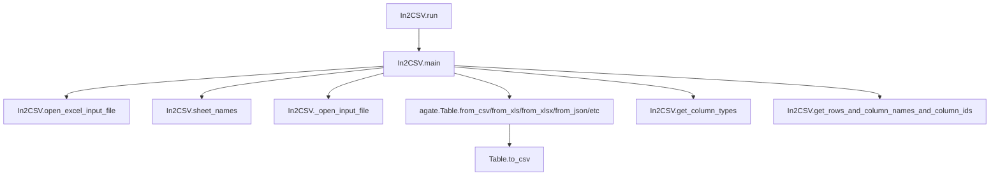

# `in2csv.py`

## `csvkit.utilities.in2csv.In2CSV` · *class*

## Summary:
A command-line utility for converting various tabular data formats to CSV format.

## Description:
The In2CSV class is a csvkit utility designed to convert common but less-awesome tabular data formats (such as Excel spreadsheets, fixed-width files, JSON, DBF, GeoJSON, etc.) into standard CSV format. It serves as a flexible converter that can automatically detect input file formats or accept explicit format specification, making it useful for data processing workflows where data needs to be standardized into CSV format for further analysis or compatibility.

This class extends CSVKitUtility and implements the conversion logic for multiple input formats, supporting both file-based and piped input operations. It provides specialized handling for different file types including Excel formats (.xls, .xlsx), fixed-width files, JSON documents, database files (.dbf), and geographic data formats (.geojson).

## State:
- input_file (file-like object): Input file handle opened for reading, managed by the class lifecycle
- output_file (file-like object): Output file handle for writing CSV results, inherited from CSVKitUtility parent
- args (argparse.Namespace): Parsed command-line arguments containing conversion options
- reader_kwargs (dict): Configuration for CSV reader constructed from command-line arguments
- writer_kwargs (dict): Configuration for CSV writer constructed from command-line arguments

## Lifecycle:
- Creation: Instantiated by the csvkit command-line framework, which sets up argument parsing and calls add_arguments()
- Usage: Called via the run() method inherited from CSVKitUtility, which internally calls main() 
- The main() method determines the input file format, opens appropriate input files, processes the data according to format-specific logic, and writes CSV output to output_file
- Destruction: Automatically closes input and schema files when done, handled by the class lifecycle management

## Method Map:


## Raises:
- ValueError: Raised when schema is required for fixed-width files but not provided, or when DBF files are attempted to be read from stdin
- SystemExit: Raised by argparser.error() when invalid arguments or missing required parameters are detected (e.g., missing format for piped input)
- NotImplementedError: Inherited from parent class when not properly implemented (though this shouldn't occur in normal usage)

## Example:
```python
# Typical usage from command line:
# python in2csv.py input.xlsx > output.csv

# Or with explicit format specification:
# python in2csv.py -f json input.json > output.csv

# To display Excel sheet names:
# python in2csv.py -n input.xlsx

# To convert fixed-width file with schema:
# python in2csv.py -f fixed -s schema.csv input.txt > output.csv

# To convert specific Excel sheet:
# python in2csv.py --sheet Sheet1 input.xlsx > output.csv

# To write multiple Excel sheets to separate CSV files:
# python in2csv.py --write-sheets Sheet1,Sheet2 input.xlsx
```

### `csvkit.utilities.in2csv.In2CSV.add_arguments` · *method*

## Summary:
Configures command-line argument parsing for the in2csv utility to support various input file formats and conversion options.

## Description:
This method extends the argument parser with command-line options that control how input files are processed when converting to CSV format. It enables users to specify input files, file formats, schema definitions, JSON keys, Excel sheet operations, encoding specifications, and CSV parsing behavior. The method is called during the initialization phase of the CSVKit utility to build the complete set of available command-line options.

## Args:
    self: The In2CSV instance whose argument parser will be modified

## Returns:
    None: This method modifies the instance's argument parser in-place

## Raises:
    None explicitly raised: This method only configures arguments and doesn't raise exceptions directly

## State Changes:
    Attributes READ: 
    - self.argparser: The argument parser instance being configured
    
    Attributes WRITTEN:
    - self.argparser: Modified in-place to add multiple argument definitions

## Constraints:
    Preconditions:
    - The method must be called on an instance of In2CSV class
    - The instance must have an argparser attribute properly initialized
    - SUPPORTED_FORMATS constant must be available in scope (referenced but not defined in this method)

    Postconditions:
    - The argparser instance will contain all standard CSVKit arguments plus the specific arguments added by this method
    - All arguments are properly configured with appropriate help text, types, and default values

## Side Effects:
    None: This method only modifies the argument parser configuration and does not perform I/O operations or mutate external state

### `csvkit.utilities.in2csv.In2CSV.open_excel_input_file` · *method*

## Summary:
Opens an Excel input file for processing, handling both standard file paths and stdin input.

## Description:
This method provides a unified interface for opening Excel input files (both .xls and .xlsx formats) by handling two distinct input cases: when input comes from standard input (stdin) and when it comes from a file path. When stdin is detected (indicated by path being None, empty string, or '-' character), the method reads all available input from sys.stdin.buffer and wraps it in a BytesIO object for consistent processing. For regular file paths, it opens the file in binary read mode and returns the file handle.

The method is specifically designed for Excel file processing within the In2CSV utility and is used by both the sheet_names method (to extract sheet names) and the main processing loop (to read Excel data).

## Args:
    path (str, optional): Path to the Excel file. If None, empty string, or '-', input is read from stdin.

## Returns:
    BytesIO or file handle: For stdin input, returns a BytesIO object containing the input data. For file paths, returns a file handle opened in binary read mode.

## Raises:
    IOError: When the specified file cannot be opened for reading in binary mode.

## State Changes:
    Attributes READ: None
    Attributes WRITTEN: None

## Constraints:
    Preconditions:
    - When path is '-' or None, the caller must ensure that stdin contains valid Excel data
    - When path is a valid file path, the file must exist and be readable
    
    Postconditions:
    - The returned object is suitable for use with Excel processing libraries (xlrd or openpyxl)
    - For stdin input, the returned BytesIO object contains all available stdin data
    - For file input, the returned file handle is positioned at the beginning of the file

## Side Effects:
    I/O operations: Reads from stdin when path is '-' or None, or opens a file when path is a valid file path
    Memory allocation: Creates a BytesIO object when reading from stdin

### `csvkit.utilities.in2csv.In2CSV.sheet_names` · *method*

## Summary:
Retrieves the names of all sheets from an Excel file in either .xls or .xlsx format.

## Description:
This method opens an Excel file and extracts the names of all available worksheets. It handles both legacy .xls files using xlrd and modern .xlsx files using openpyxl. The method is designed to be called during the Excel file processing pipeline when sheet information is needed for conversion operations.

## Args:
    path (str): Filesystem path to the Excel file
    filetype (str): File type identifier, either 'xls' or 'xlsx'

## Returns:
    list[str]: A list of sheet names contained in the Excel workbook

## Raises:
    Exception: Propagates any exceptions raised by file I/O operations or Excel parsing libraries

## State Changes:
    Attributes READ: None
    Attributes WRITTEN: None

## Constraints:
    Preconditions: 
    - The path must point to a valid Excel file
    - The filetype parameter must be either 'xls' or 'xlsx'
    - The Excel file must be readable and properly formatted
    
    Postconditions:
    - The input file handle is closed after processing
    - A list of sheet names is returned

## Side Effects:
    - Opens and closes a file handle to read the Excel file
    - May perform I/O operations to access the filesystem
    - Uses external libraries xlrd or openpyxl for Excel parsing

### `csvkit.utilities.in2csv.In2CSV.main` · *method*

## Summary:
Converts input files of various formats (CSV, Excel, DBF, JSON, GeoJSON, fixed-width) to CSV format, with support for special options like schema specification, sheet handling, and metadata extraction.

## Description:
The main method orchestrates the conversion process from various input file formats to CSV format. It determines the input file type through automatic detection or explicit specification, opens appropriate input streams, processes the data according to format-specific logic, and writes the result to the output stream. The method also handles special cases like extracting sheet names (--names-only flag) and writing multiple sheets to separate CSV files (--write-sheets option).

## Args:
    self: The In2CSV instance containing command-line arguments and configuration

## Returns:
    None: This method performs I/O operations and does not return a value

## Raises:
    SystemExit: Raised by self.argparser.error() when format detection fails or invalid combinations are used
    ValueError: Raised when schema is required for fixed-width format but not provided, or when DBF files are read from stdin

## State Changes:
    Attributes READ: 
    - self.args.input_path
    - self.args.filetype
    - self.args.schema
    - self.args.key
    - self.args.names_only
    - self.args.sniff_limit
    - self.args.no_header_row
    - self.args.skip_lines
    - self.args.no_inference
    - self.args.write_sheets
    - self.args.use_sheet_names
    - self.args.sheet
    - self.args.encoding_xls
    - self.reader_kwargs
    - self.writer_kwargs
    - self.argparser
    
    Attributes WRITTEN:
    - self.input_file: Set to either Excel input file or regular input file handle
    - self.output_file: Used for writing CSV output

## Constraints:
    Preconditions:
    - When input is provided via stdin (path is '-' or None), a file format must be explicitly specified
    - Schema must be provided when input format is 'fixed'
    - DBF files cannot be processed from stdin (must be a filename)
    
    Postconditions:
    - Input file is properly opened and closed
    - Output is written to the configured output file handle
    - When --write-sheets is used, multiple CSV files are created for each Excel sheet

## Side Effects:
    - Reads from input file(s) based on detected or specified format
    - Writes to output file handle in CSV format
    - May create additional files when --write-sheets option is used
    - Closes input file handles after processing
    - May close schema file handle if provided
    - Uses agate library for CSV, JSON, Excel, and DBF processing

## `csvkit.utilities.in2csv.launch_new_instance` · *function*

## Summary:
Creates and executes a new instance of the In2CSV command-line utility for converting various tabular data formats to CSV format.

## Description:
The launch_new_instance function serves as the primary entry point for initializing and executing the In2CSV utility. It instantiates the In2CSV class and invokes its run method to process command-line arguments and perform format conversion operations. This function follows the standard csvkit pattern where each command-line utility has a launch_new_instance function that creates and runs the appropriate utility class instance.

This function is typically called by the csvkit command-line framework when the in2csv utility is invoked, abstracting away the instantiation and execution details to provide a clean interface for launching the conversion utility.

## Args:
    None

## Returns:
    None

## Raises:
    SystemExit: Raised by In2CSV.run() when argument validation fails or when the utility completes execution with exit status
    Various exceptions: Potentially raised by underlying CSV processing methods during execution, including file I/O errors, argument parsing errors, encoding issues, and format-specific processing errors

## Constraints:
    Preconditions:
    - The csvkit command-line environment must be properly initialized
    - Command-line arguments must be available for parsing by In2CSV
    - Standard input/output streams must be accessible
    
    Postconditions:
    - The In2CSV utility will have processed input according to its configuration
    - Output will be written to either stdout/stderr or specified output files
    - The process will exit with appropriate status codes based on processing results

## Side Effects:
    - Reads from standard input or specified input file(s)
    - Writes to standard output or specified output file(s)
    - May read from compressed input files (.gz, .bz2, .xz extensions)
    - May write diagnostic messages to standard error
    - Processes command-line arguments through the csvkit argument parser

## Control Flow:
```mermaid
flowchart TD
    A[launch_new_instance called] --> B[Create In2CSV instance]
    B --> C[Call utility.run()]
    C --> D[In2CSV.run() inherits from CSVKitUtility.run()]
    D --> E[In2CSV.main() executes]
    E --> F{Input validation and format detection}
    F -->|Format specified| G[Use specified format for processing]
    F -->|Auto-detect| H[Detect input file format automatically]
    H --> I[Open appropriate input file handler]
    I --> J[Process data according to format-specific logic]
    J --> K{Excel file?}
    K -->|Yes| L[Handle Excel-specific processing]
    K -->|No| M[Handle other format processing]
    L --> N[Convert Excel data to CSV]
    M --> N
    N --> O[Write CSV output to output_file]
    O --> P[Cleanup and exit]
```

## Examples:
```bash
# Convert Excel spreadsheet to CSV
python in2csv.py input.xlsx > output.csv

# Convert with explicit format specification
python in2csv.py -f json input.json > output.csv

# Display Excel sheet names
python in2csv.py -n input.xlsx

# Convert fixed-width file with schema
python in2csv.py -f fixed -s schema.csv input.txt > output.csv

# Convert specific Excel sheet
python in2csv.py --sheet Sheet1 input.xlsx > output.csv

# Write multiple Excel sheets to separate CSV files
python in2csv.py --write-sheets Sheet1,Sheet2 input.xlsx
```

