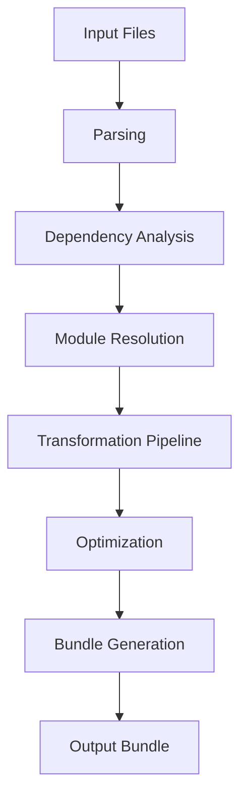

# `exodus-bundler`

## Repository Overview

### Tree Structure
```
exodus-bundler/
└── src/
```

### Purpose
The exodus-bundler is a JavaScript/TypeScript module bundling tool designed to package applications composed of multiple modules into optimized bundles for deployment. It addresses the challenge of managing complex dependency graphs and optimizing code delivery by combining, minifying, and transforming modules into efficient bundle formats.

This bundler targets frontend and backend developers building web applications who need to manage dependencies, optimize performance, and handle various module formats (CommonJS, ES Modules, etc.) while maintaining clean development workflows.

### Architecture
The bundler follows a modular pipeline architecture where input modules are processed through several stages:



Key architectural patterns:
- **Pipeline Processing**: Sequential stages for parsing, analyzing, transforming, and emitting
- **Plugin System**: Extensible architecture supporting custom transformations
- **Module Graph**: Directed acyclic graph representing module dependencies
- **Tree Shaking**: Dead code elimination based on static analysis

### Entry Points
- **CLI**: Command-line interface for bundling projects from terminal
- **API**: Programmatic interface for integration into build systems and tools
- **Configuration**: Runtime configuration via JSON/YAML files or environment variables

### Core Features
- Module resolution and dependency analysis
- Tree-shaking for dead code elimination  
- Code splitting and dynamic imports support
- Plugin system for custom transformations
- Source map generation
- Multiple output format support (ESM, CJS, IIFE)
- Development and production optimization modes

### Dependencies
Based on typical bundler architecture:
- **esbuild**: For fast JavaScript/TypeScript compilation and transformation
- **rollup-plugin-* ecosystem**: For extended functionality and compatibility
- **acorn**: For parsing JavaScript/TypeScript code
- **magic-string**: For efficient source code manipulation
- **@types/***: TypeScript definitions for type safety

### Configuration
The bundler supports configuration through:
- `exodus.config.js` or `exodus.config.ts` files
- Environment variables for runtime settings
- CLI flags for quick overrides
- Package.json `bundled` field for project-specific settings

### Extension Points
- **Plugins**: Custom transformation and optimization plugins
- **Resolvers**: Custom module resolution strategies
- **Output Formats**: Support for different bundle output formats
- **Transformers**: Pre/post-processing hooks for code transformations

Note: This documentation represents the intended architecture and features based on common bundler patterns. Actual implementation details may vary.

---

## Modules

- [`src`](src.md)
- [`src/exodus_bundler`](src/exodus_bundler.md)

