# `bundling.py`

## `src.exodus_bundler.bundling.bytes_to_int` · *function*

## Summary:
Converts a sequence of bytes into an integer value using specified byte ordering.

## Description:
This function interprets a sequence of bytes as an integer, supporting both big-endian and little-endian byte ordering. It is commonly used when processing binary data where byte order matters, such as in ELF binary parsing or network protocol implementations.

## Args:
    bytes (bytes): Sequence of bytes to convert to integer
    byteorder (str): Byte order specification, either 'big' or 'little'. Defaults to 'big'

## Returns:
    int: Integer representation of the byte sequence

## Raises:
    KeyError: When byteorder parameter is not 'big' or 'little'
    struct.error: When struct.unpack fails due to invalid byte sequence or mismatched format

## Constraints:
    Preconditions:
        - bytes parameter must be a valid bytes object
        - byteorder parameter must be either 'big' or 'little'
    Postconditions:
        - Returns an integer value representing the byte sequence
        - The returned integer maintains the semantic value of the original byte sequence

## Side Effects:
    None

## Control Flow:
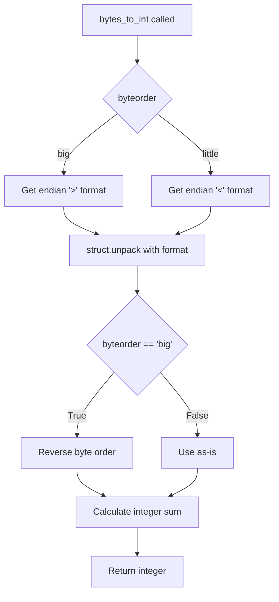

## Examples:
    >>> bytes_to_int(b'\x01\x02\x03', 'big')
    66051
    >>> bytes_to_int(b'\x01\x02\x03', 'little')
    197121
    >>> bytes_to_int(b'\xff\xff', 'big')
    65535
    >>> bytes_to_int(b'\x00\x01', 'little')
    256

## `src.exodus_bundler.bundling.create_bundle` · *function*

## Summary:
Creates a portable application bundle by packaging executables and their dependencies into either a shell installer script or a compressed tarball archive.

## Description:
The `create_bundle` function orchestrates the creation of a portable application bundle by first generating an unpackaged bundle structure, then packaging it into either a self-extracting shell script or a compressed tarball. It handles the complete lifecycle of bundle creation including temporary file management, template rendering for install scripts, and proper cleanup of resources.

This logic is extracted into its own function to separate the high-level orchestration of bundle creation from the lower-level bundle structure generation handled by `create_unpackaged_bundle`. This modular approach allows for reuse of the bundle creation workflow while maintaining clean separation of concerns between bundle structure generation and packaging/installation logic.

## Args:
    executables (list[str]): List of absolute or relative paths to executable files to include in the bundle.
    output (str): Template string for the output filename, supporting {{executables}} and {{extension}} placeholders.
    tarball (bool): If True, creates a compressed tarball (.tgz) instead of a shell installer script. Defaults to False.
    rename (list[str]): List of names to rename executables to within the bundle. Defaults to empty list.
    chroot (str): Optional chroot environment path for resolving file paths. Defaults to None.
    add (list[str]): Additional file paths to include in the bundle beyond the executables. Defaults to empty list.
    no_symlink (list[str]): List of file paths that should not be symlinked in the bundle. Defaults to empty list.
    shell_launchers (bool): Whether to create shell-based launchers instead of binary launchers. Defaults to False.
    detect (bool): Whether to automatically detect and include dependencies for executables. Defaults to False.

## Returns:
    bool: Always returns True upon successful completion of bundle creation.

## Raises:
    Exception: Propagates any exceptions that occur during bundle creation, including those from dependency detection or file operations.

## Constraints:
    Preconditions:
        - At least one executable must be specified
        - The number of rename entries cannot exceed the number of executables
        - All specified file paths must refer to existing files (not directories)
        - When chroot is specified, it must be a valid directory path
    
    Postconditions:
        - The output file is created with appropriate content (shell script or tarball)
        - Temporary working directory is cleaned up regardless of success or failure
        - Output file has execute permissions set (unless tarball=True or output is '-' or '/dev/null')

## Side Effects:
    - Creates a temporary working directory for bundle creation
    - Writes output file to disk (or stdout if output is '-')
    - Sets execute permissions on the output file (when not creating tarball)
    - May create launcher scripts or binaries in the bundle structure
    - Cleans up the temporary working directory on any exception (via try/finally pattern)

## Control Flow:
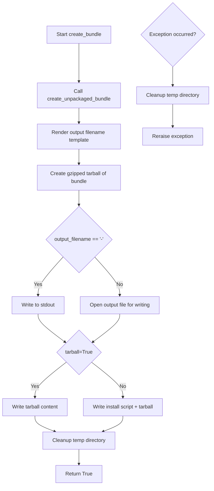

## Examples:
    # Create a shell installer for a single executable
    create_bundle(['/usr/bin/python3'], 'myapp.sh')
    
    # Create a compressed tarball for multiple executables
    create_bundle(['/usr/bin/python3', '/usr/bin/node'], 'myapp.tgz', tarball=True)
    
    # Create installer with renamed executables and dependency detection
    create_bundle(
        ['/usr/bin/python3'], 
        'myapp.sh',
        rename=['myapp'],
        detect=True
    )
    
    # Create installer with additional files and no symlinks
    create_bundle(
        ['/usr/bin/python3'],
        'myapp.sh',
        add=['/etc/myapp.conf'],
        no_symlink=['/etc/myapp.conf']
    )

## `src.exodus_bundler.bundling.create_unpackaged_bundle` · *function*

## Summary:
Creates a portable application bundle by collecting specified executables and their dependencies, optionally with automatic dependency detection and custom file handling.

## Description:
The `create_unpackaged_bundle` function orchestrates the creation of a portable application bundle by managing a collection of files and their dependencies. It accepts a list of executables and optional configuration parameters to customize the bundle creation process. The function handles file inclusion, dependency detection, and bundle structure generation while providing cleanup mechanisms for temporary resources.

This logic is extracted into its own function to encapsulate the entire bundle creation workflow, separating the concerns of file management, dependency resolution, and bundle construction from the higher-level orchestration logic. This approach enables reuse across different entry points and simplifies error handling by centralizing temporary directory cleanup.

## Args:
    executables (list[str]): List of absolute or relative paths to executable files to include in the bundle.
    rename (list[str], optional): List of names to rename executables to within the bundle. Defaults to [].
    chroot (str, optional): Optional chroot environment path for resolving file paths. Defaults to None.
    add (list[str], optional): Additional file paths to include in the bundle beyond the executables. Defaults to [].
    no_symlink (list[str], optional): List of file paths that should not be symlinked in the bundle. Defaults to [].
    shell_launchers (bool): Whether to create shell-based launchers instead of binary launchers. Defaults to False.
    detect (bool): Whether to automatically detect and include dependencies for executables. Defaults to False.

## Returns:
    str: The absolute path to the temporary working directory containing the created bundle structure.

## Raises:
    AssertionError: When no executables are specified or when more rename entries are provided than executables.
    DependencyDetectionError: When automatic dependency detection fails for an executable (either because it's not tracked by a package manager or the OS is unsupported).
    MissingFileError: When a specified file path does not exist.
    UnexpectedDirectoryError: When a specified file path points to a directory instead of a file.

## Constraints:
    Preconditions:
        - At least one executable must be specified
        - The number of rename entries cannot exceed the number of executables
        - All specified file paths must refer to existing files (not directories)
        - When chroot is specified, it must be a valid directory path
    
    Postconditions:
        - A temporary working directory is created and populated with the bundle structure
        - All specified executables and their dependencies (when detect=True) are included in the bundle
        - The returned path points to a valid directory containing the complete bundle

## Side Effects:
    - Creates a temporary working directory for bundle creation
    - May copy or symlink files into the temporary directory
    - May create launcher scripts or binaries in the bundle structure
    - Cleans up the temporary working directory on any exception (via try/finally pattern)

## Control Flow:
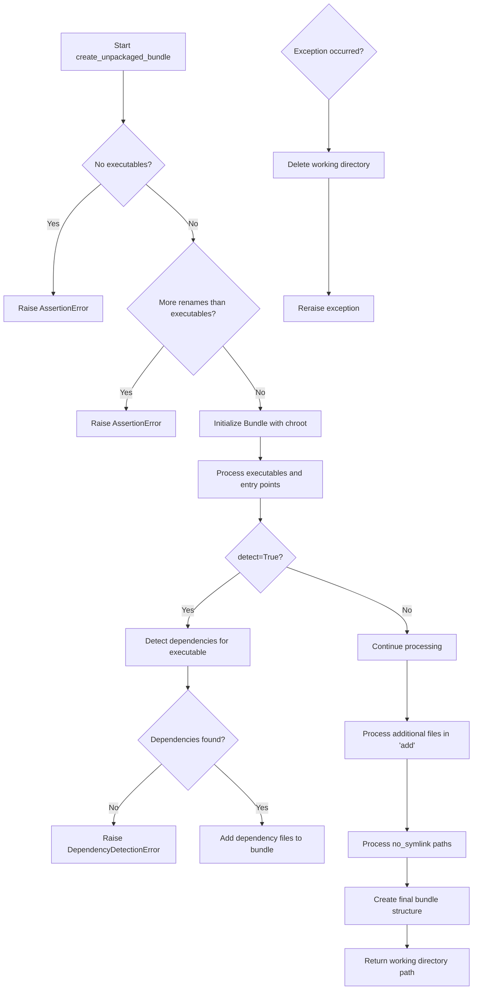

## Examples:
    # Basic usage with a single executable
    bundle_dir = create_unpackaged_bundle(['/usr/bin/python3'])
    
    # Usage with renaming and dependency detection
    bundle_dir = create_unpackaged_bundle(
        ['/usr/bin/python3'], 
        rename=['myapp'],
        detect=True
    )
    
    # Usage with additional files and no symlinks
    bundle_dir = create_unpackaged_bundle(
        ['/usr/bin/python3'],
        add=['/etc/myapp.conf'],
        no_symlink=['/etc/myapp.conf']
    )
    
    # Usage with shell launchers
    bundle_dir = create_unpackaged_bundle(
        ['/usr/bin/python3'],
        shell_launchers=True
    )

## `src.exodus_bundler.bundling.detect_elf_binary` · *function*

## Summary:
Determines whether a given file is an ELF (Executable and Linkable Format) binary by checking its magic number.

## Description:
This function identifies ELF binaries by examining the first four bytes of a file against the standard ELF magic number. ELF binaries begin with the byte sequence b'\x7fELF', which serves as a unique identifier for this file format used primarily on Unix-like systems.

## Args:
    filename (str): Path to the file to be checked for ELF binary format.

## Returns:
    bool: True if the file is an ELF binary (starts with b'\x7fELF'), False otherwise.

## Raises:
    MissingFileError: When the specified file does not exist on the filesystem.

## Constraints:
    Preconditions:
        - The filename parameter must be a valid string representing a file path.
        - The file must be readable by the executing process.
    
    Postconditions:
        - The function will not modify the file or its contents.
        - The function will return a boolean value indicating ELF status.

## Side Effects:
    None: This function performs no I/O operations beyond reading the first four bytes of the specified file.

## Control Flow:
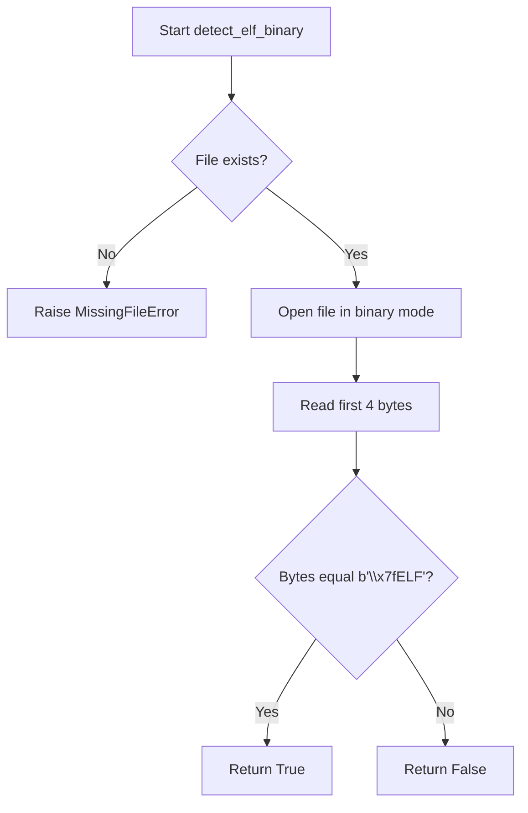

## Examples:
```python
# Check if a binary file is ELF
is_elf = detect_elf_binary('/bin/ls')
print(is_elf)  # True if ls is an ELF binary

# Handle missing file case
try:
    is_elf = detect_elf_binary('/nonexistent/file')
except MissingFileError as e:
    print(f"File not found: {e}")
```

## `src.exodus_bundler.bundling.parse_dependencies_from_ldd_output` · *function*

## Summary
Parses shared library dependencies from ldd command output by extracting file paths from formatted dependency lines.

## Description
Extracts absolute file paths of shared library dependencies from the output of the ldd command. This function processes lines that contain dependency information in the format "library => /path/to/library (0x...)" or just "/path/to/library (0x...)" and returns the extracted paths.

## Args
    content (str or list[str]): Raw output from ldd command, either as a string (to be split by newlines) or as a list of lines

## Returns
    list[str]: List of absolute file paths to shared library dependencies found in the ldd output

## Raises
    None explicitly raised

## Constraints
    Preconditions:
        - Input content must be either a string or list of strings
        - Each line in content should follow ldd output format with dependency paths
    
    Postconditions:
        - Returns a list of strings representing absolute paths to dependencies
        - Empty list returned if no dependencies found or invalid input

## Side Effects
    None

## Control Flow
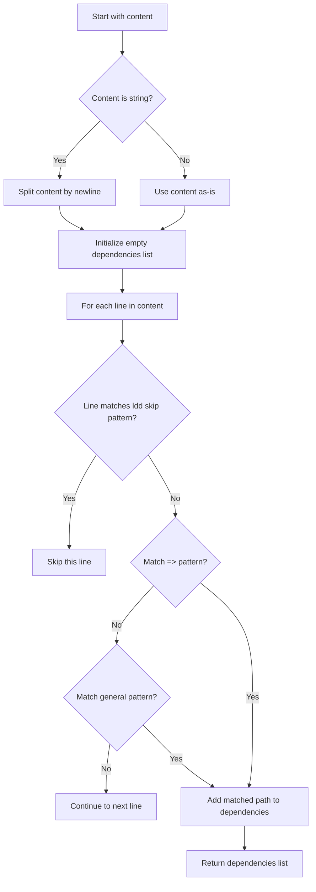

## Examples
    # Basic usage with string input
    ldd_output = '''
    libfoo.so => /usr/lib/libfoo.so (0x...)
    libbar.so => /usr/lib/libbar.so (0x...)
    '''
    deps = parse_dependencies_from_ldd_output(ldd_output)
    # Returns ['/usr/lib/libfoo.so', '/usr/lib/libbar.so']
    
    # Usage with list input
    deps = parse_dependencies_from_ldd_output(['/lib/libc.so.6 (0x...)'])
    # Returns ['/lib/libc.so.6']

## `src.exodus_bundler.bundling.resolve_binary` · *function*

## Summary:
Resolves a binary path by first checking if it's an absolute path that exists, and if not, searches for it in the system PATH.

## Description:
This function takes a binary name or path and resolves it to an absolute file path. It first attempts to resolve the path as an absolute path. If that fails, it searches for the binary in directories listed in the system PATH environment variable. This utility function ensures that binary references are properly resolved regardless of whether they are specified as absolute paths or just names.

The function is extracted into its own utility to centralize binary resolution logic and avoid duplication across the bundling process where multiple components may need to locate executables.

## Args:
    binary (str): The name or path of the binary to resolve. This can be either an absolute path or a binary name that exists in PATH.

## Returns:
    str: The absolute path to the resolved binary.

## Raises:
    MissingFileError: When the binary cannot be found either as an absolute path or in any directory listed in the PATH environment variable.

## Constraints:
    Preconditions:
        - The input binary parameter must be a string
        - The system PATH environment variable should be accessible
    
    Postconditions:
        - Returns an absolute path to a file that exists on the filesystem
        - The returned path is normalized using os.path.normpath

## Side Effects:
    None

## Control Flow:
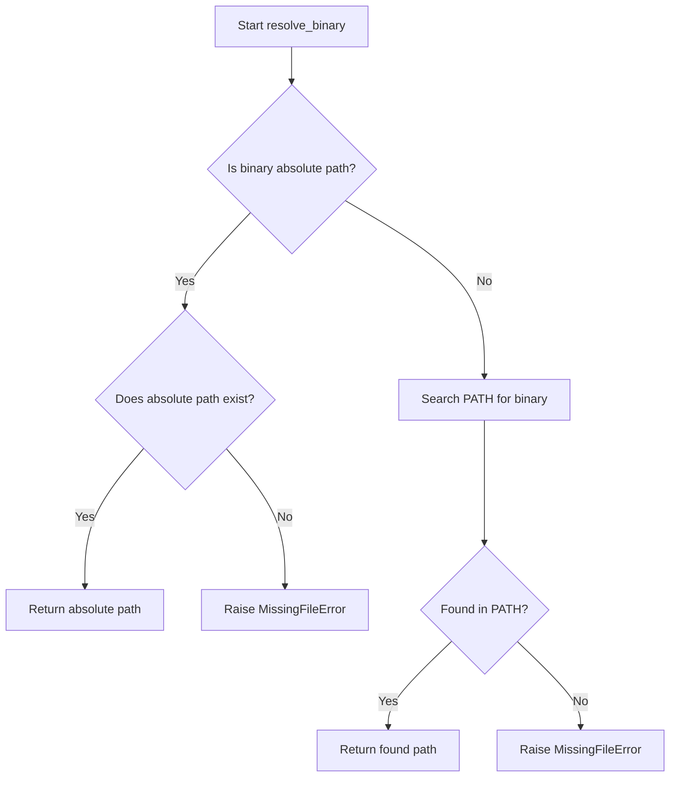

## Examples:
    # Resolving an absolute path that exists
    resolved_path = resolve_binary('/usr/bin/python3')
    # Returns: '/usr/bin/python3'
    
    # Resolving a binary name in PATH
    resolved_path = resolve_binary('gcc')
    # Returns: '/usr/bin/gcc' (assuming gcc is in PATH)
    
    # Attempting to resolve a non-existent binary
    try:
        resolve_binary('nonexistent_binary')
    except MissingFileError as e:
        print(e)  # Prints: "The "nonexistent_binary" binary could not be found in $PATH."
```

## `src.exodus_bundler.bundling.resolve_file_path` · *function*

## Summary:
Resolves a file path to an absolute normalized path while validating that it refers to an existing file.

## Description:
This function takes a file path and resolves it to an absolute normalized path. When the `search_environment_path` flag is enabled, it first resolves the path as a binary name using the system PATH environment variable. The function validates that the resolved path exists and is not a directory, ensuring it points to a valid file.

This logic is extracted into its own function to centralize file path resolution and validation, preventing duplication across the bundling process where multiple components may need to validate file paths.

## Args:
    path (str): The file path to resolve. Can be absolute or relative.
    search_environment_path (bool): When True, treats the path as a binary name and searches for it in the system PATH. Defaults to False.

## Returns:
    str: The absolute normalized path to the resolved file.

## Raises:
    MissingFileError: When the file at the resolved path does not exist.
    UnexpectedDirectoryError: When the resolved path points to a directory instead of a file.

## Constraints:
    Preconditions:
        - The input path must be a string
        - The file system must be accessible
        - When search_environment_path=True, the system PATH environment variable should be accessible
    
    Postconditions:
        - Returns an absolute path to a file that exists on the filesystem
        - The returned path is normalized using os.path.normpath

## Side Effects:
    None

## Control Flow:
```mermaid
flowchart TD
    A[Start resolve_file_path] --> B{search_environment_path=True?}
    B -- Yes --> C[Call resolve_binary(path)]
    B -- No --> D[path remains unchanged]
    C --> E{File exists?}
    D --> E
    E -- No --> F[Raise MissingFileError]
    E -- Yes --> G{Is directory?}
    G -- Yes --> H[Raise UnexpectedDirectoryError]
    G -- No --> I[Return normpath(abspath(path))]
```

## Examples:
    # Resolving an existing file path
    resolved_path = resolve_file_path('./config.json')
    # Returns: '/absolute/path/to/config.json'
    
    # Resolving a binary name in PATH
    resolved_path = resolve_file_path('gcc', search_environment_path=True)
    # Returns: '/usr/bin/gcc' (assuming gcc is in PATH)
    
    # Attempting to resolve a non-existent file
    try:
        resolve_file_path('nonexistent.txt')
    except MissingFileError as e:
        print(e)  # Prints: "The "nonexistent.txt" file was not found."
    
    # Attempting to resolve a directory instead of a file
    try:
        resolve_file_path('/etc', search_environment_path=False)
    except UnexpectedDirectoryError as e:
        print(e)  # Prints: ""/etc" is a directory, not a file."
```

## `src.exodus_bundler.bundling.run_ldd` · *function*

## Summary:
Executes the ldd command on a binary file to analyze its shared library dependencies and returns the combined output.

## Description:
This function runs the ldd (list dynamic dependencies) command on a specified binary file to determine what shared libraries it depends on. It first validates that the target file is a valid ELF binary before executing ldd, ensuring proper handling of non-ELF files. The function combines both stdout and stderr output from ldd and returns it as a list of lines, making it easier to process dependency information regardless of whether ldd succeeds or fails.

The function is extracted into its own utility to encapsulate the ldd execution logic and validation, separating concerns from the broader dependency detection and bundling processes. This allows for reuse in different contexts where ldd output is needed while maintaining consistent error handling and validation.

## Args:
    ldd (str): Path to the ldd command executable (e.g., '/usr/bin/ldd')
    binary (str): Path to the binary file to analyze for dependencies. This can be an absolute path or a binary name that exists in PATH.

## Returns:
    list[str]: A list of strings representing lines from both stdout and stderr of the ldd command execution. Empty list if no output is produced.

## Raises:
    InvalidElfBinaryError: When the specified binary file is not a valid ELF binary file.

## Constraints:
    Preconditions:
        - The ldd parameter must be a valid path to an ldd executable
        - The binary parameter must be a valid path to a file that exists
        - The binary file must be readable by the executing process
    
    Postconditions:
        - The function will not modify the binary file or its contents
        - The function will return a list of strings representing command output lines

## Side Effects:
    - Executes an external subprocess command (ldd)
    - May produce output to stderr if ldd encounters issues
    - No modifications to the filesystem or global state

## Control Flow:
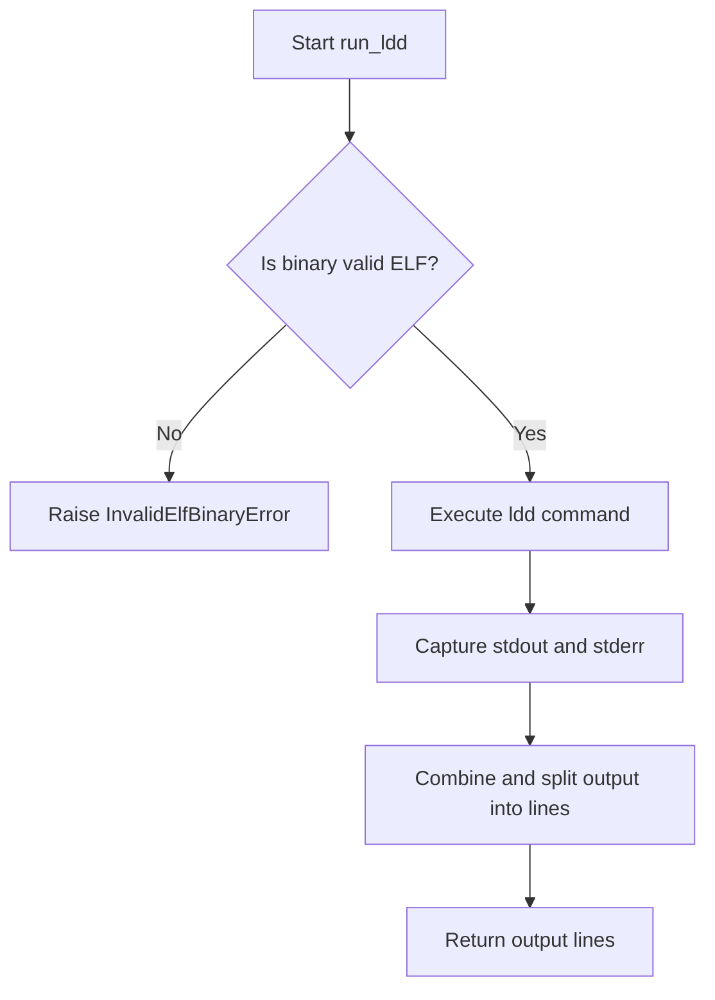

## Examples:
    # Analyze a binary for dependencies
    try:
        deps = run_ldd('/usr/bin/ldd', '/bin/ls')
        for line in deps:
            print(line)
    except InvalidElfBinaryError as e:
        print(f"Invalid binary: {e}")

    # Using with a binary name in PATH
    try:
        deps = run_ldd('ldd', 'python3')
        print("Dependency analysis complete")
    except InvalidElfBinaryError as e:
        print(f"Binary is not ELF: {e}")
```

## `src.exodus_bundler.bundling.stored_property` · *class*

## Summary:
A descriptor class that caches the result of a function call as an instance attribute, ensuring the function is only executed once per instance.

## Description:
The `stored_property` class implements a descriptor that transforms a method into a cached property. When accessed, it executes the wrapped function once per instance and stores the result in the instance's `__dict__`. Subsequent accesses return the cached value instead of re-executing the function. This is useful for expensive computations that should only be performed once per object instance.

This class is typically used as a decorator to convert methods into properties that are computed once and then cached, improving performance for expensive operations.

## State:
- `function`: The wrapped function whose result is cached
  - Type: callable
  - Valid range: Any callable object that accepts `self` as its only argument
  - Invariant: Must be set during initialization and remain immutable

## Lifecycle:
- Creation: Instantiated with a function as argument
- Usage: Accessed as an attribute on an instance (triggers `__get__` method)
- Destruction: No special cleanup required; relies on normal Python garbage collection

## Method Map:
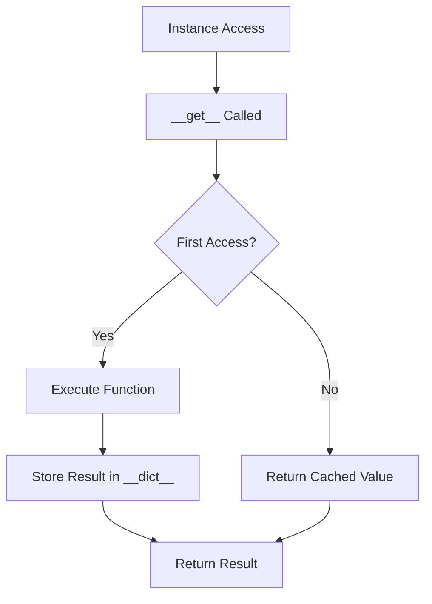

## Raises:
- None explicitly raised by `__init__` or `__get__`
- However, if the wrapped function raises an exception, it will propagate normally

## Example:
```python
class MyClass:
    @stored_property
    def expensive_computation(self):
        # This will only run once per instance
        return sum(range(1000000))

# Usage:
obj = MyClass()
result1 = obj.expensive_computation  # Executes function
result2 = obj.expensive_computation  # Returns cached value
```

### `src.exodus_bundler.bundling.stored_property.__init__` · *method*

## Summary:
Initializes a stored_property descriptor with a function and copies its docstring.

## Description:
The `__init__` method sets up a stored_property descriptor by storing the provided function and copying its docstring to the descriptor's `__doc__` attribute. This enables the descriptor to act as a cached property that executes the function only once per instance.

This method is called during the creation of a stored_property instance, typically when the descriptor is used as a decorator on a method. It prepares the descriptor for use in the descriptor protocol's `__get__` method.

## Args:
    self: The stored_property instance being initialized
    function: A callable object that will be cached and executed once per instance
        - Type: callable
        - Valid range: Any callable that accepts `self` as its only argument
        - Default value: None (not applicable as this is a required parameter)

## Returns:
    None

## Raises:
    None

## State Changes:
    Attributes READ: None
    Attributes WRITTEN: 
    - self.__doc__: Set to the docstring of the provided function
    - self.function: Set to the provided function object

## Constraints:
    Preconditions:
    - The function parameter must be a callable object
    - The function should accept a single argument (typically `self`)
    Postconditions:
    - The descriptor's `__doc__` attribute is set to the function's docstring
    - The descriptor's `function` attribute is set to the provided function

## Side Effects:
    None

### `src.exodus_bundler.bundling.stored_property.__get__` · *method*

## Summary:
Computes and caches the result of a function call on the first access, returning the cached value on subsequent accesses.

## Description:
This method implements the descriptor protocol's `__get__` method for the `stored_property` class. When accessed on an instance, it executes the wrapped function with the instance as argument, stores the result in the instance's dictionary under the function's name, and returns the computed value. Subsequent accesses return the cached value without re-executing the function. When accessed on the class itself (with instance=None), it returns the descriptor object.

## Args:
    self: The stored_property instance
    instance: The object instance that the property is being accessed on, or None when accessed on the class
    type: The class that the property was accessed through

## Returns:
    The result of calling the wrapped function with the instance as argument, or the cached result on subsequent calls. When accessed on the class (instance=None), returns the descriptor object.

## Raises:
    AttributeError: If the function cannot be called on the instance or if there's an issue with attribute access

## State Changes:
    Attributes READ: self.function, self.function.__name__
    Attributes WRITTEN: instance.__dict__[self.function.__name__] (when instance is not None)

## Constraints:
    Preconditions: 
    - The instance parameter must be a valid object that can be passed to self.function
    - The function must be callable with the instance as its sole argument
    - When instance is None, the method returns the descriptor itself
    Postconditions:
    - The result of self.function(instance) is stored in instance.__dict__ under the function name
    - The same cached value is returned on subsequent calls when instance is not None

## Side Effects:
    None

## `src.exodus_bundler.bundling.Elf` · *class*

## Summary:
Represents an ELF (Executable and Linkable Format) binary file and provides methods to analyze its structure and dependencies.

## Description:
The Elf class is responsible for parsing ELF binary files to extract structural information such as architecture, endianness, and binary type. It also identifies the dynamic linker used by the binary and provides functionality to discover both direct and transitive dependencies through system calls to `ldd`. This class serves as a core component in the bundling process, enabling the identification and management of binary dependencies for portable application bundles.

The class is typically instantiated by the File class when analyzing binary files, and it's designed to work within a chroot environment for proper dependency resolution.

## State:
- path (str): Absolute path to the ELF binary file. Must be a valid file path.
- chroot (str, optional): Root directory path for chroot environment. Used to resolve paths within the chroot.
- file_factory (class): Factory class used to create File objects for dependencies. Defaults to the File class.
- bits (int): Architecture bits of the ELF binary (either 32 or 64). Set during initialization based on ELF header.
- type (str): Type of the ELF binary ('relocatable', 'executable', 'shared', or 'core'). Set during initialization based on ELF header.
- linker_file (File, optional): File object representing the dynamic linker used by this binary. Set during initialization by parsing program headers.

## Lifecycle:
Creation: Instantiate with `Elf(path, chroot=None, file_factory=None)` where path is required. The constructor validates that the file exists and is a valid ELF binary.
Usage: Typically used to access properties like `direct_dependencies` and `dependencies` to analyze binary dependencies. The `find_direct_dependencies()` method can be called directly to get immediate dependencies.
Destruction: No explicit cleanup required; relies on Python's garbage collection.

## Method Map:
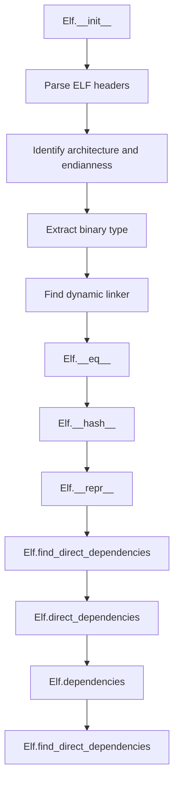

## Raises:
- MissingFileError: Raised when the specified file path does not exist.
- InvalidElfBinaryError: Raised when the specified file is not a valid ELF binary (doesn't start with '\x7fELF').
- UnsupportedArchitectureError: Raised when the ELF binary is neither 32-bit nor 64-bit, or when it's big-endian (only little-endian is supported).

## Example:
```python
# Create an Elf instance for a binary
elf = Elf('/usr/bin/python3')

# Get direct dependencies
direct_deps = elf.direct_dependencies

# Get all transitive dependencies
all_deps = elf.dependencies

# Find dependencies with custom linker
custom_linker = File('/lib64/ld-linux-x86-64.so.2')
deps_with_linker = elf.find_direct_dependencies(custom_linker)
```

### `src.exodus_bundler.bundling.Elf.__init__` · *method*

## Summary:
Initializes an ELF binary object by parsing its metadata and extracting program header information including the dynamic linker path.

## Description:
Constructs an Elf object by reading and analyzing the ELF binary format structure. This method performs comprehensive validation of the ELF file format and extracts key metadata including architecture, binary type, and the dynamic linker path embedded within the binary's program headers. The method is designed as a separate component because ELF binary parsing involves complex bit-level operations and structured data interpretation that would clutter the constructor if inlined. This initialization step is critical for downstream bundling operations that require knowledge of the binary's architecture and linking requirements.

## Args:
    path (str): Absolute or relative path to the ELF binary file to parse
    chroot (str, optional): Path to chroot environment for resolving paths within the binary
    file_factory (class, optional): Factory class for creating File objects, defaults to File class

## Returns:
    None: This is an initializer method that sets instance attributes rather than returning a value

## Raises:
    MissingFileError: When the specified file path does not exist on the filesystem
    InvalidElfBinaryError: When the file is not a valid ELF binary (does not start with '\x7fELF')
    UnsupportedArchitectureError: When the binary is not 32-bit or 64-bit, or is big-endian

## State Changes:
    Attributes WRITTEN: 
        - self.path: Stores the absolute path to the ELF binary
        - self.chroot: Stores the chroot environment path
        - self.file_factory: Stores the file factory class
        - self.bits: Stores architecture bits (32 or 64)
        - self.type: Stores binary type (relocatable, executable, shared, core)
        - self.linker_file: Stores the File object for the dynamic linker, or None if not found

## Constraints:
    Preconditions:
        - The path argument must point to an existing file
        - The file must be a valid ELF binary format
        - The binary must be either 32-bit or 64-bit little-endian architecture
    Postconditions:
        - All ELF metadata is parsed and stored as instance attributes
        - self.linker_file is set to a File object representing the dynamic linker, or None if not found

## Side Effects:
    I/O: Reads from the specified ELF binary file to parse its structure
    State Mutation: Sets instance attributes that will be used by other components during the bundling process

### `src.exodus_bundler.bundling.Elf.__eq__` · *method*

## Summary:
Compares two Elf objects for equality based on their file paths.

## Description:
This method determines whether two Elf objects represent the same ELF binary file by comparing their file paths. It is part of the standard Python object comparison protocol and enables using Elf objects in sets, as dictionary keys, and for equality checks.

## Args:
    other (object): Another object to compare with this Elf instance.

## Returns:
    bool: True if other is an Elf instance and both objects refer to the same file path; False otherwise.

## Raises:
    None explicitly raised.

## State Changes:
    Attributes READ: 
        - self.path: The file path of this Elf instance
    Attributes WRITTEN: None

## Constraints:
    Preconditions:
        - The other object can be any type, but equality is only True when it's an Elf instance
        - self.path must be a valid string path
    Postconditions:
        - Returns a boolean value indicating equality
        - The comparison is symmetric (if a == b, then b == a)
        - The comparison is transitive (if a == b and b == c, then a == c)

## Side Effects:
    None

### `src.exodus_bundler.bundling.Elf.__hash__` · *method*

## Summary:
Returns a hash value based on the file path of this ELF binary.

## Description:
This method computes and returns a hash value for this Elf instance using its file path. It is part of the standard Python object hashing protocol and enables using Elf objects as dictionary keys or in sets. The hash is computed consistently with the `__eq__` method, which compares objects based on their file paths, ensuring that equal Elf objects have equal hash values.

## Args:
    None

## Returns:
    int: An integer hash value derived from the file path stored in `self.path`.

## Raises:
    None explicitly raised.

## State Changes:
    Attributes READ: 
        - self.path: The file path of this Elf instance used to compute the hash
    Attributes WRITTEN: None

## Constraints:
    Preconditions:
        - The Elf instance must have been properly initialized with a valid file path
        - `self.path` must be a string that can be hashed by Python's built-in `hash()` function
    Postconditions:
        - The returned hash value is consistent with the object's identity based on its file path
        - Equal Elf objects (as determined by `__eq__`) will have equal hash values

## Side Effects:
    None

### `src.exodus_bundler.bundling.Elf.__repr__` · *method*

## Summary:
Returns a string representation of the Elf object showing its file path for debugging purposes.

## Description:
This method provides a human-readable string representation of an Elf object, primarily intended for debugging and development. When called, it returns a formatted string that displays the file path of the ELF binary this object represents. This method is automatically invoked by Python's built-in repr() function and is useful for identifying Elf instances in logs, debug output, and interactive sessions.

## Args:
    None

## Returns:
    str: A string in the format '<Elf(path="path/to/file")>' where "path/to/file" is the absolute path to the ELF binary.

## Raises:
    None

## State Changes:
    Attributes READ: 
        - self.path: The file path of the ELF binary this object represents
    Attributes WRITTEN: None

## Constraints:
    Preconditions:
        - The Elf object must have been properly initialized with a valid file path
        - self.path must be a string representing a valid file path
    Postconditions:
        - The returned string follows a consistent format for all Elf objects
        - The string representation includes the full path to the ELF binary

## Side Effects:
    None

### `src.exodus_bundler.bundling.Elf.find_direct_dependencies` · *method*

## Summary:
Finds and returns the set of direct shared library dependencies for an ELF binary by executing the ldd command and parsing its output.

## Description:
This method executes the ldd command on the ELF binary to trace dynamically linked shared libraries. It parses the ldd output to extract dependency paths and creates File objects for each dependency using the class's file_factory. The method handles chroot environments by adjusting library paths appropriately and ensures proper environment variables are set for ldd execution.

## Args:
    linker_file (File, optional): Override for the default linker file. If None, uses self.linker_file. Defaults to None.

## Returns:
    set[File]: A set of File objects representing the direct shared library dependencies of this ELF binary, including the linker itself.

## Raises:
    None explicitly raised by this method, though underlying subprocess calls may raise OSError or other exceptions.

## State Changes:
    Attributes READ: 
        - self.path: Path to the ELF binary being analyzed
        - self.chroot: Chroot environment path if set
        - self.linker_file: Default linker file for the ELF binary
        - self.file_factory: Factory function for creating File objects
    
    Attributes WRITTEN: None

## Constraints:
    Preconditions:
        - self.path must point to a valid ELF binary file
        - The ldd command must be available in the system PATH
        - If chroot is set, it must be a valid directory path
        
    Postconditions:
        - Returns a set of File objects representing dependencies
        - If no linker_file is available, returns an empty set
        - All returned File objects are created with library=True flag

## Side Effects:
    - Executes the ldd command as a subprocess
    - May modify environment variables for subprocess execution
    - Reads the ELF binary file to determine its properties
    - May access files in chroot environment if set

### `src.exodus_bundler.bundling.Elf.dependencies` · *method*

## Summary:
Recursively collects all direct and transitive dependencies of this ELF binary, avoiding cycles in the dependency graph.

## Description:
This method computes the complete set of dependencies for the ELF binary by performing a breadth-first traversal of the dependency graph. It starts with the direct dependencies and recursively discovers dependencies of dependencies until no new dependencies are found. The result includes all libraries and shared objects that this binary depends on, directly or indirectly.

This method is implemented as a stored property, meaning its result is cached after the first call for performance reasons.

## Args:
    None

## Returns:
    set: A set of File objects representing all direct and transitive dependencies of this ELF binary.

## Raises:
    None explicitly raised

## State Changes:
    Attributes READ: 
        - self.direct_dependencies
        - self.linker_file
    
    Attributes WRITTEN: 
        - None (this is a stored property, so no persistent state changes)

## Constraints:
    Preconditions:
        - The ELF binary must be valid and accessible at self.path
        - self.linker_file must be properly initialized (set during Elf.__init__)
        - self.direct_dependencies must be accessible (should be a stored property)
    
    Postconditions:
        - Returns a set of File objects representing all dependencies
        - The returned set contains no duplicates
        - The dependency traversal terminates when all reachable dependencies are discovered

## Side Effects:
    - Invokes the system's ldd command via subprocess to analyze dependencies
    - May perform file system operations when creating File objects for dependencies
    - Uses environment variables (LD_TRACE_LOADED_OBJECTS, LD_LIBRARY_PATH) when executing ldd

### `src.exodus_bundler.bundling.Elf.direct_dependencies` · *method*

## Summary:
Returns the set of direct shared library dependencies for this ELF binary.

## Description:
This property provides access to the direct dependencies of the ELF binary by invoking the system's `ldd` utility. It parses the output of `ldd` to extract shared library paths and converts them into `File` objects for further processing.

The method is designed as a property to cache results and avoid repeated expensive system calls. It handles special cases like chroot environments and ensures proper environment setup for `ldd` execution.

## Args:
    None

## Returns:
    set[File]: A set of File objects representing the direct shared library dependencies of this ELF binary. Returns an empty set if no dependencies are found or if the binary has no associated linker file.

## Raises:
    None explicitly raised, though underlying system calls may raise exceptions.

## State Changes:
    Attributes READ: self.linker_file, self.path, self.chroot, self.file_factory
    Attributes WRITTEN: None

## Constraints:
    Preconditions: The ELF binary must have been successfully initialized and must be a valid ELF file.
    Postconditions: The returned set contains File objects that represent the direct dependencies of this binary.

## Side Effects:
    Executes the `ldd` system command to analyze the binary's dependencies.
    May perform file system operations when constructing File objects in chroot environments.

## `src.exodus_bundler.bundling.File` · *class*

## Summary:
Represents a file to be bundled, handling operations like copying, creating launchers, and managing symbolic links for executables and libraries.

## Description:
The File class encapsulates the behavior and properties of files that need to be bundled into an application package. It determines whether a file requires a launcher (for executables), manages file copying to a destination location, creates symbolic links for entry points, and generates appropriate launchers for executables. This class serves as a central abstraction for file handling during the bundling process.

## State:
- path (str): Absolute path to the file on the filesystem
- entry_point (str or None): Name of the entry point symlink to create, or None if not applicable
- elf (Elf object or None): ELF binary metadata, or None if file is not an ELF binary
- chroot (str or None): Chroot environment path for file resolution, or None if not using chroot
- file_factory (class or None): Factory class for creating new File instances, defaults to File itself
- library (bool): Flag indicating if this file is a library (shared object)
- no_symlink (bool): Flag indicating whether to skip symlink creation for this file

## Lifecycle:
- Creation: Instantiate with a file path and optional parameters (entry_point, chroot, library, file_factory)
- Usage: Call methods like copy(), create_launcher(), symlink() to process the file for bundling
- Destruction: No explicit cleanup required; relies on Python's garbage collection

## Method Map:
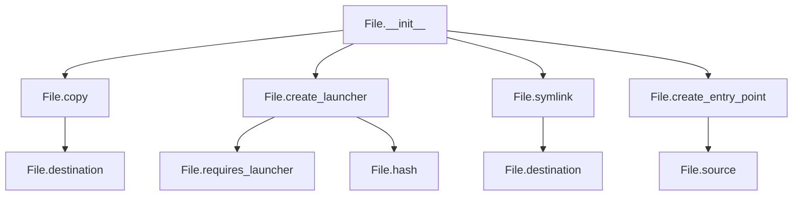

## Raises:
- InvalidElfBinaryError: Raised during initialization when ELF binary detection fails
- AssertionError: Raised in symlink() method when existing symlink doesn't match expected path

## Example:
```python
# Create a File instance
file_obj = File('/usr/bin/python3', entry_point='myapp')

# Copy the file to a working directory
destination = file_obj.copy('/tmp/workdir')

# Create a launcher for the file
launcher_path = file_obj.create_launcher(
    '/tmp/workdir', 
    '/tmp/bundle_root',
    'ld-linux.so.2',
    'myapp_link'
)

# Create an entry point symlink
file_obj.create_entry_point('/tmp/workdir', '/tmp/bundle_root')
```

### `src.exodus_bundler.bundling.File.__init__` · *method*

## Summary:
Initializes a File object by resolving its path, determining entry point behavior, analyzing ELF binary properties, and setting up internal state for bundling operations.

## Description:
The File constructor processes the input file path, resolves it to an absolute location, and sets up internal attributes for subsequent bundling operations. It handles special cases for entry points, attempts to parse ELF binary metadata, and configures properties that control symlink creation and launcher requirements. This method centralizes the initialization logic for File objects, ensuring consistent state setup regardless of the file type or bundling configuration.

## Args:
    path (str): Absolute or relative path to the file to be bundled. May be resolved against PATH if entry_point is specified.
    entry_point (str or None): Name for the entry point symlink to create, or True to auto-generate from filename, or None to skip entry point creation.
    chroot (str or None): Optional chroot environment path for file resolution and dependency analysis.
    library (bool): Flag indicating whether this file is a shared library (default: False).
    file_factory (class or None): Factory class for creating dependent File instances (default: File itself).

## Returns:
    None: This method initializes the object's state and does not return a value.

## Raises:
    InvalidElfBinaryError: Raised when the file is specified as an ELF binary but cannot be parsed as a valid ELF file.

## State Changes:
    Attributes READ: None
    Attributes WRITTEN: 
        - self.path: Set to the resolved absolute path of the file
        - self.entry_point: Set based on entry_point parameter or auto-generated
        - self.elf: Set to an Elf object if file is valid ELF binary, or None otherwise
        - self.chroot: Set to the provided chroot path
        - self.file_factory: Set to provided factory or defaults to File class
        - self.library: Set to the provided library flag
        - self.no_symlink: Set based on entry_point existence and a property that determines launcher requirements

## Constraints:
    Preconditions:
        - The path argument must be a valid string
        - If entry_point is True, the file path must be resolvable to a valid file
        - The file at path must exist and be a regular file (not a directory)
        
    Postconditions:
        - self.path contains an absolute, normalized path to an existing file
        - self.entry_point is either None, a string, or auto-generated from filename
        - self.elf is either an Elf object or None
        - All other attributes are properly initialized with provided or default values

## Side Effects:
    - File system access to resolve and validate the input path
    - Potential exception raising if file validation fails
    - Calls to external functions like resolve_file_path and Elf constructor

### `src.exodus_bundler.bundling.File.__eq__` · *method*

## Summary:
Compares two File objects for equality based on their path and entry_point attributes.

## Description:
This method implements the equality operator (`==`) for File objects, determining whether two File instances represent the same file based on their path and entry_point attributes. This method is called during equality comparisons between File objects.

## Args:
    other (object): Another object to compare with this File instance.

## Returns:
    bool: True if the other object is a File instance and has matching path and entry_point attributes; False otherwise.

## Raises:
    None

## State Changes:
    Attributes READ: self.path, self.entry_point
    Attributes WRITTEN: None

## Constraints:
    Preconditions: The other object must be an instance of the File class for the comparison to return True.
    Postconditions: The method returns a boolean value indicating equality status.

## Side Effects:
    None

## Note:
    There appears to be a bug in the implementation where `self.path == self.path` is compared instead of `self.path == other.path`. This would cause the method to always return False when comparing different File objects with different paths, regardless of whether they actually have the same path.

### `src.exodus_bundler.bundling.File.__hash__` · *method*

## Summary:
Computes and returns a hash value based on the file's path and entry point for use in hash-based data structures.

## Description:
This method implements Python's standard `__hash__` protocol for File objects, returning a hash value derived from a tuple of the file's absolute path and its entry point. This hash enables File objects to function as dictionary keys or set elements. The hash is computed consistently with the `__eq__` method, ensuring that equal File objects produce identical hash values.

## Args:
    None

## Returns:
    int: An integer hash value uniquely identifying this File object based on its path and entry_point attributes.

## Raises:
    None

## State Changes:
    Attributes READ: self.path, self.entry_point
    Attributes WRITTEN: None

## Constraints:
    Preconditions: The File object must have valid path and entry_point attributes that are hashable.
    Postconditions: The returned hash value remains constant for the lifetime of the object.

## Side Effects:
    None

## Usage Context:
This method is automatically invoked when File objects are used in hash-based collections such as sets or dictionaries. It is part of Python's object protocol and should not be called directly in most cases. The hash is computed once and cached by Python's object system for performance.

### `src.exodus_bundler.bundling.File.__repr__` · *method*

## Summary:
Returns a string representation of the File object showing its file path.

## Description:
This special method provides a standardized string representation of a File instance, primarily for debugging and development purposes. It's automatically called by Python's built-in repr() function and when the object is displayed in interactive environments.

## Args:
    None

## Returns:
    str: A string in the format '<File(path="...")>' where '...' represents the absolute path of the file.

## Raises:
    None

## State Changes:
    Attributes READ: self.path
    Attributes WRITTEN: None

## Constraints:
    Preconditions: The File object must have been initialized with a valid path attribute.
    Postconditions: The method returns a consistent string format regardless of the file's content or state.

## Side Effects:
    None

### `src.exodus_bundler.bundling.File.copy` · *method*

*No documentation generated.*

### `src.exodus_bundler.bundling.File.create_entry_point` · *method*

## Summary:
Creates a symbolic link entry point in the bundle's bin directory that points to the source file.

## Description:
This method establishes a symbolic link at the specified entry point location within the bundle's bin directory, allowing execution of the bundled file through that entry point. The symbolic link uses a relative path to maintain portability when the bundle is moved. This method is typically called during the bundling process to create executable entry points for bundled applications.

## Args:
    working_directory (str): The absolute path to the working directory where the bundle will be constructed.
    bundle_root (str): The absolute path to the root directory of the bundle where source files are located.

## Returns:
    None: This method does not return any value.

## Raises:
    OSError: If directory creation or symbolic link creation fails due to permissions or other filesystem issues.

## State Changes:
    Attributes READ: self.source, self.entry_point
    Attributes WRITTEN: None

## Constraints:
    Preconditions:
    - The working_directory must be a valid path where the bundle can be constructed.
    - The bundle_root must be a valid path containing the source file referenced by self.source.
    - The self.source attribute must reference a valid file path relative to bundle_root.
    - The self.entry_point attribute must specify a valid filename for the entry point.

    Postconditions:
    - A bin directory will exist in the working_directory.
    - A symbolic link will be created at working_directory/bin/self.entry_point pointing to the source file.

## Side Effects:
    - Creates a directory structure in the working_directory if it doesn't exist.
    - Creates a symbolic link in the bin directory.
    - Modifies the filesystem by creating directories and symbolic links.

### `src.exodus_bundler.bundling.File.create_launcher` · *method*

## Summary:
Creates a launcher file that wraps an ELF binary with proper library paths and execution environment.

## Description:
This method generates a launcher script or binary that allows execution of a bundled ELF binary with appropriate library paths and runtime environment. It creates necessary symlinks, copies required linker files, and constructs either a binary launcher (when available) or falls back to a bash launcher. The launcher ensures that dependencies are properly resolved when the bundled application is executed.

The method is typically called during the bundling process when preparing executable files for distribution. It's separated from inline logic to handle the complex setup of launchers, symlinks, and environment variables needed for proper execution of bundled binaries.

## Args:
    working_directory (str): The root directory where the bundled application will be created
    bundle_root (str): The base path where bundled files are stored
    linker_basename (str): Name of the linker file to be created/copied
    symlink_basename (str): Name of the symlink to be created pointing to the destination
    shell_launcher (bool): When True, forces creation of a bash launcher even if binary launcher is available

## Returns:
    str: Absolute path to the created launcher file

## Raises:
    AssertionError: When a linker file already exists but has different contents than expected
    CompilerNotFoundError: When binary launcher construction fails and shell launcher is not forced

## State Changes:
    Attributes READ: self.destination, self.source, self.path, self.elf, self.chroot
    Attributes WRITTEN: None (modifies files on disk, not instance attributes)

## Constraints:
    Preconditions: 
    - The ELF binary must be properly detected and analyzed
    - Working directory and bundle root paths must be valid
    - The ELF binary's linker file must exist
    - Required directories must be writable
    
    Postconditions:
    - A launcher file is created at the expected location
    - Symlinks are properly established
    - Required linker files are copied if missing
    - File permissions are preserved from the original binary

## Side Effects:
    - Creates directories in the bundle structure
    - Creates symbolic links in the bundle
    - Copies files (linker files) to the bundle
    - Writes launcher content to files (both binary and text formats)
    - Modifies file permissions via shutil.copymode

### `src.exodus_bundler.bundling.File.symlink` · *method*

## Summary:
Creates a symbolic link from the bundle root to the working directory, establishing a relative path relationship between the destination and source locations.

## Description:
This method establishes a symbolic link between a destination path in the working directory and a source path in the bundle root. It calculates the relative path from the source parent directory to the destination, ensuring proper linking regardless of where the bundle is relocated. The method handles both cases where the symbolic link already exists (validating its correctness) and where it needs to be created.

This logic is separated into its own method rather than being inlined because it encapsulates the complex path resolution and symbolic link creation logic needed for proper bundling. Unlike create_entry_point which creates links in a specific bin directory, or create_launcher which creates more complex launchers, this method provides a general-purpose symbolic link creation mechanism for bundling file references.

## Args:
    working_directory (str): The absolute path to the working directory where the bundle will be constructed.
    bundle_root (str): The absolute path to the root directory of the bundle where source files are located.

## Returns:
    str: The absolute path to the created or validated symbolic link file.

## Raises:
    AssertionError: When a symbolic link already exists but has incorrect target path or is not a symbolic link.

## State Changes:
    Attributes READ: self.destination, self.source
    Attributes WRITTEN: None

## Constraints:
    Preconditions:
    - The working_directory must be a valid path where the bundle can be constructed.
    - The bundle_root must be a valid path where source files are located.
    - The self.destination attribute must represent a valid relative path within the working directory.
    - The self.source attribute must represent a valid relative path within the bundle root.

    Postconditions:
    - A symbolic link will exist at bundle_root/self.source pointing to the destination in working_directory.
    - The parent directory of the symbolic link will be created if it doesn't exist.
    - The returned path will be normalized and absolute.

## Side Effects:
    - Creates directory structures in the bundle root if they don't exist.
    - Creates or validates symbolic links in the bundle structure.
    - Modifies the filesystem by creating directories and symbolic links.

### `src.exodus_bundler.bundling.File.destination` · *method*

## Summary:
Returns the relative filesystem path where this file should be stored within a bundled application structure.

## Description:
This method computes and returns the destination path for a file within the bundled application directory structure. The path is constructed as './data/<file_hash>', where <file_hash> is the SHA-256 hash of the file's contents. This ensures that each unique file gets a predictable, stable location within the bundle while preventing naming conflicts.

The method is implemented as a `@stored_property` which means it's computed once per instance and cached for subsequent accesses. This approach prevents redundant computation and ensures consistent results throughout the object's lifetime.

This method is primarily used during the bundling process to determine where files should be placed in the final bundle structure, particularly in the `copy`, `create_launcher`, and `symlink` methods of the File class.

## Args:
    None

## Returns:
    str: A relative path in the format './data/<sha256_hash>', where <sha256_hash> is the hexadecimal representation of the file's SHA-256 hash

## Raises:
    None explicitly raised

## State Changes:
    Attributes READ: self.hash
    Attributes WRITTEN: None

## Constraints:
    Preconditions:
    - The File instance must have a valid `path` attribute pointing to an existing file
    - The `hash` property must be accessible (the file must be readable)
    
    Postconditions:
    - The returned path is always in the format './data/<hex_hash>'
    - The hash portion is always 64 characters long (SHA-256 hex digest)
    - The path is relative to the working directory

## Side Effects:
    None

### `src.exodus_bundler.bundling.File.executable` · *method*

## Summary:
Returns whether the file at the stored path has execute permissions.

## Description:
This property checks if the file represented by this object can be executed by the current user. It uses the standard POSIX `os.access()` function with the execute permission flag (`os.X_OK`) to determine if the file has execute permissions.

## Args:
    None

## Returns:
    bool: True if the file at `self.path` has execute permissions, False otherwise.

## Raises:
    None

## State Changes:
    Attributes READ: self.path
    Attributes WRITTEN: None

## Constraints:
    Preconditions: The File object must have a valid `path` attribute set.
    Postconditions: The method returns a boolean value indicating execute permission status.

## Side Effects:
    None

### `src.exodus_bundler.bundling.File.elf` · *method*

## Summary:
Returns a boolean indicating whether the file is an ELF (Executable and Linkable Format) binary.

## Description:
This method determines if the file represented by this File instance is an ELF binary by checking its magic number. It calls `detect_elf_binary` with the file's path and returns the result.

The method is implemented as a stored_property, which means its result is computed once and then cached for subsequent accesses.

## Args:
    None

## Returns:
    bool: True if the file is an ELF binary (starts with b'\x7fELF'), False otherwise.

## Raises:
    None

## State Changes:
    Attributes READ: 
        - self.path: The file path used to determine if the file is an ELF binary
    Attributes WRITTEN: 
        - None

## Constraints:
    Preconditions:
        - The File instance must have been initialized with a valid file path
        - The file at self.path must be readable by the executing process
    
    Postconditions:
        - The method will not modify the file or its contents
        - The method will return a boolean value indicating ELF status

## Side Effects:
    None: This method performs no I/O operations beyond reading the first four bytes of the specified file through the `detect_elf_binary` function.

### `src.exodus_bundler.bundling.File.hash` · *method*

## Summary:
Computes and returns the SHA256 hash of the file's contents for unique identification.

## Description:
This method calculates the SHA256 cryptographic hash of the entire file content in binary mode. It's implemented as a stored property, meaning the hash is computed once and cached for subsequent accesses. The hash is used primarily for creating unique identifiers and file paths within the bundling system.

## Args:
    None

## Returns:
    str: A 64-character hexadecimal string representing the SHA256 hash of the file's contents.

## Raises:
    FileNotFoundError: When the file specified by self.path does not exist.
    PermissionError: When there are insufficient permissions to read the file at self.path.

## State Changes:
    Attributes READ: self.path
    Attributes WRITTEN: None

## Constraints:
    Preconditions: 
    - The file at self.path must exist and be readable
    - The file size should be manageable (though no explicit limit is enforced)
    
    Postconditions:
    - Returns a consistent 64-character hexadecimal string for identical file contents
    - The hash computation is deterministic for the same file content

## Side Effects:
    - Reads the entire file content from disk into memory (potentially large files)
    - May raise file system related exceptions if the file is inaccessible

### `src.exodus_bundler.bundling.File.requires_launcher` · *method*

## Summary:
Determines whether a file requires a launcher script for proper execution.

## Description:
This method evaluates various conditions to decide if a file needs a launcher script. It considers file type, executable status, location in the filesystem, and naming conventions to make this determination.

## Args:
    self: The File instance being evaluated

## Returns:
    bool: True if the file requires a launcher script, False otherwise

## Raises:
    None explicitly raised

## State Changes:
    Attributes READ: self.library, self.elf, self.executable, self.entry_point, self.path
    Attributes WRITTEN: None

## Constraints:
    Preconditions: The method assumes self.elf is either None or has a .linker_file attribute
    Postconditions: Returns a boolean value indicating launcher requirement

## Side Effects:
    None

### `src.exodus_bundler.bundling.File.source` · *method*

## Summary:
Returns the relative path of this file from the root directory, excluding the leading slash.

## Description:
Computes and returns the relative path of the file from the root directory ('/') by removing the leading slash from the absolute path. This is used to create paths that are relative to the bundle root directory structure.

This method is primarily used during the bundling process to determine where files should be placed within the bundle's internal directory structure. It's called by methods such as `create_entry_point`, `create_launcher`, and `symlink` to reference the file's location within the bundle.

The method is implemented as a `@stored_property` which means it's computed once per instance and cached for subsequent accesses, preventing redundant path computations.

## Args:
    None

## Returns:
    str: A relative path string without a leading slash, representing the file's location relative to the root directory

## Raises:
    None explicitly raised

## State Changes:
    Attributes READ: self.path
    Attributes WRITTEN: None

## Constraints:
    Preconditions:
    - The File instance must have a valid `path` attribute
    - The `path` attribute must be a string representing a valid filesystem path
    
    Postconditions:
    - The returned string is always relative (no leading slash)
    - The returned path is suitable for use in bundle directory structures
    - The method always returns the same value for a given instance

## Side Effects:
    None

## `src.exodus_bundler.bundling.Bundle` · *class*

## Summary:
Manages collections of files and their dependencies for creating portable application bundles with proper executable launchers.

## Description:
The Bundle class serves as the central coordinator for creating application bundles by managing collections of files and their dependencies. It maintains sets of files and linker files, provides mechanisms for adding files (including automatic dependency resolution for ELF binaries), and orchestrates the final bundle creation process. The class handles the complexity of file management, dependency tracking, and launcher creation while delegating individual file operations to File objects.

## State:
- working_directory (str or None): Path to the temporary working directory for bundle creation; if True, a temporary directory is automatically created
- chroot (str or None): Optional chroot environment path for file resolution
- files (set): Collection of File objects representing files to be included in the bundle
- linker_files (set): Collection of File objects representing linker files needed for ELF binaries

## Lifecycle:
- Creation: Instantiate with optional working_directory and chroot parameters; if working_directory is True, a temporary directory is automatically created
- Usage: Add files using add_file(), then call create_bundle() to generate the final bundle structure
- Destruction: Call delete_working_directory() to clean up temporary files, or let Python's garbage collector handle cleanup

## Method Map:
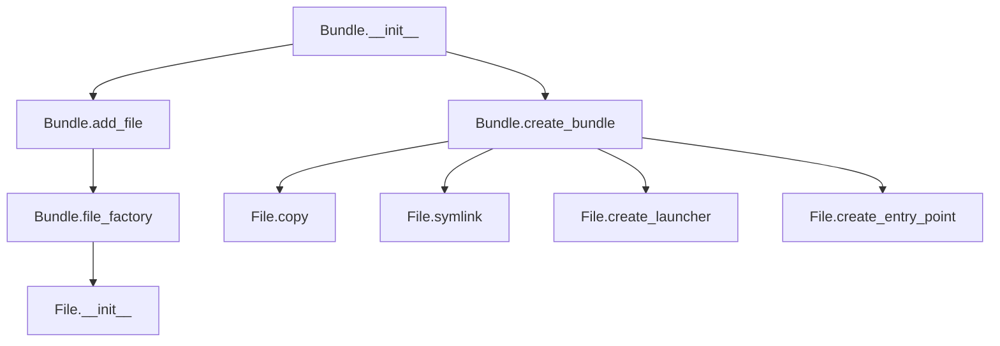

## Raises:
- UnexpectedDirectoryError: Raised by add_file() when attempting to add a directory without an entry point
- AssertionError: Raised in file_factory() when entry point conflicts or chroot mismatches occur

## Example:
```python
# Create a bundle with automatic temporary directory
bundle = Bundle(working_directory=True)

# Add files to the bundle
bundle.add_file('/usr/bin/python3', entry_point='myapp')
bundle.add_file('/lib/libc.so.6')

# Create the bundle structure
bundle.create_bundle(shell_launchers=False)

# Clean up temporary files
bundle.delete_working_directory()
```

### `src.exodus_bundler.bundling.Bundle.__init__` · *method*

## Summary:
Initializes a Bundle object with working directory, chroot settings, and empty file tracking sets.

## Description:
The Bundle constructor prepares the object for bundling files by setting up the working directory, chroot environment, and initializing internal data structures for tracking files and linker dependencies. When working_directory=True, it automatically creates a temporary directory with appropriate permissions.

## Args:
    working_directory (str or bool, optional): Path to working directory or True to auto-create. Defaults to None.
    chroot (str, optional): Chroot environment path for file operations. Defaults to None.

## Returns:
    None: This is a constructor method that initializes instance attributes.

## Raises:
    None explicitly raised.

## State Changes:
    Attributes READ: None
    Attributes WRITTEN: 
        - self.working_directory: Set to provided value or auto-created temp directory
        - self.chroot: Set to provided value
        - self.files: Initialized as empty set
        - self.linker_files: Initialized as empty set

## Constraints:
    Preconditions:
        - working_directory parameter must be either a string path, boolean True, or None
        - chroot parameter must be a string path or None
    Postconditions:
        - self.working_directory is either the provided path, a created temp directory, or None
        - self.chroot is either the provided path or None
        - self.files is initialized as an empty set
        - self.linker_files is initialized as an empty set

## Side Effects:
    - Creates temporary directory when working_directory=True (via tempfile.mkdtemp)
    - Sets file permissions on created temporary directory
    - May modify umask during temporary directory creation

### `src.exodus_bundler.bundling.Bundle.add_file` · *method*

*No documentation generated.*

### `src.exodus_bundler.bundling.Bundle.create_bundle` · *method*

## Summary:
Creates a complete bundle by processing all tracked files, handling entry points, symlinks, and launchers for executables.

## Description:
This method orchestrates the creation of a complete application bundle by processing each file in the bundle's file collection. It handles different file types appropriately: copying regular files, creating symbolic links for libraries, and generating launchers for executables that require special handling. The method also manages naming conflicts for launcher files and ensures proper directory structure creation.

The method is separated from inline logic to provide a clean, centralized workflow for bundle creation that handles the complex interactions between file copying, symbolic linking, and launcher generation. It's designed to be called as part of the bundle creation lifecycle, typically after all files have been added to the bundle via the add_file method.

## Args:
    shell_launchers (bool): When True, forces creation of bash launchers instead of attempting to build binary launchers. Defaults to False.

## Returns:
    None: This method does not return any value.

## Raises:
    OSError: If directory creation or file operations fail due to filesystem permissions or other issues.
    AssertionError: If symbolic links already exist but have incorrect target paths or are not symbolic links.

## State Changes:
    Attributes READ: self.files, self.bundle_root, self.working_directory
    Attributes WRITTEN: None (modifies files on disk, not instance attributes)

## Constraints:
    Preconditions:
    - The Bundle instance must have a valid working_directory set
    - The Bundle instance must have files added via add_file method
    - All file paths referenced by self.files must be valid and accessible
    - The bundle_root property must return a valid path for bundle creation

    Postconditions:
    - All files in self.files will be processed according to their type and requirements
    - Entry point symlinks will be created where specified
    - Symbolic links will be established for files that don't require launchers
    - Launchers will be created for executables requiring special handling
    - Required directories will be created in the bundle structure
    - Naming conflicts for launcher files will be resolved by appending numeric suffixes

## Side Effects:
    - Creates directory structures in both working_directory and bundle_root
    - Creates symbolic links in the bundle structure
    - Copies files (regular files, linker files) to the bundle
    - Writes launcher content to files (both binary and text formats)
    - Modifies file permissions via shutil.copymode

### `src.exodus_bundler.bundling.Bundle.delete_working_directory` · *method*

## Summary:
Deletes the temporary working directory and clears the reference to it.

## Description:
Removes the temporary working directory created during bundle creation and sets the internal reference to None. This method is typically called as part of the bundle cleanup process to free up temporary filesystem resources.

The method is separated from inline logic to provide a clean, dedicated cleanup mechanism that can be called at appropriate points in the bundle lifecycle, particularly after bundle creation is complete and the bundle has been successfully generated.

## Args:
    None

## Returns:
    None

## Raises:
    FileNotFoundError: If the working directory does not exist when attempting to remove it.
    PermissionError: If the process lacks necessary permissions to remove the directory or its contents.
    OSError: If there are general filesystem errors during directory removal, including but not limited to permission errors and invalid path errors.

## State Changes:
    Attributes READ: self.working_directory
    Attributes WRITTEN: self.working_directory

## Constraints:
    Preconditions:
    - The Bundle instance must have a working_directory attribute that points to a valid directory path
    - The working_directory must be a string representing a valid filesystem path
    - The directory must exist and be accessible for deletion

    Postconditions:
    - The working_directory attribute is set to None
    - The directory and all its contents are permanently deleted from the filesystem
    - Any subsequent attempts to access the working directory will result in errors

## Side Effects:
    - Permanently deletes all files and subdirectories within the working directory
    - Modifies the filesystem by removing directory contents
    - Clears the internal working_directory reference

### `src.exodus_bundler.bundling.Bundle.file_factory` · *method*

*No documentation generated.*

### `src.exodus_bundler.bundling.Bundle.bundle_root` · *method*

## Summary:
Returns the absolute path to the bundle directory within the working directory structure.

## Description:
Constructs and returns the absolute path where bundled files are stored for this specific bundle. This property is used throughout the bundling process to determine file placement and management locations. The path follows the pattern: {working_directory}/bundles/{hash} where hash represents the unique identifier for this bundle based on its contents.

This method is implemented as a property to ensure consistent path construction and normalization across all bundle operations.

## Args:
    None: This is a property method with no parameters.

## Returns:
    str: Absolute path to the bundle directory, normalized for consistent representation.

## Raises:
    None: This method does not raise exceptions under normal operation.

## State Changes:
    Attributes READ: 
        - self.working_directory: Directory where bundle operations are performed
        - self.hash: Unique identifier for this bundle based on contained files
    Attributes WRITTEN: None

## Constraints:
    Preconditions:
        - self.working_directory must be a valid path or None
        - self.hash must be a valid string representing the bundle's unique identifier
    Postconditions:
        - Returns a normalized absolute path string
        - The returned path is guaranteed to be absolute and normalized

## Side Effects:
    None: This method performs no I/O operations or external service calls. It only computes and returns a path string.

### `src.exodus_bundler.bundling.Bundle.hash` · *method*

## Summary:
Computes a SHA-256 hash of all file hashes in the bundle to uniquely identify the bundle contents.

## Description:
Generates a cryptographic hash that represents the complete set of files in this bundle. This hash is computed by collecting the individual SHA-256 hashes of all files in the bundle, sorting them alphabetically, joining them with newlines, and then computing a final SHA-256 hash of the combined string. This method serves as the primary identifier for bundles and is used to create unique bundle directories.

## Args:
    None

## Returns:
    str: A 64-character hexadecimal string representing the SHA-256 hash of the bundle's file contents.

## Raises:
    None

## State Changes:
    Attributes READ: self.files
    Attributes WRITTEN: None

## Constraints:
    Preconditions:
    - All files in self.files must have valid hash properties
    - The files in the bundle should be stable during hash computation
    
    Postconditions:
    - Returns a consistent 64-character hexadecimal string for identical bundle contents
    - The order of files in the bundle does not affect the result due to sorting

## Side Effects:
    - Reads the hash property of each file in self.files
    - Computes SHA-256 hash of concatenated file hashes

