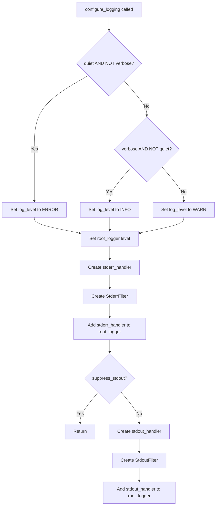

# `cli.py`

## `src.exodus_bundler.cli.parse_args` · *function*

## Summary:
Parses command-line arguments for the Exodus bundler tool and returns them as a dictionary.

## Description:
This function serves as the central command-line interface parser for the Exodus bundler utility. It processes user-provided arguments to configure how ELF binary executables and their dependencies are bundled for portability across systems with incompatible libraries. The function extracts all command-line options and positional arguments into a structured dictionary that can be consumed by the bundling logic.

The function was extracted from inline argument parsing to provide a clean separation between CLI interface definition and business logic, making the code more testable and maintainable.

## Args:
    args (list[str], optional): Command-line arguments to parse. If None, sys.argv[1:] is used. Defaults to None.
    namespace (argparse.Namespace, optional): An object to store parsed arguments. If None, a new namespace is created. Defaults to None.

## Returns:
    dict[str, Any]: A dictionary mapping argument names to their parsed values. Keys include:
        - 'executables': List of ELF executable paths (positional argument, required)
        - 'chroot': Path to chroot directory (optional, string or None)
        - 'add': List of additional dependency files to include (optional, list)
        - 'detect': Boolean flag for auto-detection of dependencies (optional)
        - 'no_symlink': List of files that should not be symlinked (optional, list)
        - 'output': Output file path specification (optional, string or None)
        - 'quiet': Boolean flag to suppress warnings (optional)
        - 'rename': List of new names for executables (optional, list)
        - 'shell_launchers': Boolean flag to force shell launchers (optional)
        - 'tarball': Boolean flag to create tarball instead of installation script (optional)
        - 'verbose': Boolean flag for verbose output (optional)

## Raises:
    SystemExit: When invalid arguments are provided or help is requested, argparse will cause the program to exit.

## Constraints:
    Preconditions:
        - The function assumes that the argument parser configuration is valid
        - If args is provided, it should be a list of strings representing command-line arguments
        - The 'executables' argument is required and must be provided (nargs='+')
    
    Postconditions:
        - Returns a dictionary with all parsed arguments
        - All arguments are properly validated according to argparse rules
        - The returned dictionary contains all defined arguments with appropriate types

## Side Effects:
    - May print help text to stdout if --help is specified
    - May print error messages to stderr if invalid arguments are provided
    - May cause program termination via SystemExit if parsing fails or help is requested

## Control Flow:
```mermaid
flowchart TD
    A[Start parse_args] --> B{args provided?}
    B -->|No| C[Use sys.argv[1:]]
    B -->|Yes| C
    C --> D[Create ArgumentParser with description]
    D --> E[Add executables argument (required, nargs='+')]
    E --> F[Add chroot argument (--chroot/-c)]
    F --> G[Add add argument (--add/-a)]
    G --> H[Add detect argument (--detect/-d)]
    H --> I[Add no_symlink argument (--no-symlink)]
    I --> J[Add output argument (--output/-o)]
    J --> K[Add quiet argument (--quiet/-q)]
    K --> L[Add rename argument (--rename/-r)]
    L --> M[Add shell_launchers argument (--shell-launchers)]
    M --> N[Add tarball argument (--tarball/-t)]
    N --> O[Add verbose argument (--verbose/-v)]
    O --> P[Parse arguments with parser.parse_args()]
    P --> Q[Convert to dict with vars()]
    Q --> R[Return parsed arguments]
```

## Examples:
```python
# Basic usage with single executable
parsed_args = parse_args(['myapp'])

# Usage with multiple options
parsed_args = parse_args([
    'myapp', 
    '-c', '/path/to/chroot',
    '-a', '/path/to/lib.so',
    '-o', 'bundle.tgz',
    '--tarball'
])

# Usage with renaming (one executable)
parsed_args = parse_args([
    'myapp', 
    '-r', 'renamed_app',
    '--verbose'
])

# Usage with renaming (multiple executables)
parsed_args = parse_args([
    'app1', 'app2',
    '-r', 'renamed1', '-r', 'renamed2'
])

# Usage with no symlinks
parsed_args = parse_args([
    'myapp',
    '--no-symlink', '/path/to/file1',
    '--no-symlink', '/path/to/file2'
])
```

## `src.exodus_bundler.cli.configure_logging` · *function*

## Summary:
Configures the application's logging system with different output streams based on verbosity flags.

## Description:
Sets up logging with stderr receiving WARNING and ERROR messages, and stdout receiving DEBUG and INFO messages. The function allows controlling verbosity through quiet and verbose flags, and can suppress stdout output when needed.

## Args:
    quiet (bool): When True, sets logging level to ERROR and suppresses INFO/DEBUG output.
    verbose (bool): When True, sets logging level to INFO and enables verbose output.
    suppress_stdout (bool): When True, prevents adding stdout handler to logging system. Defaults to False.

## Returns:
    None: This function does not return any value.

## Raises:
    None: This function does not explicitly raise exceptions.

## Constraints:
    Preconditions:
    - quiet and verbose should not both be True simultaneously (though the function handles this gracefully)
    - The root_logger must be properly initialized in exodus_bundler module
    
    Postconditions:
    - root_logger is configured with appropriate log level
    - stderr handler is added to root_logger with WARN/ERROR filtering
    - stdout handler is added to root_logger with DEBUG/INFO filtering (unless suppressed)

## Side Effects:
    - Modifies global logging configuration via root_logger
    - Adds handlers to the root_logger instance
    - May add/remove stdout handler based on suppress_stdout flag

## Control Flow:


## Examples:
    # Configure for quiet output (only errors)
    configure_logging(quiet=True, verbose=False)
    
    # Configure for verbose output (info and debug)
    configure_logging(quiet=False, verbose=True)
    
    # Configure for normal output with suppressed stdout
    configure_logging(quiet=False, verbose=False, suppress_stdout=True)
```

## `src.exodus_bundler.cli.StderrFilter` · *class*

## Summary:
A logging filter that returns True for WARNING and ERROR level records.

## Description:
The StderrFilter class implements a filter method that evaluates log records and returns True only for records with WARNING or ERROR severity levels. This is a simple filter that extends the standard logging.Filter base class.

## State:
- Inherits from logging.Filter
- No instance attributes beyond base class
- filter method processes logging.LogRecord objects

## Lifecycle:
- Creation: Instantiated as part of logging configuration
- Usage: Called by logging framework during record processing
- Destruction: Handled by Python's garbage collection

## Method Map:
```mermaid
graph TD
    A[Log Record] --> B[StderrFilter.filter()]
    B --> C{levelno in (WARN, ERROR)?}
    C -->|Yes| D[Return True]
    C -->|No| E[Return False]
```

## Raises:
- No exceptions explicitly raised by this implementation
- Relies on standard logging framework behavior

## Example:
```python
import logging
from exodus_bundler.cli import StderrFilter

# Create a handler with the filter
handler = logging.StreamHandler()
handler.addFilter(StderrFilter())

# Configure logger
logger = logging.getLogger('example')
logger.addHandler(handler)
logger.setLevel(logging.DEBUG)

# Only WARNING and ERROR messages will be processed
logger.warning("This appears")
logger.error("This also appears")
logger.info("This is filtered out")
```

### `src.exodus_bundler.cli.StderrFilter.filter` · *method*

## Summary:
Filters log records to only allow WARNING and ERROR level messages to pass through.

## Description:
This method implements the filtering logic for the StderrFilter class, which is designed to control which log records are processed by the stderr logger. It evaluates whether a given log record's severity level matches either WARNING or ERROR levels, allowing these critical messages to pass through while filtering out other log levels like INFO, DEBUG, etc.

## Args:
    record (logging.LogRecord): The log record to be evaluated for filtering

## Returns:
    bool: True if the record's level is either WARNING (logging.WARN) or ERROR (logging.ERROR), False otherwise

## Raises:
    None: This method does not raise any exceptions

## State Changes:
    Attributes READ: None - this method only reads the record's levelno attribute
    Attributes WRITTEN: None - this method does not modify any instance attributes

## Constraints:
    Preconditions: The record parameter must be a valid logging.LogRecord instance
    Postconditions: The method always returns a boolean value (True or False)

## Side Effects:
    None: This method performs no I/O operations or external service calls. It only evaluates the log record's level.

## `src.exodus_bundler.cli.StdoutFilter` · *class*

## Summary:
A logging filter that permits only DEBUG and INFO level messages to pass through.

## Description:
The StdoutFilter class is designed to filter log records so that only DEBUG and INFO level messages are allowed through, while suppressing WARNING, ERROR, and CRITICAL level messages. This is useful for controlling verbosity in command-line interfaces where detailed debugging information should be shown but error messages should be filtered out.

This class is typically instantiated by logging configuration code or by the application's logging setup process. It serves as a specialized filter for stdout logging streams.

## State:
- The class has no instance attributes beyond those inherited from logging.Filter
- The filter method operates on a single parameter `record` of type logging.LogRecord
- No class invariants apply as this is a simple filter with no persistent state

## Lifecycle:
- Creation: Instantiated as part of logging configuration, typically via logging.Filter() constructor
- Usage: Called automatically by the logging framework when processing log records
- Destruction: Managed by Python's garbage collection when no longer referenced

## Method Map:
```mermaid
graph TD
    A[Log Record] --> B[StdoutFilter.filter()]
    B --> C{Level in (DEBUG,INFO)?}
    C -->|Yes| D[Return True]
    C -->|No| E[Return False]
```

## Raises:
- No exceptions are raised by the __init__ method of this class
- The filter method itself doesn't raise exceptions but may behave unexpectedly if passed non-standard log record objects

## Example:
```python
import logging
from exodus_bundler.cli import StdoutFilter

# Configure logger with the filter
logger = logging.getLogger('myapp')
handler = logging.StreamHandler(sys.stdout)
handler.addFilter(StdoutFilter())
logger.addHandler(handler)
logger.setLevel(logging.DEBUG)

# These will appear in stdout
logger.debug("Debug message")
logger.info("Info message")

# These will be filtered out
logger.warning("Warning message")
logger.error("Error message")
```

### `src.exodus_bundler.cli.StdoutFilter.filter` · *method*

## Summary:
Filters log records to allow only DEBUG and INFO level messages through to stdout.

## Description:
This method implements the logging filter interface to control which log records are processed by the stdout handler. It specifically permits DEBUG and INFO level records while blocking all other log levels such as WARNING, ERROR, and CRITICAL.

## Args:
    record (logging.LogRecord): The log record to be filtered

## Returns:
    bool: True if the record's level is DEBUG or INFO, False otherwise

## Raises:
    None

## State Changes:
    Attributes READ: None
    Attributes WRITTEN: None

## Constraints:
    Preconditions: The record parameter must be a valid logging.LogRecord instance
    Postconditions: The method always returns a boolean value indicating whether the record should be processed

## Side Effects:
    None

## `src.exodus_bundler.cli.main` · *function*

## Summary:
Entry point for the Exodus bundler command-line interface that processes command-line arguments, configures logging, handles input streams, and orchestrates bundle creation.

## Description:
The main function serves as the primary entry point for the Exodus bundler CLI tool. It coordinates the entire bundling process by parsing command-line arguments, setting up appropriate output handling (including automatic determination of output destination), configuring the logging system, processing standard input for additional dependencies, and finally delegating to the bundle creation logic.

This function was extracted from inline CLI logic to provide a clean separation between command-line interface handling and the core bundling business logic, improving testability and maintainability. It encapsulates the complete workflow of a CLI invocation from argument parsing through to bundle creation.

## Args:
    args (list[str], optional): Command-line arguments to parse. If None, sys.argv[1:] is used. Defaults to None.
    namespace (argparse.Namespace, optional): An object to store parsed arguments. If None, a new namespace is created. Defaults to None.

## Returns:
    None: This function does not return any value. It exits the program with status code 1 on fatal errors.

## Raises:
    SystemExit: When invalid arguments are provided or help is requested, argparse will cause the program to exit.
    FatalError: When bundle creation fails with a critical error that requires program termination.

## Constraints:
    Preconditions:
        - The function assumes that the argument parser configuration is valid
        - If args is provided, it should be a list of strings representing command-line arguments
        - The 'executables' argument is required and must be provided (nargs='+')
        - The root_logger must be properly initialized in exodus_bundler module
    
    Postconditions:
        - Command-line arguments are successfully parsed and validated
        - Logging system is configured appropriately
        - Standard input is processed if available and not a TTY
        - Bundle creation is initiated with appropriate parameters
        - Program exits with status 1 on fatal errors

## Side Effects:
    - Reads command-line arguments from sys.argv or provided args list
    - May read from standard input if not a TTY
    - Configures global logging system via root_logger
    - May write to standard output or standard error
    - Creates temporary files and directories during bundle creation
    - May write output file to disk or stdout
    - Exits the program with status code 1 on fatal errors

## Control Flow:
```mermaid
flowchart TD
    A[main() called] --> B[Parse command-line arguments]
    B --> C{output is None?}
    C -->|Yes| D{stdout is TTY?}
    D -->|Yes| E[Set output to default template]
    D -->|No| F[Set output to '-']
    C -->|No| G[Skip output defaulting]
    G --> H[Extract quiet/verbose flags]
    H --> I[Calculate suppress_stdout]
    I --> J[Configure logging]
    J --> K{stdin is not TTY?}
    K -->|Yes| L[Read stdin content]
    L --> M[Extract paths from stdin]
    M --> N[Append extracted paths to args['add']]
    N --> O[Try to create bundle]
    O --> P{FatalError caught?}
    P -->|Yes| Q[Log error message]
    Q --> R[Log error details with exc_info]
    R --> S[Exit with status 1]
    P -->|No| T[Return normally]
```

## Examples:
    # Basic usage with single executable
    main(['myapp'])
    
    # Usage with multiple options
    main([
        'myapp', 
        '-c', '/path/to/chroot',
        '-a', '/path/to/lib.so',
        '-o', 'bundle.tgz',
        '--tarball'
    ])
    
    # Usage with stdin input (piping)
    echo "/path/to/lib1.so" | main(['myapp'])
    
    # Usage with quiet output
    main(['myapp', '--quiet'])
    
    # Usage with verbose output
    main(['myapp', '--verbose'])
```

