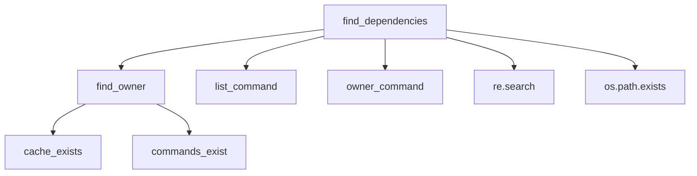
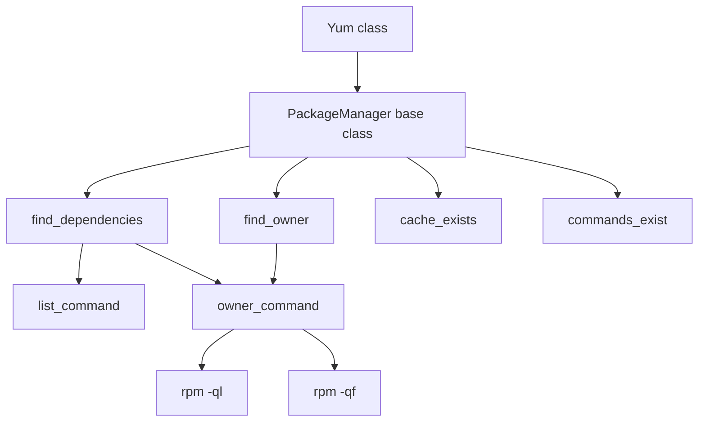

# `dependency_detection.py`

## `src.exodus_bundler.dependency_detection.PackageManager` · *class*

## Summary:
Base class for package managers that detects file dependencies by querying system package managers.

## Description:
The PackageManager class serves as an abstract base class for implementing package manager-specific dependency detection. It provides common functionality for finding dependencies of files by querying system package managers through subprocess calls. Subclasses must override class variables such as cache_directory, list_command, list_regex, owner_command, and owner_regex to provide implementation-specific behavior.

This class is designed to work with system package managers like apt, yum, or others that provide command-line tools for querying package information. It's typically instantiated by subclasses that configure the appropriate command-line tools and regex patterns for their specific package manager.

## State:
- cache_directory (str): Path to cache directory that must exist for operations to proceed. Must be set by subclasses.
- list_command (list[str]): Command and arguments to list dependencies for a package. Must be set by subclasses.
- list_regex (str): Regular expression pattern to extract dependency paths from list command output. Defaults to '(.*)'.
- owner_command (list[str]): Command and arguments to find package owner of a file. Must be set by subclasses.
- owner_regex (str): Regular expression pattern to extract package name from owner command output. Defaults to '(.*)'.

Class invariants:
- All class variables (cache_directory, list_command, owner_command) must be properly initialized by subclasses before instance methods are called
- The cache_directory must be a valid existing directory path when cache_exists property is checked
- The commands referenced in list_command and owner_command must be available in the system PATH when commands_exist property is checked

## Lifecycle:
- Creation: Instantiate by subclassing and setting required class variables (cache_directory, list_command, owner_command)
- Usage: Call find_dependencies() with a file path to get its dependencies, or find_owner() with a file path to get its package owner
- Destruction: No explicit cleanup required; uses standard Python garbage collection

## Method Map:


## Raises:
- None explicitly raised by __init__ (as it's a base class with no constructor)
- Methods may return None when operations fail due to missing cache or commands

## Example:
```python
# Typical usage pattern:
class AptPackageManager(PackageManager):
    cache_directory = '/var/cache/apt'
    list_command = ['apt-cache', 'show']
    list_regex = r'^Filename:\s+(.*)$'
    owner_command = ['dpkg', '-S']
    owner_regex = r'^([^:]+):'

# Create instance
pkg_manager = AptPackageManager()

# Find dependencies
deps = pkg_manager.find_dependencies('/usr/bin/python3')
if deps:
    print(f"Dependencies: {deps}")
```

### `src.exodus_bundler.dependency_detection.PackageManager.find_owner` · *method*

## Summary:
Finds the owner of a given file path by executing a system command and parsing its output.

## Description:
This method determines which entity (typically a package or module) owns a specified file path by invoking an external command and extracting the relevant information using a regular expression pattern. It serves as a utility for dependency resolution in the Exodus bundler system.

The method is called during the dependency detection phase when resolving what package or module owns a particular file. It's part of the core dependency resolution pipeline that helps identify transitive dependencies.

## Args:
    path (str): The absolute or relative path to the file whose owner needs to be determined.

## Returns:
    str or None: The name of the owner entity if successfully identified, or None if either the cache directory doesn't exist, the required commands aren't available, or no match is found in the command output.

## Raises:
    None explicitly raised, though underlying subprocess operations may raise OSError or other system-level exceptions.

## State Changes:
    Attributes READ: self.cache_exists (property), self.commands_exist (property), self.owner_command, self.owner_regex, self.cache_directory
    Attributes WRITTEN: None

## Constraints:
    Preconditions:
    - The PackageManager instance must have properly initialized attributes including cache_directory, owner_command, and owner_regex
    - The cache directory must exist and be a valid directory
    - The owner_command must reference valid executable commands available in the system PATH
    
    Postconditions:
    - If successful, returns a string containing the owner name extracted from command output
    - If unsuccessful due to missing cache or commands, returns None
    - If no match is found in command output, returns None

## Side Effects:
    - Executes an external subprocess command
    - Reads environment variables (copies os.environ)
    - May cause I/O operations through subprocess communication

### `src.exodus_bundler.dependency_detection.PackageManager.cache_exists` · *method*

## Summary:
Checks whether the configured cache directory exists and is a valid directory.

## Description:
This property determines if the cache directory specified by `self.cache_directory` exists in the filesystem and is a directory. It serves as a validation check to ensure the caching infrastructure is properly set up before attempting to use cached data.

The property is primarily used in the `find_owner` method as a precondition to verify that the cache directory is available before proceeding with dependency resolution operations.

## Args:
    None

## Returns:
    bool: True if `self.cache_directory` exists and is a directory; False otherwise.

## Raises:
    None

## State Changes:
    Attributes READ: self.cache_directory
    Attributes WRITTEN: None

## Constraints:
    Preconditions: The `self.cache_directory` attribute must be initialized (not None) before calling this property.
    Postconditions: The return value accurately reflects the filesystem state of the cache directory.

## Side Effects:
    I/O: Performs filesystem operations using `os.path.exists()` and `os.path.isdir()`.

### `src.exodus_bundler.dependency_detection.PackageManager.commands_exist` · *method*

## Summary:
Checks whether the required system commands for package management exist in the system PATH.

## Description:
This method verifies that both the list command and owner command required for dependency detection are available in the system. It is used as a property to ensure prerequisite commands are present before attempting to resolve dependencies or owners of files.

## Args:
    None

## Returns:
    bool: True if both the list command and owner command exist in the system PATH, False otherwise.

## Raises:
    None

## State Changes:
    Attributes READ: self.list_command, self.owner_command
    Attributes WRITTEN: None

## Constraints:
    Preconditions: 
    - self.list_command must be a list-like object with at least one element
    - self.owner_command must be a list-like object with at least one element
    - Both commands should be valid command names that can be found in system PATH
    
    Postconditions:
    - The method returns a boolean indicating command availability
    - No modifications are made to the object's state

## Side Effects:
    None

## `src.exodus_bundler.dependency_detection.Pacman` · *class*

## Summary:
Implementation of PackageManager for Arch Linux's pacman package manager that detects file dependencies and package ownership.

## Description:
The Pacman class provides package dependency detection functionality for Arch Linux systems using the pacman package manager. It configures the PackageManager base class with Arch-specific settings for querying package information through system commands. This class is used by the dependency detection system when working with Arch Linux environments.

The class enables two primary operations: finding dependencies of files by identifying which packages contain them, and determining which package owns a specific file. It leverages pacman's built-in commands (-Ql for listing package contents and -Qo for finding file owners) along with regular expressions to parse command output.

## State:
- cache_directory (str): Path to pacman's cache directory '/var/cache/pacman' that must exist for operations to proceed
- list_command (list[str]): Command and arguments ['pacman', '-Ql'] used to list files contained in packages
- list_regex (str): Regular expression pattern r'.*\s+(\/.+)' used to extract file paths from list command output
- owner_command (list[str]): Command and arguments ['pacman', '-Qo'] used to find which package owns a file
- owner_regex (str): Regular expression pattern r' is owned by (.*)\s+.*' used to extract package names from owner command output

All class variables are set as class constants and must remain unchanged during object lifetime.

## Lifecycle:
- Creation: Instantiate directly as Pacman() - no constructor parameters required as all configuration is via class variables
- Usage: Call find_dependencies() to get package dependencies for a file, or find_owner() to identify which package owns a file
- Destruction: Uses standard Python garbage collection; no explicit cleanup required

## Method Map:


## Raises:
- None explicitly raised by __init__ (inherited from PackageManager base class)
- Methods may return None when operations fail due to missing cache directory or unavailable commands

## Example:
```python
# Create Pacman instance for Arch Linux dependency detection
pacman_manager = Pacman()

# Find dependencies of a file
dependencies = pacman_manager.find_dependencies('/usr/bin/python3')
if dependencies:
    print(f"Dependencies: {dependencies}")

# Find which package owns a specific file
owner = pacman_manager.find_owner('/lib/libc.so.6')
if owner:
    print(f"File owned by package: {owner}")
```

## `src.exodus_bundler.dependency_detection.Yum` · *class*

## Summary:
YUM package manager implementation for detecting file dependencies through RPM queries.

## Description:
The Yum class extends PackageManager to provide YUM-specific functionality for detecting file dependencies by querying RPM packages. It configures the appropriate command-line tools and regular expressions needed to query RPM packages for dependency information. This implementation enables the detection of which RPM packages own specific files and what dependencies those packages have.

The class inherits from PackageManager which provides common functionality for finding dependencies of files by querying system package managers through subprocess calls. It implements the specific configuration required for YUM-based package management systems.

## State:
- cache_directory (str): Path to YUM cache directory '/var/cache/yum'. This directory must exist for cache-related operations to function properly.
- list_command (list[str]): Command and arguments to list package contents - ['rpm', '-ql']. This executes rpm -ql to list files owned by a package.
- list_regex (str): Regular expression pattern r'(.+)' to extract file paths from rpm -ql command output.
- owner_command (list[str]): Command and arguments to find package owner of a file - ['rpm', '-qf']. This executes rpm -qf to query which package owns a specific file.
- owner_regex (str): Regular expression pattern r'(.+)' to extract package names from rpm -qf command output.

All class variables are class-level attributes that must be properly configured for the class to function correctly. The class follows the same invariants as PackageManager regarding command availability and cache existence.

## Lifecycle:
- Creation: Instances are created automatically by the dependency detection system when working with YUM-based systems. No special instantiation is required beyond normal Python object creation.
- Usage: Typically called through the PackageManager interface methods like find_dependencies() and find_owner(). These methods internally use the configured commands and regex patterns.
- Destruction: Standard Python garbage collection handles cleanup with no special destruction requirements.

## Method Map:


## Raises:
- None explicitly raised by __init__ as it inherits from PackageManager with no custom constructor
- Methods inherited from PackageManager may raise exceptions if underlying commands fail or if cache/commands are unavailable

## Example:
```python
# Yum class is typically used indirectly through dependency detection system
# Create a dependency detector that uses YUM
detector = DependencyDetector()
detector.add_package_manager(Yum())

# Find dependencies of a file
dependencies = detector.find_dependencies('/usr/bin/python3')

# Find package owner of a file  
owner = detector.find_owner('/lib/libc.so.6')
```

## `src.exodus_bundler.dependency_detection.detect_dependencies` · *function*

## Summary:
Detects project dependencies by trying multiple package managers until one successfully identifies dependencies for the given path.

## Description:
This function serves as the primary entry point for dependency detection in the Exodus bundler system. It sequentially attempts to identify dependencies using various package manager implementations (such as npm, pip, etc.) until one returns a successful result. The function acts as a dispatcher that tries different detection strategies in order of preference or reliability.

The logic is extracted into its own function to provide a clean abstraction layer that encapsulates the dependency detection strategy and allows for easy extension with new package managers without modifying the core detection logic.

## Args:
    path (str): The filesystem path to the project directory for which dependencies should be detected.

## Returns:
    list[str] or None: A list of detected dependency names if dependencies are found by any package manager, or None if no dependencies are detected by any of the package managers. Each dependency name is typically a string representing the package identifier.

## Raises:
    None explicitly raised by this function.

## Constraints:
    Preconditions:
    - The path argument must be a valid filesystem path to a directory containing a project
    - The package_managers global variable must be properly initialized with package manager instances that support the find_dependencies method
    
    Postconditions:
    - If dependencies are found, returns a list of dependency names (strings)
    - If no dependencies are found by any package manager, returns None

## Side Effects:
    None explicitly stated in the function itself.

## Control Flow:
```mermaid
flowchart TD
    A[Start detect_dependencies] --> B{Iterate package_managers}
    B --> C[Call package_manager.find_dependencies(path)]
    C --> D{Dependencies found?}
    D -->|Yes| E[Return dependencies]
    D -->|No| F[Continue to next package_manager]
    F --> B
    B -->|End of list| G[Return None]
```

## Examples:
    # Basic usage
    deps = detect_dependencies("/path/to/project")
    if deps:
        print(f"Found {len(deps)} dependencies")
        for dep in deps:
            print(f"  - {dep}")
    else:
        print("No dependencies detected")
        
    # Usage in a bundling context
    project_deps = detect_dependencies("./my-project")
    if project_deps is None:
        raise ValueError("Could not detect dependencies for project")

