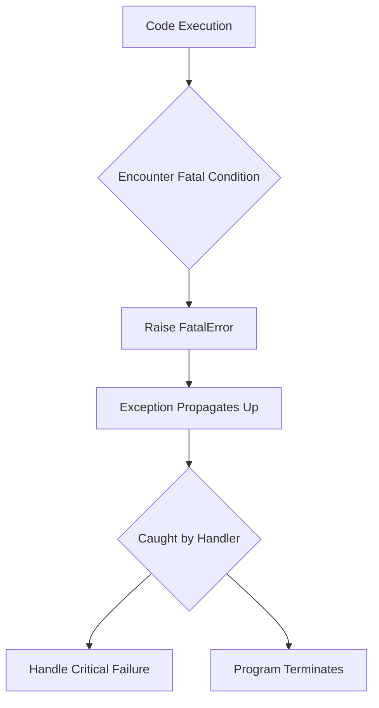
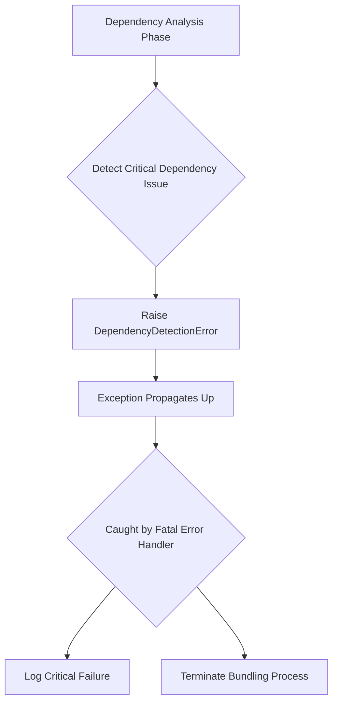
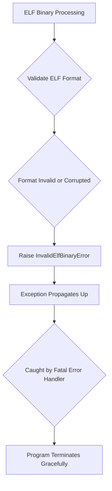
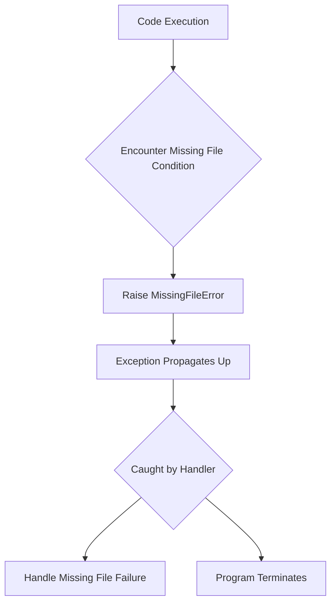
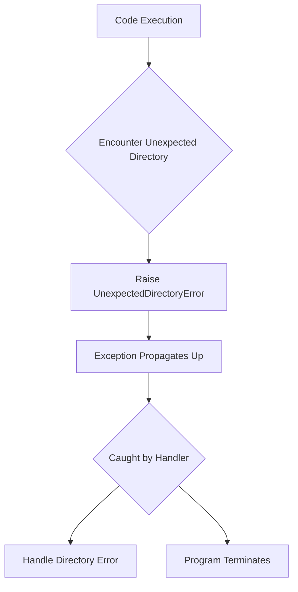
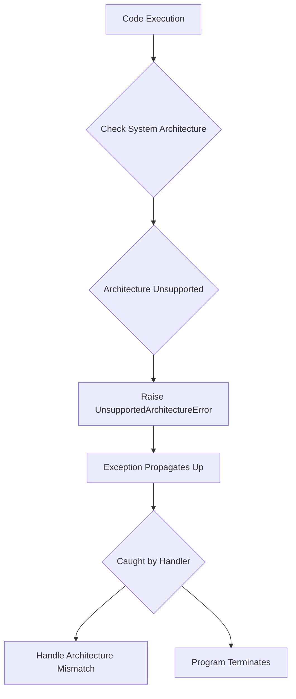

# `errors.py`

## `src.exodus_bundler.errors.FatalError` · *class*

## Summary:
A custom exception class representing unrecoverable errors that halt the Exodus bundler execution.

## Description:
FatalError is a specialized exception type used throughout the exodus_bundler system to indicate critical failures that cannot be recovered from. When raised, it signals to the application that the bundling process must terminate immediately. This exception inherits from Python's standard Exception class but provides semantic clarity for fatal error conditions within the bundler's workflow.

The FatalError class serves as a distinct abstraction from other exception types, allowing the system to differentiate between recoverable issues and those requiring immediate termination. It is typically raised when fundamental assumptions about the build environment, configuration, or input files are violated in ways that make continued execution impossible or meaningless.

## State:
This class has no instance attributes beyond those inherited from Exception. The standard Exception attributes (args, message) are available.

## Lifecycle:
Creation: Instances are created by raising the exception directly with `raise FatalError("error message")` or by instantiating it with `FatalError("error message")` and then raising it.

Usage: Once raised, the exception propagates up the call stack until caught by an appropriate handler or causes program termination if unhandled.

Destruction: No explicit cleanup is required as Python's garbage collector handles the exception object lifecycle.

## Method Map:


## Raises:
This class itself doesn't raise exceptions during initialization since it's just a class definition. However, when instantiated and raised, it raises the standard Exception behavior with the provided error message.

## Example:
```python
# Raising a fatal error
raise FatalError("Configuration file not found")

# Or creating and raising
error = FatalError("Invalid bundle specification")
raise error

# Catching a fatal error
try:
    # Some operation that might fail fatally
    process_bundle(config)
except FatalError as e:
    print(f"Fatal error occurred: {e}")
    sys.exit(1)
```

## `src.exodus_bundler.errors.DependencyDetectionError` · *class*

## Summary:
A custom exception class representing fatal errors that occur during dependency detection in the Exodus bundler.

## Description:
DependencyDetectionError is a specialized exception type used within the exodus_bundler system to indicate critical failures during the dependency analysis phase of the bundling process. This exception inherits from FatalError, making it part of the system's fatal error hierarchy, but provides semantic clarity specifically for dependency-related issues that prevent proper bundle construction.

This error class should be raised when the bundler encounters problems that make dependency resolution impossible, such as circular dependencies, missing required dependencies, or invalid dependency specifications that cannot be resolved. Unlike recoverable errors, a DependencyDetectionError indicates that the bundling process cannot continue and must terminate immediately.

## State:
This class has no instance attributes beyond those inherited from Exception and FatalError. The standard Exception attributes (args, message) are available.

## Lifecycle:
Creation: Instances are created by raising the exception directly with `raise DependencyDetectionError("error message")` or by instantiating it with `DependencyDetectionError("error message")` and then raising it.

Usage: Once raised, the exception propagates up the call stack until caught by an appropriate handler or causes program termination if unhandled.

Destruction: No explicit cleanup is required as Python's garbage collector handles the exception object lifecycle.

## Method Map:


## Raises:
This class itself doesn't raise exceptions during initialization since it's just a class definition. However, when instantiated and raised, it raises the standard Exception behavior with the provided error message.

## Example:
```python
# Raising a dependency detection error
raise DependencyDetectionError("Circular dependency detected between modules A and B")

# Or creating and raising
error = DependencyDetectionError("Required dependency 'lodash' not found in package.json")
raise error

# Catching a dependency detection error
try:
    analyze_dependencies(package_config)
except DependencyDetectionError as e:
    print(f"Dependency analysis failed: {e}")
    sys.exit(1)
```

## `src.exodus_bundler.errors.InvalidElfBinaryError` · *class*

## Summary:
A custom exception class representing fatal errors that occur when processing ELF binary files in the Exodus bundler.

## Description:
InvalidElfBinaryError is a specialized exception type that indicates a critical failure during ELF binary processing within the Exodus bundler. This exception extends FatalError, signaling that the bundling process cannot continue due to an invalid or corrupted ELF binary file. The exception is raised when the system encounters ELF binaries that do not conform to expected formats or contain structural issues that prevent proper processing.

This class serves as a distinct abstraction within the error handling system, allowing the bundler to differentiate between various types of fatal errors. It specifically addresses issues related to ELF binary validation and processing, providing semantic clarity for developers working with the bundler's file handling components.

## State:
This class inherits all attributes from FatalError and has no additional instance attributes. It maintains the standard Exception behavior with error message handling through the args attribute.

## Lifecycle:
Creation: Instances are created by raising the exception directly with `raise InvalidElfBinaryError("error message")` or by instantiating it with `InvalidElfBinaryError("error message")` and then raising it.

Usage: Once raised, the exception propagates up the call stack until caught by an appropriate handler or causes program termination if unhandled.

Destruction: No explicit cleanup is required as Python's garbage collector handles the exception object lifecycle.

## Method Map:


## Raises:
This class itself doesn't raise exceptions during initialization since it's just a class definition. However, when instantiated and raised, it raises the standard Exception behavior with the provided error message.

## Example:
```python
# Raising an invalid ELF binary error
raise InvalidElfBinaryError("ELF binary is malformed and cannot be processed")

# Or creating and raising
error = InvalidElfBinaryError("Invalid ELF magic number detected")
raise error

# Catching an invalid ELF binary error
try:
    process_elf_binary(file_path)
except InvalidElfBinaryError as e:
    print(f"Critical ELF processing error: {e}")
    sys.exit(1)
```

## `src.exodus_bundler.errors.MissingFileError` · *class*

## Summary:
A custom exception class representing fatal errors that occur when required files are missing during the Exodus bundling process.

## Description:
MissingFileError is a specialized exception that extends FatalError and is used to indicate critical failures in the Exodus bundler when required files cannot be located or accessed. This exception signals that the bundling process must terminate immediately due to missing essential resources.

The class provides semantic clarity for file-related fatal conditions within the bundler's workflow, distinguishing these errors from other types of fatal failures handled by the system.

## State:
This class has no instance attributes beyond those inherited from Exception and FatalError. The standard Exception attributes (args, message) are available.

## Lifecycle:
Creation: Instances are created by raising the exception directly with `raise MissingFileError("error message")` or by instantiating it with `MissingFileError("error message")` and then raising it.

Usage: Once raised, the exception propagates up the call stack until caught by an appropriate handler or causes program termination if unhandled.

Destruction: No explicit cleanup is required as Python's garbage collector handles the exception object lifecycle.

## Method Map:


## Raises:
This class itself doesn't raise exceptions during initialization since it's just a class definition. When instantiated and raised, it follows the same behavior as FatalError.

## Example:
```python
# Raising a missing file error
raise MissingFileError("Required configuration file 'config.json' not found")

# Or creating and raising
error = MissingFileError("Bundle manifest file missing")
raise error

# Catching a missing file error
try:
    # Some operation that might fail due to missing files
    load_bundle_manifest()
except MissingFileError as e:
    print(f"Critical file missing: {e}")
    sys.exit(1)
```

## `src.exodus_bundler.errors.UnexpectedDirectoryError` · *class*

## Summary:
A custom exception class representing unexpected directory errors in the Exodus bundler, inheriting from FatalError.

## Description:
UnexpectedDirectoryError is a specialized exception type that extends FatalError for use in the Exodus bundler system. It is raised when the bundler encounters directory-related conditions that violate expected patterns or constraints in the build environment.

This exception inherits all behavior from FatalError and follows the same error handling patterns for unrecoverable errors in the bundler.

## State:
This class inherits all attributes from FatalError, which includes the standard Exception attributes (args, message). No additional instance attributes are defined in this class.

## Lifecycle:
Creation: Instances are created by raising the exception directly with `raise UnexpectedDirectoryError("error message")` or by instantiating it with `UnexpectedDirectoryError("error message")` and then raising it.

Usage: Once raised, the exception propagates up the call stack until caught by an appropriate handler or causes program termination if unhandled.

Destruction: No explicit cleanup is required as Python's garbage collector handles the exception object lifecycle.

## Method Map:


## Raises:
This class itself doesn't raise exceptions during initialization since it's just a class definition. However, when instantiated and raised, it raises the standard Exception behavior with the provided error message, inheriting all behaviors from FatalError.

## Example:
```python
# Raising an unexpected directory error
raise UnexpectedDirectoryError("Found unexpected directory '/tmp/build' in source tree")

# Or creating and raising
error = UnexpectedDirectoryError("Directory structure violates bundling rules")
raise error

# Catching an unexpected directory error
try:
    # Some operation that might encounter unexpected directories
    validate_directory_structure(source_path)
except UnexpectedDirectoryError as e:
    print(f"Fatal directory error occurred: {e}")
    sys.exit(1)
```

## `src.exodus_bundler.errors.UnsupportedArchitectureError` · *class*

## Summary:
A custom exception indicating that the current system architecture is not supported by the Exodus bundler.

## Description:
The UnsupportedArchitectureError is a specialized exception that signals when the Exodus bundler encounters a system architecture that it cannot support or operate on. This error extends FatalError, indicating that the issue is severe enough to halt the bundling process immediately. The exception is typically raised when the bundler detects that the underlying hardware or operating system architecture is incompatible with the build requirements.

This distinct exception type allows the bundler to differentiate between various fatal error conditions and handle architecture-specific failures appropriately. It serves as a clear indicator that the build environment needs to be changed or that the bundler needs to be run on a compatible platform.

## State:
This class inherits all attributes from its parent FatalError class. As a minimal subclass with no additional attributes, it maintains the standard Exception behavior with error messages.

## Lifecycle:
Creation: Instances are created by raising the exception directly with `raise UnsupportedArchitectureError("error message")` or by instantiating it with `UnsupportedArchitectureError("error message")` and then raising it.

Usage: Once raised, the exception propagates up the call stack until caught by an appropriate handler or causes program termination if unhandled.

Destruction: No explicit cleanup is required as Python's garbage collector handles the exception object lifecycle.

## Method Map:


## Raises:
This class itself doesn't raise exceptions during initialization since it's just a class definition. However, when instantiated and raised, it raises the standard Exception behavior with the provided error message.

## Example:
```python
# Raising an unsupported architecture error
raise UnsupportedArchitectureError("ARM64 architecture is not supported on this platform")

# Or creating and raising
error = UnsupportedArchitectureError("x86_64 architecture required for this bundle")
raise error

# Catching an unsupported architecture error
try:
    validate_target_architecture()
except UnsupportedArchitectureError as e:
    print(f"Unsupported architecture detected: {e}")
    sys.exit(1)
```

