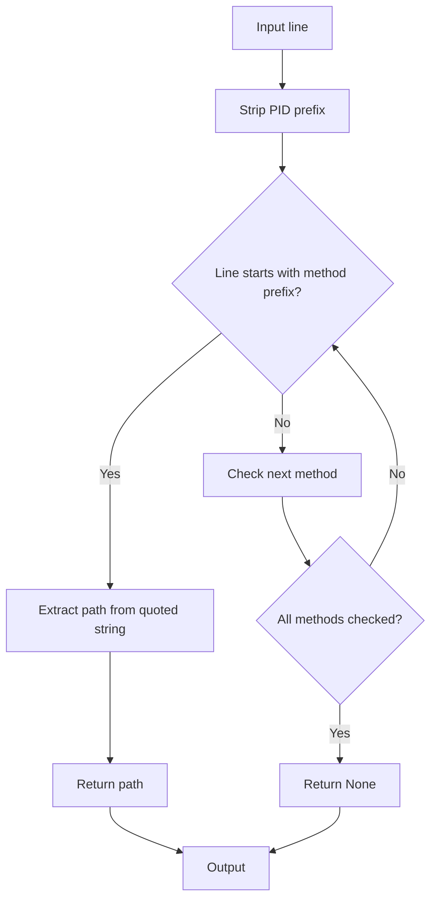

# `input_parsing.py`

## `src.exodus_bundler.input_parsing.extract_exec_path` · *function*

## Summary:
Extracts executable file paths from log lines containing method calls with quoted arguments.

## Description:
Processes log lines to identify and extract file paths from method invocations that follow the pattern "method_name(\"path\")". This function is designed to parse debugging output where executable paths are logged as arguments to various methods, removing process ID prefixes before attempting extraction. The function searches through a predefined list of execution-related methods to find matching patterns.

## Args:
    line (str): A log line that may contain a process ID prefix and method call with quoted path argument.

## Returns:
    str or None: The extracted file path if a matching method call pattern is found, otherwise None.

## Raises:
    None: This function does not explicitly raise exceptions.

## Constraints:
    Preconditions:
        - Input line must be a string
        - exec_methods global variable must be defined and contain method names to search for
    Postconditions:
        - Returns the first matched path from the first matching method in exec_methods, or None if no match found

## Side Effects:
    None: This function performs no I/O operations or external state mutations.

## Control Flow:


## Examples:
    >>> extract_exec_path('[pid 1234] execve("/bin/bash", ...)')
    '/bin/bash'
    >>> extract_exec_path('open("/etc/passwd", O_RDONLY)')
    '/etc/passwd'
    >>> extract_exec_path('No matching pattern here')
    None
```

## `src.exodus_bundler.input_parsing.extract_open_path` · *function*

## Summary:
Extracts file paths from system call log entries representing file opening operations.

## Description:
Processes log lines containing system call information to extract file paths from 'open' and 'openat' system calls. This function is designed to parse structured log output from debugging tools that record file access operations, filtering for read-only file opens while excluding error conditions and directory operations.

## Args:
    line (str): A log line potentially containing system call information in the format "openat(AT_FDCWD, \"path\", flags)" or "open(\"path\", flags)".

## Returns:
    str or None: The extracted file path if the line contains a valid read-only file open operation, or None if the line doesn't match the expected format or fails validation checks.

## Raises:
    None: This function does not explicitly raise exceptions.

## Constraints:
    Preconditions:
        - Input line must be a string
        - Line should contain system call information in the expected format
    Postconditions:
        - Returns either a valid file path string or None
        - Function preserves original line content during processing

## Side Effects:
    None: This function performs no I/O operations or external state mutations.

## Control Flow:
```mermaid
flowchart TD
    A[Input line] --> B[Strip PID prefix]
    B --> C{Starts with 'openat(AT_FDCWD, \"'?}
    C -- No --> D{Starts with 'open(\"'?}
    D -- No --> E[Return None]
    D -- Yes --> F[Split by "\", "]
    C -- Yes --> F
    F --> G{Parts count == 2?}
    G -- No --> E
    G -- Yes --> H{Contains ENOENT?}
    H -- Yes --> E
    H -- No --> I{Does not contain O_RDONLY?}
    I -- Yes --> E
    I -- No --> J{Contains O_DIRECTORY?}
    J -- Yes --> E
    J -- No --> K[Return path]
    K --> L[Output]
    E --> L
```

## Examples:
    >>> extract_open_path('[pid 1234] openat(AT_FDCWD, "/etc/passwd", O_RDONLY|O_CLOEXEC) = 3')
    '/etc/passwd'
    >>> extract_open_path('[pid 5678] open("/home/user/file.txt", O_RDONLY) = 4')
    '/home/user/file.txt'
    >>> extract_open_path('[pid 9999] openat(AT_FDCWD, "/nonexistent", O_RDONLY|O_CREAT|O_EXCL) = -2 (ENOENT)')
    None
    >>> extract_open_path('[pid 1111] open("/tmp/dir", O_RDONLY|O_DIRECTORY) = 5')
    None
```

## `src.exodus_bundler.input_parsing.extract_stat_path` · *function*

## Summary:
Extracts the file path from a log line representing a stat() system call operation.

## Description:
Parses log lines containing stat() system call invocations to extract the file path being operated on. This function handles log entries that begin with "stat(\"" followed by a file path and error information. It removes process ID prefixes and filters out entries indicating file not found errors (ENOENT).

## Args:
    line (str): A log line that may contain a stat() system call invocation in the format "stat(\"file_path\", error_info)".

## Returns:
    str or None: The extracted file path if the line matches the stat() pattern and does not indicate ENOENT error, otherwise None.

## Raises:
    None: This function does not explicitly raise exceptions.

## Constraints:
    Preconditions:
        - Input line must be a string
        - Input line should follow the format of a stat() system call log entry
    Postconditions:
        - Returns either a valid file path string or None
        - Function preserves the original line unchanged

## Side Effects:
    None: This function performs no I/O operations or external state mutations.

## Control Flow:
```mermaid
flowchart TD
    A[Input line] --> B[strip_pid_prefix(line)]
    B --> C{Starts with "stat(\""}
    C -- No --> D[Return None]
    C -- Yes --> E[Split on "\", "]
    E --> F{Length == 2 AND "ENOENT" not in second part}
    F -- No --> D
    F -- Yes --> G[Return first part (file path)]
```

## Examples:
    >>> extract_stat_path('[pid 1234] stat("/etc/passwd", 0)')
    '/etc/passwd'
    >>> extract_stat_path('[pid 5678] stat("/nonexistent", ENOENT)')
    None
    >>> extract_stat_path('Regular line without stat')
    None
```

## `src.exodus_bundler.input_parsing.extract_paths` · *function*

## Summary:
Extracts unique file paths from structured log content, filtering based on execution tracing patterns and optional existence checks.

## Description:
Processes multi-line log content to identify and extract file paths from system call traces, particularly those generated by strace or similar debugging tools. The function recognizes different logging formats for execve, open, and stat system calls, extracting paths from these structured entries. When in existing_only mode, it validates that extracted paths correspond to existing readable files, excluding directories and blacklisted locations.

## Args:
    content (str): Multi-line string containing system call trace logs with potential file paths
    existing_only (bool): When True, filters results to only include paths that exist and are readable files (default: True)

## Returns:
    list[str]: Unique list of file paths extracted from the content, filtered according to the existing_only flag and blacklisted directories

## Raises:
    None: This function does not explicitly raise exceptions

## Constraints:
    Preconditions:
        - Content must be a string
        - Helper functions (extract_exec_path, extract_open_path, extract_stat_path) must be defined
        - blacklisted_directories variable must be defined and contain directory paths to exclude
    Postconditions:
        - Returns a list of unique file paths (no duplicates)
        - All returned paths are valid file paths (not directories)
        - All returned paths are not in blacklisted directories

## Side Effects:
    None: This function performs no I/O operations or external state mutations

## Control Flow:
```mermaid
flowchart TD
    A[Input content] --> B[Split into lines and strip whitespace]
    B --> C{Any lines remaining?}
    C -- No --> D[Return empty list]
    C -- Yes --> E[Check if strace mode (first line has exec path)]
    E --> F{Not strace mode?}
    F -- Yes --> G[Return all lines as-is]
    F -- No --> H[Initialize empty paths set]
    H --> I[Process each line]
    I --> J[Extract path from line using helper functions]
    J --> K{Path found?}
    K -- No --> L[Continue to next line]
    K -- Yes --> M[Check if path is blacklisted]
    M --> N{Is blacklisted?}
    N -- Yes --> L
    N -- No --> O{existing_only=False?}
    O -- Yes --> P[Add path to set and continue]
    O -- No --> Q[Check if path exists, is readable, and not directory]
    Q --> R{Valid file?}
    R -- Yes --> P
    R -- No --> L
    P --> S[Continue to next line]
    L --> T{All lines processed?}
    T -- No --> I
    T -- Yes --> U[Convert set to list and return]
```

## Examples:
    >>> extract_paths('[pid 1234] execve("/bin/bash", ...)', existing_only=False)
    ['/bin/bash']
    >>> extract_paths('[pid 5678] open("/etc/passwd", O_RDONLY) = 3', existing_only=True)
    ['/etc/passwd']
    >>> extract_paths('No valid paths here')
    []
```

## `src.exodus_bundler.input_parsing.strip_pid_prefix` · *function*

## Summary:
Removes process ID prefix from log lines that start with "[pid XXX] " format.

## Description:
Extracts and strips process ID prefixes from log lines, commonly found in debugging output where each line is prefixed with "[pid XXX] " where XXX represents the process identifier. This function enables clean processing of log data by removing these metadata prefixes that interfere with further analysis.

## Args:
    line (str): Input log line that may contain a process ID prefix in the format "[pid XXX] " where XXX is a numeric process identifier.

## Returns:
    str: The input line with process ID prefix removed if present, otherwise returns the original line unchanged.

## Raises:
    None: This function does not raise any exceptions.

## Constraints:
    Preconditions:
        - Input must be a string
    Postconditions:
        - Output string will either be the original line or the line with leading process ID prefix stripped
        - Function preserves all content after the process ID prefix

## Side Effects:
    None: This function performs no I/O operations or external state mutations.

## Control Flow:
```mermaid
flowchart TD
    A[Input line] --> B{Matches pattern \\[pid\\s+\\d+\\]\\s*}
    B -- Yes --> C[Return line without prefix]
    B -- No --> D[Return original line]
    C --> E[Output]
    D --> E
```

## Examples:
    >>> strip_pid_prefix("[pid 1234] Hello world")
    'Hello world'
    >>> strip_pid_prefix("No prefix here")
    'No prefix here'
    >>> strip_pid_prefix("[pid 5678]   Multiple spaces")
    'Multiple spaces'
```

