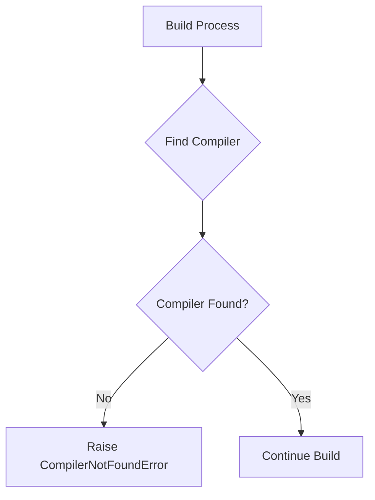
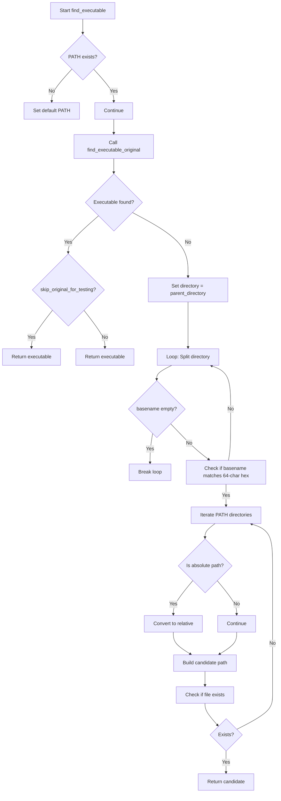
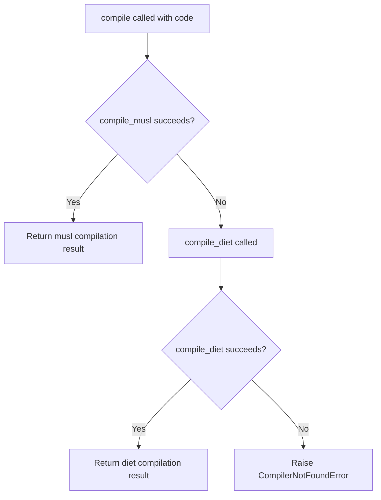
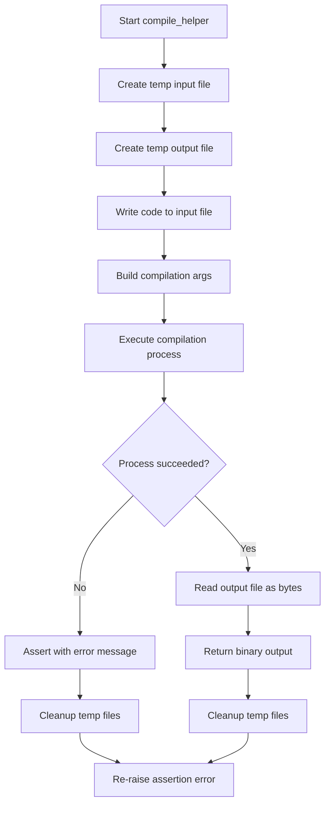
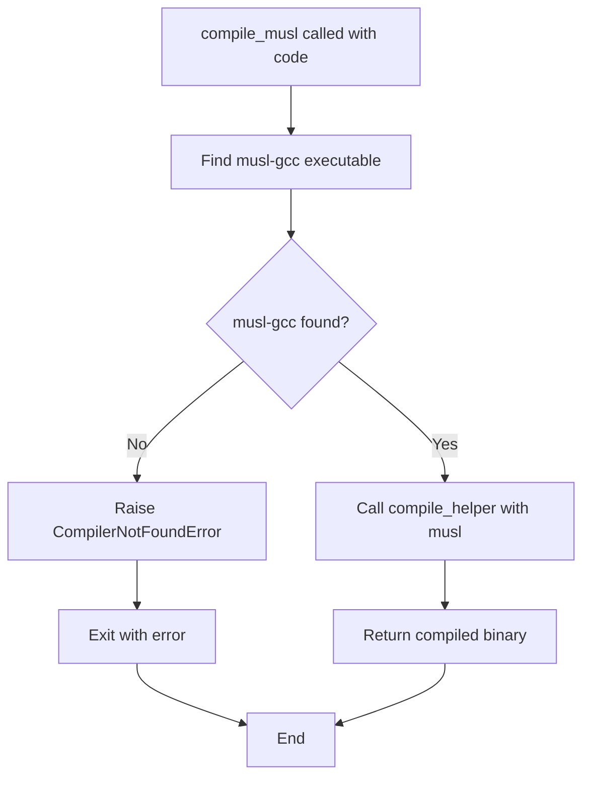
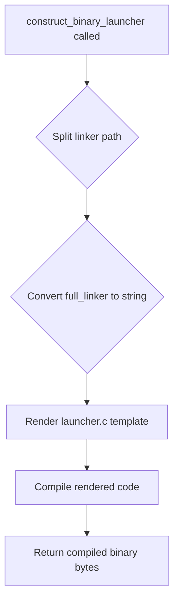

# `launchers.py`

## `src.exodus_bundler.launchers.CompilerNotFoundError` · *class*

## Summary:
Custom exception indicating that a required compiler could not be found during the build process.

## Description:
CompilerNotFoundError is a specialized exception that extends the built-in Exception class. It is raised when the system fails to locate a required compiler executable in the environment. This exception serves as a clear signal that compilation cannot proceed due to missing compiler tools, allowing calling code to handle this specific error condition appropriately.

## State:
- Inherits from: Exception
- No instance attributes or state: This is a minimal marker exception
- No initialization parameters: The constructor accepts no arguments beyond those inherited from Exception

## Lifecycle:
- Creation: Instantiated using standard exception construction: `raise CompilerNotFoundError()` or `raise CompilerNotFoundError(message)`
- Usage: Raised during build or compilation processes when compiler detection fails
- Destruction: Handled by Python's normal exception handling mechanisms

## Method Map:


## Raises:
- CompilerNotFoundError: Raised when a required compiler cannot be located in the system PATH or specified locations

## Example:
```python
try:
    # Some operation that requires a compiler
    if not compiler_exists():
        raise CompilerNotFoundError("Required compiler not found")
except CompilerNotFoundError as e:
    # Handle missing compiler scenario
    log_error(f"Build failed: {e}")
```

## `src.exodus_bundler.launchers.find_executable` · *function*

## Summary:
Finds an executable binary by first checking standard paths, then searching in a hierarchical directory structure with 64-character hexadecimal directory names.

## Description:
This function attempts to locate an executable binary by first using the standard system PATH search, falling back to a custom search algorithm that traverses parent directories looking for 64-character hexadecimal directory names. This is likely used in a packaging or bundling context where executables may be located in specific directory structures.

The implementation contains critical bugs:
- References `find_executable_original` which is not defined in the scope
- References `parent_directory` which is not defined in the scope

The intended behavior is to use the standard `find_executable` from distutils as the primary search method, with a fallback search mechanism for special directory structures.

## Args:
    binary_name (str): Name of the executable to find
    skip_original_for_testing (bool): If True, skips the initial standard PATH search and goes directly to the custom search. Defaults to False.

## Returns:
    str or None: Path to the executable if found, None otherwise

## Raises:
    None explicitly raised

## Constraints:
    Preconditions:
    - binary_name must be a non-empty string
    - PATH environment variable should be accessible
    
    Postconditions:
    - Returns either a valid file path or None
    - Does not modify system state except potentially setting PATH environment variable

## Side Effects:
    - May modify os.environ['PATH'] if it doesn't exist
    - Performs filesystem operations to check for file existence

## Control Flow:


## Examples:
    # Find python executable using standard search
    exe_path = find_executable('python')
    
    # Skip standard search and use custom search only
    exe_path = find_executable('my_binary', skip_original_for_testing=True)

## `src.exodus_bundler.launchers.compile` · *function*

## Summary:
Attempts to compile C source code using multiple compiler strategies in fallback order, returning the compiled binary output.

## Description:
The compile function implements a robust compilation strategy that tries multiple compiler backends in sequence. It first attempts to compile using the musl compiler, falling back to the diet compiler if that fails, and finally raises an exception if neither compiler is available. This design allows the system to work across different environments with varying compiler availability while providing clear error messages when compilation cannot proceed.

## Args:
    code (str): The C source code to compile as a string

## Returns:
    bytes: The compiled binary output as raw bytes, representing the executable program

## Raises:
    CompilerNotFoundError: When no suitable C compiler can be found in the system PATH, specifically when both musl-gcc and diet compilers are unavailable

## Constraints:
    Preconditions:
        - The code parameter must contain valid C source code that can be compiled
        - At least one of the supported compilers (musl-gcc or diet) must be installed and available in the system PATH
    
    Postconditions:
        - The returned bytes represent a valid compiled binary executable
        - If successful, exactly one compilation strategy is executed (either musl or diet)

## Side Effects:
    - May create temporary files during compilation (handled by underlying compile functions)
    - Executes external compilation processes via subprocess (handled by underlying compile functions)
    - Removes temporary files after execution (handled by underlying compile functions)

## Control Flow:


## Examples:
```python
# Basic usage with valid C code
code = '''
#include <stdio.h>
int main() {
    printf("Hello World\\n");
    return 0;
}
'''

try:
    binary = compile(code)
    # binary contains the compiled executable as bytes
    print("Compilation successful")
except CompilerNotFoundError as e:
    print(f"Compilation failed: {e}")

# Example showing fallback behavior
# If musl-gcc is not found, it will attempt diet compiler
# If diet compiler is also not found, it raises CompilerNotFoundError
```

## `src.exodus_bundler.launchers.compile_diet` · *function*

## Summary:
Compiles C source code using the diet compiler and gcc linker to produce a static binary executable.

## Description:
The compile_diet function provides a specialized compilation pathway that leverages the diet compiler, a lightweight C compiler designed to produce smaller binaries. This function acts as a wrapper that ensures both the diet compiler and gcc linker are available before attempting compilation. It specifically targets systems where diet compiler support is desired for creating compact executables.

## Args:
    code (str): The C source code to compile as a string

## Returns:
    bytes: The compiled binary output as raw bytes, representing the executable program

## Raises:
    CompilerNotFoundError: Raised when either the 'diet' or 'gcc' compiler executable cannot be found in the system PATH

## Constraints:
    Preconditions:
        - The 'diet' compiler must be installed and available in the system PATH
        - The 'gcc' compiler must be installed and available in the system PATH
        - The provided code parameter must contain valid C source code
    
    Postconditions:
        - The returned bytes represent a valid compiled binary executable
        - No temporary files are left behind (handled by compile_helper)

## Side Effects:
    - Creates temporary files in the system's temporary directory (via compile_helper)
    - Executes external compilation process via subprocess (via compile_helper)
    - Removes temporary files after execution (handled by compile_helper)

## Control Flow:
```mermaid
flowchart TD
    A[compile_diet called] --> B{diet executable found?}
    B -->|No| C[Raise CompilerNotFoundError]
    B -->|Yes| D{gcc executable found?}
    D -->|No| E[Raise CompilerNotFoundError]
    D -->|Yes| F[Call compile_helper with [diet, 'gcc']]
    F --> G[Return binary output]
```

## Examples:
```python
# Basic usage with simple C code
code = '''
#include <stdio.h>
int main() {
    printf("Hello World\\n");
    return 0;
}
'''

try:
    binary = compile_diet(code)
    # binary contains the compiled executable as bytes
    print("Compilation successful")
except CompilerNotFoundError as e:
    print(f"Missing compiler: {e}")
```

## `src.exodus_bundler.launchers.compile_helper` · *function*

## Summary:
Compiles C source code into a static binary executable using temporary files and subprocess execution.

## Description:
This function serves as a helper for compiling C code into executable binaries. It creates temporary files for input and output, writes the provided C code to a temporary .c file, executes a compilation command with specified arguments plus static linking and optimization flags, and returns the resulting binary output. The function ensures proper cleanup of temporary files regardless of success or failure.

## Args:
    code (str): The C source code to compile as a string
    initial_args (list[str]): Command-line arguments to pass to the compiler (excluding internal flags)

## Returns:
    bytes: The compiled binary output as raw bytes

## Raises:
    AssertionError: When the compilation process exits with a non-zero return code, containing the compilation error message

## Constraints:
    Preconditions:
        - The `initial_args` list must contain a valid compiler command (like 'gcc' or 'clang')
        - The system must have the specified compiler available in PATH
        - The `code` parameter must contain valid C source code
    
    Postconditions:
        - Temporary input and output files are deleted after execution
        - The returned bytes represent a valid compiled binary

## Side Effects:
    - Creates temporary files in the system's temporary directory
    - Executes external compilation process via subprocess
    - Removes temporary files after execution

## Control Flow:


## Examples:
```python
# Basic usage
code = '''
#include <stdio.h>
int main() {
    printf("Hello World\\n");
    return 0;
}
'''

# Compile with gcc
args = ['gcc']
binary = compile_helper(code, args)

# Compile with clang
args = ['clang']
binary = compile_helper(code, args)
```

## `src.exodus_bundler.launchers.compile_musl` · *function*

## Summary:
Compiles C source code into a statically-linked binary using the musl libc compiler.

## Description:
This function provides a specialized compilation interface that uses the musl-gcc compiler to produce statically-linked executables. It first verifies the presence of the musl-gcc executable in the system PATH, raising a CompilerNotFoundError if not found, then delegates to the general compile_helper function with musl-specific compilation arguments.

## Args:
    code (str): The C source code to compile as a string

## Returns:
    bytes: The compiled binary output as raw bytes, representing the statically-linked executable

## Raises:
    CompilerNotFoundError: When the musl-gcc compiler executable cannot be found in the system PATH

## Constraints:
    Preconditions:
        - The musl-gcc compiler must be installed and available in the system PATH
        - The code parameter must contain valid C source code that can be compiled with musl-gcc
    
    Postconditions:
        - The returned bytes represent a valid compiled binary executable
        - No temporary files are left behind (handled by compile_helper)

## Side Effects:
    - None directly observable (all temporary file management is handled by compile_helper)

## Control Flow:


## Examples:
```python
# Basic usage for compiling a simple C program
code = '''
#include <stdio.h>
int main() {
    printf("Hello World\\n");
    return 0;
}
'''

try:
    binary = compile_musl(code)
    # Use the binary as needed
    print(f"Compiled binary size: {len(binary)} bytes")
except CompilerNotFoundError as e:
    print(f"Compilation failed: {e}")
```

## `src.exodus_bundler.launchers.construct_bash_launcher` · *function*

## Summary:
Generates a bash launcher script by rendering a template with linker and execution parameters.

## Description:
This function creates a bash launcher script by processing a template file ('launcher.sh') with the provided parameters. It separates the linker path into directory and basename components and converts the boolean full_linker flag to a string representation for template substitution.

The function serves as a factory for bash launcher scripts that can wrap executable commands with appropriate library paths and linker configurations. This modular approach enables consistent launcher script generation while allowing flexible configuration through parameters.

## Args:
    linker (str): Absolute or relative path to the linker executable
    library_path (str): Library path to be included in the launcher environment
    executable (str): The executable to be invoked by the generated launcher script
    full_linker (bool): Flag indicating whether to use full linker path in the script. Defaults to True

## Returns:
    str: Rendered bash script content with template variables substituted

## Raises:
    FileNotFoundError: When the 'launcher.sh' template file cannot be located
    IOError: When there are file system errors during template reading

## Constraints:
    Preconditions:
        - linker must be a valid string path
        - library_path must be a valid string
        - executable must be a valid string
        - 'launcher.sh' template file must exist in the template directory
    
    Postconditions:
        - Returns a complete bash script string
        - Template variables are properly substituted with provided values

## Side Effects:
    - Reads the 'launcher.sh' template file from disk
    - May raise file system related exceptions if template is inaccessible

## Control Flow:
```mermaid
flowchart TD
    A[Start construct_bash_launcher] --> B[Split linker path into dirname and basename]
    B --> C[Convert full_linker bool to string ('true'/'false')]
    C --> D[Call render_template_file with template 'launcher.sh']
    D --> E[Substitute template variables with provided values]
    E --> F[Return rendered script]
```

## Examples:
```python
# Basic usage
launcher_script = construct_bash_launcher(
    linker="/usr/bin/gcc",
    library_path="/opt/mylib",
    executable="/path/to/myprogram"
)

# Disable full linker path
launcher_script = construct_bash_launcher(
    linker="/usr/bin/gcc",
    library_path="/opt/mylib",
    executable="/path/to/myprogram",
    full_linker=False
)
```

## `src.exodus_bundler.launchers.construct_binary_launcher` · *function*

## Summary:
Constructs a binary launcher by rendering a C template and compiling it into an executable binary.

## Description:
Generates a C-based launcher binary that can execute a target program with specified linking parameters. This function is responsible for creating executable launchers that encapsulate linking information and runtime execution details.

The function extracts directory and basename from the linker path, prepares configuration parameters, renders a C template file ('launcher.c'), and compiles the resulting code into a binary executable. This approach enables dynamic creation of launchers with specific linking behaviors.

## Args:
    linker (str): Path to the linker executable, used to extract directory and basename for template rendering
    library_path (str): Path to the library directory that will be used during execution
    executable (str): Path to the target executable that the launcher will invoke
    full_linker (bool): Flag indicating whether to use full linker features. Defaults to True. When False, uses minimal linker configuration.

## Returns:
    bytes: Compiled binary executable as raw bytes, representing the launcher program

## Raises:
    CompilerNotFoundError: When no suitable C compiler can be found in the system PATH, specifically when both musl-gcc and diet compilers are unavailable

## Constraints:
    Preconditions:
        - The linker parameter must be a valid path to an existing linker executable
        - The library_path parameter must be a valid directory path
        - The executable parameter must be a valid path to an existing executable
        - At least one of the supported compilers (musl-gcc or diet) must be installed and available in the system PATH
    
    Postconditions:
        - The returned bytes represent a valid compiled binary executable
        - The launcher binary will execute the specified executable with the provided library path

## Side Effects:
    - May create temporary files during compilation (handled by underlying compile functions)
    - Executes external compilation processes via subprocess (handled by underlying compile functions)
    - Removes temporary files after execution (handled by underlying compile functions)

## Control Flow:


## Examples:
```python
# Basic usage to create a launcher
launcher_binary = construct_binary_launcher(
    linker="/usr/bin/gcc",
    library_path="/opt/myapp/lib",
    executable="/opt/myapp/bin/myprogram"
)

# Usage with minimal linker configuration
minimal_launcher = construct_binary_launcher(
    linker="/usr/bin/ld",
    library_path="/lib",
    executable="/bin/bash",
    full_linker=False
)
```

