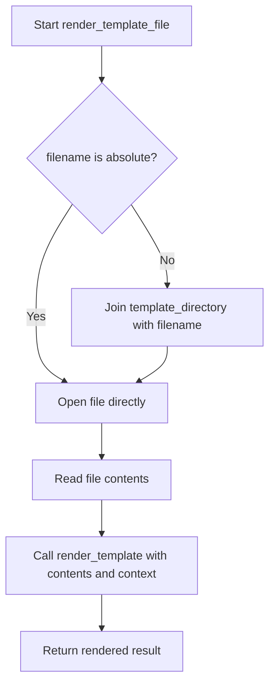

# `templating.py`

## `src.exodus_bundler.templating.render_template` · *function*

## Summary:
Replaces template placeholders in a string with corresponding values from a context dictionary.

## Description:
Processes a string containing template placeholders in the format `{{key}}` and substitutes them with values from the provided context. This function enables basic string templating functionality for dynamic content generation.

## Args:
    string (str): The input string containing template placeholders in `{{key}}` format.
    **context (dict): Keyword arguments mapping placeholder names to their replacement values.

## Returns:
    str: The input string with all matching placeholders replaced by their corresponding context values. If a placeholder key is not found in context, the placeholder remains unchanged in the output string.

## Raises:
    None explicitly raised.

## Constraints:
    Preconditions:
    - The input string must be a valid string object.
    - All keys in context must be strings that can be safely used in string replacement operations.
    
    Postconditions:
    - The returned string will have all matching placeholders replaced.
    - If a placeholder key is not found in context, it remains unchanged in the output string.
    - Replacement occurs sequentially, with later replacements potentially affecting earlier ones if there are overlapping patterns.

## Side Effects:
    None.

## Control Flow:
```mermaid
flowchart TD
    A[Start render_template] --> B{string is valid?}
    B -- Yes --> C[Iterate through context items]
    C --> D{Key exists in string?}
    D -- Yes --> E[Replace {{key}} with value]
    E --> F[Update string]
    F --> G{More context items?}
    G -- Yes --> C
    G -- No --> H[Return processed string]
    B -- No --> I[Return original string]
```

## Examples:
    Basic usage:
    ```python
    result = render_template("Hello {{name}}!", name="World")
    # Returns: "Hello World!"
    ```

    Multiple placeholders:
    ```python
    result = render_template("{{greeting}} {{name}}! Today is {{day}}.", 
                            greeting="Good morning", name="Alice", day="Monday")
    # Returns: "Good morning Alice! Today is Monday."
    ```

    Missing placeholder:
    ```python
    result = render_template("Hello {{name}}! Welcome to {{place}}.", 
                            name="Bob")
    # Returns: "Hello Bob! Welcome to {{place}}."
    ```

## `src.exodus_bundler.templating.render_template_file` · *function*

## Summary:
Reads a template file and renders it with provided context variables.

## Description:
Loads a template file from disk, reads its contents, and processes it through the template rendering engine with the provided context. This function serves as a bridge between file-based template storage and the in-memory template processing logic.

## Args:
    filename (str): Path to the template file. Can be either absolute or relative to the template directory.
    **context (dict): Keyword arguments containing key-value pairs to substitute in the template.

## Returns:
    str: The rendered template content with all placeholders replaced by their corresponding context values.

## Raises:
    FileNotFoundError: When the specified template file cannot be found at the given path.

## Constraints:
    Preconditions:
    - The filename parameter must be a valid string representing a file path.
    - The template_directory module-level variable must be defined and point to a valid directory.
    - The template file must exist at the resolved file path.
    
    Postconditions:
    - The returned string contains the fully rendered template content.
    - The function does not modify any external state beyond reading the template file.

## Side Effects:
    - Reads from the filesystem to load the template file.
    - May perform path manipulation to resolve relative paths against template_directory.

## Control Flow:


## Examples:
Basic usage:
```python
# Assuming template_directory = "/path/to/templates"
result = render_template_file("welcome.txt", name="Alice", age=30)
# Reads /path/to/templates/welcome.txt and renders it with name and age context
```

Relative path resolution:
```python
# With template_directory = "/templates"
result = render_template_file("emails/signup.html", user_email="test@example.com")
# Resolves to /templates/emails/signup.html and renders it
```

