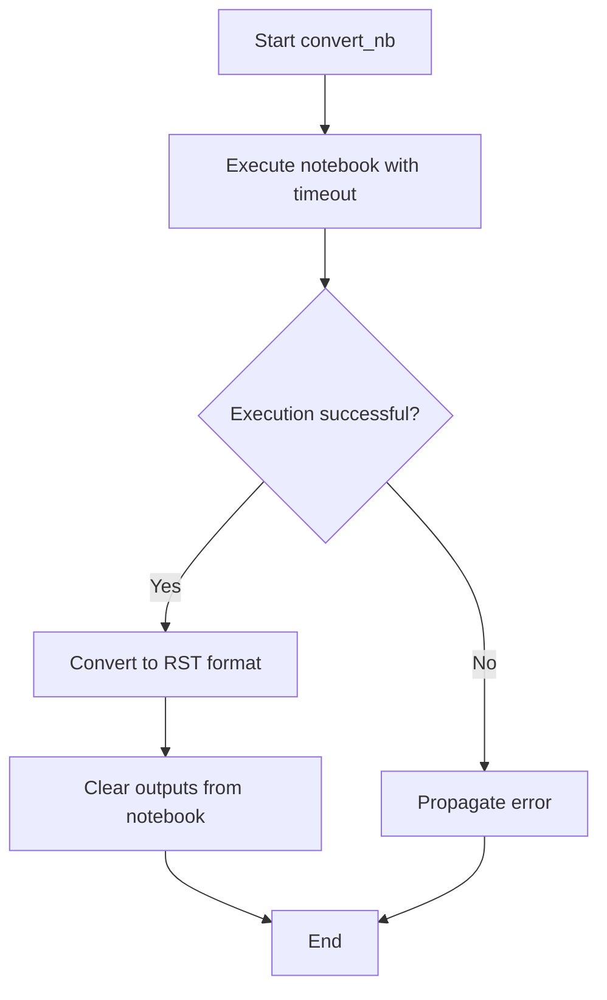

# `nb_to_doc.py`

## `docs.tutorials.tools.nb_to_doc.convert_nb` · *function*

## Summary:
Processes a Jupyter notebook through execution, RST conversion, and output clearing operations.

## Description:
Executes a Jupyter notebook with timeout, converts it to reStructuredText format, and clears cell outputs from the original notebook file. This utility function is designed to prepare Jupyter notebooks for documentation generation workflows by ensuring proper execution, format conversion, and cleanup of execution artifacts.

## Args:
    nbname (str): Name of the notebook file (without .ipynb extension) to process

## Returns:
    None: This function does not return any value

## Raises:
    subprocess.CalledProcessError: If any of the nbconvert subprocess commands fail during execution

## Constraints:
    Preconditions:
    - The notebook file must exist with the name {nbname}.ipynb
    - Jupyter nbconvert must be installed and available in the system PATH
    - The user must have appropriate permissions to read/write the notebook file
    
    Postconditions:
    - The original notebook file will be modified in-place during execution and output clearing
    - An RST version of the notebook will be created alongside the original
    - All cell outputs will be cleared from the original notebook file

## Side Effects:
    - Modifies the original notebook file in-place during execution and output clearing
    - Creates a new RST file with the same base name as the notebook
    - Executes the notebook, potentially running code contained within it
    - Makes subprocess calls to external jupyter nbconvert commands

## Control Flow:

## Examples:
    # Process a notebook named "example_notebook"
    convert_nb("example_notebook")
    
    # This will:
    # 1. Execute example_notebook.ipynb with 60s timeout
    # 2. Create example_notebook.rst from the executed notebook
    # 3. Modify example_notebook.ipynb to remove all cell outputs

