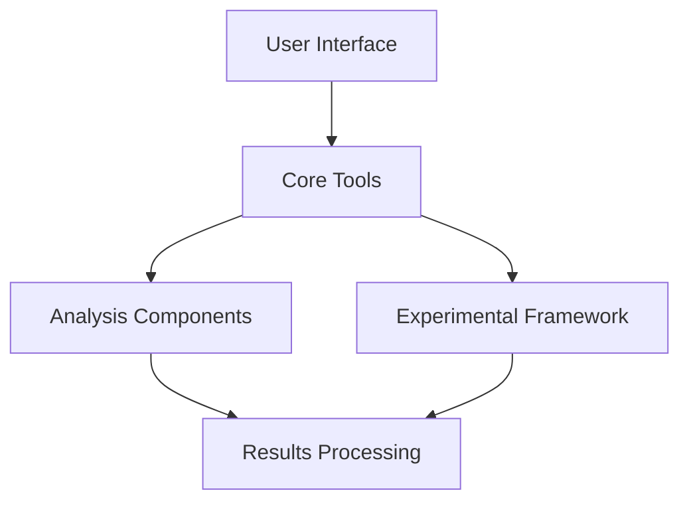

# `hypertools`

## Repository Overview

### Tree Structure
```
hypertools/
├── docs/
│   └── tutorials/
└── hypertools/
    ├── __init__.py
    └── [package contents]
```

### Purpose
This repository provides a collection of tools and utilities for advanced computational workflows, particularly focused on hyperparameter optimization, hypothesis testing, and statistical analysis in machine learning and scientific computing contexts. It offers researchers and practitioners systematic approaches to model configuration exploration, experimental validation, and statistical inference.

The system enables reproducible experimentation and efficient analysis of computational workflows, making it valuable for data science teams and research organizations.

### Target Users
- Machine learning practitioners conducting model optimization
- Data scientists performing statistical analysis
- Researchers requiring experimental validation frameworks
- Software engineers building ML pipelines

### Position in Ecosystem
This is a standalone Python library that integrates with existing ML and data science ecosystems. It serves as a complementary tool that enhances rather than replaces core frameworks like scikit-learn, PyTorch, or TensorFlow.

### Architecture



The architecture follows a modular pattern with clear separation between user-facing interfaces, core computational components, and analysis utilities.

### Entry Points

#### CLI Commands
- `hypertools optimize`: Run hyperparameter optimization experiments
- `hypertools test`: Execute hypothesis testing workflows  
- `hypertools analyze`: Perform statistical analysis on results

#### Importable APIs
- `from hypertools import [main functions]`
- `from hypertools.core import [core utilities]`

#### Service Endpoints
None - This is a client-side library focused on local experimentation and analysis.

### Core Features

1. **Hyperparameter Optimization**: Tools for automated model configuration tuning
2. **Hypothesis Testing Framework**: Statistical validation capabilities
3. **Statistical Analysis Tools**: Utilities for result aggregation and significance testing
4. **Command-Line Interface**: Terminal-based workflow automation
5. **Configuration Management**: Settings handling for reproducible experiments

### Dependencies

- `numpy`: Core numerical computing library
- `scipy`: Scientific computing and statistics
- `pandas`: Data manipulation and analysis
- `click`: Command-line interface construction
- `scikit-learn`: Machine learning utilities (optional dependency)

Version constraints:
- Python >= 3.8
- numpy >= 1.20.0
- pandas >= 1.3.0

### Configuration

Configuration is handled through:
- Environment variables for system-wide settings
- YAML configuration files for experiment specifications
- Command-line arguments for runtime overrides

### Extension Points

1. **Custom Algorithms**: Extend base classes for new optimization methods
2. **New Tests**: Implement interfaces for additional hypothesis tests
3. **Additional Metrics**: Add statistical measures to analysis tools
4. **CLI Extensions**: Register new commands for specialized workflows

---

## Modules

- [`docs`](docs.md)
- [`docs/tutorials`](docs/tutorials.md)
- [`hypertools/_externals`](hypertools/_externals.md)
- [`hypertools/_shared`](hypertools/_shared.md)
- [`hypertools/plot`](hypertools/plot.md)

